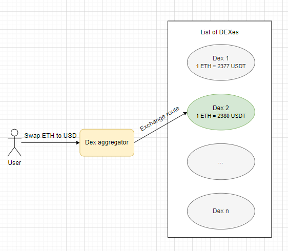
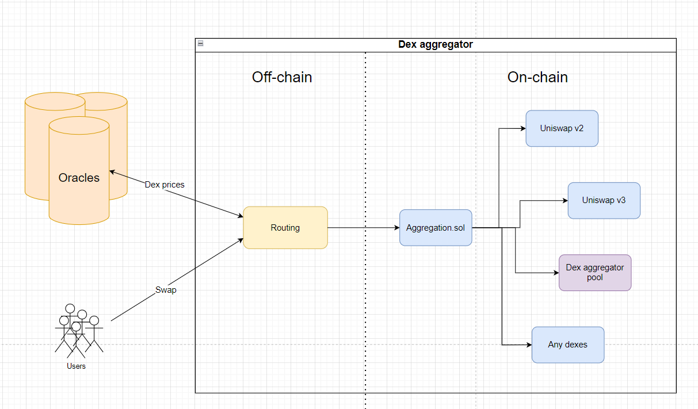
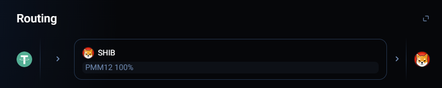
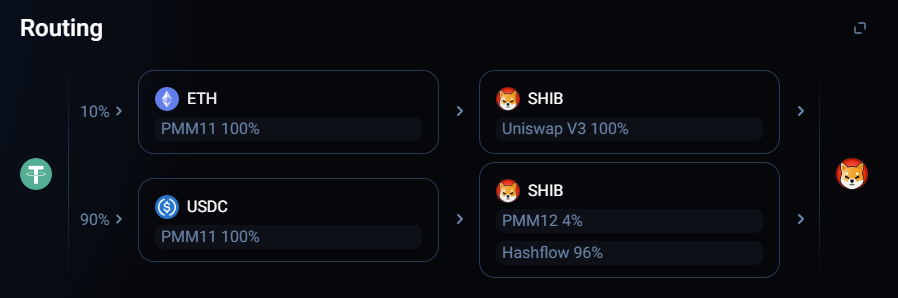
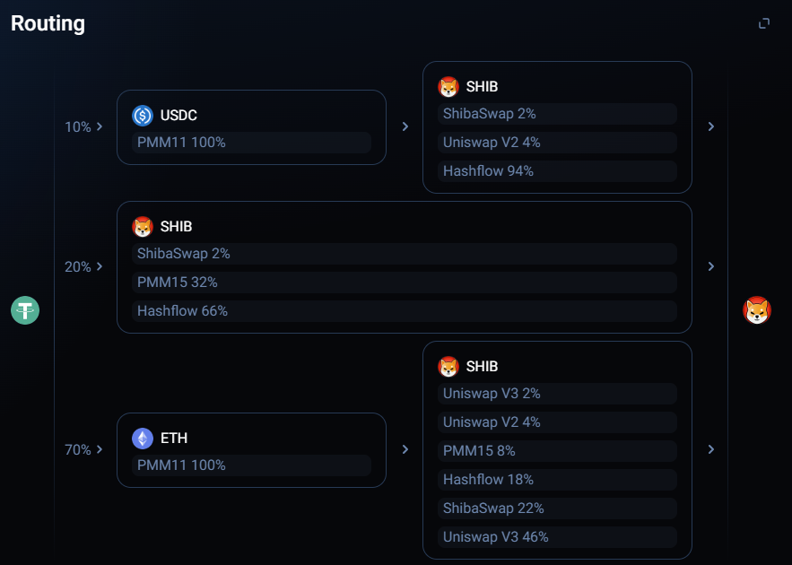

# DEX Aggregators

**Author:** [Pavel Naydanov](https://github.com/PavelNaydanov) 🕵️‍♂️

_Watch out!_ **DEX Aggregator** is a type of cryptocurrency exchange that provides users access to liquidity across multiple [DEXs](https://www.coinbase.com/learn/crypto-basics/what-is-a-dex) (decentralized exchanges). Essentially, it acts as an intermediary that connects users to protocols offering their liquidity, hence it's also known as a **liquidity aggregator**. By pooling liquidity from various DEXs, these aggregators offer users the best rates for asset exchanges in one interface.

**DEX aggregators** came into the spotlight with the advent of the first protocol, [1inch](https://1inch.io/), in 2019, created by Sergey Kunz and Anton Bukov during the 18-hour ETHNewYork hackathon.

_Important!_ The main task of a DEX aggregator is to find the best price for an asset exchange in the shortest time possible.

## How does an aggregator work?

Like with regular DEXs, users need to use a [wallet](https://academy.binance.com/en/articles/crypto-wallet-types-explained) to interact with aggregators. The wallet is used to sign transactions when exchanging one asset for another.

Aggregators serve as a **single entry point** for users who need to exchange one asset for another most advantageously. To determine the most favorable deal, aggregators need to accurately choose the right DEX.

For the user, the process of exchanging assets through an aggregator looks like this:

1. The user sends an **exchange request** to the aggregator.
2. The aggregator **queries** the DEXs it works with for the **exchange price**.
3. The aggregator **calculates** the most **profitable exchange route** (choosing a specific exchange or even a chain of exchanges).
4. The aggregator **prepares the route**, as an unsigned transaction, waiting for the user's approval.
5. The user **approves** the route and **signs** the transaction.
6. The aggregator's **smart contract** atomically **executes** the signed transaction, taking the user's first asset.
7. The user **receives** the second (desired) **asset** in their wallet.

Diagrammatically, the exchange of Ether for the stablecoin USDT:



The user plans to exchange ETH for USDT. The DEX aggregator queries the cost of the USDT asset across all decentralized exchanges and selects the one with the most favorable price. In our case, it’s `Dex 2`, which returns more USDT than the other DEXs the aggregator works with. Thus, the actual exchange of ETH for USDT happens on `Dex 2`.

The process of route building is key and the most complex in the aggregator. The routing algorithm must consider cost, liquidity, trading volume of each DEX, transaction costs, and similar factors.

Under the hood, an aggregator might be structured as follows:



According to the scheme, we can outline the life cycle of asset exchange through an aggregator:
1. **Exchange request.** The user sends exchange data: addresses of two tokens, the amount to be debited from the first token, the desired amount of the second token (the token to be received in return), etc.
2. **Routing.** The magic of finding the optimal exchange route occurs in the `Routing` module, which is implemented off-chain (outside the network). This module takes the user's initial exchange request and determines the most optimal route. This may require obtaining current prices from oracles or directly from decentralized exchanges, depending on the situation and implementation options. Integrating the aggregator with each new exchange may require different interaction concepts.
3. **Sending the transaction to the `Aggregation.sol` contract.** This protocol contract (for serious aggregators - a set of contracts) conducts the exchange of assets on the decentralized exchange identified by the `Routing` module as the most profitable.
4. **Asset exchange.** The physical exchange of assets occurs directly on the contracts of the chosen decentralized exchange.

# DEX Aggregators

**Author:** [Pavel Naydanov](https://github.com/PavelNaydanov) 🕵️‍♂️

_Oops!_ **DEX Aggregator** is a type of cryptocurrency exchange that, in addition to searching for a profitable DEX, implements auxiliary functions for maximizing profit:
- **Distributing the exchange amount among several DEXs**. Part of the amount can be exchanged on one DEX, and part on another. This can yield the greatest benefit compared to exchanging the entire amount on one DEX.
- **Creating their own liquidity**. This could involve supporting liquidity pools on existing DEXs or creating their own pools. Such an approach helps reduce [price slippage](https://academy.binance.com/en/articles/impermanent-loss-explained) and the aggregator's risks in forming the final price.

_Important!_ One might think that integrating each decentralized exchange requires the aggregator to implement new functionality (new smart contracts, new code). However, it's not entirely so. Most exchanges use an interface similar to [Uniswap](https://uniswap.org/) (because they are forks). Therefore, if aggregator contracts can handle asset exchanges through Uniswap v2, Uniswap V3, they automatically support a number of other decentralized exchanges (for example [Pancakeswap](https://pancakeswap.finance/)).

## 1inch

Let's take a detailed look at this protocol since it is the most popular and effective among aggregators. At the time of writing, the TVL is $4.71 million.

[1inch](https://1inch.io/) - A protocol that offers access to hundreds of liquidity sources across various blockchains. It provides several unique products that enable instant or delayed asset exchanges. Moreover, [1inch Fusion Mode](https://docs.1inch.io/docs/fusion-swap/introduction) offers the possibility for gas-free exchanges with guaranteed security from front-running attacks by default.

**1inch** advises using APIs for exchanges. Moreover, the public API is currently considered outdated and it is recommended to follow the documentation on the developer portal.

### Routing

In the 1inch protocol, routing is handled by an advanced algorithm for discovering the most profitable asset exchange routes. The algorithm is called [Pathfinder](https://docs.1inch.io/docs/aggregation-protocol/introduction#). Little is known about this part of 1inch, the information is not public and the documentation does not reveal all the nuances of the algorithm's success.

You can observe how the route of exchanging the USDT token for SHIB changes in the classic exchange mode.


*Exchange of 10,000 USDT for the SHIB token*

> All 100% of USDT will be exchanged in one liquidity source.


*Exchange of 100,000 USDT for the SHIB token*

> 10% of USDT will be exchanged for ETH and only then ETH for the SHIB token. 90% of USDT will be exchanged for USDC and only then for SHIB, but in two liquidity sources (PMM12 and Hashflow).


*Exchange of 1,000,000 USDT for the SHIB token*

> Try to trace the exchange route yourself.

_Important!_ Pay attention to the acronym **PMM**. In 1inch, this stands for "Private Market Makers". These are organizations that execute the user's exchange using the 1inch [API](https://1inch.io/en/page-api/). Usually, PMM operates with CEX, but it can trade on DEX, offering [RFQ](https://en.wikipedia.org/wiki/Request_for_quotation) functions.

Working with PMM proceeds as follows:
1. An order is placed (exchange order).
2. The protocol queries the PMM, asking if it is ready to make the exchange.
3. PMM may find it profitable to execute the deal, as it can resell the asset with a profit on another platform or protocol.

### Aggregation Contract

Unlike routing, dealing with smart contracts is much simpler. The addresses of the Aggregation Protocol contracts are publicly disclosed:
- [AggregationRouterV4](https://etherscan.io/address/0x1111111254fb6c44bAC0beD2854e76F90643097d#code)
- [AggregationRouterV5](https://etherscan.io/address/0x1111111254EEB25477B68fb85Ed929f73A960582#code)

For ease of reference, these smart contracts are copied into the repository:
- [AggregationRouterV4.sol](./contracts/AggregationRouterV4.sol)
- [AggregationRouterV5.sol](./contracts/AggregationRouterV5.sol)

Let's take a closer look at the smart contract
`AggregationRouterV4.sol`.

```solidity
contract AggregationRouterV4 is Ownable, EthReceiver, Permitable, UnoswapRouter, UnoswapV3Router, LimitOrderProtocolRFQ, ClipperRouter {
    ...
}
```

It inherits from a number of contracts:
- `Ownable` is a standard contract from the OpenZeppelin library. It adds an owner to the contract. Several functions will be available for calling only by the owner.
- `EthReceiver` prohibits direct ether transfers to the contract.
    ```solidity
    abstract contract EthReceiver {
        receive() external payable {
            require(msg.sender != tx.origin, "ETH deposit rejected");
        }
    }
    ```
- `Permitable` allows replacing the `approve()` check with a user signature verification for ERC-20 tokens that support the *permit* functionality.
- `UnoswapRouter` is responsible for exchanges on platforms that support the UniswapV2 interface.
- `UnoswapV3Router` is responsible for exchanges on platforms that support the UniswapV3 interface.
- `LimitOrderProtocolRFQ` allows for delayed exchanges through the partial or full execution of orders. To do this, it is necessary to trace the chain of function calls
`fillOrderRFQ()` or `fillOrderRFQToWithPermit()`.
    ```solidity
    function fillOrderRFQ(
        OrderRFQ memory order,
        bytes calldata signature,
        uint256 makingAmount,
        uint256 takingAmount
    ) external payable returns(uint256 /* actualMakingAmount */, uint256 /* actualTakingAmount */) {
        return fillOrderRFQTo(order, signature, makingAmount, takingAmount, payable(msg.sender));
    }
    ```
- `ClipperRouter` is another integration of the aggregator with [Clipper dex](https://clipper.exchange/), which allows for asset exchanges.

In the `AggregationRouterV4.sol` contract itself, three functions are implemented:
- `rescueFunds()`
- `destroy()`
- `swap()`

The `rescueFunds()` and `destroy()` functions are available for calling only by the owner of the smart contract. The first allows the withdrawal of ERC-20 tokens (necessary for returning tokens accidentally sent to the contract or for service needs), while the second destroys the `AggregationRouterV4.sol` smart contract instance, erasing all data from the blockchain and sending all remaining ether to the contract's owner.

Particular interest here is in the `swap()` function.

```solidity
function swap(
    IAggregationExecutor caller,
    SwapDescription calldata desc,
    bytes calldata data
)
    external
    payable
    returns (
        uint256 returnAmount,
        uint256 spentAmount,
        uint256 gasLeft
    )
{
    ...

    /// Withdraw tokens from the caller. Supports permit
    if (!srcETH) {
        _permit(address(srcToken), desc.permit);
        srcToken.safeTransferFrom(msg.sender, desc.srcReceiver, desc.amount);
    }

    /// swap
    {
        bytes memory callData = abi.encodePacked(caller.callBytes.selector, bytes12(0), msg.sender, data);
        (bool success, bytes memory result) = address(caller).call{value: msg.value}(callData);
        if (!success) {
            revert(RevertReasonParser.parse(result, "callBytes failed: "));
        }
    }

    returnAmount = dstToken.uniBalanceOf(address(this));

    ...

    /// Sending of the token to a recipient
    address payable dstReceiver = (desc.dstReceiver == address(0)) ? msg.sender : desc.dstReceiver;
    dstToken.uniTransfer(dstReceiver, returnAmount);
}
```

It turns out that for exchanging on any of the DEXs supporting Uniswap interfaces, you need to refer to the code in the `UnoswapRouter` and `UnoswapV3Router` contracts, and for exchanges based on own pools or other endpoints to the `swap()` function.

## More Aggregators

Let's briefly look at a couple more DEX aggregators. A deeper exploration of the protocols is entirely up to you!

### Matcha

[Matcha](https://matcha.xyz/) - a DEX aggregator created by [0x Labs](https://0x.org/), provides access to liquidity on Uniswap, Aave, Sushiswap, and other DEXs.

**Matcha** uses a division of exchanges between different liquidity sources combined with searching for the optimal route for asset exchanges. This allows the protocol to implement protection against slippage (when the expected exchange price differs from the actual one) and market impact (when your exchange significantly changes the asset's market price).

Another unique feature that distinguishes the protocol is the ability to make cross-chain swaps.

_Important!_ Matcha is fully built on the [0x](https://0x.org/docs/introduction/introduction-to-0x) protocol API.

### Paraswap

[Paraswap](https://www.paraswap.io/) - a DEX aggregator that collects liquidity from major decentralized exchanges, abstracting asset exchanges to facilitate user interaction.

This protocol, like Matcha, divides large sums for exchange across several DEXs. Additional functionality for capital management is offered. You can interact with the smart contracts of Aave or Compound to exchange collateral (for example, exchanging cDai for aDai).

_Important!_ The protocol positions itself as a liquidity aggregator for exchanges involving large amounts. However, even with smaller sums, Paraswap can still be useful. You can familiarize yourself with the [key points](https://doc.paraswap.network/getting-started/faq/paraswap-gas-costs-and-small-trades).

Find more advantages [here](https://doc.paraswap.network/understanding-paraswap/edge).

## Advantages

I think the advantages of DEX aggregators should already be forming in the reader's mind, I will describe them below.

### Favorable Price

DEX aggregators provide the user access to the most favorable exchange prices among a multitude of decentralized exchanges. For example, if at any given moment the exchange benefit on SushiSwap is higher than on Uniswap, then the exchange will be conducted through Sushiswap. If we are talking about comparing costs on a dozen decentralized exchanges, doing it manually is costly, time-consuming, and the market situation could change drastically in that time.

### Simultaneous Access to Multiple DEXs

A simple interface with a **single entry point** for exchanges on multiple liquidity sources allows access to greater liquidity. For example, if Uniswap lacks enough of token X for an exchange, the aggregator can conduct the exchange of token X on several DEXs in parts, dividing the exchange amount. Moreover, the aggregator can use centralized liquidity sources, constructing complex routes, which allows for even greater exchange efficiency.

This approach **minimizes the impact** on the asset's price in a particular liquidity source and reduces **price slippage** for the user. Slippage is minimized by exchanging through several liquidity sources and analyzing market depth. For instance, if an exchange on Uniswap significantly affects the asset's price, there's a high likelihood that bots will attempt front-run attacks to extract their own profit, which negatively impacts the actual exchange cost for the user. With an aggregator, this probability is reduced because multiple liquidity sources are used.

## Risks

The organization of an aggregator's work with several liquidity sources or its development must address the following issues:

- **Oracles**. DEX aggregators often rely on prices from oracles. Inaccurate price information can negatively affect the pricing process and asset exchange. The speed at which data is delivered to the network can create difficulties in determining the best exchange price at the moment.
- **Low Liquidity on DEXs**. While DEX aggregators can change exchanges and split exchanges into parts, they still depend on the liquidity of the underlying decentralized exchanges. Low liquidity on any exchange can significantly complicate the execution of exchanges. The aggregator must always be ready to replace the exchange or divide the exchange.
- **Regulators**. I consider this a constant risk that an aggregator may face. For example, starting from 2021 (technically 2022), 1inch [blocked](https://crypto.news/dex-aggregator-1inch-restricts-us-focused-platform/) the ability to use the service for U.S. citizens to avoid falling under the sanctions of the Securities and Exchange Commission. At the time of writing this article, this restriction is present in the "[Terms of use](https://1inch.io/assets/1inch_network_terms_of_use.pdf)".
- **Complexity**. Complexity, both in implementation and use. The off-chain routing mechanism must work flawlessly and quickly, which is not so easy to implement when it is necessary to support multiple blockchains. For users, this can also be a more complex tool than a regular DEX, leading to the aggregator's unpopularity.

If any of the above aspects are not resolved or poorly resolved, it could negatively impact the liquidity aggregator, up to its complete collapse.

## Conclusion

DEX aggregators are an excellent solution for increasing liquidity, convenience, and efficiency of decentralized trading.

## Links

1. [What Is DEX Cryptocurrency Aggregator](https://altfins.com/knowledge-base/dex-cryptocurrency-aggregator)
2. [Fundamentals: What is a DEX aggregator?](https://0x.org/post/what-is-a-dex-aggregator)
3. [1inch](https://1inch.io/)
4. [Matcha](https://matcha.xyz/)
5. [Paraswap](https://www.paraswap.io/)
