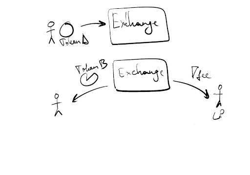
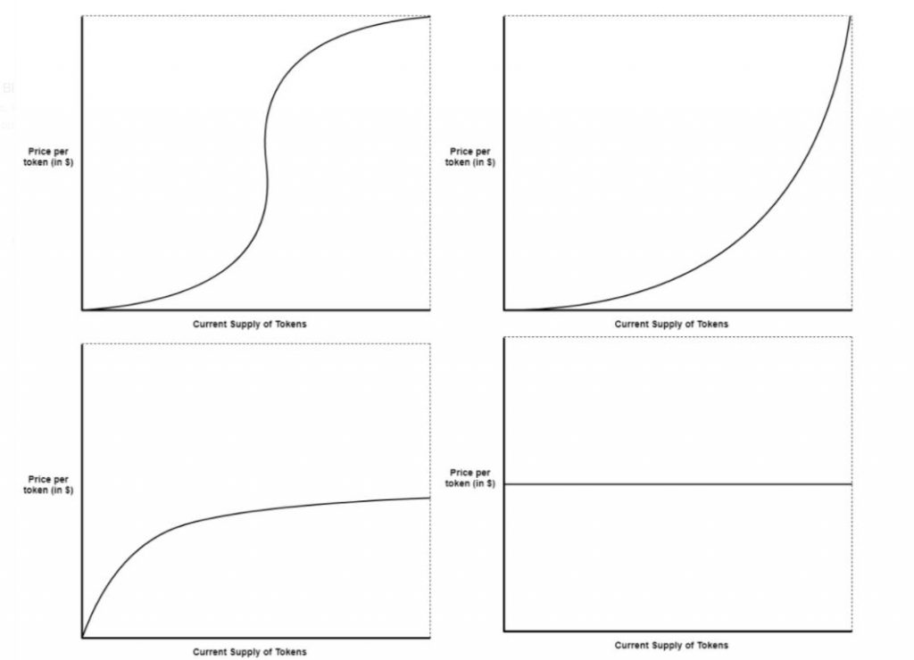
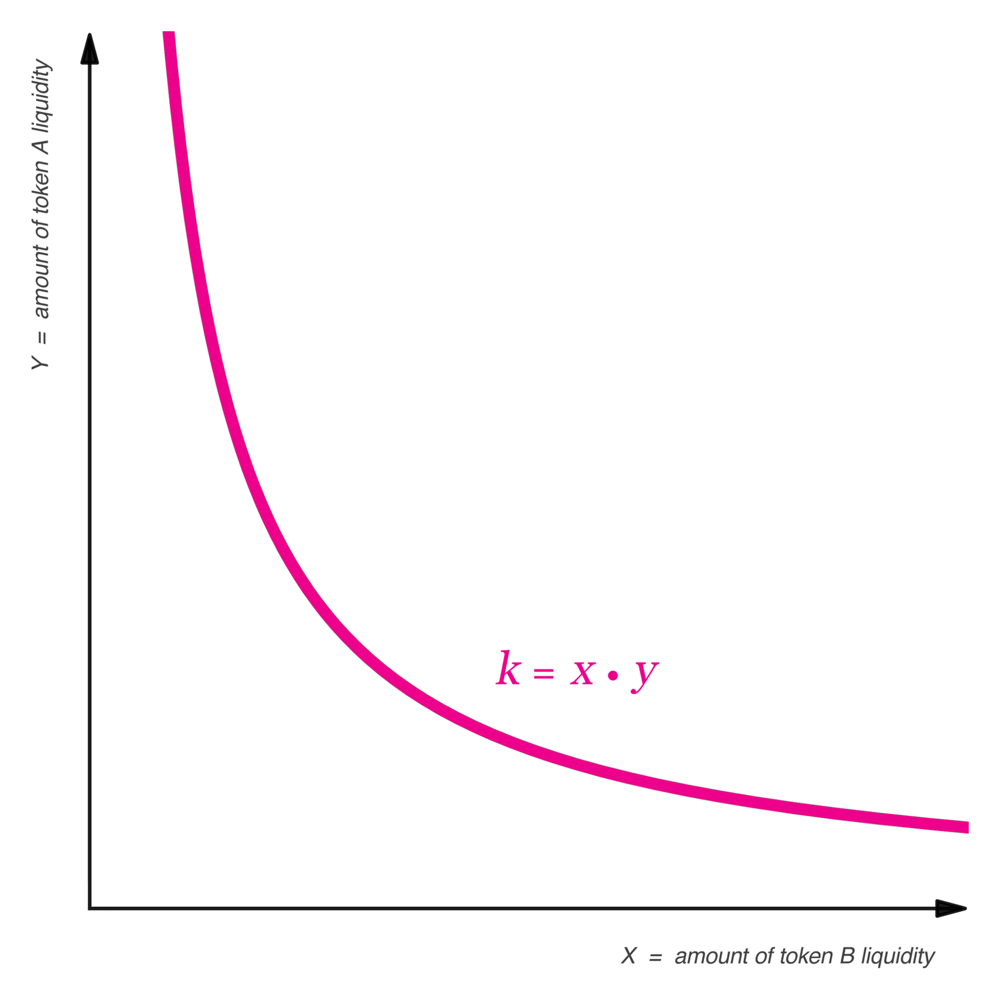
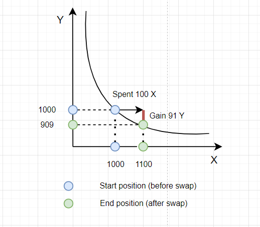

# AMM - Automated Market Maker

> An automated market maker can be thought of as a smart computer that is always ready to calculate the value of one asset relative to another.

**Automated Market Maker (AMM)** is a type of decentralized exchange (DEX) that uses a mathematical formula to assess the value of assets. Technically, it is a protocol implemented through a group of smart contracts that regulate the token exchange process between users.

Important! AMMs have truly carved out their niche in the DeFi space due to their simplicity and user-friendliness.

## Liquidity Pool (LP)

When you want to perform any action on a DEX using AMM, you have to interact with the exchange's smart contracts.

Important! Interacting with an AMM can be perceived as interacting with a smart contract (P2C). Transactions occur between users and contracts.

Tokens for exchange cannot come out of thin air. They need to be stored somewhere as reserves on a smart contract (since the user interacts with the smart contract). So, if you want to swap USDT tokens for ETH, there should already be enough ETH on the smart contract.

The **liquidity pool** is the abstract term used for the place where assets are stored within the smart contract. Essentially, it is a big pile where tokens are held. This is a new concept in the crypto industry and has no analogs in traditional finance.

Where do the tokens in the liquidity pool come from? These tokens are supplied by users who are willing to provide their liquidity in exchange for rewards. Therefore, the DEX smart contract pools together assets invested by multiple users, which is why it is called a "pool". All protocol users can contribute assets to it.

Important! Instead of recording the quantity of assets invested, it is customary to record the share they represent in the pool relative to other invested assets. This is done to simplify reward calculations.

A user can withdraw their assets from the pool in full or in part at any time.

## Liquidity Provider

When you deposit your assets into the pool, you become a liquidity provider. You will receive special tokens in return that represent your share of the invested funds in the pool.

The more assets you deposit into the pool, the more special tokens you receive. These tokens are called "lp-tokens".

How do lp-tokens work? The clever part is that the pool constantly grows by collecting a fee from each exchange. This is done internally within the protocol using smart contracts. As the liquidity pool increases, so does the share of the provider.

In other words, the liquidity pool belongs to the exchange. The exchange charges a fee for token exchanges, and this fee is added to the pool, thereby increasing its overall liquidity. Some DEX platforms additionally retain a portion of the fee as a service tax for providing a decentralized asset exchange platform.

In general, the process looks like this:

1. A user of the DEX wants to exchange "Token A" for "Token B".
2. They provide "Token A" to the liquidity pool and receive the ability to withdraw "Token B".
3. The user pays a fee for the token exchange and receives slightly fewer "Token B". The fee remains in the pool.
4. The collected fee is distributed among liquidity providers in proportion to their invested assets.

The same can be represented schematically:

## Mathematics of AMM

It's time to answer the question: "How is the asset value calculated during an exchange?"

For these calculations, mathematical formulas are used. It happens automatically: a special algorithm calculates the price of an asset relative to other assets in the pool. This is the main goal of an AMM.

There are different mathematical formulas for calculating the value of assets, but they all have three main variables: X, Y, and K.

X represents the cumulative value (amount of asset * asset price) of the first asset in the liquidity pool.

Y represents the cumulative value (amount of asset * asset price) of the second asset in the liquidity pool.

K is a constant that always maintains the same value, representing the token ratio in the liquidity pool. It is also known as the invariant.

Let's look at popular types of AMMs based on mathematical formulas:

- Constant Product Market Maker:
  Formula: X * Y = K

- Constant Sum Market Maker:
  Formula: X + Y = K

- Constant Mean Market Maker

- Hybrid Market Maker

As you may have noticed, I didn't provide the formulas for the last two examples. They are not important for the purpose of this article and are quite complex. We will focus on the Constant Product Market Maker as it is the most popular approach.

For more detailed information about the mathematical formulas of AMMs, you can read the book ["How to DeFi Advanced"](https://landing.coingecko.com/how-to-defi/).

## Bonding Curve

Mathematical formulas can be visualized using graphs, which makes them easier to understand. For this purpose, a bonding curve is used.

Let's take a look at the curve graphs that show the relationship between the quantity of a token (supply) and its price. The curves on the graphs demonstrate how the token price changes relative to its quantity.

- Sigmoid Curve: Located in the top-left corner.
- Quadratic Curve: Located in the top-right corner.
- Negative Exponential Curve: Located in the bottom-left corner.
- Linear (Non-Increasing) Curve: Located in the bottom-right corner.

The choice of a mathematical formula is directly related to the project's business model. Let's explore how different models can impact the business logic.

**Goal: Rewarding early buyers**

> We can use a sigmoid or quadratic bonding curve. This allows early buyers to acquire tokens at a low price, with the price increasing as more tokens are purchased. Essentially, the earlier you buy the token, the more you can potentially earn.

This model works well, for example, in alternative fundraising methods to create hype during the launch. It can also be used for organizing auctions and finding the optimal market price for an asset.

**Goal: Rewarding early buyers without hindering later purchases**

> To achieve this goal, we can use an exponential or linear bonding curve. By using a negative exponential curve, similar to the first example, we provide an opportunity for early buyers to purchase tokens at a low price and potentially profit from them. However, as the number of purchases increases, the curve flattens, slowing down the price growth. This ensures that late buyers do not face excessively high prices.

This model works well for traditional exchanges where a smooth price change is needed for both buying and selling assets.

**Goal: Maintaining a stable purchase price for an asset**

> For this, a linear non-increasing bonding curve can be used. In this case, buyers are not incentivized by instant profits. According to the graph, the price remains stable, indicating no loss or gain.

This type of curve is suitable for users who value stability and reliability of their assets. It is applicable to exchanges that deal with assets of similar value, such as stablecoin exchanges, where both assets are valued at $1, and proportional price changes are unnecessary.

## Constant Product Market Maker

The constant product market maker is the most popular type of AMM. Visualize the formula `X * Y = K` on a graph, and you will see a curve that represents the relationship between the token pair in the liquidity pool.

This mathematical curve is a hyperbola. Looking at the graph, you can see that this approach ensures the liquidity pool is never drained, as the curve never intersects with the axes. It guarantees that AMM pools will always have funds available. In the worst-case scenario, one of the tokens may reach a price that approaches infinity.

How does it work in practice? It's quite simple. When the quantity of token X changes, the quantity of token Y needs to be adjusted to maintain a constant K.

We can represent this logic using the following formula:

`(X + ΔX) (Y − ΔY) = X * Y`, where

ΔX is the amount of token X we are adding to the liquidity pool,

ΔY is the amount of token Y we will receive in exchange from the liquidity pool.

From this, we can calculate ΔY, which represents the tokens we will receive when we add ΔX tokens to the pool:

`ΔY = Y - (X * Y) / (X + ΔX)`

### Example

Let's consider a liquidity pool for token pair X and Y. Imagine there are 1000 tokens of X and 1000 tokens of Y in the pool, with a 1:1 ratio.

> Then, K = X * Y = 1000 * 1000 = 1,000,000.

We want to buy some tokens of Y using our tokens of X. We are willing to use 100 tokens of X for the purchase, which is our ΔX. Now we need to calculate how many tokens of Y we will receive in exchange (our ΔY).

According to the formula:

> ΔY = Y - (X * Y) / (X + ΔX),

we get:

> ΔY = 1000 - (1000 * 1000) / (1000 + 100) = 1000 - (1,000,000 / 1100) ≈ 91.

This means that we will receive approximately 91 tokens of Y in exchange for 100 tokens of X. The graph shows the quantity of X and Y before the exchange as blue dots, the quantity of X and Y after the exchange as green dots, and the number of tokens we will receive for the exchange as a red line.

At this point, there are 1100 tokens of X and 909 tokens of Y in the pool. Let's try buying tokens of Y again. We are also willing to use 100 tokens of X for the purchase, which is our ΔX. Let's calculate how many tokens of Y we will receive in exchange (our ΔY).

According to the formula:

> ΔY = Y - (X * Y) / (X + ΔX),

we get:

> ΔY = 909 - (1100 * 909) / (1100 + 100) = 909 - (999,900 / 1200) ≈ 76.

This means that we will receive approximately 76 tokens of Y in exchange for 100 tokens of X. There will be 833 tokens of Y and 1200 tokens of X remaining in the pool. You may have noticed that our rounding affected the constant K, and it became 999,900. In this example, we can tolerate a small margin of error.

Important note: In the first purchase, we received 91 tokens of Y. In the second purchase, we received 76 tokens of Y. With each subsequent purchase, we will receive fewer tokens of Y according to our curve and the laws of AMM. To buy the same amount of tokens of Y, we will need to provide more tokens of X. This means that the price of token Y will increase relative to token X with each purchase. This is how AMM ensures that the liquidity pool remains balanced and drained.

## Conclusion

Automated market makers (AMMs) are the foundation of the DeFi space. They enable almost anyone to create efficient markets. They operate 24/7 and require no intermediaries. Although they have their limitations compared to order book-based DEXs, the value they bring to the cryptocurrency ecosystem is invaluable.

AMMs are still in the early stages of development. The solutions we know and use today, such as Uniswap, Curve, and PancakeSwap, have elegant designs but are somewhat limited in functionality. It is likely that we will see many innovative AMM solutions in the future, leading to lower fees and increased liquidity across the entire DeFi space.
