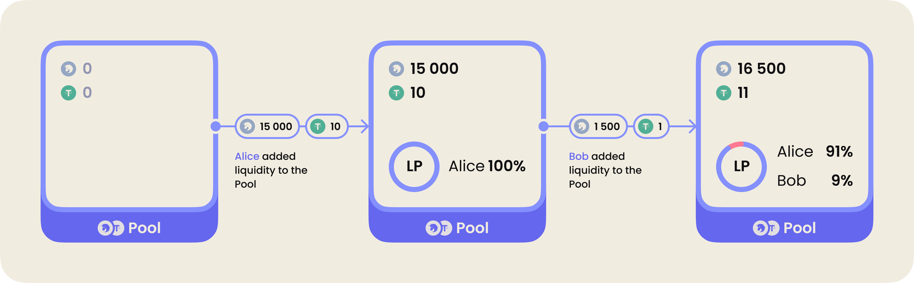

# DEX Overview

## Uniswap V2

Uniswap is one of the most successful AMM protocols in the DeFi world. It is a decentralized exchange protocol on Ethereum that enables direct token swaps without users needing to store their funds on the exchange. Using the protocol is straightforward: you send your tokens from your wallet to the Uniswap smart contract, and in return, the protocol directly sends the desired tokens back to your wallet from the smart contract.

The first version of the protocol was published by Hayden Adams in November 2018 as a proof of concept for AMM. It is designed to be user-friendly, gas-efficient, censorship-resistant, and secure.

Although Bancor was the first protocol to apply the AMM concept in Ethereum, Uniswap was one of the first AMM-based DEXs that popularized the constant product market maker formula.

The protocol is beneficial for both traders and regular users. For blockchain developers, it is relatively easy to integrate Uniswap swaps into their contracts as it integrates well with other smart contracts that require guaranteed on-chain liquidity.

In the first version of Uniswap, you could swap ETH for ERC-20 tokens and vice versa. Let's talk about the second version of the protocol, which introduced the ability to swap ERC-20 tokens for other ERC-20 tokens.

### Adding Liquidity

According to the diagram, a liquidity provider adds **three tokens A** and **one token B** and receives **12.4 LP** (Liquidity Pool) tokens in return. These LP tokens represent the provider's share in the pool's assets.

Once the token pair is created, it operates based on the AMM principle. It takes one token and provides the other token according to the constant product formula. Moreover, by creating the pair, you also set the initial price. The ratio at which we contribute our token pair becomes the base for subsequent liquidity providers.

It's important to note that any user can create a liquidity pool and set the initial price to earn a percentage from each swap. Uniswap does not charge a fee for creating a pool.

### Architecture

The Uniswap V2 structure consists of core contracts and peripheral contracts.

Uniswap Core [here](https://github.com/Uniswap/v2-core).

- `UniswapV2Pair.sol`: This is the main contract of the protocol core. It handles the liquidity pair and stores the reserves of the two tokens.

- `UniswapV2Factory.sol`: The factory contract regulates the creation and storage of liquidity pairs.

Uniswap Periphery [here](https://github.com/Uniswap/v2-periphery).

- `UniswapV2Router01.sol` and `UniswapV2Router02.sol`: These contracts are designed for user interaction with the protocol. They allow liquidity addition, removal, and token swaps.

### Token Swaps

**What if I want to swap tokens that do not have a liquidity pair?** For this, you need to use the `UniswapV2Router02.sol` contract. It facilitates interaction between all token pairs and can construct a route for the swap.

For example, let's say we have DAI that we want to swap for LINK. There is no direct DAI-LINK pair, but there are DAI-ETH and ETH-LINK pairs. The protocol will construct the following route for the swap: DAI → ETH → LINK.

It's important to note that the protocol actually performs two swaps: it deposits DAI into the first pair and obtains ETH, then it deposits ETH into the second pair and obtains LINK. The diagram illustrates this process.

**Why do we need to use `Router02` instead of `Router01`?** The reason is that routers do not have state and do not store token balances. They can be safely replaced with a new implementation if necessary. For example, if there are discovered issues or the need to add new logic. This was exactly what was done in Uniswap v2 when shortcomings were found in `Router01`.

It's important to note that constructing swap routes is not the only task of the router contract. It also provides methods for token swaps, calculates certain values during swaps, and handles liquidity addition and removal.

### Adding Liquidity

Every smart contract `UniswapV2Pair.sol` manages a liquid pair of reserves for two ERC20 tokens. **Liquidity providers** add liquidity (create a market) by depositing two tokens. The amount of tokens is equivalent to their value at the time of addition. After that, the tokens are automatically locked in the smart contract. It can be a pair of ERC-20 tokens or ETH - ERC20 pair.

> For example, Alice has USDT and 2INCH tokens. She sees that there is no liquidity pool for this pair, so she has the opportunity to set the exchange rate for these tokens.

> She decides to set the rate of 1500 2INCH for 1 USDT. To do this, she creates a pool and deposits 15000 2INCH and 10 USDT into it. Yes, Alice, as the first creator of the pool, has the right to determine the token ratio in the pool - that is, set the price.

Now Alice is a liquidity provider. Her funds are locked in the smart contract. But how can she prove that these are her funds and how can she withdraw them?

For this purpose, there are LP (liquidity pool) tokens. In Uniswap, such LP tokens are called **UNI-V2**. To see which two tokens can be exchanged for LP, you can go to `etherscan → read contract` and check the `token0` and `token1` addresses.

Let's take an example of the ETH → USDT pair.

(https://etherscan.io/address/0x0d4a11d5eeaac28ec3f61d100daf4d40471f1852#readContract).

In the Read Contract tab, click on `token0` and `token1`. You will see the addresses of the pair's tokens.

When creating a liquidity pool, LP tokens are minted in return, which reflect the liquidity provider's share in the pool. As long as Alice is the only liquidity provider, she holds 100% of the LP tokens. These tokens are also known as shares. Now, let's imagine that I want to create a similar pair after Alice.

Here's the catch: I can't create the exact same pair; I can only add liquidity to Alice's pair. And I must do it at the current exchange rate.

> For example, if I want to add 1500 2INCH, I need to provide 1 USDT. After that, Alice will have 91% of the LP tokens, and I will have 9%.

_Important!_ **LP tokens** can always be exchanged back to the pool reserves.

### Uniswap V2 Adapter

An adapter is a contract that implements the interaction with Uniswap V2 contracts. I will demonstrate how to interact with Uniswap V2 contracts using an adapter as an example.

It will include the following functionalities:
- Adding and removing liquidity
- Swapping 2INCH for USDT

You can check out the adapter code [here](./contracts/Adapter.sol).

## Uniswap V3

Uniswap v3 is based on the same principles of AMM with the constant product formula as the previous versions, but it introduces several innovations.

The developers of the third version promise increased capital utilization efficiency, higher price oracle accuracy, and a more flexible fee structure.

### Concentrated Liquidity

When LP provides liquidity to a Uniswap v2 pool, it is evenly distributed along the price curve. This allows to process all price ranges from zero to infinity but makes capital utilization inefficient.

The problem is that most assets are traded within specific price ranges. This is especially noticeable in pools with stablecoins, which have a very narrow range.

For example, in a pair like DAI/USDC, only 0.5% of the liquidity from the entire pool can be used in the range from $0.99 to $1.01. This means that 99.5% of the capital is hardly ever utilized.

Imagine that you add $100 to a liquidity pool. You buy 50 DAI for $50 and 50 USDC also for $50. Then you deposit them into the DAI/USDC pool. Only $0.5 of them is used for swaps, while the remaining $95.5 just sits there, even though you could have invested them somewhere else to earn a return.

This is highly inefficient capital utilization. However, in Uniswap v3, liquidity providers can choose an individual price range. This allows capital to be concentrated in ranges where most of the trading activity occurs.

In v3, individual price curves are created for each liquidity provider. The overlapping ranges create combined liquidity. LP receives fees proportionally to their contribution within the specified range.

For better understanding, let's consider an example.
1. Let's say Alice and Bob want to add liquidity to the ETH/DAI pool on Uniswap v3. Each of them has $10,000, and the current ETH price is $1,750.
2. Alice uses her entire capital to buy ETH and DAI, and then she places them throughout the entire range similar to the pools in Uniswap v2. As a result, she invested 5,000 DAI and 2.85 ETH.
3. Instead of investing all of his capital, Bob decides to concentrate the liquidity in the range of $1,500 to $2,500. He invests 600 DAI and 0.37 ETH, totaling $1,200, while he still has $8,800 left.
4. In this situation, as long as the price fluctuates within the range of $1,500 to $2,500, both Alice and Bob will earn the same fees.
5. By investing only 12% of the amount Alice invested, Bob will earn the same income while risking a smaller portion of his capital.

It's important to note that as long as traders trade within this range, both Alice and Bob will earn income from fees. However, if the price goes beyond this range, only Alice will earn income, and Bob's liquidity will no longer participate in the trading.

This mechanism motivates liquidity providers to cover the entire price range with their positions. In theory, Bob can either add liquidity to additional ranges to achieve broader coverage or update his range depending on where the price is heading.

### Flexible Fees

In the first two versions of Uniswap, each token pair corresponded to a single liquidity pool. The pool applied a fixed fee of 0.3% to all trades. This fee level historically worked well for most tokens. However, it was too high for some pools, such as stablecoin pools, and too low for others, such as pools containing highly volatile or rarely traded tokens.

Uniswap v3 introduces multiple pools for each token pair, with each pool having its own exchange fee. All these pools are created by a single factory contract that allows the creation of pools with three fee tiers: 0.05%, 0.3%, and 1%.

Previously, there could only be one pool for a given pair, for example, DAI/USDC, but now there can be three pools for the same pair, each with a different fee value. The idea is that the main liquidity will be concentrated in the pool where the fee level matches the asset risk.

_An interesting fact!_ By holding UNI tokens and having "voting power" in the community, you can propose a different fee for a specific pool. This was done in [this proposal](https://app.uniswap.org/#/vote/2/9). If it's not visible, try switching your network in Metamask to **Ethereum mainnet**.

Therefore, the three types of fees are determined by the liquidity pool risk:

1. **Stable Pairs** — 0.05%. For pairs with low volatility and stablecoins.
2. **Medium-Risk Pairs** — 0.30%. For popular pairs with high trading volume.
3. **High-Risk Pairs** — 1%. For exotic pairs.

But that's not all the differences related to fees. Previously, fee earnings were automatically reinvested and withdrawn along with the entire liquidity, but now they are collected and held by the pool as separate tokens. Liquidity providers can withdraw them at any time.

### NFT Instead of ERC-20

In earlier versions of Uniswap, liquidity providers received fungible LP tokens for holding positions. However, in Uniswap v3, liquidity providers receive NFTs (ERC-721 tokens) when adding liquidity. An NFT contains information about the liquidity pool and the provider's share in that pool.

It's clear that fungible ERC-20 tokens are not suitable for representing the selected price range for each individual liquidity provider.

Let's go to [Etherscan](https://etherscan.io/token/0xC36442b4a4522E871399CD717aBDD847Ab11FE88#readProxyContract) and take a look at the NFT.

To view the information contained in the token, call the `positions()` read method. You need to provide the token ID, for example, 315793. Each NFT has several data fields, with the most important ones being:
- **token 1** — address of one of the tokens in the pool
- **token 2** — address of the second token in the pool
- **fee** — fee for swaps in this pool
- **tickLower** and **tickUpper** — minimum and maximum price ranges set by the liquidity provider
- **liquidity** — liquidity provided by this position

_Important!_ The range is specified in ticks, which is a relative value that is updated with each addition and removal of liquidity. Roughly speaking, 1 tick corresponds to a 0.01% change in price.

NFTs also have a graphical representation:

Based on the selected price range, you can see the following parameters:
- In the middle, there's a curve representing the "slope" of the selected position.
- A small curve icon in the bottom right corner shows the LP's position on the curve, indicating where the provider is active in the pool.
- Each Uniswap v3 position has a unique color scheme based on the two tokens held in the pool, so different pools are represented by different color variations.

You can find more examples of Uniswap v3 pool NFTs on the [OpenSea marketplace](https://opensea.io/collection/uniswap-v3-positions).

Thus, liquidity providers have a personal identifier that allows them to add and remove liquidity from a specific pool and also claim the accumulated rewards from the token swap fees in the pool.

_Important!_ Thanks to the ability to add concentrated liquidity, LP tokens are no longer fungible as they were in Uniswap v2.

## Curve

One of the main issues with DEXs that use the AMM formula, like Uniswap, is the fees and price slippage when trading tokens. This is not ideal for trading between stablecoins and assets pegged to the same value.

Curve Finance was the first to address this problem and create an AMM formula more suitable for stablecoin pools, allowing for low fees and low price slippage. Their main goal is to simplify the exchange of assets with similar values.

This is valuable in the DeFi ecosystem because there are many wrapped and synthetic tokens that aim to mimic the price of underlying assets.

**What are synthetic tokens?** They are financial instruments commonly referred to as "synths". By purchasing them, you participate in the price movements of the underlying asset, but they don't grant ownership rights to the base asset or guarantee its future delivery.

**What can be a synth?** Almost anything: cryptocurrencies, tokens, commodities, stocks, market indices, or fiat currencies.

_Important!_ Currently, Curve Finance supports USD stablecoins, Euro stablecoins, wrapped/synthetic BTC (Bitcoin), and wrapped/synthetic ETH assets.

### How does Curve work?

At its peak popularity in January 2022, Curve's Total Value Locked (TVL) exceeded $24 billion, with a monthly trading volume of over $6 billion. Even after the cryptocurrency market downturn by mid-2022, Curve remains among the top five leading DeFi services with over $5.7 billion locked.

However, what's interesting is that the vast liquidity provided by Curve enables many other DeFi services to utilize its pools in their ecosystems.

For example, Curve is integrated with the liquidity aggregator 1inch, as well as the largest lending protocols Aave and Compound.

The initial idea of this protocol was to pool a large number of stablecoins to minimize price slippage and protect liquidity providers from impermanent losses.

When this protocol first emerged, Uniswap was in its first version. Apart from high price slippage, there was another issue: LPs had to provide at least half of their liquidity in ETH, an unstable asset vulnerable to impermanent losses.

In the first version, tokens were only traded through a pool with ETH. In other words, if you wanted to exchange token A for token B, Uniswap would execute two trades: token A to ETH in one pool, and then ETH to token B. This led to double the trading fees.

To increase the liquidity of tokens with low trading volume, Curve introduced the concept of "base pools" and "metapools".

The most liquid base pool is the "3pool", which consists of DAI, USDT, and USDC stablecoins. The ratio of the three stablecoins in the pool depends on market supply and demand. Depositing a coin with a lower coefficient will earn the user a higher percentage of the pool.

There are also liquidity pools where one token is traded against the base pool. These are called "metapools". For example, in the "ARTH/3pool" pool, the exchange occurs between the ARTH token and the base pool consisting of three different stablecoins.

For more details, refer to the official [documentation](https://curve.readthedocs.io/).

### What are the main advantages of Curve?

When Curve was launched, it quickly gained popularity by addressing the underdeveloped stablecoin market. Decentralized exchanges previously had high fees, creating challenges for those looking to switch between stablecoins.

As a result, Curve.fi became one of the best protocols for stablecoin exchange due to its low fees and low price slippage. Additionally, the protocol provided liquidity providers with various earning tools, further attracting more liquidity.

Curve is not only one of the best protocols for stablecoin exchange but also for providing liquidity in the form of stablecoins. As we discovered, Curve operates based on the concept of metapools, working with a large number of independent assets rather than pairs. This allows for providing liquidity in various ways.

You can provide liquidity with only one stablecoin in a pool, albeit with a small loss of liquidity. Alternatively, you can choose other strategies, such as providing assets in equal proportions.

Thus, Curve offers flexibility when it comes to depositing liquidity. It allows you to allocate your funds across pools without being tied to specific pairs, although there may be some slippage. Slippage is necessary to balance the price within the pool.

In conclusion, Curve is an automated decentralized exchange similar to Uniswap, designed for stablecoins. Its simple and stylish 90s-style interface is user-friendly and enables anyone to benefit from low slippage stablecoin transactions.

## Balancer

Another protocol that operates on the principle of AMM is Balancer. It takes the AMM formula to a new level by making it even more customizable.

We had Uniswap pools consisting of equal parts of just two assets. Then Curve surpassed Uniswap by allowing the creation of tri-pools and reducing costs associated with fees and price slippage.

💣 **Balancer's weighted pools** removed these limitations by enabling the creation of liquidity pools containing up to eight different tokens. On Balancer, weighted pools on the balancer can consist of any proportion of eight different tokens.

As a result, liquidity pools on Balancer are no longer limited to just three assets and are not bound by a constant product formula that requires pools to maintain an equal percentage of each asset.

_Important!_ Because all tokens are stored in one place, performing exchanges is much more cost-effective in terms of gas fees. There are also internal swaps that allow for transactions without any fees.

### How is Balancer related to index funds?

The Balancer protocol can be compared to a weighted [index fund](https://academy.binance.com/en/articles/what-is-a-crypto-index-fund) in traditional finance.

_Important!_ Index funds are investment strategies focused on holding certain balances of different assets.

For example, the well-known [S&P 500](https://www.marketwatch.com/investing/index/spx) is an index that tracks the performance of the 500 largest companies in the stock market. Owning shares of an S&P 500 index fund means that the value of your shares reflects the composition of the entire index. When stocks are added or removed from the S&P 500, your index fund is rebalanced accordingly.

Balancer pools function as weighted index funds for the DeFi ecosystem. They can support portfolios of up to eight different ERC-20 tokens.

In a traditional index fund, asset allocation is manually done to achieve a balanced portfolio. Balancer, on the other hand, utilizes automatic asset rebalancing in its pools every time a trade occurs. This happens thousands of times a day.

This process helps provide an active market with trading opportunities, benefiting both liquidity providers and traders.

Instead of paying management fees to a fund manager, the trading fees are paid directly to liquidity providers who also receive multi-purpose Balancer tokens called **BAL** on a weekly basis. These tokens represent ownership stake in the platform and provide voting rights in community governance decisions.

> For example, a Balancer pool may be configured to hold 80% of its value in [wETH](https://www.gemini.com/cryptopedia/wrapped-bitcoin-vs-bitcoin-wbtc-tbtc-wnxm-hbtc-crypto#section-wrapped-ether-w-eth) and 20% in [wBTC](https://www.gemini.com/cryptopedia/wbtc-what-is-wrapped-bitcoin). If there is slippage, the protocol will adjust the token prices to maintain the 80/20 ratio.

> When a trader wants to buy wBTC with wETH, the protocol algorithmically scans its liquidity pools for the best price. Ideally, the pools with the best wBTC-to-wETH prices will also be the pools that need the most rebalancing. The liquidity pool and trading platform are locked in an eternal algorithmic dance of equilibrium. 🕺

### Key Features of Balancer

There are several types of liquidity pools on Balancer:

1. **Weighted Pools**: Designed for general cases and do not necessarily have price correlation. For example, DAI/WETH. The price is determined by the pool's balance, its weight, and the amount of tokens being exchanged.
2. **Stable Pools**: Suitable for tokens with a soft peg and strong correlation. For example, DAI/USDT/USDC. These pools allow for significantly larger trades before significant price impact. They employ stable math. They have a lower spread, which is the difference between the best bid and ask prices. Tokens from these pools are often used for arbitrage when one token pairs with two different tokens in different pools.
3. **Smart Pools**: Suitable for tokens without a peg that maintain correlation but may slowly diverge over time. For example, stETH/WETH.
4. **Managed Pools**: These are pools designed for managing dynamic funds. Their features include weight shifting for rebalancing, trade pausing, and management fees.

The most important feature of the Balancer protocol is its set of algorithms that govern and incentivize interaction between liquidity providers, liquidity pools, and traders with two objectives: pool rebalancing and finding the best price.

Balancer tokens are available for purchase on exchanges, and they are distributed weekly to liquidity providers. The more liquidity you provide to a Balancer pool, the more Balancer tokens you earn.

## Bancor

[Bancor](https://bancor.network/) claims to be the only decentralized liquidity platform that enables earning passive income through liquidity provision.

### Single-Sided Liquidity

Essentially, Bancor is a decentralized exchange where users can swap one asset for another. The difference lies in the concept of single-sided liquidity.

_Important!_ In most DEXs, it's not possible to provide liquidity with just one asset. Usually, adding liquidity to a pool requires having all the assets in the pool.

Bancor solves this problem by introducing **single-sided liquidity**. You can simply deposit ETH, and Bancor will mint BNT tokens, which will be used as the second asset. This completes the other half of the pool.

> For example, if you deposit 100 ETH and the price of BNT is 2 ETH, when you deposit 100 ETH, the protocol will mint 50 BNT. In this case, the pool will consist of 50% ETH and 50% BNT, but you will only have access to ETH.

In such a scenario, the inflation of the BNT token is expected to increase rapidly. However, to prevent this, when funds are withdrawn from the pool, the corresponding BNT tokens are burned as if they never existed. This mechanism works effectively. Furthermore, the exchange fees are also collected in BNT and burned when rewards are withdrawn.

### Impermanent Loss Insurance

BNT tokens are also used as an intermediate asset during trading. This means that when exchanging, for example, ETH for USDT, the route will be: ETH → BNT → USDT. Fees will be deducted at both stages, with half going to liquidity providers and the other remaining with the Bancor protocol.

Here we come to the second crucial aspect of the protocol — **impermanent loss insurance**.

_Important!_ Impermanent loss insurance sets Bancor apart from other DEXs.

Half of the trading fees are retained by the protocol. Additionally, Bancor takes a portion (15%) of the earnings generated by liquidity providers. These funds are directed to an **insurance fund** that can cover losses if the asset price deviates from the price at which the asset was added to the liquidity pool.

Even in the case of a significant price drop, if the insurance fund is insufficient, the remaining funds will be paid out in the form of BNT tokens. Think of it as car insurance: if a car cannot be repaired after an accident, you will be paid the funds to purchase a new car.

Bancor positions itself as a platform where you can safely earn passive income instead of simply holding funds in your wallet. It also protects your funds from price declines.

However, to receive full protection, meaning to withdraw the same value that was deposited, you need to lock your funds on the platform for at least 100 days.

**But how does Bancor ensure that liquidity providers can get the right price for the tokens they deposited on the platform?** Bancor V2 claims to address this issue with the help of a price oracle. Using the oracle, Bancor pools automatically adjust the token ratios based on their prices, allowing liquidity providers to withdraw the same token value they deposited.

## Wombat Exchange

[Wombat Exchange](https://www.wombat.exchange/) is a young and ambitious AMM DEX protocol launched on the Binance Smart Chain. It specializes in stable assets and combines the advantages of other protocols.

### Shared Liquidity Pool

Traditional DEXs have isolated liquidity pools, where reserves are stored separately from each other. To provide liquidity for a token across multiple pools, you need to send the token to two different smart contracts. This separation reduces the overall capital utilization potential, as each portion of capital will only be used in one of the pools.

For example, banks work differently. They don't have separate reserves for each currency pair. They simply hold reserves of the entire currency and freely exchange between any currencies.

Wombat Exchange adopted the banking strategy and implemented a **shared liquidity pool**.

Protocol users provide single-sided liquidity to one shared pool, allowing them to earn higher rewards. Traders can swap between any stablecoin without the need to interact with multiple pools.

In reality, it's one large liquidity pool with multiple assets. This reduces price impact when trading large volumes of assets and minimizes slippage.

Currently, most stablecoin transactions on the BSC chain are conducted on PancakeSwap. Let's compare the slippage of transactions between Wombat Exchange and PancakeSwap in the USDT/USDC trading pair. Let's take the examples of 10,000 and 100,000.

For 10,000, the slippage on PancakeSwap is 10 USDC, while the slippage on Wombat Exchange is only 1.6 USDC.

If we take 100,000, on PancakeSwap, the slippage can reach 414 USDC, while on Wombat Exchange, it's 15.7 USDC.

### What problem did Wombat solve?

The implementation of a **shared liquidity pool** has a positive impact on the scalability of the protocol.

New stablecoins or regular tokens often have low liquidity in traditional liquid pairs, or they may not have liquid pairs at all.

The **shared pool** addresses this issue. By providing one-sided liquidity in a shared pool, it increases the liquidity for new stablecoins and allows for scalability.

To prevent potential issues with tokens, especially stablecoins, the main pool only includes the most liquid and trusted stablecoins: USDC, USDT, and BUSD. It also includes the most successful decentralized stablecoin with over-collateralization, which is DAI.

All other stablecoins can be included in the **side pool**, which contains low-liquidity and potentially risky tokens. If there is any threat to a stablecoin in the **side pool**, its usage will be halted, and only asset withdrawals from the pool will be allowed. This way, the main pool with the highest liquidity remains unaffected.

## Conclusion

That's it! I've talked about the most popular DEX platforms that are based on AMM. They have their own features and differences, but they share similar goals: to provide liquidity providers an opportunity to earn and users the ability to efficiently exchange tokens.

Every day, the number of different protocols continues to grow, and existing ones are constantly being updated. New concepts and tools are being developed to improve trading, enhance security, reduce fees, and mitigate risks. The DeFi space is growing rapidly, so it's important to keep up with its development!

