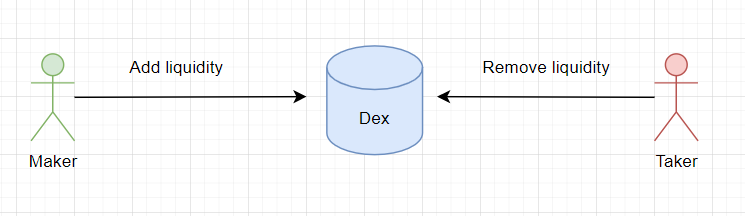
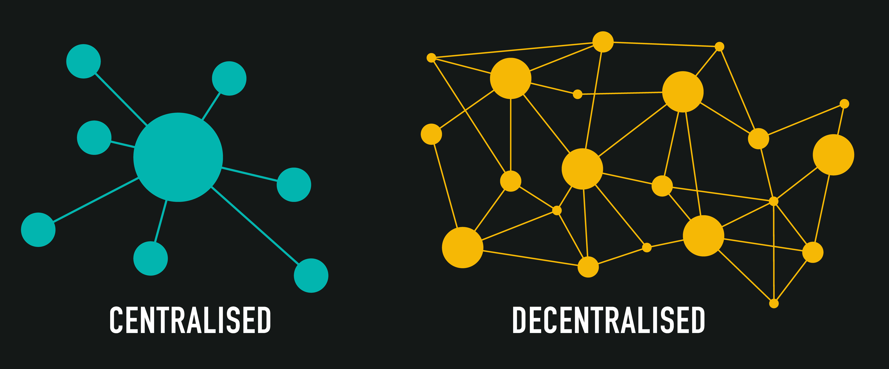

# DEX

> In this article, I'm gonna talk about how decentralized exchanges work. If you're not familiar with the concept of "Decentralization," I suggest reading a [short article](https://medium.com/@juliomacr/centralized-vs-decentralized-vs-distributed-a-quick-overview-1f3bd17b8468) or a [more detailed article](https://medium.com/hackernoon/centralization-vs-decentralization-the-best-and-worst-of-both-worlds-7bfdd628ad09).

**DEX** (Decentralized exchange) is a decentralized trading platform. The management and administration of such a service don't belong to anyone or are in the hands of the community. Access to assets is done without the help of intermediaries, so you can call such an exchange peer-to-peer or P2P. Smart contracts deployed on the blockchain network monitor transactions between users, which helps reduce transaction fees.

## Basic Concepts

### Liquidity

In the classic understanding, **liquidity** is a measure of how quickly an asset can be exchanged considering its market value. When there are buyers ready to buy an asset at the seller's price, it indicates high liquidity. On the contrary, low liquidity means there are no such buyers.

> Imagine a situation where a seller puts up their old rusty Dodge Charger for sale. Weeks go by, but nobody buys the car. The seller gets desperate and realizes that nobody wants their car. That's an example of **low liquidity**. But if the car were sold on the first day, it would indicate **high liquidity**. Don't worry about the Dodge Charger; there will always be a buyer who appreciates the American muscle car legend.

_Important!_ So, we can make the following conclusion: a **liquid market** is where you can easily buy and sell assets at a fair value. That means there is high demand from those who want to acquire the asset and sufficient supply from those who want to sell it.

### Market Makers and Market Takers

To have a liquid market, token exchanges need to happen as quickly as possible. In any token exchange, a seller must be matched with a buyer, or vice versa. If there's no meeting point, the transaction becomes impossible.

All users of the exchange are divided into two types:
1. **Market makers**: Users who make offers to buy or sell tokens.
2. **Market takers**: Users who accept the offers to buy or sell tokens.

For a transaction to take place, the **maker** must offer an asset for exchange. That's why they are often called **market creators**. Without them, no offers will be made.

The created offer doesn't guarantee a successful transaction. Therefore, an executor or **taker** is needed to close the offer. They will take the offered asset and, in return, provide their own asset that the **maker** requested.

So, the **market maker** provides liquidity, and the **market taker** takes liquidity.

_Important!_ It's not uncommon for major market players to take on the role of market makers. That could even be the exchange itself.

### Liquidity Providers

**Liquidity providers** are investors who contribute their assets to the exchange reserves. These reserves are used for the swift execution of operations (token exchanges). Liquidity providers receive transaction fees for providing liquidity. This process is often referred to as [liquidity mining](https://academy.shrimpy.io/lesson/what-is-liquidity-mining) or market-making. Transaction fees are expressed as percentages and vary based on the available liquidity and transaction volume.

_Important!_ **Market makers** are also liquidity providers. Makers are crucial for the platform's attractiveness as a trading venue. Therefore, market makers may enjoy lower transaction fees.

_Important!_ **Market takers** utilize the exchange's liquidity to easily and quickly swap assets. They pay a higher fee for this speed.

## DEX vs CEX

DEX emerged as a replacement for CEX (Centralized Exchange) in due time.

**CEX** (Centralized Exchange) is a centralized trading platform. The management and administration of such a service are in the hands of a single organization that acts as an intermediary in the exchange of funds between users.

Most centralized exchanges resemble traditional financial services like the New York Stock Exchange. Therefore, the interfaces of such exchanges are usually more user-friendly for beginners. Most CEX are based on the [OrderBook](https://www.binance.com/en/support/faq/understanding-order-book-and-market-depth-da311403b10347f09ff783a2525c8aa6) model. In this model, all information about operations and balances is stored within the exchange's internal database.

Through CEX, you can exchange fiat currency for cryptocurrency (and vice versa) or cryptocurrency for cryptocurrency. For example, exchanging part of BTC for ETH.

CEX allows the use of more advanced tools such as margin trading or limit orders. This is possible due to the OrderBook model, which stores all the information about transactions. Technically, the information is stored in the exchange's internal database.

CEX requires separate operations for depositing and withdrawing assets. Often, exchanges charge fees for everything: deposits, withdrawals, trades, storage, and so on. Additionally, CEX has the power to restrict withdrawals, set limits on deposits, and similar actions.

To address issues of transparency, security, and high fees, **AMM-based DEX** (Decentralized Exchanges) were developed. Here, there is no centralized intermediary to which fees must be paid. DEX can come together to increase their overall liquidity.

Below, I have prepared a comparison table for CEX vs DEX:

|| CEX | DEX |
|-------|----------|--------------|
|**Governing Body**| Single organization that owns the exchange | User community. [DAO](https://academy.binance.com/en/glossary/decentralized-autonomous-organization) |
|**Anonymity**| No. Requires [KYC](https://en.wikipedia.org/wiki/Know_your_customer) | Yes. Web3 wallet is sufficient |
|**User Asset Access**| Yes | No |
|**Risk of being blocked**| High | Low |
|**Ability to work with fiat currencies**| Yes | No |
|**Resilience**| Low | High |
|**Additional Features (Margin trading, off-exchange trading, etc.)**| Yes | Partially. Not all DEX have additional tools, and not all types of DEX have the technical capability to implement such tools |
|**Transaction Transparency**| No | Yes |
|**Popular Services**| Binance, Coinbase, Kraken, Gate, etc. | Uniswap, dYdX, PancakeSwap, Curve, SushiSwap, etc. |

## Types of DEX

Decentralized exchanges can be divided into two groups:
1. **AMM-based** (Automated Market Maker) or liquidity pool-based exchanges. These exchanges implement automatic token swapping and price determination.
2. **Orderbook-based** exchanges. Similar to CEX, users create orders to buy or sell tokens. The difference is that all the operations occur within the blockchain network.

The **orderbook** can be fully implemented on-chain using smart contracts. Alternatively, it can be a hybrid model with off-chain computations and on-chain settlement. This approach minimizes blockchain transactions to reduce gas costs.

Read more about **AMM-based DEX** [here](./amm/readme.md).

Read more about **orderbook-based DEX** [here](./orderbook/readme.md).

## Pitfalls of Decentralized Trading

There are a few key considerations to keep in mind. I would highlight three:

1. **Price slippage**: The issue of asset pricing at the moment of transaction execution. This is also known as **price slippage**. Since transactions are not instantaneous, the actual asset price can change between the initiation and execution of a transaction.
2. **Impermanent loss**: A significant risk for liquidity providers. When providing liquidity, if the asset price increases more than the profit offered by the exchange, the liquidity provider loses potential gains. In other words, if the liquidity provider had sold the assets instead, they would have earned more than what the exchange provides for liquidity.
3. **Arbitrage**: Other participants in the market taking advantage of price differences between exchanges. While it can help align asset prices across exchanges, it introduces various negative effects on token exchanges for regular users.

Read more about these pitfalls [here](./underwater-rocks/readme.md).

## DEX Overview

### Orderbook-based DEX

A prominent example is [dYdX](https://dydx.exchange/). This service operates similarly to CEX. Users can create orders to buy and sell tokens at specified price limits or market prices. User assets, like in CEX, are stored on the exchange's wallet. Users can deposit assets into the exchange and withdraw them.

There are relatively few well-known **orderbook-based DEX** solutions due to liquidity challenges. It is challenging to ensure liquidity for orderbook-based DEX. Users may need to wait for their orders to be executed. To improve order execution speed, a large number of users are required to create liquidity through their orders. Often, fake activity is generated at the launch of such exchanges, simulating the creation and closing of orders. This helps users close their market orders more quickly and gives them a sense that the exchange is active and functioning properly.

### AMM-based DEX

Popular examples of **AMM-based DEX** include [Uniswap](https://uniswap.org/), [Balancer](https://balancer.fi/), [Bancor](https://app.bancor.network/), and others. Each DEX has its own unique features and addresses specific challenges. If you've made it this far, it's essential to understand the approaches different DeFi protocols take to solve their tasks.

Read a more detailed review of popular AMM-based DEX [here](./dex-review/readme.md).

## Conclusion

DEX can be perceived differently, as either a utopia or the future of the financial system. The advantages, such as decentralization, transparency, and resilience, can also be seen as disadvantages.

Therefore, I will highlight the advantages, and you can decide for yourself whether they outweigh the disadvantages.

Potential advantages:
1. **Token variety**: DEX offers a vast array of tokens for exchange. If a desired token is not available, users can create their own liquidity pools without requiring approval from the exchange or token certification.
2. **Lower hacking risk**: Since users' funds are held in their own wallets, exchanges do not have full access to these funds. Users have control over their own funds. The risk of hacking for users only exists if they grant third parties the right to access their funds (using `approve()`). However, liquidity providers are at risk as their funds are stored in the exchange's smart contracts. In case of contract exploitation, liquidity can be lost.
3. **Anonymity**: Using DEX does not require users to provide personal information. Only a web3 wallet ([Metamask](https://metamask.io/), [TrustWallet](https://trustwallet.com/)) is needed.
4. **Transparency**: Blockchain technology allows for the tracking of almost any asset movement.
5. **Decentralization**: No one can prevent a specific user from using a decentralized exchange. Even if access is restricted in the user interface, users can always interact directly with the smart contracts. This is possible as long as at least one servicing node exists in the network.

Of course, there are also disadvantages. The world has not yet found the perfect solution:
1. **Lack of token validation**: It is challenging to find original tokens and be certain they are not scams. This is due to the fact that any user can create their own token and deploy it on the blockchain.
2. **Smart contract vulnerabilities**: DEX hacking risks are lower but still exist. The main drawback is that it is impossible to fix vulnerabilities in smart contracts due to their immutability. Although there are approaches to upgrade smart contracts, they make the contracts less secure due to the risk of upgradability. It's a catch-22 situation.
3. **Pitfalls of decentralized trading**: Impermanent loss, price slippage, arbitrage, etc. We have discussed all of these in detail.
4. **More complex development process**: Blockchain imposes limitations on DEX development and support.
5. **Diverse blockchain networks**: Before choosing a DEX to use, it is necessary to determine the network. Not all DEX are supported in all networks.

## Links

1. [What Is a Decentralized Exchange (DEX)?](https://academy.binance.com/en/articles/what-is-a-decentralized-exchange-dex)
2. [What Is a DEX (Decentralized Exchange)](https://chain.link/education-hub/what-is-decentralized-exchange-dex)
