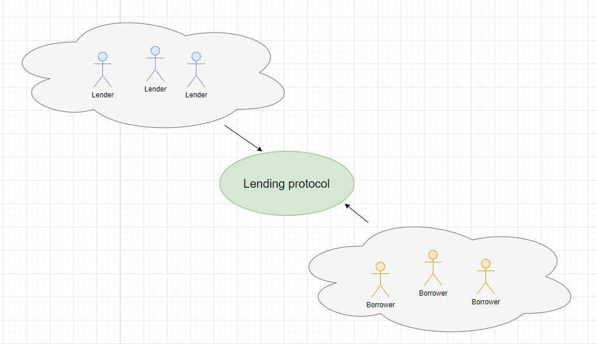

# Lending

**Author:** [Pavel Naydanov](https://github.com/PavelNaydanov) 🕵️‍♂️

**Lending protocol** or lending platform. This is the next important section in the DeFi space after DEX (Decentralized exchange). A lending protocol allows users to borrow and lend cryptocurrencies.

In other words, a lending protocol is a liquidity aggregator that is provided to borrowers. The protocol gathers potential lenders who are willing to lend their assets. Thus, the protocol acts as an intermediary between the borrower and the lender. It ensures the fairness of the transaction and allows the lender to receive interest while providing credit assets to the borrower. For lenders, this can be a form of passive income.

## Quick Navigation

1. Article about [Compound](./compound/README.md).
2. Article about [Aave](./aave/README.md).
3. Article about [flash loans](./aave/flash-loans/README.md) based on Aave.

## A Bit of History

According to [Wikipedia](https://en.wikipedia.org/wiki/Loan#Loans_in_the_Inca_Empire), one of the first recorded loans was made by the state (if you can call it that) to poor people in the Inca Empire. During lean years, officials provided food to the poor from the empire's storehouses. Records were kept of what and how much was distributed.

**When did the idea of cryptocurrency lending originate?** Some DeFi protocols, such as [MakerDAO](https://makerdao.com), were in development as early as 2014. In September 2018, [Compound Labs](https://compound.finance/) introduced the first version of a protocol that allowed borrowing five assets: ETH, TUSD, ZRX, BAT, and REP. In 2020, the economy came to a halt due to the pandemic, leading to lower interest rates and a sharp reduction in lending by traditional financial institutions. During this time, to stimulate the market, Compound launched the **COMP** token. This led to explosive growth in lending protocols. Around the same time, the Aave protocol emerged.

## Terminology

**Borrower** - someone who borrows funds.

**Lender** - someone who lends funds.

**Loan** - the principal amount or the amount of borrowed funds. Typically, the borrower must repay the principal amount and pay a fee for using the funds.

**Interest** - the fee paid to the lending protocol for using the borrowed funds or the interest earned by the lender for lending their assets.

**Collateral** - an asset that the borrower provides to the lender as security in case they cannot repay the principal amount. If this happens, the lender can seize and liquidate the collateral. The lender uses collateral as a risk mitigation mechanism to ensure that the borrower repays the loan.

**Liquidation** - the process of "liquidating a position" or selling the collateral to repay the loan. If the value of the collateral falls below a certain threshold or if the value of the loan increases, the collateral will be "liquidated" to avoid economic losses.

## How It Works

A lending protocol offers fast loans and is user-oriented. Most protocols have a flexible interest rate system aimed at distributing benefits to the protocol, borrower, and lender.

**Lending**. Users can deposit assets into a lending pool (smart contract). In return, they receive LP tokens (lending pool tokens) representing their share of the total value of the lending pool. Typically, users can withdraw their assets at any time with accrued interest.

**Borrowing**. Due to the high volatility of DeFi assets, borrowing requires over-collateralization to prevent financial losses if the borrower cannot repay the loan. Therefore, users must provide collateral whose value exceeds the loan amount. Then, if the collateral's value relative to the loan significantly drops, the collateral will be sufficient to cover the principal amount. The borrower can repay the principal amount plus interest at any time and retrieve the collateral.

**Important!** Interest rates for lending and borrowing constantly change depending on the total value of assets in the lending pool and the total loan amount. The ratio of assets to loans is called the **utilization rate** (in some cases, it may be called something else, but it serves the same purpose). If the utilization rate increases, the interest rate also rises to attract additional deposits and deter borrowing activity, and vice versa.

**Liquidation**. The value of collateral may decrease, or the value of the borrowed assets may increase, making the collateral insufficient to cover the loan. If the borrower fails to repay the debt, it can be liquidated. Borrowers must ensure that the value of their collateral does not fall below the liquidation threshold. If this happens, special protocol participants called **liquidators** can automatically liquidate the borrower's collateral to cover the loan.

**Important!** This situation can be avoided by providing additional collateral or by repaying the loan in full or in part.

Often, people view liquidation negatively, but this is a completely mistaken viewpoint. If the liquidation mechanism were absent, lending protocols could not protect their economy and lenders. Therefore, the liquidation mechanism helps maintain a balance of power in the lending protocol ecosystem and is a vital element.

## Risks

The most obvious drawback of lending through a protocol is the increased risks associated with external dependencies.

There are two main types of risks for lending protocols:
- **Downside risks**. These involve a decrease in the asset's value. They are usually one-off events of an exogenous nature that can turn "only upwards" strategies into loss-making ones. For example, the enactment of a law prohibiting the trading of the collateral asset can lead to a sharp drop in its value.
- **Long-tail risks**. These are risks that accumulate over time and are often endogenous. For example, a lack of collateral monitoring can lead to its liquidation.

## Overview of Popular Lending Protocols

## Compound

**Compound** is an EVM-compatible protocol for providing or borrowing assets.
It allows for creating cryptocurrency markets in the form of asset pools with algorithmically calculated interest rates based on supply and demand for assets. Each market is unique, and the interest earned is represented in the same token that was borrowed. The assets supplied to the market are represented by the balance of ERC-20 tokens (cTokens), which gives the owner the right to increase the amount of the underlying asset.

Compound V2 is exclusively available on the Ethereum network.
Compound V3 operates on Ethereum, Polygon, Arbitrum, and Base networks.

Compound has its own governance token, **COMP**, which allows the community to participate in the governance of the protocol.

Learn more about Compound in a separate [article](./compound/README.md).

## Aave

**Aave** is a decentralized liquidity protocol. Within the protocol, lenders provide assets to secure Aave pools, and borrowers can borrow the provided assets from the protocol. Similar to cTokens in Compound, Aave offers its own aTokens—ERC-20 tokens that are pegged 1:1 to the value of the underlying asset.
ATokens serve as confirmation of the lender's deposited liquidity. Interest is accrued in real-time and varies depending on the demand for borrowed funds and the supply of liquidity. For borrowers, the protocol has implemented debtTokens—ERC-20 tokens that represent the borrower's debt obligations.

Learn more about Aave in a separate [article](./aave/README.md).

## What Are Lending Protocols Used For?

1. **Locking Assets Without Selling Them**

    Long-term crypto hodlers who don't want to sell their assets but still need to pay bills and expenses can take out loans to cover their everyday needs. BTC mining farm operators can take out loans to buy new equipment instead of selling their BTC when the price is low.

2. **For Margin / Leveraged Trading**

    A leveraged trade is a trade made using borrowed assets. Margin refers to the collateral used to make a leveraged trade. Margin trading amplifies an investor's losses or gains on a trade.

3. **Earning Interest (as a Lender)**

    Lending protocols provide a way for holders of traditional cryptocurrencies to earn a small amount of interest, and for stablecoin holders to earn interest at rates often higher than traditional savings accounts/bonds.

## Advantages

The main difference between lending protocols and centralized services like a "bank" is that assets are not stored in the bank account or its custody. Assets are stored in a special smart contract. The smart contract automatically calculates interest rates for lenders and borrowers. They rely on price oracles to determine the real-time asset prices. Oracles are data feeds that allow obtaining information from sources outside the blockchain, such as the price of an asset or a fiat currency in real-time.

Assets are constantly under the control of the user. There are usually no minimum or maximum limits. Lenders can withdraw their assets, and borrowers can repay their loans at any time.

Here are the key advantages of DeFi lending over traditional finance:

- DeFi is decentralized, so there is no intermediary control over lending/borrowing operations.
- Anyone with spare cryptocurrency can become a lender and earn passive income.
- DeFi loans are pseudonymous.
- There are no predetermined loan terms, meaning you can pay lower interest if you use the funds for a short period.
- Over-collateralization practices in DeFi platforms ensure lender safety.
- Loan management is performed by smart contract code, and there are no intermediaries to pay.
