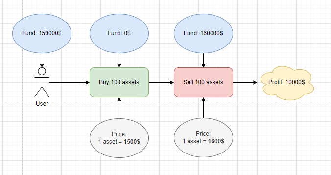
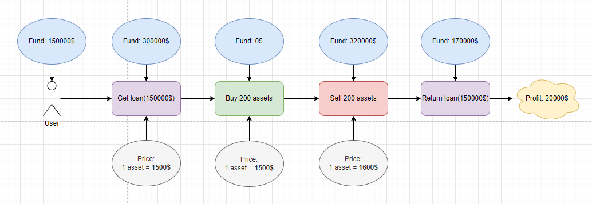
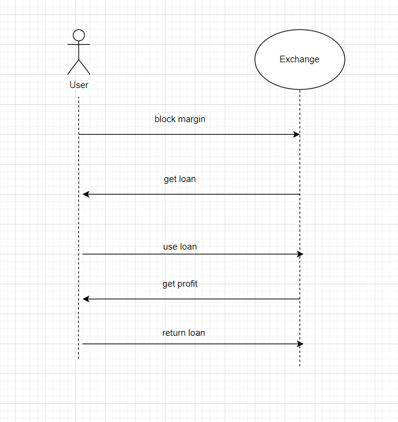
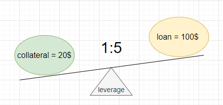
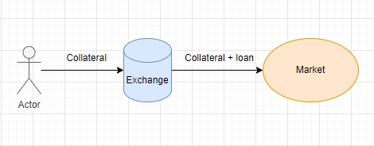
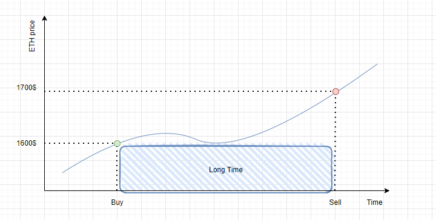
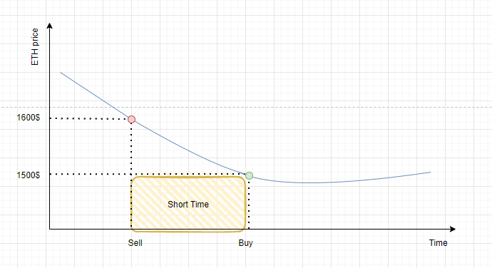

## Margin trading

**Author:** [Pavel Naydanov](https://github.com/PavelNaydanov) 🕵️‍♂️

_Margin trading_ is a trading tool that involves using borrowed funds from a third party. The loan must be repaid within a specified period with interest.

Think of margin trading as taking out a loan, which increases the size of your trade and the potential for higher profits with a smaller initial investment. In the world of CeFi (Centralized Finance), exchanges often serve as the source of these loans, allowing users to access additional assets and use them for intra-exchange trading.

**Important!** The larger the trading volume, the more potential profit you can make. The ability to earn more significantly increases user's interest.

> Let's say the market price of an asset is $1,500 per unit.
>
> 1. We buy 100 units of the asset at a price of $1,500 each. This purchase requires $150,000.
> 2. At that moment, the price of one asset has risen to $1,600.
> 3. We sell 100 units of the asset and receive $160,000.

The net profit is $10,000.

> The market price of an asset is still $1,500 per unit.
>
> 1. Before buying, we take out a loan of $150,000 to purchase an additional asset.
> 2. We buy the assets (100 units + 100 units).
> 3. At that moment, the price of one asset has also risen to $1,600, just like in the previous example.
> 4. We sell all 200 units of the asset and receive $320,000.
> 5. We repay the loan ($150,000).

We have $170,000 left. The net profit is $20,000. This is twice as much as in the case without using a loan.

Impressive, isn't it? Using a loan effectively doubled the profit. 😎

However, loans are never provided for free. In most cases, you need to provide collateral to access additional assets on an exchange. It's just like in real life; if you want to rent a car for a day, you need to leave a deposit as insurance. This collateral is called **margin**.

## Margin

**Margin** is a deposit or blocked funds that allow you to access additional trading volumes. Margin is required to secure the loan provided by the exchange. Therefore, the collateral is temporarily locked using any available method, such as in the user's wallet or a special smart contract. During the loan period, the collateral cannot be used.

Below is a diagram of how margin trading works.

To obtain a loan, the exchange locks the margin and provides the loan. The user can then use the loan to profit from exchange operations. Afterward, the loan must be repaid, and the funds will be unlocked.

Usually, a certain percentage of the loan must be provided as margin to the exchange. This is known as the **margin requirement**.

> For example, the margin requirement could be 20%. This means that the collateral must be equal to 20% of the loan amount. In other words, the margin should be 20% of the loan.

### Types of Margin

There are two main types of margin:

1. **Initial Margin**: This is the amount of an asset required to obtain a loan.

2. **Maintenance Margin**: Typically, this is half of the initial margin. It's the minimum value an asset can have before the exchange requests the return of the loan.

The initial margin is calculated using the following formula:

> **Initial Margin** = Number of assets * Asset price * Margin requirement

For example, if you want to obtain one asset with a price of $1,600, and the margin requirement is set at 30%, the required margin would be $1,600 * 30% = $480. It's important to note that real-world scenarios may involve additional requirements and fees, and margin requirements can vary depending on the asset type, market volatility, and other factors.

The minimum margin is calculated as follows:

> **Maintenance Margin** = Initial Margin / 2

For example, if the initial margin is $480, the minimum margin would be $480 / 2 = $240.

Margins can also be classified into two types based on how sanctions are applied by the lender when the asset's value changes over time (which can happen if the collateral is no longer sufficient to cover the lender's risk of losing the asset):

1. **Cross Margin**: In this case, if there is insufficient collateral over time, all available user funds may be used to cover the loss.

2. **Isolated Margin**: Here, if there is insufficient collateral over time, the available funds are not used. However, there is a risk that the loan may be automatically recalled because the lender's risk is no longer adequately covered.

## Margin Call

A **margin call** refers to the liquidation of margin (collateral) when the exchange or brokerage closes a user's loan because the user no longer meets the margin requirements.

For example, let's say the initial margin for a specific asset is $1,000. Suppose you enter into a 10x leveraged trade, creating a position worth $10,000, with $1,000 as your own funds and the remaining $9,000 borrowed from the exchange.

If the asset's price falls by 10%, your position is now worth $9,000. If the decline continues, you will start losing the borrowed funds. To prevent further losses on the borrowed capital, the exchange will liquidate your position to protect the lender's money. Your position will be closed, and you will not receive any funds back.

It's important to note that exchanges often charge a fee for liquidation. This mechanism is designed to encourage users to close their positions before automatic liquidation occurs.

But how do you determine the liquidation price? The liquidation price is the value at which positions with leverage are automatically closed. Several factors can influence this value:

- Leverage multiplier
- Margin maintenance rate (the minimum amount of assets required to avoid liquidation)
- Asset price
- Remaining assets on the balance

Exchanges automatically calculate the liquidation price, sometimes by averaging values from several major sources. If the exchange sets the liquidation value at 30%, you can calculate a margin call as follows: $1,000 (initial margin) * 30% = $300. If the asset's price falls to $300 or lower, a **margin call** will occur.

Margin calls can typically be avoided by monitoring your margin, not overleveraging, and using auxiliary trading tools such as stop-loss and limit orders.

## Alternative Names for Margin Trading

The practice of margin trading is known by several alternative names:

1. **Leverage Trading**: Leverage refers to the ratio of collateral to the loan amount. In other words, instead of margin requirement, you can talk about the collateral-to-loan ratio.

    > For example, a 1:5 leverage ratio means that for every unit of an asset, you can obtain 5 units as a loan. This implies that your collateral will be 20% of the loan amount.

    

2. **Trading Without Delivery**: This term is less common but describes the concept of not transferring additional assets to the user. The exchange allows these assets to participate in a trade but does not grant full ownership to the user. After the trade is completed, the additional assets are returned. Hence, the name "trading without the actual delivery of assets to the user."

    

## Who Can Engage in Margin Trading?

In theory, margin trading is accessible to any user who can provide the required minimum collateral for a loan. However, there's a catch!

To make a profit, you need to be confident about the price direction. In case of an error, losses from margin trading can be more significant than if margin trading was not used.

**Important!** Margin trading amplifies both profits and losses.

Because of this, exchanges often position margin trading as a tool for advanced users. They may hide it in the interface, create additional usage conditions that require your consent or confirmation of your proficiency with this tool through special testing.

## Long and Short Positions

Assets can be bought and sold, and surprisingly, this can be profitable both when the asset price rises and when it falls. Let's take a closer look.

If you buy an asset with the expectation that its price will rise, it's called a **long position**.

Long means earning profit over the long run. The essence of a long position is to buy an asset while it's cheap with the intention of selling it when the price goes up.

> Market price of the asset: $1,600 per unit.
> 1. Buy 100 units of the asset at $1,600 each.
> 2. Wait until the price of one unit rises to $1,700.
> 3. Sell the purchased assets (100 units).
> 4. Receive a net profit of $10,000.

> You can also use margin trading, which can increase your profit.

There's another way to profit: you can borrow assets and sell them at a high price, wait for the price to drop, buy them back at a lower price, and return the assets. This method of earning is called a **short position**, and it always involves transactions with assets you don't physically own (borrowed assets).

Short means earning profit over the short term. The key here is to sell borrowed assets at a high price now, anticipating buying them back at a lower price later. It's essential to remember that you need to return the borrowed assets to the lender.

> Here's how it works:
> 1. Market price of the asset: $1,600 per unit.
> 2. Assume that the asset's price will fall shortly.
> 3. Borrow 100 units of the asset for immediate sale at a high price.
> 3. Sell the assets (100 units) at a price of $1,600 each.
> 4. Wait for the asset's price to drop.
> 5. Buy 100 units at $1,500 each.
> 6. You now own 100 units of the asset again and have $10,000. This is your profit.

| **Long Position** | **Short Position** |
| ----------------- | ------------------ |
| Buy assets cheap with the aim of selling them at a higher price. Based on the expectation of price growth. | Sell assets at a high price now with the aim of buying them back at a lower price later. Based on the anticipation of price decline and borrowing assets. |

**Important!** The terms **long** and **short** for positions do not indicate a specific time frame but rather the potential direction of trades and operations. It can happen that a long position closes faster than a short position. However, short positions are typically opened for shorter periods. Also, it's crucial to understand that a **short** position always involves transactions with assets you don't physically own (borrowed assets). The potential profit depends on the asset's price movement and the amount of the asset in the trade. Increasing the trade volume with margin trading can amplify potential losses.

> Market price of the asset: $1,600 per unit.
>
> 1. Buy 100 units of the asset at $1,600 each.
> 2. Wait for the price to drop below $1,500.
> 3. Sell the assets now to limit further losses.
> 4. Total loss of $10,000 instead of $20,000 if margin trading with doubled volume was used.

## About dYdX

In the world of DeFi, one of the most prominent exchanges that has implemented margin trading is [dYdX](https://dydx.exchange/). It's a decentralized exchange offering users the following features: perpetual contracts (positions without expiry dates), margin and spot trading, lending, and borrowing.

Under the hood, the exchange implements an [order book](https://academy.binance.com/en/glossary/order-book) and employs Layer 2 technology, specifically ZK-Rollups, to enhance performance and reduce fees. Trades occur in Layer 2, which periodically submits [Zero-Knowledge (ZK) proofs](https://en.wikipedia.org/wiki/Zero-knowledge_proof) (with zero disclosure) to the Ethereum smart contract, providing confirmation of transactions within L2. However, assets must first be deposited into the Ethereum smart contract before they can be used for trading.

It's worth noting that dYdX has issued a governance token called [DYDX](https://coinmarketcap.com/currencies/dydx/) to create its infrastructure.

For perpetual contracts, dYdX offers a full non-custodial decentralized service, providing the ability to engage in margin trading and access various assets. Asset access is facilitated through specialized market entities (markets) representing trading pairs.

To support margin trading, calculations are done in US dollars using the USDC token. By default, margin is **cross-margin** for all markets, and you can only **isolate margin** by creating separate accounts. You can learn more about margin calculations in the [official documentation](https://dydxprotocol.github.io/v3-teacher/#margin-calculation).

To educate users about the dYdX protocol, they offer their own [academy](https://www.dydx.academy/).

## Example of Simple Solidity Implementation

Let's implement a simple version of margin trading using Solidity smart contracts. It's important to note that this is a basic concept to deepen your understanding of the topic.

List of contracts:
1. [MarginTrading.sol](./contracts/src/MarginTrading.sol): This is the core contract that allows opening and closing long or short positions.
2. [SimpleOrderBook.sol](./contracts/src/mocks/SimpleOrderBook.sol): This contract acts as a simple exchange. Essentially, it serves as a price oracle and simulates token transfers between sellers and buyers.
3. [LiquidityPool.sol](./contracts/src/LiquidityPool.sol): This contract implements a liquidity pool, storing assets that can be borrowed to open short or long positions.

`MarginTrading.sol` serves as the heart of our application. The process for opening a long or short position involves user interaction with the `MarginTrading.sol` contract. Under the hood, it interacts with the `LiquidityPool.sol` contract to obtain borrowed funds and repay debt. The actual opening and closing of positions (buying/selling tokens) occurs by calling the relevant functions on the `SimpleOrderBook.sol` contract.

For example, opening a long position would look like this:
1. Obtain the asset's price from `SimpleOrderBook`.
2. Borrow funds from the `LiquidityPool` contract.
3. Purchase the asset on `SimpleOrderBook`.

[Diagram - Opening Long Position]

Closing a long position would involve these steps:
1. Sell all purchased assets on `SimpleOrderBook`.
2. Repay the debt to the `LiquidityPool` contract.
3. Reset debt information on the `MarginTrading.sol` contract.
4. Transfer profits to the owner's address on the `MarginTrading.sol` contract.

[Diagram - Closing Long Position]

For more details, refer to the functions: `openLong()`, `closeLong()`, `openShort()`, `closeShort()` in the [MarginTrading.sol](./contracts/src/MarginTrading.sol) contract.

## Conclusion

Margin trading is one of the fundamental tools in professional trading.

Its advantages include:

1. Allowing the acquisition of assets with collateral from other assets.
2. Being an indispensable tool for increasing profitability.
3. Offering the potential to profit not only from asset appreciation but also from depreciation.

However, it's crucial to be aware of its downsides:

1. In the case of an unsuccessful trade, losses can be substantial.
2. If the exchange finds it no longer profitable to lend to you (your collateral becomes insufficient over time), they may forcibly liquidate your assets.

Despite these significant drawbacks, margin trading has long found favor among its users. While it should be used cautiously, it remains a popular choice among professional traders.
