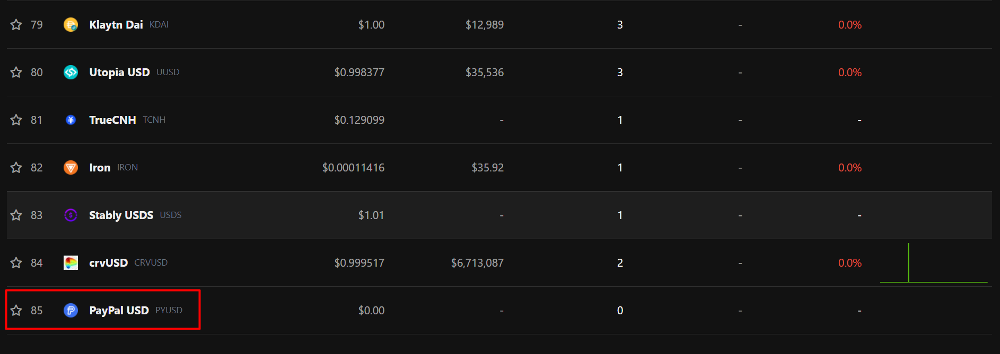
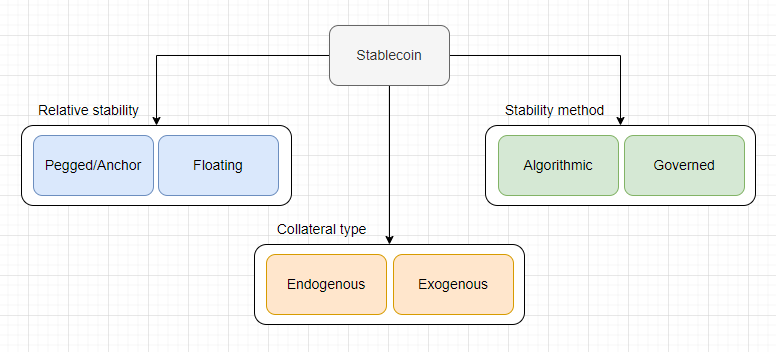
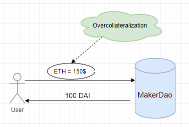
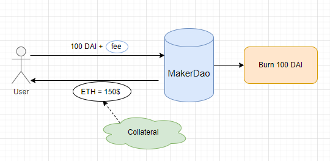
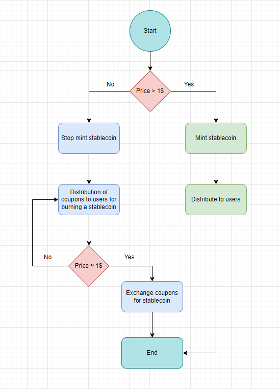
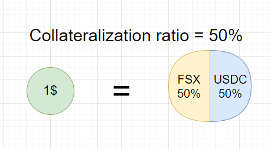
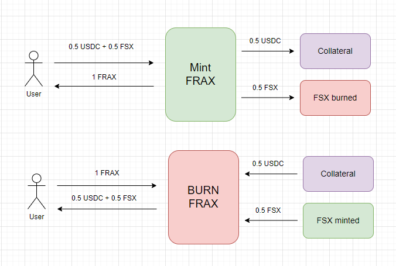
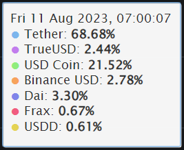

# Stablecoin

**Author:** [Pavel Naydanov](https://github.com/PavelNaydanov) 🕵️‍♂️

A stablecoin is a type of cryptocurrency whose value is pegged to some asset (fiat currency, other cryptocurrencies, precious metals, etc.) and which remains stable relative to other market assets. Stable value is achieved through the holding of reserve assets or the use of algorithms that manage the supply and demand of the stablecoin.

**Important!** Stablecoins help users hedge against cryptocurrency volatility and serve as a reliable means of exchange.

As of the time of writing this article, according to the [CoinGecko](https://www.coingecko.com/) service, there are 85 stablecoins in existence. Among them is the newly introduced [PYUSD](https://www.coingecko.com/en/coins/paypal-usd) by [PayPal](https://www.paypal.com/ru/home). I read an article where they predicted PYUSD to be ranked 4th within a year. 😅 You can check PYUSD's current ranking [here](https://www.coingecko.com/en/categories/stablecoins).



All stablecoins can be categorized into two groups:
- **Centralized**: A prominent example is **USDT**. These stablecoins are issued by centralized organizations, often after receiving fiat funds. They are characterized by a lack of transparency regarding the actual amount of reserve assets that should support the peg.

- **Decentralized**: A prominent example is **DAI**. Governance is largely executed by predefined rules within smart contracts. They are characterized by transparency in reserve holdings to maintain the peg.

Besides, a stablecoin is always pegged to another valuable asset (e.g., the dollar). To maintain legitimacy and utility as a means of payment, it must have some form of "backing" in the form of another valuable asset that can always be exchanged for it. This "backing" is referred to as **collateral**.

## Stablecoin Categories

Inspired by Patrick Collins' [educational course](https://www.youtube.com/watch?v=wUjYK5gwNZs&list=PL4Rj_WH6yLgWe7TxankiqkrkVKXIwOP42&index=4&ab_channel=PatrickCollins) on stablecoins (a developer at [Chainlink](https://chain.link/)), I would like to categorize stablecoins based on his proposed categories with some additions.



1. **Relative Stability**: Based on peg type: pegged or floating.
    - **Pegged**: Examples include USDT, DAI, USDC. These stablecoins are pegged to the dollar, meaning 1 USDC = $1, and there is physically $1 in a bank for each USDC token.
    - **Floating**: No peg to market assets. Stability is achieved algorithmically by regulating supply and demand. Example: [RAI](https://reflexer.finance/).

2. **Stability Method**: Based on the mechanism to maintain the peg: governed or algorithmic.
    - **Governed**: Managed centrally by an organization or company with human involvement in the minting and burning process. Examples: USDT, USC, TUSD.
    - **Algorithmic**: Stability is maintained through transparent algorithms with mathematical calculations or code organization for minting and burning without external interference. Examples: DAI, RAI, FRAX, UST, LUNA.

3. **Collateral Amount**:
    - **Partially-Collateralized**: Examples include UST, which was collateralized by LUNA but also had an algorithmic component that maintained the peg without collateral involvement.
    - **Fully-Collateralized**: Examples: USDT, USDC, BUSD, which are fully backed, with each token backed by one US dollar in a bank account.
    - **Over-Collateralized**: Examples: DAI, where collateral exceeds its nominal value. Such collateralization ensures additional stability and reduces the risk of losing the peg.

4. **Collateral Type**: Based on collateral type: exogenous or endogenous.
    - **Exogenous Collateral**: Collateral is formed off-chain, outside the protocol. For example, ETH serves as collateral for DAI. If something bad happens to DAI (knock on wood), will the same happen to ETH? Answer: No, ETH will continue to be used beyond DAI. Therefore, ETH collateral for DAI is exogenous.
    - **Endogenous Collateral**: Collateral is formed on-chain within the protocol. For example, the LUNA token collateralizes the UST stablecoin. To create UST, you had to burn LUNA, and vice versa. They were created together within one protocol. If something happens to UST, it will also affect LUNA. This was proven in the LUNA crash. Hence, LUNA collateral for UST is endogenous.

Below, we'll delve into some of the most interesting categories of stablecoins.

## Over-Collateralized Stablecoins

**Over-collateralized stablecoins** are stablecoins that require excess collateral to maintain the value pegged to a specific asset. This excess reserve is often referred to as over-collateralization.

The stablecoin **DAI** by [MakerDAO](https://makerdao.com/en/) is the first over-collateralized stablecoin. DAI is pegged to the dollar at a 1:1 ratio. The creation of DAI and the maintenance of its peg are governed by the Maker protocol's lending system.

The **MakerDAO** protocol is designed for user lending. To borrow DAI, users need to provide over-collateralization with collateral assets. The lending protocol specifies a 150% collateralization system. In other words, users can create DAI by locking up collateral worth 150% of the DAI they want to borrow in a smart contract.

At first glance, this may seem inefficient in terms of capital. To borrow an asset, you need to provide collateral worth 150% of that asset's value. However, there are several reasons for this approach:

1. **Resilience to Volatility**:
   Cryptocurrencies are often subject to high volatility. Over-collateralization ensures that the stablecoin will be maintained even during significant fluctuations in the collateral's value. In extreme market situations (black swan events), over-collateralization acts as an additional layer of protection.

2. **Increased User Trust**:
   Over-collateralization increases user trust in the stablecoin. Users can be confident that every stablecoin they receive is backed by collateral significantly exceeding its value.

3. **Interest Rates and Financial Instruments**:
   On over-collateralized platforms, including MakerDAO, users can earn additional rewards by providing assets as collateral. This may also open up other opportunities for participation in financial instruments such as mining, staking, voting, and more.

> Example!
> To acquire $100 worth of DAI, you need to provide collateral in the form of ETH or other assets approved by the protocol, equivalent to $150.



The acquired DAI can be used like any other cryptocurrency. Over-collateralization guarantees that every DAI in circulation is backed by an excess reserve of assets. Interest accrues over time on borrowed DAI. When the borrowed DAI and the interest for its use are returned to the protocol, the user has the opportunity to retrieve their collateral. The DAI used will be burned.



In case the market value of the collateral falls in the MakerDAO protocol, there is a **liquidation** mechanism in place. This involves automatically auctioning off a user's loan to sell the collateral and settle the user's debt. In the first version of the protocol, this was an [English auction](https://en.wikipedia.org/wiki/English_auction), and in the second version, it's a [Dutch auction](https://en.wikipedia.org/wiki/Dutch_auction).

It's worth noting that lending protocols operate on a similar principle. Borrowers can take out a loan, but they need to secure the loan by transferring a certain amount of a specified asset to the protocol. Examples of lending protocols include [Aave](https://aave.com/), [Compound](https://compound.finance/), and [Liquity](https://www.liquity.org/).

**Important!** DAI allows for changes in interest rates through the protocol's DAO (Decentralized Autonomous Organization). This means it's partially **governed**. However, its peg stability is governed by smart contracts, making it **algorithmic** as well.


## Algorithmic Stablecoins

Algorithmic stablecoins are a type of cryptocurrency designed to react to supply and demand indicators to maintain a fixed peg and price stability.

Algorithmic stablecoins can be categorized into three main types:
- Rebasing Model.
- Income Model, which generates income from issuing stablecoins (seniorage).
- Fractional Model.

### Rebasing Model

The Rebasing Model controls the stablecoin's price by adjusting its circulating supply. If the stablecoin's price deviates from the desired peg, the protocol automatically increases or decreases the amount of the stablecoin held by each user over a fixed period.

This peg works because by regulating the supply of the stablecoin, you can influence its price based on a straightforward [inflationary/deflationary economic theory](https://www.coindesk.com/learn/inflationary-and-deflationary-cryptocurrencies-whats-the-difference/).

One example of a stablecoin using the Rebasing Model is [AMPL](https://www.coingecko.com/en/coins/ampleforth) from the [Ampleforth](https://www.ampleforth.org/) project. The amount of AMPL in circulation increases or decreases based on the weighted average price over a day ([TWAP](https://en.wikipedia.org/wiki/Time-weighted_average_price#:~:text=In%20finance%2C%20time%2Dweighted%20average,achieve%20the%20TWAP%20or%20better.)). Each holder experiences a proportional change in their holdings during each supply adjustment.

> Example:
> If Alice owns 100 AMPL tokens before a 10% increase in supply, she will own 110 AMPL tokens afterward. Similarly, if Bob had 10 AMPL tokens, he will now have 11 AMPL tokens.

The Rebasing Model in **Ampleforth** is directly implemented within the token's contract. You can find more details in the code [here](https://etherscan.io/address/0xd0e3f82ab04b983c05263cf3bf52481fbaa435b1#code).

The contract introduces a `rebase()` function to handle these supply adjustments.


``` solidity
/**
 * @dev Notifies Fragments contract about a new rebase cycle.
 * @param supplyDelta The number of new fragment tokens to add into circulation via expansion.
 * @return The total number of fragments after the supply adjustment.
 */
function rebase(uint256 epoch, int256 supplyDelta)
    external
    onlyMonetaryPolicy
    returns (uint256)
{
    if (supplyDelta == 0) {
        emit LogRebase(epoch, _totalSupply);
        return _totalSupply;
    }

    if (supplyDelta < 0) {
        _totalSupply = _totalSupply.sub(uint256(supplyDelta.abs()));
    } else {
        _totalSupply = _totalSupply.add(uint256(supplyDelta));
    }

    if (_totalSupply > MAX_SUPPLY) {
        _totalSupply = MAX_SUPPLY;
    }

    _gonsPerFragment = TOTAL_GONS.div(_totalSupply);

    emit LogRebase(epoch, _totalSupply);
    return _totalSupply;
}
```

The function can only be called by the **monetaryPolicy** address, which was previously set by the contract owner. The function takes the **supplyDelta** parameter, which indicates how much to adjust the total supply of the AMPL token.

Here's the crucial part: this function then updates the private variable **_gonsPerFragment**. This variable is what determines the balance of each user, thereby increasing or decreasing it.

``` solidity
/**
 * @param who The address to query.
 * @return The balance of the specified address.
 */
function balanceOf(address who) external view override returns (uint256) {
    return _gonBalances[who].div(_gonsPerFragment);
}
```

**Important!** The rebase model has two compelling justifications: **simplicity** and **fairness**. This elegant, straightforward, and comprehensible solution rightfully claims to be the fairest model for implementing algorithmic stablecoins, allowing all token holders to maintain their share in the network after each rebase. However, there's an opinion that stability should be achieved not only in terms of price stability but also in terms of the stability of savings. The rebase model addresses the first challenge but not the second.

This means that the purchasing power of a stablecoin holder based on the rebase model fluctuates in proportion to changes in their wallet balance.

You can explore other tokens with a similar model [here](https://www.coingecko.com/en/categories/rebase-tokens).

### Seigniorage Model

The seigniorage model controls the price of a stablecoin using a reward system that affects market dynamics. In other words, the model maintains the peg by managing the supply of the stablecoin.

- When the price is above the peg, new tokens are minted and distributed to protocol participants who provide liquidity.

- When the price falls below the peg, token minting stops, and a supply reduction mechanism is activated. This creates an opportunity to acquire special coupons in exchange for burning the underlying token to reduce the supply. Often, these coupons can be exchanged for a larger quantity of tokens in the future, but only when the price returns to or exceeds the intended peg.



The mechanics involving "coupons" require the implementation of an additional token to isolate the main stablecoin from market dynamics.

One representative of this model is the [Empty Set Dollar](https://www.emptyset.finance/) project with its DSU stablecoin and ESS tokens in the form of coupons. You can review the contracts of this project [here](https://github.com/emptysetsquad/emptyset/tree/master).

You can explore other tokens with a similar model [here](https://www.coingecko.com/en/categories/seigniorage).

### Fractional Model

Fractional models of algorithmic stablecoins are a combination of over-collateralization and algorithmization. In other words, to mint a stablecoin, you need to partially back it with real assets (for example, another stablecoin) and secure the remaining part algorithmically. This approach carries fewer risks of centralization and demonstrates a higher level of stability.

One of the first projects to implement such a model is the [Frax.Finance](https://frax.finance/) protocol. Currently, it supports three stablecoins:
  - **FRAX**: A stablecoin pegged to the dollar.
  - **FPI** (Frax Price Index): A stablecoin linked to a basket of consumer goods.
  - **frxETH** (FraxEther): A stablecoin tied to ETH for use as a wrapped ether (WETH) replacement.

**Important!** The golden rule of FRAX is that 1 FRAX can always be created or exchanged for 1 dollar. This is one of the key differences from other stablecoins, allowing arbitrageurs to maintain the stability of the stablecoin in the wider market.

To manage the ecosystem and regulate peg stability, two tokens are used: the Frax Share token (**FXS**) and the **AMO (Algorithmic Market Operations Controller)**.

**AMO** consists of autonomous contracts that monitor the monetary and credit policy until the peg changes. After a peg change, AMO controllers can perform market operations to stabilize the peg. However, AMO cannot create FRAX stablecoins out of thin air.

To directly regulate the peg, the concept of **CR (collateral ratio)** is used. This metric is directly correlated with the market value of the stablecoin.

> Example.
> If the price of FRAX is above $1, the CR decreases.
> If the price of FRAX is below $1, the CR increases.

A CR of 50% means that 1 FRAX (equivalent to $1) is backed by 50% FSX and 50% of another asset (e.g., USDC; the first version of the protocol required usdc as collateral).



This means that to obtain 1 FRAX, you need 0.5 FSX and 0.5 USDC.



After `mint()`, 0.5 FSX will be burned, and 0.5 USDC will be held as collateral.
Burning FRAX and receiving collateral involve the reverse procedure.

Thus, AMO is left only to manage the quantity of the **FXS** token. As FXS partially backs the stablecoin, its quantity helps maintain the peg.

## Example

Let's continue drawing inspiration from Patrick Collins and, together with him, implement an algorithmic stablecoin with a fixed peg as an example. The stablecoin will use wrapped ether (wETH) and bitcoin (wBTC) as collateral. The stablecoin will be **exogenous**.

The collateral's value will be calculated in dollars, and a decentralized oracle from [chainlink](https://chain.link/) will be used to convert wETH and wBTC to USD.

Two contracts have been implemented:
    - [StableCoin.sol](./contracts/src/StableCoin.sol)
    - [Engine.sol](./contracts/src/Engine.sol)

The `StableCoin.sol` contract implements the ERC-20 token standard. It restricts the ability to mint and burn tokens to an address authorized by the contract owner.

The `Engine.sol` contract organizes the main mechanics for implementing minting, burning, monitors over-collateralization rules, and provides a mechanism for collateral liquidation if needed.

## Conclusion

Stablecoins may not be full-fledged financial applications, but they play a critically important role in the world of DeFi applications. Several aspects of stablecoin use include:

1. **Medium of Exchange**: Stablecoins provide a stable medium of exchange compared to other cryptocurrencies prone to high volatility. This is particularly useful for trading and other financial operations.

2. **Liquidity**: Stablecoins are often used as trading pairs on decentralized exchanges. They provide necessary liquidity and stability, allowing users to easily exchange one asset for another.

3. **Long-term Storage**: DeFi offers various investment and earning opportunities, and stablecoins provide a secure way to store funds without the need to convert them into fiat currencies.

4. **Foundation for Other Tools**: Stablecoins can be integrated into smart contracts and serve as the basis for more complex financial instruments, such as derivatives, loans, insurance, and more.

5. **Accounting and Auditing**: The use of stablecoins simplifies accounting and auditing as all transactions are recorded on the blockchain and available for verification. This is intended to reduce the risks of fraud or errors in financial reporting.

However, the impact of truly decentralized stablecoins is still limited. According to [CoinGecko](https://www.coingecko.com/), Tether dominates the cryptocurrency market, with USD Coin accounting for slightly less than a quarter of the market.



Nevertheless, there are arguments against full decentralization of stablecoins:

- **Lack of Stability**: As demonstrated, some stablecoins had significant deviations from their peg, and some even lost it entirely. The [failure](https://indianexpress.com/article/technology/crypto/luna-terra-crash-a-brief-history-of-failed-algorithmic-stablecoins-7934293/) of Luna is a prime example.

- **Fraud Accusations**: Several [accusations](https://www.sec.gov/news/press-release/2023-32) have been made that decentralized stablecoin teams "abscond with user funds." This significantly impacts user trust in such projects.

- **Centralization**: Strangely, there are still many questions about how decentralized decentralized stablecoins are. Often, a DAO system is used, but such a system is subject to changes against the community's will.

Even so, an ideally decentralized stablecoin system has many advantages over centralized versions. Such a system is governed by mathematics and is resistant to third-party influence. I believe that decentralized algorithmic stablecoins need more time for success. We will continue to monitor their progress!

## Links

1. [Video](https://www.youtube.com/watch?v=wUjYK5gwNZs&list=PL4Rj_WH6yLgWe7TxankiqkrkVKXIwOP42&index=3&ab_channel=PatrickCollins) about stablecoins by Patrick Collins from Chainlink. Lesson 12.
2. [What are Decentralized Stablecoins? A Look At DAI, GHO, crvUSD, FRAX, and More](https://www.coingecko.com/learn/what-are-decentralized-stablecoins#4)
3. [Stability, Elasticity, and Reflexivity: A Deep Dive into Algorithmic Stablecoins](https://insights.deribit.com/market-research/stability-elasticity-and-reflexivity-a-deep-dive-into-algorithmic-stablecoins/)
