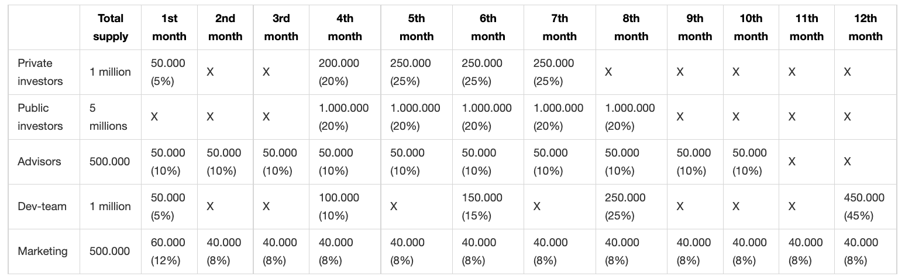
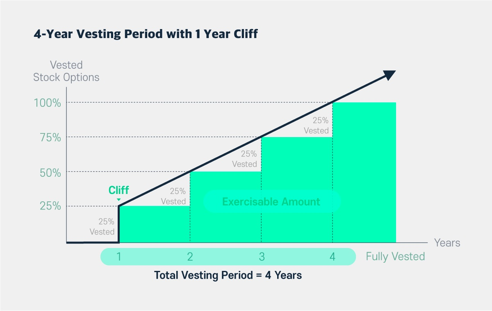
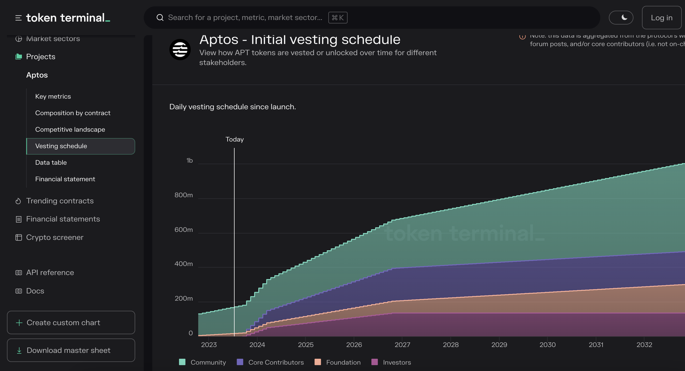
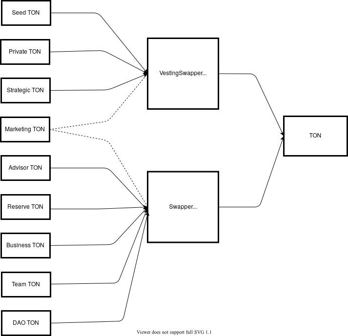
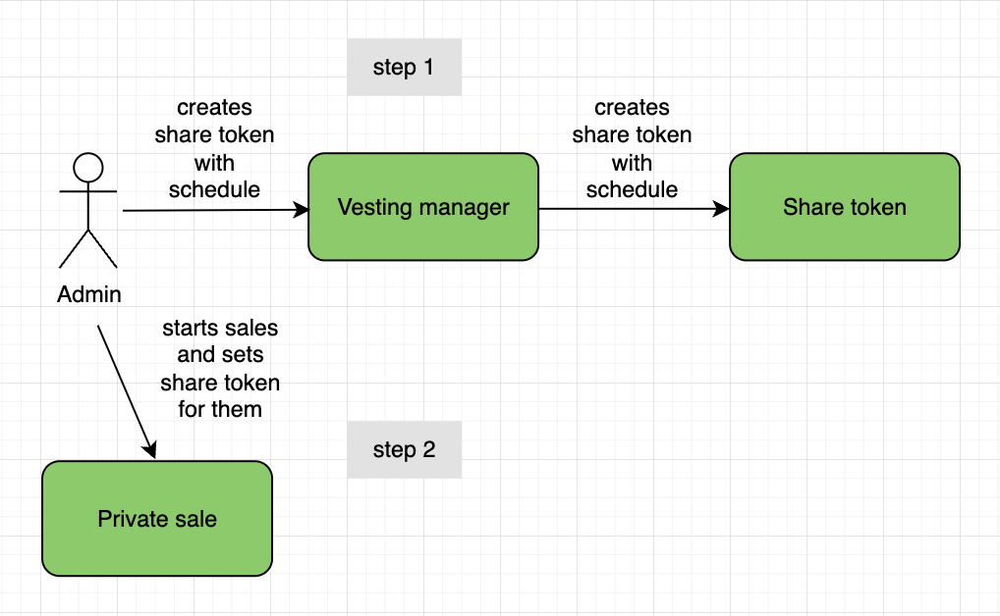
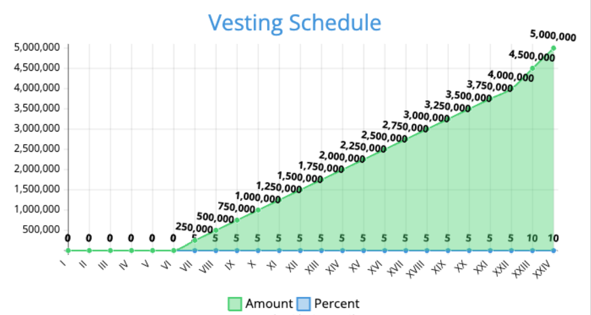

# Vesting 

-   [Vesting](#vesting)
    -   [What is vesting?](#what-is-vesting)
    -   [What types of vesting exist?](#what-types-of-vesting-exist)
        -   [Calendar-based Vesting](#calendar-based-vesting)
        -   [Phased Vesting](#phased-vesting)
    -   [Token Payouts](#token-payouts)
    -   [Questions about Technical Implementation](#questions-about-technical-implementation)
    -   [Vesting Implementation Options](#vesting-implementation-options)
        -   [**1. On ERC20 Token Smart Contract**](#1-on-erc20-token-smart-contract)
        -   [Outcome:](#outcome)
            -   [Pros:](#pros)
            -   [Cons:](#cons)
        -   [**2. Vesting Implementation through Smart Contract System**](#2-vesting-implementation-through-smart-contract-system)
        -   [Outcome:](#outcome-1)
        -   [Pros:](#pros-1)
        -   [Cons:](#cons-1)
        -   [**3. Vesting on a Separate Smart Contract**](#3-vesting-on-a-separate-smart-contract)
        -   [Outcome:](#outcome-2)
    -   [Conclusion](#conclusion)
    -   [References](#references)

## What is Vesting?

Vesting is a collective term for various methods, approaches, and patterns of token distribution following a token sale or other forms of cryptocurrency asset sales.

In traditional finance, the term "vesting" refers to gaining the right to control assets (such as stocks or pension savings) after a specific period of time or upon meeting certain conditions. For instance, employees might receive company stocks but won't be able to sell them immediately. This ensures their vested interest in the company's success and prevents market pressure from sellers that could drive down stock prices.

In the context of cryptocurrencies, vesting is an integral part of a project's [tokenomics](https://medium.com/coinmonks/tokenomics-4-factors-that-determine-a-cryptos-success-858ee7a0cf94), which is designed considering human psychology and mathematical models. This helps maintain token prices under control, at least within certain ranges. Token sales often include multiple phases, such as seed rounds, private rounds, strategic sales, ICOs, etc. The token price can vary significantly between these phases.

A well-designed and balanced token distribution schedule over time manages price fluctuations and overall project integrity. It especially safeguards against mass token sell-offs right after listing on exchanges, enabling price control in the long run. Vesting can also be utilized to incentivize project participants, like developers or marketers who receive tokens as rewards for their work.

It's important to note that not all tokens are subject to vesting since that would severely impact liquidity. Usually, vesting involves locking up around 10-20% of the total token supply, which can include tokens allocated to the team, investors, consultants, etc.

## Types of Vesting

There are two most popular models: calendar-based and milestone-based vesting.

### Calendar-Based Vesting

The distribution model for calendar-based vesting might look like this:

-   **Early Investors**: A total of 1 million tokens is allocated to them. In the first month after the start, they receive 5% of their allocated tokens. Their remaining tokens stay locked for the second and third months. In the fourth month, they receive 20% of tokens, followed by 25% of the remaining tokens each subsequent month.

  **Public Investors**: A total of 5 million tokens is allocated to them. They can't claim any tokens for the first three months; their funds remain locked. This initial period between the start of vesting and the first token distribution is called the cliff period. For public investors, this cliff period lasts three months. After that, they receive 20% of tokens each month.

        Cliff — the time between vesting start and the first token payment after unlocking.

-   **Advisors**: A total of 500,000 tokens is allocated to them. They receive 10% of their allocation every month over a period of 10 months.

-    **Development Team**: A total of 1 million tokens is allocated to them. To enhance motivation and trust, they receive a significant portion of their tokens after a year. In the first month, 5% is unlocked; then 10% in the fourth month, 15% in the sixth month, and 25% in the eighth month. The remaining 45% of tokens remain locked until the twelfth month after the start of vesting.

-   **Marketing**: A total of 500,000 tokens is allocated to sustain the marketing campaign. These tokens are unlocked over a year. In the first month, 12% of the total amount is accessible, followed by 8% each subsequent month.

_Table: Calendar-Based Vesting Schedule_

### Milestone-Based Vesting

In milestone-based vesting, tokens are unlocked gradually over time, but without distinct periods. The most common type is linear vesting, but other types exist like stepped, quadratic, etc.

In linear vesting, tokens unlock with each passing second or upon new block creation. In stepped vesting, tokens unlock according to a predetermined schedule.

The vesting schedule defines the pace at which asset rights are transferred to the beneficiary. Periods can vary significantly depending on the agreement, usually ranging from 1 to 4 years. Vesting schedules are often depicted graphically.

Example of stepped vesting, distributing 25% of the total token supply annually.

_Example of 4-year stepped vesting with annual cliff._

Milestone-based vesting can also have a cliff period. For instance, if token sales start in January with a 6-month cliff period, payouts will only begin in July, and all tokens will be locked until that time.

You can check the schedule for specific coins using the service [tokenterminal.com](https://tokenterminal.com/). To do this, access the dashboard, select the project, and view the Vesting Schedule tab. Below is the vesting schedule for the Aptos project.

_Vesting schedule for Aptos project_

## Token Payouts

Token payouts are carried out according to the schedule mentioned earlier. There are two main approaches to payouts: known as push and pull.

**Pull:** With the pull method, the beneficiary can claim their tokens by initiating a blockchain transaction. After vesting ends, the tokens are unlocked but remain in the smart contract until the beneficiary transfers them to their wallet or a designated address. This approach provides token holders with more control over when they receive their tokens, as they can choose specific token retrieval dates.

Example: According to the distribution schedule, 10% of the total tokens are unlocked each month. This means you could claim 5% after half a month or choose not to claim anything for three months and then receive 30% at once.

**Push:** With the push method, tokens endowed are automatically transferred to the beneficiary's address without requiring any action from them.

This way, beneficiaries don't need to pay transaction gas fees for token claiming, but there's a trade-off: the beneficiary has less control over when the tokens are transferred since it depends on the payout schedule and rules established in the smart contract.

## Questions Regarding Technical Implementation

Here, we conclude the general information about vesting and provide an overview of technical solutions for implementation in smart contracts.

Despite the simplicity of the core vesting idea (locking tokens after purchase and subsequently unlocking them per a schedule), the technical implementation can vary significantly from project to project. Product managers' creativity and decentralization principles dictate their own rules. Therefore, before implementing it on smart contracts, several questions need to be answered.

1. What type of vesting will be used? (linear, stepped, calendar-based, etc.)
    - Will all users have the same schedule, or will it differ for each beneficiary?
2. When will tokens be locked? During the token sale or for project stakeholders? (e.g., vesting for developers or marketers)
    - If during the token sale, which sale phases should trigger token locks? (public, private, etc.)
    - If it's for the team, how many addresses will participate in vesting?
3. When will vesting start? At what point? (after the start of sales, after sales end, at the time of purchase)
4. Will there be a cliff period?
    - What actions can be performed with tokens during the cliff period?
    - What actions are prohibited with tokens during the cliff period?
5. How will tokens be locked after purchase: on the user's wallet, on a separate contract, or both? (e.g., users receive share tokens that will later be exchanged for the base token, which was locked)
6. How will tokens be unlocked and paid out?
    - Which approach will be used (push or pull)?
    - What will the payout schedule be?
    - Who can set the payout schedule and when?
    - If, for instance, it's vesting for the team, can vesting start without tokens on the smart contract or withdraw them before payouts? How will this affect the vesting start time?

These and many other questions can arise during the vesting implementation process. Below, I'll describe how different vesting variations can architecturally appear in smart contracts and their advantages and disadvantages.

## Implementation Approaches for Vesting

### **1. On an ERC20 Token Smart Contract**

One approach to implementing vesting in cryptocurrency projects is to incorporate vesting directly into the smart contract of the token. This method involves linking the private sale smart contract with the token smart contract (or the sales functionality should also be on the token smart contract). During the sale process, a certain amount of tokens is locked for a specific user. If multiple rounds of private sales occur, an identifier for vesting can also be assigned.

The payout schedule in the token smart contract can be set by the contract administrators or other roles specifically created for this purpose.

### Outcome:

#### Pros:

1. Basic (locked) tokens are held on the user's wallet. However, if the balance display function is changed, this point can't be considered a pro. Confusion might arise, so careful consideration of balance display (locked and unlocked) is advised.
2. No need to initiate a separate transaction for claiming tokens. They become available automatically, meaning the user's balance increases at certain intervals.

#### Cons:

1. Keeping the code of the token smart contract "clean" and easily readable is considered good practice. Any additional logic requires thorough checks and ideally, good audits.
2. Introducing new functionality inevitably leads to adding additional roles, which increases the risks of hacks and mistakes. The most vulnerable part of a smart contract is always the human element, which can modify something in it or set incorrect parameters. More complex protection and admin functionality management will be needed.
3. To display balances correctly and perform checks during token transfers, standard methods like `transfer` and `balanceOf` will require modification. Additionally, if a separate smart contract handles sales, the token gains external dependencies. This also adds possibilities for potential vulnerabilities. Hence, finding a reliable and optimal solution for such functionality might require more time.
4. If balance display remains untouched, there's an issue where tokens are present but it's necessary to check what portion can be spent and what will be unlocked later.
5. This solution increases the risk of errors and potential threats. Complexity further increases due to multiple private sale rounds, resulting in several different vesting schedules.
6. After vesting ends, the smart contract will contain "dead" code. Token transfer verification will take place throughout the contract's entire lifespan, which slightly increases gas costs.

In conclusion, this implementation might not be the best solution. The vesting functionality is only necessary for a specific period, and if it's somehow tied to the token, such a connection and "dead" (unused) code will remain indefinitely. I couldn't even find suitable examples of smart contract code with such an implementation.

### **2. Vesting Implementation via Smart Contract System**

Another approach to vesting implementation involves using a smart contract system. For instance, let's consider the TON project ([Tokamak Network Token](https://medium.com/onther-tech/ton-token-vesting-system-29588659260)). This ecosystem "divides" the target token (TON) into tokens that act as "shares" of the target token. At each sales stage, the buyer receives tokens of different types, such as `SeedTON`, `PrivateTON`, or `StrategicTON`. There are a total of nine such tokens in the system, and the entire supply is distributed among them. These tokens have their own price relative to the target token and each has its own payout schedule. According to this schedule, share tokens are later exchanged for the target tokens, and share tokens are burned in the process. This is done through a special smart contract, `Swapper`, while the target tokens are also stored separately. Share tokens cannot be transferred – a separate smart contract manages this.

This ecosystem consists of around 15 smart contracts. The target and child tokens are developed in a unique way (externally, they are ERC20 tokens, but they are implemented differently inside). The architecture was built based on the project's complex tokenomics. You can explore the TON smart contracts in this [repository](https://github.com/tokamak-network/presale-contracts/tree/master/contracts).

_TON Smart Contract System_

### Outcome:

#### Pros:

1. Tokens will be stored in the user's wallet.
2. No issues with balance display.
3. Elegant decentralized solution.

#### Cons:

1. User experience: buyers need to understand the token vesting concept and the redemption process. Good documentation, guides, and user-friendly interfaces are necessary.
2. The pull approach is used for payouts. This means beneficiaries will need to perform two transactions: purchase and claim.
3. Despite holding share tokens as ownership, users won't be able to perform any actions with them except exchanging them for the target token. Any transaction will fail.
4. The main downside is the high complexity of implementing such a system, which isn't always necessary.

## **3. Vesting on a Separate Smart Contract**

The most popular approach to vesting implementation in cryptocurrency projects involves placing vesting logic on a separate smart contract. In this approach, there are numerous variations, but I'll describe just one of them that we tried on a real project. The main idea is taken from the previous approach, but the implementation is quite different.

It's important to introduce two concepts to avoid confusion:

1. **Base Token** - this is the main project token or the target token that users purchase and require vesting for.
2. **Share Token** - this is a dummy token issued to users as a voucher that they will need to redeem to claim the base token at a 1:1 rate.

Our vesting implementation is a combination of several smart contracts:

- Private sale smart contract for the base token
- Share token smart contract (with vesting logic)
- Smart contract for creating share tokens with a set schedule

**Private Sale Contract:** Its main task is to sell tokens through a whitelist. Additionally, it manages sales parameters and payment receipts. However, what's most important for us in this case is handling the issuance of share tokens to buyers. The key here is that during the sale, the tokens purchased are transferred not to the user, but to the share token smart contract, where they are locked. Share tokens are minted for the user in return.
I won't provide an example of such a smart contract here, as it could essentially be an ordinary EOA. All that's needed is to grant approval for the base token to the share token, after which it can be minted.

In the future, the user will be able to claim the base token from this contract, but they will need to burn their share tokens, which can be done according to the set vesting schedule.

**Share Token Contract:** Or vesting token. It can have any name. The main thing is to understand its essence: it's a dummy token. It can't be sold or transferred to another wallet. All transfers of this token are prohibited, and there's no admin control over it.
It has four main tasks:

- Minting
- Burning
- Holding the base token
- Calculating the amount of locked and unlocked base tokens

The minter here is the private sale contract (remember that this could be any address with the base token). The user themselves will burn these tokens when claiming their base tokens. No one can easily withdraw tokens from the contract; it serves as a secure vault.

Here's a simple example of a smart contract called [VestingToken](./examples/src/VestingToken.sol).

This approach allows to create multiple share tokens for different sales rounds. Each share token will have its own vesting schedule. Plus, it will act as a pool for base tokens from the sales round. This approach gave us even more flexibility than we initially thought, but more on that later.

The contract implements a very flexible feature for setting the vesting schedule. You can specify dates and times as regular timestamps (down to the second), set any number of payout periods with different intervals, and even adjust the payout percentages for each interval. The only condition is that the total adds up to 100%. This allows for various scenarios and vesting distribution graphs.
Here's an example of a schedule that can be set up. This represents a vesting period of 2 years with a 6-month cliff and a changing percentage distribution (10% for the last two months, and 5% for all previous months):

| Month | Percent % | Amount   |
| ----- | --------- | -------- |
| 1     | 0         | 0        |
| 2     | 0         | 0        |
| 3     | 0         | 0        |
| 4     | 0         | 0        |
| 5     | 0         | 0        |
| 6     | 0         | 0        |
| 7     | 5         | 250,000  |
| 8     | 5         | 250,000  |
| 9     | 5         | 250,000  |
| 10    | 5         | 250,000  |
| 11    | 5         | 250,000  |
| 12    | 5         | 250,000  |
| 13    | 5         | 250,000  |
| 14    | 5         | 250,000  |
| 15    | 5         | 250,000  |
| 16    | 5         | 250,000  |
| 17    | 5         | 250,000  |
| 18    | 5         | 250,000  |
| 19    | 5         | 250,000  |
| 20    | 5         | 250,000  |
| 21    | 5         | 250,000  |
| 22    | 5         | 250,000  |
| 23    | 10        | 500,000  |
| 24    | 10        | 500,000  |

This is how it would look on a graph:

_Vesting Schedule_

**Smart Contract for Creating Share Tokens:** In our system, it's called the Vesting Manager. Essentially, it's a factory for share tokens that works under the hood with the [Minimal Clones](https://docs.openzeppelin.com/contracts/4.x/api/proxy#Clones) proxy pattern from OpenZeppelin. When creating a new token, in addition to `name` and `symbol`, the schedule, base token address, and the minter's address are set. The contract has the ability to change the share token's implementation.

You can also take a look at a simple example smart contract called [VestingManager](./examples/src/VestingManager.sol).

### Result:

This approach also has its pros and cons, but compared to the previous options, it achieves an optimal balance between security, flexibility, and development speed. This solution can be confidently called decentralized and transparent for the user, as the only way to lose funds is to lose access to their wallet. Various mechanisms have also been implemented to protect against admin errors when configuring sales rounds or vesting schedules, but that's another story.

## Conclusion

And now, why is the last solution quite flexible? In startups, everything changes very rapidly, and it's impossible to completely hedge against it, but you can try to prepare yourself. In our case, the client made a decision to fundamentally change the initial concept. Firstly, the backend was largely responsible for sales, and secondly, share tokens now needed to be burned at any time and exchanged for NFTs. All this was disconnected from the vesting schedule. Moreover, base tokens also needed to be burned.

The burning functionality led to a number of complex tasks, such as creating burning rounds and recalculating the vesting schedule. However, the main contract responsible for vesting (share token) was already ready for sales via the backend. It just needed to be created through the Vesting Manager contract, set up with a schedule, and assigned the backend address as the minter.

All of this confirms the main idea of this article. There are no standards, typical solutions, or benchmarks for vesting. Most likely, it will always be a custom solution tailored to the specific needs of the client, using a mix of approaches from other projects and custom inventions.

## References

- [Tokenomics: 4 Factors That Determine a Crypto’s Success](https://medium.com/coinmonks/tokenomics-4-factors-that-determine-a-cryptos-success-858ee7a0cf94)
- [Tokamak Network TON Swap System Overview](https://medium.com/onther-tech/ton-token-vesting-system-29588659260)
