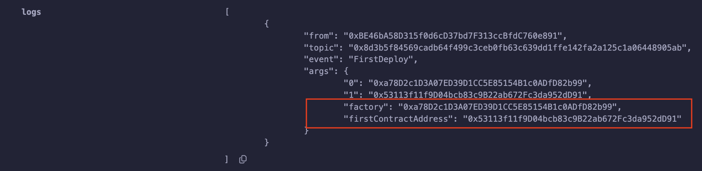
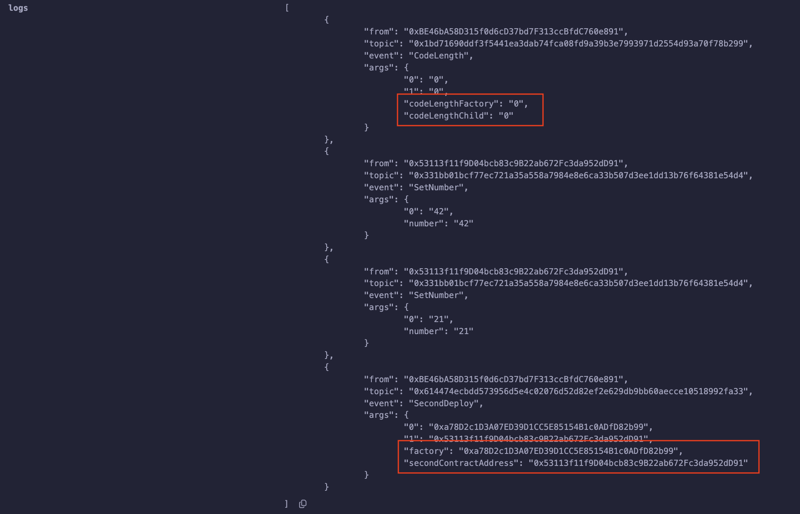

# EIP-1014: Skinny CREATE2

**Author:** [Roman Yarlykov](https://github.com/rlkvrv) 🧐

It used to be better — or at least more reliable. That's how you could describe the `CREATE` opcode, the predecessor of `CREATE2`. It was simple and didn’t cause issues (potential vulnerabilities).


## Opcode CREATE

In fact, the `CREATE` opcode hasn't gone anywhere — it's used every time a contract is created using the `new` keyword:

```solidity
contract Bar {
    // @notice Creating a contract via create without sending ETH to the new address
    function createFoo() external returns (address) {
        Foo foo = new Foo();

        return address(foo);
    }

    // @notice Creating a contract via create with sending ETH to the new address
    function createBaz() external payable returns (address) {
        Baz baz = new Baz{value: msg.value}();

        return address(baz);
    }
}
```

The full contract code is provided [here](./contracts/CreateWithNew.sol).

The `CREATE` opcode takes three arguments and returns one value:

**Input data (Stack input):**
- `value` — the amount of native currency in wei to be sent to the new address.
- `offset` — the byte offset where the contract’s initialization code starts.
- `size` — the size of the initialization code.

**Output data (Stack output):**
- `address` — the address of the deployed contract, or `0` if an error occurred.

Deploying a contract via assembly looks more illustrative:

```solidity
contract Deployer {
    // @notice Creating a contract via create without sending wei to the new address
    function deployFoo() public returns (address) {
        address foo;
        bytes memory initCode = type(Foo).creationCode;

        assembly {
            // Load the initialization code into memory
            let codeSize := mload(initCode) // Size of the initialization code
            let codeOffset := add(initCode, 0x20)  // Skip 32 bytes that contain the length of the initCode array

            // Call CREATE without sending msg.value
            foo := create(0, codeOffset, codeSize)
            // Check that the contract was successfully created
            if iszero(foo) { revert(0, 0) }
        }

        return foo;
    }
}
```

The full contract code with creation via assembly is [here](./contracts/CreateWithAssembly.sol).

### Address Calculation with the CREATE Opcode (0xf0)

For the `CREATE` opcode to return the address of the deployed contract, it needs the caller’s address (`msg.sender`) and its `nonce`:

In simplified form, it looks like this:
```js
address = hash(sender, nonce)
```
But in reality, the process is more complex:
```js
address = keccak256(rlp([sender_address, sender_nonce]))[12:]
```

Where:
- `sender_address` — the address of the sender creating the contract.
- `sender_nonce` — the sender’s nonce (number of transactions sent from this address).
- `rlp` — RLP encoding function. RLP (Recursive Length Prefix) is used for serializing data in Ethereum, ensuring unambiguous and predictable encoding.
- `keccak256` — the Keccak-256 hash function.
- `[12:]` — the first 12 bytes are discarded since `keccak256` returns 32 bytes, and an Ethereum address takes the last 20 bytes of the hash (32 - 20 = 12).

Thus, in theory, it’s possible to calculate the future contract address in advance. However, there's a problem: this address depends on the `nonce`. If another transaction is sent before the contract is deployed, the `nonce` will increase, and the calculated address will become invalid.

Due to the use of RLP for address calculation, the following bulky function is needed in Solidity before deployment:

```solidity
function computeAddressWithCreate(uint256 _nonce) public view returns (address) {
    address _origin = address(this);
    bytes memory data;

    if (_nonce == 0x00) {
        data = abi.encodePacked(bytes1(0xd6), bytes1(0x94), _origin, bytes1(0x80));
    } else if (_nonce <= 0x7f) {
        data = abi.encodePacked(bytes1(0xd6), bytes1(0x94), _origin, uint8(_nonce));
    } else if (_nonce <= 0xff) {
        data = abi.encodePacked(bytes1(0xd7), bytes1(0x94), _origin, bytes1(0x81), uint8(_nonce));
    } else if (_nonce <= 0xffff) {
        data = abi.encodePacked(bytes1(0xd8), bytes1(0x94), _origin, bytes1(0x82), uint16(_nonce));
    } else if (_nonce <= 0xffffff) {
        data = abi.encodePacked(bytes1(0xd9), bytes1(0x94), _origin, bytes1(0x83), uint24(_nonce));
    } else {
        data = abi.encodePacked(bytes1(0xda), bytes1(0x94), _origin, bytes1(0x84), uint32(_nonce));
    }
    return address(uint160(uint256(keccak256(data))));
}
```
The total encoding length depends on how many bytes are needed to encode the `nonce`, since the address has a fixed length of 20 bytes — hence all the `if` statements.

For example, if the nonce is 0, the parameters mean the following:

- `0xd6` — the total length of the structure is 22 bytes (in the case where `nonce` is 0).
- `bytes1(0x94)` — indicates that the following field is 20 bytes long.
- `_origin` — the address field.
- `bytes1(0x80)` — indicates that the `nonce` is 0, according to RLP.

The rest is similar — only the `nonce` is added as one byte and so on. In RLP encoding, it’s important to explicitly specify the length of the data before the data itself.

I added this function to the [Deployer](./contracts/CreateWithAssembly.sol) contract — you can test it in Remix.

## The Premises for CREATE2 Creation

In 2018, Vitalik Buterin proposed [EIP-1014: Skinny CREATE2](https://eips.ethereum.org/EIPS/eip-1014) with the following motivation:

> *"Allows interactions (actual or counterfactual in channels) with addresses that do not yet exist on-chain but can be relied on to eventually contain code created by a given initialization code. This is important for state channel use cases involving counterfactual interactions with contracts."*

Sounds complicated, but I’ll try to explain. It’s about [state channels](https://ethereum.org/en/developers/docs/scaling/state-channels/). Before rollups appeared, they were considered a way to scale Ethereum.

In short, state channels had inefficiencies that could be eliminated with *counterfactual instantiation*. The idea is that a smart contract could exist counterfactually — meaning it didn’t need to be deployed, but its address was known in advance.

This contract could be deployed on-chain if needed — for example, if one of the channel participants tried to cheat the other during an off-chain transaction.

Example from the mechanism description:
> *"Imagine a payment channel between Alice and Bob. Alice sends Bob 4 ETH through the channel by signing the corresponding transaction. This transaction can be deployed on-chain at any time, but it isn’t. So, you can say: 'Counterfactually, Alice has sent Bob 4 ETH'. This allows them to act as if the transaction has already happened — it is final within the given threat models."*

So, from a game theory perspective, knowing that such an "insurance" exists, the parties won’t try to cheat each other, and the contract most likely won’t even need to be deployed.

You can read more about this [here](https://medium.com/statechannels/counterfactual-generalized-state-channels-on-ethereum-d38a36d25fc6) and [here](https://medium.com/spankchain/a-state-channels-adventure-with-counterfactual-rick-part-1-ce68e16252ea), but fair warning — the topic is not an easy one.

## How the CREATE2 Opcode Works (0xf5)

The `CREATE2` opcode was introduced in the *Constantinople* hard fork as an alternative to `CREATE`. The main difference is the way the address of the created contract is calculated. Instead of the deployer's `nonce`, it uses the initialization code (`creationCode`) and a *salt* (`salt`).

New address calculation formula:
```js
address = keccak256(0xff + sender_address + salt + keccak256(initialisation_code))[12:]
```

- `0xff` — a prefix that prevents collisions with addresses created via `CREATE`. In RLP encoding, `0xff` can only be used for petabyte-sized data, which is unrealistic in the EVM. Additionally, `keccak256` provides protection against collisions.
- `sender_address` — the address of the sender creating the contract.
- `salt` — a 32-byte value, usually the `keccak256` hash of some dataset that ensures the uniqueness of this salt.
- `initialisation_code` — the initialization code of the contract.

*Important!* If `CREATE` or `CREATE2` is called in a **contract creation transaction** and the target address already has a non-zero `nonce` or non-empty `code`, the creation immediately reverts — similar to the case when the first byte of the `initialisation_code` is an invalid opcode.

This means that if a deployment results in an address collision with an already existing contract (for example, one deployed via `CREATE`), a `revert` will occur because the address’s `nonce` is already non-zero. This behavior **cannot be changed even with `SELFDESTRUCT`**, since it does not reset the `nonce` within the same transaction.

Compared to `CREATE`, `CREATE2` differs only by the addition of one input parameter — `salt`.

**Input data (Stack input):**
- `value` — the amount of native currency (wei) to send to the new address.
- `offset` — the byte offset where the initialization code starts.
- `size` — the size of the initialization code.
- `salt` — a 32-byte value used during contract creation.

**Output data (Stack output):**
- `address` — the address of the deployed contract, or `0` if an error occurred.

### Using CREATE2 in Solidity

In Solidity, `CREATE2` can be used just like `CREATE`, simply by adding a `salt`:

```solidity
contract DeployerCreate2 {
    /// @notice Creating a contract via create2 without sending wei
    function create2Foo(bytes32 _salt) external returns (address) {
        Foo foo = new Foo{salt: _salt}();
        return address(foo);
    }

    /// @notice Creating a contract via create2 with sending wei
    function create2Bar(bytes32 _salt) external payable returns (address) {
        Bar bar = new Bar{value: msg.value, salt: _salt}();
        return address(bar);
    }
}
```
The full contract code is [here](./contracts/Create2WithNew.sol).

*Important!* The `CREATE` and `CREATE2` opcodes are used only for creating smart contracts from other smart contracts. During the initial deployment of a contract, things work very differently — the `to` field in the transaction is set to `nil` (equivalent to `null`), and the actual creation is done by the `RETURN` opcode inside the `creationCode`, not by `CREATE`.

### CREATE2 Using Assembly

Example code in *Assembly* (taken from [Cyfrin](https://www.cyfrin.io/glossary/precompute-contract-address-with-create2-solidity-code-example)):

```solidity
function deploy(bytes memory bytecode, uint256 _salt) public payable {
    address addr;

    /*
      NOTE: How to call create2

      create2(v, p, n, s)
      creates a new contract with code in memory from p to p + n
      and sends v wei
      and returns the new address
      where the new address = first 20 bytes of keccak256(0xff + address(this) + s + keccak256(mem[p…(p+n)]))
        s = a big-endian 256-bit value
    */
    assembly {
        addr :=
            create2(
               callvalue(),           // wei sent with the call
                add(bytecode, 0x20),  // Code starts after the first 32 bytes (array length)
                mload(bytecode),      // Code size (first 32 bytes)
                _salt                 // Salt
            )

        if iszero(extcodesize(addr)) { revert(0, 0) }
    }

    emit Deployed(addr, _salt);
}
```

The full contract code is [here](./contracts/Create2WithAssembly.sol).

## Gas Costs

Previously, when computing the address via `CREATE`, only `address` and `nonce` were used, taking no more than 64 bytes. That’s why no additional gas was charged for computation ([see evm.codes](https://www.evm.codes/?fork=cancun#f0)).

In `CREATE2`, a hash of the initialization code (`hash_cost`) is added to the computation, since its size can vary greatly. This changed the gas calculation formula:

```js
minimum_word_size = (size + 31) / 32
init_code_cost = 2 * minimum_word_size
hash_cost = 6 * minimum_word_size
code_deposit_cost = 200 * deployed_code_size

static_gas = 32000
dynamic_gas = init_code_cost + hash_cost + memory_expansion_cost + deployment_code_execution_cost + code_deposit_cost
```

Thus, using `CREATE2` is more expensive than `CREATE`, but it allows more flexibility when working with a smart contract’s address before it’s created — which opens up new possibilities.

## Advantages of CREATE2

What did the introduction of the new opcode bring?

1. **Counterfactual Initialization**
   `CREATE2` allows reserving contract addresses before they are actually deployed. This is especially useful in state channels, as we discussed earlier.

2. **Simplified User Onboarding**
   In the context of account abstraction, counterfactual initialization allows creating accounts off-chain and deploying them only with the first transaction — which can even be paid for via a relayer. This makes creating an *abstract account* easier than creating an EOA.

   When `CREATE2` first appeared, it was just an idea — but three years later, the concept was implemented in [ERC-4337](https://eips.ethereum.org/EIPS/eip-4337#first-time-account-creation). It uses a static call to `entryPoint.getSenderAddress(bytes initCode)`, which allows retrieving the counterfactual wallet address before it's deployed.

3. **Vanity Addresses**
   You can generate a "pretty" address by brute-forcing the `salt`, for example, if you want it to start or end with certain characters: `0xC0FFEE...`, `0xDEADBEEF...`, and so on.

4. **Efficient Addresses**
   In the EVM, the gas cost differs for zero and non-zero bytes. Each non-zero byte in `calldata` costs `G_txdatanonzero` (16 gas), while a zero byte costs `G_txdatazero` (4 gas). This means that if your address starts with zeros, using it will be cheaper.

   This aspect is explained in detail here: [On Efficient Ethereum Addresses](https://medium.com/coinmonks/on-efficient-ethereum-addresses-3fef0596e263) (though the gas calculations are outdated due to changes in `calldata` pricing).

5. **Metamorphic Contracts**
   A method of upgrading contracts via `CREATE2`, where a contract is destroyed (`SELFDESTRUCT`) and then recreated at the same address with new code. Fortunately, the community didn’t adopt this approach — for example, in [this article](https://0age.medium.com/the-promise-and-the-peril-of-metamorphic-contracts-9eb8b8413c5e) it’s called the *"ugly stepbrother of the Transparent Proxy."*

   You can check out code examples [here](https://github.com/0age/metamorphic/blob/master/README.md).

6. **Address Calculation Instead of Storage**
   In many cases, it’s easier to compute the address of a contract deployed via `CREATE2` than to store it. A clear example of this is *Uniswap v2*.

   **How does it work?**

- To create pairs via [UniswapV2Factory](https://github.com/Uniswap/v2-core/blob/ee547b17853e71ed4e0101ccfd52e70d5acded58/contracts/UniswapV2Factory.sol#L23), `CREATE2` is used, and the salt is derived from the addresses of the two tokens in the pair. Note that the pair contract uses an `initialize` function to store the token addresses — this is an important detail.


    ```solidity
    function createPair(address tokenA, address tokenB) external returns (address pair) {
         /// ...
         bytes memory bytecode = type(UniswapV2Pair).creationCode;
         bytes32 salt = keccak256(abi.encodePacked(token0, token1));
         assembly {
             pair := create2(0, add(bytecode, 32), mload(bytecode), salt)
         }
         IUniswapV2Pair(pair).initialize(token0, token1);
         /// ...
     }
     ```

- Now the `UniswapV2Library` can **compute** the pair address using the known `init code hash` in the [pairFor](https://github.com/Uniswap/v2-periphery/blob/0335e8f7e1bd1e8d8329fd300aea2ef2f36dd19f/contracts/libraries/UniswapV2Library.sol#L18) function. The initialization code can be hardcoded, because there’s no need to pass constructor arguments — that’s exactly why `initialize` is used:


    ```solidity
    function pairFor(address factory, address tokenA, address tokenB) internal pure returns (address pair) {
         (address token0, address token1) = sortTokens(tokenA, tokenB);
         pair = address(uint(keccak256(abi.encodePacked(
             hex'ff',
             factory,
             keccak256(abi.encodePacked(token0, token1)),
             hex'96e8ac4277198ff8b6f785478aa9a39f403cb768dd02cbee326c3e7da348845f' // init code hash
         ))));
     }
     ```

    ⚠️ *If you're forking Uniswap v2, don’t forget to change the `init code hash`, as it depends on the factory (`factory`), whose address is set in the constructor of the pair contract.*

- And now, with the `pairFor` function, you can easily compute this address whenever needed. Just look at how often this function is used in [UniswapV2Router01](https://github.com/Uniswap/v2-periphery/blob/master/contracts/UniswapV2Router01.sol). For example, here’s how the add liquidity function looks:


    ```solidity
    function addLiquidity(
         address tokenA,
         address tokenB,
         uint amountADesired,
         uint amountBDesired,
         uint amountAMin,
         uint amountBMin,
         address to,
         uint deadline
    ) external override ensure(deadline) returns (uint amountA, uint amountB, uint liquidity) {
         (amountA, amountB) = _addLiquidity(tokenA, tokenB, amountADesired, amountBDesired, amountAMin, amountBMin);
         address pair = UniswapV2Library.pairFor(factory, tokenA, tokenB);
         ///...
    }
    ```

As you can see, `CREATE2` has unlocked a lot of new possibilities, though it also comes with some drawbacks.

## CREATE2 Vulnerability

You can find the following warning in the Solidity documentation:

> "*Salt creation has some caveats. A contract can be re-created at the same address after it has been destroyed. The newly created contract can have different deployed bytecode, even if the creation bytecode was the same (which is required, otherwise the address would change). This happens because the constructor may query external state, which might have changed between the two deployments, and include it in the deployed bytecode before it’s stored.*"

This refers to a well-known vulnerability: a combination of `CREATE` and `CREATE2` together with `SELFDESTRUCT` allows deploying **different** contracts at the same address.
This exact method was used in the [Tornado Cash hack](https://coinsbench.com/understanding-soliditys-create-create2-with-tornado-cash-1m-hack-01f8c147e5c7), where $1M was stolen.

This also applies to **metamorphic contracts**.

### Attack Demonstration

There’s a [repository](https://github.com/ManaanAnsari/solidity-metamorphic-contracts-example/blob/main/test/MetamorphicContract.t.sol) that reproduces a similar attack.
I slightly modified that code so it can be tested in Remix — we’ll go through it in more detail below:

Factory contract:
```solidity
contract Factory {
    function createFirst() public returns (address) {
        return address(new First());
    }

    function createSecond(uint256 _number) public returns (address) {
        return address(new Second(_number));
    }

    function kill() public {
        selfdestruct(payable(address(0)));
    }
}
```
This factory creates contracts **with identical addresses but different code**. 😈

Step 1. Deploy `MetamorphicContract` and call the `firstDeploy` function:

```solidity
function firstDeploy() external {
    factory = new Factory{salt: keccak256(abi.encode("evil"))}();
    first = First(factory.createFirst());

    emit FirstDeploy(address(factory), address(first));

    first.kill();
    factory.kill();
}
```
This call:
- Deploys the factory and the first version of the contract.
- Immediately destroys them after deployment.
- Logs their addresses.
- Destroys both contracts.

Result in Remix:


Step 2. Now you can call the `secondDeploy` function:

```solidity
function secondDeploy() external {
    /// Check that the contracts have been destroyed
    emit CodeLength(address(factory).code.length, address(first).code.length);

    /// Deploy the factory at the same address
    factory = new Factory{salt: keccak256(abi.encode("evil"))}();

    /// Deploy a new contract at the same address as the first one
    second = Second(factory.createSecond(42));

    /// Check that the addresses match
    require(address(first) == address(second));

    /// Execute the logic of the new contract
    second.setNumber(21);

    /// Log the addresses
    emit SecondDeploy(address(factory), address(second));
}
```

Result in Remix:


**What just happened?**

1. Deployed the factory using `CREATE2` with a fixed salt.
2. The factory used `CREATE` to deploy an implementation contract. Its address depends on the factory’s address and its `nonce`.
3. Both contracts were destroyed using `SELFDESTRUCT`. This **reset the factory’s nonce**.
4. Deployed the same factory **at the same address** (since the salt didn’t change).
5. Deployed a **different** implementation **at the same address**, because the factory’s `nonce` is again `0`.
6. Now there's completely different code at the exact same address!

The full contract code is [here](./contracts/MetamorphicContract.sol).

Now you know how to deploy **different** contracts at the **same** address. 🚨

## Links

- [EIP-1014: Skinny CREATE2](https://eips.ethereum.org/EIPS/eip-1014)
- [Docs: Salted contract creations / create2](https://docs.soliditylang.org/en/latest/control-structures.html#salted-contract-creations-create2)
- [Blog: Precompute Contract Address with Create2](https://www.cyfrin.io/glossary/precompute-contract-address-with-create2-solidity-code-example)
- [Blog: Getting the most out of CREATE2](https://blog.openzeppelin.com/getting-the-most-out-of-create2)
- [Blog: A State Channels Adventure with Counterfactual Rick! (Part 1)](https://medium.com/spankchain/a-state-channels-adventure-with-counterfactual-rick-part-1-ce68e16252ea)
- [Blog: Counterfactual: Generalized State Channels on Ethereum](https://medium.com/statechannels/counterfactual-generalized-state-channels-on-ethereum-d38a36d25fc6)
- [Blog: Understanding Solidity’s create & create2 with Tornado Cash $1M Hack](https://coinsbench.com/understanding-soliditys-create-create2-with-tornado-cash-1m-hack-01f8c147e5c7)
- [Blog: On Efficient Ethereum Addresses](https://medium.com/coinmonks/on-efficient-ethereum-addresses-3fef0596e263)
