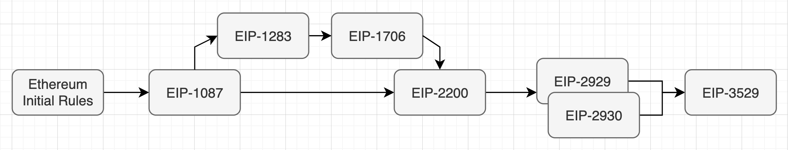
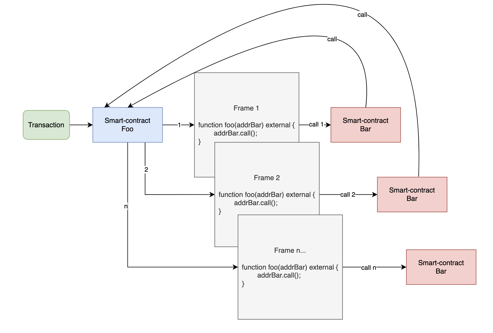
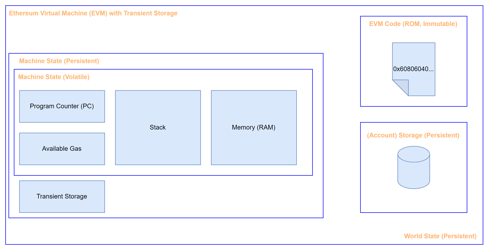
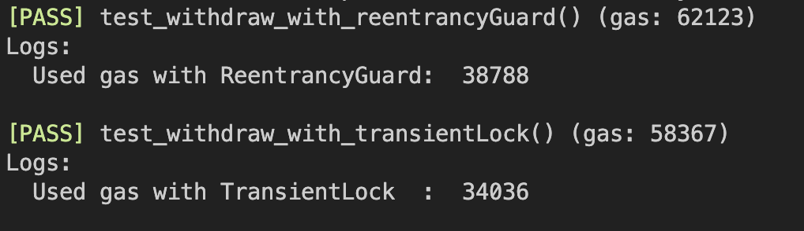

# EIP-1153: Transient storage opcodes

**Author:** [Roman Yarlykov](https://github.com/rlkvrv) 🧐

At the time of adopting the EIP, the main problem was the inefficient use of gas when a smart contract storage slot is changed during a transaction and then reverted to its original value, for example, when locking a function to protect against reentrancy attacks. In other words, in situations where persistent storage is used as temporary storage, as well as in cases where secure data transfer between call frames is necessary.

Various solutions to this problem were proposed: "dirty map," changes to gas calculation mechanisms (including gas refund rules), "warming up," "access lists," as well as the introduction of gradations for storage values (original, current, new) and various slot states (no-op, dirty, fresh). This led to the creation of numerous rules that change with each hard fork through new EIPs:



At the same time, each new proposal solved one problem and created another:
- Reducing the cost of opcodes opened the door to potential DoS attacks, while increasing the cost negatively affected transaction fees.
- Gas refunds enabled the creation of gas tokens, which destabilized the system.
- Gas refunds were initially aimed at cleaning up the blockchain by removing unnecessary data, but due to the aforementioned problems, these refunds had to be reduced to 20% for the entire transaction. This led to the opposite effect—keeping storage "dirty" became more profitable, which bloats the overall state of the blockchain.

With the Dencun (Cancun-Deneb) hard fork, the execution layer update introduced [EIP-1153: Transient storage opcodes](https://eips.ethereum.org/EIPS/eip-1153), which proposes a solution to this problem by introducing two new opcodes (`TSTORE`, `TLOAD`) and creating a new type of memory in the EVM—`transient storage`. This will abstract the problem away from persistent storage and allow for the future removal of some complex gas calculation rules, as they will no longer be necessary.

Developers will need to learn how to work with this new type of memory in the EVM or, at the very least, understand how it works to utilize libraries and integrate with smart contracts that use `transient storage`. Exciting? It sure is to me, so let's dive in.

## The Essence of the Problem

Persistent storage (`storage`) is intended for long-term data storage on the blockchain, so why use it as temporary storage?

The answer to this question is most clearly demonstrated with the example of protection against reentrancy attacks, which remain a serious threat to the EVM despite being well-known to most developers. To protect against reentrancy, "Reentrancy locks" are used, typically implemented through libraries such as [OpenZeppelin](https://github.com/OpenZeppelin/openzeppelin-contracts/blob/master/contracts/utils/ReentrancyGuard.sol), where the key element is setting the lock state flag (on/off). This flag is stored in the smart contract's `storage`. However, the question arises: why not use the less expensive `memory` instead?

The issue lies in inter-frame interaction:

> *Frame* — the execution context of a transaction in the EVM.

During a transaction, a frame is created within the contract. If the smart contract makes external calls, new frames are generated, each created by a family of *CALL* instructions. Thus, a single contract can have multiple frames within the scope of a single transaction.

In the diagram, the process of creating new frames during a Reentrancy attack looks like this:



Each new function call allocates its own `memory`, making the data from the previous frame inaccessible to subsequent ones. There are two main ways to transfer data between frames:

1. **Through input/output data**, using *CALL* instructions. However, if there is an intermediary (another smart contract) between the frames, the security of such an exchange is questionable.

2. **Through storage updates** using `SSTORE`/`SLOAD`, which ensures security but results in high gas costs.

*Important!* New frames are created with every external call. For example, when transferring ERC20 tokens, the token's smart contract is invoked, which also leads to the creation of an additional frame.

*Important!* Both methods of transferring data between frames are costly in terms of gas and are more of a "compromise" between the high transaction cost and the necessity of applying such an approach.

## What All Types of Memory in EVM Look Like Now

EIP-1153 introduces a new type of data storage to the EVM, complementing the existing types of memory. This is intermediate storage between `storage` and `memory`, with unique properties. Let's list all the types of memory available in the EVM:

**Persistent storage (`storage`)** - "long-term memory," where each contract permanently stores its data. This storage is the most expensive, as the data needs to be maintained on every blockchain node.

**Transient storage**, proposed in EIP-1153, is "medium-term memory." It retains data across multiple function calls within a single transaction (something not possible with `memory`) and is completely cleared at the end of the transaction (which distinguishes it from `storage`).

**Memory (`memory`)** - "short-term memory," used for temporarily storing data during function execution. It is cleared after the function completes, and while its gas consumption is significantly lower than that of `storage`, it increases exponentially with the amount of data being written.

A visual comparison of the three types of storage can be seen in the diagram from [the discussion EIP-1153](https://ethereum-magicians.org/t/eip-1153-transient-storage-opcodes/553/78):



Additionally, the EVM includes other forms of data storage:

- **calldata** - immutable call data passed to the contract along with the transaction;
- **stack** - a LIFO (Last In, First Out) data structure. Developers don't have tools to directly manage the stack; the only way to interact with it is through `inline assembly`, where you can push a few values onto it and perform basic operations like `add`, `sub`, `mul`, etc. However, to retrieve the result from a function, you still need to use `memory`;
- **EVM code** - the initialization and execution code of a smart contract, including `immutable` variables;
- **Program Counter (PC)** - the execution client’s internal counter, which can only be accessed via `inline assembly` by calling the `pc()` instruction;
- **Available gas** - a counter for the remaining gas, which can be retrieved by calling the `gasleft()` function in Solidity.

## The Structure of Transient Storage

`transient storage` in the EVM, introduced in EIP-1153, is structured similarly to `storage` — it’s essentially one very large byte array. As a result, the principles for working with this storage (reading, writing, storing different types of data) are exactly the same. However, these two types of memory do not intersect in any way. `transient storage` is not a reserved part of `storage`; it is a separate memory space with slots ranging from 0 to 2<sup>256</sup> - 1.


Here, we won't dive into the structure of `storage`, as there are plenty of excellent materials written on this topic. For example, you can read more [here] (https://noxx.substack.com/p/evm-deep-dives-the-path-to-shadowy-3ea) and [here](https://steveng.medium.com/ethereum-virtual-machine-storage-layout-beb9a72a07e9).

It's important to understand one thing: all interaction with `transient storage` is done through a hash table (key-value), where a 32-byte key points to a 32-byte value. Two new opcodes have been introduced for accessing this type of memory: `TSTORE` for writing and `TLOAD` for reading, similar to `SSTORE`/`SLOAD` for `storage` and `MSTORE`/`MLOAD` for `memory`.

## Gas Consumption

The gas consumption for `TSTORE` and `TLOAD` is standardized and does not depend on the previous state of the data:

- `TSTORE` consumes gas similarly to writing to a "dirty" `storage` slot (current != new; current != original):
  - **new** - the new value being written to the storage;
  - **current** - the current value during the transaction (before each `SSTORE` call);
  - **original** - the value in storage at the start of the transaction.

- `TLOAD` has a cost comparable to a "warm" read from `storage`.

| Opcode | Gas | Cold       | Warm |
| ------ | --- | ---------- | ---- |
| SLOAD  | -   | 2100       | 100  |
| SSTORE | -   | 20000/5000 | 100  |
| TLOAD  | 100 | -          | -    |
| TSTORE | 100 | -          | -    |
| MLOAD  | 3   | -          | -    |
| MSTORE | 3   | -          | -    |

*Note:* The data is relevant for the Cancun hard fork, but there is already a draft [EIP-7609](https://eips.ethereum.org/EIPS/eip-7609) proposing changes to the pricing model for `TLOAD` and `TSTORE`.

At the moment, `transient storage` has a fixed cost. It's important to note that for operations within a single function, `memory` remains the most cost-effective option.

Overall, `transient storage` offers a solution for the same tasks as the concepts of "warm"/"cold" and "clean"/"dirty" storage, but with simpler rules and predictable gas consumption.

## Features

As I mentioned earlier, `transient storage` is very similar to regular `storage`, except for the enforced clearing of data at the end of a transaction. However, there are other differences and similarities worth mentioning:

| Storage Property                           | `storage`                                                                                                                              | `transient storage`                                                                                                                    |
| ------------------------------------------ | -------------------------------------------------------------------------------------------------------------------------------------- | -------------------------------------------------------------------------------------------------------------------------------------- |
| *Data retention duration*                  | Data remains on the blockchain until explicitly overwritten or deleted                                                                 | Data is stored only during the transaction execution and is completely cleared at the end of the transaction                          |
| *Behavior during external contract calls*  | When using `CALL` or `STATICCALL`, the called contract already has its own **persistent** storage                                       | When using `CALL` or `STATICCALL`, the called contract creates its own **transient** storage                                           |
| *Access to storage*                        | Access depends on visibility (`public`, `internal`, `private`)                                                                         | Access is only available to the smart contract that created it (similar to the `private` visibility scope of persistent storage)       |
| *`gasleft` restrictions*                   | For the `SSTORE` write operation, it **requires** that at least the gas stipend threshold (2,300 gas units) remains in the current frame | For the `TSTORE` write operation, it **does not require** the gas stipend threshold (2,300 gas units) in the current frame            |
| *Inter-frame interaction*                  | Available in the current frame and all new frames                                                                                      | Behavior is similar to `storage`                                                                                                       |
| *Working with proxy contracts*             | When using `DELEGATECALL` or `CALLCODE`, the owner of the persistent storage is the proxy contract, not the implementation contract      | Behavior is similar to `storage`                                                                                                       |
| *State rollback*                           | When a frame is rolled back (`revert`), all changes made from the frame's entry to the rollback are annulled                           | Behavior is similar to `storage`                                                                                                       |

## How to Use

The initial proposal only included the use case of a "Reentrancy lock," but during the discussion, the EIP "evolved" with additional use cases. The EIP itself outlines the following examples:

- **Protection against reentrancy attacks.** Allows for temporarily locking function calls within a smart contract, preventing a common type of attack;
- **On-chain computation of an address via CREATE2.** Refers to cases where it is necessary to pass data to a constructor through the `storage` of the deployer contract;
- **Approve and Transfer ERC20 in one transaction.** Simplifies interactions with ERC20 tokens, eliminating the need for a callback function when approving and transferring tokens simultaneously;
- **Fee-on-transfer contracts.** Facilitates the implementation of contracts where a fee is deducted from each token transfer, minimizing gas costs;
- **Till pattern.** Supports temporary data storage during a transaction, which can be used to simplify some operations for DEXs or lending protocols;
- **Proxy call metadata.** Simplifies metadata transmission during calls through proxy contracts.

### Protection Against Reentrancy Attacks

Protection against reentrancy attacks is described in detail, and a brief summary of protection methods can be found in [the blog OpenZeppelin](https://blog.openzeppelin.com/reentrancy-after-istanbul).

The following approaches are primarily used:
- **Checks-Effects-Interactions (CEI)** - a methodology that prescribes this sequence: checking conditions, changing the state, and only then making external calls (details [here](https://fravoll.github.io/solidity-patterns/checks_effects_interactions.html));
- **Pull payment pattern** - the payment recipient initiates the withdrawal transaction themselves through `withdraw()` (details [here](https://medium.com/@bansaltushar014/design-pattern-part-2-pull-payment-pattern-c1f7b4ca9ad4));
- **Reentrancy lock** - blocking reentry into a function.

#### Reentrancy Lock

Let's take a closer look at this method. For its implementation, it's necessary to write to the smart contract's `storage`, because when the function is called again, a new frame is created, and the `memory` data from the previous call is inaccessible. Additionally, we cannot pass data via a call to an untrusted smart contract. The simplest solution is to use a boolean `lock` variable in the contract.

Example:
```js
// SPDX-License-Identifier: MIT
pragma solidity 0.8.21;

contract ExampleWithBoolReentrancyLock {
    // We create a variable: _lock
    bool private _lock;

    // ...

    function withdraw(uint256 amount) external {
        // Before executing the function, we check that this is not a reentrant call
        if (_lock) {
            revert ReentrancyAttackPrevented();
        }
        // We lock the function to protect against reentrant calls
        _lock = true;

        // We check the current state
        if (_balances[msg.sender] < amount) {
            revert InsufficientBalance();
        }

        // We change the state:
        _balances[msg.sender] -= amount;

        // We transfer the requested funds
        (bool success, ) = msg.sender.call{value: amount}("");
        if (!success) {
            revert TransferFailed();
        }

        // We disable the function lock
        _lock = false;
    }

    // ...
}
```
The full example of the smart contract is [here].(./contracts/ExampleWithBoolReentrancyLock.sol).

This implementation can be optimized:

- Using `uint` instead of `bool` reduces costs since `bool` occupies a full word (32 bytes) in memory;
- With `uint`, you can pre-mark the slot as "dirty" during the smart contract deployment to avoid paying 20,000 gas for each write later. For example, the lock value can be set to 1 (unlock) and 2 (lock) to avoid gas refunds (remember, only 20% of gas is refunded);
- The functionality should be encapsulated in a modifier and moved to a separate contract for reusability.

All of the above improvements have been implemented in the ReentrancyGuard by OpenZeppelin. You can check out the smart contract in their official [repository].(https://github.com/OpenZeppelin/openzeppelin-contracts/blob/master/contracts/utils/ReentrancyGuard.sol). After including the library, the smart contract will look [like this].(./contracts/ExampleWithReentrancyGuard.sol).

The library adds a `nonReentrant` modifier, which changes `ReentrancyGuard::status` from `NOT_ENTERED` to `ENTERED`, overwriting the slot from 1 to 2, and reverts it back after execution. However, due to working with `storage`, this is still costly in terms of gas.

#### Transient Reentrancy Lock

*Important!* To run the examples below, you’ll need Solidity version 0.8.24 or higher, as well as the Cancun version of the EVM.

Let’s move on to implementing a reentrancy lock using `transient storage`. To begin, we’ll take a simple example again:

```js
// SPDX-License-Identifier: MIT
pragma solidity 0.8.25;

contract ExampleWithTransientReentrancyLock {
    // ...

    function withdraw(uint256 amount) external {
        // We create a variable to retrieve a value from transient storage
        uint256 lock;
        // We check if there is a record at key 0 in transient storage
        assembly {
            lock := tload(0)
        }
        if (lock == 1) {
            revert ReentrancyAttackPrevented();
        }
        // We write the value 1 to key 0
        assembly {
            tstore(0, 1)
        }

        // _; We execute the funds withdrawal logic here

        // We clear the value after the external call
        assembly {
            tstore(0, 0)
        }
    }
}
```
Doesn't look great, right? But you can do it like [this](https://arc.net/l/quote/ermtzdto) example by adding helper functions `tstore` and `tload`, and using a constant as the key.

*Note:* In the future, Solidity will likely introduce a `transient` keyword for declaring variables similar to `memory` or `storage`.
```js
    uint256 transient lock = 1;
```

For now, we have to use inline assembly.

Let’s rewrite the example above using helper functions and the `nonReentrant` modifier:
```js
// SPDX-License-Identifier: MIT
pragma solidity 0.8.25;

contract ExampleWithTransientReentrancyLock {
    // We define a constant value for addressing in transient storage:
    // keccak256("REENTRANCY_GUARD_SLOT");
    bytes32 constant REENTRANCY_GUARD_SLOT = 0x167f9e63e7ffa6919d959c882a4da1182dccfb0d790328477621b65d1978856b;

    // ...

    modifier nonReentrant() {
        //Before executing the function, we check that this is not a reentrant call:
        if (_tload(REENTRANCY_GUARD_SLOT) == 1) {
            revert ReentrancyAttackPrevented();
        }
        // We write the value 1 to the `REENTRANCY_GUARD_SLOT` key
        _tstore(REENTRANCY_GUARD_SLOT, 1);

        _;

        // We clear the key's value in transient storage after the external call
        _tstore(REENTRANCY_GUARD_SLOT, 0);
    }

    function withdraw(uint256 amount) external nonReentrant {
        // ...
        // The main function logic
    }

    // Helper function for writing to transient storage
    function tstore(bytes32 location, uint value) private {
        assembly {
            tstore(location, value)
        }
    }

    // Helper function for reading from transient storage
    function tload(bytes32 location) private returns (uint value) {
        assembly {
            value := tload(location)
        }
    }
}
```
The full example of the smart contract is [here] (./contracts/ExampleWithTransientReentrancyLock.sol).

The implementation of `ReentrancyGuardTransient` by OpenZeppelin is still under development at the time of writing this article. You can check it out [here] [PR](https://github.com/OpenZeppelin/openzeppelin-contracts/pull/4955).

*Important!* After executing an external call, it is necessary to clear `transient storage` to avoid issues with subsequent function calls within the same transaction.

If we compare the gas consumption of the `withdraw` function using the "old" ReentrancyGuard implementation with a function that uses `transient storage` for the reentrancy lock, the difference will be significant—approximately 4,750 gas units:



I estimated how much using both options would cost at an ETH price of `$3500` and a gas price of 20 Gwei. The results are as follows:

| ReentrancyGuard | TransientReentrancyGuard |
| --------------- | ------------------------ |
| ≈ 5150 gas      | ≈ 400 gas                |
| ≈ $0.36         | ≈ $0.03                  |

**Note:** My implementation of `TransientReentrancyGuard` is far from perfect, so it's likely that an implementation from OpenZeppelin would consume even less gas.

### On-Chain Address Calculation via CREATE2

The second advantage of EIP-1153 is directly related to a limitation of the `CREATE2` operation. The issue is that `CREATE2` calculates the address using the initialization code of the smart contract, and this initialization code, in turn, includes the constructor arguments.

In other words, the creation of deterministic addresses is the main "feature" of `CREATE2`, because a so-called "salt" is used during deployment. However, to reconstruct the address, you need not only the "salt" but also the constructor arguments to form the correct initialization bytecode.

```go
address = keccak256(0xff + sender_address + salt + keccak256(initialisation_code))[12:]
```

For comparison, the regular `CREATE` only uses the transaction sender's address (the deployer) and the account's nonce:

```go
address = keccak256(rlp([sender_address,sender_nonce]))[12:]
```

Why this is a problem and how it is best solved can be seen in the example of a smart contract [UniswapV3PoolDeployer](https://github.com/Uniswap/v3-core/blob/ed88be38ab2032d82bf10ac6f8d03aa631889d48/contracts/UniswapV3PoolDeployer.sol#L34-L36). Note that the `deploy()` function does not pass anything to the constructor of the `UniswapV3Pool` smart contract. Instead, all the necessary deployment parameters are written into the `parameters` variable:

 ```js
 contract UniswapV3PoolDeployer is IUniswapV3PoolDeployer {
    // These parameters are required for deploying the `UniswapV3Pool` smart contract
    struct Parameters {
        address factory;
        address token0;
        address token1;
        uint24 fee;
        int24 tickSpacing;
    }

    // In storage, we create a public variable that will contain
    // all the necessary parameters
    Parameters public override parameters;

    function deploy(
        address factory,
        address token0,
        address token1,
        uint24 fee,
        int24 tickSpacing
    ) internal returns (address pool) {
        // Write the parameters into the variable
        parameters = Parameters({factory: factory, token0: token0, token1: token1, fee: fee, tickSpacing: tickSpacing});

        // Only the token addresses and the fee are written into the salt
        pool = address(new UniswapV3Pool{salt: keccak256(abi.encode(token0, token1, fee))}());

        // Then clear the parameters
        delete parameters;
    }
}
 ```

If you go to the constructor [UniswapV3Pool](https://github.com/Uniswap/v3-core/blob/ed88be38ab2032d82bf10ac6f8d03aa631889d48/contracts/UniswapV3Pool.sol) you can see that the parameters are extracted from the `UniswapV3PoolDeployer` contract:

```js
    constructor() {
        int24 _tickSpacing;

        // Retrieve all the necessary parameters from the smart contract that performs the deployment
        (factory, token0, token1, fee, _tickSpacing) = IUniswapV3PoolDeployer(msg.sender).parameters();
        tickSpacing = _tickSpacing;

        maxLiquidityPerTick = Tick.tickSpacingToMaxLiquidityPerTick(_tickSpacing);
    }
```

Arguments are passed by writing to `storage`, rather than through the constructor, which seems less logical. However, looking at the library [PoolAddress](https://github.com/Uniswap/v3-periphery/blob/main/contracts/libraries/PoolAddress.sol) it becomes clear that the initialization bytecode of `UniswapV3Pool` is a constant. Knowing the token addresses and the pool fee, the pool address can be easily calculated. This is the main reason why the developers prefer passing parameters through the deployer’s storage rather than the contract constructor.

`transient storage` is very well-suited for passing context in such cases. Moreover, this approach can be applied not only in conjunction with `CREATE2` but also for other purposes.

### Approve and Transfer ERC20 in a Single Transaction

Anyone who has ever handled ERC20 token deductions in a smart contract knows that before tokens can be deducted, the account owner must approve the deduction by calling the token’s `approve(spender, amount)` function. This is, to put it mildly, inconvenient because it requires two transactions instead of one. Another problem is that protocols often request so-called "infinite approval," which is dangerous because if the protocol gets hacked, all your tokens that you approved for deduction could be lost.

There are some on-chain solutions, for example, [ERC-2612](https://eips.ethereum.org/EIPS/eip-2612) - an extension that adds a `permit(address owner, address spender, uint value, uint deadline, uint8 v, bytes32 r, bytes32 s)` function to the token. It allows granting approval through the account owner’s signature to avoid an extra transaction.

Another approach suggests [ERC-1363](https://eips.ethereum.org/EIPS/eip-1363) - this is also an extension for ERC20, which adds a `approveAndCall(address spender, uint256 value)` function to the token. This function allows granting approval and transferring tokens in a single transaction, but with an important caveat — the receiving party must implement a callback function `onApprovalReceived(address owner, uint256 value, bytes memory data)`.

Both of these approaches have their pros and cons, but what can the `temporaryApprove(spender, amount)` function, which is proposed as one of the ways to use `transient storage`, offer in contrast?

The idea is very simple: the ERC20 token smart contract would also need to add a function similar to `approveAndCall(address spender, uint256 value, bytes memory data)`. This function would write the approved amount of tokens into `transient storage` and call an external smart contract. The external smart contract could then simply execute `transferFrom` for the approved amount. During the execution of `transferFrom`, the approved value in the temporary storage would be reset to zero, making it impossible to perform a reentrancy attack.

I made [an example] (./contracts/ERC20WithTempApprove.sol) a simple implementation of such functionality. At the time of writing, this is just a concept; how it will be implemented by popular libraries remains to be seen.

### Fee-on-transfer Contracts

This refers to a token smart contract that can automatically withhold a fixed "tax" on each transfer (transaction fees for ERC20 or royalties for ERC721), while the information about the collected tax will be available for other external calls within the same transaction. This allows the user to pay the tax once and perform multiple operations with the contract without incurring additional fees within that transaction.

As with `temporaryApprove`, the advantage of this approach lies in minimizing or completely eliminating the need for callback calls.

### Till pattern

There is little information on the "Till" pattern: an abstract description can be found [here] (https://github.com/OpenZeppelin/openzeppelin-contracts/issues/4361), and there is also a [video](https://www.youtube.com/watch?v=xFp8RlRq0qU) from the EIP developer.

The authors of the EIP claim that the "Till" pattern allows actions to be performed within a single transaction that may temporarily violate key protocol invariants, with these invariants being checked at the end of the transaction. This can simplify the process of asset exchange, enabling multiple purchases and sales within a single transaction.

### Proxy Call Metadata

In the section about CREATE2, we already examined the mechanism of passing metadata during the deployment of another smart contract without using `calldata`. This case simply describes broader use of the context-passing approach, and I would actually combine these two points.

## Pitfalls

The new technology brings both opportunities and risks. The community's main criticism concerns the method of clearing transient storage (at the very end of the transaction) — this disrupts a property known as [composability] (https://en.wikipedia.org/wiki/Composability).

> Composability is a design principle for systems that concerns the interconnection of components.

If transient storage adhered to this property and was cleared not at the end of the transaction but at the end of each individual call, it would be much safer. Instead, the authors of the EIP suggest performing manual clearing as needed. The problem here is that clearing each slot will cost 100 gas units, and not everyone will want to do it. At the same time, issues can arise during batch processing of calls (Multicall, handleAggregatedOps), where different calls within a single transaction may access the same storage slots. In general, the more complex the transaction, the more serious the problems can be, and the harder they will be to catch. Almost all criticism of the EIP boils down to the idea that the clearing should be handled by the EVM itself, not by the developers.

Interestingly, the Solidity compiler developers have written about this. They proposed adding such clearing functionality, but their proposal was ignored by the EIP authors. More details can be found in the [blog](https://arc.net/l/quote/zozyqlsi).

## Pros and Cons

### Pros:
- Significantly cheaper than `storage` in similar use cases (reentrancy, create2, context);
- In theory, it will eliminate the need for some complex gas consumption rules for `storage`, as they will no longer be necessary;
- In theory, less data will be written to the blockchain because there will be no need to keep slots "dirty";
- Relatively cheap temporary mappings can be created, which can reduce the complexity of specific algorithms or simplify business logic;
- Potentially helps optimize the performance of major protocols like DEXs or lending platforms;
- Could improve interaction between L1 and L2 by making it cheaper to pass metadata that was previously transmitted via `storage`.

### Cons:
- Difficult to test and debug, as all interactions happen within a single transaction, making application development more challenging;
- Auditing smart contracts using transient storage is more complicated because it also increases the complexity of business logic;
- Currently, there are no established "best practices" for using `transient storage`, meaning there will be a learning curve, and for some, it could be costly;
- Access to transient storage is currently only available through `inline assembly` (work is already underway to introduce the `transient` keyword so that variable declarations work the same way as `memory` and `storage`), but for now, libraries can be written for this purpose;
- Storage must be manually cleared at the end of the call to avoid polluting storage, otherwise, you might shoot yourself in the foot (or your neighbor's foot);
- During development, you need to consider how batch transactions will be handled and whether they might overlap (accessing the same storage slots).

## Conclusion

Personally, EIP-1153 left me with mixed impressions. A concerning point is that discussions about it began back in 2018 (right after EIP-1087), and it took 6 years for the EIP to be included in a hard fork, yet there’s no feeling that it has been fully refined (the discussion itself can be viewed [here]) (https://ethereum-magicians.org/t/eip-1153-transient-storage-opcodes/553)).

There are also doubts about the arguments made by the authors of the EIP and their response to criticism. The development and promotion of the initiative were led by a former developer, now a consultant at Uniswap Labs. The Uniswap protocol has been accused of pursuing its own interests when promoting the proposal rather than caring for the ecosystem. Support was also expressed by major players such as Arbitrum and Optimism.

It creates the impression that an unfinished technology has been hastily pushed into production, and only time will tell whether this decision was justified. We might be witnessing the emergence of a new "selfdestruct" analogy because rolling back such changes will be very difficult, and numerous potential issues could arise. Assessing the impact of these changes on the ecosystem and gas costs is challenging at this stage.

On the other hand, transient storage has potential. The idea is that transient storage will promote better use of `storage` and help clean up unnecessary data from the blockchain. Over time, new usage patterns may emerge that are difficult to predict at the moment. It is expected that programming language support will improve, making it easier to work with this type of memory. Likely, an additional EIP will be introduced to address the cleanup mechanism, which is causing so much debate. Time will tell how best to use this technology, so it’s crucial to thoroughly understand its mechanics and apply it with caution.

## Links

- [EIP-1153: Transient storage opcodes](https://eips.ethereum.org/EIPS/eip-1153)
- [Ethereum-magicians: Main community discussion about EIP-1153](https://ethereum-magicians.org/t/eip-1153-transient-storage-opcodes/553/91)
- [Solidity blog: Transient Storage Opcodes in Solidity 0.8.24](https://soliditylang.org/blog/2024/01/26/transient-storage/)
- [Article: Ethereum Evolved: Dencun Upgrade Part 4, EIP-7514 & EIP-1153](https://consensys.io/blog/ethereum-evolved-dencun-upgrade-part-4-eip-7514-and-eip-1153)
- [Article: Demystifying EIP-1153: Transient Storage](https://medium.com/@organmo/demystifying-eip-1153-transient-storage-faeabbadd0d)
- [Article: The right why to use transient storage (EIP-1153)](https://www.edenblock.com/post/the-right-way-to-use-transient-storage-eip-1153)
- [Example from an EIP developer: Transient Storage Example](https://gist.github.com/moodysalem/75dac17848cad4633d59f630b2a8b5d1)
