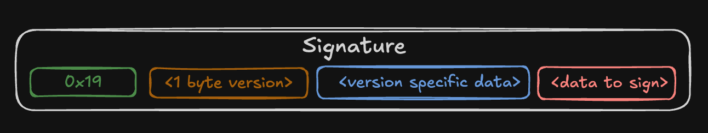
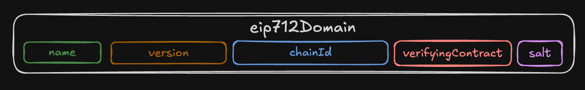

# EIP-712: Typed structured data hashing and signing

**Author:** [Pavel Naydanov](https://github.com/PavelNaydanov) 🕵️‍♂️

EIP-712 is a standard for hashing and signing typed data. Its main goal is to improve user experience by allowing wallets to display human-readable signature data.

The standard is a variant of [ERC-191](https://eips.ethereum.org/EIPS/eip-191). According to the standard, the signature is formed as follows:



`0x19` — indicates that the signature is used in the Ethereum network and is not compatible with RLP encoding, which is used for encoding transaction data.  
`1 byte version` — indicates the type of signature: personal, EIP-712, and so on.

For EIP-712, the remaining fields are described as follows:  
- `<1 byte version>` = `0x01`. Indicates in the signature that the EIP-712 standard is used. All possible version types are listed in the [ERC-191 version bytes registry](https://eips.ethereum.org/EIPS/eip-191#registry-of-version-bytes).  
- `<version specific data>` = `domainSeparator`. The term `domainSeparator` is introduced by the EIP-712 standard and serves to describe the context specifics of the signature.  
- `<data to sign>` = `hashStruct(message)`. This is the hash of the data signed by the user.

## Encoding domainSeparator

**DomainSeparator** is a unique identifier of the signing context and serves three main purposes:  
1. **Context identification** — includes data to ensure the signature’s uniqueness.  
2. **Replay protection** — if a user signed data for a specific protocol, it won’t be valid for another protocol or network.  
3. **Hashing optimization** — domainSeparator allows precomputing part of the full signature hash, speeding up signature verification.

The `domainSeparator` is described as follows:
```
domainSeparator = hashStruct(eip712Domain)
```

`hashStruct(eip712Domain)` is the hash of a structure containing the following fields:



- `string name`. The name of the protocol where the signature will be used.  
- `string version`. The current version of the signing domain. Signatures from different versions are incompatible. Essentially, this is a tool for signature versioning.  
- `uint256 chainId`. The chain identifier. Used by EIP-155 for protection against *replay attacks*. Especially necessary when the protocol operates on multiple networks.  
- `address verifyingContract`. The address of the contract that will verify the signature. Used to restrict the list of valid verifiers.  
- `bytes32 salt`. A salt to eliminate protocol ambiguity. A fallback option that can be used to differentiate two signatures with the same domainSeparator data.

_Important!_ All fields of the `eip712Domain` structure are optional and should be included by developers only if the protocol requires them.

## Encoding Signature Data

This section describes encoding of what we defined in EIP-191 as `<data to sign>`, and in EIP-712 as `hashStruct(message)`.

But before diving into hashing structured data, it’s important to understand which data types can be used.

### Data Types

There are three main data types:  
1. **Atomic types.** These include `bytes1`, `bytes32`, `uint8`, `uint256`, `int8`, `int256`, and so on. Also `bool` and `address`. Important: aliases like `int` and `uint` are not used. The standard also allows for adding new types in the future.  
2. **Dynamic types.** These are `bytes` and `string`.  
3. **Reference types.** These are arrays and structs. Dynamic-sized arrays are written as `Type[]`, fixed-size arrays as `Type[n]`. For example, `address[]` or `address[5]`.

It’s important to know and consider data types because some have nuances in encoding and signature verification on smart contracts.

### Hashing Signature Data

Let’s look at what `hashStruct(message)` represents.

> hashStruct(message) = keccak256(typeHash ‖ encodeData(message))

This means that two objects are hashed using keccak256: `typeHash` and `encodeData(message)`.

`typeHash` is a constant describing the hash of the data types from the message. Mathematically, it can be described as `typeHash = keccak256(encodeType(typeOf(message)))`.

`encodeData(message)` is the encoding of the fields of the data structure `message`.

In the code, we will define TYPE_HASH as the hash of the string that describes the types of the `user` field for an abstract `Order` structure:

```solidity
bytes32 private constant TYPE_HASH = keccak256("Order(address user)");
```

The `message` here is the value of the `user` address, which we will encode.

**encodeData**

You can think of this as a function that concatenates the encoded fields of the `message` struct in the order they are declared.

_Important!_ Each encoded member value has a length of exactly 32 bytes.

And here we come to field encoding, which depends on the type of the field itself.

**Atomic type values**

Atomic types are encoded according to ABI v1 and v2. For example, `bool` is encoded as a `uint256` with values 0 or 1. Addresses are encoded as `uint160`. And so on. More details can be found in the [Solidity documentation](https://docs.soliditylang.org/en/latest/abi-spec.html#formal-specification-of-the-encoding).

When verifying signatures on smart contracts, these data types do not require additional encoding.

**Dynamic type values**  
Are encoded as the hash of their content using the `keccak256()` function. `keccak256` takes a byte array, which means to hash a string, you first need to convert the string to `bytes` using the `abi.encodePacked()` function.

When verifying signatures on smart contracts, we will need to encode these data additionally.

```solidity
// string
string memory str = "test";
bytes32 encodedStr = keccak256(abi.encodePacked(str));

// bytes
bytes memory strInBytes = "test";
bytes32 encodedStrInBytes = keccak256(strInBytes);
```

**Reference type values**

Arrays are encoded as the hash of the concatenated array elements. A struct is encoded recursively as `hashStruct(message)`. It’s a bit tricky to understand, but this is the case when a nested struct exists inside the data structure to be signed — the nested struct is encoded using the same rules as the parent.

```solidity
// array[2]
address[] memory addressArray = new address[](2);
addressArray[0] = address(0);
addressArray[1] = address(0);

bytes32 encodedAddressArray = keccak256(abi.encodePacked(addressArray));

// struct
bytes32 encodedStruct = keccak256(abi.encode(
    PARENT_TYPE_HASH,
    // nested structure
    keccak256(abi.encode(
        CHILD_TYPE_HASH,
        // ... nested structure fields
    )),
    // ... parent fields
));
```

## Signature Verification

In this section, we’ll look at examples of handling signatures on smart contracts in different situations.

For this, we’ll take a reference smart contract example using OpenZeppelin.

```solidity
// SPDX-License-Identifier: MIT
pragma solidity 0.8.26;

import {EIP712} from "@openzeppelin/contracts/utils/cryptography/EIP712.sol";
import {ECDSA} from "@openzeppelin/contracts/utils/cryptography/ECDSA.sol";

contract SignatureChecker is EIP712 {
    // encode typeHash
    bytes32 private constant TYPE_HASH =
        keccak256("Order(address user)");

    struct Args {
        bytes signature;
    }

    // Inherit by EIP712(name, version)
    constructor() EIP712("EIP-712 based on OZ", "1") {}

    function checkSignature(Args calldata args) public view returns (bool) {
        // encode message
        bytes32 digest = _hashTypedDataV4(keccak256(abi.encode(
            TYPE_HASH,
            msg.sender
        )));

        // recover signer and check
        address signer = ECDSA.recover(digest, args.signature);
        if (signer != msg.sender) {
            return false;
        }

        return true;
    }
}
```

This simple example verifies that the caller of the `checkSignature()` function signed their own account address as the data structure in the message.

The function `_hashTypedDataV4()` hashes the EIP-712 encodedData (which we encode ourselves) and the domainSeparator (set in the constructor) together.

### Reuse

*If a signature is meant to be used only once, it should not be possible to reuse it.*

The most common example is a signature that allows spending a user’s assets. Suppose a user creates an order to buy an asset and signs the amount they are willing to spend. The signature is passed to the protocol, which must use the signature and deduct the payment amount at the moment of asset transfer to the user.

In the example above, it’s important that no one can reuse the signature to deduct the amount multiple times. To prevent this, a one-time counter `nonce` is introduced into the signature payload, making the signature unique. After the signature is used on the smart contract, the counter increments.

```solidity
contract SignatureChecker is EIP712 {
    // Add nonce to TYPE_HASH
    bytes32 private constant TYPE_HASH = keccak256("Order(address user,uint256 nonce)");

    struct Args {
        bytes signature;
    }

    mapping (address user => uint256 nonce) public nonces;

    constructor() EIP712("EIP-712 based on OZ", "1") {}

    function checkSignature(Args calldata args) public returns (bool) {
        bytes32 digest = _hashTypedDataV4(keccak256(abi.encode(
            TYPE_HASH,
            msg.sender,
            nonces[msg.sender] + 1 // Add next user nonce
        )));

        address signer = ECDSA.recover(digest, args.signature);
        if (signer != msg.sender) {
            return false;
        }

        // increase user nonce
        nonces[msg.sender] += 1;

        return true;
    }
}
```

The smart contract always expects the nonce in the signature to match the counter, which increments immediately after the signature is used. This simple algorithm prevents signature reuse and makes it one-time.

### Usage Across Different Networks, Protocols, Smart Contracts

*A signature given by a user on one network should not be valid on another.*

*A signature given by a user for one smart contract should not be used in another.*

Often protocols operate across multiple EVM-compatible networks. Compatibility allows reusing smart contract code. To prevent signatures from being valid on another network, the `chainId` field is added to the `domainSeparator`.

If you use the EIP-712 smart contract from OpenZeppelin, you don’t need to worry about `chainId`. If you implement your own solution, you should consider this field. Remember, the field is optional, and if the protocol runs on a single network, it can be omitted.

However, most of the time the field is always included, because the protocol might want to launch on a new network, and updating contracts on the old network to add the `chainId` field isn’t always possible due to smart contract immutability.

In the [EIP-712](https://github.com/OpenZeppelin/openzeppelin-contracts/blob/master/contracts/utils/cryptography/EIP712.sol#L91) smart contract by OpenZeppelin, you can see that the `chainId` is included in the domain by default.

```solidity
abstract contract EIP712 is IERC5267 {
    ...

    function _buildDomainSeparator() private view returns (bytes32) {
        return keccak256(abi.encode(TYPE_HASH, _hashedName, _hashedVersion, block.chainid, address(this)));
    }

    ...
}
```

Similarly to `chainId`, the fields `_hashedName` and `address(this)` regulate the use of the signature only within a specific protocol or smart contract where the signature verification algorithm is implemented.

### Usage Across Different Functions of a Single Smart Contract

*A signature given by a user for verification in one smart contract function should not be used in another, except when absolutely necessary.*

To regulate signature usage within one smart contract function, the best way is to make the signed data unique. If the data fields are the same, they can differ semantically. Below is an example of forming two TYPE_HASH values for the `deposit()` and `withdraw()` functions.

```solidity
contract SignatureChecker is EIP712 {
    bytes32 private constant DEPOSIT_TYPE_HASH = keccak256("DEPOSIT(address user,uint256 nonce)");
    bytes32 private constant WITHDRAW_TYPE_HASH = keccak256("WITHDRAW(address user,uint256 nonce)");

    ...

    function deposit(Args calldata args) public returns (bool) {
        bytes32 digest = _hashTypedDataV4(keccak256(abi.encode(
            DEPOSIT_TYPE_HASH,
            msg.sender,
            nonces[msg.sender] + 1
        )));

        ...

        return true;
    }

    function withdraw(Args calldata args) public returns (bool) {
        bytes32 digest = _hashTypedDataV4(keccak256(abi.encode(
            WITHDRAW_TYPE_HASH,
            msg.sender,
            nonces[msg.sender] + 1
        )));

        ...

        return true;
    }
}
```

There is another possible solution. The domain includes a `salt` field, which can be used for signature domain uniqueness.

However, the OpenZeppelin EIP-712 smart contract does not support this field out of the box. To use `salt` together with OpenZeppelin, you’ll have to override the EIP-712 smart contract functions manually.

### Using Expiration Time

*A signature given by a user can be used within a specific time window.*

Sometimes there’s a need to implement a signature’s lifespan so that after a certain time it becomes invalid. This is done by adding a timestamp to the signature payload, which marks the expiration time of the signature. The smart contract then needs to check that this time hasn’t passed yet.

```solidity
contract SignatureChecker is EIP712 {
    // Add expiredTime to TYPE_HASH
    bytes32 private constant TYPE_HASH = keccak256("Order(address user,uint64 expiredTime,uint256 nonce)");

    // Add new field expiredTime
    struct Args {
        bytes signature;
        uint256 expiredTime;
    }

    ...

    // Add error
    error ExpiredTime();

    function checkSignature(Args calldata args) public returns (bool) {
        // Check time
        if (block.timestamp >= args.expiredTime) {
            revert ExpiredTime();
        }

        bytes32 digest = _hashTypedDataV4(keccak256(abi.encode(
            TYPE_HASH,
            msg.sender,
            args.expiredTime, // Add expiredTime
            nonces[msg.sender] + 1
        )));

        ...

        return true;
    }
}
```

### Signature Cancellation

*The ability to cancel a signature.*

Often a signature is used as permission to act on behalf of a user. Moreover, the user signs a message and hands the signature over to the protocol for safekeeping. In this case, they have no way to cancel the action.

This can be fixed quite easily. Based on the `nonce`, you need to implement signature cancellation. To do this, simply increment the `nonce`. If the `nonce` isn’t part of the signature yet, it should be added.

```solidity
contract SignatureChecker is EIP712 {
    mapping (address user => uint256 nonce) public nonces;

    ...

    function cancelSignature() external {
        nonces[msg.sender] += 1;

        emit SignatureCanceled(msg.sender);
    }
}
```

The user just needs to call the `cancelSignature()` function, which will increment the `nonce` and automatically invalidate any previously issued signatures.

## Top Smart Contract Mistakes

In this section, we’ll cover common mistakes developers make when implementing signature verification in smart contracts. The errors are taken from the [Solodit](https://solodit.cyfrin.io/?i=HIGH%2CMEDIUM) resource.

> All these issues might not be detected when writing tests using Foundry. Since signature tests, like other tests, are written in Solidity, the results can unknowingly be tailored to the mistake.  
>  
> In this regard, Hardhat offers more reliability because testing signatures requires writing code in JS that closely simulates real scenarios.

### Missing TYPE_HASH

*Non-compliance with the standard.*

Sometimes developers forget to specify the TYPE_HASH for the data structure or think it’s not important.

```solidity
contract SignatureChecker is EIP712 {
    ...

    function checkSignature(Args calldata args) public returns (bool) {
        if (block.timestamp >= args.expiredTime) {
            revert ExpiredTime();
        }

        // There is no TYPE_HASH in the signature structure
        bytes32 digest = _hashTypedDataV4(keccak256(abi.encode(
            msg.sender,
            args.expiredTime, // Added expiredTime field
            nonces[msg.sender] + 1
        )));

        ...

        return true;
    }
```

Not using the TYPE_HASH field leads to incompatibility with the EIP-712 standard, making it impossible to use classic tools for creating signatures (MetaMask SDK, etc.). It’s also not secure.

### Omitting fields described in TYPE_HASH during encoding

*Any kind of mistakes when forming TYPE_HASH or the signed data fields.*

During development, there are often many changes that require special attention. Working with signatures is no exception. A common mistake is when a developer changes the data structure but forgets to update the TYPE_HASH for that structure.

```solidity
contract SignatureChecker is EIP712 {
    // Forgot to correct TYPE_HASH. You need to add expiredTime field
    bytes32 private constant TYPE_HASH = keccak256("Order(address user,uint256 nonce)");

    ...

    function checkSignature(Args calldata args) public returns (bool) {
        ...

        bytes32 digest = _hashTypedDataV4(keccak256(abi.encode(
            TYPE_HASH,
            msg.sender,
            args.expiredTime, // Added expiredTime field
            nonces[msg.sender] + 1
        )));

        ...

        return true;
    }
```

A field `expiredTime` was added to the signature payload, but the field was forgotten in the TYPE_HASH. Such mistakes are common. The opposite can also happen — TYPE_HASH is updated but the data structure isn’t.

In most cases, this problem can be avoided by thorough smart contract testing.

### Error encoding dynamic types

*Dynamic types must be encoded in a special way.*

Often newcomers to smart contract development — and sometimes experienced developers from other fields — miss the importance of correctly encoding dynamic types.

Dynamic types are encoded as the hash of their value using `keccak256()`.

```solidity
contract SignatureChecker is EIP712 {
    bytes32 private constant TYPE_HASH =
        keccak256("Order(address operator,address token,uint256 amount,uint256 nonce,bytes data,string str)");

    ...

    constructor() EIP712("EIP-712 based on OZ", "1") {}

    function checkSignature(SigArgs calldata args) public view returns (bool) {
        bytes32 digest = _hashTypedDataV4(keccak256(abi.encode(
            TYPE_HASH,
            msg.sender, // operator
            args.token,
            args.amount,
            _nonces[args.user] + 1,
            // args.data и args.str - incorrect
            // For encode dynamic types you need use keccak256
            keccak256(args.data),
            keccak256(abi.encodePacked(args.str))
        )));

        ...

        return true;
    }
}
```

`keccak256()` takes bytes as input, so a string must first be converted to bytes using `abi.encodePacked()`.

### Error encoding reference types

*Reference types must be encoded in a special way.*

This is a similar mistake to dynamic types, but it concerns arrays and data structures.

When encoding arrays, developers often forget that it should be the hash of the bytes of all array elements: `keccak256(abi.encodePacked(array))`. They forget either `keccak256`, or `abi.encodePacked`, or both.

```solidity
contract SignatureChecker is EIP712 {
    bytes32 private constant ORDER_TYPE_HASH =
        keccak256("Order(address operator,address[] tokens,uint256[] amounts,uint256 nonce)");

    ...

    function checkSignature(SigArgs calldata args) public view returns (bool) {
        bytes32 digest = _hashTypedDataV4(keccak256(abi.encode(
            ORDER_TYPE_HASH,
            msg.sender,
            // Error using args.tokens without keccak256(abi.encodePacked())
            keccak256(abi.encodePacked(args.tokens)),
            keccak256(abi.encodePacked(args.amounts)),
            _nonces[args.user] + 1
        )));

        ...

        return true;
    }
}
```

For nested structs, mistakes are often made in the TYPE_HASH description. The example below shows the correct way to describe the `OPERATOR_TYPE_HASH` and `ORDER_TYPE_HASH` structs.

```solidity
contract SignatureChecker is EIP712 {
    bytes32 private constant OPERATOR_TYPE_HASH =
        keccak256("Operator(address operator,string name)");
    bytes32 private constant ORDER_TYPE_HASH =
        keccak256("Order(Operator operator,address token,uint256 amount,uint256 nonce)Operator(address operator,string name)");

    ...

    function checkSignature(SigArgs calldata args) public view returns (bool) {
        bytes32 digest = _hashTypedDataV4(keccak256(abi.encode(
            ORDER_TYPE_HASH,
            keccak256(abi.encode( // We encode separately all fields of the nested Operator structure
                OPERATOR_TYPE_HASH, // Don't forget about TYPE_HASH for the operator structure
                msg.sender,
                keccak256(abi.encodePacked(args.operatorName)) // Don't forget about dynamic types
            )),
            args.token,
            args.amount,
            _nonces[args.user] + 1
        )));

        ...
    }
}
```

### Using abi.encode instead of abi.encodePacked for generating TYPE_HASH

*Be careful when concatenating different TYPE_HASH values.*

In the example with nested structs, you can see that `OPERATOR_TYPE_HASH` is duplicated inside `ORDER_TYPE_HASH`.

Therefore, some protocols optimize TYPE_HASH calculation, especially when nested data structures need to be signed. Let’s look at a new example of data structures.

```solidity
bytes memory itemTypeString = abi.encodePacked(
    "Item(uint8 itemType,address token,uint256 identifier)"
);

bytes memory orderTypeString = abi.encodePacked(
    "Order(Item item,address user)"
);
```

To get the final TYPE_HASH, you cannot use `abi.encode`; you need to use `abi.encodePacked`.

```diff
bytes32 TYPE_HASH = keccak256(
-    abi.encode(itemTypeString, orderTypeString)
+    abi.encodePacked(itemTypeString, orderTypeString)
);
+
```

Unlike `abi.encodePacked`, `abi.encode` adds zero bytes to always return data in 32-byte format, so the resulting hashes will not be the same.

For testing, I made an example — you can check it in Remix.

```solidity
contract Test {
    function matchTypeHashes() external pure returns (bytes32, bytes32, bytes32) {
        bytes memory itemTypeString = abi.encodePacked(
            "Item(uint8 itemType,address token,uint256 identifier)"
        );

        bytes memory orderTypeString = abi.encodePacked(
            "Order(Item item,address user)"
        );

        return (
            keccak256(abi.encode(itemTypeString, orderTypeString)),
            keccak256(abi.encodePacked(itemTypeString, orderTypeString)),
            keccak256("Item(uint8 itemType,address token,uint256 identifier)Order(Item item,address user)")
        );
    }
}
```

Among the returned values, the third hash will match the second one, and the first will differ. According to EIP-712, the second and third are the correct variants.

### Signature Not Protected Against Replay

*Often, a signature should not be reusable.*

We already touched on this error indirectly in the section about what a signature should be protected against, but unfortunately, replay vulnerabilities still often appear in smart contracts.

This is fixed by introducing a `nonce` counter for each signature or a `deadline` parameter that limits the validity period of the signature.

### Signature Can Be Intercepted and Used by Another Address

*It’s important to clearly define who can use the signature.*

The signature’s data structure doesn’t include the account that is allowed to use this signature.

An attack like this can be performed via [front-running](https://quillaudits.medium.com/front-running-and-sandwich-attack-explained-quillaudits-de1e8ff3356d). The mempool is monitored, and as soon as the original user-signed transaction hits the mempool, an attacker copies the signature data and calls the function on their own behalf.

```solidity
contract SignatureChecker is EIP712 {
    bytes32 private constant TYPE_HASH =
        keccak256("Order(address[] tokens,uint256[] amounts,uint256 nonce)");

    struct SigArgs {
        address user;
        address[] tokens;
        uint256[] amounts;
        bytes signature;
    }

    ...

    function checkSignature(SigArgs calldata args) public view returns (bool) {
        bytes32 digest = _hashTypedDataV4(keccak256(abi.encode(
            // There is no msg.sender in the signature structure
            TYPE_HASH,
            keccak256(abi.encodePacked(args.tokens)),
            keccak256(abi.encodePacked(args.amounts)),
            _nonces[args.user] + 1
        )));

        address signer = ECDSA.recover(digest, args.signature);
        if (signer != args.user) {
            return false;
        }

        // send tokens to msg.sender

        return true;
    }
}
```

## Interesting Fact

Even top security experts like the developers at OpenZeppelin can make mistakes.

Before version 4.7.3, OpenZeppelin smart contracts contained a [vulnerability](https://github.com/OpenZeppelin/openzeppelin-contracts/security/advisories/GHSA-4h98-2769-gh6h) related to signature handling.

The functions `ECDSA.recover()` and `ECDSA.tryRecover()` were affected. The overloads that accepted a `bytes` array instead of `v, r, s` parameters had issues. A user could take a signature already submitted, resend it in a different form, and bypass verification.

## Conclusion

EIP-712 provides a powerful mechanism for protection against replay attacks and makes signatures human-readable and secure. However, implementing this standard requires strict adherence to encoding rules.

Key takeaways:

- Using `domainSeparator` regulates signature usage across different contexts.

- Encoding data requires special attention to dynamic and reference types to avoid signature validation issues.

- Including a `nonce` prevents signature replay, which is especially important for financial operations.

Deviating from the standard can lead to vulnerabilities allowing attackers to reuse signatures or use them in unwanted contexts.

Developers are advised to thoroughly test their EIP-712 implementations and use well-audited libraries (e.g., OpenZeppelin).

## Links

1. [EIP-712: Typed structured data hashing and signing](https://eips.ethereum.org/EIPS/eip-712)
2. [ERC-191: Signed Data Standard](https://eips.ethereum.org/EIPS/eip-191)
3. [EIP-155: Simple replay attack protection](https://eips.ethereum.org/EIPS/eip-155)
4. [Solodit](https://solodit.cyfrin.io/?i=HIGH%2CMEDIUM)
