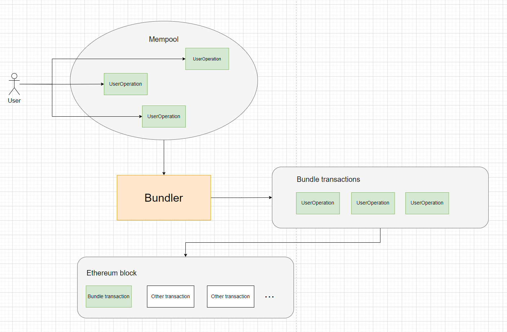
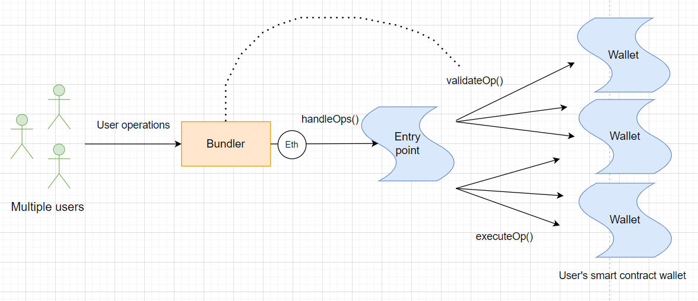
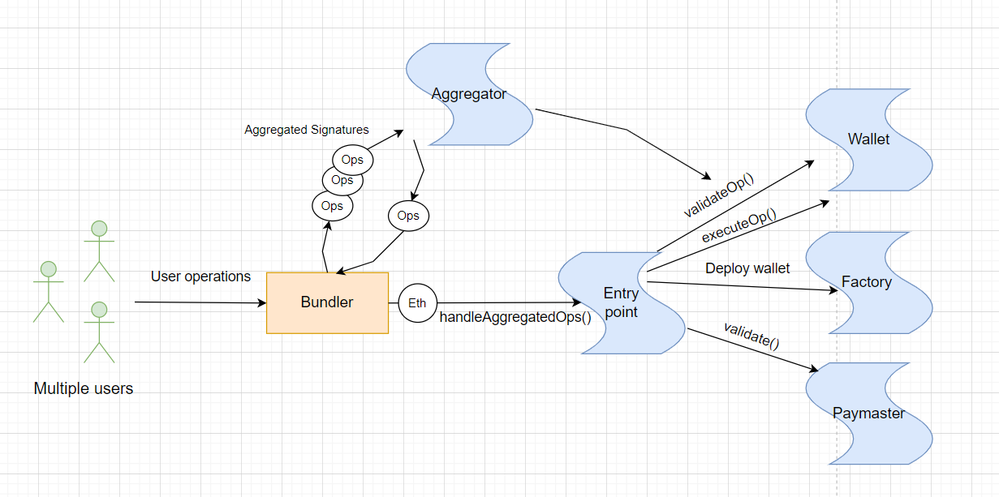

# ERC-4337: Account Abstraction Using Alt Mempool

**Author:** [Pavel Naydanov](https://github.com/PavelNaydanov) 🕵️‍♂️

> ERC-4337 is an Ethereum standard that provides **account abstraction** in the protocol without any changes at the consensus level.

The standard was proposed by Ethereum co-founder Vitalik Buterin and other developers in 2021. In March 2023, it was deployed on the Ethereum mainnet.

In Ethereum, there are two types of accounts:
  - **EOA** (Externally-Owned Account), controlled by someone who has the private key.
  - **Contract account**, a smart contract deployed on the blockchain.

You can read more about the account system [here](https://ethereum.org/en/developers/docs/accounts/).

According to the new ERC-4337 standard, these two types of accounts are combined into one. The result is a unified account that can both perform token transactions and create contracts simultaneously. It can be thought of as a higher-level abstraction above the two types of accounts.

## Why is ERC-4337 Needed?

The answer is simple: to build next-generation wallets that combine the advantages of a smart contract and an EOA account.

Today, most wallets (e.g., [Metamask](https://metamask.io/)) are typical EOAs based on a private key. This model requires signing every transaction with the private key, making it cumbersome for users to interact with the wallet. Moreover, losing the private key means losing access to the wallet.

On the other hand, there are alternative contract-based wallets ([Gnosis wallet](https://safe.global/)). A smart contract allows implementing custom wallet logic, such as multi-signature functionality. However, users of such wallets still need an EOA account to call smart contract functions and pay gas fees.

**Important!** An EOA account is required because only it can initiate transactions in the blockchain. An EOA account signs transactions with its private key and pays gas for their execution.

ERC-4337 combines the features of EOA-based wallets and contract wallets by using pseudo-transactions instead of regular transactions. This eliminates the need to sign each transaction with a private key. This approach replaces [ERC-2771](https://eips.ethereum.org/EIPS/eip-2771) with meta-transactions. You can read more about it [here](https://ethereum.org/en/roadmap/account-abstraction/). Pseudo-transactions provide **abstraction** over the user's account. 😇

## How Does It Work?

Alchemy has prepared a series of articles on the topic of account abstraction. These articles not only explain the new standard but also give a step-by-step description on why specific approaches were used in the standard. From a technical perspective, these are the most useful articles I've encountered, aside from Vitalik's articles. I believe that developers should definitely read them to gain a better understanding.

1. [You Could Have Invented Account Abstraction: Part 1](https://www.alchemy.com//blog/account-abstraction)
2. [Account Abstraction Part 2: Sponsoring Transactions Using Paymasters](https://www.alchemy.com/blog/account-abstraction-paymasters)
3. [Account Abstraction Part 3: Wallet Creation](https://www.alchemy.com/blog/account-abstraction-wallet-creation)
4. [Account Abstraction Part 4: Aggregate Signatures](https://www.alchemy.com/blog/account-abstraction-aggregate-signatures)

Now, you can go ahead and read the "laws." 😜 Welcome, [ERC-4337](https://eips.ethereum.org/EIPS/eip-4337)!

Below, I'll show a few general diagrams and briefly explain the operation process of the standard.
The main **actors** are:
1. **Bundler**. A specialized service that organizes an alternative mempool for storing pseudo-transactions and adds transactions to the Ethereum Block as if they were regular transactions.
2. **Entry point contract**. This is a singleton. Essentially, it's a contract that serves as a trusted entry point for the Bundler. The contract handles the validation and execution of transactions.
3. **Paymaster**. A smart contract that can participate in paying gas fees for executing user pseudo-transactions.
4. **Account**. Or Wallet. Essentially, it's a smart contract that implements the logic of a user's wallet. The core business logic of working with the wallet in a DApp is described here.

### How Bundler Works

Here's what happens in the diagram:
1. Users prepare their pseudo-transactions, correctly called **UserOperations** in the standard.
2. They are then sent to the **alternative mempool**.
3. The **Bundler** retrieves **UserOperations** from the **alternative mempool**.
4. The **Bundler** packages **UserOperations** into regular transactions.
5. The **Bundler** adds these transactions to the **Ethereum block**.

### Simplified ERC-4337 Workflow

In the simplest form, users can request the **Bundler** to execute a transaction on their **Wallet** contract on their behalf. The **Bundler** pays the gas fees. Different models can be devised for how the **Bundler** obtains funds for gas payment. For example, it could do it for free, issue a credit to the user with an expectation of future reimbursement, or directly deduct gas funds from the user's wallet.

Here's what happens in the diagram:
1. Users send their **UserOperations** to the **alternative mempool**, where they are picked up by the **Bundler**.
2. The **Bundler** processes **UserOperations**, checking each one's validity through the `validateOp()` call on the **Wallet** contract. This validation ensures that unnecessary gas isn't spent on invalid transactions.
3. The **Bundler** forwards the **UserOperations** to the trusted **EntryPoint** contract. This contract validates transactions again and executes calls for each user's wallet.

### Slightly More Complex ERC-4337 Workflow

This diagram resembles the simplified one but introduces a few new contracts: **Factory**, **Paymaster**, **Aggregator**.

Here's what happens in the diagram:
1. Users send their **UserOperations** to the **alternative mempool**, where they are picked up by the **Bundler**.
2. The **Bundler** sends **UserOperations** to the **Aggregator** contract for generating a combined signature. In essence, **UserOperations** are grouped, and the group receives a single signature. This allows executing transactions in batches, reducing costs compared to individual transactions. During aggregation, **UserOperations** are validated by calling `validateOp()` on the respective **Wallet** contracts.
3. The **Bundler** forwards the **aggregated UserOperations** to the trusted **EntryPoint** contract. This contract validates transactions again and executes calls for each user's wallet.
4. If the wallet contract has not yet been created, the user's wallet will be created before executing the transaction through the **Factory** contract.
5. If a trusted **Paymaster** contract is specified in the **UserOperation**, the gas fee for that **UserOperation** will be deducted from it. Gas fees are only deducted if the **Paymaster** contract allows it. The **EntryPoint** contract checks this through the `validate()` function for each **UserOperation**.

## Use Cases

The **ERC-4337** standard opens up new possibilities for user wallets. Below, I'll describe the most common and relevant use cases.

1. **Multisig**: Sharing a wallet among a group of users. This was possible for contract-based wallets but not for EOAs.
2. **Social recovery**: Allowing users to recover access to their wallet. If one user loses access, other wallet owners can help them recover it, or recovery can be implemented in other convenient ways.
3. **Different signature schemes**: The standard allows using other digital signature verification algorithms, such as [BLS](https://en.wikipedia.org/wiki/BLS_digital_signature) or [quantum-resistant](https://www.technologyreview.com/2022/09/14/1059400/explainer-quantum-resistant-algorithms) algorithms in the future.
4. **Batching multiple operations**: The ability to call multiple operations on the wallet within a single transaction. For example, when swapping tokens on [Uniswap](https://uniswap.org/), you can call `approve()` and `transferFrom()` in a single transaction.
5. **Gas abstraction**: Setting the address from which gas payments will be deducted. This means that DApps can pay gas fees for users, or users can pay gas from a second wallet. Other use cases are possible, such as paying gas fees in an ERC-20 token or exchanging one token for another within the wallet contract.

**Important!** Thanks to the standard, it's possible to implement practically any set of functions for a wallet. You can come up with your own use case.

## Bundler

There are two popular Bundlers:

1. [Go Bundler by Stackup](https://github.com/stackup-wallet/stackup-bundler)
2. [TypeScript Bundler by Infinitism](https://github.com/eth-infinitism/bundler)

**Important!** At the time of writing this article, node data providers are beginning to offer products to build **Account Abstraction**. For example, for early access to Alchemy, you can fill out a special form. The product itself is [here](https://www.alchemy.com/account-abstraction). Or [Biconomy](https://docs.biconomy.io/docs/category/smart-accounts), which uses **Account Abstraction** to provide a convenient SDK for easy blockchain interaction.

## Contracts

Contracts were written for the standard. You can view them [here](https://github.com/eth-infinitism/account-abstraction/tree/develop/contracts).

The contract [EntryPoint.sol](https://github.com/eth-infinitism/account-abstraction/blob/develop/contracts/core/EntryPoint.sol).

The contract for a simple wallet [SimpleAccount.sol](https://github.com/eth-infinitism/account-abstraction/blob/develop/contracts/samples/SimpleAccount.sol).

The contract for a wallet factory [FactorySimpleAccount.sol](https://github.com/eth-infinitism/account-abstraction/blob/develop/contracts/samples/SimpleAccountFactory.sol).

The base contract for implementing a [Paymaster](https://github.com/eth-infinitism/account-abstraction/blob/develop/contracts/core/BasePaymaster.sol).

**Important!** The contracts were audited by [OpenZeppelin](https://www.openzeppelin.com/). You can read the audit results [here](https://blog.openzeppelin.com/eip-4337-ethereum-account-abstraction-incremental-audit).

## SDK for Sending UserOperation to the Network

To send **UserOperation** to the **alternative mempool**, various SDKs are already available. For example, [@account-abstraction/sdk](https://www.npmjs.com/package/@account-abstraction/sdk). This SDK is developed by Infinitism and is compatible with their own [bundler](https://github.com/eth-infinitism/bundler).

## More Examples and Useful Articles

I'm not the first to explore the standard. There's an interesting repository [awesome account abstraction](https://github.com/4337Mafia/awesome-account-abstraction) with a wealth of material, a list of applications, bundlers, and more.

## Links

1. [ERC-4337: Account Abstraction Using Alt Mempool](https://eips.ethereum.org/EIPS/eip-4337)
2. [What Is ERC-4337, or Account Abstraction for Ethereum?](https://academy.binance.com/en/articles/what-is-erc-4337-or-account-abstraction-for-ethereum)
3. [ERC 4337: account abstraction without Ethereum protocol changes](https://medium.com/infinitism/erc-4337-account-abstraction-without-ethereum-protocol-changes-d75c9d94dc4a). Vitalik's article from September 21st.
4. ETHGlobal video from an Ethereum Foundation developer: [Talk | ERC 4337: Account Abstraction via Alternative Mempool](https://www.youtube.com/watch?v=eyT6WzJmWyc&ab_channel=ETHGlobal).
