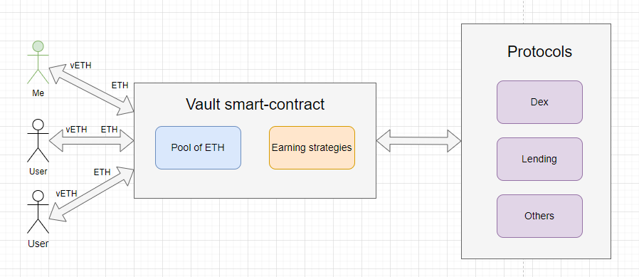
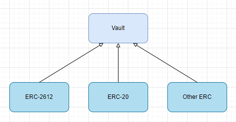

# ERC-4626: Tokenized Vaults

**Author:** [Pavel Naydanov](https://github.com/PavelNaydanov) 🕵️‍♂️

_Oops!_ **Vault** is a smart contract "storage" that allows users to maximize profits from the assets they own. Users transfer their assets to a smart contract that implements a certain earning strategy by utilizing the provided assets with automatic interest accrual and rebalancing.

At the moment of transferring assets to the **vault**, users are issued other tokens (shares) that yield income. These tokens increase in value over time and represent partial ownership of the assets in the vault. Their value grows in proportion to the increase in the value of the assets in the **vault** pool.

## How does it work?

Suppose **vault** accepts ETH (native currency of the Ethereum network) as an asset for profit maximization. I can transfer ETH to the vault smart contract and in return, I get a share token vETH. The share token is a kind of debt note of the vault, which allows me to get my ETH back.

The ETH I transferred, inside the **vault**, is combined with the ETH of other users and used in various protocols to extract yield. **Vault** checks the profitability of different protocols when a user deposits or withdraws assets. This triggers a rebalancing of the assets in the pool if there is a more profitable opportunity for yield. Rebalancing is changing the ratio of assets between different earning protocols or even strategies to extract the maximum yield.

> For example!
> If MakerDao offers a higher yield for investing ETH as liquidity than Compound, then the vault may decide to move all or part of the ETH from Compound to MakerDao. [MakerDao](https://makerdao.com/en/) and [Compound](https://compound.finance/) are popular lending protocols.



## ERC-4626 Standard

The [ERC-4626](https://eips.ethereum.org/EIPS/eip-4626) standard was developed as part of Ethereum improvement proposals. It was co-authored by Joey Santoro, the founder of the [Fei](https://fei.money/) protocol.

Before the introduction of the standard, there was a lack of standardization among **vaults**, leading to a variety of implementations. This made it difficult to integrate protocols that implement applications on top of vaults.

The standard itself is a smart contract that is an extension of the ERC-20 standard and regulates:
- Asset deposit and withdrawal
- Calculation of the number of tokens for depositing and withdrawing assets
- Asset balances
- Sending events

The introduction of the standard reduced integration costs and increased the reliability of implementations.


## Implementation

The technical implementation is inherited from the ERC-20 standard. This allows minting and burning **share** tokens in exchange for **assets** (underlying or base) tokens. For this process, the vault provides standard functions: `deposit()`, `mint()`, `redeem()`, `burn()`.

_Important!_ The standard can implement functionality of other standards for **vault**, for example, [ERC-2612: Permit Extension for EIP-20 Signed Approvals](https://eips.ethereum.org/EIPS/eip-2612).



In the ERC-4626 standard, there are two conversion functions:
- `convertToShares(uint256 assets)`. Calculates the amount of share token that can be obtained for a given amount of the base token.
- `convertToAssets(uint256 shares)`. Calculates the amount of the base token that can be obtained for a given amount of the share token.

### Deposit

The process of transferring tokens to the vault contract. In the process of transfer, according to the standard, it is necessary to calculate the number of share tokens, debit the base token, mint the share token, and send a solidity event.

The `deposit()` function may look like this.

```solidity
function deposit(uint256 assets, address receiver) public virtual returns (uint256 shares) {
    /// Accessing the available amount of share token
    /// for the deposited amount of the base token (assets)
    /// Internally, it calls convertToShares(uint256 assets)
    shares = previewDeposit(assets);

    if (shares == 0) {
        /// If the amount of share token is zero, an error is returned
        revert ZeroShares();
    }

    /// Transfer of the base token to the vault contract
    asset.safeTransferFrom(msg.sender, address(this), assets);

    /// Minting in exchange for share token
    _mint(receiver, shares);

    /// Sending an event confirming the user's deposit
    emit Deposit(msg.sender, receiver, assets, shares);

}
```

### Redeem

The process of transferring share tokens with the aim of withdrawing the underlying asset, which was invested through the `deposit()` function. According to the standard, it is necessary to accept the share token, calculate the amount of the base token, and burn the given amount of share token.

The `redeem()` function may look like this.


```solidity
function redeem(
    uint256 shares,
    address receiver,
    address owner
) public virtual returns (uint256 assets) {
    /// Checking if the specified address actually deposited the base token on the contract
    /// or if they gave permission to manage their deposit to the function caller
    if (msg.sender != owner) {
        uint256 allowed = allowance[owner][msg.sender];

        if (allowed != type(uint256).max) allowance[owner][msg.sender] = allowed - shares;
    }

    /// Accessing the available amount of base token (assets)
    /// when returning a specified amount of share token
    /// Internally, it calls convertToAssets(uint256 assets)
    assets = previewRedeem(shares);

    if (assets == 0) {
        /// If the amount of base token is zero, an error is returned
        revert ZeroAssets();
    }

    /// Burning the share token
    _burn(owner, shares);

    /// Sending the base token to the recipient
    asset.safeTransfer(receiver, assets);

    /// Sending an event about the successful completion of the process of withdrawing the base asset
    /// According to the standard, we have only the Withdraw() event
    emit Withdraw(msg.sender, receiver, owner, assets, shares);
}
```

### Mint

The `mint()` function implements the process of providing the base token to the vault contract. This process differs from `deposit()` in that the function arguments specify not the amount of the base asset, but the amount of share token that is required after the function call.

The `mint()` function may look like this.

```solidity
function mint(uint256 shares, address receiver) public virtual returns (uint256 assets) {
        /// Calculating the amount of base asset to be transferred to the contract
        assets = previewMint(shares);

        /// Transfer of the base asset from the caller to the contract
        asset.safeTransferFrom(msg.sender, address(this), assets);

        /// Minting share tokens
        _mint(receiver, shares);

        /// Sending an event about the successful asset provision process
        /// According to the standard, we have only the Deposit event
        emit Deposit(msg.sender, receiver, assets, shares);
    }
```

### Withdraw

The `withdraw()` function implements the process of withdrawing the base token from the vault contract. This process differs from `redeem()` in that the function arguments specify not the amount of share token, but the amount of the base token (assets) that is required after the function call.

The `withdraw()` function may look like this.

```solidity
function withdraw(
    uint256 assets,
    address receiver,
    address owner
) public virtual returns (uint256 shares) {
    /// Calculating the amount of share token to be transferred to the contract
shares = previewWithdraw(assets);

/// Checking if the specified address actually deposited the base token on the contract
/// or if they gave permission to manage their deposit to the function caller
if (msg.sender != owner) {
    uint256 allowed = allowance[owner][msg.sender];

    if (allowed != type(uint256).max) allowance[owner][msg.sender] = allowed - shares;
}

/// Burning the share token
_burn(owner, shares);

/// Sending the base token to the recipient
asset.safeTransfer(receiver, assets);

/// Sending an event about the successful completion of the process of withdrawing the base asset
emit Withdraw(msg.sender, receiver, owner, assets, shares);

}
```

### Libraries

The most popular libraries have already implemented the minimal functionality for a vault contract. You can take these contracts, inherit from them, and develop your own **vault** contract.

1. [Minimal implementation](https://github.com/transmissions11/solmate/blob/main/src/mixins/ERC4626.sol) of vault in the solmate library.
2. [Minimal implementation](https://github.com/OpenZeppelin/openzeppelin-contracts/blob/v5.0.0/contracts/token/ERC20/extensions/ERC4626.sol) of vault in the openZeppelin library.

_Important!_ The standard is fully backward compatible with the ERC-20 standard.

### More Complex Contracts

1. [Aave vault](https://github.com/aave/Aave-Vault/blob/main/src/ATokenVault.sol#L525)
2. Minimal ERC4626-style tokenized Vault [implementation](https://github.com/z0r0z/MultiVault/blob/main/src/MultiVault.sol) with ERC1155 accounting
3. [Rari-Capital vault](https://github.com/Rari-Capital/vaults/blob/main/src/Vault.sol)
4. Fuji V2 Himalaya protocol. Contract [YieldVault](https://github.com/Fujicracy/fuji-v2/blob/f32394f00a0a6cf6c12309ae92bc1602dc27c535/packages/protocol/src/vaults/yields/YieldVault.sol). This contract is inherited from [BaseVault](https://github.com/Fujicracy/fuji-v2/blob/f32394f00a0a6cf6c12309ae92bc1602dc27c535/packages/protocol/src/abstracts/BaseVault.sol).

## Links

1. [ERC-4626: Tokenized Vaults](https://eips.ethereum.org/EIPS/eip-4626)
2. [ERC-2612: Permit Extension for EIP-20 Signed Approvals](https://eips.ethereum.org/EIPS/eip-2612)
3. [ERC-20: Token Standard](https://eips.ethereum.org/EIPS/eip-20)
4. [About ERC-4626 on ethereum.org](https://ethereum.org/en/developers/docs/standards/tokens/erc-4626/)
5. A wonderful simple vault example on [solidity-by-example](https://solidity-by-example.org/defi/vault/).
