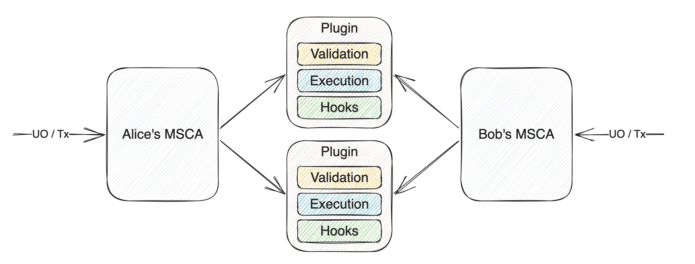
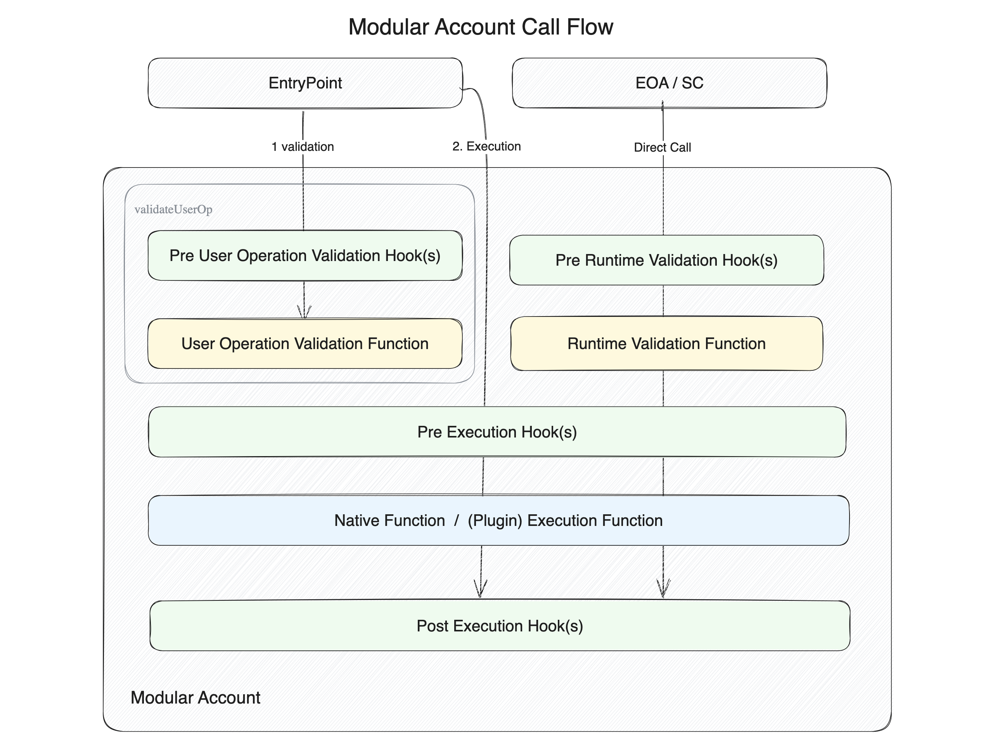
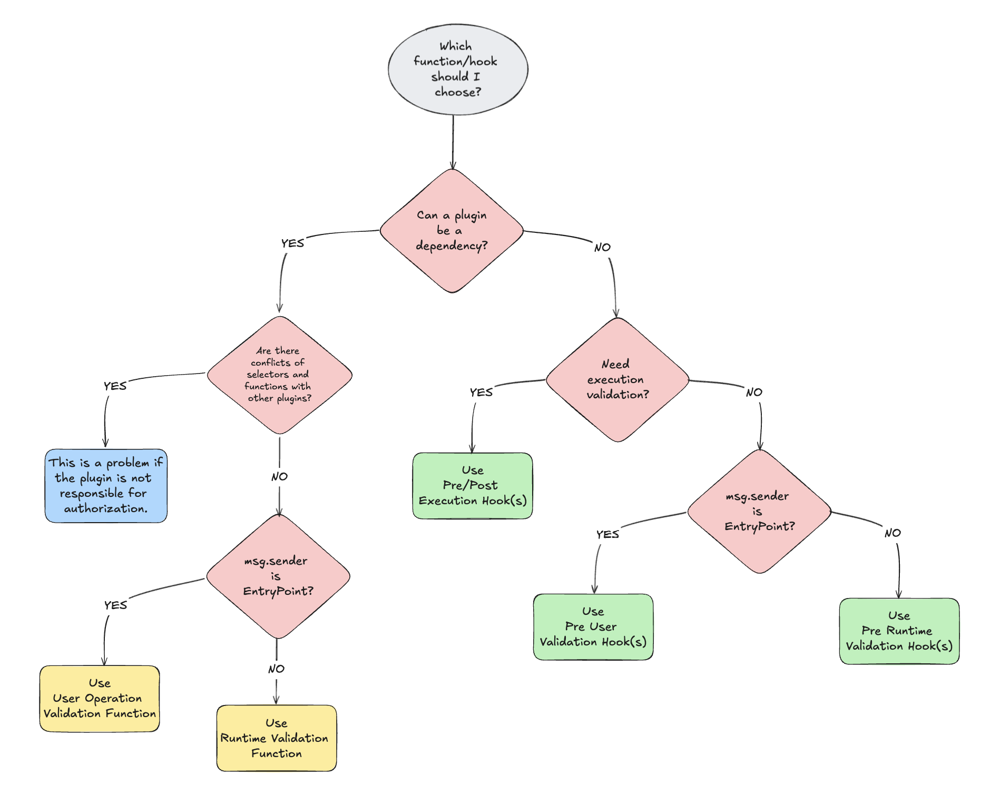

# ERC-6900: Modular Smart Contract Accounts and Plugins

**Author:** [Roman Yarlykov](https://github.com/rlkvrv) 🧐

ERC-6900 is an Ethereum standard that defines Modular Smart Contract Accounts (MSCA). It extends the functionality of [ERC-4337](https://eips.ethereum.org/EIPS/eip-4337) (Account Abstraction), allowing additional logic and checks to be moved into external modules.

Key aspects of ERC-6900:

- **Modularity**: allows account logic to be divided into separate plugins.
- **Extensibility**: simplifies adding new functions to accounts without changing the core code.
- **Standardization**: ensures compatibility between different implementations of accounts and plugins.
- **Integration with ERC-4337**: compatible with the Account Abstraction infrastructure.

*Important!* Both standards (ERC-4337 and ERC-6900) are in draft stages, so changes are possible. This article covers AA (ERC-4337) version v0.6.0 and ERC-6900 (MSCA) version v0.7.0 (based on AA v0.6.0). For example, there is already a new version of AA with changes to `validateUserOp`, but MSCA does not yet support this.

Additionally, ERC-6900 is closely tied to Alchemy, so the latest updates on this standard are likely to be found in their repositories, as they are developing the architecture for working with such accounts. This is one of the main drawbacks of the standard—it is being created with the needs of a specific protocol in mind, rather than the entire community.

## MSCA

The standard is inspired by [ERC-2535: Diamonds, Multi-Facet Proxy](https://eips.ethereum.org/EIPS/eip-2535) for routing execution logic based on function selectors, although this standard is not directly used. All selectors are stored by the MSCA—essentially, it’s an extended version of the ERC-4337 account that includes logic for installing/removing plugins and knows which selector to use for redirecting calls.

The MSCA can handle two types of function calls:
- **User operation** — a call through the EntryPoint. These functions process `validateUserOp` calls and verify the validity of the ERC-4337 user operation.
- **Runtime** — a direct call on the account's smart contract. This includes the account's utility functions (e.g., `execute`, `executeBatch`, `upgradeToAndCall`, `installPlugin`, etc.).

To cover all possible calls (including direct ones), a plugin can have three types of callback functions:
- **Validation** — for verifying `userOp` or direct calls. Validation schemes define the conditions under which the smart contract account will approve actions performed on its behalf.
- **Execution** — contains the logic for executing business logic or checks during runtime.
- **Hooks** — hooks vary depending on where they are called, allowing control over the process before and after execution.
  - **Pre User Operation Validation Hook** — triggered before the `userOpValidationFunction`.
  - **Pre Runtime Validation Hook** — triggered before the `runtimeValidationFunction`.
  - **Pre Execution Hook** — triggered before the execution of business logic, can pass data to the Post Execution Hook.
  - **Post Execution Hook** — triggered after the execution of business logic and can process data from the Pre Execution Hook.


*Source: ERC-6900 Standard*

The idea is to divide calls into two types due to their differences: calls from the EntryPoint and calls from EOAs and smart contracts. This distinction occurs at the validation level, while "shared" callback functions can be used at the execution level. The resulting structure is as follows:


*Source: ERC-6900 Standard*

There are also `executeFromPlugin` and `executeFromPluginExternal` calls, which are handled differently, but it’s better to start by understanding the first two types of calls and testing them in practice before trying to invoke one plugin from another.

### How to Create an MSCA from an AA

To convert a classic Account Abstraction (AA) wallet into an MSCA, four mandatory interfaces are required:

- [IAccount.sol](https://github.com/eth-infinitism/account-abstraction/blob/releases/v0.6/contracts/interfaces/IAccount.sol) — the base interface for all AAs (ERC-4337), describing the `validateUserOp` function, which is called by the *EntryPoint* smart contract. In the classic version, this includes signature verification and other validation logic. In MSCA, instead, the `userOpValidationFunction` and the `preUserOpValidationHook` are used, delegating these checks to installed plugins.
    ```solidity
    function validateUserOp(
        UserOperation calldata userOp,
        bytes32 userOpHash,
        uint256 missingAccountFunds
    ) external returns (uint256 validationData);
    ```
- [IPluginManager.sol](https://github.com/erc6900/reference-implementation/blob/v0.7.x/src/interfaces/IPluginManager.sol) — responsible for installing and removing plugins using two functions:
    ```solidity
    function installPlugin(
        address plugin,
        bytes32 manifestHash,
        bytes calldata pluginInstallData,
        FunctionReference[] calldata dependencies
    ) external;

    function uninstallPlugin(
        address plugin,
        bytes calldata config,
        bytes calldata pluginUninstallData
    ) external;
    ```
- [IStandardExecutor.sol](https://github.com/erc6900/reference-implementation/blob/v0.7.x/src/interfaces/IStandardExecutor.sol) — includes standard AA execution functions, through which direct calls to plugins are prohibited.
    ```solidity
    function execute(
        address target,
        uint256 value,
        bytes calldata data
    ) external payable returns (bytes memory);

    function executeBatch(
        Call[] calldata calls // Call { target; value; data }
    ) external payable returns (bytes[] memory);
    ```
- [IPluginExecutor.sol](https://github.com/erc6900/reference-implementation/blob/v0.7.x/src/interfaces/IPluginExecutor.sol) - using this interface, plugin A can call plugin B, but the call will be made through the MSCA. The `executeFromPluginExternal` function is needed so that a plugin can call an external smart contract through the MSCA.
    ```solidity
    function executeFromPlugin(
        bytes calldata data
    ) external payable returns (bytes memory);

    function executeFromPluginExternal(
        address target,
        uint256 value,
        bytes calldata data
    ) external payable returns (bytes memory);
    ```

In addition to these mandatory interfaces, there is also [IAccountLoupe.sol](https://github.com/erc6900/reference-implementation/blob/v0.7.x/src/interfaces/IAccountLoupe.sol), which provides on-chain information about installed plugins. For example, it includes functions like `getInstalledPlugins`, `getPreValidationHooks`, and others.

## Plugins

A plugin is a singleton smart contract deployed as a single instance for all accounts that will install it. The plugin stores settings for each account. The smart contract of the plugin should not be upgradable; to update, the old version of the plugin must be removed and a new one installed.

The plugin should inherit from [IPlugin.sol](https://github.com/erc6900/reference-implementation/blob/v0.7.x/src/interfaces/IPlugin.sol) and implement at least the functions for installing and removing the plugin:

```solidity
function onInstall(bytes calldata data) external;

function onUninstall(bytes calldata data) external;
```

The plugin must also contain a manifest and metadata.

```solidity
function pluginManifest() external pure returns (PluginManifest memory);

function pluginMetadata() external pure returns (PluginMetadata memory);
```

The manifest is required for installing the plugin. It describes execution functions, validation functions, and hooks that will be configured on the MSCA during plugin installation. Additionally, the manifest contains dependency requirements (where a dependency can be another plugin) and permissions for using certain functions.

Let's take a closer look at the structure of the manifest.

### Plugin Manifest

The manifest is a specification of the plugin that defines how the MSCA should interact with the plugin, which plugin functions should be called when certain selectors are accessed, and how to handle dependencies on other plugins.

```solidity
struct PluginManifest {
       // List of ERC-165 interfaces to be added to the MSCA account.
    // Should not include the IPlugin interface
    bytes4[] interfaceIds;
        // If any plugin functions depend on validation through other plugins,
    // their interfaces should be added to this array
    bytes4[] dependencyInterfaceIds;
        // These are plugin functions that are set on the MSCA
    // and extend its functionality
    bytes4[] executionFunctions;
        // Functions already set on the MSCA that this plugin has access to
    bytes4[] permittedExecutionSelectors;
    // Flag indicating whether the plugin can call external smart contracts
    bool permitAnyExternalAddress;
    // Flag indicating whether the plugin can spend the network's native tokens
    bool canSpendNativeToken;
    // Function specifications
    ManifestExternalCallPermission[] permittedExternalCalls;
    ManifestAssociatedFunction[] userOpValidationFunctions;
    ManifestAssociatedFunction[] runtimeValidationFunctions;
    ManifestAssociatedFunction[] preUserOpValidationHooks;
    ManifestAssociatedFunction[] preRuntimeValidationHooks;
    ManifestExecutionHook[] executionHooks;
}
```

**interfaceIds**

For example, if your account does not support working with ERC721 and cannot receive NFTs, you can add a plugin with the `onERC721Received` function and specify the `IERC721Receiver` interface in `interfaceIds`. As a result, the `supportInterface` function of the MSCA account will return `true` when checking for this interface.

**dependencyInterfaceIds**

This should be specified when the target plugin depends on validation from another plugin.
For example, let's take a look at the [plugin](./contracts/src/TokenWhitelistPlugin.sol) I wrote for testing. Its main task is to check if an ERC20 token is in the whitelist when calling the `transfer` and `approve` functions. It has a utility function `updateTokens`, which adds and removes tokens from the whitelist. Naturally, access to this function should be restricted, but thousands of accounts might use the plugin, and it wouldn’t make sense to assign whitelist management to a single admin wallet. Therefore, each MSCA account manages the list of tokens it can interact with independently. To ensure that only the MSCA has access to modify the whitelist, you need to add a dependency in the form of a plugin that will handle access checks. In my case, this is the [MultiOwnerPlugin](https://github

```solidity
function pluginManifest() external pure override returns (PluginManifest memory) {
    PluginManifest memory manifest;
    // dependency
    manifest.dependencyInterfaceIds = new bytes4[](1);
    manifest.dependencyInterfaceIds[0] = type(IMultiOwnerPlugin).interfaceId;

    // ...
}
```

**executionFunctions**

These are the functions that are set on the MSCA when the plugin is installed, thus extending its functionality. In my case, these are the `updateTokens`, `isAllowedToken`, and `getTokens` functions. "Extending" means that they, like the account's utility functions, will be called on the account "directly," for example, like this — `account.updateTokens()`. Since the plugin functions will be called through the account’s `fallback` function, if we do not add their selectors to `executionFunctions`, such a call will be rejected by the account.

**permittedExecutionSelectors**

This array contains the function selectors that the plugin can call on the MSCA through the `executeFromPlugin` function.

**permitAnyExternalAddress**

A flag that allows or prohibits calls via `executeFromPluginExternal`.

**canSpendNativeToken**

A flag that determines whether the plugin can use the network's native tokens.

### Specification of Functions Used by the Plugin

This section of the manifest describes how the plugin will interact with various functions and hooks in the MSCA.

**permittedExternalCalls**

Defines permissions for external address calls. It has two options: either allow calls to any selector or provide an array of allowed selectors.

```solidity
struct ManifestExternalCallPermission {
    address externalAddress;
    bool permitAnySelector;
    bytes4[] selectors;
}
```

**userOpValidationFunctions, runtimeValidationFunctions**

If your plugin needs to connect during the `userOpValidationFunction` or `runtimeValidationFunctions` calls, you must specify for which selectors this will apply. It's important to note that the functions (`userOpValidationFunctions` and `runtimeValidationFunctions`) can only have one entry per account selector, regardless of the number of installed plugins.

For example, the [MultiOwnerPlugin](https://github.com/alchemyplatform/modular-account/blob/v1.0.1/src/plugins/owner/MultiOwnerPlugin.sol) is responsible for validating all transactions when account selectors are called. This means that if *MultiOwnerPlugin* is already installed on the account, only it will handle validation of the `IStandardExecutor.execute.selector` in the `userOpValidationFunctions` and `runtimeValidationFunctions`. Therefore, it won't be possible to install another plugin that tries to validate the `execute` selector using these same functions, as it will result in an error like `UserOpValidationFunctionAlreadySet(0xb61d27f6,0xc7183455a4c133ae270771860664b6b7ec320bb100)`.

The solution in such cases is to add the required validation in the `preUserOpValidationHooks` or `preRuntimeValidationHooks` hook, rather than in the function itself.

If you need to validate a new selector being installed on the MSCA, which is not handled by *MultiOwnerPlugin*, you can add it as a dependency. For this, the `ManifestAssociatedFunction` and `ManifestFunction` structures are used.

Let’s go through an example with my `TokenWhitelistPlugin` and the `updateTokens` function, which I want to add to the MSCA. Earlier, we already added `IMultiOwnerPlugin` to `dependencyInterfaceIds`—that was step 1. Now we need to add the selector to `executionFunctions`.

```solidity
function pluginManifest() external pure override returns (PluginManifest memory) {
    PluginManifest memory manifest;
    // dependency
    manifest.dependencyInterfaceIds = new bytes4[](1);
    manifest.dependencyInterfaceIds[0] = type(IMultiOwnerPlugin).interfaceId;

    // runtime execution functions
    manifest.executionFunctions = new bytes4[](1);
    manifest.executionFunctions[0] = this.updateTokens.selector;
    // ...
}
```
This plugin function will only be called at runtime, because the account cannot call the plugin via `userOp`; therefore, we will handle the call through the appropriate function. First, we create a new `ManifestAssociatedFunction` array and add the function selector to it:

```solidity
struct ManifestAssociatedFunction {
    bytes4 executionSelector;     // account selector (in this case, added from the plugin)
    ManifestFunction associatedFunction; // function responsible for handling
}

manifest.runtimeValidationFunctions = new ManifestAssociatedFunction[](1);
manifest.runtimeValidationFunctions[0] = ManifestAssociatedFunction({
    executionSelector: this.updateTokens.selector,
    associatedFunction: // ...
});
```

Next, in `associatedFunction`, you need to add a `ManifestFunction` structure to describe what the plugin should do with this selector:

```solidity
struct ManifestFunction {
       ManifestAssociatedFunctionType functionType; // This is an enum defined by the ERC-6900 standard
    uint8 functionId; // This is an enum defined in the plugin that helps identify the function
    uint256 dependencyIndex; // Dependency index in the dependencyInterfaceIds array
}
```

The first thing to determine is `functionType`, a flag that tells the account where to direct the processing of this selector:

```solidity
enum ManifestAssociatedFunctionType {
    // Function not defined
    NONE,
    // Function belongs to this plugin
    SELF,
    // Function belongs to an external plugin provided
    // as a dependency during plugin installation.
    // Plugins MAY depend on external validation functions.
    // They MUST NOT depend on external hooks, otherwise installation will fail.
    DEPENDENCY,
    // Sets a magic value to always allow validation
    // in runtime mode for this function.
    // Only for runtime mode; if set for validationFunction,
    // it will be wasted gas.
    // If used with a hook, it is equivalent to having no hook set.
    RUNTIME_VALIDATION_ALWAYS_ALLOW,
    // Sets a magic value to always trigger a failure in the hook for this function.
    // Used only with pre-execution hooks.
    // Should not be used with validation functions—
    // equivalent to no validation.
    // It should not be used in post-exec hooks because if it is known
    // that the hook will always return, this should happen as early as possible
    // to save gas.
    PRE_HOOK_ALWAYS_DENY
}
```

In our case, the `DEPENDENCY` flag should be used. When a dependency is added, `functionId` does not matter, as it will be assigned by the dependency itself. `dependencyIndex` should correspond to the position of the dependency plugin in `dependencyInterfaceIds`.

```solidity
manifest.runtimeValidationFunctions = new ManifestAssociatedFunction[](1);
manifest.runtimeValidationFunctions[0] = ManifestAssociatedFunction({
    executionSelector: this.updateTokens.selector,
    associatedFunction: ManifestFunction({
        functionType: ManifestAssociatedFunctionType.DEPENDENCY,
        functionId: 0, // does not matter in the case of a dependency
        dependencyIndex: 0 // in our case, 0 because the IMultiOwnerPlugin interface is at this index
    })
});
```

Almost done. For everything to work correctly, the `TokenWhitelistPlugin` needs to be installed with a description of the dependency and how it should function. The dependency is specified as `bytes21`, where the first 20 bytes contain the address of the dependency plugin, and the last byte indicates the `functionId` to be passed to the dependency.

```solidity
// Custom type for packing plugin data
type FunctionReference is bytes21;

FunctionReference[] memory dependencies = new FunctionReference[](1);
// specify the dependency address and functionId here
dependencies[0] = FunctionReferenceLib.pack(
    address(multiOwnerPlugin),
    uint8(IMultiOwnerPlugin.FunctionId.RUNTIME_VALIDATION_OWNER_OR_SELF)
);

vm.prank(owner);
account1.installPlugin({
    plugin: address(tokenWhitelistPlugin),
    manifestHash: manifestHash,
    pluginInstallData: tokenWhitelistPluginInstallData,
    dependencies: dependencies// pass dependencies here
});
```

Done. If everything is set up correctly, then when calling `updateTokens` on the account, the account will recognize that this selector is handled by the `MultiOwnerPlugin` dependency. It will therefore delegate control to its `runtimeValidationFunction`, where the `functionId` specified during dependency installation will be defined along with the plugin.

```solidity
function runtimeValidationFunction(
    uint8 functionId,
    address sender,
    uint256,
    bytes calldata
) external view override {
    if (functionId == uint8(FunctionId.RUNTIME_VALIDATION_OWNER_OR_SELF)) {
        // Validate that the sender is an owner of the account, or self.
        if (sender != msg.sender && !isOwnerOf(msg.sender, sender)) {
            revert NotAuthorized();
        }
        return;
    }
    revert NotImplemented(msg.sig, functionId);
}
```

*Important!* You cannot specify an external hook as a dependency—only an external function.

**preUserOpValidationHooks**, **preRuntimeValidationHooks**

These are also processed via *ManifestAssociatedFunction*. They are executed before the corresponding functions. There can be multiple hooks for a single selector within one MSCA account. They cannot be dependencies.

**executionHooks**

Hooks that are activated at the execution stage, regardless of how the call was made—whether through `userOp` or directly. For the `TokenWhitelistPlugin`, for example, this is a good place to capture all calls and check if the token is on the whitelist.

Since there are two execution-stage hooks: pre-execution and post-execution (`preExecHook` and `postExecHook`), the structure for describing hook handling is a bit different—`ManifestExecutionHook`:

```solidity
struct ManifestExecutionHook {
    bytes4 selector; // function selector that needs to be checked during execution
    ManifestFunction preExecHook; // function for pre-execution check
    ManifestFunction postExecHook; // function for post-execution check
}
```

Next, we use the same `ManifestFunction`. For example, if I need to handle calls on the plugin through the MSCA account functions `execute` or `executeBatch`:

- The function type will be `SELF`, because the call is handled within this same plugin.
- We specify `functionId` so that the plugin can understand which selector is being called.
- `dependencyIndex` is not specified, as hooks cannot have dependencies.

```solidity
    manifest.executionHooks = new ManifestExecutionHook[](2);
    manifest.executionHooks[0] = ManifestExecutionHook({
        executionSelector: IStandardExecutor.execute.selector,
        preExecHook: ManifestFunction({
            functionType: ManifestAssociatedFunctionType.SELF,
            functionId: uint8(FunctionId.EXECUTE_FUNCTION),
            dependencyIndex: 0
        }),
        postExecHook: none
    });
    manifest.executionHooks[1] = ManifestExecutionHook({
        executionSelector: IStandardExecutor.executeBatch.selector,
        preExecHook: ManifestFunction({
            functionType: ManifestAssociatedFunctionType.SELF,
            functionId: uint8(FunctionId.EXECUTE_BATCH_FUNCTION),
            dependencyIndex: 0
        }),
        postExecHook: none
    });
```

The manifest is ready. Next, the plugin needs to implement the `preExecutionHook` function to handle these calls. You can check out the implementation [here](./contracts/src/TokenWhitelistPlugin.sol).

```solidity
function preExecutionHook(
    uint8 functionId,
    address sender,
    uint256 value,
    bytes calldata data
) external view override returns (bytes memory) {}
```

## Plugin Development

Before creating a plugin, it’s important to clearly define which selectors it will work with and where checks need to be performed. Here’s a rough checklist I’ve made for myself (there’s a chance I may have missed something):

- [ ] What does the plugin do? What is its main task?
- [ ] What functions will need to be added to the account?
- [ ] Will it need to process `userOp` data, or is call data sufficient?
- [ ] Will the plugin be used as a dependency?
- [ ] Are there any selector conflicts with other plugins?
- [ ] Where can the check be performed as early as possible? This refers to the flow of validation and execution and the selection of functions or hooks based on that flow.
- [ ] Does the chosen function/hook handle all possible calls on the account?

Let’s go through this checklist with another plugin example — [TransferLimitPlugin](./contracts/src/TransferLimitPlugin.sol).

1. The plugin should set minimum balance limits for ERC20 tokens on the MSCA account. For example, if you’re worried about accidentally spending a large amount of USDT, you can set a limit. If your wallet has 5500 USDT, you set a limit of 5000, so you can freely spend the remaining 500, and the plugin will also protect you from unlimited approvals.
2. The main function for this plugin is to update limits, so let’s name it `updateLimit`. Only those who can manage MSCA account settings will be able to call this function. We’ll also need some view functions; in this case, these are `getCurrentLimit` and `getTokensForAccount`.
3. In this case, it doesn’t matter how the call was made; we need to handle any MSCA calls—both `userOp` and runtime.
4. It seems there’s no need to use the plugin as a dependency.
5. Since we don’t intend to make this plugin a dependency, this means we’ll be using hooks, which ensures no conflicts.
6. The earliest point to perform validation is in the validation hooks (`preUserOpValidationHooks` or `preRuntimeValidationHooks`), but that would require writing two separate handler functions in the plugin, and the `userOp` data wouldn’t be of much use here.
7. It’s essential to handle all possible token transfers, so in this case, it makes sense to do this in the `preExecutionHook`.

For clarity, I also sketched a diagram that can help with choosing the necessary functions or hooks for the plugin.



Next, we need to write the manifest according to the rules I mentioned above (it will be similar to the manifest for the `TokenWhitelistPlugin` plugin) and implement the functions themselves.

### View and Pure Functions

The data-reading functions also need to be added to `executionFunctions` and assigned the type `RUNTIME_VALIDATION_ALWAYS_ALLOW`, so that they become part of the MSCA as well. However, in some cases, it may be simpler to call them directly on the plugin.

```solidity
function pluginManifest() external pure override returns (PluginManifest memory) {
    // ...

    // runtime execution functions
    manifest.executionFunctions = new bytes4[](3);
    manifest.executionFunctions[0] = this.updateLimit.selector;
    manifest.executionFunctions[1] = this.getTokensForAccount.selector;
    manifest.executionFunctions[2] = this.getCurrentLimit.selector;

    ManifestFunction memory runtimeAlwaysAllow = ManifestFunction({
        functionType: ManifestAssociatedFunctionType.RUNTIME_VALIDATION_ALWAYS_ALLOW,
        functionId: 0,
        dependencyIndex: 0
    });

    manifest.runtimeValidationFunctions = new ManifestAssociatedFunction[](3);
    manifest.runtimeValidationFunctions[0] = ManifestAssociatedFunction({
        executionSelector: this.updateLimit.selector,
        // ...
    });
    manifest.runtimeValidationFunctions[1] = ManifestAssociatedFunction({
        executionSelector: this.getTokensForAccount.selector,
        associatedFunction: runtimeAlwaysAllow
    });
    manifest.runtimeValidationFunctions[2] = ManifestAssociatedFunction({
        executionSelector: this.getCurrentLimit.selector,
        associatedFunction: runtimeAlwaysAllow
    });
```

You can see a complete example [here].(./contracts/src/TransferLimitPlugin.sol).

### Installing and Uninstalling the Plugin

To allow the plugin to be installed on the MSCA, it’s necessary to implement the `onInstall` and `onUninstall` functions. For example, in the case of the *TransferLimitPlugin*, during installation, you can immediately set all necessary limits, and upon uninstallation — clear them.

```solidity
    function onInstall(bytes calldata data) external override {
        (ERC20SpendLimit[] memory spendLimits) = abi.decode(data, (ERC20SpendLimit[]));

        uint256 length = spendLimits.length;
        for (uint8 i = 0; i < length; i++) {
            _tokenList.tryAdd(msg.sender, SetValue.wrap(bytes30(bytes20(spendLimits[i].token))));
            _limits[msg.sender][spendLimits[i].token] = spendLimits[i].limit;
        }
    }

    function onUninstall(bytes calldata data) external override {
        (address[] memory tokens) = abi.decode(data, (address[]));

        uint256 length = tokens.length;
        for (uint8 i = 0; i < length; i++) {
            delete _limits[msg.sender][tokens[i]];
        }
        _tokenList.clear(msg.sender);
    }
```

To install the plugin, you will need:
- The address of the plugin.
- The `keccak256` hash of the plugin manifest.
- Data to pass to the `onInstall` function (in our case, this includes token addresses and their limits).
- Dependencies, such as MultiOwnerPlugin.

```solidity
function _installTransferLimitPlugin() private {
    // Get the hash of the manifest
    bytes32 transferLimitManifestHash = keccak256(abi.encode(transferLimitPlugin.pluginManifest()));

    // Configure installation parameters
    TransferLimitPlugin.ERC20SpendLimit[] memory spendLimits = new TransferLimitPlugin.ERC20SpendLimit[](1);
    spendLimits[0] = TransferLimitPlugin.ERC20SpendLimit({token: address(token), limit: TRANSFER_LIMIT});
    bytes memory transferLimitPluginInstallData = abi.encode(spendLimits);

   // Configure dependencies
    FunctionReference[] memory dependencies = new FunctionReference[](1);
    dependencies[0] = FunctionReferenceLib.pack(
        address(multiOwnerPlugin), uint8(IMultiOwnerPlugin.FunctionId.RUNTIME_VALIDATION_OWNER_OR_SELF)
    );

   // Install the plugin on the MSCA
    vm.prank(owner);
    account1.installPlugin(
        address(transferLimitPlugin),
        transferLimitManifestHash,
        transferLimitPluginInstallData,
        dependencies
    );
}
```

// To uninstall the plugin, you'll need to configure `UninstallPluginConfig`

```solidity
struct UninstallPluginConfig {
    // Plugin manifest
    bytes serializedManifest;
    // Flag to forcefully uninstall the plugin.
    // Removes the plugin even if the onUninstall function tries to stop the transaction
    bool forceUninstall;
    // Maximum amount of gas allowed for each uninstallation callback function
    // (`onUninstall`), or zero to set no limit.
    // Typically used together with `forceUninstall` to remove plugins that
    // prevent uninstallation by consuming all remaining gas.
    uint256 callbackGasLimit;
}
```

Example of plugin uninstallation:


```solidity
function test_uninstallPlugin() external {
    // Retrieve the manifest
    bytes memory serializedManifest = abi.encode(transferLimitPlugin.pluginManifest());

    // Configure the uninstallation settings
    bytes memory config = abi.encode(
        UpgradeableModularAccount.UninstallPluginConfig({
            serializedManifest: serializedManifest,
            forceUninstall: false,
            callbackGasLimit: 0
        })
    );

    // Prepare data for the onUninstall function
    address[] memory tokens = new address[](1);
    tokens[0] = address(token1);
    bytes memory uninstallData = abi.encode(tokens);

    // Uninstall the plugin
    vm.prank(owner);
    account1.uninstallPlugin({
        plugin: address(transferLimitPlugin),
        config: config,
        pluginUninstallData: uninstallData
    });
}
```

### Plugin Features

**Order of Execution for Plugins on the Same Selectors**

For example, if you have two plugins, A and B, both of which handle the `execute` selector through hooks, in what order will they be called?

It’s logical to assume that plugins will be called in the order they were installed on the MSCA, from the "oldest" to the most recently installed. In reality, however, it works the opposite way.

Example: we added plugin A, then B, then C.
Hooks will be called in the order C -> B -> A.
All account hooks are stored in a linked list, and due to the way it’s processed, values are retrieved from the end. Additionally, if, for instance, plugin C's hook reverts the call, further hooks will not execute. This same behavior applies to the `AccountLoupe::getInstalledPlugins` function, which will return the array of plugins in reverse order of their installation.

**Complexity of Development**

The main difficulty lies not in writing the validation functions and hooks, but in ensuring that the plugin integrates well with the MSCA, doesn’t conflict with other plugins, and, in some cases, has the ability to interact and work in tandem with them.

**Testing**

For testing and getting familiar with the standard, you can use the [plugin-template](https://github.com/erc6900/plugin-template) repository. It already has tests configured to work with EntryPoint.

## Conclusion

In my opinion, the standard is somewhat ambiguous. On one hand, it offers solid opportunities for expanding the capabilities of an abstract account. On the other hand, it sometimes feels like it trips over itself, providing too many tools and ways to combine them. Perhaps it would have been better if this standard were more "lightweight." It’s also unfortunate that Alchemy and their protocol’s interests have such a strong influence on it. But undeniably, this is another step toward user-friendly abstract accounts.

## Ссылки

- [EIP: ERC-6900: Modular Smart Contract Accounts and Plugins](https://eips.ethereum.org/EIPS/eip-6900)
- [EIP: ERC-4337](https://eips.ethereum.org/EIPS/eip-4337)
- [Article: How to write an ERC-6900 Plugin](https://dev.collab.land/blog/how-to-write-an-erc-6900-plugin/)
- [Github: erc6900](https://github.com/erc6900)
- [Github: modular-account (Alchemy)](https://github.com/alchemyplatform/modular-account)
- [Resources: Build a Plugin](https://www.erc6900.io/build-a-plugin)

