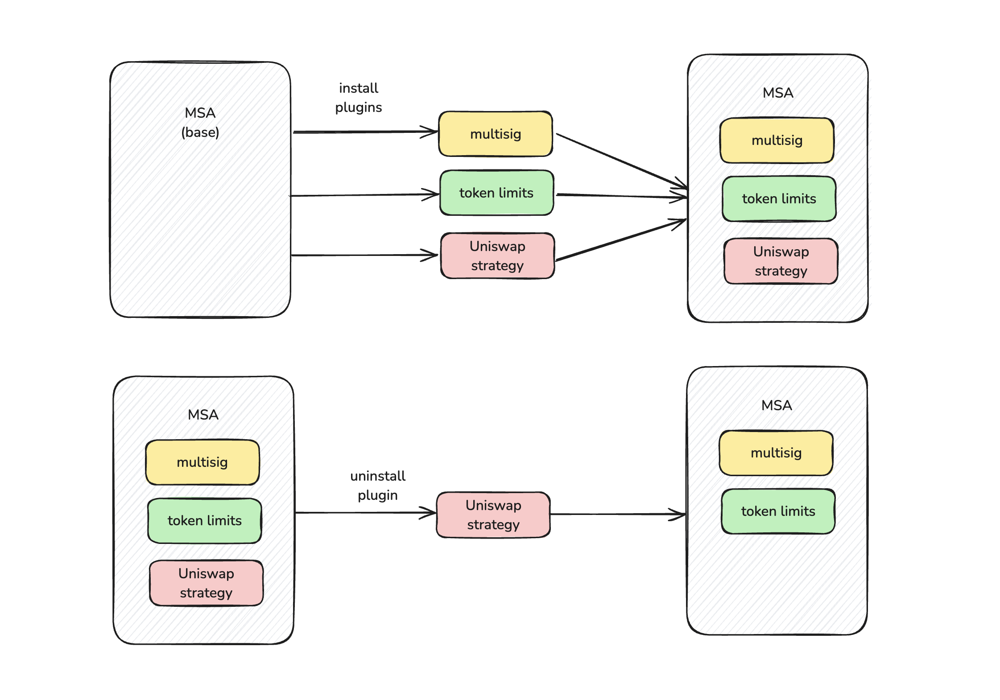
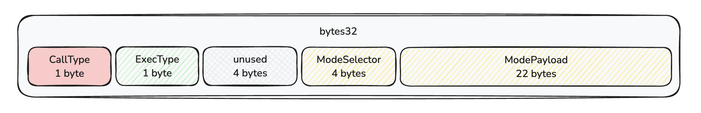
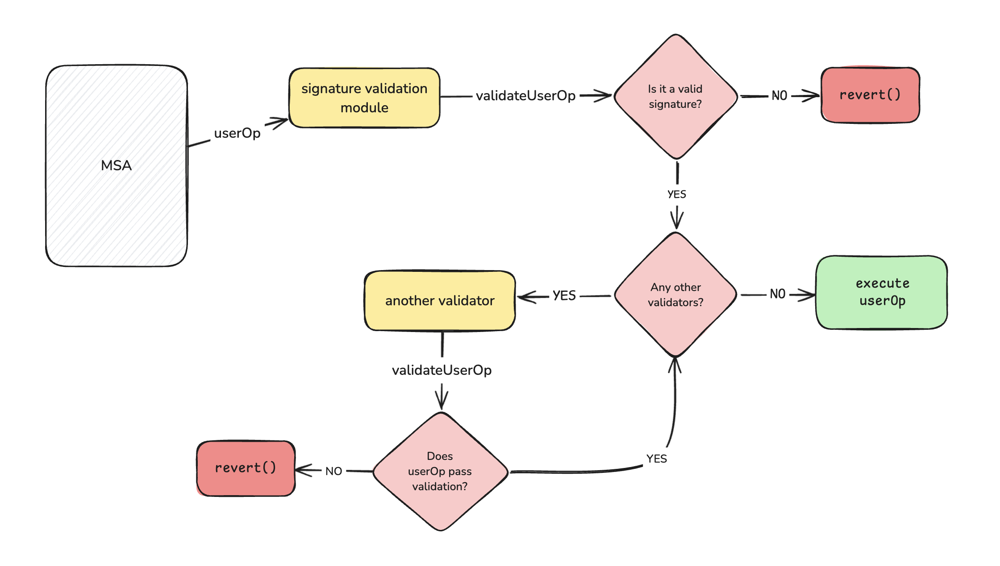
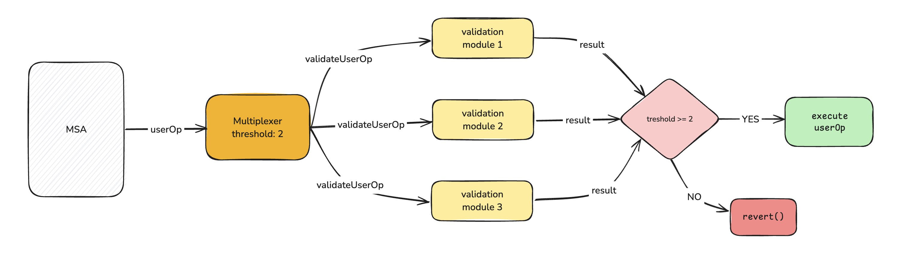
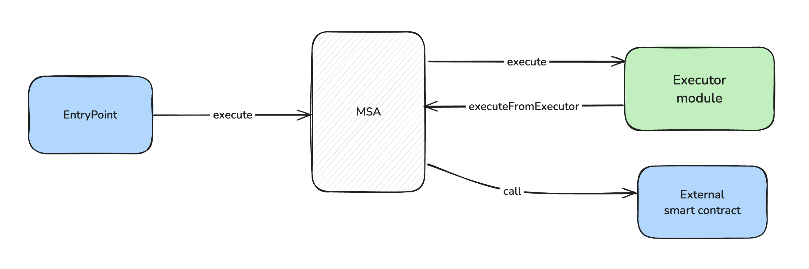
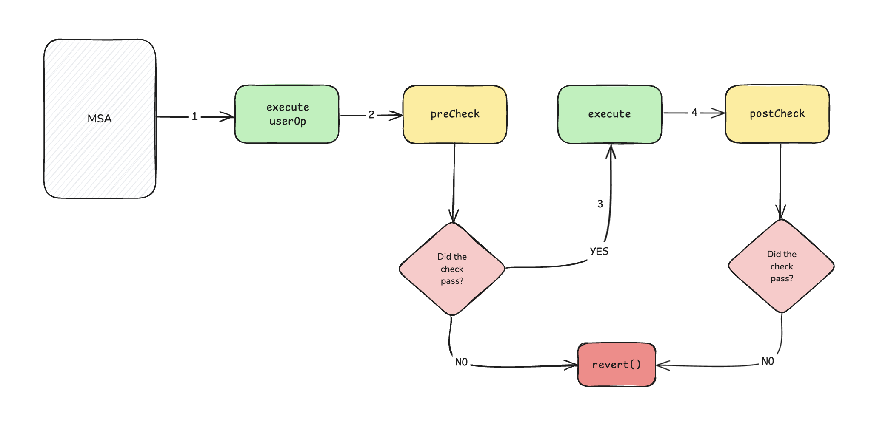
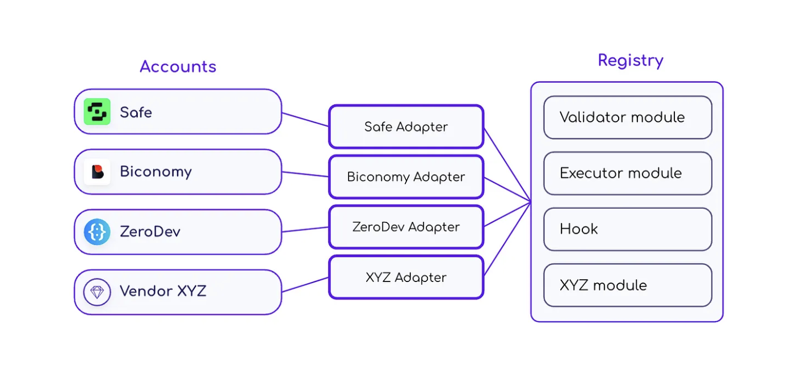

# ERC-7579: Minimal Modular Smart Accounts

**Author:** [Roman Yarlykov](https://github.com/rlkvrv) 🧐

ERC-7579 is an Ethereum standard that describes modular abstract accounts (Modular Smart Contract Account — MSA). It extends the functionality of [ERC-4337](https://eips.ethereum.org/EIPS/eip-4337) (Account Abstraction), allowing additional logic and validations to be offloaded into separate external modules.

## Prerequisites

With the emergence of ERC-4337, many developers were inspired by the new possibilities and started creating smart accounts with a wide range of functionalities. Leading this race were major companies such as [Alchemy](https://www.alchemy.com/account-kit), [Safe](https://safe.global/), [Biconomy](https://www.biconomy.io/smart-accounts), [ZeroDev](https://zerodev.app/), [OKX](https://www.okx.com/web3/hot/aawallet), and others. The result was bulky monolithic structures built in a "do whatever you can" manner, which were difficult to maintain, audit, and upgrade. Moreover, only developers could create different feature combinations in these accounts, limiting their flexibility. This led to the idea of offloading logic into external modules, which in turn sparked the emergence of numerous solutions.

The community sought to standardize the process of creating and using modules so that anyone could develop and apply them across different accounts. This approach involves a basic smart account implementation that can be customized using modules. With a user-friendly interface, users could manage settings themselves via a UI, installing modules just like apps on a smartphone.  

Alchemy proposed the [ERC-6900](https://eips.ethereum.org/EIPS/eip-6900) standard, based on the [Diamond](https://eips.ethereum.org/EIPS/eip-2535) pattern. This approach involved calling the appropriate modules (plugins) based on the function selector to perform validations.  

However, the standard turned out to be controversial. First, it was primarily designed for Alchemy's smart accounts. Second, its strict requirements dictated implementation rules for both accounts and modules. Third, attempts to integrate it revealed architectural limitations that added extra complexity.  

The community quickly [became disillusioned](https://docs.zerodev.app/blog/why-7579-over-6900) with ERC-6900. Additionally, Alchemy was not very open to modifications, so the rest of the ecosystem joined forces and introduced the [ERC-7579: Minimal Modular Smart Accounts](https://eips.ethereum.org/EIPS/eip-7579) standard. The new standard took into account the interests of all participants by offering minimal interfaces to ensure module compatibility with different accounts. This provided universality and the freedom to choose wallet architectures—exactly what the community had been striving for from the start.  

In this article, I will occasionally refer to ERC-6900. If you're unfamiliar with this standard, it won't be a problem, but for a complete picture, it would be good to read up on it. A review article on ERC-6900 is also available in the wiki.

## MSA

Modular accounts are smart accounts that users can easily and securely extend, unlike "static" accounts, which can only be modified by the developer and require redeployment. This approach allows users to dynamically add, remove, or modify the functionality of their account.

  
*Adding and Removing Modules in MSA*

The main idea of ERC-7579 is to provide minimal interfaces and rules for implementing modular accounts. This gives developers greater freedom in choosing the architecture while ensuring module compatibility across different accounts.  

To comply with the standard, an account must implement three interfaces: **IExecution**, **IAccountConfig**, and **IModuleConfig**. In the reference implementation, these interfaces are combined into one — [IERC7579Account](https://github.com/erc7579/erc7579-implementation/blob/main/src/interfaces/IERC7579Account.sol).

*Note:* For the rest of the functionality, you can also refer to [Reference Implementation](https://github.com/erc7579/erc7579-implementation), but it's important to understand that this is not a reference implementation—such an implementation simply does not exist.  

Let's briefly go over the key functions.  

### Module Installation and Management Functions  

To install a module, at a minimum, its type and address are required. In this architecture, a module is a separate external smart contract that must be deployed in advance. A single module can be used by multiple smart accounts, and its main purpose is to provide the necessary callback functions for the account.  

To allow a smart account to install and remove modules, the following functions are used:  

```solidity
function installModule(
    uint256 moduleTypeId,
    address module,
    bytes calldata initData
) external;

function uninstallModule(
    uint256 moduleTypeId,
    address module,
    bytes calldata deInitData
) external;
```

The module type (`moduleTypeId`) will be discussed later in the relevant section.  

*Note:* When installing or removing a module, arbitrary data can be passed for its configuration.  

The following `view` functions are provided to manage installed modules:  

```solidity
function isModuleInstalled(
    uint256 moduleTypeId,
    address module,
    bytes calldata additionalContext
) external view returns (bool);

function accountId() external view returns (string memory accountImplementationId);

function supportsExecutionMode(bytes32 encodedMode) external view returns (bool);

function supportsModule(uint256 moduleTypeId) external view returns (bool);
```

Special attention should be given to the `accountId` and `supportsExecutionMode` functions.  

- **`accountId`** returns a unique account identifier in the format `vendorname.accountname.semver`. This helps identify smart accounts on the frontend.  

- **`supportsExecutionMode`** indicates whether the account supports a specific execution mode (`mode`). This brings us to one of the most important aspects of a smart account, as it determines its behavior when executing different logic.  

### Functions Responsible for Logic Execution  

It is proposed to implement only two main functions (hello, ERC-6900👋): `execute` and `executeFromExecutor`.  

```solidity
interface IExecution {
    function execute(
        bytes32 mode,
        bytes calldata executionCalldata
    ) external;

    function executeFromExecutor(
        bytes32 mode,
        bytes calldata executionCalldata
    ) external returns (bytes[] memory returnData);
}
```

- **`execute`** — a universal function for calls on MSA.  
- **`executeFromExecutor`** — a specialized function designed for a specific type of modules (more on this later).  

#### What is `mode`?  

`mode` is a 32-byte value whose structure includes the following components:  

- **callType** (1 byte): defines the call method:  
  - `0x00` — single call;  
  - `0x01` — batch call;  
  - `0xfe` — `staticcall`;  
  - `0xff` — `delegatecall`.  

- **execType** (1 byte): specifies how to handle errors:  
  - `0x00` — execution stops with `revert()`;  
  - `0x01` — error handling without using `revert()`.  

- **unused** (4 bytes): reserved for future improvements.  
- **modeSelector** (4 bytes): an additional selector for implementing non-standard behavior.  
- **modePayload** (22 bytes): a payload for passing extra data.  

  
*Execution Mode Structure and Encoded Data*

Instead of creating separate functions for each combination of execution types, the standard developers encoded execution parameters into a single `bytes32` value. This approach makes the system flexible and extensible, simplifying maintenance and code auditing. Basic account implementations can focus only on the relevant `callType` byte while ignoring the rest.  

The `callType` parameter determines how the `executionCalldata` parameter of the `execute` function should be decoded. This could be a single call, a batch call, or a `delegatecall`. The `callType` can also be used by the validation module to determine how to decode `userOp.callData[36:]`.  

The default behavior (`execType = 0x00`) is to halt execution if any operation fails. If one operation in a batch fails, the entire batch is reverted.  

**ModeSelector** is an "optional" mode selector that can be used by account providers to implement custom behavior. ModeSelector is calculated as `bytes4(keccak256("vendorname.featurename"))` to prevent conflicts between different providers, allowing new features to be introduced without coordination between accounts implementing ERC-7579.  

**ModePayload** is a payload for the mode, used to pass additional data during smart account execution. Its interpretation depends on the **ModeSelector**. For example, it could contain an address and a couple of additional one-byte flags.  

## Modules  

As mentioned earlier, modules are standalone smart contracts that offload the core logic of a smart account. This allows accounts to function like building blocks, making them easy and quick to customize.  

Modules are divided into four main categories:  
- **Validation** (type id: 1)  
- **Execution** (type id: 2)  
- **Fallback** (type id: 3)  
- **Hooks** (type id: 4)

The standard **allows** the creation of custom types, but the ones mentioned above are the core types. More types may be added in the future, and new types can be introduced even without modifying the standard. An account is not required to support all four types, and a single module can combine multiple types—though I haven't come across such examples.  

*Important!* Combining multiple types can be risky because it merges the states of two different modules. In theory, they might have different installation/removal processes and configuration changes.  

To create a module, the `IModule` interface is used, which includes three functions:  

```solidity
interface IModule {
    function onInstall(bytes calldata data) external;
    function onUninstall(bytes calldata data) external;
    function isModuleType(uint256 moduleTypeId) external view returns (bool);
}
```

- The `data` parameter transmits the necessary information for installing or removing a module.  
- The `isModuleType` function checks whether a module belongs to a specific type.  

In addition to standard functions, modules often include extra functions for displaying metadata:  

```solidity
function name() external pure returns (string memory);
function version() external pure returns (string memory);
```

This minimal set of functions is sufficient to implement **Execution** and **Fallback** modules.  

### Validation  

**Validation** modules are responsible for verifying `userOp` operations. In the transaction execution flow, these modules must always come first. This is a key component, without [ERC-1271](https://eips.ethereum.org/EIPS/eip-1271).

  
*Example of Validator Modules in Action*

There is a key detail when working with validators. The ERC-7579 standard does not specify how a validator should be selected during the `userOp` verification process. Most modern implementations of modular smart accounts follow an approach where the validator's address is passed in the `userOp.nonce` or `userOp.signature` fields. The standard also requires that the transmitted data be serialized before calling the validator.  

#### Validator Interface  

To create a validator, the `IValidator` interface is used, which inherits from `IModule`.  

```solidity
interface IValidator is IModule {
    function validateUserOp(
        PackedUserOperation calldata userOp,
        bytes32 userOpHash
    ) external returns (uint256);

    function isValidSignatureWithSender(
        address sender,
        bytes32 hash,
        bytes calldata signature
    ) external view returns (bytes4);
}
```

- **`validateUserOp`** — responsible for the standard `userOp` verification process within ERC-4337.  
- **`isValidSignatureWithSender`** — required to support signature verification according to [ERC-1271](https://eips.ethereum.org/EIPS/eip-1271).  

#### Multiplexers  

Since validator data is often passed in the `userOp` field, typically, only a single validator address is specified for simplicity. But what if an account needs multiple validators (e.g., for multisig, social recovery, or session keys)?  

In such cases, a single main validator is used as an entry point, through which additional validators are added. For example, a module [MultiFactor](https://github.com/rhinestonewtf/core-modules/blob/main/src/MultiFactor/MultiFactor.sol) allows connecting sub-validator modules, enabling multi-factor authentication. If four validator modules are installed and the confirmation threshold is set to 2, successful verification requires passing validation in any two modules.  

Such validators (similar to MultiFactor) are called multiplexers.  

> **Multiplexer (electronics)** — a device that selects between multiple analog or digital input signals and directs the chosen input signal to a single output line.  

  
*Example of a Multiplexer in Action*

Multiplexers are used not only with validators, but more on that later.  

### Execution  

Execution modules are external strategies for performing specific actions through a smart account on third-party smart contracts. These modules use the account function `executeFromExecutor`.  

The execution process works as follows:  
1. The `EntryPoint` smart contract calls the account using the standard `execute` function.  
2. The account calls the Executor smart contract, which performs the necessary checks or additional actions.  
3. The Executor then calls the account's `executeFromExecutor` function, which, in turn, interacts with an external smart contract.  

  
*Example of an Execution Module in Action*

A real-world example: the [ScheduledOrders](https://github.com/rhinestonewtf/core-modules/blob/main/src/ScheduledOrders/ScheduledOrders.sol), module, which executes delayed orders on Uniswap. Execution modules ensure the secure execution of calls to external smart contracts on behalf of a smart account, including pre-processing. Another example is executing flash loans using the [FlashloanCallback](https://github.com/rhinestonewtf/core-modules/blob/main/src/Flashloan/FlashloanCallback.sol) module.  

To create an execution module, simply implement the `IModule` interface.  

### Fallback Handlers  

The standard allows extending a smart account’s functionality without upgrading it by using fallback handlers. These modules enable the addition of new function selectors and their processing via external modules.  

The standard itself describes the functionality of these modules best—I don’t have much to add here.  

If a smart account has a fallback handler installed, it:  
- **MUST** use `call` or `staticcall` to invoke the fallback handler.  
- **MUST** follow the [ERC-2771](https://eips.ethereum.org/EIPS/eip-2771) standard to append the original `msg.sender` to the `calldata` sent to the fallback handler.  
- **MUST** route calls to the fallback handler based on the function selector in `calldata`.  
- **MAY** implement access control, which **MUST** be enforced through hooks.  

If an account adds functions via fallback, it is treated as if those functions were implemented natively. For example, support for [ERC-165](https://eips.ethereum.org/EIPS/eip-165) can be implemented using fallback.  

- **RECOMMENDED** to use fallback for functions with the `view` modifier if it enhances extensibility.  
- **NOT RECOMMENDED** to implement core account logic through fallback.  

An example fallback implementation can be found in the [Kernel smart account](https://github.com/zerodevapp/kernel/blob/737db3123165d6009c9261dc98e149a3fdd82f97/src/Kernel.sol#L178C1-L178C34).  

To create a fallback module, simply implement the `IModule` interface.  

### Hooks  

Hooks are necessary for handling the transaction execution flow. Unlike validator modules, which are activated during the `userOp` validation stage, hooks are triggered right before the execution of the `execute` function.  

  
*Example of a Hook in Action*

To write a hook, you need the `IHook` interface in addition to the `IModule` interface. This interface implements two main functions for working with modules: `preCheck` and `postCheck`.  

```solidity
interface IHook is IModule {
   function preCheck(
       address msgSender,
       uint256 value,
       bytes calldata msgData
   ) external returns (bytes memory hookData);

   function postCheck(bytes calldata hookData) external;
}
```

When I was exploring ERC-6900, I wrote a [hook](https://github.com/fullstack-development/blockchain-wiki/blob/60678946a89f9c61a7368aa08e55c2a278100616/EIPs/erc-7579/contracts/src/TokenWhitelist.sol) to verify ERC-20 token transfers—it was essentially a whitelist. For ERC-7579, I decided to adapt this module to follow its rules.  

Overall, the logic remained similar: there are still two functions for the hook, and the module also requires installation and uninstallation functions, which are identical to those in ERC-6900.  

```solidity
function onInstall(bytes calldata data) external {
 // logic for installing the plugin on MSA  
}

function onUninstall(bytes calldata data) external {
    // logic for removing the plugin from MSA  
}
```
How the installation process looks "from the outside" can be seen in [тестах](./contracts/test/unit/TokenWhitelist.t.sol):
```solidity
    address[] memory tokens = new address[](1);
    tokens[0] = address(token1);
    bytes memory twPluginInstallData = abi.encode(tokens);

   // The call must go through EntryPoint and userOp  
   // because the plugin interacts with msg.sender  
    instance.installModule({
        moduleTypeId: MODULE_TYPE_HOOK,
        module: address(tokenWhitelistModule),
        data: twPluginInstallData
    });
```

The `isModuleType` function has been added; in this case, the module has a single type — `TYPE_HOOK`:  

```solidity
function isModuleType(uint256 moduleTypeId) external view returns (bool) {
    return moduleTypeId == TYPE_HOOK;
}
```

You can also add the `isInitialized` function, though the standard does not require it. However, based on module examples, it seems to be a good practice.  
As for the module's custom logic, in this case, only one function is needed: `updateTokens`.  

```solidity
function updateTokens(address[] memory tokensToAdd, address[] memory tokensToRemove) external {
   // logic for updating the whitelist of allowed tokens  
}
```

Even without this function, the plugin will still work, but the whitelist can only be set once during installation.  

If you have experience working with ERC-6900 modules, you’ll notice how much simpler the module setup looks—no need for a manifest, no need to figure out how the plugin will interact with other plugins, or which selectors need to be added where.  

However, there are some nuances. As with validators, MSA implementations typically allow installing only one plugin (though there are exceptions, like Kernel). This means that if you need multiple plugins, a multiplexer may also be required. I wrote [integration tests](./contracts/test/integration/TokenWhitelist.t.sol) using the `HookMultiPlexer` module, where you can see how this works.  

*Important!* When a multiplexer sits between the account and the hook module, it means that the `preCheck` function of the hook will be called not from the account, but from the multiplexer. To ensure modules function correctly, the module must be able to add the multiplexer as a `TrustedForwarder`. Be sure to test support for this feature.  

## Development and Testing  

The development and testing process for such plugins requires special attention. For testing, you’ll need appropriate tools to simulate the infrastructure required for abstract accounts. Additional tools will also be needed to integrate MSA into your product.  

Currently, the leading company in developing such tools, as well as in promoting ERC-7579 in general, is [Rhinestone](https://github.com/rhinestonewtf). They have created [ModuleSDK](https://github.com/rhinestonewtf/module-sdk) and [ModuleKit](https://github.com/rhinestonewtf/module-sdk). The latter was especially helpful in testing the plugin.  

*Important!* To run a project with [TokenWhitelist](./contracts/src/TokenWhitelist.sol), you'll need `pnpm`, as this package manager is used in ModuleKit.  

Another key point is that MSA implementations can vary significantly. ModuleKit allows you to test your module with multiple implementations—it supports MSA from Safe, Kernel, Nexus, and also includes a custom implementation that covers all possible module variations. In the future, more MSA implementations may be added.  

At the same time, ModuleKit is quite flexible. In the [test file](./contracts/test/unit/TokenWhitelist.t.sol), you can see that it was fairly easy to reuse basic tests across different MSA implementations. Working with `userOp` is also straightforward.  

## Module Registry  

The core idea of the modular account standard is to allow any developer to create modules. However, for accounts to use these modules, they must be confident in their security. This led to the proposal of [ERC-7484: Registry Extension for ERC-7579](https://eips.ethereum.org/EIPS/eip-7484).  

The goal of ERC-7484 is to standardize how smart accounts retrieve security data about their modules through an attestation registry. More specifically, this ERC aims to define a precise method for smart accounts to interact with registries, as well as the necessary functionality and interfaces for registries to ensure maximum interoperability.  

For MSAs that do not natively support registries, adapters can be developed.  

  
*Source: Introducing: ERC-7484*  

According to the standard, the module registry should be a singleton to make integration easier for all accounts. This is not a strict requirement—developers can use their own registry, but this may cause compatibility issues with other modules attested in the widely accepted registry.  

For an account to interact with a registry, it needs either an adapter or a registry hook module.  

For example, a verification process could look like this:  

```solidity
    IERC7484(registry[account]).checkForAccount({
        smartAccount: account,
        module: msgSender,
        moduleType: MODULE_TYPE_EXECUTOR
    });
```

Thus, during critical actions involving a module (installation, removal, parameter changes, and sometimes even call validation), an MSA should verify the module through the registry.  

*Important!* A module can not only be added to the registry but also removed from it if a vulnerability is discovered. This immediately secures all MSAs that have installed it. On the other hand, until a vulnerable module is removed, all MSAs using it remain exposed to the same vulnerability.  

### How to Register a Module?  

Currently, the [documentation](https://docs.rhinestone.wtf/module-registry) lists two auditing firms—[Ackee Blockchain Security](https://ackee.xyz/) and [Spearbit](https://spearbit.com/)—that assess module security and certify them in the unified registry.  

In the testnet, you can use a [mock contract](https://docs.rhinestone.wtf/module-registry/usage/mock-attestation) to register a module and issue an attestation.  

It’s important to note that an attestation can be both issued and later revoked. This is both a strength and a weakness of the proposal. It’s a strength because, in the event of an exploit, revoking an attestation can immediately protect all affected accounts. However, it’s a weakness because this process might not happen instantly, and in the meantime, many accounts could suffer from an attacker’s actions.  

Rhinestone, together with Biconomy, has also announced a [module store](https://www.biconomy.io/post/biconomy-and-rhinestone-team-up-to-launch-the-first-module-store-for-account-abstraction) for AA. I believe they will continue to develop this direction along with the registry and everything related to ERC-7579-compatible module development.  

## Conclusion  

As mentioned earlier, there are currently two standards for modular smart accounts: ERC-6900 and ERC-7579. The latter is a refined version of the former, addressing all—or at least most—architectural flaws. However, let’s not forget that both standards were developed by major companies that, in any case, aimed to find compromises and adapt the standard to existing smart account solutions. So, draw your own conclusions.  

That being said, despite the higher entry barrier, ERC-7579 appears to be a much more flexible solution. Time will tell which approach gains wider adoption. Personally, I hope that in the future, the concept of abstract accounts will be reconsidered. There are already several proposals for introducing new opcodes in the EVM to change how accounts operate. Perhaps this will eventually eliminate the need for the complex workarounds that abstract accounts currently rely on.  

## Links

- [ERC-7579: Minimal Modular Smart Accounts](https://eips.ethereum.org/EIPS/eip-7579)
- [ERC-7484: Registry Extension for ERC-7579](https://eips.ethereum.org/EIPS/eip-7484)
- [Docs: Rhinestone ModuleKit](https://docs.rhinestone.wtf/modulekit)
- [Article: Introducing: ERC-7484](https://blog.rhinestone.wtf/introducing-erc-7484-1d4d5c7e6dc1)
