# Algorithms and Data Structures

**Author:** [Pavel Naydanov](https://github.com/PavelNaydanov) 🕵️‍♂️

> This article is based on the book "Grokking Algorithms" by Aditya Bhargava.

Code examples from the book can be found in this [repository](https://github.com/egonSchiele/grokking_algorithms/tree/master/02_selection_sort).

_Definition:_ An **algorithm** is a set of instructions for performing a specific task.

_Definition:_ **Recursion** is the process of a function calling itself. In each recursive function, two cases must be handled: the base case and the recursive case. The base case signifies the termination of the recursive call.

## Array vs. Linked List

_Definition:_ An array and a linked list are data structures used to store a collection of values (elements) that can be identified by an index. The main difference lies in how data is stored in memory.

**Important!** Arrays store data sequentially. Each memory cell follows the next one. This allows for easy retrieval of the value of any array element because we know the order in which elements are stored.

**Important!** In a linked list, data can be stored anywhere in memory, but each element holds a reference to the next element. This is useful for reading data sequentially, as well as for inserting or deleting arbitrary elements.

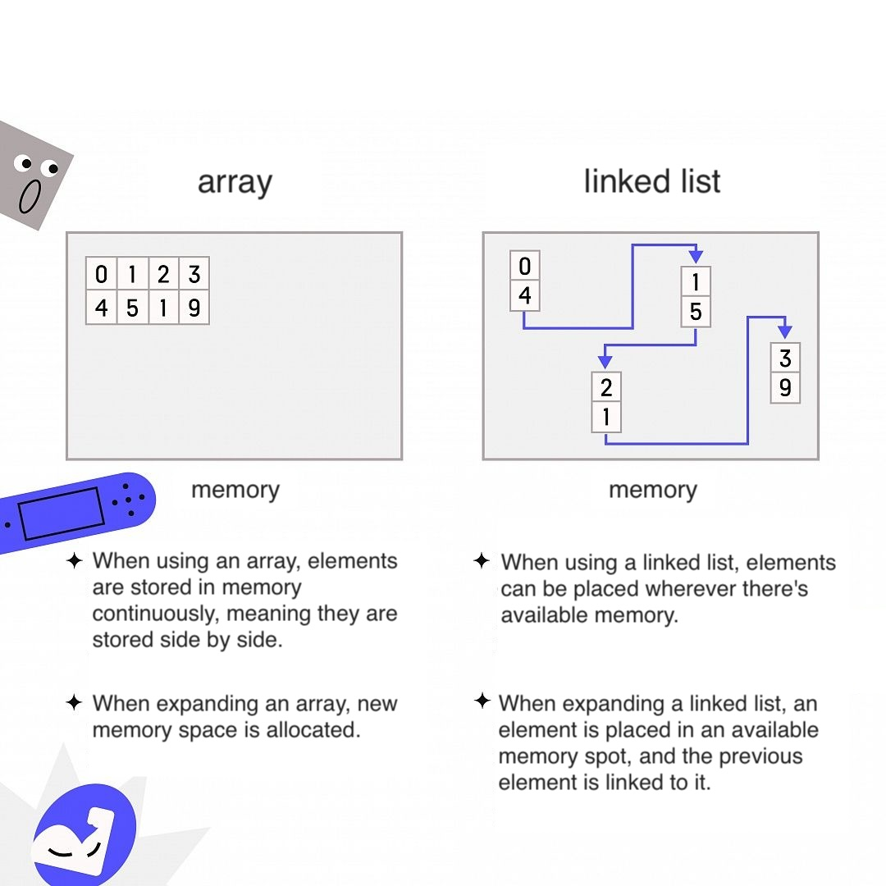

## Hash Table

_Definition:_ A **hash table** is a data structure that organizes elements using special **hash functions**.

_Definition:_ A **hash function** is a function that takes a string and returns a number. Here, a string refers to any data expressed as a sequence of bytes.

Requirements for a hash function:
1. It should be deterministic. For the same input, the function should return the same output.
2. Different inputs should yield different outputs.

An example based on the book involves storing the prices of goods in memory using a hash function.

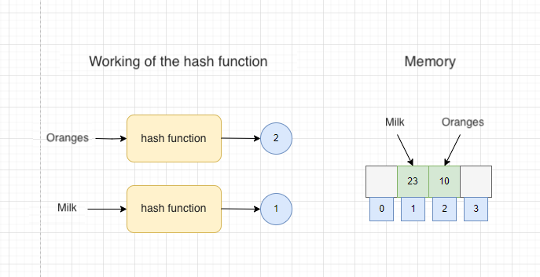

The diagram illustrates the process of storing the prices of "oranges" and "milk" in memory.
1. The hash function is called with the string "oranges," and it returns the value **2**. The price of "oranges" (23💲) is stored in the memory cell at index 2.
2. For "milk," the hash function returns **1**. The price of "milk" (10💲) is then recorded in the memory cell at index 1.
3. Now, if we need to quickly determine the price of a product, we invoke the hash function, find the memory cell where the price is stored, and retrieve the price directly from memory. The complexity of this operation is O(1).

**Important!** Together, the *hash function* and the *array* form a **hash table**! Hash tables are known by other names: associative arrays, dictionaries, mappings, hash maps, and more. A **hash table** consists of keys and values (key => value). In Solidity, the **mapping** function represents a hash table.

**Hash tables** are well-suited for various tasks, including:
1. Modeling relationships between objects
2. Eliminating or tracking duplicates
3. Caching or storing data

It may seem that a hash function always returns a unique index in the array. However, in practice, it's nearly impossible to implement such a hash function. When a hash function returns the same number for two strings, it's called a **collision**.

An example of a collision is shown in the diagram below, where both "Andreev Ivan" and "Alexeev Ivan" contend for a spot in cell 002.

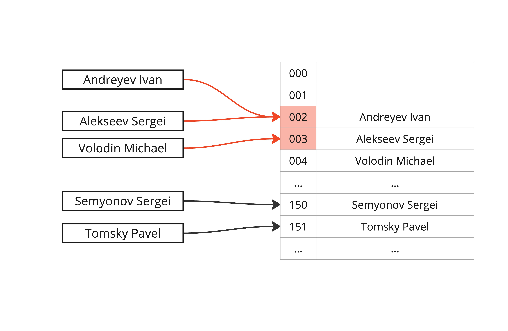

**Collisions** can be resolved in various ways. The simplest approach is to implement a linked list for the two strings that should be stored in the same array cell. A more complex method involves increasing the size of the hash table.

**Important!** A hash function should minimize the number of collisions to make it more efficient.

# Stack

_Definition:_ A **stack** is a "last-in, first-out" (LIFO) data structure. The last item added is the first one to be removed.

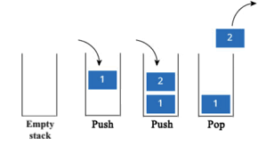

You can find the Solidity code implementation of a stack [here](./src/libraries/Stack.sol).

## Queue

_Definition:_ A **queue** is a "first-in, first-out" (FIFO) data structure. The first item added is the first one to be removed.

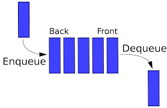

You can find the Solidity code implementation of a queue [here](./src/libraries/Queue.sol).

## Runtime Complexity

_Definition:_ Runtime complexity measures the rate of growth of the number of operations an algorithm performs. It is described using "Big O" notation, which indicates the number of operations.

Types of runtime complexity:
1. **O(n)** or linear. Example: simple linear search.
2. **O(log n)** or logarithmic. Example: binary search.
3. **O(n * log n)**. Example: efficient sorting algorithms (quicksort).
4. **O(n^2)**. Example: slow sorting algorithms (selection sort).
5. **O(n!)**. Example: very slow algorithms (traveling salesman problem).

## Binary Search

_Definition:_ Binary search is an algorithm that takes a sorted list of elements and a target element as input. It returns the position of the element in the list if found, otherwise, it returns null. The algorithm repeatedly divides the list in half and checks which half the target element is in. The unnecessary half is discarded until the element is found.

A typical example is searching for a phone number in a phone book.

**Important!** Binary search has a logarithmic runtime complexity, working in **log2n** steps. It only works if the list is sorted.

You can find the Solidity code implementation of binary search [here](./src/BinarySearch.sol).

## Selection Sort

_Idea:_ Selection sort involves finding the minimum or maximum value in the unsorted portion of an array and swapping it with the last or first element, respectively.

**Important!** In Solidity, we add the found maximum or minimum value to a new sorted array.

You can find the Solidity code implementation of selection sort [here](./src/SelectionSort.sol).

## Quicksort

Quicksort, also known as **Hoare's sort**, is based on the "divide and conquer" approach.

**Important!** The "divide and conquer" strategy involves breaking down a problem into smaller fragments. For lists, the base case is usually an empty list or a list with one element.

_Idea:_ In an array, a **pivot element a[i]** is selected. The array is divided into two parts: values less than or equal to the pivot go to the left, and values greater than the pivot go to the right. Now, the array consists of two subsets. For both subsets, the process of selecting a **pivot element** and dividing the subset into two parts is repeated recursively until each subset contains fewer than two elements. In the end, a fully sorted array is obtained.

**Important!** The speed of the quicksort algorithm depends on the choice of the pivot element. Therefore, it has the concept of best (O(log n)) and worst-case (O(n)) scenarios.

The implementation of quicksort for Solidity will be similar to that for C-like languages. Due to the memory handling specifics, the original array is not split into subsets. Instead, a variant of simultaneously traversing the array from both ends and swapping elements as needed is implemented.

You can find the Solidity code implementation of quicksort [here](./src/QuickSort.sol).

# Graphs

_Definition:_ A **graph** is a geometric figure consisting of points and lines connecting them. Such a figure models a set of connections between objects.

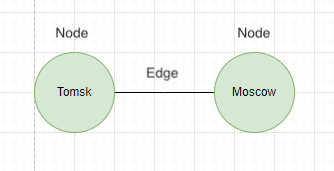

Every graph consists of **nodes** and **edges**. Nodes that share edges are called **neighbors**.

Graphs can be:
1. **Directed**: Relationships only act in one direction, indicated by arrows.
2. **Undirected**: Relationships act in both directions, without arrows.

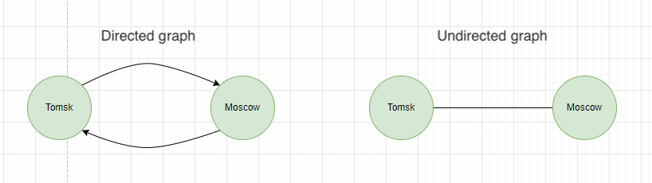

**Important!** A graph with no edges pointing backward is called a **tree**.

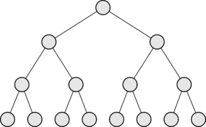

## Breadth-First Search

_Definition:_ Breadth-First Search allows finding the shortest distance between two objects. Shortest distance can mean various things: the shortest path to victory in checkers, spell-checking (shortest distance is the minimum number of changes), finding the nearest doctor, etc.

Breadth-First Search can answer two questions:
1. Does a path exist from point A to point B?
2. What does the shortest path from node A to node B look like?

_Idea:_ The algorithm systematically explores all possible path options, gradually deepening the list. For example, when searching for someone to go to the movies with on social media, you first ask your friends. If they all decline, you go deeper and ask your friends' friends, and so on. This continues until you find someone willing to go to the movies with you.

Breadth-First Search actively uses the concept of a **queue**. You cannot access arbitrary elements in a queue; you can only add an element to it or remove an element from it. Returning to the algorithm's idea, the implementation with a queue looks like this:

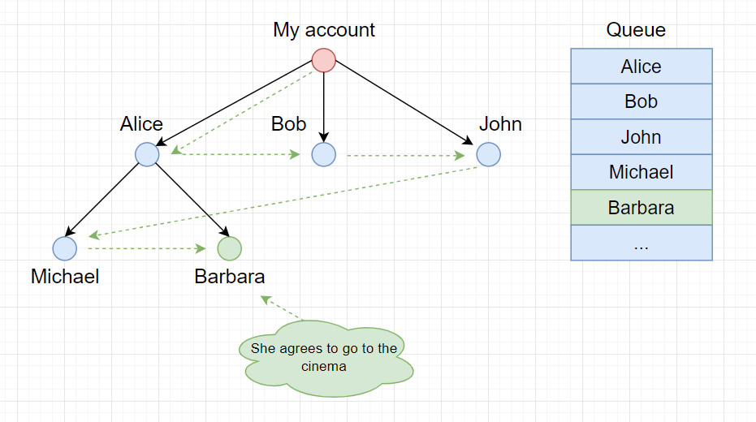
1. Open your list of friends (in the diagram, "*my account*"). Add your friends to the queue: Alice, Bob, John.
2. Check the first friend: Alice. If she agrees, the search is over. If not, add her friends to the end of your list.
3. Check the second friend: Bob. Check the third friend: John.
4. Repeat until you find a movie partner or run out of people in your social network. In our case, Barbara agrees to go to the movies.

**Important!** The algorithm's runtime is calculated as O(V + E), where V is the number of vertices, and E is the number of edges.

You can find the Solidity code implementation of Breadth-First Search [here](./src/BreadthFirstSearch.sol).

For testing, we used the following graph. Node identifiers are in parentheses.
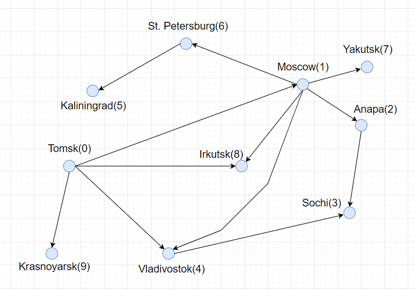

## Dijkstra's Algorithm

_Definition:_ Dijkstra's algorithm is used to find the shortest path from one node in a graph to all other nodes.

_Idea:_ The algorithm iteratively examines the nodes of the graph, recording the shortest path in memory. When it finds a shorter path to a node, it updates the information and continues searching.

**Important!** For each edge, a **weight** is introduced. Weights can be negative. Such a graph is called **weighted**.

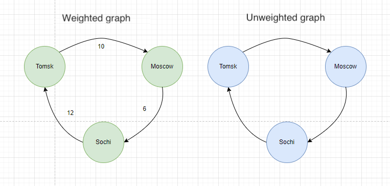

Dijkstra's Algorithm:
1. Find the node with the lowest cost (i.e., the node that can be reached in the shortest time).
2. Check if there's a cheaper path to the neighbors of this node and update their cost if necessary.
3. Repeat until this is done for all nodes in the graph.
4. Calculate the final path.

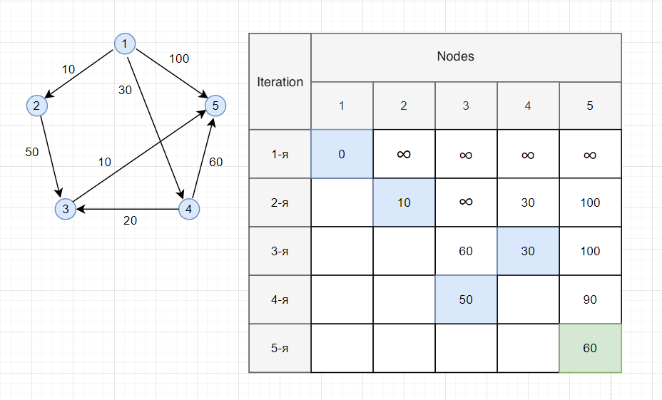

To calculate the shortest path to any point in an unweighted graph, use the **breadth-first search** algorithm. For a weighted graph, use **Dijkstra's algorithm**. In general, Dijkstra's algorithm only works with directed acyclic graphs, often abbreviated as DAGs (Directed Acyclic Graphs).

**Important!** Dijkstra's algorithm does not support graphs with negative weights. For such cases, you can use the [Bellman-Ford algorithm](https://www.geeksforgeeks.org/bellman-ford-algorithm-simple-implementation/).

You can find the Solidity code implementation of Dijkstra's algorithm [here](./src/Dijkstra.sol).

## Greedy Algorithms

> The case when greed is not a vice! 💰

_Definition!_ A greedy algorithm is an algorithm that makes the locally optimal choice at each step in the hope that the overall solution will be optimal.

_Important!_ The Dijkstra's algorithm (finding the shortest path in a graph) also falls under greedy algorithms.

Problems suitable for greedy algorithms:
1. **Scheduling Problem**: For instance, you have a class schedule with overlapping lessons. It's impossible to conduct all lessons because they clash in time. **Solution:** Choose the lesson that ends first, then find the next lesson that starts immediately after the previous one, and so on.
2. **Coin Change Problem**: You have a set of coins with different denominations, and you need to make change for a given amount with the fewest number of coins. **Solution:** Use as many coins with the highest denomination as possible, then move to the lower denomination coins, and so on.
3. **Knapsack Problem**: A thief with a limited capacity knapsack wants to steal the most valuable items from a store. **Solution:** Choose the most valuable item and place it in the knapsack. Continue until the knapsack is full.
4. **Set Cover Problem**: Suppose you need to select the minimum number of radio stations to cover the maximum number of areas. **Solution:** Choose the station with the most extensive coverage. If it covers some areas already covered, it's fine. Repeat until all areas are covered.
5. **Traveling Salesman Problem**: A traveling salesman needs to visit five different cities. The salesman must find the shortest path that includes all cities. **Solution:** Iterate through all possible paths and select the one with the shortest distance.

_Important!_ Greedy algorithms are not always efficient, and their application should be considered carefully. For example, in the knapsack problem, it's possible that the first item selected occupies the entire knapsack's capacity. However, it might be more profitable to choose smaller-sized items in greater quantities. In such cases, the algorithm would need to consider not only the item's value but also its size.

_Interesting!_ Such algorithms are also known as **approximation algorithms**. When finding the exact solution is too time-consuming, an approximation algorithm is applied.

The traveling salesman problem significantly increases algorithm execution time based on the number of cities, as its complexity grows factorially. For 10 cities, you would need to evaluate 3,628,800 possibilities. Such problems are called NP-hard (non-deterministic polynomial - "non-deterministic polynomial time") problems. Recognizing this and transitioning from seeking an ideal solution to using an approximation algorithm is crucial.

Characteristics of NP-hard problems:
1. The algorithm works quickly with a small number of elements but significantly slows down as the number of elements increases.
2. If you need to evaluate all "combinations x," it's one of the most characteristic signs.
3. If there's a sequence in the problem (e.g., a city sequence), and the problem doesn't have a straightforward solution.
4. If there's a set involved in the problem (e.g., a set of radio stations), and the problem doesn't have a straightforward solution.

## Conclusion

Algorithms are great! However, keep in mind that performing a large number of operations in Solidity can consume a considerable amount of gas, leading to high transaction fees. Also, consider the gas limit constraint in a block. While blocks are somewhat flexible and can expand, there are limits. Learn more about it [here](https://ethereum.org/en/developers/docs/gas/#block-size). Therefore, it's essential to try to perform extensive algorithmic operations off-chain and use the blockchain for data storage or confirming algorithm results. But that's a different story. 🔦
