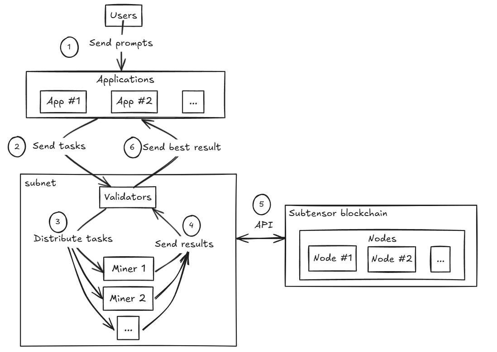
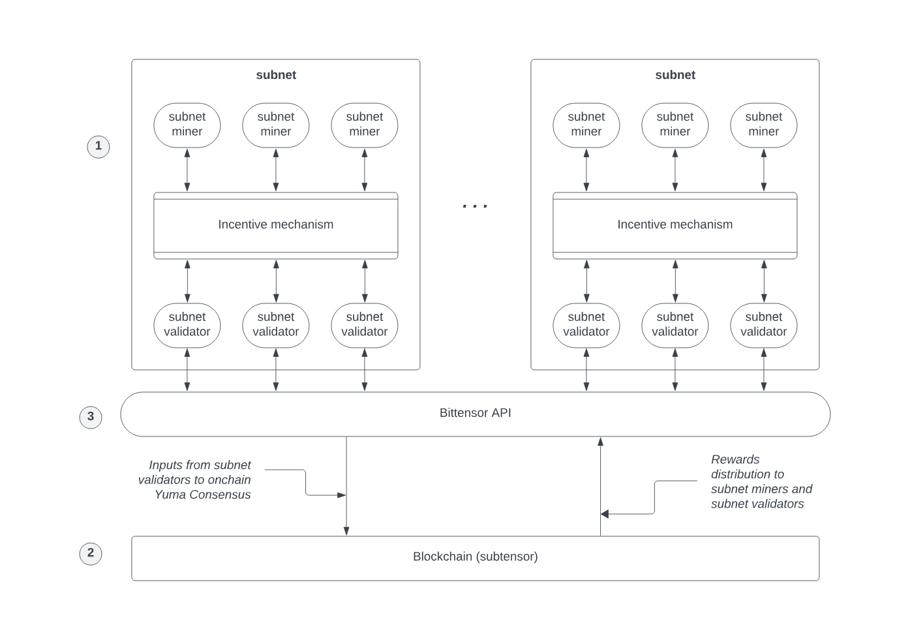
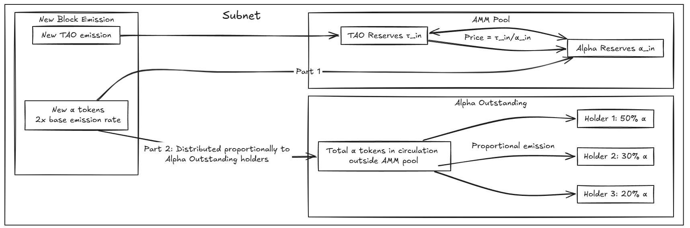

# Bittensor

**Author:** [Aleksei Kutsenko](https://github.com/bimkon144) 👨‍💻

[Bittensor](https://bittensor.com/) is a decentralized blockchain protocol designed for distributed exchange of computational power and intellectual resources. Its goal is to create an open and self-regulating ecosystem where participants can develop, train, and evaluate neural network models, earning rewards for their contributions.

The system is built using the [Substrate](https://polkadot-blockchain-academy.github.io/pba-book/substrate/intro/page.html) framework, developed by the creators of [Polkadot](https://polkadot.com/). 

Why Substrate instead of Ethereum? The choice of Substrate for Bittensor is based on several key advantages:
 1) **Specialization** — the ability to create a fully customized blockchain for AI computations, rather than being limited by smart contract constraints;
 2) **Scalability** — handling a large number of transactions between miners and validators without high fees;
 3) **Modularity** — using ready-made components for rapid development;
 4) **Economic efficiency** — predictable transaction costs, which are critical for constant data exchange in an AI network;
 5) **Autonomy** — full control over protocol development without relying on third-party blockchain decisions.

> **Parachain** in the Polkadot ecosystem is a specialized blockchain that runs in parallel with the main Polkadot network (called the Relay Chain) and other parachains.

It's important to note that although Bittensor uses *Substrate* technologies, it operates as an independent blockchain and is not part of the Polkadot ecosystem as a *parachain*. This is a strategic decision by the Bittensor developers, allowing them to fully control their network and develop it according to their own vision, while still leveraging Substrate's powerful blockchain development tools.

The network’s main blockchain, **Subtensor**, operates on the [*Proof of Authority* (PoA)](https://coinmerce.io/en/learn/what-is-proof-of-authority/) consensus mechanism, where validation is carried out by trusted nodes under the control of the **Opentensor Foundation**.

A key feature of blockchain is its ability to coordinate participants without centralized control by using financial incentives. This enables the creation of self-regulating ecosystems where everyone acts in their own interest while simultaneously strengthening the network.

For example, in [Bitcoin](https://bitcoin.org/), the mining mechanism serves as an incentive to secure the blockchain: when the price of BTC rises, miner rewards increase, attracting new participants and boosting the network’s security.

Bittensor adapts this principle for the artificial intelligence and distributed computing market. Instead of a fixed incentive system, the network uses a flexible market model where each subnet ecosystem manages its own economy.

Previously, the network used a single mechanism for evaluating miner performance — [Yuma Consensus](https://docs.bittensor.com/yuma-consensus), which distributed TAO rewards based on the subjective evaluations of validators. However, this approach had elements of centralization: validators of the Root Subnet played a key role by controlling resource distribution.

In February 2024, Bittensor introduced [Dynamic TAO](https://docs.bittensor.com/dynamic-tao/) — a new economic model that eliminated centralized control and made the network more dynamic and resilient. It works alongside Yuma Consensus, which was modified in the process. Now, rewards depend not only on validators but also on staking dynamics and the market value of TAO tokens. This means that the more TAO is staked in a subnet and the higher its market value, the greater the rewards participants receive.

This approach turns the development of AI models and computational processes into a self-regulating and economically driven process. In this way, Bittensor is creating not just a decentralized market for digital resources, but a new infrastructure for collaborative work on complex computational tasks.

## 1. How does the protocol work overall?

1. Users send a request through applications.  
2. The application or validator forms the request.  
3. Validators distribute tasks to miners.  
4. Miners send the results of their work to validators for verification and evaluation.  
5. The validator evaluates the result based on the standards of the subnet and interacts with the main blockchain to record the result and determine reward distribution.  
6. Sends the best result back to the application.

## 2. Blockchain Architecture

At the core of Bittensor are the Subtensor blockchain, the system of subnets, and the Bittensor API.

Thus, the following roles can be identified in the operation of the protocol:

- **Miners** — Work on creating digital goods.  
- **Validators** — Evaluate the quality of miners' work.  
- **Subnet creators** — Manage the incentive mechanisms that define the tasks miners and validators must perform.  
- **Stakers** — TAO holders can support specific validators in each subnet. By delegating their tokens to a validator, they increase its stake and later receive a share of its income.

Let’s look at each highlighted module in the diagram.

### 2.1 Subtensor — the main blockchain of the network

In the architecture, the Subtensor blockchain functions as an immutable ledger, recording data about computational processes, transactions, and the performance results of network participants.

Functionality of the Bittensor (Subtensor) blockchain

The Bittensor economy is based on two types of tokens:
- **TAO** (τ) — the native token of the network, used for *staking* and gas fees  
- **Alpha tokens** (α) — tokens specific to each *subnet*, used to track participant contributions

Main functions of Subtensor:
- Acts as an immutable ledger, recording data about computational processes, participant outputs, and validator evaluations  
- Records balances and transactions of all network participants  
- Enables staking — users can delegate TAO to support specific validators in subnets  
- Supports TAO token transfers between addresses  
- Provides compatibility with the Ethereum Virtual Machine, opening the door for more complex applications such as liquid staking and TAO lending

It’s important to understand that the EVM blockchain does not allow interaction with subnets, meaning it cannot be used to request task execution.

### 2.2 Subnets

A subnet in Bittensor is a specialized platform for creating a specific type of digital product related to artificial intelligence. For example, one subnet may specialize in text generation, while another focuses on image processing.

**Subnet Structure**

Each subnet consists of the following components:

1. **Incentive Mechanism**:
   - Defines the tasks miners must perform and the quality standards applied to them  
   - Sets the rules for how validators evaluate miners' work and how rewards are distributed  
   - Regulates how miners and validators receive rewards  
   - Implemented as a codebase that defines the interfaces and rules of interaction between participants

2. **Participants**:
   - **Miners** — perform computational tasks  
   - **Validators** — verify and evaluate the results produced by miners  
   - **Subnet creators** — develop and maintain the subnet’s operational mechanisms  

3. **Workflow**:
   - Miners receive and complete tasks  
   - Validators independently evaluate the results  
   - A rating matrix is generated for each miner  
   - Based on these evaluations, rewards are distributed

### 2.3 Bittensor SDK

Bittensor provides a powerful set of tools for working with the network, enabling decentralized management of computational resources and the development of new subnets.

The key tool for integrating with the network is the Bittensor SDK, which:
- Enables miners and validators to interact within subnets  
- Provides access to the Subtensor blockchain for data transmission and asset management  
- Automates transaction processing and computation tracking  

This is an open ecosystem for developers, where Bittensor provides:
- Source repositories and tools for working with the network  
- Detailed documentation describing the API and economic mechanisms  
- Step-by-step guides and tutorials for miners, validators, and subnet creators  

These tools allow developers to create new subnets, integrate with Bittensor, and interact with the Subtensor blockchain, helping to grow a decentralized AI infrastructure.

---

Now that we’ve covered the overall network architecture, let’s look at how task processing works within subnets — from request creation to reward distribution.

## 3. Technologies

It’s important to understand that reward distribution is based on Yuma Consensus and Dynamic TAO.

**What is Dynamic TAO?**

**Dynamic TAO** is a new way of determining the value of subnets through a market-driven mechanism: users can “vote” for a subnet’s value by placing their tokens into its reserve.

The core mechanism operates through an automated market maker (AMM) for each subnet, which includes two reserves:

- **TAO Reserves** (τ_in) — the pool of staked **TAO**  
- **Alpha Reserves** (α_in) — the pool of **α-tokens**  
- Price: `Price = τ_in/α_in`  
- An automatic exchange mechanism exists between the reserves  

**Emission in Dynamic TAO**  
With the introduction of **Dynamic TAO**, liquidity is gradually emitted into the Bittensor token economy according to an algorithm designed to encourage growth, stabilize prices, and protect against manipulation.

Each block:

- The network emits **TAO** and adds it to the **TAO reserves** of subnets.  
- The network emits **alpha tokens** at double the base emission rate. These emitted **alpha tokens** are distributed between:  
  - The **subnet’s alpha reserve** (increasing available liquidity)  
  - **Alpha outstanding** (incentives for miners, validators, subnet creators, and stakers)  

This mechanism creates a dynamic market economy where token emission is based on demand for computational power, helping stabilize prices and fostering healthy competition among subnets.

For more details, including formulas and examples, see [here](https://docs.bittensor.com/dynamic-tao/dtao-guide).

**Connection with Yuma Consensus**

**Yuma Consensus** previously played a key role in evaluating miner performance by ensuring consistency in validator scores. With the transition to **Dynamic TAO**, the system has become more decentralized and market-driven. However, Yuma Consensus is still used within subnets to align validator evaluations and determine the quality of miners' work. Now, this mechanism works in tandem with Dynamic TAO — Yuma handles consensus within a subnet, while Dynamic TAO defines the value of the subnets themselves through market mechanisms.

The value of each subnet is determined through TAO staking (via AMM exchange and alpha-token staking), where network participants can "vote" on a subnet’s value. This allows:
- Network participants to influence the price and relative value of subnets  
- Miners and validators to operate in a dynamic economy where the subnet's value changes based on demand and liquidity

The reward system is now based on the market value of each subnet’s alpha tokens. As subnets grow in popularity and attract more TAO, the price of their alpha tokens increases, leading to higher TAO emissions.

Rewards are distributed in alpha tokens, which network participants can convert into TAO. This process can affect the price of alpha tokens, which in turn impacts future rewards.

Dynamic TAO ensures fair reward distribution by aligning it with the real value of each subnet. This creates a self-regulating economy where market mechanisms incentivize higher-quality computations and efficient performance.

## 4. Miners, Validators, Subnet Creators, and Nominators

- Maybe you're wondering: can I create my own miner to perform specific tasks and earn rewards?  
- Or maybe you want to become a validator, evaluate miners’ work, and earn rewards for it?  
- Perhaps you have an idea for a task that could be run in a new subnet and generate revenue?  
- Are you a TAO token holder looking to earn passive income?

We’ll answer all of these questions below.

**How to Become a Miner**

To become a miner, you first need suitable hardware.  
Each subnet has its own requirements, but for a general idea, you can check out the template for subnet creators. It includes general [requirements](https://github.com/opentensor/bittensor-subnet-template/blob/main/min_compute.yml) for setting up miners and validators.

Registration requires a payment in TAO tokens.

Each subnet can contain a maximum of 64 validators and 192 miners.

Once you register and receive an identification number, you enter an _immunity_period_ which gives you protection from delisting for a certain number of blocks. After this grace period ends, if a miner has the lowest performance metrics, they will be delisted and replaced by a new miner.  
For more details, see [here](https://docs.bittensor.com/miners/).

So, if you have the opportunity to become a miner to perform specific tasks — whether it's providing an AI model, GPU power, or data storage for certain purposes — you can join the network and start earning.

**How to Become a Validator**

To register as a validator, similar to miners, each subnet has its own hardware requirements.

First, you need to register in the subnet and stake 1000 TAO tokens.

After that, you can start using the evaluation mechanism for miners’ work that is defined within the subnet.

For more details, read [here](https://docs.bittensor.com/validators/).

**How to Become a Nominator**

A nominator can be thought of as a delegator or staker for a specific subnet and validator.

As we mentioned earlier, a validator’s voting power in evaluating miner performance depends on the amount of stake delegated to them — and this directly impacts the size of the token emission they receive. 
 
So, to increase their share of blockchain emissions, a validator can attract TAO stakers. These stakers will also earn dividends from the subnet’s total emissions, proportional to their stake.

You can stake through:
- [Bittensor SDK](https://docs.bittensor.com/staking-and-delegation/managing-stake-sdk)
- [Bittensor CLI](https://docs.bittensor.com/staking-and-delegation/managing-stake-btcli)
- [Polkadot js](https://docs.bittensor.com/staking-and-delegation/staking-polkadot-js)
- [Ledger Hardware](https://docs.bittensor.com/staking-and-delegation/using-ledger-hw-wallet)
- [precompile evm contract](https://docs.bittensor.com/evm-tutorials/staking-precompile)

To check the emission a specific subnet is receiving — and choose one for staking — you can go [here](https://taostats.io/subnets).

**Subnet Creators**

For subnet creators, it’s recommended to first test the reward mechanism locally, then deploy the subnet to the testnet, and only after that to the mainnet.

To create a subnet, you need to install the Bittensor SDK and set up a wallet using the Bittensor wallet.

Then, with a sufficient balance, you can create a subnet via the SDK and start inviting miners and validators to work on your task.

## 4. Limitations and Issues in the Bittensor Network

Despite its unique and ambitious approach, Bittensor faces several limitations and points of centralized control. Let’s look at the key challenges and the efforts to overcome them.

### 4.1 Proof of Authority (PoA) Mechanism

The core blockchain system, Subtensor, uses the Proof of Authority (PoA) consensus mechanism, where transaction validation is performed only by trusted nodes controlled by the Opentensor Foundation. This raises decentralization concerns, as the Opentensor Foundation has full control over the network, including the ability to censor transactions.

To achieve full decentralization, a transition to Proof of Stake (PoS) is planned. However, the timeline for implementing this system is still unknown.

### 4.2 Blockchain Size

As the network and number of subnets grow, so does the size of the blockchain. Light nodes require 128 GB of storage, while archive nodes need around 1.5 TB. It was projected that by 2025, the size of a light node could reach 1 TB, which may hinder decentralization if validation becomes open to all.  
However, this hasn’t happened yet, and it’s important to note that for most tasks, light nodes are sufficient for miners and validators.

As of February 2025:  
- Light node: 128 GB is sufficient  
- Archive node: minimum 2 TB required for the current chain size, at block #5029000 on February 28, 2025.

### 4.3 Bittensor Governance

Bittensor governance is concentrated in the hands of a few key actors:
- **The Triumvirate**: Consists of three members of the Opentensor Foundation who are responsible for proposing network updates.  
- **The Senate**: Votes on proposals from the Triumvirate and includes 12 validators with the highest amount of delegated TAO.

Centralized governance may lead to rule manipulation in favor of a limited group of participants. The Opentensor Foundation plans to make governance more open to reduce the risks of centralization.

## 5. Bittensor Ecosystem

Bittensor has a unique architecture based on subnets, which allows for the creation of diverse and ambitious projects. Each subnet can be aimed at either commercial use or scientific research across various domains.

**Subnet Categories**

1. **Commercial Subnets**: Offer services aimed at generating profit, for example, integrating miner outputs into third-party applications.  
2. **Scientific Subnets**: Support research in non-financial fields such as biology, medicine, and technology.

Our overview of subnets will include the top ones by market cap from [this](https://taostats.io/subnets) list.

Let’s briefly talk about the dashboard interface using [Subnet #64](https://taostats.io/subnets/64/chart) as an example:

Let’s explain the chart and the buy/sell buttons.

As we mentioned earlier, each subnet is an AMM pool. The first asset is the TAO token, and the second is the subnet’s native token. The chart shows the price of the TAO token in the pool relative to the subnet token.

The value of the TAO token is regulated by the market. So when a subnet becomes popular or in demand, people deposit their TAO and withdraw the subnet token.  
As a result, the amount of TAO in the pool increases, and the amount of the subnet token decreases.

As a result, the price of the subnet token increases.  
Then all holders of the subnet token — miners, validators, stakers, and the subnet creator — can choose to exchange their reward tokens back into TAO, thereby realizing a profit.

In this way, a subnet’s AMM pool can be used for token swaps, staking, or cashing out profits for your work/contribution.

Let’s move on to reviewing subnets and their applications to understand how they can be used.

---
[Subnet 19: Chutes](https://chutes.ai/) — a subnet that provides access to various AI models through a unified API interface.  
Chutes integrates both text models (like DeepSeek-R1 and others) and image generators (such as Dreamshaper XL, Stable Diffusion).  
The main idea is that you can quickly deploy your own model or use already available public models — essentially an AI marketplace.

Applications built on the subnet:

[Chutes.ai](https://chutes.ai/) offers developers a simple REST API service to interact with public AI models, or the ability to deploy their own model to cloud storage and earn rewards when others use it.

Participation opportunities in the network:

1. **Miner**:
- Provide computational resources to run AI models  
- Handle user requests via the API  
- Support various models (text generation, image generation, etc.)  
- Earn rewards for processing requests

2. **Validator**:
- Evaluate the quality and speed of miners' performance  
- Check the availability and stability of provided services  
- Monitor how well results match the requests  
- Participate in distributing rewards among miners

3. **Consumer**:
- Use the API to access various AI models  
- Quickly deploy any public AI model from a large catalog, or your own model  
- Access pre-deployed and optimized models via a simple API interface  
- Transparent payment system: just top up your Bittensor blockchain address with TAO tokens  
- Cost-efficiency: pay only for the actual compute used, no subscription fees or minimum charges  
- No need for your own hardware to run resource-intensive AI models  
- Ability to choose the most suitable models for specific tasks

Thus, Chutes is especially useful for both individual developers and companies that need flexible and scalable access to AI infrastructure without significant upfront investment.

---
[Subnet 4: Targon](https://targon.com/) — one of the largest subnets, where miners analyze responses from language models and provide sources to verify the accuracy of information using a deterministic verification mechanism.

Applications built on the subnet:

[Sybil](https://sybil.com/) — an AI-powered search engine that delivers answers to user queries along with cited sources, ensuring a high level of result reliability.

Participation opportunities in the network:

1. **Miner**:
- Process user queries using language models  
- Search for and verify sources to support the information  
- Provide structured answers with proper citations  
- Support an API interface compatible with OpenAI standards  

2. **Validator**:
- Evaluate the accuracy and reliability of miners’ answers  
- Check the relevance of the provided sources  
- Monitor citation quality and how well answers match the queries  
- Participate in reward distribution based on verification quality

3. **Consumer**:
- Receive verifiable answers with cited sources  
- Increased accuracy and reliability of results thanks to the verification mechanism  
- Access to an OpenAI-compatible API for integration into your own applications  
- Reduced reliance on centralized AI services while maintaining high-quality responses  
- Protection against misinformation and unverified data through source-checking  
- Use the API to integrate verifiable answers into your own apps  
- Access trustworthy information with the ability to verify it

Thus, Targon and the Sybil.com platform built on it are especially valuable for users and developers who prioritize factual accuracy, as well as for companies looking to integrate verifiable AI-generated answers with sources into their products.

---
[Subnet 8: Theta (PTN)](https://www.taoshi.io/) — a specialized subnet that collects and analyzes trading signals from quantum models and deep learning systems to provide comprehensive trading recommendations across various asset classes.

Applications built on the subnet:

[Taoshi](https://www.taoshi.io/ptn) — a platform offering access to high-precision trading signals generated by a decentralized network of algorithmic systems running on Bittensor infrastructure.

Participation opportunities in the network:

1. **Miner**:
- Develop and run algorithmic trading models  
- Generate trading signals across different asset classes  
- Provide market movement forecasts with entry/exit levels  
- Earn rewards based on the accuracy and effectiveness of signals  

2. **Validator**:
- Evaluate the historical accuracy of trading signals  
- Monitor miner performance in real-time  
- Verify whether signals align with market conditions  
- Participate in reward distribution based on forecast performance

3. **Consumer**:
- Access aggregated high-precision trading signals  
- Get diversified trading signals across various asset classes (crypto, stocks, commodities, forex)  
- Increased forecast accuracy through aggregation of data from multiple independent algorithmic systems  
- Reduced risk through the use of diverse strategies and machine learning models  
- Ability to integrate trading signals into your own trading systems via API, e.g., for use with trading bots  
- Transparent signal performance tracking with historical data  
- Access to diversified strategies from a wide range of algorithmic models  

If you’d like, you can try creating an account and select free miners to test the [service](https://request.taoshi.io/).

Thus, Theta is especially valuable for traders, investment funds, and financial institutions that need high-quality algorithmic trading signals without having to develop and maintain complex machine learning or quantum systems themselves.

---
[Subnet 8: BitMind](https://bitmind.ai/) — a specialized subnet focused on identifying and verifying AI-generated content, using a decentralized network of miners to analyze and classify various types of media files.

Applications built on the subnet:

[Thedetector](https://thedetector.ai/) — a platform for detecting AI-generated content, including images and videos, with high accuracy and transparent analysis results.

Participation opportunities in the network:

1. **Miner**:
- Run detection algorithms for AI-generated content  
- Analyze and classify various types of media files  
- Continuously train and adapt to new content generation methods  
- Earn rewards based on the accuracy of synthetic content detection  

2. **Validator**:
- Evaluate the accuracy of miners' detection models  
- Verify results using benchmark datasets  
- Monitor miners' ability to detect new types of AI-generated content  
- Participate in reward distribution based on detection performance

3. **Consumer**:
- Verify the authenticity of media files via web interface or API  
- Reliably detect synthetic content (deepfakes, AI-generated images, texts, and audio) with high accuracy  
- Continuously updated detection algorithms thanks to a decentralized network of miners adapting to new content generation methods  
- Transparent verification process with detailed reports on indicators of artificial origin  
- API integration into existing social media platforms, news sites, and content moderation systems  
- Protection from disinformation and public opinion manipulation through detection of fake media  
- Integration of verification tools into your own platforms

Thus, BitMind is especially valuable for media companies, social media platforms, law enforcement agencies, and fact-checking organizations that need reliable tools to combat disinformation and protect users from manipulative AI-generated content — in an era where the line between real and synthetic is becoming increasingly blurred.

---
[Subnet 51: Compute Subnet](https://celiumcompute.ai/) — a decentralized P2P platform for renting GPU computing power, connecting GPU owners with users who need compute resources for various tasks.

Applications built on the subnet:

[Celium Compute](https://celiumcompute.ai/) — a platform for renting computing power with a user-friendly web interface, where users can rent GPU resources directly from network miners.

Participation opportunities in the network:

1. **Miner (GPU Provider)**:
- Offer your GPUs for rent to other network participants  
- Earn rewards for providing compute power  
- Automatically manage workload and resource distribution  

2. **Validator**:
- Check the quality and availability of provided compute resources (remove miners if they don't maintain 100% uptime)  
- Monitor fulfillment of rental agreements and handle disputes  
- Participate in reward distribution among miners  
- Earn rewards for validating operations in the network

3. **Compute Consumer**:
- Access to a wide range of GPUs with varying performance levels  
- Significant cost reduction for compute infrastructure  
- Flexible payment and resource scaling system (payment via TAO token)  
- Transparent pricing and participant reputation system  
- No need for long-term contracts  
- Access to specialized GPUs for machine learning and rendering tasks  
- Option for short-term or long-term compute rentals  
- Pay only for actual usage time  
- Choose the optimal configuration for specific tasks  

Thus, the Compute Subnet is especially valuable both for GPU owners looking to monetize idle hardware, and for companies, researchers, and developers in need of flexible access to compute power without large upfront hardware investments.

---
[Subnet 19: Nineteen](https://sn19.ai/) — a specialized subnet focused on building a decentralized network for handling complex text processing and generation tasks using LLMs. Unlike other subnets, Nineteen emphasizes executing specific instructions and tasks, rather than just generating generic text.

Applications built on the subnet:

[Corcel](https://corcel.io/) — a platform providing an API for access to open-source language models with high performance and low latency. The service offers access to models like Llama 3, Mistral, and others via a simple, OpenAI-compatible API with pay-as-you-go pricing. Corcel focuses on delivering stable and fast infrastructure for developers who need reliable access to modern language models.

[Tao Bot](https://tao.bot/) — a platform that simplifies access to the Bittensor ecosystem. Designed for both blockchain newcomers and experienced crypto enthusiasts, the service enables easy bridging, trading, and staking of tokens. Tao Bot abstracts the complexities of multichain interaction, allowing users to focus on exploring innovative AI networks and growing their digital assets. The main site is currently limited in functionality, but the protocol already has a working [site](https://interact.tao.bot/).

[Makeitaquote](https://makeitaquote.com/) — a service for creating memes and quote images using various models.

Participation opportunities in the network:

1. **Miner**:
- Run and maintain specialized language models optimized for instruction-following  
- Process requests that require precise adherence to prompts and structured responses  
- Execute complex tasks such as code generation, data analysis, and structured content creation  
- Earn rewards based on instruction-following quality and output accuracy  

2. **Validator**:
- Evaluate miners’ ability to follow instructions and complete specific tasks  
- Check the quality and structure of responses based on predefined criteria  
- Monitor miner performance and their ability to handle various task types  
- Participate in reward distribution based on objective metrics of instruction execution quality

3. **Consumer**:
- Access to specialized language models optimized for following specific instructions  
- Receive structured and accurate answers to complex queries  
- Use models for practical tasks such as code writing, data analysis, and content creation  
- Cost-efficiency: pay only for the compute actually used  
- Increased reliability and precision in instruction execution compared to general-purpose language models  
- Access to models specifically trained for narrow, task-focused applications  
- Get results in a structured format, ready for integration into applications  

Thus, Subnet Nineteen is especially valuable for developers, data analysts, and companies that require language models capable of accurately following instructions and performing specific tasks with a high degree of structure and precision.

---
[Subnet 13: Data Universe](https://www.macrocosmos.ai/sn13) — a specialized subnet designed for collecting, storing, and providing access to large volumes of data from various sources.  
The subnet is built with a focus on decentralization and scalability, allowing up to 50 petabytes of data to be stored across 200 miners, while requiring only around 10 GB of storage on validators.

Applications built on the subnet:

[Data Universe Dashboard](https://shorturl.at/Ca5uu) — an information panel that displays the current state of data in the network, helping miners optimize their setup to maximize rewards.

[HuggingFace Datasets](https://huggingface.co/) — miners can upload collected datasets to HuggingFace, making them publicly available in anonymized form.

Participation opportunities in the network:

1. **Miner**:
- Collect data from specific sources (DataSources)  
- Store data in a local database  
- Provide an index of stored data to validators  
- Upload datasets to HuggingFace for public access  
- Earn rewards based on the volume and value of stored data  

2. **Validator**:
- Periodically query miners to retrieve their data indexes  
- Store metadata about all data in the network and which miners hold it  
- Verify the correctness of the data stored by miners  
- Evaluate miners based on the volume, freshness, and uniqueness of their data  
- Distribute rewards among miners

3. **Consumer**:
- Access large volumes of data from various sources through a unified interface  
- Use data for training AI models and conducting research  
- Receive up-to-date datasets continuously refreshed by miners  
- Access unique datasets that may not be available in centralized storage platforms  

The scoring system in Data Universe takes several factors into account:
- **Freshness of data**: newer data is valued more highly, and data older than 30 days is not counted  
- **Desirability of data**: certain types of data are rated higher based on demand  
- **Duplication factor**: data stored by many miners is less valuable than unique data  
- **Miner reliability**: validators check data accuracy and maintain a trust score for each miner

Thus, Data Universe is especially valuable for researchers, AI model developers, and companies that need access to large volumes of diverse data for training machine learning models and conducting analytical research.  
The subnet incentivizes data diversity and quality, creating a decentralized infrastructure for storing and accessing information.

You can view the full list of subnets [here](https://taomarketcap.com/subnets?sortColumn=market_cap&sortType=desc).

## Bittensor: Real Value of Decentralized AI for Users

Putting aside the marketing slogans, a fair question arises: what real value does Bittensor bring to everyday users? Let’s break down the key benefits and use cases.

### Advantages of Bittensor

**Access to various AI models without relying on a single provider**  
Unlike centralized services (OpenAI, Anthropic, Google), Bittensor gives access to multiple models through a single interface.  
This means:
- Independence from the policies and pricing strategies of a single company  
- The ability to choose the best model for a specific task  
- Flexibility to switch between models based on your needs

**Economic Benefits**
- Transparent pricing — usage costs are determined by market mechanisms, not corporate decisions  
- Pay-as-you-go — most services operate on a usage-based model with no fixed subscription fees  
- Monetization opportunity — hardware owners can rent out their resources and earn rewards  

So, the main points are:
- **Censorship resistance** — a decentralized network is harder to control externally  
- **Fault tolerance** — no single point of failure makes the system more reliable  
- **Innovation** — an open ecosystem encourages the development of new models and algorithms  

### Example Use Cases

**App Developer**  
A developer can use Bittensor instead of relying on a single provider’s API (like OpenAI). For example, **Corcel (Subnet 19)** provides access to various language models through a unified API, which offers:
- Reduced cost of working with AI  
- Easy switching between models  
- Independence from a single provider’s policies

**Data Researcher**  
Training AI models requires large volumes of data.

**Data Universe (Subnet 13)** offers:
- Decentralized data storage  
- Access to unique datasets  
- Fresh and up-to-date data continuously updated by miners  

**Everyday AI User**  
When searching for information, reliability matters.

**Sybil (Subnet 4)** offers:
- Answers with verified sources  
- Minimization of misinformation from AI  
- The ability to trace the origin of data

### Potential Future Applications

_AI Agents:_

Bittensor enables the creation of AI agents capable of performing complex tasks. For example, a travel planning AI agent could:

1. Analyze user preferences  
2. Search for flights via APIs  
3. Check the weather forecast  
4. Find hotels based on reviews  
5. Build a travel itinerary  

Such an agent could use multiple subnets: one for processing the request, another for information retrieval, and a third for building the optimal route.

_Path to AGI:_

It’s possible that **AGI (Artificial General Intelligence)** will be achieved through the integration of many specialized models.  
Bittensor is moving in that direction by creating:

1. **Specialized models** — each subnet solves a specific task  
2. **Combined capabilities** — AI agents can interact with each other  
3. **Market-driven growth** — the best models attract more resources and evolve faster  
4. **Collective intelligence** — thousands of independent participants contribute to a powerful AI system  

Thus, Bittensor is not just a blockchain for AI — it’s the foundation for a new decentralized AI ecosystem, where innovation is driven by the community, not centralized corporations.

## Conclusion

Bittensor is building a revolutionary decentralized infrastructure for artificial intelligence, where value is defined by market forces rather than corporate decisions.  
The subnet architecture provides unprecedented flexibility, enabling the creation of specialized networks for a wide range of tasks — from text processing to image analysis.  
The Dynamic TAO and Yuma Consensus mechanisms create a fair reward system, where participants influence the network’s development in proportion to their contribution.
Bittensor’s economic model establishes a market-driven system where participants are rewarded for providing computational resources and intelligent models, making AI development and usage more accessible and efficient.  
EVM integration expands interoperability with existing blockchain ecosystems, and in the long term, Bittensor may become the foundation for AGI by integrating a wide array of specialized models.
The project’s success will depend on its ability to overcome current limitations while staying true to its core mission — building an open and accessible ecosystem for advancing AI technologies.

## Links

- [Official Bittensor Website](https://bittensor.com/)  
- [Bittensor Wiki](https://bittensorwiki.com/)  
- [Learn Bittensor](https://learnbittensor.org/subnets)  
- [Tao Marketcap](https://taomarketcap.com/subnets?sortColumn=market_cap&sortType=desc)  
- [Bittensor Documentation](https://docs.bittensor.com/)  
- [Dynamic TAO: Full Guide](https://docs.bittensor.com/dynamic-tao/dtao-guide)  
- [Yuma Consensus: Documentation](https://docs.bittensor.com/yuma-consensus)  
- [Substrate: Docs](https://polkadot-blockchain-academy.github.io/pba-book/substrate/intro/page.html)  
- [Polkadot: Official Site](https://polkadot.com/)  
- [Proof of Authority (PoA): Mechanism Explained](https://coinmerce.io/en/learn/what-is-proof-of-authority/)  
- [Bittensor Subnet Stats](https://taostats.io/subnets)  
- [Sybil: AI Search Engine on Bittensor](https://sybil.com)  
- [Bittensor GitHub](https://github.com/opentensor/bittensor)
