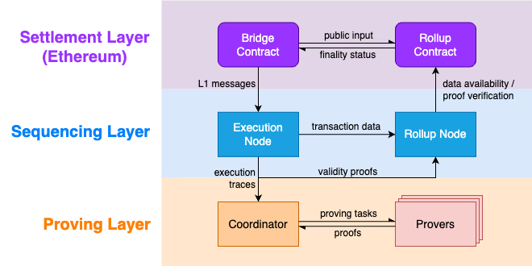
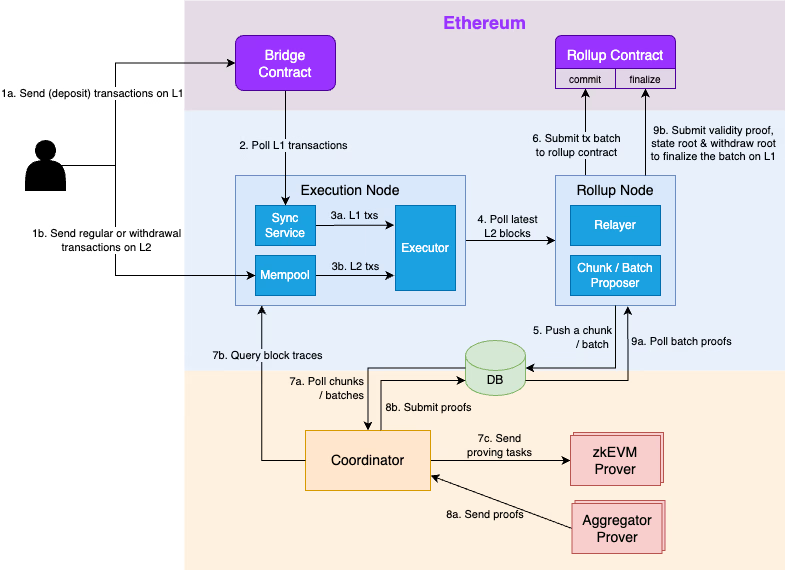
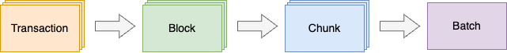

# Scroll

**Author:** [Alexey Kutsenko](https://github.com/bimkon144) 👨‍💻

Scroll is a second-layer blockchain (Layer 2 - L2) designed to scale Ethereum. It uses ZK-Rollups - rollups with zero-knowledge proofs (ZKP) to bundle transactions outside of the main network (L1), while only the cryptographic proof that the transactions have been processed correctly, and the compressed transaction data are sent to L1.

Developed in collaboration with the [Privacy and Scaling Explorations](https://pse.dev/) group at Ethereum Foundation for over a year.

In this article, we'll look at the main technical principles of blockchain that influenced the design of the blockchain, and give an overview of the general architecture of Scroll.

We'll detail about Scroll, which consists of a centralized sequencing node (execution node, rollup node) and a decentralized network (roller net), show the architecture and the rollup working process.

It is assumed that you are already familiar with the terms [zkp](https://habr.com/ru/articles/692088/)

## Technical Principles and Premises for Blockchain Creation

The technical principles that were fundamental and what influenced the design of the blockchain can be studied in detail in [this](https://scroll.mirror.xyz/N7cAie4ul0PdSxNdv2FTqgMV2JEkhOJocsxfeqe4SFE) article.

## Architecture 

To understand how the blockchain works, you first need to understand what levels of architecture exist and what they consist of.

Let's look at the high-level general architecture according to the picture below.

### Settlement Layer 

This layer is located in Ethereum and consists of two contracts - `Bridge Contract` and `Rollup Contract`.

**Bridge Contract:** 

- allows users and dapps to send messages, assets, transactions (if dapps in L1) to the Scroll network (L2) and back to L1.

**Rollup Contract:** 

- verifies grouped transactions (batch) sent from L2.
- provides data availability (ensures that any network participant can access information about transactions and blocks).
- orders transactions for the canonical Scroll chain (In the blockchain, transactions must be processed in a specific order to avoid double spending and other types of fraud. The computation layer ensures that transactions entering the canonical Scroll chain are processed in the correct and sequential order).
——————
### Sequencing Layer

This layer consists of nodes - `Execution Node` and `Rollup Node`.

**Execution Node:**

First off, it's important to mention that as of now, this is a centralized node and one of the key components of the protocol.

It's responsible for:

- Verifying and executing transactions sent by users through the L2 network or via the L1 contract - bridge.
- Creating L2 blocks from transactions.

**Rollup Node:**

- Bundles transactions into batches.
- Publishes transaction data and block information on Ethereum to ensure data availability.
- Submits proofs of transaction correctness to Ethereum for the final confirmation of the transaction batch (finalization in L1).

### Proving Layer

This layer consists of the `Provers` module and `Coordinator`.

**Provers:**

This is a pool of validators in a decentralized network.

They are responsible for creating zkEVM validity proofs, which verify the correctness of L2 transactions.

**Coordinator:**

The Coordinator, in turn, is a module that sends verification tasks to a random `Prover` and passes the proofs to the `Rollup Node` for finalizing transactions in Ethereum.

## Rollup Process

Let's dive into the details of the scheme.

First, let's break down what the nodes consist of.

**Execution Node** contains the following modules:

- *Sync service*. Subscribes to Bridge contract events. As soon as this module detects a new transaction, it generates it into a special L1MessageTx format and adds them to the local L1 transaction queue.

- *Mempool*. Collects transactions that are sent directly to L2.

- *Executor*. Extracts transactions from both the local L1 transaction queue and the L2 Mempool, executes them to create a new L2 block.

**Rollup Node** contains the following modules:

- *Relayer*. Sends [commit transactions](#transaction-life-cycle) and [finalize transactions](#transaction-life-cycle) to the `Rollup Contract` to ensure data availability and finality.
- *Chunk/Batch Proposer*. Creates [chunks](#transaction-batch-processing) / batches from transactions and sends either to the database, for subsequent submission to the Prover for proof generation, or to the Rollup contract, for preliminary fixation in the L1 network.

Thus, the Rollup process consists of three stages:

1) Transactions are checked and executed in the Execution Node
2) Transactions are packaged into batches and changes are fixed in L1
3) Proof generation and submission to the Rollup contract for transaction finalization.

### Workflow

Now let's walk through each point in the scheme.

#### Transactions are checked and executed in the Execution Node

**1.** Users send transactions through the L1 bridge or directly to the L2 network.

**2.** Sync Service extracts the latest added L1 transactions from the `Bridge contract`.

**3.** L2 Sequencer (Execution Node) processes transactions from the queue that came from L1, as well as from the L2 mempool, and creates L2 blocks.

#### Transactions are packaged into batches and changes are fixed in L1

**4.** Rollup Node tracks the latest L2 blocks and extracts transaction data.

**5.** Rollup Node proposes a new chunk or batch and records it in the database. For more on how block, chunk, and batch creation occurs, I recommend checking [here](#transaction-batch-processing).

**6.** After creating a new batch, the Relayer collects transaction data in this package and sends a commit transaction to the Rollup Contract to ensure data availability. Thus, preliminary data fixation in L1 takes place.

#### Proof generation and submission to the Rollup contract for transaction finalization.

**7.** The Coordinator queries the new chunk or batch from the database:

        - If a new chunk has been created, the Coordinator will request the execution trace of all blocks in this chunk from the L2 sequencer (execution node), and then send the chunk verification task to a randomly selected verifier (prover).

        - If a new batch has been created, the Coordinator will collect proofs of all chunks of this batch from the database and send the batch verification task to a randomly selected aggregator-verifier (prover).

**8.** Once the Coordinator receives chunk or batch proofs from the verifier (prover), it will record the proof in the database.

**9.** As soon as the rollup relayer sees a new batch in the database, it sends a [Finalize](#transaction-life-cycle) transaction to the Rollup Contract to verify the proof.

Thus, as you might have noticed, there is a specific life cycle of transactions.

### Transaction Life Cycle

1. **Confirmed**: Users send a transaction either to the L1 bridge contract or to the L2 sequencer (execution node). 
A transaction becomes Confirmed after it has been executed and included in an L2 block.
2. **Committed**: Indicates that the transaction data of this block have been published on Ethereum. 
This doesn't prove they were executed correctly but guarantees block data availability.
3. **Finalized**: Indicates that a validity proof has been sent and verified by the smart contract. The transaction has the status of Finalized. 
After this step, the transaction is considered final.

### Transaction Batching

As shown in the picture, in Scroll, transactions are grouped at several levels.

1. A group of ordered transactions is packed into a block.
2. A series of adjacent blocks are grouped into a chunk. A chunk is the basic block for generating proof in the zkEVM scheme.
3. A series of adjacent chunks are grouped into a batch. A batch is the basic unit for data fixation (preliminary submission to L1) and proof verification at the L1 level. Batch proof is the cumulative proof of chunks in this batch.

Thus, transactions are initially packed into blocks, then blocks into chunks (for sending to proof generation in prover), and then, chunks are packed into batches (for data fixation in L1 or proof verification).

## Differences between zkEVM and EVM in Scroll

Development tools and differences of the Scroll blockchain from Ethereum have been discussed [here](../scroll/scroll-dev-environment.md)

## Scroll Infrastructure

Scroll's infrastructure is rapidly gaining momentum and already includes dozens of protocols: Bridges, DeFi, infrastructure protocols, and more. (See the current list [here](https://scroll.io/ecosystem)).

## Pros and Cons of Scroll

### Pros

-   EVM-compatible smart contracts (Except for some precompiled contracts and eips)
-   You can use favorite development frameworks and tools, such as foundry, hardhat, remix.
-   Standard Web3 API (also support for standard Ethereum wallets like MetaMask)
-   Transaction processing speed - L2 transactions are confirmed immediately and on L1 after a short period of time
-   Low transaction fees
-   Rapidly developing infrastructure

### Cons

-   Requires testing directly in the Scroll network. As a result, more time is needed for more thorough testing and audit, even for already tested and audited contracts, because there are minor changes in precompiled contracts and supported eips
-   The network is still quite centralized and managed by certain validators (Sequencers)
-   As the network is in development and testing - it's necessary to constantly monitor to ensure nothing breaks in the already working code

## Conclusion

The Scroll protocol looks very promising. Developing for Scroll is currently easier than for blockchains that are less compatible with EVM. 

## Links

- [Docs: scroll docs](https://docs.scroll.io/en/developers/)
- [ecosystem](https://scroll.io/ecosystem)
- [article: overview of scroll](https://hub.forklog.com/obzor-arhitektury-scroll/)
- [article: Introducing Scroll - Vision and Values](https://scroll.mirror.xyz/EYn7ODhQAnNWABwWcu5xZLts_wEXTZAEWyTgExGS1DA)
- [article: Introducing Scroll – Technical principles](https://scroll.mirror.xyz/N7cAie4ul0PdSxNdv2FTqgMV2JEkhOJocsxfeqe4SFE)

