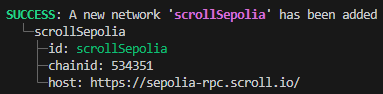

# Development Tools and Differences Between Scroll and Ethereum Blockchains

**Author:** [Alexey Kutsenko](https://github.com/bimkon144) 👨‍💻

The [Scroll](https://scroll.io/) blockchain is compatible with EVM bytecode and is designed so that developers can work with their favorite frameworks with minimal differences. It's claimed that the Scroll blockchain was developed by Ethereum developers for Ethereum developers.

The blockchain does not support `erc-4337` out of the box.
The average transaction finalization time on L1 is ~ 3 minutes.

There is already an entire [ecosystem](https://scroll.io/ecosystem) around this blockchain. Unfortunately, not all dapps are displayed in the mentioned source, for example, it's already possible to use the popular [Chainlink oracle](https://docs.chain.link/data-feeds/price-feeds/addresses?network=scroll&page=1) to get token prices.

When developing, always refer to the latest documentation [here](https://docs.scroll.io/en/developers/).

## Tools

### Foundry

When interacting with the network, such as the Scroll testnet, keep in mind that EIP-1559 is disabled in Scroll (we will talk about all changes later).
In Foundry, there is a `--legacy` flag that allows the use of [legacy](https://www.educative.io/answers/type-0-vs-type-2-ethereum-transactions) transactions.
Currently, Foundry tries to automatically enable the `--legacy` flag for regular networks without EIP-1559.
If it doesn't activate automatically and an error occurs - `EIP-1559 not activated`, you should manually enable the transaction type flag.

For Example:

```forge create src/Contract.sol:MyToken --rpc-url=https://sepolia-rpc.scroll.io/ --legacy```

### Hardhat

To use this framework, you simply need to add the required network in ```hardhat.config.ts```.

For example, let's set it up for the Scroll Sepolia testnet:

```javascript
...

const config: HardhatUserConfig = {
  ...
  networks: {
    scrollSepolia: {
      url: "https://sepolia-rpc.scroll.io/" || "",
      accounts:
        process.env.PRIVATE_KEY !== undefined ? [process.env.PRIVATE_KEY] : [],
    },
  },
};
...
```
### Truffle

To connect, you need to add the network in the file ```truffle-config.js```

```javascript
const HDWalletProvider = require("@truffle/hdwallet-provider")
...
module.exports = {
  networks: {
    scrollSepolia: {
      provider: () =>
        new HDWalletProvider(process.env.PRIVATE_KEY, "https://sepolia-rpc.scroll.io/"),
      network_id: '*',
    },
  }
}
```


### Brownie 

To add the network, you need to use the command ```brownie networks add Ethereum scrollSepolia host=https://sepolia-rpc.scroll.io/ chainid=534351```.

After that you'll mention that network was added successfully: 



And you can check this using the command ```brownie networks list```


### Online IDE

Smart contracts are easily compiled and deployed in Remix. 
To interact with the testnet, you'll need to get ETH. You can find ways to do this [here](https://docs.scroll.io/en/user-guide/faucet/).

### Testing Environment

Testing is possible in the aforementioned environments, but it's important to understand that due to differences between Scroll and Ethereum at the EVM level, the final comprehensive testing of smart contract functionality can only be verified through deployment in the [testnet](https://sepolia.scrollscan.dev/). 

## Differences Between Ethereum & Scroll Networks

Although it was stated that Scroll is a solution from "Ethereum developers for Ethereum developers" and this zkEVM network is compatible with Ethereum at the bytecode level, there are still some differences to consider when developing smart contracts:

**Opcodes**

- `SELFDESTRUCT` → disabled. Will revert the transaction.
- `BASEFEE` → disabled. Will revert the transaction.
- `DIFFICULTY/PREVRANDAO` → always returns 0.
- `COINBASE` → returns the address of the predeployed contract - Transaction Fee Vault. Contracts can be viewed [here](https://docs.scroll.io/en/developers/scroll-contracts/).
- `BLOCKHASH` → returns keccak (chain_id || block_number) for the last 256 blocks.

**Precompiled Contracts**

Supported:

- ecRecover
- identity
- ecAdd
- ecMul

Supported with modifications:

- modexp is supported, but only supports input data of size less than or equal to 32 bytes (i.e., u256).

- ecPairing is supported, but the number of points (sets, pairs) is limited to 4 instead of 6.

Temporarily Unsupported:

- SHA2-256 (address 0x2)
- RIPEMD-160 (address 0x3)
- blake2f (address 0x9)

Attempting to call these will revert the transaction. Developers plan to include them in a future hard fork.

**State Account**:

Two fields, ```PoseidonCodehash``` and ```CodeSize```, have been added to the data structure used to store information about the state of an account:


```javascript
type StateAccount struct {
	Nonce    uint64 // a counter indicating the number of transactions sent by the sender
	Balance  *big.Int // ETH balance on the account (unit in wei).
	Root     common.Hash // Root of the storage Merkle tree
	KeccakCodeHash []byte // Keccak hash
	// added fields
	PoseidonCodeHash []byte // Poseidon hash
	CodeSize uint64 // Number of bytes in the contract bytecode
}
```
*KeccakCodeHash* - used to maintain compatibility with the `EXTCODEHASH` opcode.

*PoseidonCodeHash*: - This hash type is used for verifying the correctness of bytecode loaded into zkEVM. [Poseidon hash](https://eprint.iacr.org/2019/458.pdf) is optimized for use in Zero-Knowledge Proof computations and allows for more efficient and secure handling of smart contract bytecode in such environments.

*CodeSize* - used to store the size of the contract. When verifying EXTCODESIZE, loading full contract data into zkEVM is costly, so instead, we store the size of the contract in storage during contract creation. Thus, we don't need to load the code – a proof from storage suffices for verifying this opcode.

**Block**

For quick feedback and enhanced user experience, Scroll has implemented a block creation time of ~ 3 seconds.

block.timestamp returns the L2 transaction timestamp.

### EIPs

Developers have disabled some EIPs in the London fork and introduced new ones with the Shanghai fork to improve compatibility. Developers promise to bring back EIP-2930 and EIP-1559 in the future.

Disabled:

- [EIP-1559](https://eips.ethereum.org/EIPS/eip-1559): New fee market structure with a dynamically adjusted base fee and burning part of the fees, along with expandable block sizes for improved network efficiency.

- [EIP-2930](https://eips.ethereum.org/EIPS/eip-2930): Optional access lists in transactions to reduce the risk of errors and improve interactions with smart contracts by specifying addresses and storage keys they will use.

- [EIP-3198](https://eips.ethereum.org/EIPS/eip-3198): Introduces the BASEFEE opcode in Ethereum, allowing smart contracts to directly access current network base fee information, enhancing their adaptability and functionality.

Imported:

- [EIP-3651](https://eips.ethereum.org/EIPS/eip-3651): Reduces gas cost for accessing the miner’s address (COINBASE operation) in smart contracts.

- [EIP-3855](https://eips.ethereum.org/EIPS/eip-3855): Introduces the PUSH0 opcode. It allows placing a zero value on the stack, simplifying certain operations and potentially reducing gas costs by decreasing the number of bytes required to encode zero values in smart contracts.

- [EIP-3860](https://eips.ethereum.org/EIPS/eip-3860): Limits the size and measures the cost of initialization code (initcode) for contracts. This is aimed at reducing security risks and improving network performance by imposing limits on the length of initcode and linking the cost of its execution to its size.
