# zkEVM Polygon

**Author:** [Alexey Kutsenko](https://github.com/bimkon144) 👨‍💻

## Introduction

Polygon zkEVM is an Ethereum Virtual Machine (EVM) emulator that implements ZK-Rollups technology, enhancing throughput and transaction processing speed. zkEVM allows developers to deploy Ethereum smart contracts on the L2 network without any code changes, leveraging the benefits of ZK-Rollups, such as low gas costs and fast transaction finalization.

Currently, among L2 networks, relatively few solutions are based on ZKP technology. To better understand the concept of zero-knowledge proof and the workings of a blockchain built on it, we recommend familiarizing yourself with our zkSync overview [here](https://github.com/matter-labs/awesome-zero-knowledge-proofs), where we focus on the theoretical foundations of the technology.

## Architecture

Polygon zkEVM processes state transitions triggered by Ethereum Layer 2 transactions (transactions that users send to the network). It then generates proofs of authenticity, verifying the accuracy of these off-chain state computation changes using zk proof.

Below we will examine the main components of the blockchain:

1) zkNode
    - Synchronizer
    - Sequencers & Aggregators
    - RPC
2) Consensus Smart Contract (PolygonZkEVM.sol)
3) zkProver
4) zkEVM Bridge.

For a better understanding of where smart contracts and nodes are located, let's look at the diagram below:

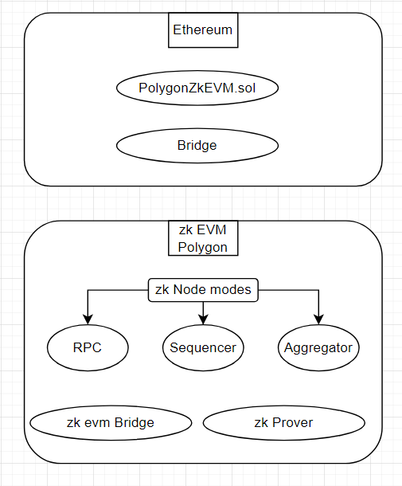

The latest version of the zkEVM consensus smart contract (deployed on L1) is modeled after [Proof of Efficiency](https://ethresear.ch/t/proof-of-efficiency-a-new-consensus-mechanism-for-zk-rollups/11988).

### zkNode

zkNode is software required to run any zkEVM node. It's a client necessary for the network to implement synchronization and manage participant roles (sequencers or aggregators). The main participants affecting the L2 state and its completion are the trusted sequencer and aggregator. We will talk about rewards for these types of nodes later [here](#zkEVM-incentive-mechanism).

zkNode users can use it for several purposes:
 - As a node, to know the network state
 - As a participant in the network operation process: Sequencer or Aggregator.

To understand the roles of sequencers and aggregators, let's consider the modular architecture of zkNode:

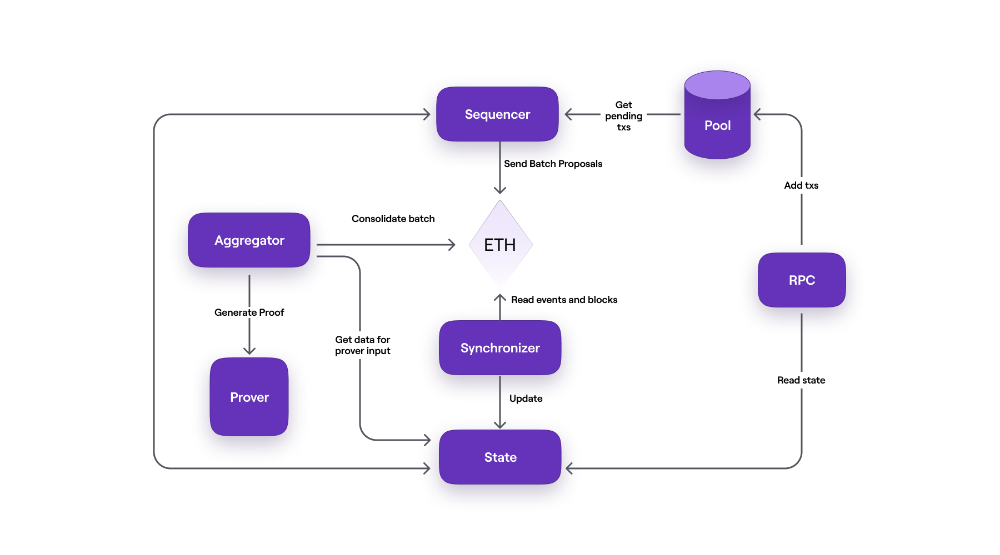

Let's define each module in the diagram:
 - `RPC` - RPC node, through which users send their transactions;
 - `Pool` - a storage of user-sent transactions. They are stored and wait for the sequencer to place them in a batch.
 - `Sequencer` — a node responsible for selecting transactions from the pool database, verifying the authenticity of transactions, and subsequently placing valid ones in a batch;
 - `Synchronizer` — a component that updates the State database by receiving data from Ethereum through Etherman. Etherman is a low-level component implementing methods for all interactions with the L1 network and smart contracts;
 - `State` (state database) — a database for the persistent storage of state data (not Merkle trees);
 - `Aggregator` — another node whose role is to provide proofs verifying the integrity of the state change proposed by the sequencer. These proofs are zero-knowledge proofs (or ZK-proofs), and for this purpose, the aggregator uses a cryptographic component called Prover;
 - `Prover` - a sophisticated cryptographic tool capable of creating hundreds of ZK-proof packets and combining them into one ZK-proof, which is published as a proof of authenticity.

The most important thing to understand is the main path transactions take, from the moment users send transactions to the zkEVM network until their completion and inclusion in the L1 state.

First, let's simply describe the transaction path according to the scheme:

- Users connecting to the zkEVM network via an RPC node send their transactions to a database called Pool.
- The Pool database stores transactions sent by users. They are stored and wait for the sequencer to place them in a batch.
- The Sequencer checks transactions from the Pool, groups them into a batch, sends all batches to L1 to a specific smart contract (we'll discuss later), and then sequences them (ordering, validating, recording in the smart contract). These sequenced batches must be included in the L1 state.
- The Synchronizer updates the State database by receiving data from Ethereum through Etherman.
- The Aggregator takes data from the updated State database and sends it to the Prover module.
- The Prover provides zk-proof evidence, confirming the integrity of the state change proposed by the sequencer.
- With the zk-proof, the Aggregator goes to L1 and consolidates the state of the transaction batch. At this stage, the transactions are considered completed and included in the L1 state.

You might be wondering, who receives the grouped transaction batches from the sequencers, stores their order, checks the transactions, and places them in L1?

Our next component, Polygon zkEVM, does exactly that.

### Consensus smart contract (PolygonZkEVM.sol)

This component is the Consensus Smart contract (PolygonZkEVM.sol).
You can view the smart contract on [Ethereum](https://etherscan.io/address/0x5132A183E9F3CB7C848b0AAC5Ae0c4f0491B7aB2#writeProxyContract) and the goerli [testnet](https://goerli.etherscan.io/address/0xa997cfD539E703921fD1e3Cf25b4c241a27a4c7A).

This smart contract verifies proofs of validity to ensure the correct execution of each state transition. This is achieved using zk-SNARK schemes.

A bit of history about the smart contract:

An earlier version, Polygon Hermez 1.0, was based on the Proof of Donation (PoD) consensus mechanism. PoD was essentially a decentralized auction conducted automatically, where participants (coordinators) bid a certain amount of tokens to gain the right to create the next transaction batch.

The latest consensus smart contract (PolygonZkEVM.sol) builds on the experience of the existing PoD in version 1.0 and adds support for the seamless participation of multiple coordinators in creating batches on the second layer (L2).

The earlier Proof of Donation (PoD) mechanism was based on a decentralized auction model to gain the right to create batches over a specific period. In this mechanism, economic incentives were set up in such a way that validators had to be very efficient to remain competitive.

The latest version of the Consensus smart contract zkEVM (deployed on Layer 1) is modeled after [Proof of Efficiency](https://ethresear.ch/t/proof-of-efficiency-a-new-consensus-mechanism-for-zk-rollups/11988). It uses the experience of the existing PoD in version 1.0 and adds support for the seamless participation of multiple coordinators in creating batches on the second layer (L2).​"

The strategic implementation of smart contract consensus promises to provide the network with:

- Unhindered creation of batches on the second layer (L2).
- High efficiency, a key criterion for the overall performance of the network.
- Achieving an acceptable degree of decentralization.
- Protection against malicious attacks, especially from validators.
- Maintaining a fair balance between collective validation efforts and the value of the network.

### zkProver

zkEVM uses cutting-edge zero-knowledge technology to create proofs of authenticity. It utilizes a zero-knowledge prover (zkProver), designed to work on any server and compatible with most consumer hardware. Each Aggregator will use this zkProver to verify batches and provide proofs of authenticity. It consists of the Main State Machine Executor, a collection of secondary State Machines, STARK-proof builder, and SNARK-proof builder.

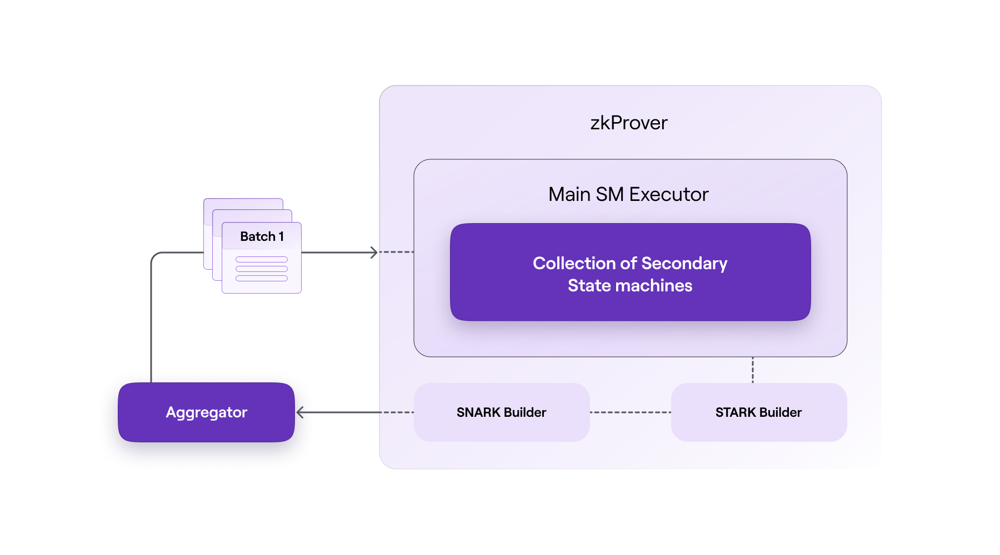

The diagram below shows the interaction of the node with the database:

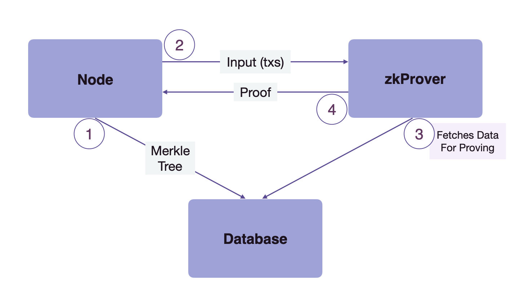

As depicted in the flow diagram above, the entire interaction works in 4 stages.

1 → The node sends Merkle tree contents to the database for storage.

2 → Then the node sends incoming transactions to the zkProver.

3 → zkProver accesses the database and extracts necessary information to create verifiable proofs of transactions sent by the node. This information includes Merkle roots, keys, hashes, and other data.

4 → Then zkProver generates transaction proofs and sends these proofs back to the node.

However, this is just the tip of the iceberg in what zkProver does. The process of creating these verifiable transaction proofs involves much more detail. You can see more detailed information about the operation of this module [here](https://wiki.polygon.technology/docs/zkevm/zkProver/zkprover-design/).

### **zkEVM Bridge**

Users can deposit assets from Ethereum and conduct off-chain transactions on Polygon zkEVM. To transfer assets across chains (L1 ↔ zkEVM), you'll need to use the zkEVM Bridge. The bridge interface is available for both the mainnet beta version and the testnet. Additionally, the L2 bridge allows using its mechanism for migrating assets between different L2 networks.

Below is a diagram showing how the bridge works.

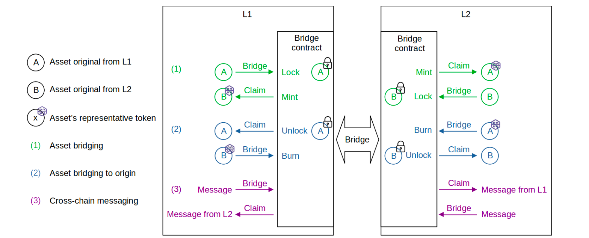

An important nuance is that during the bridge process, the "claim" action is used to retrieve funds on L2/L1 after transferring them from L1/L2. This is related to security mechanisms and transaction verification:

Ether Deposit: First, a user sends ether from L1 (main Ethereum network) to L2 via the zkEVM Bridge dApp.

Waiting for globalExitRoot: After depositing, one needs to wait for the publication of globalExitRoot on L2, which is part of the verification process.

Performing Claim on L2: The user then performs a "claim" operation on L2 to actually access their funds.

This process ensures an additional level of security and verification for transactions between L1 and L2.

Below is an image showing how to claim a transaction after transferring funds from the testnet to the zkEVM Polygon testnet.

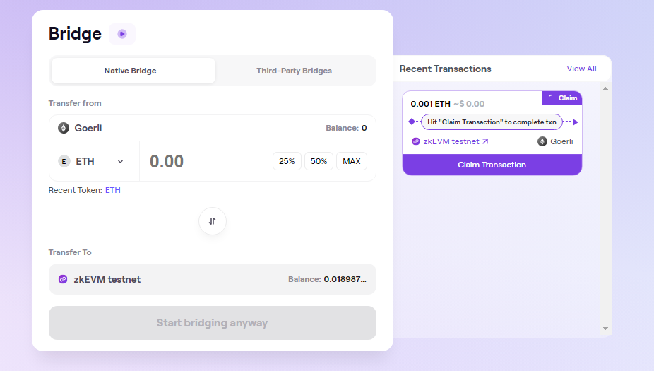

## zkEVM Protocol

Let's delve deeper into how the protocol works.

### State Management

It's worth explaining how the Polygon zkEVM protocol manages L2 Rollup states while ensuring verifiability and security of state transitions.

The Trusted Sequencer generates batches, but for quick L2 transaction finality and to avoid waiting for the next L1 block, they are transmitted to L2 network nodes through a broadcast channel. Each node will execute the batches for local computation of the resulting L2 state.

Once the Trusted Sequencer records the sequences of batches received directly from L1, L2 network nodes will execute them again, and they no longer need to trust him.

The off-chain executed batches will eventually be verified on the blockchain using Zero-Knowledge Proof, after which the resulting L2 state root will be recorded. As the zkEVM protocol evolves, L2 network nodes will directly receive state updates from L1 nodes. This means that blockchain state data will be transmitted and updated between the two network layers, improving communication and synchronization between them.

This means that both data availability and transaction execution verification fully depend on L1 security assumptions. In the final stage of the protocol, nodes will rely exclusively on data present in L1 to maintain synchronization with each L2 state transition. This underscores the importance and reliability of L1 in ensuring the security and integrity of the entire system.

The diagram below shows how L2 nodes receive transaction batches.

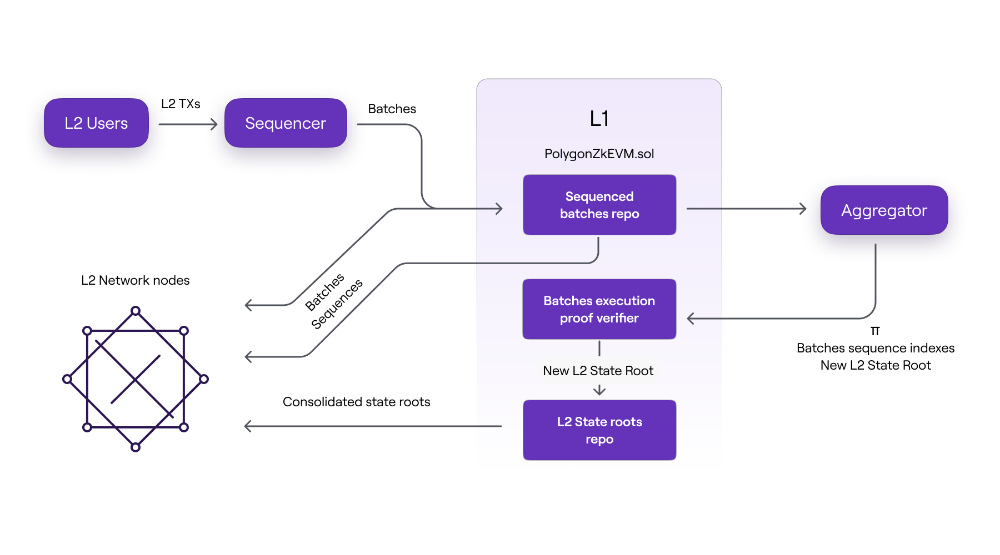

 - Directly from the Trusted Sequencer before the batches are transmitted to L1, or
 - Directly from L1 after sequencing the batches, or
 - Only after the correctness of execution is proven by the Aggregator and verified by the PolygonZkEVM.sol smart contract.

It's worth noting that the three formats of batch data are accepted by L2 nodes in the chronological order listed above.

Let's detail what these three packet states are (you can look at the diagram above again).

There are three stages of the L2 state, each corresponding to three different ways of updating the state by L2 nodes. All three cases depend on the packet data format used to update the L2 state.

Trusted State: In the first stage, the update occurs exclusively based on information (i.e., batches consisting of ordered transactions) coming directly from the Trusted Sequencer before the data becomes available in L1.

Virtual State: In the second stage, the update is based on information obtained from the L1 network by L2 nodes. This happens after the batches have been ordered (sequenced), and the data becomes available in L1.

Consolidated State: In the final stage, the information used to update the L2 state includes verified zero-knowledge proofs of computational integrity. That is, after the zero-knowledge proof is successfully verified in L1, L2 nodes synchronize their local L2 state root with the one recorded in L1 by the trusted Aggregator.

The figure below depicts the L2 state stages timeline in terms of packet processing, as well as the actions that trigger the transition from one stage to another.

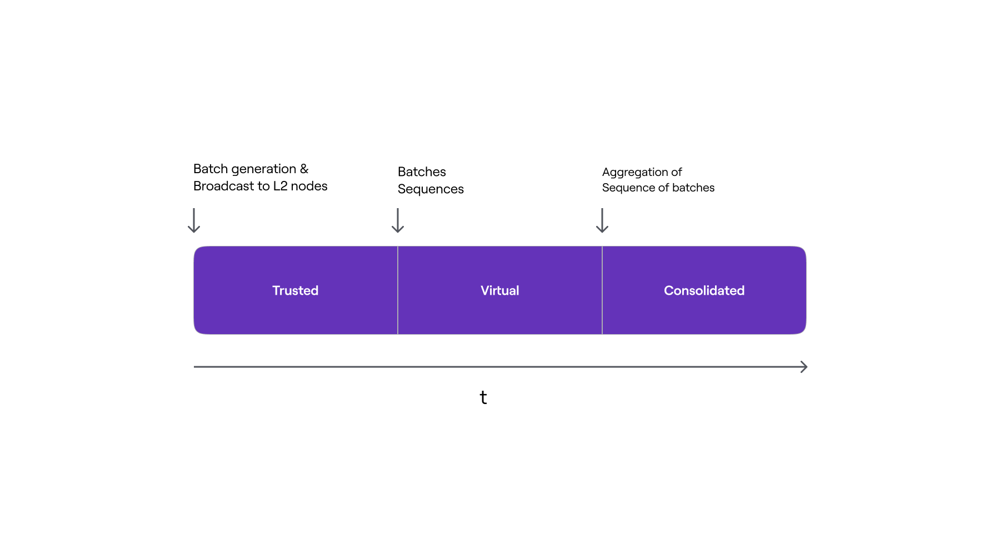

### Transaction Lifecycle

This section thoroughly describes the various forms and stages that L2 user transactions go through, from their creation in user wallets to their final verification with indisputable proofs on L1.

#### Sending a Transaction

Transactions in the Polygon zkEVM network are created in users' wallets and signed with their private keys.

After being created and signed, transactions are sent to the Trusted Sequencer node via the JSON-RPC interface. The transactions are then stored in a pool of pending transactions, waiting for the Sequencer to select them for execution or cancellation.

Users and zkEVM communicate using JSON-RPC, which is fully compatible with Ethereum RPC. This approach allows any EVM-compatible application, such as wallet software, to function and feel like true Ethereum network users.

**Transactions and Blocks in zkEVM**

It's important to note that in the current zkEVM construction, one transaction is equivalent to one block.

How can this improve blockchain operations?

- Simplifying communication: Typically in blockchains, multiple transactions are grouped into blocks. However, in this case, each transaction itself forms a block. This can simplify the process of data transfer between network nodes.

- Compatibility with tools: Since each transaction is a separate block, this can enhance compatibility with existing tools and applications that are already adapted to work with blocks.

- Quick finality: In traditional blockchains, confirming a transaction can take time because it needs to be included in a block and then that block must be confirmed by the network. If each transaction is a separate block, this can speed up the transaction confirmation process on the second layer (L2).

- Simplifying transaction search: Since each transaction is a separate block, locating a specific transaction in the blockchain might be easier, as there's no need to browse through multiple transactions within one block.

This reflects a unique approach to transaction processing in the zkEVM network, which can provide high performance and convenience for users.

Thus, this design strategy not only improves RPC and P2P communication between nodes but also increases compatibility with existing tools and ensures quick finality at the L2 level. It also simplifies the process of discovering user transactions.

#### Transaction Execution and Trusted State

The Trusted Sequencer reads transactions from the pool and decides whether to discard them or order and execute them. Executed transactions are added to a transaction batch, and the local L2 state of the sequencer is updated.

As we mentioned earlier, as soon as a transaction is added to the L2 state, it is transmitted to all other zkEVM nodes via a broadcasting service. It's noteworthy that, relying on the Trusted Sequencer, we can achieve fast transaction finality (faster than in L1). However, the obtained L2 state will remain in a trusted (Trusted) state until the batch is recorded in the consensus smart contract.

Users typically interact with the trusted L2 state. However, due to certain protocol characteristics, the process of verifying L2 transactions (for the possibility of withdrawing funds to L1) can take a long time, typically about 30 minutes, but in rare cases up to a week.

What are these rare cases?

**Rare Case**

- Transaction verification on L1 will take 1 week only if the Emergency State is activated or if the aggregator does not package any proofs at all.
- Additionally, the emergency mode is activated if a sequenced batch is not aggregated (not processed by the aggregator) within 7 days. More about the Emergency State can be found [here](https://wiki.polygon.technology/docs/zkevm/protocol/emergency-state/).

As a result, users should be mindful of potential risks associated with high-value transactions, especially those that are irreversible, such as fund withdrawals, over-the-counter transactions, and alternative bridges.

#### Batch Processing of Transactions

The Trusted Sequencer must group transactions using the following BatchData structure specified in the `PolygonZkEVM.sol` smart contract:

```solidity
struct BatchData {
  bytes transactions;
  bytes32 globalExitRoot;
  uint64 timestamp;
  uint64 minForcedTimestamp;
}
```

**Transactions**

This parameter represents encoded transactions that are sequentially combined.

Each transaction is encoded according to Ethereum pre-EIP-155 or EIP-155 formats using RLP (Recursive Length Prefix).

**GlobalExitRoot**

This root is the Bridge's Global Exit Merkle Tree, which will be synchronized with the L2 state at the beginning of batch execution.

**Timestamp**

Since Ethereum blocks have timestamps, each batch has a timestamp.

There are two restrictions that each timestamp must meet to ensure that batches are time-ordered and synchronized with L1 blocks:

- The timestamp of a given batch must be greater than or equal to the timestamp of the last sequenced batch.
- The maximum timestamp that the trusted sequencer can set for a batch is the timestamp of the block in which the L1 sequencing transaction is executed.

**MinForcedTimestamp**

If a batch is a so-called forced batch, this parameter must be greater than zero. Forced batches are used to counteract censorship. More on this in subsequent sections.

#### Batch Sequencing and Virtual State

Batches need to be ordered and verified before they can become part of the Virtual State of L2.

The Trusted Sequencer successfully adds a batch to the sequence of batches using the SequencedBatches mapping of the L1 PolygonZkEVM.sol smart contract, which essentially represents a storage structure containing a queue of sequences defining the virtual state.

```solidity
// SequenceBatchNum --> SequencedBatchData
mapping(uint64 => SequencedBatchData) public sequencedBatches;
```
Accordingly, to sequence, the Trusted Sequencer calls the `sequenceBatches` function, which takes an array of BatchData as an argument.

```solidity
function sequenceBatches (
    BatchData[] memory batches
) public ifNotEmergencyState onlyTrustedSequencer
```
The image below shows the logical structure of the sequence of batches.

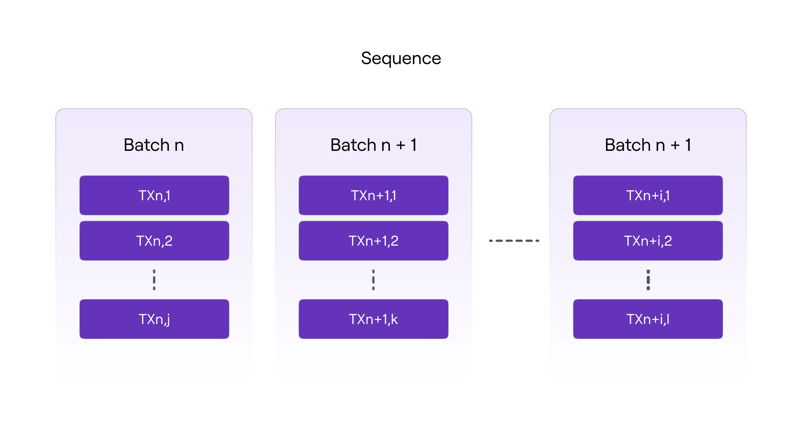

**Maximum and Minimum Batch Size**

The public constant in the smart contract, MAX TRANSACTIONS BYTE LENGTH, defines the maximum number of transactions that can be included in a batch (300,000).

Similarly, the number of batches in a sequence (batches for one sequencing) is limited by the public constant of the smart contract, MAX VERIFY BATCHES (1,000). The array of batches must contain at least one batch, but not more than the value of the MAX VERIFY BATCHES constant.

As we can see from the code above, only the Ethereum account of the trusted sequencer can access the SequencedBatches mapping. It is also necessary that the consensus smart contract is not in an emergency state.

**Batch Verification and State Integrity**

Batch Validity: This denotes the process of checking and certifying that each batch of data processed or transmitted in the L2 network is legitimate and complies with established criteria and rules. This includes verifying the correctness of transactions in the batch, their order, as well as the authenticity and protocol compliance.

L2 State Integrity: This aspect concerns maintaining and protecting the accurate and continuous state of the second-layer network. State integrity ensures that all records and changes in the L2 network reflect actual transactions and interactions, providing reliability and accuracy of data in the blockchain.

Let's break down what happens when the `sequenceBatches` function is called. The function iterates through each batch in the sequence, verifying its authenticity.

A valid batch must meet the following criteria:

- It must include a globalExitRoot value that is present in the GlobalExitRootMap of the Bridge's L1 PolygonZkEVMGlobalExitRoot.sol smart contract. A batch is valid only if it includes a valid globalExitRoot.
- The length of the transactions byte array must be less than the value of the MAX_TRANSACTIONS_BYTE_LENGTH constant.
- The timestamp of the batch must be greater than or equal to the timestamp of the last sequenced batch, but less than or equal to the timestamp of the block in which the L1 sequencing transaction is executed.

Thus, if one batch is invalid, the transaction is canceled, discarding the entire sequence. Otherwise, if all batches to be sequenced are valid, the sequencing process will continue.

Transactions that were part of a rejected batch are not "lost" definitively. Instead, they can be resent or included in subsequent batches for processing. In a system where security and data integrity are priorities, such an approach helps to prevent the inclusion of invalid or fraudulent transactions in the blockchain.

In the smart contract, there is a storage variable called LastBatchSequenced, used as a batch counter, and thus, it increases with each batch sequencing. Each batch is assigned a specific sequential number, which will be used as the value of the position in the chain of batches.

The same hashing mechanism used in blockchains to link one block to another is used in batches to ensure cryptographic integrity of the batch chain. That is, by including the digest of the previous batch in the data used to calculate the digest of the next batch.

As a result, the digest of a given batch represents the cumulative hash of all previously sequenced batches, hence the name "cumulative hash of the batch." It is denoted as oldAccInputHash for the old and newAccInputHash for the new.

The cumulative hash of a particular batch has the following structure:

```solidity
keccak256 (
    abi.encodePacked (
        bytes32 oldAccInputHash,
        keccak256(bytes transactions),
        bytes32 globalExitRoot ,
        uint64 timestamp ,
        address seqAddress
    )
)
```

- `oldAccInputHash` is the accumulated hash of the previous sequenced batch,
- `keccack256(transactions)` is the Keccak digest of the transactions byte array,
- `globalExitRoot` is the root of the Bridge’s Global Exit Merkle Tree,
- `timestamp` is the timestamp of the batch,
- `seqAddress` is the address of the batch sequencer.

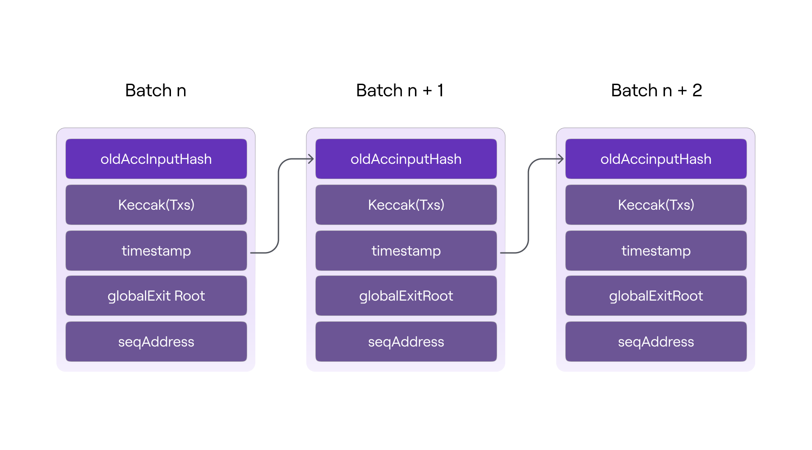

As shown in the diagram above, each accumulated input hash ensures the data integrity of the current batch (i.e., transactions, timestamp, and globalExitRoot), as well as the order in which they were sequenced.

Thus, the sequence of batches is added to the SequencedBatches mapping using the following SequencedBatchData structure only after verifying the validity of all batches in the sequence and calculating the accumulated hash of each batch.

```solidity
// SequenceBatchNum --> SequencedBatchData
mapping(uint64 => SequencedBatchData) public sequencedBatches;

struct SequencedBatchData {
    bytes32 accInputHash;
    uint64 sequencedTimestamp;
    uint64 previousLastBatchSequenced;
}
```

Let's examine each parameter:

`AccInputHash` – This is a unique cryptographic fingerprint of the last batch in the sequence.
`SequencedTimestamp` – This is the timestamp of the block in which the L1 sequencing transaction is executed.
`previousLastBatchSequenced` – This is the index of the last sequenced batch before the first batch of the current sequence (i.e., the last batch in the previous sequence).

Thus, to generate a unique key, the total number of all sequential batches and the number of batches in the current sequence are used, and the SequencedBatchData structure is used as the value when the sequence is entered into the SequencedBatches mapping.

I recommend looking at the `sequenceBatches` method in the [smart contract](https://etherscan.io/address/0xb1585916487acedd99952086f2950763d253b923#code#F15#L483) for a better understanding of the process.

#### Minimizing Storage of Batch Data

Since storage operations in L1 are very costly in terms of gas consumption, it is extremely important to use it as sparingly as possible. To achieve this, memory slots (or mapping entries) are used exclusively for storing sequence commitments.

```solidity
// SequenceBatchNum --> SequencedBatchData
mapping(uint64 => SequencedBatchData) public sequencedBatches;

struct SequencedBatchData {
    bytes32 accInputHash;
    uint64 sequencedTimestamp;
    uint64 previousLastBatchSequenced;
}
```

Each mapping entry records two batch indices:

- The last batch of the previous sequence as the value of the SequencedBatchData structure;
- The last batch of the current sequence as the key of the mapping.

It is important to note that only the accumulated hash of the last batch in the sequence (accInputHash) is stored; all others are computed on the fly to obtain the latest.

This ensures that the data availability of L2 transactions is guaranteed, as the data of each batch can be reconstructed from the call data of the sequencing transaction, which is not part of the smart contract storage but is part of the L1 state.

And at the end of the sequencing function, an event will be created:

```solidity
event SequenceBatches (uint64 indexed numBatch)
```

As soon as batches are successfully sequenced in L1, all zkEVM nodes can synchronize their local L2 state by obtaining data directly from the L1 PolygonZkEVM.sol smart contract, without needing to rely solely on the Trusted Sequencer. This achieves the virtual state of L2.

#### Batch Aggregation and Consolidated State

Finally, we move to the last part, where the trusted aggregator must ultimately aggregate the sequences of batches previously passed by the trusted sequencer, to reach the final stage of the L2 state, i.e., the consolidated state.

Aggregating a sequence means successfully adding the resulting L2 state root to the `batchNumToStateRoot` mapping in the L1 "PolygonZkEVM.sol" smart contract. This is a storage structure containing all the consolidated L2 state roots, keyed by the index of the last batch of each aggregated sequence of batches.


```solidity
// BatchNum --> state root
mapping (uint64 => bytes32) public batchNumToStateRoot;
```

The aggregator receives all the transaction information from the sequencer and sends it to the Prover, which provides a small zk-proof after complex polynomial calculations. The smart smart contract verifies this proof. Thus, the aggregator collects data, sends it to the verifier (Prover), receives its output, and finally sends the information to the smart contract to validate the correctness of the proof of validity from the verifier.​

Inside the Prover, more complex mechanisms are used for generating proofs, such as `SNARK` and `STARK`.

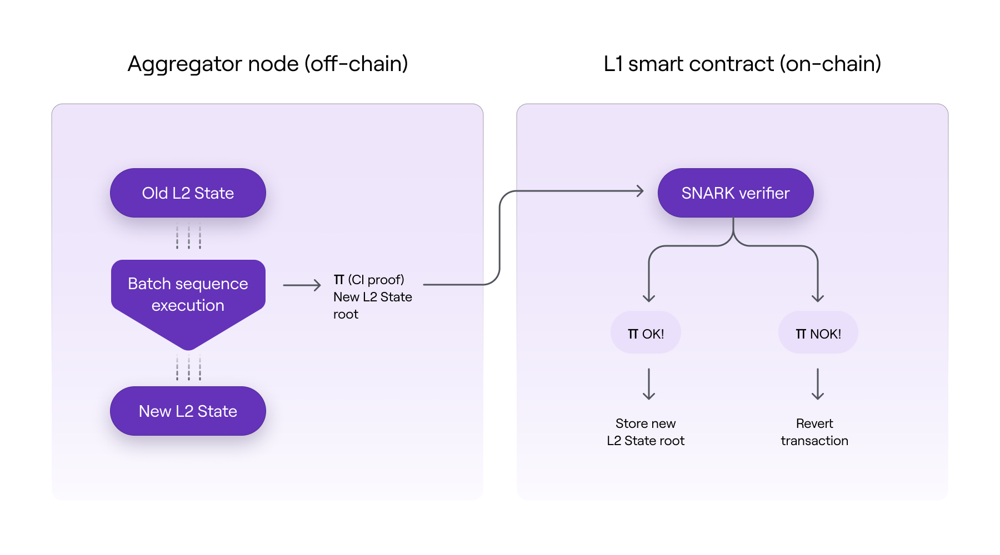

As a result, the integrity of exhaustive computations can be verified using a fraction of the computational resources needed for the original computation. Using the SNARK scheme, we can ensure on-chain security for exhaustive off-chain computations in a cost-effective way. For the curious, you can view an entire extensive [section](https://wiki.polygon.technology/docs/zkevm/zkProver/intro-stark-recursion/) in the documentation that explains how the Prover module works.

As shown in the diagram above, the execution of batches off-chain implies a transition of the L2 state and, consequently, a transition to a new L2 state root.

To aggregate the sequences of batches, the trusted aggregator must call the `verifyBatchesTrustedAggregator` method on the consensus smart contract:

As a result of executing the function, an event will be created:

```solidity
emit VerifyBatchesTrustedAggregator(
            finalNewBatch,
            newStateRoot,
            msg.sender
        );
```

As soon as the batches have been successfully aggregated in L1, all zkEVM nodes can verify their local L2 state by extracting and checking the consolidated roots directly from the L1 Consensus smart contract (PolygonZkEVM.sol). As a result, the consolidated state of L2 is achieved.

### zkEVM Incentive Mechanism

To ensure the sustainability of the system, participants must be rewarded for correctly performing their roles and contributing to the finality of the protocol. Currently, in the early stages, the protocol has centralized sequencers and aggregators, but in the future, the protocol plans to decentralize them. Therefore, they are currently referred to as Trusted aggregator or Trusted Sequencer.

The consensus smart smart contract imposes the following requirements on sequencers and aggregators:​:

`Sequencers`:

- Anyone with the software necessary to run a zkEVM node can become a sequencer.
- Each sequencer must pay a fee in MATIC tokens to gain the right to create and propose batches.
- The sequencer proposing valid batches (consisting of valid transactions) is rewarded with a commission paid by the transaction requesters or network users.​

`Aggregators`:

- The aggregator's task is to provide proofs of authenticity for L2 transactions proposed by sequencers.
- In addition to running zkEVM's zkNode software, aggregators need specialized equipment to create zero-knowledge proofs of authenticity using zkProver.
- For a given batch or batches, the aggregator that provides the proof of validity first receives a MATIC commission (paid by the sequencer of the batch).
- Aggregators need to indicate their intention to verify transactions. They then compete to provide proofs of authenticity based on their own strategy.

Next, the structure of incentives for aggregators and sequencers must be considered.

**Incentive Structure:**

`Sequencer`:

- Collects transactions and groups them into a batch.
- Earns fees from published transactions.
- Pays the L1 transaction fee + MATIC (dependent on pending batches).
- MATIC goes to aggregators.
- Profitable if: txs fee > L1 call + MATIC commission.

`Aggregator`:

- Processes transactions published by Sequencers.
- Generates zkProof.
- Receives MATIC from the sequencer.
- Static cost: L1 call cost + server cost (for proof building).
- Profitable if: MATIC payment > L1 call + server cost.

To ensure the sustainability of the system, participants must be rewarded for correctly performing their roles and contributing to the finality of the protocol. Unless otherwise stated, the measures and rules presented here apply to cases where the roles of sequencer and aggregator are decentralized (i.e., when there is neither a trusted sequencer nor a trusted aggregator).

## Failure Resistance

### Sequencer

Users must rely on a trusted sequencer to execute their transactions at the L2 level. However, users can include their transactions in a forced batch if they cannot execute them through the Trusted Sequencer.

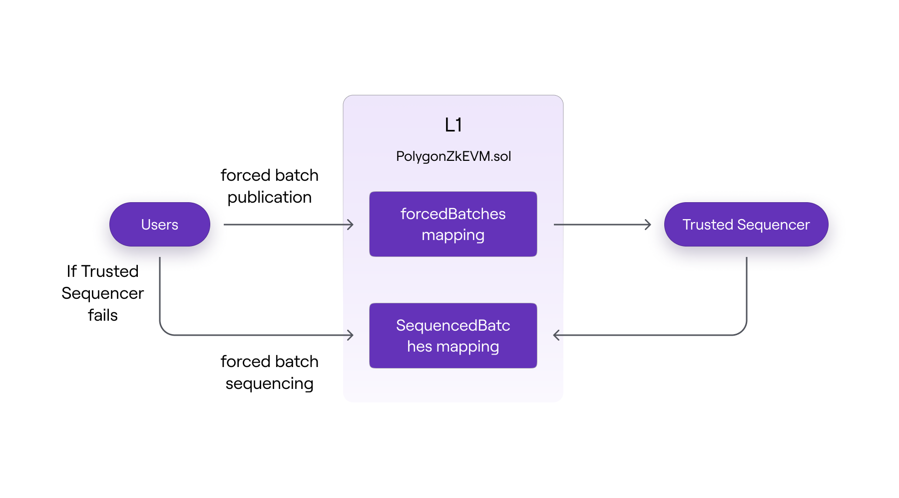

In the diagram above, users can directly send transaction batches to the L1 consensus smart contract, where they are passed to the trusted sequencer and then sequenced.
If for some reason a user's transaction cannot be executed through the sequencer, they can also send a transaction batch for sequencing to the L1 consensus smart contract.

The trusted sequencer will include these forced batches in future sequences to maintain its trusted status. Otherwise, users can demonstrate that they are being censored, and the Trusted Sequencer's trust status will be revoked.

### Aggregator

Just as the system cannot achieve L2 state finality without an active and well-functioning sequencer, finality cannot be achieved without an active and well-functioning aggregator.

The absence or failure of a trusted aggregator means that transitions between L2 states are never updated in L1. For this reason, the L1 PolygonZkEVM.sol smart contract has a `verifyBatches` function that allows anyone to aggregate sequences of batches. You can read more about it [here](https://wiki.polygon.technology/docs/zkevm/protocol/aggregator-resistance/).

### zkEVM Emergency State

The emergency state is a state of the consensus smart contract (PolygonZkEVM.sol and PolygonZkEVMBridge.sol) that, when activated, halts batch sequencing and bridge operations.

The purpose of including an emergency state is to allow the Polygon team to address cases of malfunction or exploitation of any smart contract errors. It's a safety measure used to protect user assets in zkEVM.

The following functions will be disabled in emergency mode:

`sequenceBatches`
`verifyBatches`
`forceBatch`
`sequenceForceBatches`
`proveNonDeterministicPendingState`

To learn who and when can use the emergency mode, you can [read here](https://wiki.polygon.technology/docs/zkevm/protocol/emergency-state/).

## zkASM as a Microprocessor

Polygon ZK EVM represents a revolutionary approach to scaling Ethereum, allowing standard Ethereum smart contract code (EVM bytecode) to be used in a new, more efficient environment. Let's understand how it works.

All transactions in Ethereum can be represented as transitions between different states, similar to a chess game where each move changes the position of the pieces.

Below is a diagram of a basic single-processor computer. Black lines represent data flow, while red lines represent control flow; arrows indicate the direction of flow.

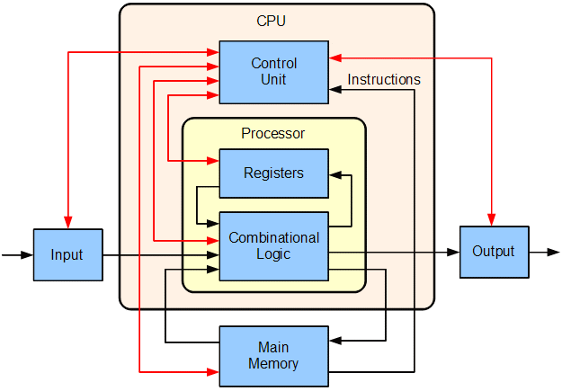

In the diagram, Ethereum is represented as a microprocessor (the heart of the computer), executing smart contract commands (opcodes). zkASM assists in this process.

`Zero-Knowledge Assembly (zkASM)` is a special language that acts as an instruction for this "microprocessor." It helps translate standard Ethereum code into a format that can be efficiently processed while maintaining data confidentiality.

The microprocessor will take transactions that we want to process and the old state as inputs. After receiving the inputs, the ROM is used to interpret the transactions and generate new states (outputs) based on them. Look at the diagram below for a better visualization.

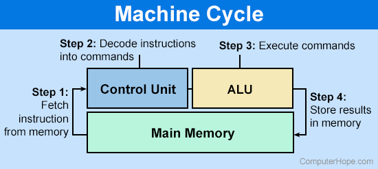

This is similar to a translator helping two people with different languages communicate with each other. As a result, Polygon ZK EVM allows existing Ethereum smart contracts to be used while offering benefits of new technology, such as higher processing speed and enhanced confidentiality.
For more detailed information about its operation, you can look [here](https://wiki.polygon.technology/docs/category/zk-assembly/).

## Difference Between Polygon PoS and zkEVM Polygon

**Scaling Solution**

Polygon PoS primarily uses the Plasma platform and Proof-of-Stake (PoS) consensus mechanism to create a sidechain that operates in parallel with the main Ethereum network. Polygon zkEVM, on the other hand, uses ZK-Rollup architecture, which employs zero-knowledge proofs to provide a Layer 2 solution atop Ethereum.

**Consensus Mechanism**

Polygon PoS relies on a set of validators participating in the PoS consensus mechanism to validate and confirm transactions in the sidechain. Polygon zkEVM utilizes a consensus smart contract that supports seamless participation of multiple coordinators (sequencers and aggregators) for creating and verifying batches at L2.

**Data Availability**

In the Polygon PoS network, data is stored on a sidechain, providing a separate blockchain system for processing transactions. Polygon zkEVM offers two data availability options within a hybrid scheme: Validium (data stored off-chain) and Volition (data and proofs of their correctness on-chain for some transactions, and only proofs for others).

**Smart Contract Compatibility**

Polygon PoS is a sidechain that provides EVM (Ethereum Virtual Machine) compatibility. This allows developers to deploy and run Ethereum smart contracts on the Polygon PoS sidechain. However, EVM compatibility implies that, despite supporting Ethereum smart contracts, there might be some differences in the execution environment. As a result, in rare cases with complex decentralized applications (dapps) and low-level code, developers might need to adapt or use sidechain-specific features when working with Polygon PoS.

Conversely, Polygon zkEVM is a ZK-Rollup focused on achieving EVM equivalence. EVM equivalence implies a higher level of compatibility with Ethereum, allowing existing Ethereum smart contracts to be deployed and run on Polygon zkEVM without any changes. Developers don't need to change languages or tools and can experience a seamless transition when deploying their smart contracts on an equivalent EVM rollup. EVM equivalence effectively recreates the entire Ethereum execution environment.

The key difference is that the EVM equivalence offered by Polygon zkEVM provides "less friction" compared to the EVM compatibility offered by Polygon PoS. Polygon zkEVM is designed to ensure transparent deployment and full compatibility with Ethereum, allowing developers to maintain the same development workflow as on Ethereum, without the need for any changes or reimplementation of code. In short, Polygon zkEVM focuses on creating an almost perfect replica of the Ethereum execution environment, while Polygon PoS focuses on offering compatibility with Ethereum smart contracts in the context of a sidechain.

**Security**

Polygon PoS relies on its PoS validators to secure the sidechain, which operates independently from Ethereum. Polygon zkEVM inherits Ethereum's mainnet security by publishing proofs of authenticity on-chain, ensuring that off-chain computations are correct and secure.

**Transaction Finality**

Polygon PoS sidechains provide rapid transaction finality with relatively low transaction fees. Polygon zkEVM uses zero-knowledge proofs to ensure fast off-chain transaction finality, while reducing delays and fees.

**Conclusion**

While both Polygon PoS and Polygon zkEVM offer Layer 2 scaling solutions for Ethereum, they differ in their architecture, consensus mechanisms, data availability parameters, and implementation details. Polygon zkEVM, in particular, uses ZK-Rollup technology to achieve improved scalability, security, and EVM equivalence, while providing fast transaction finality.

## Blockchain Efficiency Strategy

- The first strategy is deploying a consensus smart contract that incentivizes the most efficient aggregators to participate in the proof generation process.
- The second strategy is performing all computations off-chain, storing only necessary data and zk-proofs on the blockchain.
- The way the bridge smart contract is implemented, for example, calculating accounts using the [UTXO](https://wiki.polygon.technology/docs/zkevm/protocol/exit-tree/) method.
- Using specialized cryptographic primitives in zkProver to speed up computations and minimize proof sizes, applicable through:
    - Running a special zero-knowledge assembler language (zkASM) for interpreting bytecodes.
    - Using zero-knowledge tools like zk-STARK for proof purposes; these proofs are generated very quickly, although they are larger in size.
    - Instead of publishing large zk-STARK proofs as proofs of authenticity, zk-SNARK is used to verify the correctness of zk-STARK proofs. These zk-SNARKs are then published as proofs of authenticity for state changes. This helps to reduce gas costs from 5 million to 350 thousand. More details [here](https://wiki.polygon.technology/docs/zkevm/zkProver/intro-stark-recursion/).

## Smart Contract Development

Development, testing/deployment of a contract, and the use of modern development tools are crucial in the contemporary world. Since zkEVM Polygon is based on Ethereum's EVM, the development process is practically identical to that in the EVM blockchain. Popular tools such as Remix, Foundry, Hardhat can also be used without any issues.

There are minor differences between EVM and zkEVM:

The list includes supported EIPs, operations, and additional changes made to create zkEVM. These differences do not affect the zkEVM developer experience compared to EVM. Gas optimization techniques, interaction with libraries like Web3.js and Ethers.js, and contract deployment work seamlessly on zkEVM without any overhead.

**Opcodes**

- `SELFDESTRUCT` → removed and replaced with SENDALL.
- `EXTCODEHASH` → returns the bytecode hash of the contract from the zkEVM state tree without checking if the contract contains code.
- `DIFFICULTY` → returns "0" instead of a random number, as in EVM.
- `BLOCKHASH` → returns all previous block hashes, not just the last 256 blocks.
- `NUMBER` → returns the number of processed transactions.

**Precompiled Contracts**

The following precompiled contracts are supported in zkEVM:

- ecRecover
- identity

Other precompiled contracts do not affect the zkEVM state tree and are treated as “revert”, returning all gas to the previous context and setting the success flag to "0".

Thus, it should be understood that when developing a smart contract, you will not be able to use libraries that contain other precompiled contracts from [this list](https://www.evm.codes/precompiled?fork=shanghai).

**Other Minor Differences**

- zkEVM does not clear storage when a contract is deployed at an address due to the specifications of the zkEVM state tree.
- The JUMPDEST opcode is allowed inside push bytes to avoid bytecode analysis during execution.
- zkEVM implements EIP-3541 from the London hard fork.
- EIP-2718, which defines a transaction type with a typed envelope, is not supported.
- EIP-2930, which defines a transaction type with optional access lists, is not supported.

## Ecosystem

The ecosystem in DeFi (decentralized finance) on the blockchain plays a key role for several reasons:

- Integration and Interaction: In the DeFi ecosystem, various products and services (e.g., exchanges, lending platforms, staking) are closely integrated and interact with each other, creating a more flexible and efficient environment.
- Constantly Evolving: The ever-evolving DeFi ecosystem fosters innovation. New projects and ideas can be easily integrated, stimulating technological development and offering new financial products.
- Market Efficiency: The DeFi ecosystem increases market efficiency by reducing costs and transaction times. High liquidity in DeFi also plays a crucial role in maintaining a healthy economic environment.

For preliminary contract testing, there is the Polygon zkEVM Testnet. More and more applications and services are beginning to appear in zkEVM Polygon, such as Subgraph, QuickSwap, PancakeSwap, SushiSwap, AAVE, Gelato, etc.

## Importance for Business

**Enhanced Efficiency**

Businesses can benefit from accelerated transaction processing and reduced gas costs, making blockchain technology deployment more economically efficient compared to Ethereum L1 and Polygon PoS.

**Expanded Capabilities**

Support for existing Ethereum smart contracts without changes opens up vast opportunities for integration with existing blockchain solutions.

**Security and Confidentiality**

For businesses that value transaction security and data confidentiality, zero-knowledge proof technology offers significant advantages.

**Scalability**

Businesses can count on growth and expansion of their blockchain applications without performance limitations associated with traditional EVM networks.

## Pros and Cons of zkEvm Polygon

### Pros

- High level of security (comparable to L1)
- Smart contracts are almost fully compatible, except for some precompiled contracts
- Can use development tools like Remix, Foundry, Hardhat without any issues
- No need for a specific development stack setup for the protocol
- Standard Web3 API (also supports standard Ethereum wallets like MetaMask)
- Account abstraction supported through ERC-4337
- Transaction processing speed - L2 transactions are confirmed immediately and on L1 within a short period (about 30 minutes)
- Low transaction fees
- Small zkSNARK size in L1 for user cost optimization

### Cons

- Development inconvenience persists as libraries like OpenZeppelin must be checked for non-working precompiled contracts.
- Despite significant scalability improvements, very high loads can still present a scalability challenge.
- As a relatively new technology, it may contain unresolved issues or uncertainties.

## Conclusion

Polygon zkEVM represents significant progress in blockchain technologies, combining Ethereum compatibility and the advantages of zero-knowledge proofs. It opens new horizons for businesses in the blockchain sphere, offering high performance, scalability, security, and economic efficiency. Developing for this blockchain is almost as easy as for a standard EVM blockchain. The scalability it already offers can help reduce the load on Ethereum and cut users' gas expenses.

## References

- [Docs: zkEvm Polygon docs](https://wiki.polygon.technology/docs/zkevm/)
- [Video tutorials: The ULTIMATE Developers Guide To Polygon zkEVM](https://www.youtube.com/watch?v=pkvgS26VR8E&ab_channel=JarrodWatts)
- [Dashboard: Ecosystem](https://www.alchemy.com/ecosystem/polygon-zkevm)
- [Article: what is polygon zkEVM](https://blog.thirdweb.com/what-is-polygon-zkevm/)
- [Proof of Efficiency](https://ethresear.ch/t/proof-of-efficiency-a-new-consensus-mechanism-for-zk-rollups/11988)
- [The different types of ZK-EVMs](https://vitalik.ca/general/2022/08/04/zkevm.html)


