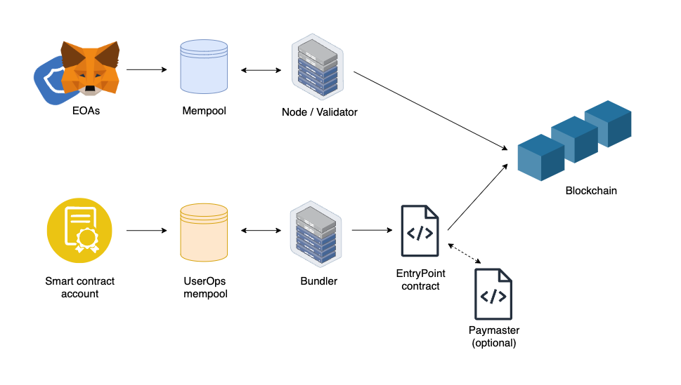
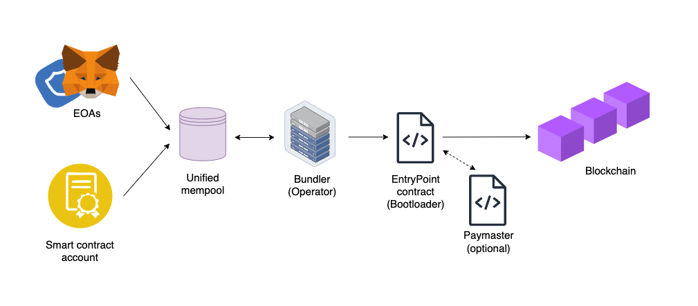
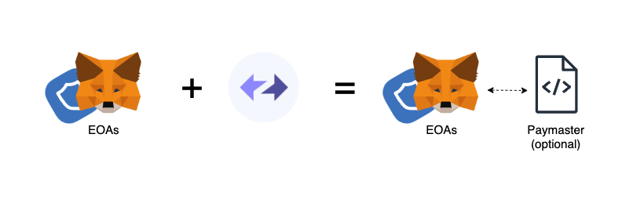
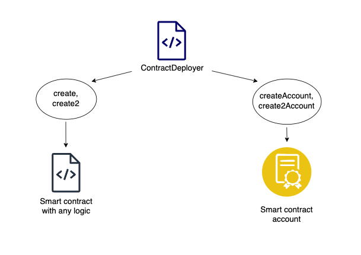
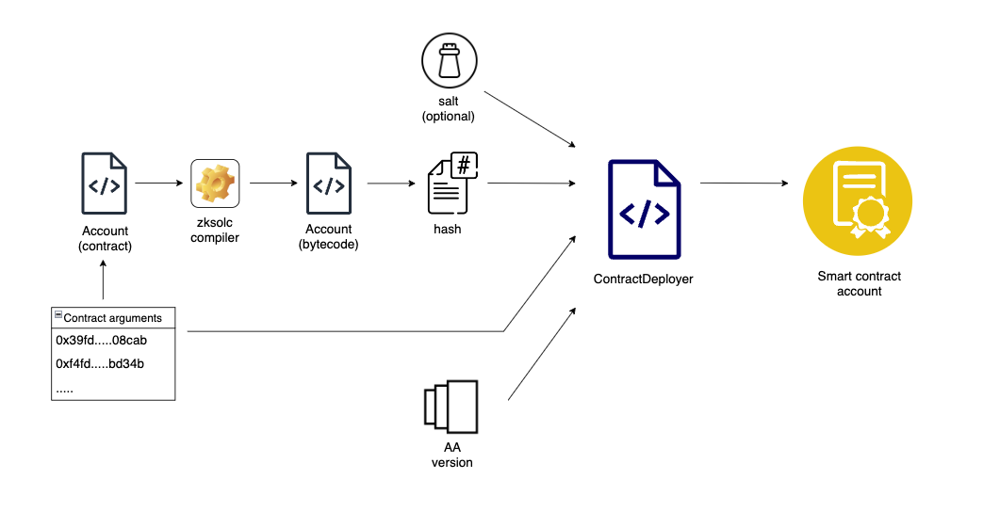
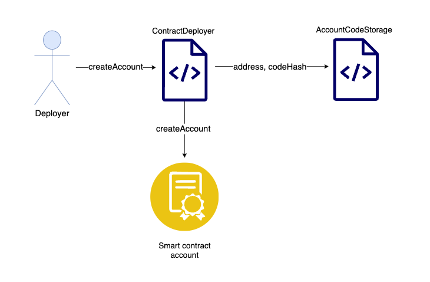
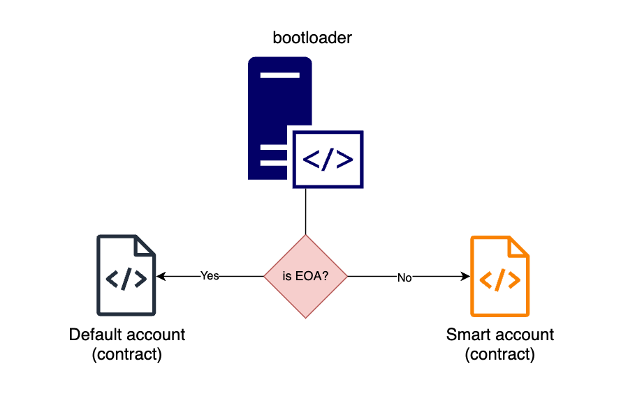
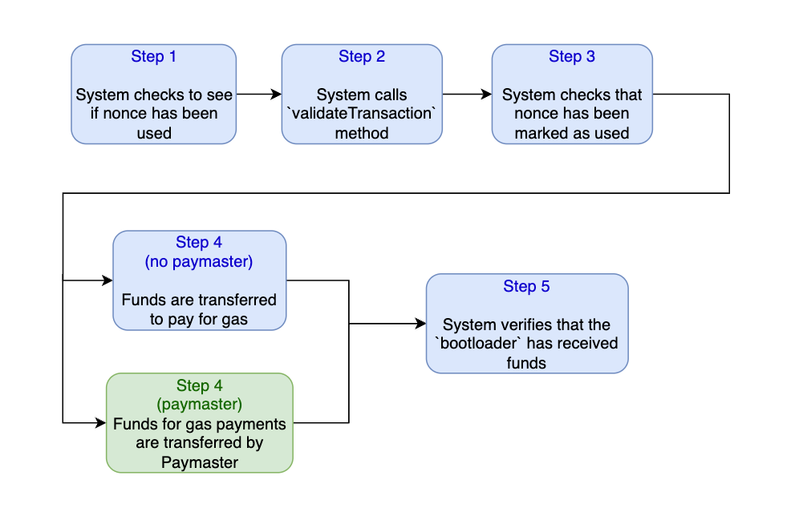
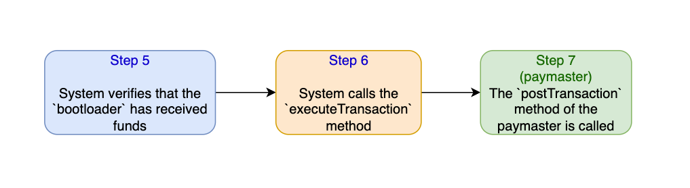
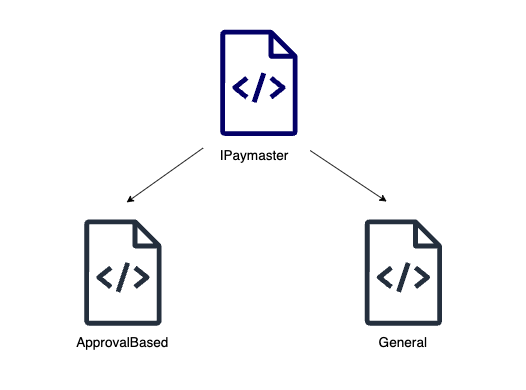

# Native Abstract Accounts vs EIP-4337

**Author:** [Roman Yarlykov](https://github.com/rlkvrv) 🧐

In Ethereum, there are two types of accounts: Externally Owned Accounts (EOA), which can initiate transactions but do not have programmable logic, and smart contracts, which have the ability to execute arbitrary logic but cannot initiate transactions on their own. This leads to a number of challenges when interacting with the blockchain ecosystem and raises the entry barrier for new users.

The first step towards solving this problem is [EIP-4337](https://eips.ethereum.org/EIPS/eip-4337), which introduces the concept of Abstract Accounts (AA) and Smart-contract accounts. According to the [standard](https://github.com/fullstack-development/blockchain-wiki/blob/main/EIPs/erc-4337/README.md), it proposes to combine the advantages of EOA and smart contracts.

Let's recap the main differences between EOA and AA.

|                                        | Externally Owned Accounts (EOA)                                                                     | Smart Contract Accounts                                                                                         |
| -------------------------------------- | ------------------------------------------------------------------------------------------------- | ----------------------------------------------------------------------------------------------------------------------- |
| Transaction initiator signature verification | Transaction signature verification logic is hard-coded in the EVM                                      | Signature verification logic is programmable in the smart contract account                                                 |
| Handling private keys         | Private keys are difficult to store and secure, even for experienced users                      | Alternative methods can be used for transaction signing, such as biometrics or authenticators              |
| Recovery capability             | There is no way to recover a private key. If you lose your private key, you lose your funds | Recovery methods can be implemented in the smart contract, such as social recovery or backup keys |

## High-Level Differences in Transaction Flow

To understand the key differences between these two approaches, let's look at simplified diagrams illustrating the path of a transaction from its initial initiation in a wallet to its inclusion in the blockchain.

### EOA and Smart Account Transactions in Ethereum

EIP-4337 does not require changes to the Ethereum main protocol, but to implement AA, a special service called Bundler is needed. This service is responsible for an alternative mempool's operation for processing and sending transactions to the blockchain. Transactions go through the system contract EntryPoint.sol for validation.

> **Mempool** - storage area for transactions awaiting confirmation and inclusion in a block.



However, this approach has limitations, such as the inability to use Paymaster in conjunction with EOA under EIP-4337.

> **Paymaster** - a smart contract that can pay gas fees in the native currency for users. It can have any payment logic: deducting ERC20 from the user, performing additional checks, or simply sponsoring any transactions without requiring anything in return.

This is problematic because implementing gasless transactions will require integrating a separate service, such as [GSN](https://opengsn.org/) (by the way, this EIP was developed based on its experience).

Another challenge is the complexity of developing such abstract accounts; you will need to choose one of the infrastructure solutions (e.g., [Alchemy](https://accountkit.alchemy.com/)) and deal with their APIs to implement your wallet logic. Moreover, the architecture itself built on EIP-4337 is far from trivial.

### EOA and Smart Account Transactions in zkSync

Now let's see the path a transaction takes in the zkSync solution. In this case, developers had the opportunity to implement native support for Abstract Account and Paymaster without the need for third-party services. Here, all accounts are smart contracts (even EOAs), and in zkSync, any accounts are "first-class citizens," meaning they are collected in a unified Mempool and processed equally.



After the Mempool, transactions are processed and executed by the operator. If compared to Ethereum, the operator here plays the role of a validator and bundler. After that, the transaction enters the bootloader smart contract.

> bootloader - this is the L2 zkSync system smart contract. Essentially, it is the core of the protocol, consolidating the work of all the main system smart contracts of the protocol.

In the context of AA, the bootloader contract is equivalent to EntryPoint. Roughly speaking, at this stage, it determines if there is any additional logic for the account and, if necessary, calls the Paymaster.

Comparative table of EIP-4337 and Native AA zkSync:
| | EIP-4337 | Native AA zkSync |
| --------------------------------- | --------------------------------------------------------- | ------------------------------------------------------------------------------------------------------------------ |
| Integration Level | Not native. Requires additional infrastructure and services | Native. Supported in the blockchain "out of the box" |
| Accounts and Payment Agents | Paymaster support only for smart accounts | All accounts, including EOAs, behave like smart contract accounts and support Paymaster |
| Transaction Flow | Two transaction flows with different logic, two mempools | Unified mempool and transaction flow, regardless of whether the transaction is initiated by EOA or a smart contract account |
| Transaction Formation | Sending UserOperation objects instead of regular transactions | Regular transactions but with additional fields |

Next, let's take a closer look at the implementation of native AAs in zkSync in more detail and in order.


## In-Depth Analysis of Native AAs

### Creating AAs in zkSync

As I mentioned earlier, EOAs in zkSync are also smart contracts. When you connect your EOA to the zkSync network, there won't be any visible difference externally, but under the hood, it's no longer just a wallet; it becomes a basic Smart account. Basic because, out of all the benefits that the account abstraction offers, you can only take advantage of connecting a Paymaster (changing the gas payment flow). However, this is already a significant advantage.



To enjoy all the benefits of the account abstraction, you need to create such an account. The system smart contract `ContractDeployer` is responsible for this (you can view the contract code [here](https://github.com/matter-labs/era-system-contracts/blob/main/contracts/ContractDeployer.sol)).

The zkSync system smart contract ContractDeployer plays a crucial role in deploying smart contracts, including AAs. It provides several methods such as `create` and `create2` for deploying standard smart contracts and `createAccount` and `create2Account` for deploying AAs.

The `create` and `create2` methods are well-known to developers and are responsible for deploying regular smart contracts. The `create2` method, roughly describing its function, allows you to obtain a predictable contract address before deployment (you can even choose a nice one). Following this logic, two methods were also created for creating AAs (with and without the ability to pass salt).



To deploy your implementation of an AA, you will need to:

- Write a smart contract that inherits from the [IAccount interface](https://github.com/matter-labs/era-system-contracts/blob/main/contracts/interfaces/IAccount.sol) and implements the [mandatory methods](https://era.zksync.io/docs/reference/concepts/account-abstraction.html#iaccount-interface).
- Compile the smart contract using zksolc.
- Use [zkSync SDKs](https://era.zksync.io/docs/api/) to configure, deploy, and integrate the smart account into your application.

You can check out tutorials [here](https://github.com/matter-labs/custom-aa-tutorial) and [here](https://era.zksync.io/docs/dev/tutorials/custom-aa-tutorial.html) to understand how to create a simple version of such an account. Therefore, I won't delve into the technical details of deployment and configuration here; I'll only explain the essence of the process.

> Tip: If you are compiling contracts in a Hardhat project, don't forget to enable the `isSystem: true` flag in the zksolc compiler settings.

Returning to the methods of the ContractDeployer contract, to create an account, you will need:

- Salt (required only for `create2Account`).
- The hash of the bytecode of the smart contract with AA logic (in zkSync, the hash of the bytecode is always used for deployment, not the bytecode itself).
- Arguments for the constructor of your AA (any values you want to set at deployment, e.g., addresses of accounts for creating a multisig).
- AA version; currently, there is only one version, `Version1` (you can choose `None`, but this value is mainly for addresses whose role could not be determined, and you won't be able to do anything with such an account).



```solidity
    function createAccount(
        bytes32 /** */,
        bytes32 _bytecodeHash, // bytecode's hash of our account's version
        bytes calldata _input, // values for the constructor 
        AccountAbstractionVersion _aaVersion // Version of the account
    ) external payable returns (address newAddress);
```

At the output, you get the address of your smart account, which can now be used to make transactions (using the [zkSync API](https://era.zksync.io/docs/api/)).

### How to Determine the Transaction Initiator?

In the context of working with Abstract Accounts (AAs) in zkSync, it's important to understand how the system identifies the transaction initiator. This process is particularly critical for integration with Externally Owned Accounts (EOAs).

Here, it's straightforward. `ContractDeployer` registers the bytecode hash of each contract it deploys in the system contract `AccountCodeStorage`. This can be likened to recording in a mapping of the type address => bytecodeHash.

> **AccountCodeStorage** - a system smart contract that stores hashes of the bytecode of deployed smart contracts.



Thus, it's easy to check if the transaction initiator's address has deployed code. If it doesn't, and the calling party is not a system smart contract, then it's an EOA (the `isEOA(addr)` method in the `bootloader` contract).


```solidity
    /// @dev Checks whether an address is an EOA (i.e. has not code deployed on it)
    /// @param addr The address to check
    function isEOA(addr) -> ret { ... } // bootlader code fragment
```

When the transaction initiator is an EOA, the zkSync system simulates Ethereum account behavior by calling the `DefaultAccount` smart contract. If the caller has deployed code and supports an AA version, it indicates that it's a Smart account.



This is why in zkSync, EOAs are also considered smart contracts. The logic of an EOA is always managed by the `DefaultAccount` contract (you can view the contract code [here](https://github.com/matter-labs/era-system-contracts/blob/main/contracts/DefaultAccount.sol)). Its main purpose is to behave like a regular EOA while having the ability to pay transaction fees through a Paymaster. The AA version (AccountAbstractionVersion) reflects the implementation for both Smart accounts and Default accounts (they have the same basic logic and all the mandatory methods).

Therefore, the transaction initiator can always be classified into one of the following categories:

- **EOA:** Direct user control.
- **Smart account:** Advanced management functions, AA implementation.
- **Smart contract:** Autonomous code on the blockchain.
- **System contract:** Specialized system contracts with service logic, typically called only within the system.
- **AccountAbstractionVersion.None:** All other transaction initiators not defined in the system.

Depending on who initiated the transaction, further logic is executed.

### Transaction Validation and Execution Process

Let's explore how transaction validation and execution work in zkSync for transactions initiated by Smart accounts. Keep in mind that for EOAs, the process is similar, except that all mandatory methods for EOAs are already implemented and fixed in the `DefaultAccount` contract.

The [mandatory methods](https://era.zksync.io/docs/reference/concepts/account-abstraction.html#iaccount-interface) are `validateTransaction` and `executeTransaction`. For Smart accounts, you can implement any logic in these methods, but this doesn't mean there are no restrictions; basic security must be maintained.

The transaction validation process is as follows:

1. The system checks that the transaction `nonce` has not been used.
   > **Nonce** stands for "number used once." It is a number used in cryptography to ensure the security and uniqueness of each transaction.
2. The `validateTransaction` method of the account is called, where any logic you implement can be applied. For example, here you should verify the signature of the calling party.
3. The system checks that you have marked the `nonce` as used.
4. (**Paymaster not specified in the transaction**) Funds are transferred to pay for the `bootloader` contract.
   
   `4`. (**Paymaster specified in the transaction**) A method is called to handle its logic and pay for the transaction (details will be explained later).

5. The system checks that the `bootloader` has received enough funds to cover the transaction gas.



After these actions, the transaction is executed. Here, the second mandatory method (`executeTransaction`) is called, and the order is as follows:

6. `executeTransaction` is called, where you can handle a call to a system contract (e.g., for contract deployment) or perform any other call.
7. (**Only when Paymaster is involved in the transaction**) The `postTransaction` method of the Paymaster contract is called. This step is usually used to refund unused gas fees.



#### Some Limitations

To protect the system from DoS attacks, the verification stage has the following limitations:

- Smart account logic can only interact with slots owned by the account. This definition includes not only slots physically located in the account's smart contract but also some fields of other smart contracts (e.g., ERC20 token balances or the amount allowed for withdrawal).

- Account logic cannot use contextual variables (e.g., `block.number`).

- It is required that the account increases the `nonce` by 1. This limitation is only necessary to maintain hash collision resistance for transaction hashes.
   > **Note:** In the future, this requirement will be removed to allow more general use cases (e.g., privacy protocols).

### Integrating Paymaster and Gasless Transactions

Before diving into the details of Paymaster functionality, let's understand how zkSync determines the transaction fee payment method.

It's quite simple: during transaction formation, two fields are added to it:

- `paymaster` - this is a `uint256` value. If the transaction involves a Paymaster, you can extract its address from this value; otherwise, it will be 0.
- `paymasterInput` - this is an array of type `bytes`, where the first 4 bytes indicate the Paymaster type, followed by additional data.

**What types are we talking about?** There are two main types of Paymasters: **ApprovalBased** and **General**.

The **ApprovalBased** Paymaster is another advantage of the native implementation of such a solution; I'll explain it shortly.

It takes three arguments:

- ERC20 token address.
- The minimum `allowance` value that needs to be set before transferring funds.
- Additional data that can be passed if necessary.

```solidity
    function approvalBased(address _token, uint256 _minAllowance, bytes calldata _innerInput) external;
```

**What does this provide?** It allows us to calculate the gas volume for the transaction in advance and, consequently, the required amount of ERC20 tokens to pay for it. After determining this amount, we set the minimum `allowance` for the Paymaster, giving the system the green light to call `approve` on our behalf. This allows the Paymaster to easily deduct the necessary tokens on behalf of the transaction initiator 🤯, isn't that cool?

The **General** Paymaster accepts only one argument (input) that allows you to pass arbitrary values to it. This type of Paymaster can perform any logic you specify, including scenarios where no prior permission to spend tokens is required.



#### Creating a Paymaster

To create a Paymaster, you need to inherit from the [IPaymaster](https://github.com/matter-labs/era-system-contracts/blob/main/contracts/interfaces/IPaymaster.sol) interface and implement key methods, such as `validateAndPayForPaymasterTransaction` (mandatory) and `postTransaction` (optional), each of which plays a crucial role in the transaction payment logic.

The `validateAndPayForPaymasterTransaction` method determines whether the Paymaster is ready to pay for the transaction. It takes three parameters: the transaction hash, the signed EOA hash, and the transaction data. If the Paymaster agrees to pay, the method sends the operator a native currency equal to or exceeding `tx.gasPrice * tx.gasLimit`. Additionally, the method returns a context for calling `postTransaction`.

```solidity
    function validateAndPayForPaymasterTransaction(
        bytes32 _txHash, // tx hash
        bytes32 _suggestedSignedHash, // tx hash, signed by EOA
        Transaction calldata _transaction // tx data
    ) external payable returns (bytes4 magic, bytes memory context);
```

The `postTransaction` method is optional and is triggered after the completion of the transaction. Unlike EIP-4337, its invocation is not guaranteed: for example, if a transaction fails due to insufficient gas, the method is not called.

`postTransaction` takes four arguments: the context created by `validateAndPayForPaymasterTransaction`, transaction information, an indicator of its success, and the maximum gas amount to be refunded to the Paymaster.

```solidity
    function postTransaction(
        bytes calldata _context, // The context passed from the method validateAndPayForPaymasterTransaction
        Transaction calldata _transaction, // tx data
        bytes32 _txHash, // tx hash
        bytes32 _suggestedSignedHash, tx hash, signed by EOA
        ExecutionResult _txResult, // Результат выполнения транзакции
        uint256 _maxRefundedGas // Gas amount, which may be passed to the Paymaster smart contract
    ) external payable;
```

Note: These methods are called only by the system contract `bootloader`.

You can find examples of creating simple Paymasters [here](https://github.com/matter-labs/custom-paymaster-tutorial) and [here](https://era.zksync.io/docs/dev/tutorials/custom-paymaster-tutorial.html).

Deploying a Paymaster does not require interaction with system contracts; it is deployed like a standard smart contract. Paymaster parameters are prepared for inclusion in a transaction through the [zkSync API](https://era.zksync.io/docs/api/).

## Conclusion

In conclusion, it's worth noting that native support for Abstract Accounts in zkSync represents a simpler and more intuitive architectural solution compared to EIP-4337. Creating and integrating Smart accounts in such a paradigm is somewhat easier, and testing is also simplified – all you need is the zkSync development environment, without the need for additional services like bundlers.

It's also important to mention that Paymasters can be easily integrated with regular EOAs, with the ability to avoid unnecessary transactions for approving the spending of ERC20 tokens.

It's worth noting that features like paying fees in ERC20 tokens or `multicall` (combining multiple transactions into one) are just the tip of the iceberg; a Smart account can have a very useful and diverse set of functions. I believe we will see many different use cases for it.

## Links

- [Documentation](https://era.zksync.io/docs/reference/concepts/account-abstraction.html)
- [Repository with system smart contracts](https://github.com/matter-labs/era-system-contracts/blob/main/contracts/interfaces/IPaymaster.sol)
- [Audit, including a description of how system smart contracts work](https://github.com/code-423n4/2023-10-zksync/blob/main/docs/Smart%20contract%20Section/System%20contracts%20bootloader%20description.md)
- [zkSync era API/SDKs](https://era.zksync.io/docs/api/)
- [Custom AA tutorial](https://github.com/matter-labs/custom-aa-tutorial)
- [Custom Paymaster tutorial](https://github.com/matter-labs/custom-paymaster-tutorial)
- [Useful tutorials from the documentation](https://era.zksync.io/docs/dev/tutorials.html)
- [Overview video of AA in zkSync](https://www.youtube.com/watch?v=M8p5ucnOH5E)
