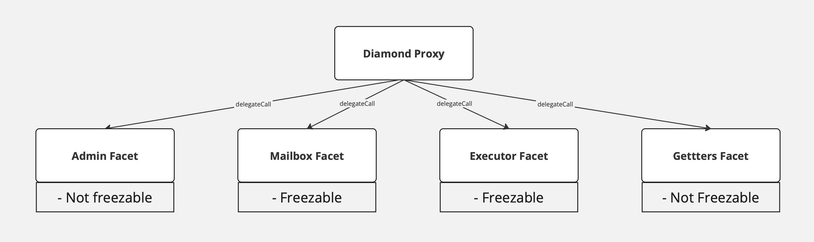
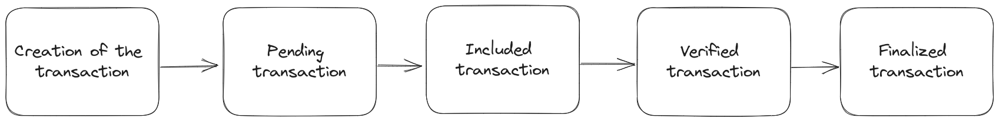
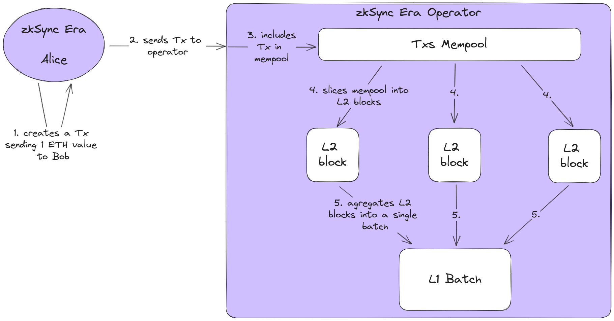
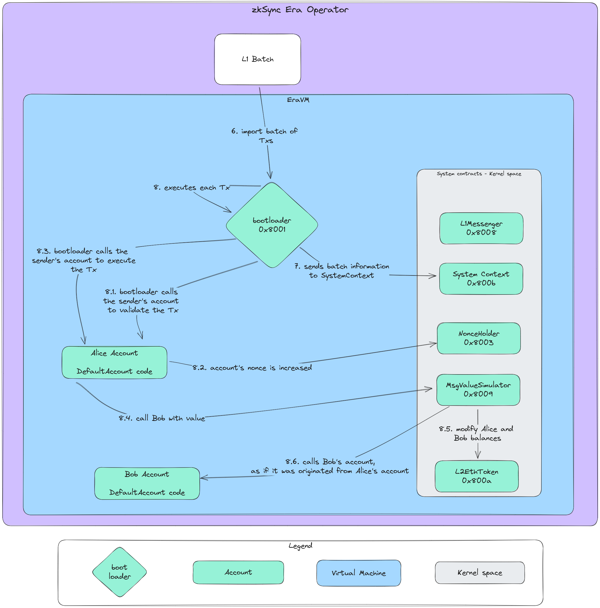
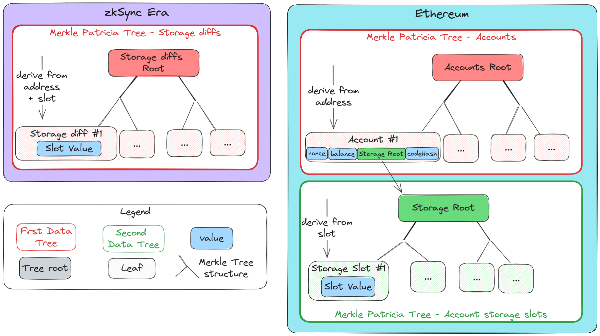
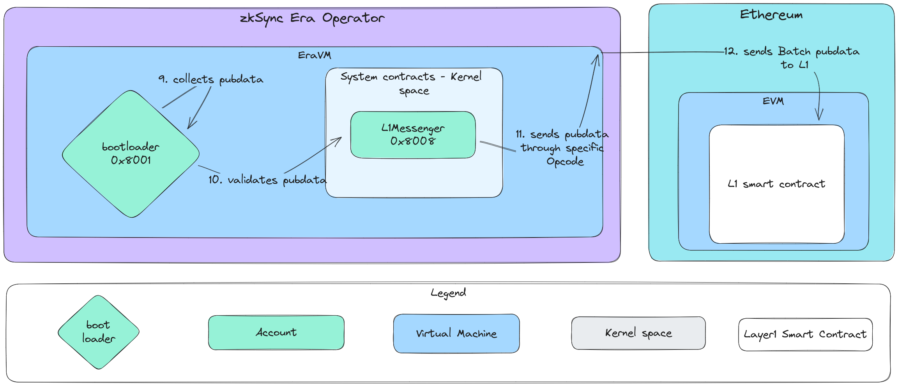
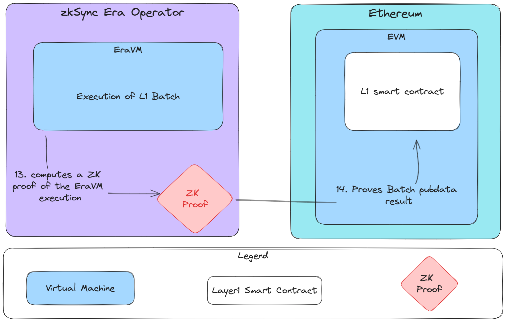
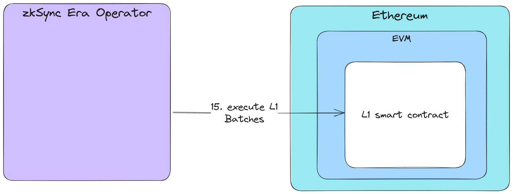

# zkSync Era Architect

**Author:** [Roman Yarlykov](https://github.com/rlkvrv) 🧐

This is an inside look at the zkSync Era protocol, its main task is to delve into the technical details, understand what components it consists of, how zk-rollups are formed and transactions are processed. We will figure out which logic is executed on Layer 2 and which on Layer 1, and also take a brief look at what nodes (operators) do on the backend.

## System Smart Contracts

Here I will provide a brief overview of the main system smart contracts on both Layer 2 and Layer 1. These are the foundation of the protocol, ensuring security and decentralization. You can quickly skim through them without going into details, as their use will become clearer when reading the [Transaction Flow](#transaction-flow) section.

### Layer 2 Smart Contracts

L2 system contracts are located in the core of the protocol, have certain privileges, and are pre-deployed at the creation of the genesis block (except for the `bootloader` contract). Updating their code is only possible through a system update, managed from L1.

L2 system contracts can be found in [this](https://github.com/matter-labs/era-system-contracts/tree/main) repository. Below is a description not for all contracts, but only for key ones that are necessary for understanding the system as a whole. Some of them also have public functions for developers. A more detailed description can be found in [this](https://github.com/code-423n4/2023-10-zksync/blob/main/docs/Smart%20contract%20Section/System%20contracts%20bootloader%20description.md) audit.

#### ContractDeployer

[ContractDeployer](https://github.com/matter-labs/era-system-contracts/blob/main/contracts/ContractDeployer.sol) is a contract used for deploying new smart contracts. It ensures that the bytecode of each deployed contract is known and determines the address of the derived contract.

#### L1Messenger

[L1Messenger](https://github.com/matter-labs/era-system-contracts/blob/main/contracts/L1Messenger.sol) is a contract used for sending messages from zkSync to Ethereum. These can be transactions, smart contract calls, or state checks.

#### NonceHolder

[NonceHolder](https://github.com/matter-labs/era-system-contracts/blob/main/contracts/NonceHolder.sol) is responsible for storing `nonce` of transactions and smart contract deployments.

#### DefaultAccount

[DefaultAccount](https://github.com/matter-labs/era-system-contracts/blob/main/contracts/DefaultAccount.sol) is a template for accounts on which a user's smart contract has not been deployed. It provides a basic level of account abstraction. When interacting with a standard account, it mimics the behavior of an externally owned account (EOA), always returning a successful execution flag and no data, which corresponds to the behavior of standard EOAs in Ethereum unless the call is made from `bootloader`.

#### Bootloader

[Bootloader](https://github.com/matter-labs/era-system-contracts/blob/main/bootloader/bootloader.yul) is the core of the system that manages the execution of L2 transactions. It is specialized software that is not deployed as a regular contract but rather runs inside a node as part of the execution environment.

The bootloader can be seen as an analogue of EntryPoint from EIP4337, processing batches of transactions as a whole, rather than individually. This increases efficiency by reducing the need to initiate a separate validation process for each transaction. The validator stores transactions in an array, which is then written to the bootloader's memory and executed. To avoid the possibility of rolling back the entire process due to a failure in a single transaction, the bootloader uses a softer failure condition known as `near call panic`.

Another important role of the bootloader is that it will call the AA smart contract if it is deployed; otherwise, [DefaultAccount](#defaultaccount), which behaves like a regular EOA, will be called. This allowed the protocol to combine EOA and AA in a single account.

The bootloader's code hash is stored on L1 and can only be changed as part of a system update. Unlike system contracts, the bootloader's code is not physically stored on L2, and its address is formal, used only to provide the `msg.sender` value. Accessing the bootloader's address actually calls the code of an empty contract (EmptyContract).

The functionality of the bootloader is divided between a large Yul file and the [BootLoaderUtilities](https://github.com/matter-labs/era-system-contracts/blob/main/contracts/BootloaderUtilities.sol) contract.

#### SystemContext

[SystemContext](https://github.com/matter-labs/era-system-contracts/blob/main/contracts/SystemContext.sol) is a contract used for storing and updating contextual variables within a block, transaction, or system. SystemContext is closely integrated with bootloader to ensure data consistency in the blockchain and maintain system states in an up-to-date and coordinated manner.

#### MsgValueSimulator

[MsgValueSimulator](https://github.com/matter-labs/era-system-contracts/blob/main/contracts/MsgValueSimulator.sol) is used to simulate transactions with `msg.value`, using the zkEVM opcode - [mimicCall](https://github.com/code-423n4/2023-10-zksync/blob/main/docs/Smart%20contract%20Section/System%20contracts%20bootloader%20description.md#only-for-kernel-space) to continue the call with the original `msg.sender`. It handles parameters such as transfer value and recipient address, and "out of the box" provides protection against reentrancy attacks. If the transfer attempt fails, the contract performs a `revert`, mimicking standard Ethereum behavior.

#### L2EthToken

[L2EthToken](https://github.com/matter-labs/era-system-contracts/blob/main/contracts/L2EthToken.sol) is necessary for executing balance changes when simulating `msg.value` behavior in Ethereum. It is used by the [bootloader](#bootloader) and system contracts [MsgValueSimulator](#msgvaluesimulator) and [ContractDeployer](#contractdeployer).

#### Compressor

[Compressor](https://github.com/matter-labs/era-system-contracts/blob/main/contracts/Compressor.sol) - one of the most expensive resources for rollup is data availability, so to reduce user costs, the compressor compresses published pubdata in several ways:

-   compressing published contract bytecodes
-   compressing blockchain state diffs (differences)

This contract contains utility methods used to verify the correctness of bytecode or state diffs compression.

#### Contracts Replacing EVM Precompilations

Currently, [5 such contracts](https://github.com/matter-labs/era-system-contracts/tree/main/contracts/precompiles) have been implemented:

-   **Ecrecover** - This is an implementation of the `ecrecover` precompiled contract. The contract accepts call data in the same format as the EVM precompiled contract, meaning the first 32 bytes are the hash, the next 32 bytes are `v`, the following 32 bytes are `r`, and the last 32 bytes are `s`. It also checks the input data according to the same rules as the EVM precompiled contract: `v` must be either 27 or 28; `r` and `s` must be less than the order of the curve.

-   **SHA256 & Keccak256** - Unlike Ethereum, keccak256 is a precompilation (not an opcode) in zkSync. The contracts take input data and transform it into a format expected by the zk-scheme.

-   **EcAdd & EcMul** - These precompilations mimic the behavior of EcAdd and EcMul EVM precompilations.

### Layer 1 Smart Contracts

L1 system contracts are located in [this](https://github.com/matter-labs/era-contracts/tree/main) repository. Below is their brief description, for more details [click here](https://github.com/code-423n4/2023-10-zksync/blob/main/docs/Smart%20contract%20Section/L1%20smart%20contracts.md#mailboxfacet).

#### DiamondProxy

[DiamondProxy](https://github.com/matter-labs/era-contracts/blob/main/ethereum/contracts/zksync/DiamondProxy.sol) is the entry point for L1. This contract implements the Diamond Proxy pattern according to [EIP-2535](https://eips.ethereum.org/EIPS/eip-2535) with some modifications.

One of the differences from the reference implementation of Diamond Proxy is the ability to freeze access. Each facet has an associated parameter indicating whether its access can be frozen.

_Important!_ Privileged participants can freeze the Diamond (but not a specific facet), and all facets with the `isFreezable` marker must be inaccessible until the manager or administrator unfreezes the Diamond.



The diamond proxy template is very flexible and extendable. Currently, it allows dividing implementation contracts according to their logical meaning, removes the limitation on the bytecode size for each contract, and implements security functions such as freezing.

Implementation contracts for various protocol modules (facets):

#### AdminFacet

[AdminFacet](https://github.com/matter-labs/era-contracts/blob/main/ethereum/contracts/zksync/facets/Admin.sol) - Manages changing privileged addresses (Governor and Validator), altering system parameters (L2 `bootloader` bytecode hash, verifier address, verifier parameters, etc.), and controls freezing/unfreezing and performing updates in DiamondProxy.

AdminFacet is controlled by two entities:

**Governance** - A separate smart contract capable of making critical changes in the system, such as protocol updates. This contract is controlled by two multisigs: one managed by the Matter Labs team and another will be a multisig with members of the crypto community. Only together they can perform an immediate update, while the Matter Labs team can only schedule an update with a delay.

**Admin** - A multisig managed by the Matter Labs team, which can perform non-critical changes in the system, such as granting permissions to validators.

_Important!_ Admin is the same multisig as the owner of the Governance contract.

#### MailboxFacet

[MailboxFacet](https://github.com/matter-labs/era-contracts/blob/main/ethereum/contracts/zksync/facets/Mailbox.sol) - manages the connection between L1 and L2, ensuring the transfer of messages, a bridge for transferring ether to L2, and a mechanism to counter censorship. L1 -> L2 communication is done through a transaction request on L1 followed by its execution on L2, where the validator processes the request and marks it in the L1 priority queue. L2 -> L1 communication differs in that it only transfers information, not requiring transaction execution on L1.

_Important!_ The contract does not store or transfer any assets (ETH, ERC20 tokens, or NFTs).

#### ExecutorFacet

[ExecutorFacet](https://github.com/matter-labs/era-contracts/blob/main/ethereum/contracts/zksync/facets/Executor.sol) is a contract that processes incoming L2 batches, ensures transaction data availability, and verifies the validity of zk-proofs.

The state transition process is divided into three stages:

-   commitBatches (batch commitment)
-   proveBatches (zk-proof verification)
-   executeBatches (batch execution and state finalization)

To identify and process different types of logs, including the root hash of the L2 -> L1 log tree, public data, and state diffs hashes - keys from the SystemLogKey enumeration are used. These logs are processed during batch commitment, ensuring consistency and confirmation of state changes.

```solidity
    enum SystemLogKey {
        L2_TO_L1_LOGS_TREE_ROOT_KEY,
        TOTAL_L2_TO_L1_PUBDATA_KEY,
        STATE_DIFF_HASH_KEY,
        PACKED_BATCH_AND_L2_BLOCK_TIMESTAMP_KEY,
        PREV_BATCH_HASH_KEY,
        CHAINED_PRIORITY_TXN_HASH_KEY,
        NUMBER_OF_LAYER_1_TXS_KEY,
        EXPECTED_SYSTEM_CONTRACT_UPGRADE_TX_HASH_KEY
    }
```

#### GettersFacet

[GettersFacet](https://github.com/matter-labs/era-contracts/blob/main/ethereum/contracts/zksync/facets/Getters.sol) is a separate component that provides methods for reading data (view and pure functions) and does not involve state-changing operations. This facet also implements the "diamond loupe" functionality, which simplifies the management of other facets by providing information about them, such as their addresses and functions.

_Important!_ GettersFacet is not subject to freezing to ensure constant access to data reading functions.

### Other Important Layer 1 Smart Contracts

#### Verifier

[Verifier](https://github.com/matter-labs/era-contracts/blob/2491d564362005f9ea4b17aca1b98b631889b7a5/ethereum/contracts/zksync/Verifier.sol) - This smart contract is a modified [PLONK](https://eprint.iacr.org/2019/953.pdf) verifier, specially adapted for use in the zkSync Era network. It optimizes the process of verifying cryptographic proofs, ensuring efficient and reliable verification of the correctness of computations.

#### Bridges

[Bridges](https://github.com/matter-labs/era-contracts/tree/main/ethereum/contracts/bridge) in zkSync are separate contracts from Diamond, designed to facilitate communication between L1 and L2 and manage assets. They allow for locking assets on one layer and creating requests for their issuance on the other layer. For native ether and other ERC20 tokens, there are specialized bridges such as L1ERC20Bridge and L2ERC20Bridge, as well as L1WethBridge and L2WethBridge for WETH. All bridge operations are controlled through the Governance contract.

#### Governance

The [Governance](https://github.com/matter-labs/era-contracts/blob/main/ethereum/contracts/governance/Governance.sol) contract in zkSync Era manages calls for all controlled contracts on both L1 and L2. It is mainly used for system updates and changing critical parameters. The contract has settings for a minimum delay for executing calls. System updates occur in two stages: planning (with full data transparency or through a "shadow" update for urgent fixes) and executing the update (with a delay or instantly - the latter is possible only with approval from the Security Council). Both the Owner and the Security Council can cancel the update before its execution.


#### ValidatorTimelock

The [ValidatorTimelock](https://github.com/matter-labs/era-contracts/blob/main/ethereum/contracts/zksync/ValidatorTimelock.sol) contract serves as an intermediary between the validator's account (EOA) and the main zkSync contract. Its primary purpose is to provide a delay in executing transaction batches without altering the main zkSync contract. zkSync monitors network activity and can freeze the network upon detecting suspicious actions, allowing for investigation and remedial actions before resuming operations. This is a temporary solution to prevent significant damage from a validator key leak during the network's Alpha stage. It is managed by the Matter Labs multisig, just like the Governance contract.

## Transaction Flow

The best way to understand the protocol's architecture is to look at the stages a typical transaction goes through, from its creation to final confirmation on Layer 1 and Layer 2.

Transactions in zkSync Era are processed, executed, and batched on Layer 2 (zkSync), while proof of their authenticity and data that allows the complete reconstruction of the L2 state are transmitted, verified, and confirmed at the Layer 1 level (Ethereum).

To facilitate interaction with L1, and to integrate ZKP schemes, there are system smart contracts on both L1 and L2. Let's consider a high-level workflow of a transaction from creation on L2 to confirmation on L1:



1. Transaction Creation
2. Transaction **Pending**
3. Transaction **Included**
4. Transaction **Verified**
5. Transaction **Finalized**

Thus, in zkSync Era, a transaction can have 4 statuses: **Pending**, **Included**, **Verified**, **Finalized**.

_Note:_ The transaction execution overview is based on [this article](https://blog.quarkslab.com/zksync-transaction-workflow.html), but it is presented more concisely with additional comments and code links - for understanding the system's operation without delving into certain details.

### Pending Status

Let's imagine Alice wants to send some ETH to Bob. First, a standard Ethereum transaction is formed with familiar fields:

| Field Name             | Description                                                              | Example of Alice's Transaction                                 |
| ---------------------- | ------------------------------------------------------------------------- | ------------------------------------------------------------- |
| `from`                 | sender's address, which will sign the transaction                        | Alice's Address                                               |
| `recipient`            | recipient's address                                                      | Bob's Address                                                 |
| `signature`            | confirmation that the transaction is authorized by the sender            | Signature generated by Alice using her key pair               |
| `nonce`                | sequentially increasing counter                                          | Alice's account nonce                                         |
| `value`                | amount of Ether (ETH) transferred from the sender to the recipient, in wei| 1 ETH (1 * 10<sup>18</sup>)                                   |
| `input data`           | arbitrary data, mainly used for smart contract calls                     | Empty field, as Bob's account is an EOA                       |
| `gasLimit`             | maximum amount of gas units the transaction should consume               | Depends on the network state                                  |
| `maxPriorityFeePerGas` | maximum fee per gas unit for the transaction                             | Depends on the network state                                  |

The transaction is then sent to an L2 node using the standard Ethereum JSON-RPC API (method `eth_sendRawTransaction`).

_Note:_ A node in zkSync is referred to as an "operator."

zkSync then uses its own L2-specific fields requested via the [zks_getTransactionDetails](https://era.zksync.io/docs/api/api.html#zks-gettransactiondetails) method:

| Field Name             | Description                                                               | Example of Alice's Transaction                                 |
| ---------------------- | -------------------------------------------------------------------------- | ------------------------------------------------------------- |
| `is_l1_originated`     | boolean indicating whether the transaction is from L1 or not              | `False`: transaction goes from Alice's L2 account to Bob's L2 account |
| `status`               | current status of the transaction                                         | Depends on the transaction workflow stage                    |
| `fee`                  | fee amount for executing and validating the transaction                  | Depends on the network state                                  |
| `initiator_address`    | initiator of the transaction (i.e., the account that will pay the fee)    | Alice's address                                               |
| `received_at`          | timestamp when the operator considered the transaction                   | Depends on the time Alice sent the transaction               |
| `eth_commit_tx_hash`   | Ethereum transaction hash where the transaction data was sent to L1       | Depends on the transaction batch status                      |
| `eth_prove_tx_hash`    | Ethereum transaction hash where the transaction data was verified on L1   | Depends on the transaction batch status                      |
| `eth_execute_tx_hash`  | Ethereum transaction hash where the transaction was executed on L1        | Depends on the transaction batch status                      |

_Important!_ Transactions in zkSync can be of several types, depending on the type of transaction, it may have other additional fields.

As soon as the operator receives Alice's transaction, it is added to the transaction mempool. The transaction status is set to "**Pending**".

### Included status

At this stage, the operator takes transactions from the mempool and forms "L2 blocks" containing transactions with metadata only applicable in L2. This speeds up validation and improves user experience, as wallets instantly show the transaction status.

Transactions that are too large might be excluded at this stage to prevent mempool overflow. Transactions with insufficient gas fees may be temporarily moved to a separate structure `stashed_accounts` until the gas price decreases. Creating an L2 block takes less than a second.

Meanwhile, L1 transactions are processed separately by the mempool but will eventually end up in the L1 batch, as they affect the state change on L2. The Rust code for the temporary mempool storage can be found [here](https://github.com/matter-labs/zksync-era/blob/main/core/lib/mempool/src/mempool_store.rs).

_Important!_ At this stage, only sorting and preliminary preparation of transactions for forming an L1 batch occurs.



After being included in an L2 block, the transaction status changes to "**Included**". Currently, this also takes less than a second.

#### Execute Transaction

This is the most significant, complex, and interesting stage. At this point, the transaction will be executed on the zkEVM or EraVM virtual machine. Here we come to [Layer 2 smart contracts](#layer-2-smart-contracts).

The first step is that the L1 batch formed in the previous stage reaches the system contract [bootloader](https://github.com/matter-labs/era-system-contracts/blob/main/bootloader/bootloader.yul) - this smart contract is special: it is the entry point of EraVM and is responsible for executing all transactions in the provided L1 batch (although it is not deployed anywhere and is only called during execution).

First, `bootloader` calls the [SystemContext](https://github.com/matter-labs/era-system-contracts/blob/main/contracts/SystemContext.sol) smart contract to set context variables such as `block.timestamp`, `block.number`, etc., followed by the following steps:

-   Verifying the correct formation of the transaction.
-   `bootloader` calls the sender's account (i.e., Alice's) to check the transaction using the `validateTransaction` function.
    -   The [NonceHolder](https://github.com/matter-labs/era-system-contracts/blob/main/contracts/NonceHolder.sol) system contract is called to increment the account's `nonce`.
    -   The [DefaultAccount](https://github.com/matter-labs/era-system-contracts/blob/main/contracts/DefaultAccount.sol) code attached to the sender's account checks the authenticity of the transaction signature.
-   If the transaction is valid, the bootloader calls the sender's account to pay for the transaction execution using the `payForTransaction` function.
-   If the transaction fee is paid, the bootloader calls the sender's account to execute the transaction using the `executeTransaction` function.
    -   The DefaultAccount contract code executes the transaction.
-   `bootloader` refunds the sender for any unused gas.

In our case (Alice sending ETH to Bob), the [MsgValueSimulator](https://github.com/matter-labs/era-system-contracts/blob/main/contracts/MsgValueSimulator.sol) smart contract is also called for handling `msg.value`. This contract will modify Alice's and Bob's ETH balances in another system contract [L2EthToken](https://github.com/matter-labs/era-system-contracts/blob/main/contracts/L2EthToken.sol). It calls Bob's account, setting Alice's account as the sender. This is done using a special opcode of the EraVM operation called `mimic_call`, which allows impersonating other accounts by changing the `msg.sender` value of any transaction.

_Important!_ This opcode relates to [protocol kernel operations](https://github.com/code-423n4/2023-10-zksync/blob/main/docs/Smart%20contract%20Section/System%20contracts%20bootloader%20description.md#only-for-kernel-space) and cannot be called externally.

The diagram below shows the entire flow of executing Alice's ether transfer transaction to Bob at the L2 level, excluding gas operations.


Executing transactions in EraVM generates `pubdata` (public data). These data are stored on L1 (Ethereum) and allow the complete reconstruction of the zkSync Era state. To optimize gas fees for storing data on Ethereum, they are compressed before being sent to L1 by the [Compressor](https://github.com/matter-labs/era-system-contracts/blob/main/contracts/Compressor.sol) contract.

zkSync data are divided into four categories:

1. L2 logs in L1: The "provable" part of the connection from L2 to L1, associated with the proof of EraVM execution.
2. L2 messages in L1: Long messages that cannot be sent in the log. Each is associated with an L2 log in L1.
3. Smart contract bytecodes: Bytecode deployed in L2 smart contracts. Each is associated with an L2 log in L1.
4. Storage entries: Data about the state of storage slots in L2 smart contracts (remember, all accounts in zkSync are smart contracts).

More about this [here](https://github.com/code-423n4/2023-10-zksync/blob/main/docs/Smart%20contract%20Section/Handling%20pubdata%20in%20Boojum.md).

Returning to Alice's transaction, an interesting category of `pubdata` are the storage entries, also called **storage diffs** (differences in storage). The changed storage slots in our case are Alice's and Bob's balances in the L2EthToken system contract when Alice sends 1 ETH to Bob.

zkSync Era uses a state-diff-based approach to implement rollup. This means that state changes are published at the L1 (Ethereum) level in a way that ensures data availability. Ethereum uses a two-level tree structure, where data about storage slots are linked to the account's address (first level of the tree), and then to the storage slot number (second level).

Unlike Ethereum, the tree structure in zkSync is qualified as "flat." This is a single-level tree where data are written into derived slot keys. These derived keys are calculated by hashing the storage slot number and the address of the account associated with that slot: `H(Slot number, Account)`.

This simplifies the data storage structure, reducing the number of required levels and easing the processing of state changes. The main goal of this approach is to provide more efficient and scalable data management in the context of rollup.



After all L1 batch data (pubdata) are compressed, they are sent to the [L1Messenger](https://github.com/matter-labs/era-system-contracts/blob/main/contracts/L1Messenger.sol) system contract. This contract checks that the data are consistent and were compressed correctly. If the data are valid, the compressed data are stored in the zkSync smart contract on L1 using a specific opcode for EraVM - `to_l1`. This step is called "L1 batch commitment" and is performed by calling the `commitBatches` function of the [ExecutorFacet](https://github.com/matter-labs/era-contracts/blob/main/ethereum/contracts/zksync/facets/Executor.sol) smart contract on L1.

```solidity
    function commitBatches(
        StoredBatchInfo memory _lastCommittedBatchData,
        CommitBatchInfo[] calldata _newBatchesData
    ) external override nonReentrant onlyValidator { ... }
```

The hash of this L1 transaction will be displayed in zkSync nodes as the value of the `eth_commit_tx_hash` field associated with the L2 transaction details. Once the L1 batch data are stored on L1, all transactions in this batch receive the "**Included**" status, and the L1 batch itself gets the "**Committed**" status.



### Verified Status

The next step in Alice's transaction workflow is the verification of the transaction. A transaction is considered "verified" if the L1 batch it is included in has been verified in the L1 smart contract.

In zkSync Era, a Zero-Knowledge Proofs (ZKP) system is used for scaling and securing transactions on the second layer (L2), developed independently by Matter Labs. This system is part of the [Boojum](https://zksync.mirror.xyz/HJ2Pj45EJkRdt5Pau-ZXwkV2ctPx8qFL19STM5jdYhc) update.

As we saw earlier - the process starts with the operator forming an L1 batch that includes a group of L2 transactions. This batch is committed to the zkSync smart contract on Ethereum - ExecutorFacet.

After this, the operator, acting as the prover, generates a cryptographic witness that confirms the correctness of the computations in the L1 batch. This witness is sent to the [proveBatches](https://github.com/matter-labs/era-contracts/blob/2491d564362005f9ea4b17aca1b98b631889b7a5/ethereum/contracts/zksync/facets/Executor.sol#L311) function of the `ExecutorFacet` contract.

```solidity
    function proveBatches(
        StoredBatchInfo calldata _prevBatch,
        StoredBatchInfo[] calldata _committedBatches,
        ProofInput calldata _proof
    ) external nonReentrant onlyValidator { ... }
```

Which, in turn, calls the zkSync smart contract on L1 responsible for proof verification - [Verifier](https://github.com/matter-labs/era-contracts/blob/2491d564362005f9ea4b17aca1b98b631889b7a5/ethereum/contracts/zksync/Verifier.sol).


```solidity
    function verify(
        uint256[] calldata, // _publicInputs
        uint256[] calldata, // _proof
        uint256[] calldata // _recursiveAggregationInput
    ) external view returns (bool)
```

After the successful verification of the witness, the status of the L1 batch and the transactions included in it are updated in the zkSync network, confirming them as correct and immutable.



The hash of this L1 transaction will be communicated by zkSync nodes as the value of the `eth_prove_tx_hash` field, associated with the details of the L2 transaction. Once the L1 batch data are verified on L1, all transactions in this batch receive the "**Verified**" status. The L1 batch itself also receives the "Verified" status.

### Finalized Status

So, the batch is committed in the L1 smart contract using the `commitBatches` function, available to validators, which ensures the validity and correct order of transactions. Alice's transaction is published in L1 as "Included".

The proof of correct execution of EraVM is provided through `proveBatches` by the validator, and the Verifier contract checks it.

After the batch is verified, it's necessary to execute cross-chain operations (stored in the priority queue, accessible through the [Mailbox](https://github.com/matter-labs/era-contracts/blob/main/ethereum/contracts/zksync/facets/Mailbox.sol) contract). Since the funds transferred by Alice remain on L2, cross-chain operations are not required for this transaction.

The final step in the workflow is the execution of L1 batches. This means that the state obtained after the L1 batches should become the official L2 state in the L1 contract.



The final stage includes calling the `executeBatches` function of the [ExecutorFacet](#executorfacet) contract on L1.


```solidity
    function executeBatches(
        StoredBatchInfo[] calldata _batchesData
    ) external nonReentrant onlyValidator { ... }
```

The hash of this L1 transaction will be displayed in zkSync as the value of the `eth_execute_tx_hash` field, associated with the details of the L2 transaction. In practice, finalization of the state is carried out by importing the Merkle tree of L2 logs for each L1 batch. After completing this stage, L1 batches are marked as "**Finalized**". At this point, the reversal of L2 transactions is impossible, and they can be considered completed.

Alice's transaction is now also considered finalized.
