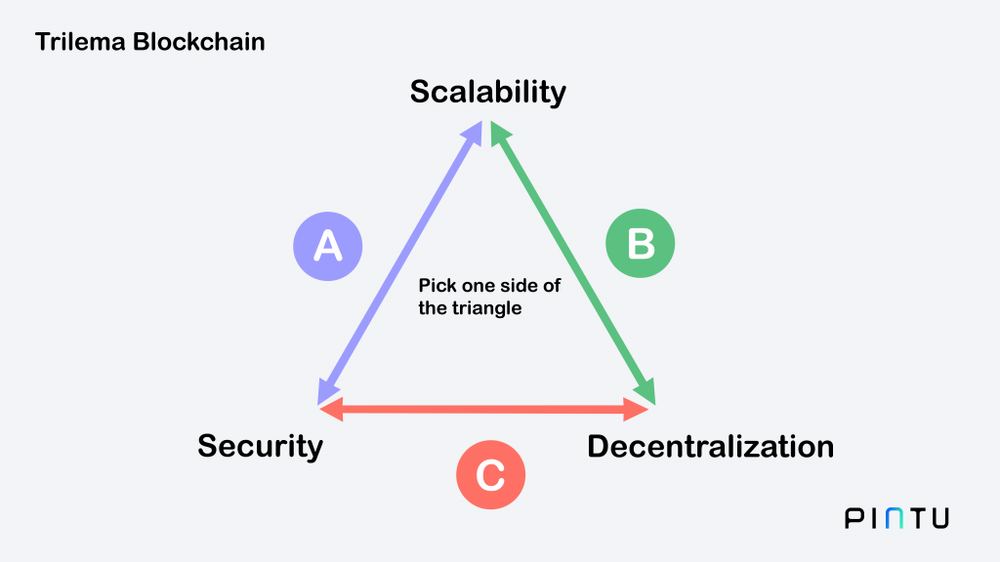
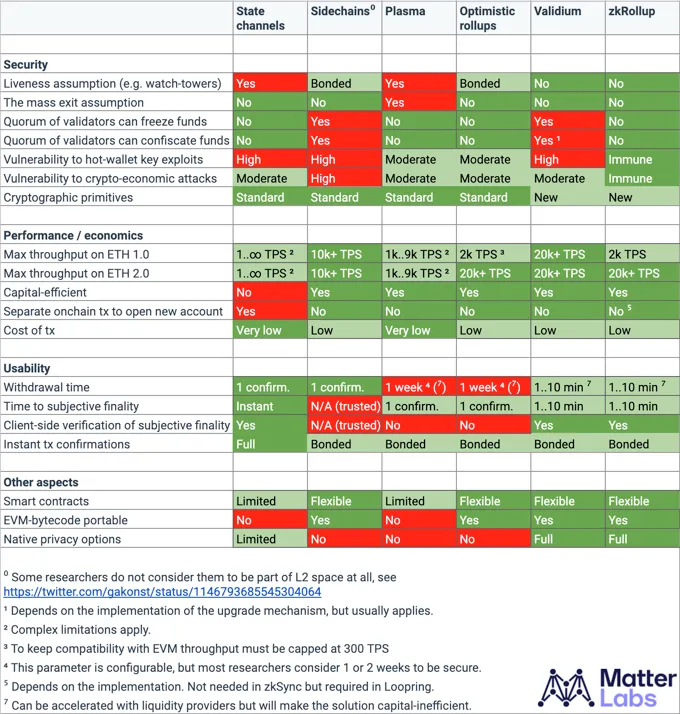
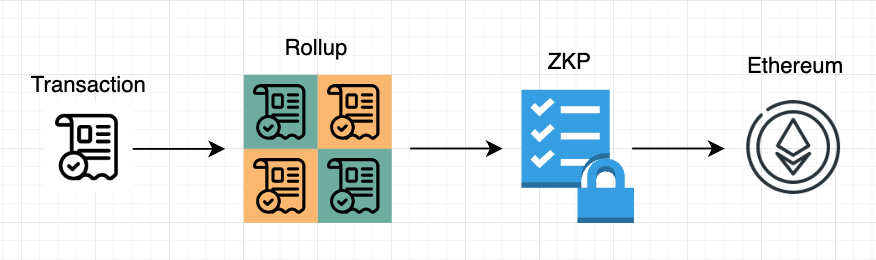
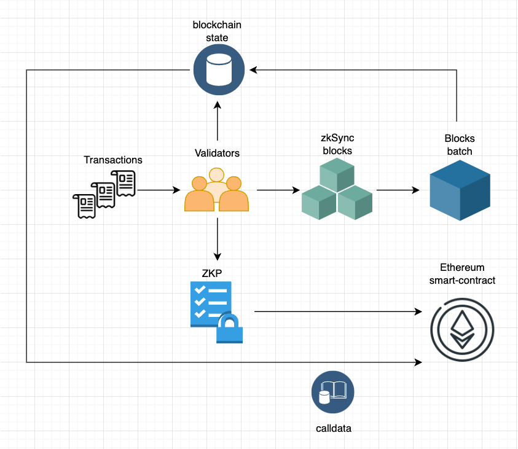
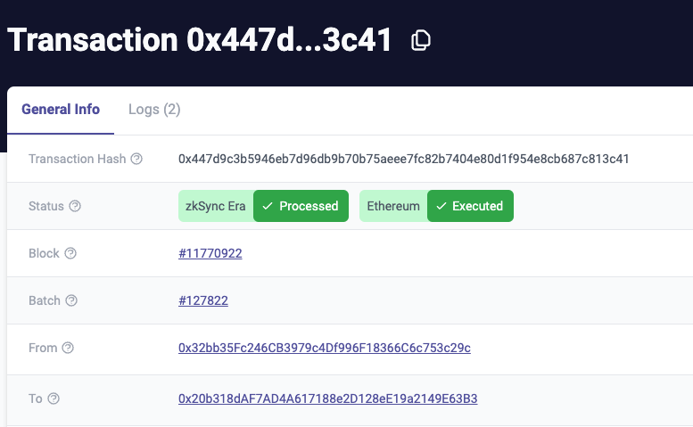
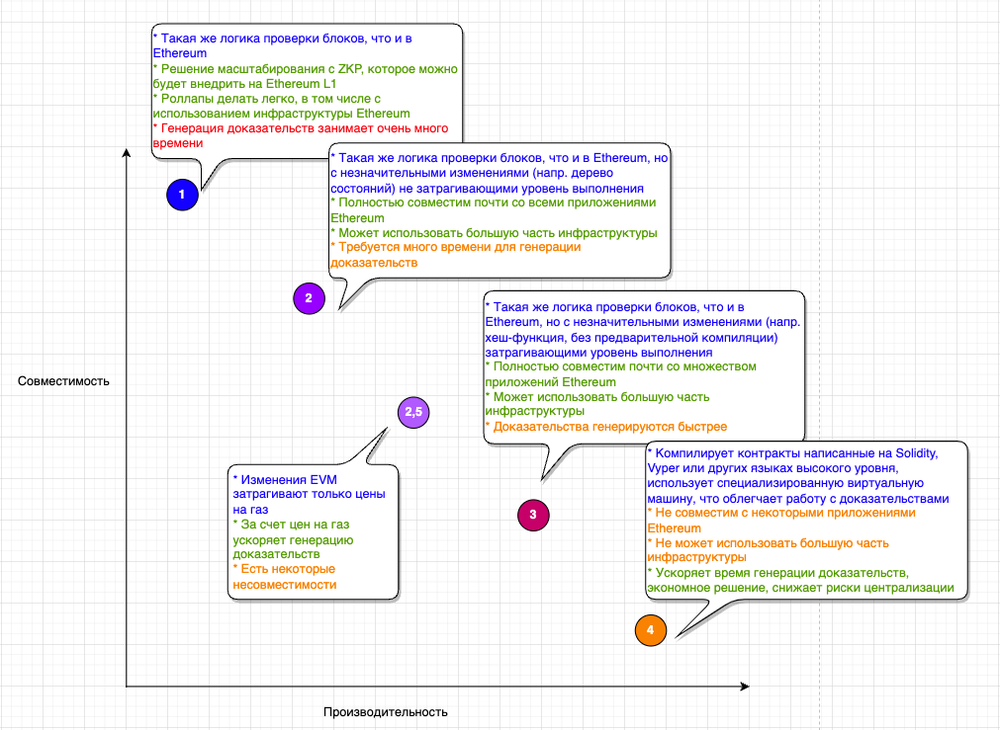
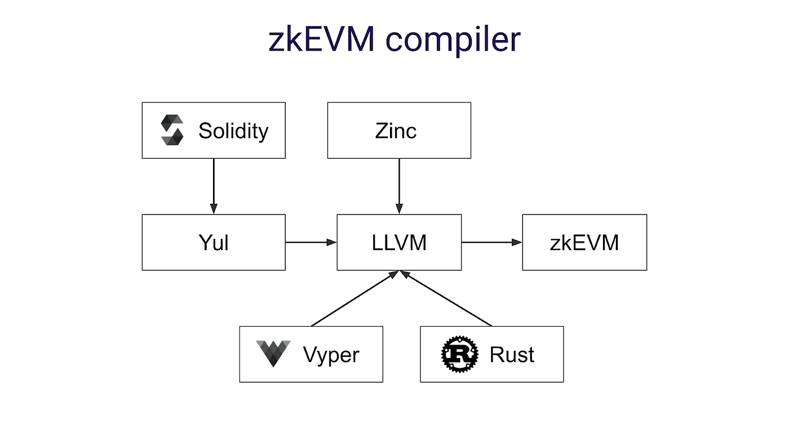
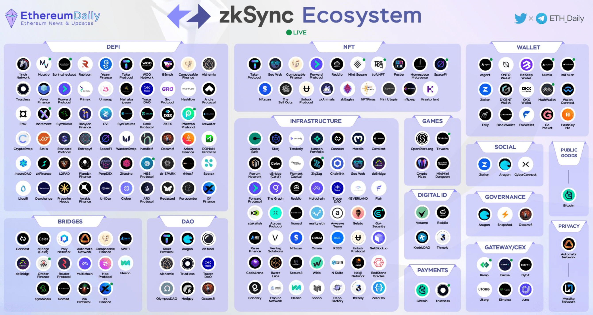
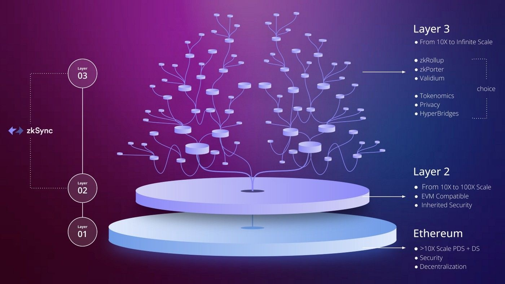

# zkSync

**Author:** [Roman Yarlykov](https://github.com/rlkvrv) 🧐

zkSync is a second-level blockchain (Layer 2 - L2) for Ethereum, designed to address the issues of high fees and limited throughput (Transactions Per Second - TPS) on the Ethereum network. This platform employs ZK-Rollup technology, which uses Zero-Knowledge Proofs (ZKP) to batch multiple transactions off the main network (L1). Only the cryptographic proofs of the transactions' correctness and their compressed data are sent to L1, significantly enhancing efficiency and reducing costs.

Developed by [Matter Labs](https://matter-labs.io/), zkSync is announced as a fully open source (100% open source) product, managed by the community. According to [Cryptorank](https://cryptorank.io/ico/zksync), the project has already attracted attention, raising investments of $458 million. In the long term, Matter Labs aims to create a comprehensive ecosystem. Currently, two blockchains are operational: zkSync Lite, which processes payments in ETH and ERC20 tokens, and zkSync Era, supporting full-fledged smart contracts. Future plans include launching a hyperchain system (L3), ensuring high security. Matter Labs' goal is to scale the technology to a level that will attract the next billion blockchain users.

## Background

zkSync represents a new approach to solving the scalability problem known as the [blockchain trilemma](https://medium.com/coinmonks/what-is-the-blockchain-trilemma-38a3b495a72f). This project, like other Layer 2 (L2) solutions, seeks to find a balance between security, scalability, and decentralization in blockchain networks.

1. **Scalability**: The ability of a system to efficiently handle a growing volume of transactions or data without losing performance and security.

2. **Blockchain Security**: Ensuring the reliability and protection of data from unauthorized access, tampering, or modifications.

3. **Decentralization**: The absence of a centralized controlling structure. In a decentralized system, management and decision-making are democratically distributed among all network participants.

Ethereum focuses on security and decentralization, emphasizing its status as a peer-to-peer protocol with nodes distributed around the world. For the latest information on node distribution, refer to [NodeWatch](https://nodewatch.io/).

To maintain decentralization in the network, each node must verify all transactions. This inherently slows down the network. Moreover, under high network load, transactions can become quite expensive and require significant time to process.

## Layer 2

The main task for increasing the TPS of the Ethereum network without increasing the load on the nodes was the introduction of [Sharding](https://ethereum.org/en/developers/docs/scaling/#sharding) in combination with the transition to PoS (Proof of Stake) consensus. This involved dividing validators into subgroups to process separate segments of the network, thereby reducing the overall load and increasing throughput. However, the community has focused on Layer 2 solutions, considering their rapid development.

In addition to the idea of implementing Sharding in Ethereum, other scalability solutions have emerged, such as:

-   Payment and State Channels
-   Sidechains
-   Plasma
-   Optimistic Rollup

As well as technologies based on Zero-Knowledge Proofs (ZKP), including:

-   Validium
-   zkRollup
-   Volition

More detailed information can be found [here](https://ethereum.org/en/developers/docs/scaling/).

Although Sharding is still under development, the Dencun hardfork is planned for early 2024, which will implement [Proto-Danksharding](https://ethereum.org/en/roadmap/danksharding/#what-is-protodanksharding). This intermediate step is aimed at improving Layer 2 solutions, making data storage on L1 more economical. Thus, Proto-Danksharding promises to reduce transaction costs on L2, as a step towards a full-fledged Sharding solution.

At first glance, L2 blockchains may seem similar, as their main task is to increase the number of transactions outside of L1 while delegating the role of security guarantor to L1. Developers of such blockchains often claim that their solutions are the fastest, most reliable, and simplest. In reality, each approach to scaling has its nuances, and inevitable compromises regarding transaction speed, security level, or degree of decentralization. Fully centralized solutions are also common. All these aspects bring us back to the fundamental issues of the blockchain trilemma.

In [this article](https://blog.matter-labs.io/evaluating-ethereum-l2-scaling-solutions-a-comparison-framework-b6b2f410f955), key criteria for evaluating protocols used in Layer-2 solutions are proposed. They include:

-   security,
-   performance and economic efficiency,
-   ease of use,
-   additional aspects such as smart contract support, EVM bytecode compatibility, and privacy options.

_Important!_ The article is written by Matter Labs and, in my opinion, some things are "stretched" in favor of zkRollup (since there is a clear conflict of interest), but that's not so important, the main thing is to see what differences exist between Layer-2 protocols.

Below I will provide a table, and here I will briefly describe its contents.

### Security

-   **Assumption of Liveness** or "viability" of Layer-2. It is assumed that for maintaining the functionality of Layer-2, some participants will always be onchain at Layer-1 level to respond to potential fraud cases. These are either validators who stake a certain amount of funds (marked as "Bonded" in the table) on L1, or third parties who ensure the security of the protocol for a reward. As seen in the table, solutions using ZKP (Validium and zkRollup) do not have this necessity.

-   **Mass Exit Problem**. A problem that arises if, for security reasons, it is necessary to initiate the withdrawal of funds by all users from L2 to L1. As seen in the table, this problem exists only with the Plasma protocol, more about which can be read [here](https://ethereum.org/en/developers/docs/scaling/plasma/#the-mass-exit-problem-in-plasma).

-   **Custodianship**. The question of whether L2 validators can temporarily block or confiscate users' funds.

-   **Economic Vulnerabilities**. Includes various attacks on L2 validators, including bribing L1 miners, creating "shadow" DAOs, and other economically motivated attacks.

-   **Cryptography**. The difference between standard and new cryptographic primitives. Standard ones are more studied and potentially vulnerable, while new ones (such as SNARK and STARK) provide greater reliability but require additional knowledge and audits from developers.

### Performance and Economics

With performance, it's straightforward. TPS (Transactions Per Second) indicates the network's throughput, and in the context of scaling, it's the most crucial parameter.

Economic aspects:

-   **Capital Efficiency**: This aspect is especially important for Payment Channels. They require freezing funds equal to the average volume of operations in the channel, making them less efficient in terms of capital investment.

-   **L1 Transaction for Creating an L2 Account**. Also a drawback for payment channels, as in all other solutions an account created in L1 works in L2 by default.

-   **Transaction Cost**: Along with TPS, this is one of the most critical factors of scalability, determining the economic attractiveness of the solution.

### Ease of Use

-   **Withdrawal Time from L2 to L1**: This period can vary from several minutes to several weeks. Optimistic Rollups and Plasma are particularly inconvenient in this regard, as they require more time for fund withdrawal.

-   **Time to Subjective Finality of Transaction**: Determines how quickly a transaction becomes irrevocable on L1 from the perspective of external observers. For example, in Optimistic Rollups, achieving finality on L1 requires only one confirmation on Ethereum, but full transaction finality takes about a week.

-   **Verifiability of Subjective Finality with Client Code**: Determines whether the time to subjective finality can be checked by light clients (browsers/mobile wallets). Continuing with the example of Optimistic Rollups, to confirm transaction finality, a user must download and verify the entire state rollup for the past week.

-   **Instant Transaction Confirmations**. Can the protocol provide instant transaction confirmations with full guarantee? Or does it guarantee this only at the L2 consensus level.

-   **Instant Visible Finality**: Can be implemented on top of most L2 protocols, meaning transactions are instantly confirmed in the user interface. Only payment channels (state channels) offer full security guarantees for these confirmations, while in other protocols these transactions can still be reversed within a certain time before they are confirmed in L1.

### Other Aspects

-   **Smart Contracts**: Consideration of whether the L2 solution supports fully programmable smart contracts, or only a limited subset of functions through predicates.

-   **Compatibility with EVM Bytecode**: Evaluates the feasibility of transferring existing Ethereum EVM bytecode smart contracts to L2 without significant changes.

-   **Built-in Privacy Support**: Consideration of the efficiency of privacy protection in L2 solutions, especially in the context of the availability and cost-effectiveness of confidential transactions.

Below is a comparative table of the main ZKP-based solutions:

For a more detailed understanding of Zero-Knowledge Proofs (ZKP), I recommend referring to [this article](https://github.com/fullstack-development/blockchain-wiki-en/blob/main/cryptography/zero-knowledge-proof/README.md) in our [blockchain-wiki](https://github.com/fullstack-development/blockchain-wiki-en), created by developers for developers with a love for proofs and deep dives into details.

## Transaction Lifecycle in zkSync

The operation of ZK-Rollups can be represented at a high level as follows:

1. **Rollup Formation**: Transactions are packed into a rollup.
2. **Creation of ZKP**: A Zero-Knowledge Proof is formed.
3. **Verification in Ethereum**: The proof is sent for verification to an Ethereum smart contract.

In the context of zkSync's architecture, the process looks like this:

1. **Collection of Internal Blocks**: zkSync validators collect internal blocks from transactions every few seconds.
2. **Formation of Block Package**: Every 30-90 seconds, a package of blocks is created from the internal blocks.
3. **Blockchain State Commitment**: Validators record the current state of the blockchain and transmit the modified data to L1 as calldata for possible recovery.
4. **Calculation and Submission of SNARK**: Validators calculate the SNARK (ZKP) for the package and send it for verification to an Ethereum smart contract. After verification, the new network state becomes final.

Validators in ZK-Rollups play a key role, packing transactions into blocks and generating Zero-Knowledge Proofs for them. A feature of the system is that validators physically cannot steal funds. The most significant potential harm they can cause is a temporary halt of the network.

_Note:_ In zkSync Era, the role of validators is performed by operators.

Developers of zkSync highlight the following guarantees of their architecture:

1. **Fund Security**: Operators can never damage the network state or steal funds, which is an advantage compared to Sidechains.

2. **Possibility of Fund Recovery**: Users can always extract their funds even if operators cease operations. This is possible thanks to data availability, unlike the Plasma system.

3. **Independence from Monitoring**: Thanks to ZKP, users or trusted third parties do not need to continuously monitor Rollup blocks to prevent fraud, which is an advantage compared to systems based on fraud proofs, such as Payment channels or Optimistic Rollups.

Transactions in zkSync Era go through several key states, different from the usual Rollup confirmations in L1:

-   **Pending**: The transaction has been received by the operator but has not yet been processed.
-   **Processed**: The transaction is being processed by the operator and is ready to be included in the next block.
-   **Committed**: Transaction data is published in Ethereum, ensuring data availability, but does not confirm its correct execution.
-   **Executed**: The final stage where the validity proof (SNARK) for the transaction is verified by an Ethereum smart contract, making the transaction final.

In addition to the block number, transactions in zkSync also display the package number. Originally, parameters such as `block.number`, `block.timestamp`, and `blockhash` were taken from L1. However, after [an update](https://github.com/zkSync-Community-Hub/zkync-developers/discussions/87), these values will now be obtained from L2. Despite this, developers plan to provide methods for accessing data from L1.

## Differences Between zkEVM and EVM

Compatibility of L2 solutions based on ZKP with Ethereum is a complex task. This is because Ethereum was not originally designed for optimal interaction with ZKP. As a result, in developing such systems, a compromise must be found between performance and scalability potential on the one hand, and compatibility with Ethereum and EVM on the other. Vitalik Buterin's article ["The different types of ZK-EVMs"](https://vitalik.ca/general/2022/08/04/zkevm.html?ref=blog.thirdweb.com) discusses these aspects in detail and highlights different levels of compatibility.

zkSync chose one of the most challenging paths, aiming for high performance but with limited compatibility with both Ethereum and EVM. To obtain bytecode compatible with zkEVM, the [LLVM](https://llvm.org/) project is used with a suite of proprietary compilers and optimizers. In the case of Solidity and Yul, after the standard solc compiler, the code undergoes several more stages before becoming zkEVM bytecode. The diagram below illustrates all the stages of this process (described in more detail [here](https://era.zksync.io/docs/tools/compiler-toolchain/overview.html)):

_Important!_ Optimizations in zksolc are supported.

Bytecode specifically compiled for EVM is not compatible with zkEVM. This means that the addresses of identical smart contracts in Ethereum and zkSync will differ. However, developers plan to solve this problem in the future.

One of the significant advantages of this approach is independence from specific programming languages. In the future, zkSync developers promise to add support for languages like Rust and C++. It is important that the delay in updates and the integration of innovations between high-level compilers (e.g., solc) and platform compilers (e.g., zksolc) is minimal. Initially, there was an idea to create their own programming language, Zinc, but at the moment, the team is focused on supporting more popular programming languages.

The issue of compatibility of zk-compilers with existing development and debugging tools for Solidity and Vyper smart contracts is significant. Current development platforms such as Remix, Hardhat, and Foundry do not support zk-compilers out of the box, creating difficulties in working with them. However, [solutions](https://era.zksync.io/docs/tools/) are being developed that promise to ease the migration process of projects and adaptation to new technologies.

Vitalik Buterin's article mentions that Ethereum will likely strive to improve compatibility with ZKP at the protocol level over time. Similarly, L2 solutions with ZKP will adapt for better compatibility with Ethereum. As a result, in the future, the differences between these systems may become almost imperceptible, ensuring a smoother integration and transition for developers.

## Features of zkEVM

_Important!_ The protocol is actively being developed; always refer to the latest version of the documentation!

zkEVM differs from EVM and despite developers' efforts to hide these differences "under the hood," there are important features to consider when writing smart contracts:

1. **Differences from EVM**: The behavior of code written in Solidity for zkEVM may differ, especially in aspects such as `block.timestamp` and `block.number`. It's important to regularly check the [documentation](https://era.zksync.io/docs/reference/architecture/differences-with-ethereum.html) for changes.

2. **System Contracts**: In zkSync, there are system smart contracts for various functions, such as `ContractDeployer` for deploying smart contracts and `MsgValueSimulator` for working with ETH. More about system smart contracts can be found in the [documentation](https://era.zksync.io/docs/reference/architecture/system-contracts.html).

3. **Proxy Pattern for Deployment**: It is recommended to use a proxy pattern during the first few months after deployment to prevent potential compiler errors.

4. **Gas Calculation**: The gas calculation model in zkEVM differs from Ethereum, including a different set of opcodes and gas price dependence on L1. Details can be found [here](https://era.zksync.io/docs/reference/concepts/fee-model.html).

5. **Local Testing**: Standard tools such as Hardhat Node or Anvil are not suitable for local testing of zkEVM. Instead, [special options](https://era.zksync.io/docs/tools/testing/) are used, including fork mode testing.

6. **Signature Verification**: It's recommended to use built-in support for account abstraction instead of `ecrecover`.

7. **Tracking Gas-Related Errors**: In zkSync, it is impossible to track errors related to gas shortages due to the specifics of execution within the `DefaultAccount` system smart contract.

For a deep understanding of working with zkEVM, it is recommended to study the documentation, including the section ["Security and best practices"](https://era.zksync.io/docs/dev/building-on-zksync/best-practices.html).

## Account Abstraction

Account abstraction in zkSync offers several key advantages over [ERC-4337](https://eips.ethereum.org/EIPS/eip-4337):

1. **Implementation Level**: In zkSync, account abstraction is built into the protocol level, making all accounts, including External Owned Accounts (EOA), functionally similar to smart contracts.

2. **Transaction Processing**: While ERC-4337 uses a separate mempool for bundlers, creating two different streams of transactions, zkSync Era has a single mempool. This means that transactions originating from EOAs and smart contracts are processed in one stream, ensuring smoother integration and processing.

3. **Support for Paymasters**: zkSync supports paymasters for all types of accounts, allowing gas fees to be configured in ERC20 tokens for any account.

## zkSync Infrastructure

The infrastructure of zkSync Era is rapidly gaining momentum and already includes dozens of protocols: Bridges, DeFi, infrastructure protocols, and more. (The current list can be viewed [here](https://zksync.dappradar.com/ecosystem)).

Another advantage is compatibility with Ethereum wallets, such as MetaMask or TrustWallet.

## Hyperchains

The zkSync protocol began its development with the launch of zkSync Lite, aimed only at transfers of ether and ERC-20 tokens, without the capability of deploying full-fledged protocols. This stage was an important step in development but only preceded the arrival of zkSync Era — a full-fledged L2 solution for Ethereum, which theoretically can be adapted for other L1 blockchains as well. However, zkSync's ambitions don't stop there, as the development plans include the launch of so-called **hyperchains**.

Hyperchains, or "fractal scaling," consist of ZKP networks, each forming its own blocks and proofs. These proofs are then collected together and posted on the main L1 network. Each of these networks is a complete copy of the entire system and can be considered its "fractal".

The uniqueness of hyperchains is that they can be created and deployed independently. To maintain consistency and compatibility, each hyperchain must use a common zkEVM engine, part of the ZK stack (with zkSync Era acting as the first hyperchain). This allows hyperchains to inherit their security from L1, ensuring their reliability and eliminating the need for additional trust and security measures.

Hyperchains represent an innovative approach to scaling blockchain networks, reducing the load on the main network and increasing transaction processing speed. Key aspects of this approach include:

-   **Proof Transfer Between Hyperchains**: Hyperchains will transfer block proofs to each other, increasing the distance a transaction must travel before reaching the main L1 network. This helps distribute the load and avoid bottleneck issues.

-   **Transparency for Users**: Users won't notice the difference – their transactions are processed in hyperchains and can go through several levels before reaching the main network, creating asynchronicity in processing.

-   **Advantages Over Existing Solutions**: Unlike current L2 solutions, which are faster but still limited in transaction volume and sometimes compromise on security, hyperchains promise significantly greater scalability.

-   **Flexibility in Creating Custom Blockchains**: Hyperchains allow for the creation of custom blockchains and accounts with various levels of security and privacy. Even with a lower level of security, in the worst case, only a temporary freeze of funds is expected.

More about all this can be found [here](https://era.zksync.io/docs/reference/concepts/hyperscaling.html#data-availability).

## Pros and Cons of zkSync

### Pros

1. **Security**: Security close to L1 level and potential for decentralization in the future.
2. **EVM Compatibility**: Support for EVM-compatible smart contracts.
3. **Web3 API and Wallets**: Standard Web3 API and support for Ethereum wallets like MetaMask.
4. **Account Abstraction**: Native support for account abstraction.
5. **Transaction Speed**: Fast transaction processing on L2 with subsequent confirmation on L1.
6. **Low Fees**: Reduced gas fees compared to L1.
7. **ERC20 Gas Payments**: Ability to pay gas fees in ERC20 tokens.
8. **Evolving Infrastructure**: Very active infrastructure development.
9. **Scalability Potential**: Opportunities for significant scalability improvements.

### Cons

1. **Limited EVM Compatibility**: Compared to competitors (e.g., Polygon zkEVM, Scroll), it has lower EVM compatibility.
2. **Risk of Errors in Smart Contracts**: Increased risk of errors, requiring thorough testing and auditing.
3. **Specific Development Stack Needs**: Necessity to adapt the development stack to the protocol's specifics.
4. **Lagging Behind Core Technologies**: Delay in adopting innovations in compilers and library updates.
5. **Network Centralization**: Currently, the network is managed by a limited number of operators.
6. **Need for Upgradable Smart Contracts**: From all the above, it follows that there's a necessity to **always** make upgradable contracts at the start of the project, to be able to promptly rectify deficiencies and vulnerabilities.

## Conclusion

The zkSync protocol looks very promising and has great potential, although at present, launching on this blockchain is still associated with a number of risks that need to be considered. Developing for zkSync is currently more challenging than for blockchains that are much more compatible with EVM and the EVM development stack. However, perhaps in the future, this difference will become insignificant or disappear altogether.

## Links

-   [Docs: zkSync docs](https://era.zksync.io/docs/)
-   [Repo: Awesome zero knowledge proofs (zkp)](https://github.com/matter-labs/awesome-zero-knowledge-proofs#awesome-zero-knowledge-proofs-zkp)
-   [Dashboard: zkSync Era Ecosystem](https://zksync.dappradar.com/ecosystem)
-   [Podcast: ZkPodcast: zkSync and Redshift: Matter Labs Update](https://www.youtube.com/watch?v=JXWjn9sGL6c)
-   [Article: Scaling overview - Ethereum.org](https://ethereum.org/en/developers/docs/scaling/)
-   [Article: Evaluating Ethereum L2 Scaling Solutions: A Comparison Framework](https://blog.matter-labs.io/evaluating-ethereum-l2-scaling-solutions-a-comparison-framework-b6b2f410f955)
-   [Article: The different types of ZK-EVMs](https://vitalik.ca/general/2022/08/04/zkevm.html?)
ref=blog.thirdweb.com)
-   [Article: Optimistic vs. ZK Rollup: Deep Dive](https://blog.matter-labs.io/optimistic-vs-zk-rollup-deep-dive-ea141e71e075)
-   [Article: zkSync. Технологии и динамика развития](https://teletype.in/@research_dyor/zkSync)
