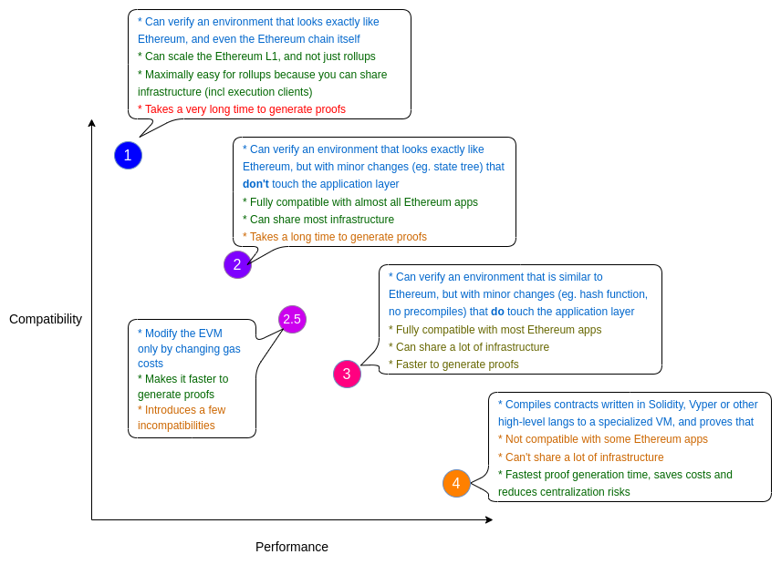

# zkSync

**Author:** [Roman Yarlykov](https://github.com/rlkvrv) 🧐

zkSync is a second layer blockchain (Layer 2 - L2) for Ethereum, designed to address high transaction fees and low throughput (Transaction Per Second - TPS) in Ethereum. It uses ZK-Rollups - rollups with zero-knowledge proofs (ZKP) to bundle transactions off the main network (L1). Only the cryptographic proof that the transactions are processed correctly and compressed data about these transactions are sent to L1.

Developed by [Matter Labs](https://matter-labs.io/), as the company claims, it is a 100% open source product managed by the community. To date, the project has raised [458$ million](https://cryptorank.io/ico/zksync) and aims to establish a comprehensive ecosystem in the long run. Currently, the zkSync Lite blockchain (which deals exclusively with processing ETH and ERC20 token payments) and zkSync Era (supporting full-fledged smart contracts) are operational. Future plans also include launching a system of interlinked hyperchains, which will be L3 solutions but will maintain high security. The company plans to elevate scaling to a new level and finally draw the next billion users to the blockchain.

## Prerequisites

zkSync is yet another attempt to solve the scaling issue from the well-known [blockchain trilemma](https://medium.com/coinmonks/what-is-the-blockchain-trilemma-38a3b495a72f). It's "another attempt" because all L2 blockchains are in some way trying to achieve this.

1. Scalability is the system's ability to handle an increasing volume of transactions or data without loss in performance or security.

2. Blockchain security means data reliability and protection from unauthorized access, tampering, or alteration.

3. Decentralization refers to the absence of a single controlling authority. In a decentralized setting, management and decision-making are distributed among all network participants.

Ethereum has prioritized security and decentralization as it's a peer-to-peer protocol with distributed nodes worldwide (current information can be viewed [here](https://nodewatch.io/)).

To maintain decentralization, all transactions must be verified by each node. Such a network inherently cannot operate quickly. Moreover, during high network load, transactions can become very costly and take a long time to process.

## Layer 2

The main question is — how to increase the TPS of the network without increasing the load on the nodes? Initially, Ethereum had plans to implement Sharding after transitioning to the PoS consensus. The idea was to divide validators into subsets responsible for separate network segments, thereby reducing the overall load and increasing its throughput.
But the community chose Layer 2 solutions since they began to develop rapidly. After the Sharding ideas, solutions like Payment (and state) channels, Sidechains, Plasma, Optimistic Rollup emerged, as well as ZKP-based solutions like Validium, zkRollup, and Volition. More details on these can be found [here](https://ethereum.org/en/developers/docs/scaling/).

At first glance, L2 blockchains may seem very similar: the general idea is to conduct a higher number of transactions outside L1, and L1 will only ensure the security of these transactions.
Developers of any such blockchain will assure you that it's the fastest, most reliable, and simplest solution. In reality, different scaling approaches mentioned above have many nuances. There are inevitable trade-offs: transaction speed, security level, decentralization (sometimes entirely centralized solutions are required). All this, one way or another, brings us back to the trilemma.

In this [article](https://blog.matter-labs.io/evaluating-ethereum-l2-scaling-solutions-a-comparison-framework-b6b2f410f955), the main criteria are highlighted, which can be used to compare the protocols on which Layer-2s are built:

-   security
-   performance/economics
-   ease of use
-   other aspects (smart contracts, compatibility with EVM bytecode, built-in privacy options)

_Important!_ The article is written by Matter Labs, and in my opinion, some things are "stretched" in favor of zkRollup (since there's a clear conflict of interest), but that's not so crucial. The main thing is to see what differences exist between Layer-2 protocols.

Below, I will provide a table, and here I'll describe its contents at a high level.

### Security

-   **Liveness Assumption** or "resilience" of Layer-2. It's assumed that for the continued operation of Layer-2, certain participants will always be online at the Layer-1 level to respond to potential fraud instances. This refers either to validators who stake a certain amount of assets (noted in the table as "Bonded" status) on L1, or third parties ensuring the protocol's security for a reward. As evident from the table, solutions using ZKP (Validium and zkRollup) don't have this need.

-   **Mass Exit Problem**. An issue that arises if, for security reasons, there's a need to initiate the withdrawal of funds by all users from L2 to L1. As per the table, this problem is only present in the Plasma protocol, and you can read more about it [here](https://ethereum.org/en/developers/docs/scaling/plasma/#the-mass-exit-problem-in-plasma).

-   **Custodianship**. Can a quorum of L2 validators make assets inaccessible for users indefinitely or confiscate them?

-   **Possible Vulnerabilities Linked to Economics**. This encompasses attacks on L2 validators, bribing L1 miners, establishing "dark" decentralized organizations (DAO), and other attacks aiming at economic gains.

-   **Cryptography**. Cryptographic primitives in this table are divided into standard and novel ones. The main point being, the longer the standard ones exist, the more chances they have of being compromised. On the other hand, the new ones (like SNARK and STARK) are more reliable but require greater expertise from developers and more audits.

### Performance and Economics

Performance is straightforward. TPS (Transaction Per Second) represents the network's throughput, and in the context of scaling, it's the most critical metric.

Regarding economics:

-   **Capital Efficiency**. This point primarily concerns the drawback of payment channels, meaning that payment channels are relatively less efficient in terms of capital allocation since channel operators need to lock the average value of their channel's volume.
-   **L1 Transaction to Create an L2 Account**. Another critique towards payment channels, as in all other solutions, an L1 account operates in L2 by default.
-   **Transaction Cost**. On par with TPS, this is another vital parameter for scalability.

### User Experience

-   **Withdrawal time from L2 back to L1**. It can take from just a few minutes up to weeks. This point definitely does not favor Optimistic Rollups and Plasma (which use similar mechanisms).
-   **Time to Subjective Finality**. How fast can a transaction reach a state where it's impossible to revert on L1 within the security assumptions of the protocol?
    By "subjective finality" it means that external observers can be convinced of a transaction's irreversibility, even if L1 smart contracts can't rely on this yet. For example, in optimistic rollups, you need 1 confirmation on Ethereum to achieve L1 finality, while full finality takes about a week.
-   **Verifiability of Subjective Finality using client code**. Can the time to subjective finality (see previous point) be checked using light clients (browsers/mobile wallets)?
    Continuing with the optimistic rollups example, although you need 1 Ethereum confirmation to achieve L1 finality, to make sure your transaction is final, you would need to download the entire rollup state and execute all transactions for the past week to ensure all blocks are valid.
-   **Instant transaction confirmations**. Can the protocol provide instant transaction confirmations with full guarantee or only with its own stake (referring to assets staked by network validators)?
    "Instant visible finality" can be implemented on top of most L2 protocols, meaning transactions will be instantly confirmed in the user interface. Only payment channels (state channels) offer full security guarantees for these confirmations, while in other protocols, these transactions can still be reverted for a certain time before they are confirmed on L1.

### Other Aspects

-   **Smart Contracts**. Does L2 support arbitrarily programmable smart contracts or only a limited subset that can be implemented with predicates?
-   **Compatibility with EVM bytecode**. Can you port the EVM bytecode of existing Ethereum contracts with minimal changes?
-   **Built-in privacy support**. Without affordable shielded transactions by default, privacy protection will be highly inefficient.

Comparison table for the main solutions built on ZKP:

## What is a zero-knowledge proof?

At the heart of ZK-Rollups is the concept of zero-knowledge proofs—a cryptographic tool that allows for data verification without revealing any specific details.

To take a step back, the development of cryptography in the realm of data authentication can be tentatively divided into 3 stages:

1. **Symmetric encryption protocols**, which allow safe data transfer across a channel, but both participants need to know the private key to decrypt this information.

2. **Asymmetric encryption protocols** - where one party has both public and private keys, using which this party can sign. The other party only needs the signature and the public key to verify the authenticity of the signature.

3. **Zero-knowledge proofs** - this is the new twist in cryptography evolution, where private keys are unnecessary for anyone, yet the authenticity of data can be publicly verified.

So, ZKP is a cryptographic protocol that enables one party (the verifier) to be convinced of the truth of a certain statement without receiving any additional information from the other party (the prover).

Let's use two characters for a simpler explanation - they will be Victor (verifier) and Peggy (prover). Peggy has a certain secret (information) that she doesn't want to reveal to Victor. Victor doesn't need the secret itself but requires proof that Peggy indeed possesses the secret. This is where cryptography and ZKP come in. Peggy can prove to Victor that she has the secret without revealing it.

For everything to go smoothly, the following 3 properties must be met:

1. _Completeness_ - Peggy (prover) proves to Victor (verifier) that she has the secret (with high probability, even if it's less than 100%)
2. _Soundness_ - Peggy won't be able to prove if she doesn't have the secret (with a probability close to 0)
3. _Zero-knowledgeness_ - Victor won't find out the secret.

Since the proof will only be valid with some probability, in the above example, Peggy and Victor will have to go through multiple iterations to ensure that Peggy is not deceiving him and truly knows the secret. Thus, such a protocol will be communicative or interactive.

A more detailed example is well described in [this article](https://blog.cryptographyengineering.com/2014/11/27/zero-knowledge-proofs-illustrated-primer/). Spoiler - it explains how to safely transact with Google.

There's another example, emphasizing the element of probability, called Ali Baba's cave. The cave is essentially a tunnel with one entrance that goes in a loop. Somewhere in the middle of this tunnel, there's a door that's not visible from the entrance. To traverse the cave, one must open the door between points C and D. This door only opens when someone says the magic words. Let's say Peggy knows the magic words and wants to prove it to Victor without revealing the words themselves.

Here's how the zero-knowledge proof works in this case:

1. Victor stands at point A.
2. Peggy walks the entire length of the cave to the door either via passage C or passage D. Victor doesn't see which direction Peggy chose. After Peggy disappears into the cave, Victor moves to point B.
3. Victor shouts to Peggy to come out of the cave, either from the left passage or the right passage.
4. Peggy, using the magic words if necessary to unlock the door, comes out of the cave from the passage Victor asked her to exit.
5. Peggy and Victor repeat steps 1-4 several times.

If Peggy doesn't know the secret, she won't be able to deceive Victor if the proof steps are repeated multiple times consecutively. This is because she can only come out from the passage she entered, and in each round of the protocol, her chances of guessing which side Victor will ask her to exit are 50%. Thus, her probability of deceiving Victor is also 50%. However, the chance of deceiving him in two rounds is 25%, and in n rounds, she only has a 1 in 2^n chance. Victor can confidently assume that if all n (n=10-20) rounds of Peggy's proof are correct, she genuinely knows the secret words that open the door between points C and D.

Where can zero-knowledge proofs be applied in general? Here are a few examples:

1. **Confidentiality**:
    - Prove that you own money in the bank without specifying the exact amount, just a threshold;
    - Prove that you are 18+ without revealing your birthdate and name;
    - Prove to the state that you've paid your taxes without specifying the exact amount.
2. **Scalability**:
    - Store not the full information, but a proof of the existence of the information;
    - Increase TPS (Transactions per second) on the blockchain.
3. **Anonymous authorization**.
4. **Distributed computations**.

All would be well, but for the blockchain, interactivity is not suitable, as the verifying party comprises a large number of participants (e.g., network validators). Therefore, originally interactive protocols were converted into non-interactive ones using the [Fiat-Shamir heuristic](https://en.wikipedia.org/wiki/Fiat–Shamir_heuristic). This gives birth to even more complex algorithms like zk-SNARKs, which possess new properties:

-   **s**uccinctly - regardless of the computation volume, the proof is consistently small in size;
-   **n**on-interactively - once the proof is computed, it can be used to convince any number of verifiers without direct interaction with the prover;
-   with **ar**gumented knowledge - if the statement is true with non-negligible probability, then it's impossible to create fake proofs; moreover, the prover knows the respective values (witness) for a true statement;
-   in zero-**k**nowledge - from the proof, it is impossible to extract any additional information, i.e., it's indistinguishable from random.

If you are strong in mathematics, you can read Vitalik's article - [Quadratic Arithmetic Programs: from Zero to Hero](https://medium.com/@VitalikButerin/quadratic-arithmetic-programs-from-zero-to-hero-f6d558cea649).

An important point: in zk-SNARKs there emerges a third party that must perform a "setup" (trusted setup) and generate a "provingKey". The provers will use these keys for proofs, and "verificationKey", which the verifiers will use for checks. For the generation, a specific number - "toxic waste" is conceived, which must be destroyed after setup.

The first property (succinctly) allows for computing proofs for any data volume in a constant amount of time ~O(1). This is the immense power of zk-SNARKs, making it so attractive for solving the scalability problem of blockchain without losing security and speed.

The weak point of zkSNARKs is the trusted setup, but there are other protocols currently under development (for example, zkSTARKs).

STARK = Succinct (Scalable) Transparent ARguments of Knowledge.

This algorithm does not require a trusted setup, making it "Transparent" plus it has post-quantum cryptographic resistance. However, everything has a price; hence the computational complexity and proof sizes increase. Here's a table taken from [here](https://github.com/matter-labs/awesome-zero-knowledge-proofs#comparison-of-the-most-popular-zkp-systems), showcasing the difference between the two protocols:

|                                       |                                   SNARKs |                             STARKs |
| ------------------------------------: | ---------------------------------------: | ---------------------------------: |
|        Algorithmic complexity: prover |                           O(N \* log(N)) |                O(N \* poly-log(N)) |
|      Algorithmic complexity: verifier |                                    ~O(1) |                     O(poly-log(N)) |
| Communication complexity (proof size) |                                    ~O(1) |                     O(poly-log(N)) |
|              - size estimate for 1 TX |                Tx: 200 bytes, Key: 50 MB |                          Tx: 45 kB |
|         - size estimate for 10.000 TX |               Tx: 200 bytes, Key: 500 GB |                         Tx: 135 kb |
|    Ethereum/EVM verification gas cost |                          ~600k (Groth16) |         ~2.5M (estimate, no impl.) |
|               Trusted setup required? |                           YES :unamused: |                         NO :smile: |
|                   Post-quantum secure |                            NO :unamused: |                        YES :smile: |
|                    Crypto assumptions | DLP + secure bilinear pairing :unamused: | Collision resistant hashes :smile: |

Vitalik Buterin has already penned not one, but three articles on this: [one](https://vitalik.ca/general/2017/11/09/starks_part_1.html), [two](https://vitalik.ca/general/2017/11/22/starks_part_2.html), and [three](https://vitalik.ca/general/2018/07/21/starks_part_3.html).

However, zkSNARKs is a time-tested protocol, which currently stands as the most suitable choice for blockchains with ZKP. Additionally, the protocol itself continues to evolve; its older version being Groth16, which was later followed by PLONK. zkSync primarily uses RedShift, but parts of the protocol also employ PLONK.

[RedShift](https://eprint.iacr.org/2019/1400) is being actively developed with significant participation from Matter Labs (zkSync) and is termed as a Transparent SNARK. It's a SNARK with a more transparent and secure setup phase - the trusted setup, and also claims post-quantum safety. It's discussed in detail in this [podcast](https://www.youtube.com/watch?v=JXWjn9sGL6c).

This was a brief overview of ZKP. If you wish to dive deep, head over [here](https://github.com/matter-labs/awesome-zero-knowledge-proofs), [here](https://zkp.science/), and [here](https://harryr.github.io/zklangs/). Well, you [get the idea](https://learn.0xparc.org/), the topic is [vast](https://hackmd.io/24W3m1kERC-8BrI0giBRNQ?view) and [complex](https://github.com/ventali/awesome-zk).

## Transaction Lifecycle in zkSync

To give a very high-level overview of the working of ZK-Rollups, it would look something like this:

That is, transactions are first bundled into a rollup, then a zero-knowledge proof is generated and passed for verification to the smart contract in Ethereum.

In the zkSync architecture, this is illustrated as:

-   Validators of the zkSync network first gather the so-called internal blocks from transactions, which are formed every few seconds.
-   As a second step, from these internal blocks, a block package is formed every 30-90 seconds (depending on the network load).
-   After the creation of the block package by validators, the current state of the blockchain (only the data that has changed) is fixed and passed to L1 as calldata. This allows for state recovery if necessary.
-   Then, validators compute the SNARK (ZKP) for the current package and send it to the Ethereum smart contract for verification; once verified, the new network state is finalized.

So, validators are responsible for packing transactions into blocks and generating zero-knowledge proofs for them. An essential feature is that validators cannot steal funds in principle. The maximum assumed harm they could cause is a temporary network halt.

According to the developers of zkSync, this architecture provides the following guarantees:

1. Rollup validator(s) can never harm the network's state or steal funds (unlike Sidechains).
2. Users can always retrieve their funds from Rollup, even if the validator(s) cease cooperation, because the data is accessible (unlike Plasma).
3. Thanks to ZKP, neither users nor any trusted third party need to be online to monitor Rollup blocks to prevent fraud (unlike systems based on fraud proofs, such as Payment channels or Optimistic Rollups).

A transaction in the zkSync Era, instead of the usual confirmations in L1 (depending on the number of new blocks), goes through several states:

-   **Pending**: The transaction has been received by the validator but has not yet been processed.
-   **Processed**: The transaction is processed by the validator and is confirmed for inclusion in the next block.
-   **Committed**: Indicates that the transaction data of this block has been published in Ethereum. It doesn't prove that they were executed correctly, but it guarantees the data's availability.
-   **Executed**: Indicates that the validity confirmation (SNARK for the transaction) has been sent and verified by the smart contract. After this step, the transaction is considered final.

Note that besides the block number, the package number is also displayed. Initially, block.number, block.timestamp, and blockhash were taken from L1, but after [this update](https://github.com/zkSync-Community-Hub/zkync-developers/discussions/87), the aforementioned values will be sourced from L2. The developers promise to provide methods to access values from the L1 network.

## Differences between zkEVM and EVM

The compatibility question of L2 solutions, built on zero-knowledge proof, is rather pressing. The fact is that Ethereum is currently not very compatible with ZKP cryptography. Hence, when developing such systems, one has to strike a balance between performance and cost efficiency (read as "scalability potential") and compatibility with Ethereum and EVM. I highly recommend checking out Vitalik's article - ["The different types of ZK-EVMs"](https://vitalik.ca/general/2022/08/04/zkevm.html?ref=blog.thirdweb.com), where he brilliantly explained why this is the case and highlighted 4 types of varying compatibility levels (plus an intermediate type).

zkSync has taken the most challenging path and falls into type 4 – high performance but not the best compatibility with both Ethereum and EVM. The protocol uses zkEVM, and to obtain its bytecode, the [LLVM](https://llvm.org/) project and a set of proprietary compilers and optimizers are utilized. In the case of Solidity and Yul, after the standard solc compiler, the code undergoes several stages before transitioning into zkEVM bytecode. The diagram below illustrates all these phases (more details [here](https://era.zksync.io/docs/tools/compiler-toolchain/overview.html)):

_Important!_ Optimizations in zksolc are supported.

That is, the bytecode compiled for EVM will not be suitable for zkEVM. Consequently, the addresses of two identical smart contracts on Ethereum and zkSync will differ, but this issue is hoped to be resolved in the future.

Another significant advantage of this approach is the lack of ties to specific programming languages. In the future, there's even a promise to support languages like Rust and C++. The hope is that the lag between innovations in high-level compilers (like solc) and platform compilers (zksolc) won't be too vast. Initially, there was mention of their proprietary programming language - Zinc, but it seems the team is now focusing on supporting popular programming languages.

On the flip side, the familiar development and debugging stack for smart contracts in Solidity and Vyper does not natively support zk-compilers, so working in Remix or launching a hardhat or foundry project without modifications is not possible. The good news is that solutions for this are actively [being developed](https://era.zksync.io/docs/tools/), so there will be challenges in migrating projects, but they are surmountable.

In Vitalik's aforementioned article, there's speculation that over time, Ethereum will increasingly move towards ZKP compatibility at the protocol level, while L2 with ZKP will, conversely, aim for greater compatibility with Ethereum. Hence, there's a chance that one day this difference will be almost imperceptible.

## Features of zkEVM

As mentioned earlier, zkEVM is different from EVM. While developers try to hide these differences "under the hood", there are crucial nuances. It's essential to consider them when writing smart contracts.

_Important!_ The protocol is under active development, always refer to the current version of the documentation!

-   When writing code in Solidity, the behavior might differ from what you expect due to certain characteristics of zkEVM. Here's the link to the relevant section of the [documentation](https://era.zksync.io/docs/reference/architecture/differences-with-ethereum.html). Always check it! Some specifics might change, as it happened with `block.timestamp` and `block.number`.

-   To ensure seamless integrations in Ethereum and for the execution of administrative logic related to ZKP in zkSync, system contracts exist. For instance, `ContractDeployer` is responsible for deploying smart contracts, while `MsgValueSimulator` handles ETH transactions since zkSync Era lacks native support for transferring Ether. A good example is the `ImmutableSimulator` smart contract that manages the `immutable` variables. This is because the deployment and execution code in zkEVM are indistinguishable. More on system contracts can be found in the [documentation](https://era.zksync.io/docs/reference/architecture/system-contracts.html).

-   When deploying smart contracts in zkSync era, it's recommended to use the proxy template for several months after the initial deployment, even if you plan to transition to an immutable contract later. It's unclear how long this recommendation will remain relevant, but the reality is that compiler errors are entirely possible.

-   The gas calculation logic differs from Ethereum (details [here](https://era.zksync.io/docs/reference/concepts/fee-model.html)):

    -   Gas prices in zkSync depend on the gas prices in L1 (Ethereum)
    -   zkEVM uses a different set of opcodes, meaning the "gas" indicator for the same operations might differ in zkSync and Ethereum
    -   The calculation model is still undergoing modifications, so it's not advised to set fixed gas values, as this could lead to future issues.

-   Local environments like the hardhat node or anvil won't work, so you'll need to set up one of [these options](https://era.zksync.io/docs/tools/testing/) for local testing. Forked network testing will also [differ](https://era.zksync.io/docs/tools/testing/era-test-node.html).

-   For signature verification, it's advised to use built-in account abstraction support instead of `ecrecover`. An account can be managed by multisignature and use a signing scheme other than ECDSA.

-   In zkSync (unlike the Geth client), it's impossible to track errors related to gas shortages. The primary reason is that the "actual" execution takes place inside the `DefaultAccount` system contract. Providing a large amount of gas, the `execute` function call of the `DefaultAccount` contract won't fail, even if it runs out of gas, but the subsequent `transaction.to` contract call will fail with an `out of gas` error.

I recommend visiting the documentation sections mentioned above independently and the ["Security and best practices"](https://era.zksync.io/docs/dev/building-on-zksync/best-practices.html) section to better understand the intricacies of working with zkEVM.

## Account Abstraction

zkSync supports account abstraction "out of the box", granting it some advantages over EIP-4337:

-   **Implementation Level**: zkSync's account abstraction is integrated at the protocol level. Therefore, all accounts (even EOAs) inherently behave like smart contracts;

-   **Transaction Handling**: In EIP-4337, a separate mempool is introduced for transaction processing by bundlers, leading to two distinct transaction streams. Contrary to this, in zkSync Era, there is a single mempool for transactions both from external accounts (EOA) and smart contract accounts. In zkSync Era, transactions are merged regardless of the account type and sent to the loader (similar to the `EntryPoint` contract). This results in a unified mempool and transaction stream.

-   **Paymasters Support**: All accounts support paymasters, allowing for gas payments in ERC20 for any account.

Details about AA can be found in the [documentation](https://era.zksync.io/docs/reference/concepts/account-abstraction.html#verifying-aa-signatures-within-our-sdk).

## zkSync Infrastructure

The zkSync Era infrastructure is rapidly gaining momentum and already includes dozens of protocols: Bridges, DeFi, infrastructure protocols, and more. (See the current list [here](https://zksync.dappradar.com/ecosystem)). Some major players plan to deploy their smart contracts there, such as Chainlink, SushiSwap, Uniswap, Aave, Argent, 1inch, Gnosis.

Another advantage is compatibility with Ethereum wallets, like MetaMask or TrustWallet.

## Hyperchains

The first development step of the zkSync protocol was the launch of zkSync Lite, which only handled ether and ERC-20 token transfers but didn't support the deployment of full-scale protocols. After this, zkSync Era was launched, which acts as a comprehensive L2 solution for Ethereum (incidentally, another L1 blockchain could theoretically be in Ethereum's place). But this is just part of the ecosystem. In the future, the launch of so-called **hyperchains** is planned.

Hyperchains, or "fractal scaling", entails the creation of multiple ZKP networks, each forming blocks and their proofs. These proofs are then merged and placed in the primary L1 network. Each of these networks creates a full copy of the entire system, serving as its "fractal".

Hyperchains can be developed and deployed by anyone without permission. However, to remain reliable and fully compatible, each hyperchain should be powered by the same zkEVM engine, available in the ZK stack (zkSync Era is the first hyperchain). Thus, all ZKP schemes remain 100% identical, allowing hyperchains to fully inherit their security from L1, regardless of who deployed them. This ensures no additional means of trust and security are needed.

Hyperchains will send block proofs to other hyperchains, increasing the transaction path to the main network. This reduces the load on the main network and increases transaction processing speed. For users, nothing changes – their transactions are processed in hyperchains and may pass through several hyperchains before reaching the main network. This approach helps avoid the "bottleneck" problem, as if all proofs were directly sent to L1, introducing some asynchronicity.

Such an approach, in theory, will take scaling to a new level, as existing solutions are still limited in the number of transactions they can handle, even if they are faster than Ethereum, plus some compromise on security. Furthermore, developers promise greater flexibility in creating custom blockchains, as well as accounts with varying levels of security and privacy. By lower security levels, they mean, in the worst case, freezing of funds for a certain period.

Learn more about all this [here](https://era.zksync.io/docs/reference/concepts/hyperscaling.html#data-availability).

## Pros and Cons of zkSync

### Pros

-   High level of security (comparable to L1) and decentralization (in the future)
-   Smart contracts compatible with EVM
-   Standard Web3 API (also supports standard Ethereum wallets, e.g., MetaMask)
-   Account abstraction that works "out of the box"
-   Transaction processing speed - L2 transactions are confirmed immediately and on L1 after a short period of time
-   Low transaction fees
-   Ability to pay gas in ERC20
-   Rapidly evolving infrastructure
-   Has great scalability potential

### Cons

-   Still the lowest EVM compatibility among competitors (e.g. Polygon zkEVM)
-   The risk of smart contract errors remains. More time is needed for more thorough testing and audit, even for already tested contracts that have passed an audit
-   Need to set up the development stack for the protocol specifics
-   Lagging behind "mainstream" technologies, for instance, new features in compilers and library updates
-   The network is still quite centralized and is managed by a single validator pool
-   Since the network is under development and testing - it's essential to continuously ensure nothing breaks in the existing code
-   From all of the above, there arises a need to **always** create upgradable contracts at the start of a project to quickly address flaws and vulnerabilities

## Conclusion
The zkSync protocol looks very promising and has significant potential, although at the moment, launching on this blockchain is still associated with certain risks that need to be taken into account. Developing for zkSync is currently more challenging than for blockchains that are much more compatible with EVM and the EVM development stack. However, in the future, this difference might become negligible or might disappear entirely.

## Links

- [Docs: zkSync docs](https://era.zksync.io/docs/)
- [Repo: Awesome zero knowledge proofs (zkp)](https://github.com/matter-labs/awesome-zero-knowledge-proofs#awesome-zero-knowledge-proofs-zkp)
- [Dashboard: zkSync Era Ecosystem](https://zksync.dappradar.com/ecosystem)
- [Podcast: ZkPodcast: zkSync and Redshift: Matter Labs Update](https://www.youtube.com/watch?v=JXWjn9sGL6c)
- [Article: Scaling overview - Ethereum.org](https://ethereum.org/en/developers/docs/scaling/)
- [Article: Evaluating Ethereum L2 Scaling Solutions: A Comparison Framework](https://blog.matter-labs.io/evaluating-ethereum-l2-scaling-solutions-a-comparison-framework-b6b2f410f955)
- [Article: The different types of ZK-EVMs](https://vitalik.ca/general/2022/08/04/zkevm.html?ref=blog.thirdweb.com)
- [Article: Optimistic vs. ZK Rollup: Deep Dive](https://blog.matter-labs.io/optimistic-vs-zk-rollup-deep-dive-ea141e71e075)
