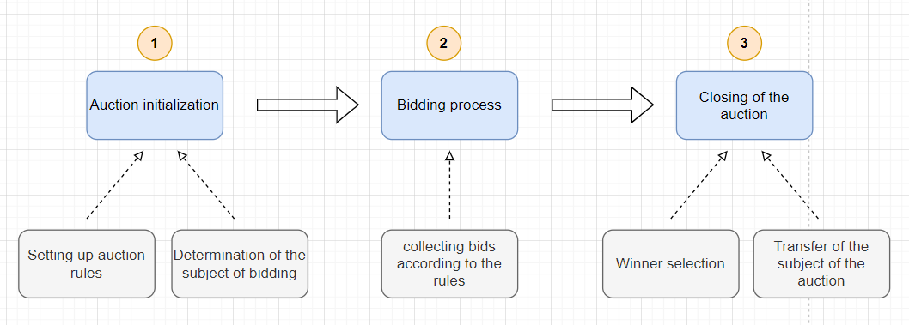
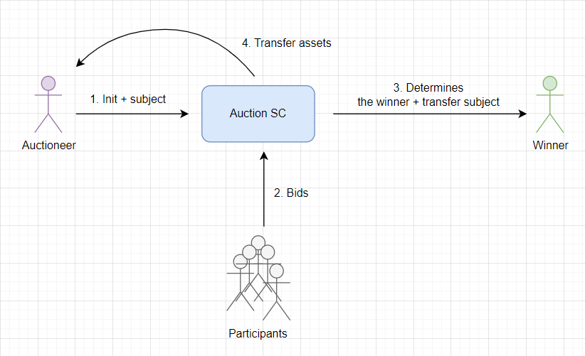
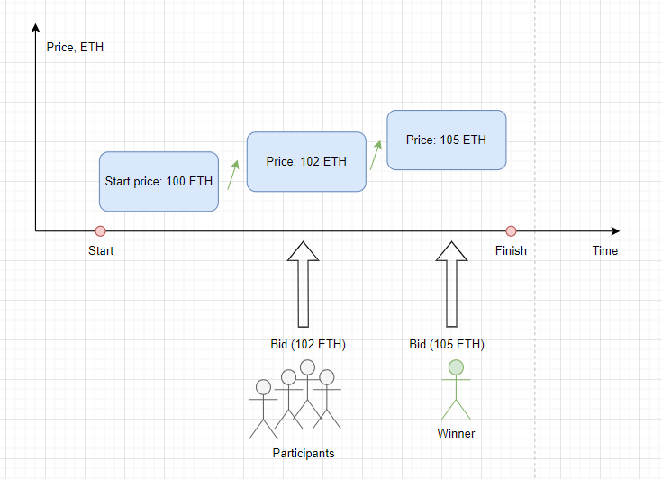
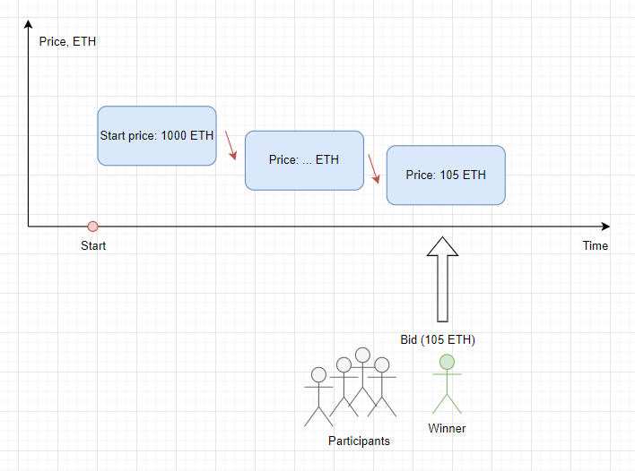
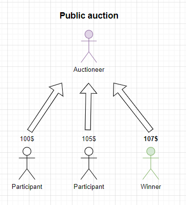
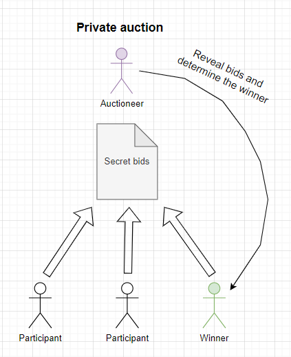
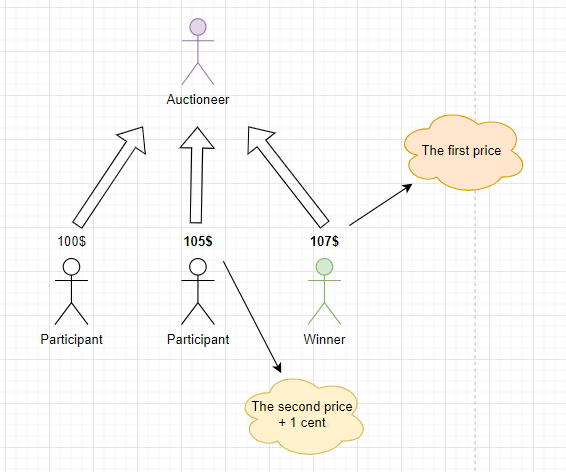
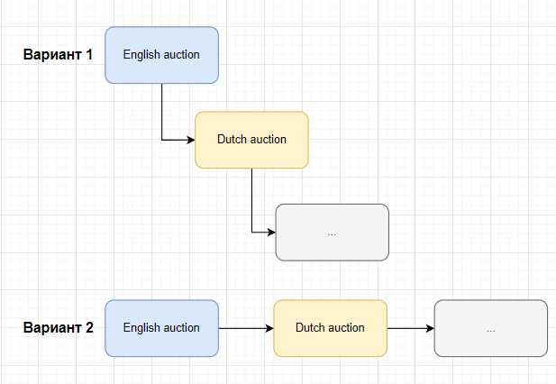
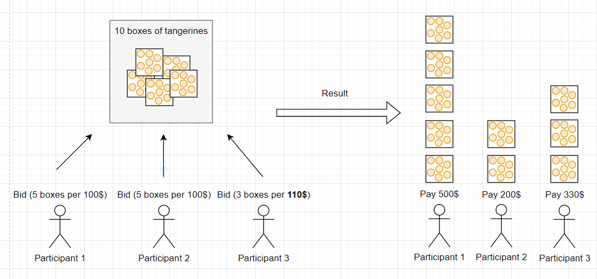

# Auctions

**Author:** [Pavel Naydanov](https://github.com/PavelNaydanov) 🕵️‍♂️

_Oops!_ **Auction** is a public sale of various items, conducted according to predetermined rules. The rules regulate the main principle of the auction - "*competition among participants*" for obtaining the item. The participant who surpasses their rivals becomes the winner of the auction and the new owner of the item.

## History of Auctions

**The auction form** of trading emerged as a way to quickly turn property into cash or to collect the necessary amount to pay off debts.

[The first mentions](https://en.wikipedia.org/wiki/Auction) of auctions, or rather a similar form of trade, date back to the year 500 B.C.

Auctions transformed into a more modern type in the late 16th – 17th centuries. In some parts of England, "candle auctions" were used for selling goods and renting, where the trading process continued as long as the candle flame burned. When the flame went out, the auction was considered over.

_An interesting case!_ In 2018, the owner of Banksy's "Girl with Balloon" put it up for auction, and with the last strike of the auctioneer's hammer, a [shredder built into the frame began cutting the canvas](https://en.wikipedia.org/wiki/Girl_with_Balloon) into small strips, stopping about halfway. The artist admitted that he had pre-installed a shredder in the frame for the auction. After that, the author demanded to change the title of the work to "Love in the Bin". The buyer did not refuse ownership rights, as experts estimated that the value of the painting increased several times as a result of such a performance.

There is an entire applied branch of economics - [auction theory](https://en.wikipedia.org/wiki/Auction_theory), which studies how participants act on different auction markets.

## How Does It Work?

To understand the process of an abstract auction, let's introduce the following concepts:
1. **Auctioneer** - in the classical sense, this is a person who conducts the auction. The main function is to control the compliance with the auction rules by the participants.

2. **Lot** - the basic unit of the auction, which the auction participants potentially wish to purchase. It can be represented by tangible (painting, artwork) or intangible values (service, certain amount of work).

3. **Bid** – this is the price offered by an auction participant, which they are willing to pay or receive for the auction item (lot). Usually, bids are offered by participants sequentially one after another, and each new bid must improve the previous one.

Any auction includes at least three main phases:
1. **Initialization**. The first stage of setting auction rules and determining the subject of trade.
2. **Bidding**. The second stage, during which participants compete, offering prices to acquire the lot at the auction.
3. **Closing the auction**. Determining the winner based on the results of the bidding and the exchange process: lot => to the winner, assets => to the auction (assets are transferred either to the former owner of the item or to the auction organizers depending on the auction rules, which are regulated by a smart contract).

_Important!_ The main stage of any auction is the **bidding** process. Bidding realizes the competition among participants.

A **smart contract** monitors the auction rules. The interaction of the main participants with it can be represented as follows.

The auctioneer needs to initialize the auction smart contract and set the initial settings (subject, duration, type, etc.). Auction participants can place bids (bids). With the bid, an asset for purchasing the auction lot can be transferred. After that, the smart contract determines the winner and conducts the exchange of the lot for the winner's asset.

## Types of Auctions

Auctions are divided into groups according to different principles.

### By the Method of Offering Price for the Lot by Participants

- **Ascending price auction**. Such an auction is called *English*. At the start, the minimum cost of the lot is offered. Participants take turns offering a new price, which is higher than the previous one. The participant who offers the highest price for the lot is declared the winner. This is the most common form of auctions today.

    

- **Descending price auction**. Such an auction is called *Dutch*. At the start, the maximum cost of the lot is offered. Over time, the cost decreases. The participant who agrees with the price offered at the auction for the lot is declared the winner.

    

### By the Visibility of Bids to Other Auction Participants

- **Open**. Throughout the auction, each participant sees the bids of other participants. A classic example of an open auction is English. To make bids on the increase, you need to see the bids of other participants.

    

- **Closed**. Throughout the auction, none of the participants see the bids of other participants. Bids are submitted in a closed form ("in envelopes"). Each participant directly, without disclosing publicly, informs the auctioneer (in our case, the smart contract) of the size of their bid. An example can be a [blind auction](https://en.wikipedia.org/wiki/First-price_sealed-bid_auction).

    

### By the Method of Determining the Auction Lot Value

- **First-price auction**. The winner is the participant who offers the highest bid. The lot's price is determined according to the *maximum bid* (winner's bid). Usually, closed auctions are first-price auctions.

- **Second-price auction**. The winner is the participant who offers the highest bid. The lot's price is determined according to the *second highest* bid plus a small addition (in traditional auctions, the addition equals one cent).

According to the scheme:
 - if it's a first-price auction, the winner pays **$107**.
 - if it's a second-price auction, the winner pays **$105 + 1 cent**.

### By the Direction of the Auction Deal

- **Forward auction**. The auction offers a lot for sale and expects the highest price. This is perhaps the most common type of auction.
- **Reverse auction**. An auction in which the participant who offers the lowest cost of the lot wins. Usually, the participant is a contractor who offers the customer the lowest cost for performing a certain job. The goal of a reverse auction is to reduce the procurement cost of the lot (goods or services).
- **Double auction**. An auction where the auctioneer accepts offers from both buyers and sellers. Often there are several sellers and buyers. An example is a securities auction: sellers and buyers offer prices at which they are willing to make a deal; if the seller's and buyer's prices are the same, a deal is made.

## Optional Additions for Auctions

Any auction can use additional rules and restrictions that will regulate the trading process. Let's look at some of the most popular ones.

### Reserve Price

_Oops!_ **Auction with a reserve price** is an auction where the auction item cannot be sold if the final bid is not high enough (*below the reserve price*). The reserve price may only be known to the auctioneer and unknown to the auction participants. Such a version of the auction with an unknown reserve price is called a **secret reserve price auction**.

_Important!_ Moreover, the reserve price may not always be fixed and can be determined by the auctioneer directly during the auction.

A reserve auction is safer for the owner of the item in the lot, as it does not require them to agree to a low purchase price of the item from the lot. However, this can lead to a lower final price; if the reserve price is known to participants, they may not be interested in purchasing the item at a price much higher than the reserve.

### Buyout Option

_Oops!_ **Buyout auction** is an auction with a set price for the **immediate purchase** of the auction lot. Any participant, at any time, can accept the buyout price, thereby ending the auction and taking the lot. This means that bidding may not take place if there is a participant who is ready to buy the lot at the **buyout price**; otherwise, the winner can be determined classically, as the participant who offered the highest price.

_Important!_ **The buyout price** can remain unchanged throughout the auction or dynamically change according to the auction rules.

### Cascading

Auctions can be conducted in a cascade, overlapping each other. For example, an auction can start as an English auction and then continue as a Dutch auction.

In one of its examples of cascading, [Wikipedia](https://en.wikipedia.org/wiki/Auction) mentions the **Amsterdam auction**. It is a premium class auction that starts as a simple English auction. When only two participants remain, each submits a sealed bid in an envelope. The participant who offers the higher price wins. Thus, during the bidding for one lot, the auction changes from English to blind.

Or auctions can be conducted sequentially, one after another. As soon as the first auction is over and the lot is sold, the second auction automatically starts with another or similar lot. The types and rules of successive auctions can change. First, an English auction may start, followed by a Dutch auction, and so on, until the stock of items in the lots runs out.

_Important!_ Often, the change of rules or types of auctions occurs after reaching a certain threshold. The threshold may indicate the remaining number of participants, a time period, or something similar.

### Even More Auctions

In addition to the most well-known auctions: **English** (aimed at raising the price) and **Dutch** (aimed at lowering the price), there are no less interesting auctions associated with other countries:

1. **Chinese**. This is a full-payment auction. Each participant pays the auctioneer their own bid. The winner is determined randomly with a probability proportional to the participant's bid. The higher the bid, the greater the chance of winning. This is very similar to a lottery, where participants buy tickets at a fixed price. The more tickets, the greater the chance of winning. Chinese auctions are often used to model elections (voting) or patent races, where the probability of winning is considered proportional to the amount of asset spent.

    _Important!_ This auction is also known by other names: **penny raffle**, **chance auction**, and **tricky tray**.

2. **Japanese**. Similar to the English auction, where the price of the lot is regularly increased. The difference from the English auction is that at each level of price increase, all participants must make bids to qualify for the win. The auction ends when only one participant is willing to bid.

    _Important!_ This auction is also known by other names: **button auction**.

3. **Vickrey**. This is a second-price auction with closed bids. Participants simultaneously make bids, and then the identity of the participant who offered the highest price is revealed. However, the payment will be made at the amount of the second bid. This type of auction is named after William Vickrey, who first described it.

4. **Yankee**. A special type of auction consisting of multiple units of items within the lot. It operates like a Dutch auction, but the bid represents the number of units of the lot and the cost of one unit.
    > Example!
    > Suppose the auction offers 10 boxes of mandarins with a starting bid of 100\$ per box. **Participant 1** bids 100\$ for 5 boxes, **Participant 2** - 100\$ for the remaining 5 boxes. **Participant 3** bids higher, 110\$ for each of 3 boxes.
    >
    > As a result, after the auction, **Participant 3** gets 3 boxes at 110\$ each, **Participant 2** only gets 2 boxes at 100\$, **Participant 1** gets 5 boxes at 100\$, as he made the bid first.

    

    Thus, in a **Yankee** auction, several buyers bid on the same lot, and those who offer the highest price win.

## Real-Life Applications

Below, I present several popular web3 solutions that use auctions to implement their tasks.

### Marketplaces. Opensea

Marketplaces offer unusual ways to sell NFTs through auctions. Auctions can be implemented on-chain or off-chain. To date, such solutions have proven themselves as a good tool for the most profitable sale of NFTs.

[Opensea](https://opensea.io/) offers a time-limited [auction](https://support.opensea.io/hc/en-us/articles/1500003246082-How-do-timed-auctions-work-) with increasing price for purchasing NFTs. It is possible to set a starting and reserve price.

### MakerDao. Liquidations

**Liquidation** is the process when a user's loan stops being secured by collateral, and another protocol participant (a so-called liquidator) can close part of the user's position (loan). This adjusts the necessary collateral ratio, and the user can continue to use the remaining loan funds.

When a user's loan in MakerDao is up for liquidation, an auction automatically starts to sell **DAI**, which the user transferred to the protocol as collateral. In the old version of the liquidation module, an **English** auction was used for this, in the new version, a **Dutch** auction is used. During the entire auction, the user's capital remains locked.

You can read more about this in the [MakerDAO liquidation module](https://docs.makerdao.com/smart-contract-modules/dog-and-clipper-detailed-documentation).

### Bounce.finance

This [protocol](https://www.bounce.finance/) offers to use auctions "on demand". Essentially, the protocol provides a platform for creating 10 types of auctions in 40 different blockchains. It includes an SDK for integrating the protocol into your own website and an auction builder. It has several products that allow creating auctions for selling:
- NFTs and other tokens
- Real-world assets (RWA)
- Advertising. Works like selling advertising space through an auction

## Implementation Examples

### The Most Basic Implementation on https://solidity-by-example.org/

- [English Auction](https://solidity-by-example.org/app/english-auction/)
- [Dutch Auction](https://solidity-by-example.org/app/dutch-auction/)

### Blind Auction in Solidity Documentation Examples

- [Simple Auction](https://docs.soliditylang.org/en/latest/solidity-by-example.html#simple-open-auction)
- [Blind Auction](https://docs.soliditylang.org/en/latest/solidity-by-example.html#blind-auction)

The blind auction deserves a separate discussion. Blockchain is transparent, and this advantage becomes crucial in implementing a blind auction, where the first stage requires not disclosing the participants' bids.

To solve this task, the well-known [commit-reveal scheme](https://www.youtube.com/watch?v=LDOzDQ44dM4&ab_channel=BlockchainBob) comes to the rescue. It is believed today that it is practically impossible to find two values whose hashes will be equal, so such a solution is quite applicable for a blind auction.

Another problem lies in the necessity to oblige the user to send currency along with the value of the hidden bid, which again is a problem because such a bid is not hidden, even if the value itself is hashed. Game theory can help here; the authors of the contract in the Solidity documentation example suggest allowing to send any amount of native currency along with the hashed value. During the bid reveal phase, any excess ether sent will be returned to the auction participant.

### Custom Implementations

Implementations are slightly expanded and refined, in some places, they may differ conceptually from the examples above. All functions and important places are additionally described with comments.

- [Blind Auction](./contracts/src/BlindAuction.sol). There is a conceptual difference. Real ether is sent by the auction participant only at the moment of revealing information about the bid.
- [English Auction](./contracts/src/EnglishAuction.sol)
- [Dutch Auction](./contracts/src/DutchAuction.sol)

## Conclusion

Auctions allow significantly expanding the capabilities of any protocol and offer a new form of transferring ownership of blockchain assets from one owner to another. To use auctions correctly, it is necessary to understand the intricacies and nuances of the web3 subject area and how regular classic auctions work. And where have you encountered auctions? 😅

## Links

1. [Blind Auction](https://docs.soliditylang.org/en/latest/solidity-by-example.html#blind-auction). Solidity docs
2. [English Auction: A Comprehensive Guide to Implementing it in Solidity](https://medium.com/@solidity101/100daysofsolidity-061-english-auction-a-comprehensive-guide-to-implementing-it-in-solidity-551c5dfaa953)
3. [Auction](https://en.wikipedia.org/wiki/Auction). Wikipedia
