# Bridges

**Author:** [Roman Yarlykov](https://github.com/rlkvrv) 🧐

In the context of blockchain bridges, there’s a crucial concept we need to start with — interoperability.

*Definition:* **Interoperability** (from the English term [interoperability](https://en.wikipedia.org/wiki/Interoperability) — the ability to interact) is the ability of a product or system, whose interfaces are completely open, to interact and function with other products or systems without any restrictions on access or implementation.

Blockchains are generally isolated environments that can have a large number of users and high activity levels but are unable to interact with other similar systems, which significantly limits them. To ensure interoperability, the crypto ecosystem requires blockchain bridges.

*Definition:* **Blockchain bridge** is a technology that enables different blockchain networks to interact with each other, exchange assets, data, and information.

Bridges create a transportation route (channel) between blockchains, allowing tokens, messages, arbitrary data, and even smart contract calls to be transferred from one chain to another. Different blockchains have unique strengths and weaknesses (such as speed, throughput, transaction costs, etc.), so bridges contribute to the development of the entire cryptocurrency ecosystem by enabling blockchains to leverage each other’s innovations.

## Basic Architecture

Let’s start by breaking down what happens at the highest level when transferring something from blockchain A to blockchain B.

For example, Alice has 10 ETH on Ethereum, but she wants to use them in the ecosystem of another blockchain (such as Avalanche, Tron, Polygon, etc.) with lower fees or to access some unique DeFi protocol. However, technically, these are two separate blockchains, and they cannot interact directly due to differences in consensus mechanisms, community rules, transaction processing, and so on. This is where the bridge comes into play.

For Alice, the process looks like this: she interacts with the bridge, sends her ETH to it, and then receives ETH on another blockchain (either directly into Alice’s account or requiring her to claim them). On blockchain B (let’s say Avalanche), Alice won’t receive the original ETH but rather a so-called "synthetic asset," which will only retain value as long as the corresponding amount of ETH is locked in the bridge.

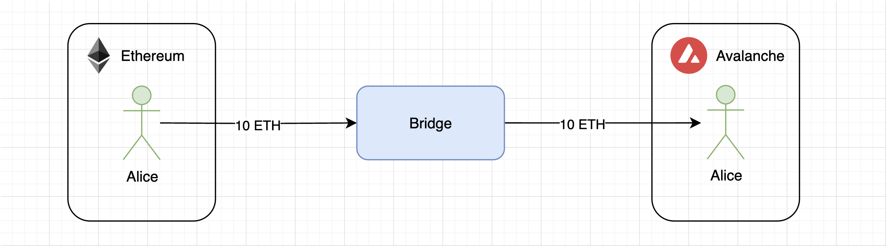

Now Alice can use her ETH in another blockchain. The main idea here is that the bridge acts as a third party, ensuring compatibility between two different blockchains. In this scheme, the third party could even be an ordinary user who has funds in Avalanche.

Of course, a single entity cannot process transactions in two different blockchains, which is why cryptographer and bridge developer [James Prestwich](https://x.com/_prestwich/), in his [presentation on building bridges](https://www.youtube.com/watch?v=ZQJWMiX4hT0), suggests introducing the concept of an "application." This means that blockchain A will have its own application, and blockchain B will have its own. Incidentally, since a bridge can connect not only two different blockchains but also two layers within the same blockchain (Layer 1 and Layer 2), such as between Ethereum and Arbitrum, the term "domain" is used in any article about bridges.

> *Domain* — in the context of bridges, this is the main entity that participates in message exchange on the sender's or receiver's side (e.g., a blockchain or a Layer 2).

Domains can differ significantly (Bitcoin and Ethereum, Ethereum and Solana, Cardano and Polkadot), so for their interaction, each domain requires its own application, while the main data transfer processes will rely on cryptographic principles (signatures, Merkle trees, etc.). Naturally, channels will be needed to connect such applications.

On a more abstract level, the process described above can be visualized as follows:

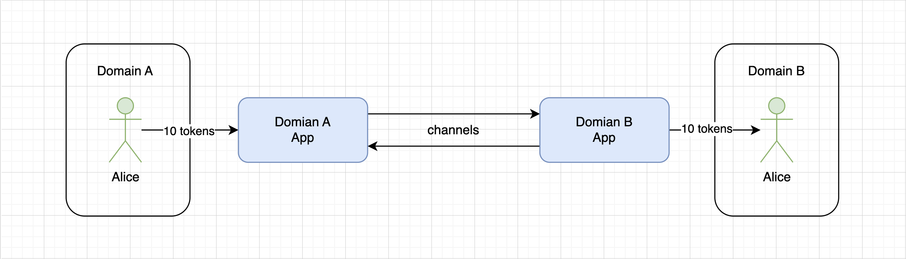

At the same time, **Domain A** cannot simply send a message through the channel to **Domain B** and receive confirmation from **Domain B** that the message was delivered. This is a one-way communication. Therefore, a third party is necessary — verifiers.

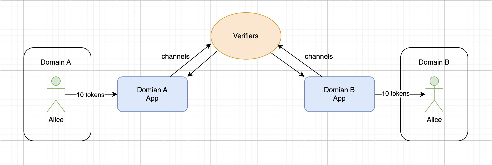

Things get a bit more complicated because, as a rule, the main differences between bridges lie in the verifiers and how they interact with applications. In the context of designing different bridge architectures, there is a concept known as the **interoperability trilemma**, which states that interoperability protocols or bridges can possess only two of the following three properties:

- **Trustlessness** — ensuring security equivalent to the security of the underlying domain.
- **Extensibility** — the ability to support any domain.
- **Generalizability** — the ability to process arbitrary cross-domain data.

You can read more about the trilemma [in this article](https://medium.com/connext/the-interoperability-trilemma-657c2cf69f17). I’ll just provide a visual representation of the trilemma from this article:

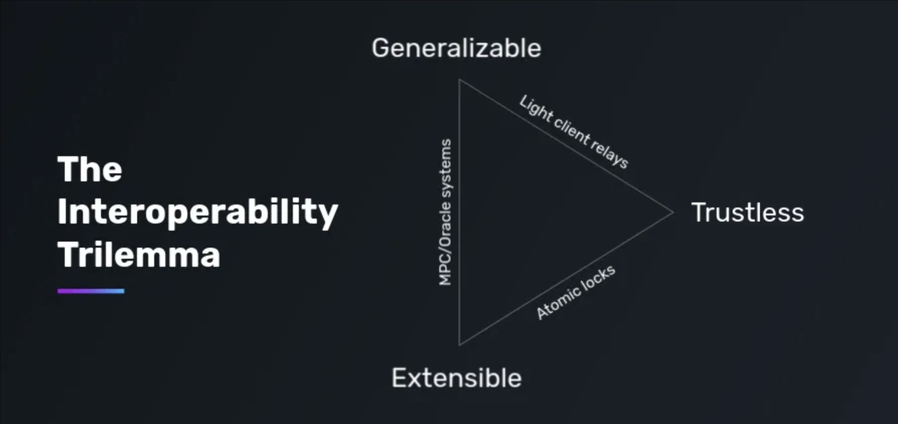

Due to the trilemma, there are many different approaches and solutions, as it is extremely difficult to create a bridge that sufficiently satisfies all the properties. In some cases, such a need does not exist at all.

## Classification of Bridges

The classification of bridges is described in [this article](https://medium.com/1kxnetwork/blockchain-bridges-5db6afac44f8) in considerable detail. It is extensive, so here we’ll briefly cover the key points.

Globally, bridges are usually divided into two types: **trusted** and **trustless**.

- **Trusted** — trusted bridges are externally verified, i.e., they use an external set of verifiers to transfer data between domains: federations with multisignatures, systems of multi-party computation ([MPC](https://en.wikipedia.org/wiki/Secure_multi-party_computation)), oracles networks. Such bridges typically demonstrate good performance in terms of speed and cost-efficiency but come at the expense of security.

- **Trustless** — these bridges rely on the security of the domains they connect to transfer data. Essentially, this is a trustless system, as security must be at the level of the underlying domain. Such bridges are considered more secure. In this case, however, the trade-off is usually either the ability to support a large number of domains or the ability to process arbitrary data.

Overall, this is a very general classification. I liked how it was explained in [the article by the protocol LI.FI](https://blog.li.fi/li-fi-with-bridges-trust-is-a-spectrum-354cd5a1a6d8) the level of trust is represented as a spectrum.

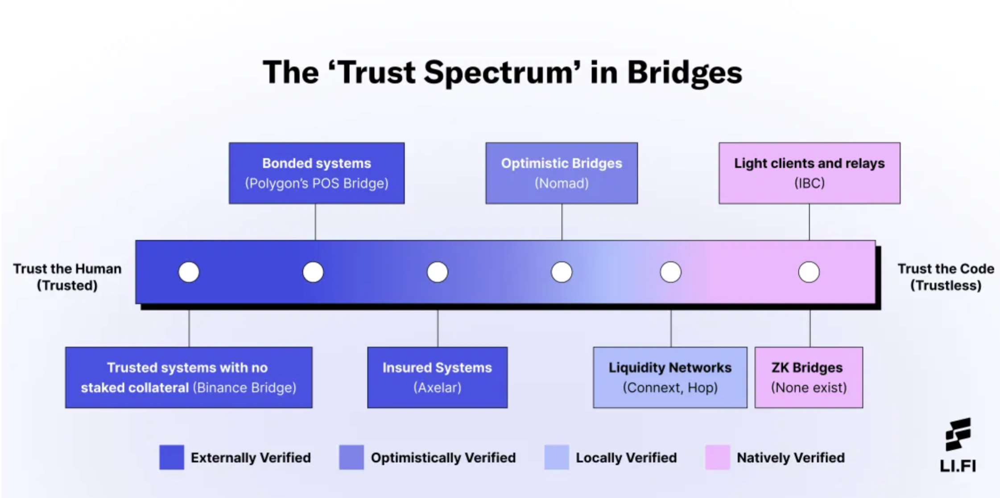

Let’s move from left to right along this spectrum:

- **Trusted system with no staked collateral** — verifiers do not stake collateral, so users will lose funds in case of a failure or hack of the system. The only assurance is the bridge's reputation. Example: [Binance Bridge](https://www.bnbchain.org/en/bnb-chain-bridges).
- **Bounded systems** — verifiers stake collateral in the network's native token, which gives them an economic incentive, but in case of an unfavorable situation, the collateral is likely to be burned. Users will also lose their funds in case of an error or hack. Example: the infamous [Ronin Bridge](https://docs.roninchain.com/validators/onboarding/become-validator#prerequisites).
- **Insured system** — also involves staking collateral, but unlike previous options, users' losses are covered by this collateral. Example: [Axelar](https://docs.axelar.dev/dev/general-message-passing/express/#axelar-intents-express-service).
- **Optimistic bridge** — a system similar to "Optimistic rollups," where all transactions are considered valid unless proven otherwise. Verifiers are observers who have an economic incentive to identify "bad" transactions across the bridge. Example: [Nomad](https://docs.nomad.xyz/the-nomad-protocol/verification-mechanisms/optimistic-verification).
- **Liquidity Networks** — this resembles a p2p network, where each node acts as a liquidity provider for a specific domain (these are called routers). Any user can become a router, with no minimum liquidity requirements. The system includes a sequencer that collects requests and can involve as many routers as needed to fulfill them. Security is ensured through asset locking mechanisms and the ability to dispute router actions. The advantage is that in the destination network, you receive not a derived synthetic asset but funds native to that blockchain. This resembles cross-chain token swaps. Example: [Everclear](https://www.everclear.org/), formerly known as Connext.
- **Light clients and relayers** — here, verifiers are users who monitor events already added to the source blockchain. Proofs are then generated to confirm that the event occurred, and these proofs are sent to the destination domain along with block headers (essentially sending a "light client"). A smart contract in the destination domain verifies the headers, and if the event is confirmed, it executes the action in the destination domain. A relayer is required to forward block headers and proofs. While users can relay transactions themselves, relayers are generally expected to continuously transmit data. This is a relatively secure bridge design, as it ensures reliable delivery without relying on intermediaries (trustless). However, verification in the destination domain is often very costly in terms of gas fees. Example: [Cosmos IBC](https://cosmos.network/ibc/).
- **ZK Bridges** — bridges built on zero-knowledge proofs (ZKP) also use light clients and relayers to verify cross-chain transfers and are considered another form of trustless implementation. Example: [ZKSync bridge](https://portal.zksync.io/bridge/) (works only between Ethereum and ZKSync).

## Types of Bridges

In a basic model, bridges need to track events in the source domain, relay them to the destination domain, and validate the relayed information to function properly. For this reason, most bridges structurally consist of several components:

- **Monitoring**. Typically, there is an entity — either an "oracle," "validator," or "relayer" — that monitors the state of the source domain.
- **Message transmission/relaying**. Once the entity detects an event, it needs to transfer the information from the source domain to the destination domain.
- **Consensus**. In some models, consensus is required among participants monitoring the source domain in order to pass this information to the destination domain.
- **Signing**. Participants need to cryptographically sign the information sent to the destination domain, either individually or as part of a threshold signature scheme.

Based on this structure, there are roughly four types of bridges, each with its own advantages and disadvantages:

1. **Asset-specific** — the sole purpose of this type of bridge is to provide access to a specific asset from one blockchain in another blockchain (in this case, it’s more appropriate to call them blockchains, though they can also be referred to as domains). Assets in the destination blockchain are often "wrapped" and fully backed by the underlying asset. Bitcoin is the most common asset bridged to other blockchains.
2. **Chain-specific** — a bridge between two domains, which works similarly to "asset-specific" bridges but facilitates the transfer of multiple assets (example: Polygon PoS bridge).
3. **Application-specific** — used for a specific application when a DApp supports multichain functionality. It can transfer not only assets but also data (example: Thorchain).
4. **Generalized** — protocols for transferring information between multiple domains (example: Chainlink).

When discussing asset transfers, it’s worth mentioning the most common models of such transfers.

1. We’ve already mentioned "wrapping" an asset from the source domain several times — this is a fairly common method for bridges. It works as follows:
   - In the source domain, the underlying asset is locked, and in the destination domain, its synthetic version is minted at a 1:1 ratio. For example, for BTC, this would be WBTC (Wrapped BTC).
   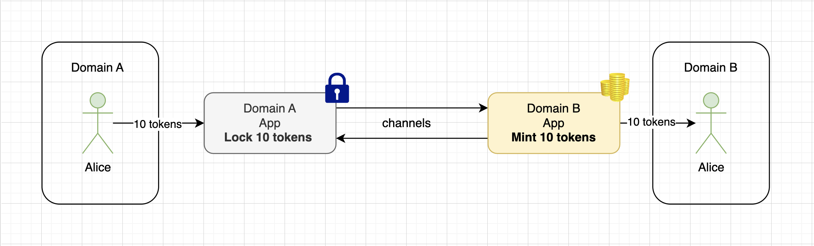
   - During the reverse exchange, in the domain where the "wrapped" asset was minted, the asset is burned, and the underlying asset is unlocked in the source domain.
   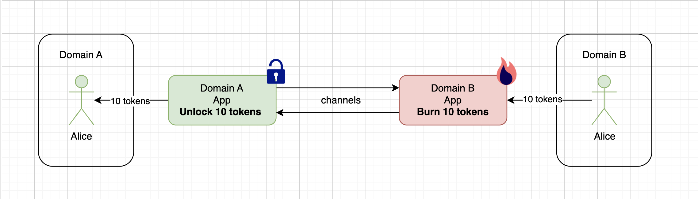

2. The second asset transfer model is called **atomic swaps**. Essentially, this is simply an exchange of tokens from the source domain for tokens in the destination domain. This often uses the HTLC (Hashed Timelock Contracts) scheme. In short, HTLC allows two users to exchange cryptocurrency directly between different domains without having to trust external intermediaries (p2p). A special secret is used for this, which is processed in a specific way on smart contracts, ensuring the transaction is secure for all participants. You can read more about HTLC [here](https://en.bitcoin.it/wiki/Hash_Time_Locked_Contracts) and [here](https://www.youtube.com/watch?v=VZX2ApRLuwM).

## Trade-offs to Consider When Designing a Bridge

When it comes to bridges, there are no perfect solutions — there are always trade-offs necessary to achieve a specific goal. Bridges can be evaluated based on the following factors:

- **Security** — who verifies the system? Bridges secured by external validators are usually less secure than those protected locally or inherently by blockchain validators.
- **Convenience** — how long does it take to complete a transaction, and how many transactions does the user need to sign? How long does it take for a developer to integrate the bridge, and how complex is that process?
- **Connectivity** — what different destination chains can the bridge connect (e.g., rollups, sidechains, other Layer 1 blockchains), and how difficult is it to integrate a new blockchain?
- **Ability to transfer more complex data** — can the bridge facilitate the transfer of messages and more complex arbitrary data across chains, or does it only support cross-chain asset transfers?
- **Economic efficiency** — how much does it cost to transfer assets across chains using the bridge? Bridges typically charge either a fixed or variable fee depending on gas costs and the liquidity of specific routes. It’s also important to assess the economic efficiency of the bridge based on the capital investments required to secure it.

## How to Build Your Own Bridge

### Centralized Version

It’s important to understand that despite the apparent simplicity, building bridges is a non-trivial task. Let’s start with the simplest example.

Given:
- 2 EVM domains;
- 1 centralized observer;
- The task is to transfer an ERC20 token from Domain A to Domain B and back.

We’ll use the test networks Sepolia and Polygon Amoy (as of the time of writing this article, these are relevant, but they can be replaced with any other networks).

The source token will be in the Sepolia network, and we’ll write a [smart contract](./contracts/contracts/OriginToken.sol) for it. All it will do is create an ERC20 token and mint 100 tokens to the deployer’s address.

```solidity
contract OriginToken is ERC20 {
    constructor() ERC20("OriginToken", "OT") {
        _mint(msg.sender, 100e18);
    }
}
```

Next, we create a wrapper, or synthetic token, for our source token, which we will deploy on Polygon Amoy. The full code is [here](./contracts/contracts/DestinationToken.sol).

```solidity
contract DestinationToken is ERC20, ERC20Burnable {
    address _bridge;

    error OnlyBridge();

    constructor(address bridge) ERC20("DestinationToken", "DT") {
        _bridge = bridge;
    }

    // Adding a modifier that will allow minting and burning tokens
   // only from the bridge address
    modifier onlyBridge() {
        if (msg.sender != _bridge) {
            revert OnlyBridge();
        }

        _;
    }

    function mint(address recipient, uint256 amount) external onlyBridge {
        _mint(recipient, amount);
    }

    function burnFrom(address account, uint256 amount) public override(ERC20Burnable) onlyBridge {
        super.burnFrom(account, amount);
    }
}
```

Now we need to deploy the tokens. We will deploy the `OriginToken` on the Sepolia network and the `DestinationToken` on the Polygon Amoy network.

_Note:_ If you want to experiment with this example, you can use already deployed tokens instead of deploying them again. More details [here](./contracts/README.md#centralized-bridge-example).

We now have the addresses of two tokens in different networks. Since these are EVM networks, we can use the same EOA addresses for the sender and receiver of the tokens.

Additionally, we will use one more EOA address — it will act as the bridge, meaning it will hold the users' funds. The idea is that we can track the "Transfer" event on the token smart contracts, and if a transfer is made to the bridge address, we will mint or burn tokens depending on the direction of the transfer.

For this functionality, we will need a watcher — this will be a simple JavaScript script. All you need are RPC addresses to access both blockchains and some test ETH to pay for gas in both networks (you can get some [here](https://faucets.chain.link/sepolia) or [here](https://www.alchemy.com/faucets/ethereum-sepolia)).

The watcher will track all transfers on the original network:

```JavaScript
const originToken = new ethers.Contract(
    ORIGIN_TOKEN_CONTRACT_ADDRESS,
    originTokenAbi.abi,
    bridgeSepolia,
);

originToken.on('Transfer', (from, to, value, event) => {
    if (from == bridgeSepolia.address) {
        return;
    }
    // If the recipient of the tokens in the original network is the bridge address
    // then after receiving the transfer, we mint tokens for the sender
    // on the destination network
    if (to == bridgeSepolia.address && to != from) {
        console.log(
            '\n Tokens received on bridge from Sepolia chain! Time to bridge!',
        );

        try {
            mintTokens(from, value);

            console.log('✅✅✅✅✅ Tokens minted ...');
            console.log('🌈🌈🌈🌈🌈 Bridge to destination completed');
        } catch (err) {
            console.error('Error processing transaction', err);
        }
    } else {
        return;
    }
});
```

If the recipient of the tokens in the original network is the bridge address, then after receiving the transfer, we mint tokens for the sender on the destination network:

```JavaScript
async function mintTokens(recipient, amount) {
    const mintTx = await destinationToken.mint(recipient, amount);
    const mintReceipt = await mintTx.wait();

    if (mintReceipt) {
        // Checking the sender's balance on the Sepolia network
        const originBalance = await originToken.balanceOf(recipient);
        console.log(
            `Sepolia sender balance: ${ethers.formatEther(
                originBalance,
            )} Tokens`,
        );

        // Checking the recipient's balance on the Polygon Amoy network
        const destinationBalance = await destinationToken.balanceOf(recipient);

        console.log(
            `Polygon Amoy recipient balance: ${ethers.formatEther(
                destinationBalance,
            )} Tokens`,
        );
    }
}
```

The watcher is ready, all that remains is to write a separate script for transferring tokens to the bridge address. The main function of this script will perform a single action — transferring tokens to the bridge:

```JavaScript
async function sendOriginTokenToBridge() {
    try {
        const txResponse = await originToken.transfer(
            bridgeWallet.address,
            ethers.parseEther('1'),
        );
        console.log('Tx sent:', txResponse.hash);

        const receipt = await txResponse.wait();
        console.log('Tx confirmed:', receipt.blockNumber);
    } catch (error) {
        console.error('Tx error:', error);
    }
}
```

#### Transferring Tokens from the Original Network to the Destination Network

Now we’re ready for the first transfer. To do this, start by launching the watcher:

```bash
Watching ...
```

After launching the watcher, you need to run the token transfer script in a separate terminal. The script code is [here](./contracts/scripts/sendTokensToDestination.js).

```bash
Tx sent: 0x12fe9602196d5f2e9c8c26ecf170f6804e620b02a4e0461c539d5857d875c895
Tx confirmed: 6594705 // this is just the block number
```

The transaction is complete, and the watcher script should react to this transfer:

```bash
 Tokens received on bridge from Sepolia chain! Time to bridge!
✅✅✅✅✅ Tokens minted ...
🌈🌈🌈🌈🌈 Bridge to destination completed
Sepolia sender balance: 99.0 Tokens
Polygon Amoy recipient balance: 1.0 Tokens
```

Hooray! The tokens were successfully transferred from Sepolia to Polygon Amoy. Now, in the original domain, they will be stored at the bridge address, and their wrapper will be used in the destination network.

#### Transferring Tokens Back to the Original Network

For the reverse transfer, you’ll need to add a few functions to the watcher script to track transfers and burn tokens:

```JavaScript
const destinationToken = new ethers.Contract(
    DESTINATION_TOKEN_CONTRACT_ADDRESS,
    destinationTokenAbi.abi,
    bridgeAmoy,
);

destinationToken.on('Transfer', (from, to, value, event) => {
    if (from == bridgeAmoy.address) {
        return;
    }
    if (to == bridgeAmoy.address && to != from) {
        console.log(
            '\n Tokens received on bridge from Polygon Amoy chain! Time to bridge!',
        );

        try {
            burnTokens(from, to, value);
            console.log('🔥🔥🔥🔥🔥 Tokens burned ...');
            console.log('🌈🌈🌈🌈🌈 Bridge to origin completed');
        } catch (err) {
            console.error('Error processing transaction', err);
        }
    } else {
        return;
    }
});
```

When the reverse operation is performed, synthetic tokens are burned, and tokens in the original network are "unlocked":

```JavaScript
async function burnTokens(from, to, amount) {
    // Before burning tokens, it is necessary to grant approval for this action
    const approveTx = await destinationToken.approve(to, amount);
    const approveReceipt = await approveTx.wait();

    // Burning tokens
    const burnTx = await destinationToken.burnFrom(to, amount);
    const burnReceipt = await burnTx.wait();

    if (approveReceipt && burnReceipt) {
        const destinationBalance = await destinationToken.balanceOf(from);

        console.log(
            `Polygon Amoy sender balance: ${ethers.formatEther(
                destinationBalance,
            )} Tokens`,
        );
    }

    // Transferring tokens in the original network
    const transferTx = await originToken.transfer(from, amount);
    const transferReceipt = await transferTx.wait();

    if (transferReceipt) {
        const originBalance = await originToken.balanceOf(from);

        console.log(
            `Sepolia recipient balance: ${ethers.formatEther(
                originBalance,
            )} Tokens`,
        );
    }
}
```

This time there is a bit more code. The reason is that before burning, you need to grant approval, and after burning, the tokens must be sent from the bridge address to the recipient in the original network. For this, another script is needed to transfer tokens to the bridge in the Polygon Amoy network. The code is very similar to the script used for sending to the destination network, and you can check it out [here](./contracts/scripts/sendTokensToOrigin.js).

After a successful reverse transfer, the watcher should display the following information:

```bash
 Tokens received on bridge from Polygon Amoy chain! Time to bridge!
🔥🔥🔥🔥🔥 Tokens burned ...
🌈🌈🌈🌈🌈 Bridge to origin completed
Polygon Amoy sender balance: 0.0 Tokens
Sepolia recipient balance: 100.0 Tokens
```

We can see that the tokens were delivered to the recipient in the original network. Congratulations, the bridge is ready!

#### Pros and Cons of This Approach

Or is it not ready after all? Earlier, we discussed the main components a bridge consists of. In this example, we only implemented a watcher and a message relayer. However, there is no message verification, no security measures, and no guarantees that the user will receive their funds. Additionally, we should have used signatures that would be transferred from one domain to another.

In such a system, it’s enough for the watcher to stop monitoring events for the bridge to break. Furthermore, in this example, we didn’t account for "transaction finality" ([transaction finality](https://medium.com/coinmonks/understanding-transaction-finality-310e46b47a22)) in either the original or the destination network. Finalizing a transaction could take several minutes, which could also easily disrupt the bridge’s operation. We also used a regular EOA, which could simply take all the funds for itself.

In short, the only advantages of this solution are speed and a user-friendly interface, but overall, this is a very fragile bridge.

*Moral*: You may see a nice bridge interface, but under the hood, it might look like this.

The full code for the watcher is available [here](./contracts/scripts/bridgeWatcher.js), and a detailed guide on deploying the bridge can be found [here](./contracts/README.md).

### Decentralized Version

Fortunately, major protocols aim for decentralization and trustlessness. While this does not guarantee complete security, it reduces the risks associated with centralization, making the bridge less fragile.

Creating such bridges is significantly more complex. An example is the solution provided by the Chainlink protocol, which offers a decentralized protocol called CCIP (Chainlink Cross-Chain Interoperability Protocol) for cross-chain interaction between [EVM-compatible networks](https://docs.chain.link/ccip/supported-networks/v1_2_0/mainnet). CCIP enables the transfer of tokens and arbitrary data in the form of messages.

Chainlink has an article on the [5 levels of cross-chain security](https://blog.chain.link/five-levels-cross-chain-security/#level_5__defense-in-depth), where they rank CCIP at the highest, 5th level due to the involvement of three decentralized layers in the system to ensure the operation of a single protocol.

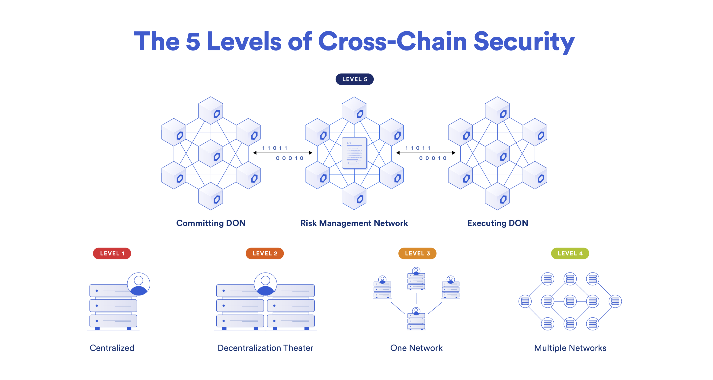

One network is responsible for recording the event in the source domain, the second verifies this recording, and the third performs the actions. These are not separate blockchains but decentralized oracles (DON). Tokens are stored in smart contracts called Token Pools. The workflow looks as follows:


There’s a great [video](https://youtu.be/-2qzC0lqId0?feature=shared) that explains how the protocol works in simple terms. For a more detailed understanding, you can refer to the [official documentation](https://docs.chain.link/ccip/architecture#token-pools).

#### Building the Bridge

To transfer tokens from Domain A to Domain B, we will interact with a Router smart contract in Domain A and an identical smart contract in Domain B. For the example, we’ll again use Ethereum Sepolia and Polygon Amoy, and we can reuse the tokens deployed earlier for the centralized bridge example.

The problem is that CCIP allows transferring only those tokens [for which pools have been created](https://github.com/smartcontractkit/ccip/blob/6bdc1dc03992f698d0dbf60a104a0a5ec8847a34/contracts/src/v0.8/ccip/Router.sol#L136) in the CCIP protocol. However, the good news is that no one has prohibited transferring data. This means we now have a reliable external observer (CCIP), and all that remains is to write Solidity smart contracts that will interact with CCIP routers. In the diagram, this would look as follows (in the diagram, our smart contracts are the dApp and x-dApp).


Yes, we will need to deploy two smart contracts in both networks, but for simplicity, we will create one universal smart contract that will handle both sending and receiving messages. Moreover, it will operate on the "lock and mint" scheme for sending tokens from the source network and "burn and unlock" for their return, just like in the example with the centralized bridge.

To begin, let’s import everything we need:
```solidity
// The Router interface is needed for sending messages
import {IRouterClient} from "@chainlink/contracts-ccip/src/v0.8/ccip/interfaces/IRouterClient.sol";
// The CCIPReceiver smart contract must be inherited to enable message receiving
import {CCIPReceiver} from "@chainlink/contracts-ccip/src/v0.8/ccip/applications/CCIPReceiver.sol";
// The Client library will be useful for both sending and receiving messages
import {Client} from "@chainlink/contracts-ccip/src/v0.8/ccip/libraries/Client.sol";
```

Let’s look at what data will be needed to deploy these smart contracts:
- **router**: The CCIP [Router](https://github.com/smartcontractkit/ccip/blob/a793f34cdd1e87b31511860d10cc9a91e53ee4d5/contracts/src/v0.8/ccip/Router.sol) smart contract for the network where the application will be deployed.
- **token**: Our token (Origin for the source network and Destination for the destination network).
- **link**: the address of the LINK token, which will also differ for each network. This is required to pay for transactions using LINK tokens.
- **originTokenChainSelector**: the selector of the source network, provided by Chainlink. You can check it [here](https://arc.net/l/quote/yaxleotz).
- **thisChainSelector**: the selector of the network where this smart contract will be deployed.

```solidity
contract TokenBridge is Ownable, CCIPReceiver {
    constructor(
        address router, // The CCIP Router smart contract for the respective network
        IToken token, // Origin or Destination
        address link, // The LINK token address for the respective network
        uint64 originTokenChainSelector, // The selector of the source network
        uint64 thisChainSelector // The selector of the network where the application is being deployed
    ) Ownable(msg.sender) CCIPReceiver(router) {
        _token = token;
        _link = link;
        _originTokenChainSelector = originTokenChainSelector;
        _thisChainSelector = thisChainSelector;
    }
}
```

It’s worth saying a few words about payment. If in the network where you are sending the message the fee is paid in the native currency, in the destination network it can be paid in two ways: in the native currency or in LINK tokens. Therefore, we’ll need an `enum` like this.

```solidity
    enum PayFeesIn {
        Native,
        LINK
    }
```

Now for the main function for sending messages. Here’s what it does:

1. The first three parameters of the `sendToken` function relate to the destination network (the selector, the address of the bridge smart contract, and the recipient's token address). The addresses are validated immediately, while the selector will be validated by the Router.
2. Next, we need to form the data for transmission and estimate its cost (I’ve moved this to a separate function, which I’ll explain shortly).
3. Define the payment method and verify that enough Ether has been provided if the native payment method is chosen.
4. Depending on the payment method, send the message to the router so it can forward it to the destination network.
5. If the message is sent successfully, deduct the user’s tokens (Origin or Destination). For simplicity, we assume that once the message is received in the destination network, the code executes successfully.
6. Finally, determine where we are, and if it’s the network with the synthetic token, burn the token.

```solidity
    function sendToken(
        uint64 destinationChainSelector, // The selector of the destination network
        address destinationBridgeAddress, // The bridge of the destination network
        address destinationChainReceiver, // The recipient of the tokens
        address tokenSender, // The sender of the tokens
        uint256 amount, // The amount of tokens
        PayFeesIn payFeesIn // The payment method
    ) external payable returns (bytes32 messageId) {
        // Validate the addresses
        if (destinationBridgeAddress == address(0) || destinationChainReceiver == address(0)) {
            revert InvalidReceiver();
        }

        // Prepare data for sending
        (bytes memory sendingData, Client.EVM2AnyMessage memory message, uint256 fee) = prepareMessage(
            destinationChainSelector, destinationBridgeAddress, destinationChainReceiver, amount, payFeesIn
        );

        // Verify that enough Ether has been provided, if required
        if (payFeesIn == PayFeesIn.Native && fee > msg.value) {
            revert NotEnoughValueSent(msg.value, fee);
        }

        // Depending on the payment method, send the message either with Ether or with LINK
        if (payFeesIn == PayFeesIn.Native) {
            messageId = IRouterClient(i_ccipRouter).ccipSend{value: fee}(destinationChainSelector, message);
        } else {
            IToken(_link).transferFrom(tokenSender, address(this), fee);
            IToken(_link).approve(i_ccipRouter, fee);

            uint256 linkBalance = IToken(_link).balanceOf(address(this));
            if (fee > linkBalance) {
                revert NotEnoughLinkBalance(linkBalance, fee);
            }
            messageId = IRouterClient(i_ccipRouter).ccipSend(destinationChainSelector, message);
        }

        emit MessageSent(messageId, destinationChainSelector, destinationBridgeAddress, sendingData, tokenSender, fee);

        // Deduct tokens from the user
        bool success = _token.transferFrom(tokenSender, address(this), amount);
        if (!success) {
            revert TransferFailed();
        }

       // If this is the destination network, burn the tokens
        if (_thisChainSelector != _originTokenChainSelector) {
            _token.approve(address(this), amount);
            _token.burnFrom(address(this), amount);
        }
    }
```

Now about preparing the data. It’s important to note that the recipient's address must be in `bytes32` format, so we encode it along with the amount using `abi.encode()`.

```solidity
    function prepareMessage(
        uint64 destinationChainSelector,
        address destinationBridgeAddress,
        address destinationChainReceiver,
        uint256 amount,
        PayFeesIn payFeesIn
    ) public view returns (bytes memory sendingData, Client.EVM2AnyMessage memory message, uint256 fee) {
        // Prepare the message content
        sendingData = abi.encode(destinationChainReceiver, amount);

        // Format the message in the correct structure (see below)
        message = _buildCCIPMessage(destinationBridgeAddress, payFeesIn, sendingData);

        // Calculate the fee in ETH or LINK depending on the payFeesIn parameter
        fee = IRouterClient(i_ccipRouter).getFee(destinationChainSelector, message);
    }
```

The message itself will contain the following information:
- The recipient's address;
- The data we prepared for transmission;
- The amount of tokens (if we are transferring tokens that have pools in CCIP), in our case, an empty array;
- Additional arguments, which are also encoded in a special way, such as the `gas limit` for executing code in the destination network;
- The payment token.

```solidity
    function _buildCCIPMessage(address destinationBridgeAddress, PayFeesIn payFeesIn, bytes memory data)
        private
        view
        returns (Client.EVM2AnyMessage memory)
    {
        return Client.EVM2AnyMessage({
            receiver: abi.encode(destinationBridgeAddress),
            data: data,
            tokenAmounts: new Client.EVMTokenAmount[](0),
            extraArgs: "",
            feeToken: payFeesIn == PayFeesIn.LINK ? _link : address(0)
        });
    }
```

We’ve figured out how to send the message. The recipient must inherit from [CCIPReceiver](https://github.com/smartcontractkit/ccip/blob/6ffa59d2853e45e2e11d2bb7e3feeec33718bd3b/contracts/src/v0.8/ccip/applications/CCIPReceiver.sol#L4) and must include the `_ccipReceive` function, which will handle the received message. Since this function in our smart contract is universal, it will handle both the receipt of Origin tokens and Destination tokens. In other words, we either "unlock" tokens and send them to the recipient, or we mint them.

```solidity
    function _ccipReceive(Client.Any2EVMMessage memory message) internal virtual override {
        // Decode the transmitted data
        (address destinationChainReceiver, uint256 amount) = abi.decode(message.data, (address, uint256));

        // Depending on the network we are in, mint the tokens or send them to the recipient's address
        if (_thisChainSelector != _originTokenChainSelector) {
            _token.mint(destinationChainReceiver, amount);
        } else {
            bool success = _token.transfer(destinationChainReceiver, amount);
            if (!success) {
                revert TransferFailed();
            }
        }
    }
```

That’s it! The full code of the smart contract is available [here](./contracts/contracts/ccip/TokenBridge.sol).

#### Sending Messages from the Source Domain to the Destination Domain and Back

To transfer tokens via the bridge, you just need to interact with the smart contract. However, since the centralized bridge example included scripts, I’ve created scripts for this case as well. There’s no need to include all the code here, so I’ll just provide links to the scripts and instructions for using them:

- Script for sending Origin tokens from Sepolia to Polygon Amoy — [link](./contracts/scripts/ccip/sendTokensToDestinationCCIP.js).
- Script for sending Destination tokens back from Polygon Amoy to Sepolia — [link](./contracts/scripts/ccip/sendTokensToOriginCCIP.js).
- Detailed instructions — [link](./contracts/README.md#decentralized-bridge-example-chainlink-ccip) (if you haven’t run the first example, you’ll need to set up the project; the setup instructions are at the beginning of the file).

_Note:_ All smart contracts are already deployed, so you only need to configure `.env` and mint some Origin tokens for yourself (instructions on how to do this are also included). You’ll need test ETH and LINK (LINK is required for the Polygon Amoy network and can be obtained [here](https://faucets.chain.link/)).

One more important note: transactions in CCIP are processed quite slowly (20–30 minutes). After sending a message, you can take the hash of the transaction (or the `messageId`), go to [CCIP Explorer](https://ccip.chain.link/), and check the status of the transaction. It looks like this:

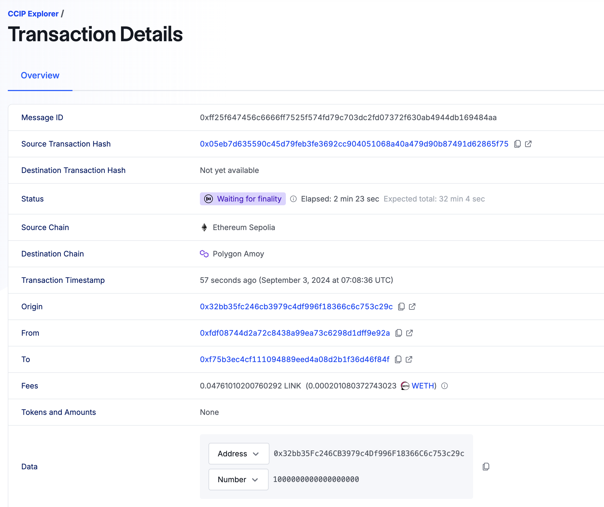

When the transaction is completed, you will be able to see the transactions in both chains as well as the transaction cost in the destination network. By the way, you can check the approximate cost of such transactions [in this table](https://arc.net/l/quote/bpccutmc).

## Risks of Bridges

It’s worth discussing the risks associated with interacting with or developing bridges. As of today, the three largest [hacks](https://rekt.news/leaderboard/) in DeFi involve bridges. In fact, the "leader" of this statistic, Ronin Network, was hacked twice! The total amount of stolen funds is measured in the [billions of dollars](https://defillama.com/hacks).

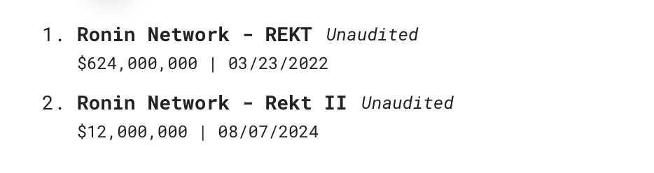

At the same time, it’s worth noting that this is not the only bridge that has been hacked multiple times.

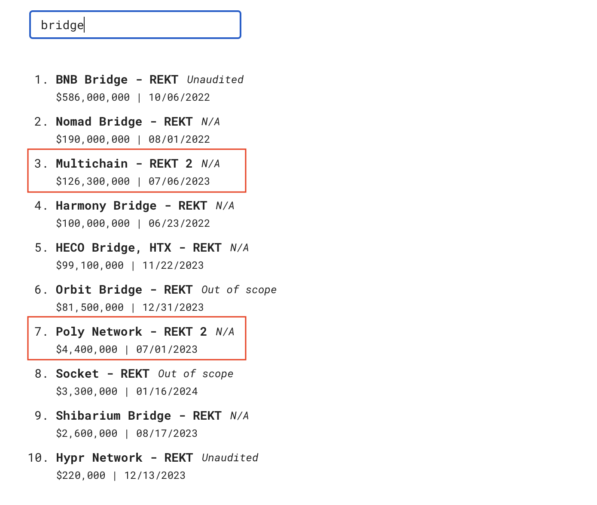

In reality, not all hacks are listed under the keyword "bridge," such as the Ronin case. But I think you’ve already realized the scale of the problem is truly significant.

### Classification of Risks

1. One of the main risks is **errors in smart contracts**. The second Ronin Network hack occurred due to a [stupid mistake](https://rekt.news/roninnetwork-rektII/) during a smart contract update.
2. **Systemic financial risks**. Bridges often lock tokens on the source chain and create synthetic assets on the destination chain. A hack of the locked tokens or an attack on the synthetic tokens can devalue all such tokens and create systemic risk for the entire blockchain ecosystem, including DApps that operate with these assets.
3. **Early stage of development**. Bridges are a new technology, and their behavior under different market conditions has not been sufficiently studied.
4. **Trust minimization risks (counterparty risk)**. Some bridges rely on third-party participants to verify transactions, which requires trust in them. Other bridges minimize trust by relying only on blockchain validators.
5. **Cryptography risks**. Some bridges are secured by multisignatures (multisig), which poses a risk if attackers compromise a sufficient number of keys.
6. **Optimistic bridges**. These bridges depend on honest observers who monitor operations. If attackers manage to hack all observers, it could lead to losses. However, such an attack is economically disadvantageous and extremely complex.
7. **Verification methods**:
   - **Web2 verification**: Using centralized services to exchange or transfer tokens between chains, which requires trust in the intermediary.
   - **External verification**: A group of validators verifies transactions, requiring an honest majority and potentially including methods to minimize trust.
   - **Local verification**: Verification occurs between counterparties, minimizing trust but limited in application.
   - **Native verification**: Validators of the target chain verify the source chain, providing trust minimization but requiring more resources and being suitable for similar blockchains.

Each verification method has its own advantages and disadvantages, depending on the goals and conditions of use.

You can read more about the risks [here](https://arc.net/l/quote/fafbuydl).

## Conclusions

A bridge is a complex thing, and if it’s simple, it’s often unreliable. That’s why the bridges you plan to use need to be chosen carefully, and development should be approached responsibly.

A decentralized bridge with trust minimization can be just as vulnerable as a centralized one if there’s a bug in its smart contract. This highlights that decentralization and the presence of reliable verifiers are not a panacea. However, decentralization, updates via DAOs, and more transparent models are certainly preferable.

Bridges concentrate massive liquidity, and any, even minor, mistake can be fatal. Even the largest teams in the world have made mistakes, and code that underwent audits by top firms in the industry has been hacked. It’s something to seriously think about, isn’t it?

Also, if we consider the more mundane tasks of bridges, sometimes they’re necessary for one ecosystem to gain liquidity from another ecosystem. This isn’t necessarily beneficial for the "donor ecosystem," but if the bridge operates in both directions, the odds are balanced. In the case of Layer 2, it shouldn’t be viewed as stealing liquidity from L1, as L2 cannot exist without the underlying L1.

Overall, it seems that blockchain ecosystems can no longer function without bridges. More and more cross-chain protocols are emerging, and sometimes it’s simply more convenient to keep liquidity in different places. Of course, this still comes at a high price — quite literally — but there’s hope that over time, these solutions will become increasingly reliable.

## Links

- [Video: The Impossible Dilemma of Blockchain Bridges](https://youtu.be/4QHflfHMga0?feature=shared)
- [Video: James Prestwich: Building Bridges, Not Walled Gardens](https://www.youtube.com/watch?v=ZQJWMiX4hT0)
- [Video: What is Chainlink CCIP?](https://youtu.be/-2qzC0lqId0?feature=shared)
- [Article: Bridges (ethereum.org)](https://ethereum.org/en/developers/docs/bridges/)
- [Article: The Interoperability Trilemma](https://medium.com/connext/the-interoperability-trilemma-657c2cf69f17)
- [Article: Blockchain Bridges: Building Networks of Cryptonetworks](https://medium.com/1kxnetwork/blockchain-bridges-5db6afac44f8)
- [Article: LI.FI: With Bridges, Trust is a Spectrum](https://blog.li.fi/li-fi-with-bridges-trust-is-a-spectrum-354cd5a1a6d8)
- [Article: How to create an EVM compatible blockchain bridge](https://chainstack.com/how-to-create-blockchain-bridge/)
