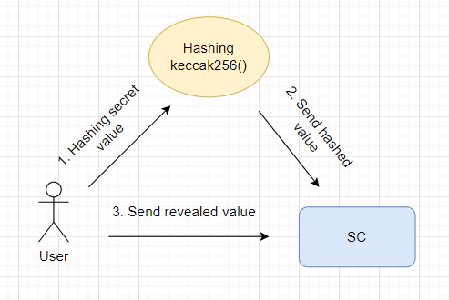

# Commitment scheme

**Author:** [Pavel Naydanov](https://github.com/PavelNaydanov) 🕵️‍♂️

_Watch out!_ **Commitment scheme** is a cryptographic algorithm that allows you to commit to a value (a statement) while keeping it hidden from others, with the possibility to reveal it later.

This solution works in such a way that once the value is committed, it cannot be changed.

The concept of **commitment scheme** was first formalized by *Gilles Brassard*, *David Chaum*, and *Claude Crépeau* in 1988 as part of zero-knowledge protocols for [NP problems](https://en.wikipedia.org/wiki/NP_(complexity)). However, this concept had been used before.

_Important!_ What I will discuss can also be referred to as a **commit-reveal** scheme. In our context, I will use both terms.

## Why is it relevant?

Many blockchains, including Ethereum, are public. This means that any data inside such a blockchain is accessible to any participant. This "advantage" complicates the handling of private data where it is truly needed. A classic example is the game of "Rock, Paper, Scissors." The game requires keeping a player's choice secret until the opponent has made their choice. Otherwise, a player might base their choice on the opponent's choice (reading the opponent's choice from the public blockchain).

In such cases, using a **commitment scheme** helps to temporarily secure the privacy of data.

## How does it work?



The process consists of three actions: [hashing](https://en.wikipedia.org/wiki/Hash_function) the value that needs to be hidden, sending the hashed value to a smart contract, and sending the original (revealed) value to the smart contract to confirm the initial value.

However, these three actions usually fit into two stages:
1. **Commit phase**. A hash of the secret value is created and sent to the smart contract.
2. **Reveal phase**. The secret value is revealed. The base value (the value that was hashed) is sent in plain form to the smart contract. The smart contract independently hashes the received value and checks for correspondence with the value sent during the **commit phase**. If the hash values match, it means the revealing of the secret value was successful.

In the implementation of smart contracts in Solidity, the function [`keccak256()`](https://docs.soliditylang.org/en/latest/units-and-global-variables.html#mathematical-and-cryptographic-functions) is used for hashing.

_Important!_ In most cases, the **commit** and **reveal** phases are strictly time-limited.

After all the values are revealed, the smart contract is ready to perform any business logic embedded in it: counting votes, determining the winner of a lottery, and so forth.


## Use Cases

1. **Random Number Generation**. Oracles are increasingly becoming monopolists in this area, for instance, [chainlink VRF](https://dev.chain.link/products/vrf). However, the **commit-reveal** scheme can serve as an alternative approach to ensure reliability and randomness of generated values. Such a scheme might look like [this](https://github.com/randao/randao/blob/master/contracts/Randao.sol).

2. **Voting**. To ensure anonymity and prevent fraud in voting. This allows maintaining confidentiality during the voting stage, revealing votes only at the moment of counting.

3. **Initial Concealment of NFT Images**. Hashing is not always used in this scheme, but the approach is similar overall: replace metadata until demand arises or the reveal phase occurs. The substituted metadata returns information that does not disclose the NFT data.

4. **Games, Lotteries, Auctions**. Perfectly suited for domains where a hidden bid (prediction, assumption) is a key factor. Using the **commit-reveal** scheme to collect hidden information with subsequent disclosure maintains fairness in determining winners.

5. **Any Confidential Processes**. The **commit-reveal** scheme can be applied in various contexts where data confidentiality is important and manipulation of public data needs to be prevented.

## Example Code

The simple smart contract below demonstrates the **commit-reveal** scheme. The order of interaction with the smart contract:

1. Generate a hash for the text string `getHash(0x5B38Da6a701c568545dCfcB03FcB875f56beddC4, "Be happy!")`

    As a result, the hash `0x9e986e680a9a04cea824e4f0bdfa67a872878f2485628a12d056a4bff0528bb6` is obtained.
2. Send the obtained hash to the smart contract.
    `commit(0x9e986e680a9a04cea824e4f0bdfa67a872878f2485628a12d056a4bff0528bb6)`
3. Reveal the value of the text string `reveal("Be happy!")`.

```solidity
// SPDX-License-Identifier: Unlicensed
pragma solidity 0.8.21;

/**
 * @title Commit-reveal schema
 * @notice The smart contract implements the process of storing the hashed value of a string followed by its revelation.
 * @dev To hash the value, use the public function getHash().
 */
contract CommitReveal {
    mapping (address account => bytes32 hash) private _hashes;

    event Committed(address indexed account, bytes32 hash);
    event Revealed(address indexed account, string value);

    error HashAlreadyCommitted();
    error NotCommitted();
    error ValueNotMatchHash();

    /**
     * @notice Stores a private test string
     * @param hash Hash of the private string
     * @dev To obtain the hash, use the public function 
getHash()
     */
    function commit(bytes32 hash) external {
        if (hasHash(msg.sender)) {
            // Prevent re-saving the hash
            revert HashAlreadyCommitted();
        }

        // Save the hash
        _hashes[msg.sender] = hash;

        emit Committed(msg.sender, hash);
    }

    /**
     * @notice Reveals the user's private string
     * @param value The revealed string
     */
    function reveal(string memory value) external returns (string memory) {
        if (!hasHash(msg.sender)) {
            // Cancel the transaction if the hashed value was not added
            revert NotCommitted();
        }

        // Retrieve the hashed value
        bytes32 hash = getHash(msg.sender, value);

        if (hash != _hashes[msg.sender]) {
            // Cancel the transaction if the hashed value does not match the stored hashed value from the commit stage
            revert ValueNotMatchHash();
        }

        // Remove the stored hashed value
        // This allows the user to call the commit() function again
        delete _hashes[msg.sender];

        // Emit an event, thereby revealing and confirming the correctness of the disclosure
        emit Revealed(msg.sender, value);

        return value;
    }

    /**
     * @notice Checks for the presence of a stored hashed value
     * @param account Account address
     * @return True if the hashed value was added, otherwise - false
     */
    function hasHash(address account) public view returns (bool) {
        if (_hashes[account] != bytes32(0)) {
            return true;
        }

        return false;
    }

    /**
     * @notice Retrieves the hash value
     * @param account Account address
     * @param value The secret value to hash
     */
    function getHash(address account, string memory value) public pure returns (bytes32) {
        return keccak256(abi.encodePacked(account, value));
    }
}
```

## Conclusion

**Commitment scheme** is a simple and powerful mechanism that allows building applications based on trust.

Its application depends on the specific needs and requirements of the project or application. This scheme helps ensure safe and trusted disclosure of data in the context of decentralized systems.

## Links

1. [Commitment scheme](https://en.wikipedia.org/wiki/Commitment_scheme) - Wikipedia
2. [Article](https://medium.com/@0xkaden/exploring-commit-reveal-schemes-on-ethereum-c4ff5a777db8) about commit-reveal and an example of the "Rock, Paper, Scissors" game.
3. [Blind auction](https://docs.soliditylang.org/en/v0.8.23/solidity-by-example.html#id2) from the Solidity documentation
4. Interesting project [randao](https://github.com/randao/randao/tree/master). Implements a DAO for generating random values and delivering them to the network. Such an approach has been adapted with some modifications in the operation of some blockchains ([Tezos](https://tezos.gitlab.io/active/randomness_generation.html#randao), [Ethereum](https://ethereum.org/en/developers/docs/consensus-mechanisms/pos/faqs#how-are-validators-selected))
