# Gnosis conditional token framework (CTF)

**Author:** [Pavel Naydanov](https://github.com/PavelNaydanov) 🕵️‍♂️

The concept of the **"Gnosis conditional token framework"** implements a codebase for tokenizing potential outcomes in prediction markets. Such markets are often referred to as information markets, idea futures, decision markets, or virtual stock markets. Essentially, they all mean the same thing. What unites them is that users bet or vote on the outcomes of various events. The main value of prediction markets is in forming the cost of the outcomes for which users vote. The cost helps to analyze and even forecast anything from small sporting events to decision-making options in management.

We will consider CTF within the framework of a prediction market implemented on a blockchain, so it is important to understand that the main logic will be executed through smart contracts.

You can take a look at the diagram below to get a simplified understanding of what a prediction market looks like.

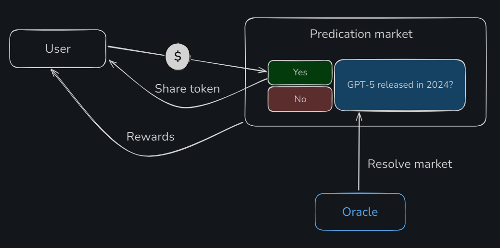

The prediction market features the event *"GPT-5 released in 2024?"*. The user votes for one of the outcomes, either *"Yes"* or *"No"*. In essence, they are placing a bet. Under the hood, they will be purchasing a certain amount of **share tokens** using a base token. The share token defines each of the outcomes. If their bet is successful, they will receive a reward, essentially a payout.

Since a prediction market is an isolated system implemented through blockchain smart contracts, the data regarding the event’s results will be provided by a special oracle trusted by the protocol, and by us as well.

It's also worth noting that a user who has acquired a share token can, at any moment before the event is resolved and the results are available, sell and exchange the share token back for their base asset. I try to avoid using this word in reviews, but it turns out this is a basis for trading. I’m not a trader myself and I’m not encouraging you to be either.

## Basic Combinatorics

Essentially, CTF is used to tokenize prediction outcomes. For the event "GPT-5 released in 2024?", which we examined above, only two outcomes are defined. We will give the outcomes the code names "Y" and "N".

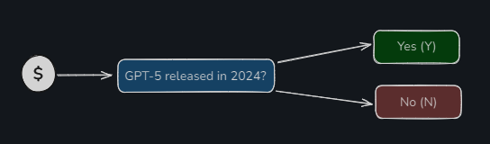

However, a prediction market can be large, and there can be many events within it. Let's look at another prediction: "Will GPT limit requests to 10 per hour until August?". This prediction also has two outcomes. Let's give them the code names "B" and "A".

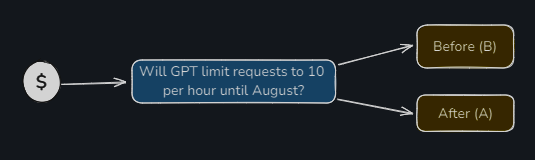

These two predictions are directly related, and we can look at all possible outcomes within the scope of two events.

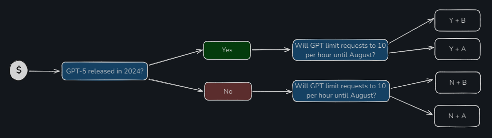

Also, don't forget about the reverse order of combinations.

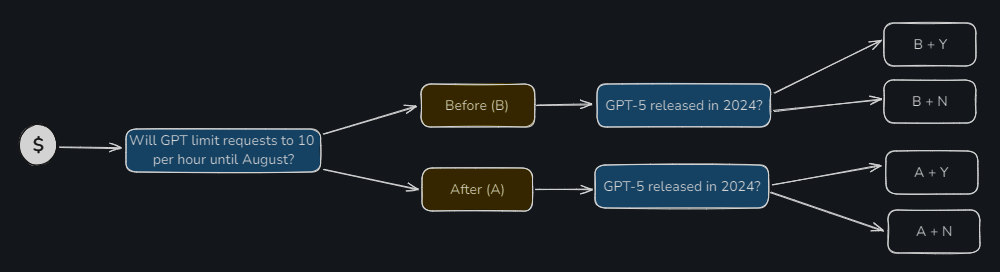

Let's assume the user participates in voting for both predictions at once. As a result, we have eight different user behavior options, considering the order of their actions (first the first prediction, then the second, and vice versa). In the classic approach to building a prediction market, this really results in eight variations.

Now, here's where CTF comes into play, allowing us to simplify the number of combinations down to 4, because everything happens on a single contract and interdependent conditions are processed under the hood—more precisely, opposite combinations are merged.

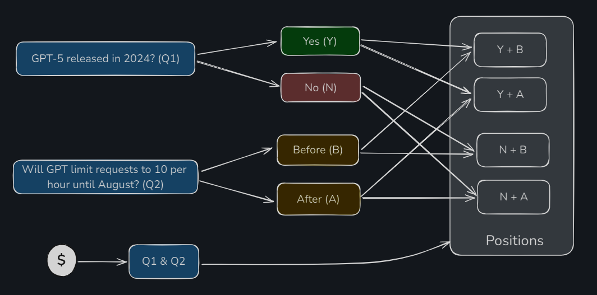

Within the CTF framework, each of the four combinations is called a **position**. This means that each position can represent a user's prediction for several events at once. Moreover, this approach allows for the creation of forecasts that not only correlate but also depend on each other. For example, "What will Bitcoin’s price be if Trump wins the election?"

## Use Cases for CTF

Everything we've discussed above leads us to the idea that the conditional token framework can only be used for prediction markets. And indeed, that's true. The user expresses their opinion by voting with an asset, and this allows for gathering the most accurate prediction from a group of users. This prediction is highly likely to be close to the truth.

However, what is not immediately noticeable is what lies behind the voting process. It's the purchase of a share token at a specific market price. Moreover, prediction markets offer not just buying; holders of share tokens can sell them at any time. Selling also happens at market price. Do you catch the connection? Add a couple of tools like limit orders, and you’ve already got something like an exchange based on a prediction market.

The protocol itself believes that CTF is not limited to prediction markets and suggests it can be applied in fields such as:
- **gameFI.** In a gaming context, tokens can be used to create rewards or achievements that depend on meeting certain conditions within the game. For example, players can receive tokens for completing difficult tasks or reaching certain levels in the game.
- **payment systems**. For example, tokens can be used to implement purchase agreements, where payments are only made upon fulfillment of predefined conditions, such as the delivery of goods or completion of a service.
- **options.** For example, a token can be created to implement an option that activates if an asset's price reaches a certain level.
- And so on. Take any subject area, add a "condition" to it—if the token fulfills the condition, something works in that subject area.

However, I am skeptical about other use cases. To me, they seem forced, and I believe the best application is prediction markets with the ability to buy or sell share tokens. If you don’t believe me, [read](https://docs.gnosis.io/conditionaltokens/use-case) what Gnosis itself writes about this and draw your own conclusions.

## AMM for Prediction Markets

What does AMM have to do with this, you ask? After all, a prediction market isn't a dex. However, to be able to buy and sell **share** tokens, associating them with your prediction, bet, or position, it’s necessary to calculate the value of a share token.

Let's imagine that there is an event in the prediction market: "Will the Portugal national team win the World Cup this year?" This event has 100 "for" share tokens and 100 "against" share tokens. I don't believe it, so I vote against and buy 70 corresponding share tokens. Anyone else might think like I do, and at some point, there could be a situation where there aren't enough tokens available for a new user to vote. To avoid this situation, we use an **Automated Market Maker**. This is the same technology used for automatic asset pricing in decentralized exchanges (dex). The price calculation is based on the ratio of the asset reserves in the pool (on the smart contract).

In essence, the market maker monitors, using algorithms and math, to ensure that the reserves of both assets in the pool don’t run out. So, when one asset becomes less available than the other, the price of the first asset rises. This is true for the second asset as well.

Gnosis offers two market makers:
- **CPMM** (Constant Product Market Maker)
- **LMSR** (Logarithmic Market Scoring Rule)

### CPMM

It uses the same algorithm as the Uniswap and Balancer pools. It follows the same formula `x * y = k`;

Where:
**x** - the amount of one asset in the liquidity pool
**y** - the amount of the other token in the liquidity pool
**k** - a constant value representing the product of the two asset amounts **x** and **y** in the pool. The value of k remains unchanged with every transaction, which is the key invariant of this model.

The advantage of this market maker is that its math is simple. There’s no need to program logarithms.

### LMSR

Initially, LMSR was a pricing mechanism developed for use in prediction markets. It uses a logarithmic function to determine the probability of an outcome. The more users vote on a specific outcome, the higher the probability (and, accordingly, the cost) of that outcome.

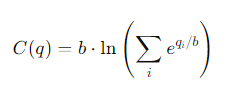
Where:
- **C(q)** - the cost function.
- **q[i]** - the number of bets on the i-th outcome of the event
- **b** - the liquidity parameter, which adjusts how quickly prices change as the volume of bets changes.

LMSR is more scientific and better researched compared to CPMM. It allows for better risk and volatility control of assets by limiting maximum losses through the **b** liquidity parameter.

## Framework

From everything we’ve discussed above, it becomes clear that the framework is composite and includes two major modules:
- [Conditional tokens](https://github.com/gnosis/conditional-tokens-contracts/tree/master). These represent a conditional token based on ERC-1155. It includes the logic for calculating a user’s position on events.
- [AMM for conditional tokens](https://github.com/gnosis/conditional-tokens-market-makers/tree/master). Essentially, this is the liquidity responsible for trading position tokens and for price formation.

These two major modules are located in separate repositories. Additionally, there is a separate repository containing [utils](https://github.com/gnosis/util-contracts) that are used for AMMs.

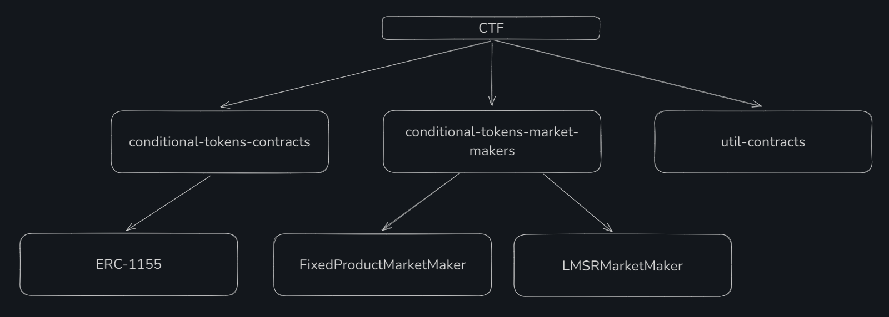

The story behind **util-contracts** is interesting. This repository is used in the market maker factory smart contracts. For example, in [FixedProductMarketMakerFactory.sol](https://github.com/gnosis/conditional-tokens-market-makers/blob/master/contracts/FixedProductMarketMakerFactory.sol#L6).

```solidity

import { ConstructedCloneFactory } from "@gnosis.pm/util-contracts/contracts/ConstructedCloneFactory.sol";

```

However, if we check the util-contracts repository itself, we won’t find the `ConstructedCloneFactory.sol` smart contract there. Apparently, something went wrong, and it didn’t survive the alpha version, but it’s possible to find it. You can pull it from the npm versions. Here’s the [link](https://www.npmjs.com/package/@gnosis.pm/util-contracts/v/3.0.0-alpha.3?activeTab=code).

## Technical Breakdown

Below, we'll break down the code of each framework module separately. This section is intended for those familiar with development.

### Conditional Tokens

**Conditional tokens** organize the process of working with share tokens, allowing users to make predictions. They enable the combination of predictions, reflecting the user's opinion.

The logic of **conditional tokens** is implemented in this [repository](https://github.com/gnosis/conditional-tokens-contracts).

The main smart contract we need is [ConditionalTokens.sol](https://github.com/gnosis/conditional-tokens-contracts/blob/master/contracts/ConditionalTokens.sol). It is the entry point from which you should begin your study. The smart contract inherits from [ERC1155.sol](https://github.com/gnosis/conditional-tokens-contracts/blob/master/contracts/ERC1155/ERC1155.sol) and uses the [CTHelpers.sol](https://github.com/gnosis/conditional-tokens-contracts/blob/master/contracts/CTHelpers.sol) library to store auxiliary functions.

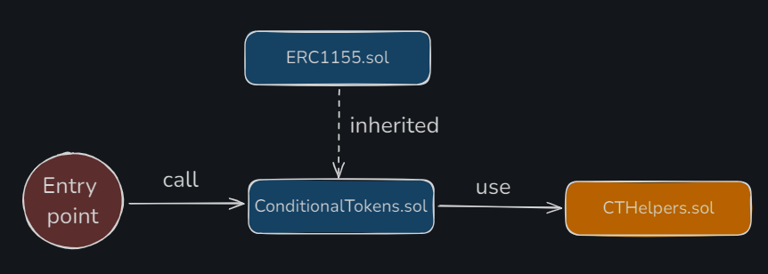

❗️ To move further, we need to discuss terminology. This might get a bit tricky, but it’s very important for the further understanding of the article.

**Condition and outcomes**

First and foremost, let's talk about a prediction, also known as a forecast, event, statement, or question. In the code, we will refer to all of these as **condition**, and its possible outcomes as **outcomes**.

In essence, a **condition** is a question posed to an oracle, which it must answer. Such a **condition** requires its own identifier (**conditionId**), which is the result of hashing three parameters:
- **oracle.** The address of the oracle that will compute the result of the event.
- **questionId.** An external identifier for the condition. It is assumed to be of the `bytes32` type and is left to the discretion of the user creating the prediction via the smart contract call. It could be a counter where each new prediction increments the counter by one, or it could use a more complex scheme, such as hashing the text and other data. It will be used by the oracle.
- **outcomeSlotCount.** The number of outcomes for the prediction.

To obtain the prediction identifier, the function [getConditionId()](https://github.com/gnosis/conditional-tokens-contracts/blob/master/contracts/ConditionalTokens.sol#L268) is used.

### Index Set

Outcome information (true or false) will be encoded using a bit array called the **Index set**. For example, there are three outcomes: A, B, C. Then the truth of A and B can be encoded starting from the least significant bit as `0xCBA -> 0x011`, where a one means the outcome is true, and a zero means false.

### CollectionId

The **Index Set** allows encoding the event outcomes to show which outcome the user is voting for. For each of these binary encodings, a decimal representation can be derived. For example, `0x011 -> 3`. To ensure the smart contract can precisely determine that this **index set** refers to a specific event, a **collectionId** will be generated based on:
- The `indexSet`, expressed in decimal.
- The `conditionId`.
- The `parentConditionId`.

In essence, the **index set** allows you to describe all the possible combinations a user can vote for. Each of these combinations will have its own unique identifier called `collectionId`.

To obtain the outcome collection identifier, the function [getCollectionId()](https://github.com/gnosis/conditional-tokens-contracts/blob/master/contracts/ConditionalTokens.sol#L276C14-L276C29) is used.

### Position

The last term we need to discuss is **position**. This is simply a combination of the outcomes chosen by the user (which are encoded using the index set) and the collateral asset for the position. The collateral asset is the base token of the prediction market, used to purchase share tokens for a specific outcome.

A position, similarly, has an identifier. It is called `positionId`. The token identifier (token ID) for ERC-1155 corresponds to the `positionId`. Since it follows the ERC-1155 standard, there is a set of functions (`safeTransferFrom()`, `setApprovalForAll()`) that allow transferring share tokens and, along with them, the ownership of the position to other accounts.

To get the position identifier, the function [getPositionId()](https://github.com/gnosis/conditional-tokens-contracts/blob/master/contracts/ConditionalTokens.sol#L283) is used.

#### Prepare

For the `ConditionalTokens.sol` smart contract to recognize a new condition, you need to inform it. This process is called "preparing the event" and involves calling the [prepareCondition()](https://github.com/gnosis/conditional-tokens-contracts/blob/master/contracts/ConditionalTokens.sol#L65) function.

```solidity
function prepareCondition(address oracle, bytes32 questionId, uint outcomeSlotCount) external {
   // Limitation on the number of outcomes
    require(outcomeSlotCount <= 256, "too many outcome slots");
    require(outcomeSlotCount > 1, "there should be more than one outcome slot");

   // Generating the identifier for the prediction
    bytes32 conditionId = CTHelpers.getConditionId(oracle, questionId, outcomeSlotCount);

    // Checking that this prediction has not been created yet
    require(payoutNumerators[conditionId].length == 0, "condition already prepared");

   // Creating an array of outcome slots linked to the prediction identifier
    payoutNumerators[conditionId] = new uint[](outcomeSlotCount);

    emit ConditionPreparation(conditionId, oracle, questionId, outcomeSlotCount);
}
```

Here we need to take a special look at what kind of storage system is used for conditions. Two mappings are responsible for this:

```solidity
mapping(bytes32 => uint[]) public payoutNumerators;
mapping(bytes32 => uint) public payoutDenominator;
```

In the first `payoutNumerators` mapping, the oracle will record the result of each outcome. The result for each outcome will indicate `0` for a false outcome and `1` for a correct outcome. For three outcomes, there may be a situation where two out of three are true. In this case, the oracle will return the result for each outcome as follows: `[0.5, 0.5, 0]`.

Solidity cannot work with fractional numbers. Therefore, a classic approach is used, similar to ERC-20, where the concept of `decimal` is introduced. This is the number by which you need to divide your balance to get the result as a whole and fractional value. In our case, instead of `decimal`, we use the second mapping `payoutDenominator`, which stores the number by which the numerator from `payoutNumerators` will be divided.

#### Reporting

After an event is added to the smart contracts, it can be executed by the oracle once the time has passed. To ensure that the event can only be executed by a specific oracle, the oracle's address is included in the `conditionId` during the `prepare` stage. When the oracle calls the [reportPayouts()](https://github.com/gnosis/conditional-tokens-contracts/blob/master/contracts/ConditionalTokens.sol#L78) function, the `conditionId` will be generated again, but instead of the oracle's address, `msg.sender` will be used.

```solidity
bytes32 conditionId = CTHelpers.getConditionId(msg.sender, questionId, outcomeSlotCount);
```

If `msg.sender` is a different address than the one initially set as the oracle's address, then the `conditionId` will also be generated incorrectly.

The full code for the `reportPayouts()` function is below.

```solidity
// payouts - the list of results for each outcome
function reportPayouts(bytes32 questionId, uint[] calldata payouts) external {
    // The number of results must match the number of outcomes
    uint outcomeSlotCount = payouts.length;
    require(outcomeSlotCount > 1, "there should be more than one outcome slot");
   // Generate the prediction identifier, which must match the target prediction identifier
    bytes32 conditionId = CTHelpers.getConditionId(msg.sender, questionId, outcomeSlotCount);
    require(payoutNumerators[conditionId].length == outcomeSlotCount, "condition not prepared or found");
    require(payoutDenominator[conditionId] == 0, "payout denominator already set");

   // Save the oracle's results and calculate the denominator for the values
    uint den = 0;
    for (uint i = 0; i < outcomeSlotCount; i++) {
        uint num = payouts[i];
        den = den.add(num);

        require(payoutNumerators[conditionId][i] == 0, "payout numerator already set");
        payoutNumerators[conditionId][i] = num;
    }
    require(den > 0, "payout is all zeroes");
    payoutDenominator[conditionId] = den;
    emit ConditionResolution(conditionId, msg.sender, questionId, outcomeSlotCount, payoutNumerators[conditionId]);
}
```

#### Splitting

Somewhere between the event preparation and the moment when the oracle calculates the event, there is a process where the user can vote on the selected outcome.

This process is called **splitting**, because it involves dividing the user's asset across multiple positions and receiving a share token portion in each position. The process includes two types of splitting:
1. **Splitting collateral**. This is when the user buys share tokens, votes by transferring the base asset, and places a bet on one or more outcomes.
2. **Splitting position**. This is when the user divides their position into several components that make up the position.

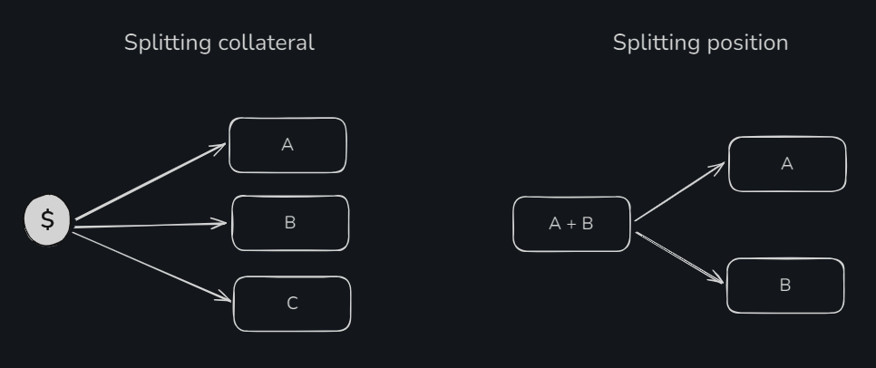

Dealing with the base asset is fairly straightforward: you deposit the specified amount into the smart contract, and it is allocated to the selected positions.

Splitting a position is a bit more interesting. You can only split composite positions, which contain multiple outcomes.

However, there are scenarios where splitting is not possible. For example, you cannot split a position that combines two events into two independent positions for each event. Or you cannot split the base asset in such a way that it covers all possible outcomes, ensuring a guaranteed profit in any scenario. More examples of invalid splits can be found in the [documentation](https://docs.gnosis.io/conditionaltokens/docs/devguide05).

To perform splitting, you need to call the [splitPosition()](https://github.com/gnosis/conditional-tokens-contracts/blob/master/contracts/ConditionalTokens.sol#L105C14-L105C27) function.

```solidity
function splitPosition(
    IERC20 collateralToken,
    bytes32 parentCollectionId,
    bytes32 conditionId,
    uint[] calldata partition,
    uint amount
) external {
    // Checking that an array of positions for splitting has been provided
    require(partition.length > 1, "got empty or singleton partition");
    uint outcomeSlotCount = payoutNumerators[conditionId].length;
    // Checking that an event with this identifier exists
    require(outcomeSlotCount > 0, "condition not prepared yet");

    // Preparing a mask based on the number of outcomes. For 4 outcomes, it will be 0x1111, for five 0x11111
    uint fullIndexSet = (1 << outcomeSlotCount) - 1;
   // Will be responsible for the result of the positions the user is splitting
    uint freeIndexSet = fullIndexSet;
    uint[] memory positionIds = new uint[](partition.length);
    uint[] memory amounts = new uint[](partition.length);
    for (uint i = 0; i < partition.length; i++) {
        uint indexSet = partition[i];
        // Checks that the indexSet is within the range of possible combinations for the event
        require(indexSet > 0 && indexSet < fullIndexSet, "got invalid index set");
        require((indexSet & freeIndexSet) == indexSet, "partition not disjoint");
        freeIndexSet ^= indexSet;
       // Obtaining a new position identifier for the index set
        positionIds[i] = CTHelpers.getPositionId(collateralToken, CTHelpers.getCollectionId(parentCollectionId, conditionId, indexSet));
        amounts[i] = amount;
    }

    if (freeIndexSet == 0) {
        // Splitting the collateral asset
        if (parentCollectionId == bytes32(0)) {
            // Transferring the collateral asset from the user to the smart contract
            require(collateralToken.transferFrom(msg.sender, address(this), amount), "could not receive collateral tokens");
        } else {
           // Burning share tokens of the current position
            _burn(
                msg.sender,
                CTHelpers.getPositionId(collateralToken, parentCollectionId),
                amount
            );
        }
    } else {
       // Splitting the position
// Involves burning the current position
        _burn(
            msg.sender,
            CTHelpers.getPositionId(collateralToken,
                CTHelpers.getCollectionId(parentCollectionId, conditionId, fullIndexSet ^ freeIndexSet)),
            amount
        );
    }

    // Minting share tokens for the new positions
    _batchMint(
        msg.sender,
        positionIds,
        amounts,
        ""
    );

    emit PositionSplit(msg.sender, collateralToken, parentCollectionId, conditionId, partition, amount);
}
```

#### Merging

When a user votes, it is equivalent to the term "splitting a position" or "splitting collateral," where they transfer a certain amount of the base asset to the smart contract.

To exit the selected voting positions and withdraw the base asset back, there is a process called **merging**. This process involves not only merging back to the base asset but also to a specific intermediate position.

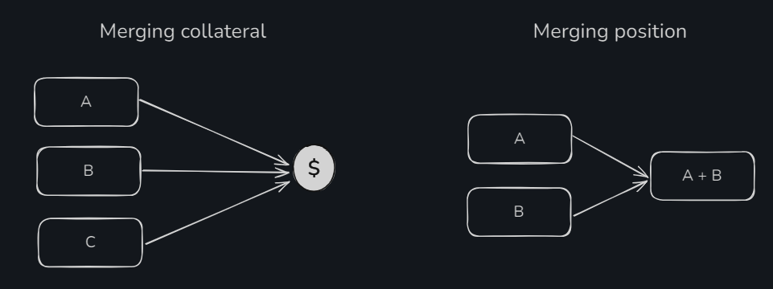

It can be confidently stated that `mergePositions()` is the exact reverse function of `splitPosition()`.

To initiate this process, you need to call the [mergePositions()](https://github.com/gnosis/conditional-tokens-contracts/blob/master/contracts/ConditionalTokens.sol#L105C14-L105C27) function.

```solidity
function mergePositions(
    IERC20 collateralToken,
    bytes32 parentCollectionId,
    bytes32 conditionId,
    uint[] calldata partition,
    uint amount
) external {
   // Checking that an array of positions for merging has been provided
    require(partition.length > 1, "got empty or singleton partition");
    uint outcomeSlotCount = payoutNumerators[conditionId].length;
    // Checking that an event with this identifier exists
    require(outcomeSlotCount > 0, "condition not prepared yet");

   // Preparing a mask based on the number of outcomes. For 4 outcomes, it will be 0x1111, for 5 outcomes it will be 0x11111
    uint fullIndexSet = (1 << outcomeSlotCount) - 1;
    uint freeIndexSet = fullIndexSet;
    uint[] memory positionIds = new uint[](partition.length);
    uint[] memory amounts = new uint[](partition.length);
    for (uint i = 0; i < partition.length; i++) {
        uint indexSet = partition[i];
        // Checks that the indexSet is within the range of possible combinations for the event
        require(indexSet > 0 && indexSet < fullIndexSet, "got invalid index set");
        require((indexSet & freeIndexSet) == indexSet, "partition not disjoint");
        freeIndexSet ^= indexSet;
        // Obtaining a new position identifier for the index set
        positionIds[i] = CTHelpers.getPositionId(collateralToken, CTHelpers.getCollectionId(parentCollectionId, conditionId, indexSet));
        amounts[i] = amount;
    }
    // Burning share tokens according to the provided positions
    _batchBurn(
        msg.sender,
        positionIds,
        amounts
    );

    if (freeIndexSet == 0) {
       // Merging to the base asset
        if (parentCollectionId == bytes32(0)) {
            // Sending the base asset to the user
            require(collateralToken.transfer(msg.sender, amount), "could not send collateral tokens");
        } else {
            _mint(
                msg.sender,
                CTHelpers.getPositionId(collateralToken, parentCollectionId),
                amount,
                ""
            );
        }
    } else {
       // Merging to an intermediate position
        _mint(
            msg.sender,
            CTHelpers.getPositionId(collateralToken,
                CTHelpers.getCollectionId(parentCollectionId, conditionId, fullIndexSet ^ freeIndexSet)),
            amount,
            ""
        );
    }

    emit PositionsMerge(msg.sender, collateralToken, parentCollectionId, conditionId, partition, amount);
}
```

#### Redeem Position

The last thing to consider here is receiving the reward after the voting has ended and the oracle has calculated the event. **Redeeming** a position will only be possible when the outcome of the event is deemed true.

To claim (redeem) your reward, you need to call the [redeemPosition()](https://github.com/gnosis/conditional-tokens-contracts/blob/master/contracts/ConditionalTokens.sol#L218) function.

```solidity
// The parameter indexSets is not called partition because there is no need to pass the encoded split of the position; you can pass a list of all positions
function redeemPositions(IERC20 collateralToken, bytes32 parentCollectionId, bytes32 conditionId, uint[] calldata indexSets) external {
   // Checking that the event exists and has been settled
    // The denominator will be set by the oracle when it calls the reportPayouts() function
    uint den = payoutDenominator[conditionId];
    require(den > 0, "result for condition not received yet");
    uint outcomeSlotCount = payoutNumerators[conditionId].length;
    require(outcomeSlotCount > 0, "condition not prepared yet");

    uint totalPayout = 0;

    // Preparing a mask based on the number of outcomes. For 4 outcomes, it will be 0x1111, for 5 outcomes it will be 0x11111
    uint fullIndexSet = (1 << outcomeSlotCount) - 1;
    // Looping through all provided positions
    for (uint i = 0; i < indexSets.length; i++) {
        uint indexSet = indexSets[i];
        // Checks that the indexSet is within the range of possible combinations for the event
        require(indexSet > 0 && indexSet < fullIndexSet, "got invalid index set");
        // Retrieving the position identifier
        uint positionId = CTHelpers.getPositionId(collateralToken,
            CTHelpers.getCollectionId(parentCollectionId, conditionId, indexSet));

        uint payoutNumerator = 0;
        for (uint j = 0; j < outcomeSlotCount; j++) {
            if (indexSet & (1 << j) != 0) {
                payoutNumerator = payoutNumerator.add(payoutNumerators[conditionId][j]);
            }
        }

        uint payoutStake = balanceOf(msg.sender, positionId);
        if (payoutStake > 0) {
            // Calculating the reward amount
            totalPayout = totalPayout.add(payoutStake.mul(payoutNumerator).div(den));
            // Burning share tokens for the position
            _burn(msg.sender, positionId, payoutStake);
        }
    }

    // Paying out the reward or minting share tokens if a parent collection is specified
    if (totalPayout > 0) {
        if (parentCollectionId == bytes32(0)) {
            require(collateralToken.transfer(msg.sender, totalPayout), "could not transfer payout to message sender");
        } else {
            _mint(msg.sender, CTHelpers.getPositionId(collateralToken, parentCollectionId), totalPayout, "");
        }
    }
    emit PayoutRedemption(msg.sender, collateralToken, parentCollectionId, conditionId, indexSets, totalPayout);
}
```

### Market maker

The protocol implements both types of market makers on smart contracts, CPMM and LMSR.
In this section, we'll look at the code for only one of them—CPMM. It's simpler to understand from a mathematical perspective.

The name of the smart contract that implements CPMM is [FixedProductMarketMaker.sol](https://github.com/gnosis/conditional-tokens-market-makers/blob/master/contracts/FixedProductMarketMaker.sol). Each market maker has its own factory. For FixedProductMarketMaker, logically, the factory is called [FixedProductMarketMakerFactory.sol](https://github.com/gnosis/conditional-tokens-market-makers/blob/master/contracts/FixedProductMarketMakerFactory.sol).

Here's how it works:

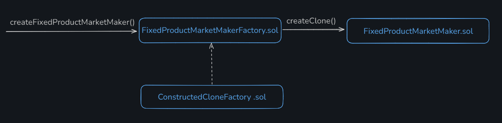

To create a new event, where the market will operate under CPMM rules, you need to call the function [createFixedProductMarketMaker()](https://github.com/gnosis/conditional-tokens-market-makers/blob/master/contracts/FixedProductMarketMakerFactory.sol#L83), which, using the **ConstructedCloneFactory.sol** factory extension, will create and deploy a smart contract for the new market.

The market maker will act as an intermediate recipient of the ERC-1155 token. The token will be sent to the user who initiated the transaction. To be able to receive ERC-1155 tokens, `FixedProductMarketMakerFactory.sol` has two functions: [onERC1155Received()](https://github.com/gnosis/conditional-tokens-market-makers/blob/master/contracts/FixedProductMarketMaker.sol#L232) and [onERC1155BatchReceived()](https://github.com/gnosis/conditional-tokens-market-makers/blob/master/contracts/FixedProductMarketMaker.sol#L248).

In this way, the market maker serves as a middle layer between the user and the conditionalTokens.

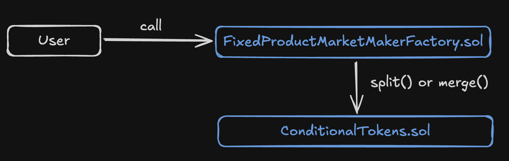

#### Liquidity

Since this is an AMM, the first thing to understand is that it represents a pool that requires liquidity. This includes all the typical components: liquidity providers, LP tokens, and the ability for the first provider to set the asset price. In our case, it's not the price that is set but the ratio of probabilities for each outcome.

The liquidity from the provider will be distributed across all the condition tokens, normalized according to the token ratio for each outcome. This means that when a provider adds liquidity, a certain amount of condition tokens will be issued for all possible outcomes.

The distribution of liquidity is calculated based on the condition token balances, which the smart contract retrieves through the private function [getPoolBalances()](https://github.com/gnosis/conditional-tokens-market-makers/blob/master/contracts/FixedProductMarketMaker.sol#L64).

Technically, to add liquidity, you need to use the function [addFunding()](https://github.com/gnosis/conditional-tokens-market-makers/blob/master/contracts/FixedProductMarketMaker.sol#L148C14-L148C24). Let's take a closer look at it.

```solidity
function addFunding(uint addedFunds, uint[] calldata distributionHint)
    external
{
    // Checking that the liquidity amount to be added is specified
    require(addedFunds > 0, "funding must be non-zero");

    uint[] memory sendBackAmounts = new uint[](positionIds.length);

    uint poolShareSupply = totalSupply();
    uint mintAmount;
    if(poolShareSupply > 0) {
       // If liquidity is not being added for the first time, distributionHint should be empty
        require(distributionHint.length == 0, "cannot use distribution hint after initial funding");
        uint[] memory poolBalances = getPoolBalances();
        uint poolWeight = 0;
        // The pool with the maximum balance is calculated, necessary for distributing liquidity across condition tokens
        for(uint i = 0; i < poolBalances.length; i++) {
            uint balance = poolBalances[i];
            if(poolWeight < balance)
                poolWeight = balance;
        }

        for(uint i = 0; i < poolBalances.length; i++) {
            uint remaining = addedFunds.mul(poolBalances[i]) / poolWeight;
           // Calculating the amount of condition tokens that the liquidity provider will receive
            sendBackAmounts[i] = addedFunds.sub(remaining);
        }

        // Calculating the amount of LP tokens that can be received
        mintAmount = addedFunds.mul(poolShareSupply) / poolWeight;
    } else {
        // If liquidity is being added for the first time, distributionHint will set the liquidity distribution rule across pools
        if(distributionHint.length > 0) {
            require(distributionHint.length == positionIds.length, "hint length off");
            uint maxHint = 0;
            for(uint i = 0; i < distributionHint.length; i++) {
                uint hint = distributionHint[i];
                if(maxHint < hint)
                    maxHint = hint;
            }

            for(uint i = 0; i < distributionHint.length; i++) {
                uint remaining = addedFunds.mul(distributionHint[i]) / maxHint;
                require(remaining > 0, "must hint a valid distribution");
                // Calculating the amount of condition tokens that the liquidity provider will receive
                sendBackAmounts[i] = addedFunds.sub(remaining);
            }
        }

        mintAmount = addedFunds;
    }

   // Transferring assets from the user to the smart contract
    require(collateralToken.transferFrom(msg.sender, address(this), addedFunds), "funding transfer failed");
    require(collateralToken.approve(address(conditionalTokens), addedFunds), "approval for splits failed");

// Creating a position for the liquidity provider
    splitPositionThroughAllConditions(addedFunds);

    // Minting the LP token
    _mint(msg.sender, mintAmount);

    // Transferring condition tokens to the transaction caller
    conditionalTokens.safeBatchTransferFrom(address(this), msg.sender, positionIds, sendBackAmounts, "");

    for (uint i = 0; i < sendBackAmounts.length; i++) {
        sendBackAmounts[i] = addedFunds.sub(sendBackAmounts[i]);
    }

    emit FPMMFundingAdded(msg.sender, sendBackAmounts, mintAmount);
}
```

To withdraw liquidity, you need to call the [removeFunding()](https://github.com/gnosis/conditional-tokens-market-makers/blob/master/contracts/FixedProductMarketMaker.sol#L208C14-L208C27) function. The LP tokens will be burned, and the provider will receive their base asset back.

**Why is liquidity needed?**
The more liquidity in the pool, the more resistant the market is to large trades and price manipulation. Allowing users to add liquidity gives them the opportunity to earn from fees.

#### Buy and sell

```solidity
function buy(uint investmentAmount, uint outcomeIndex, uint minOutcomeTokensToBuy) external {
   // Calculating the purchase amount of outcome tokens (share tokens for a specific outcome)
    uint outcomeTokensToBuy = calcBuyAmount(investmentAmount, outcomeIndex);
    // Checking if the minimum amount we are willing to accept is valid
    require(outcomeTokensToBuy >= minOutcomeTokensToBuy, "minimum buy amount not reached");

    // Transferring the base asset to the market maker smart contract
    require(collateralToken.transferFrom(msg.sender, address(this), investmentAmount), "cost transfer failed");

    // Calculating the fee in the base asset
    uint feeAmount = investmentAmount.mul(fee) / ONE;
    feePoolWeight = feePoolWeight.add(feeAmount);
    uint investmentAmountMinusFees = investmentAmount.sub(feeAmount);
    require(collateralToken.approve(address(conditionalTokens), investmentAmountMinusFees), "approval for splits failed");

    // Splitting into all positions
    splitPositionThroughAllConditions(investmentAmountMinusFees);
    // Transferring position tokens to the transaction sender
    conditionalTokens.safeTransferFrom(address(this), msg.sender, positionIds[outcomeIndex], outcomeTokensToBuy, "");

    emit FPMMBuy(msg.sender, investmentAmount, feeAmount, outcomeIndex, outcomeTokensToBuy);
}
```

Here, a question might arise: what is splitting into all positions (splitPositionThroughAllConditions)? It's very simple. The bet is made on all possible outcomes.

```solidity
function splitPositionThroughAllConditions(uint amount)
    private
{
    for(uint i = conditionIds.length - 1; int(i) >= 0; i--) {
        uint[] memory partition = generateBasicPartition(outcomeSlotCounts[i]);
        for(uint j = 0; j < collectionIds[i].length; j++) {
            conditionalTokens.splitPosition(collateralToken, collectionIds[i][j], conditionIds[i], partition, amount);
        }
    }
}
```

There is a similar call for selling conditional tokens. The function responsible for this is [sell()](https://github.com/gnosis/conditional-tokens-market-makers/blob/master/contracts/FixedProductMarketMaker.sol#L321). But instead of splitting into all positions, the function [mergePositionsThroughAllConditions()](https://github.com/gnosis/conditional-tokens-market-makers/blob/master/contracts/FixedProductMarketMaker.sol#L94) is called.

```solidity
function sell(uint returnAmount, uint outcomeIndex, uint maxOutcomeTokensToSell) external {
    // Calculating the amount of outcome tokens that will be exchanged for the base asset
    uint outcomeTokensToSell = calcSellAmount(returnAmount, outcomeIndex);
    require(outcomeTokensToSell <= maxOutcomeTokensToSell, "maximum sell amount exceeded");

   // Transferring outcome tokens to the market maker smart contract
    conditionalTokens.safeTransferFrom(msg.sender, address(this), positionIds[outcomeIndex], outcomeTokensToSell, "");

   // Calculating the fee
    uint feeAmount = returnAmount.mul(fee) / (ONE.sub(fee));
    feePoolWeight = feePoolWeight.add(feeAmount);
    uint returnAmountPlusFees = returnAmount.add(feeAmount);
    // Merging positions to the base asset
    mergePositionsThroughAllConditions(returnAmountPlusFees);

    // Sending the base assets to the transaction sender
    require(collateralToken.transfer(msg.sender, returnAmount), "return transfer failed");

    emit FPMMSell(msg.sender, returnAmount, feeAmount, outcomeIndex, outcomeTokensToSell);
}
```

## Conclusion

It's time to say who actually needs all of this. The protocol gives three project examples that use CTF:
- [alice](https://alice.si/)
- [flyingcarpet.network](https://www.flyingcarpet.network/)
- [omen](https://omen-eth.ipns.dweb.link/)

I don't know much about these protocols, but I do know another example — the prediction market [Polymarket](https://polymarket.com/). They successfully implemented CTF and built additional logic on top of it, related to limit orders. This is quite a remarkable case because Polymarket is one of the most popular markets and has a substantial user base.

In summary, CTF is a powerful tool for implementing combinations of event outcomes and various manipulations with them. However, it's not easy to understand. It requires a deep dive into combinatorics, working with bits of information, and so on. At the same time, it is almost the only solution on which a prediction market can be built. Gnosis is still open to new applications of its framework, but it should be noted that not many use cases have been invented since its inception.

## Links

1. Gnosis [introduction](https://docs.gnosis.io/conditionaltokens/docs/introduction1)
2. [Conditional Tokens Contracts repository](https://github.com/gnosis/conditional-tokens-contracts)
3. [Conditional Tokens - Automated Market Makers репозиторий](https://github.com/gnosis/conditional-tokens-market-makers/tree/master)
