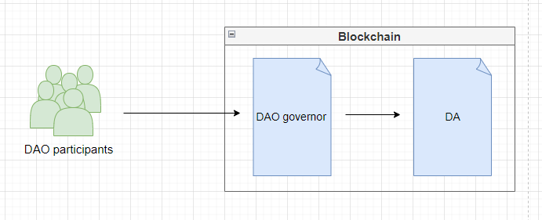
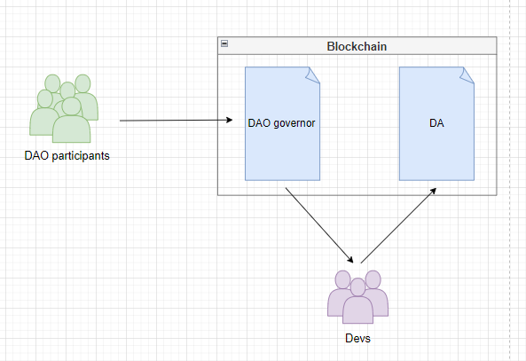
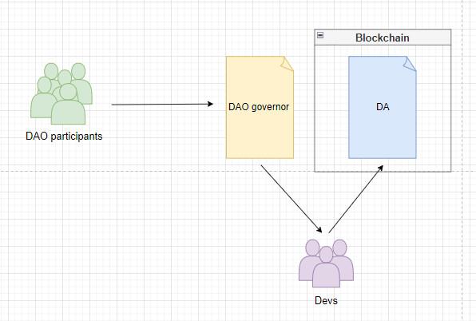
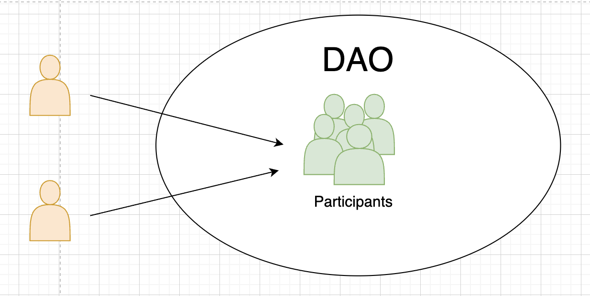
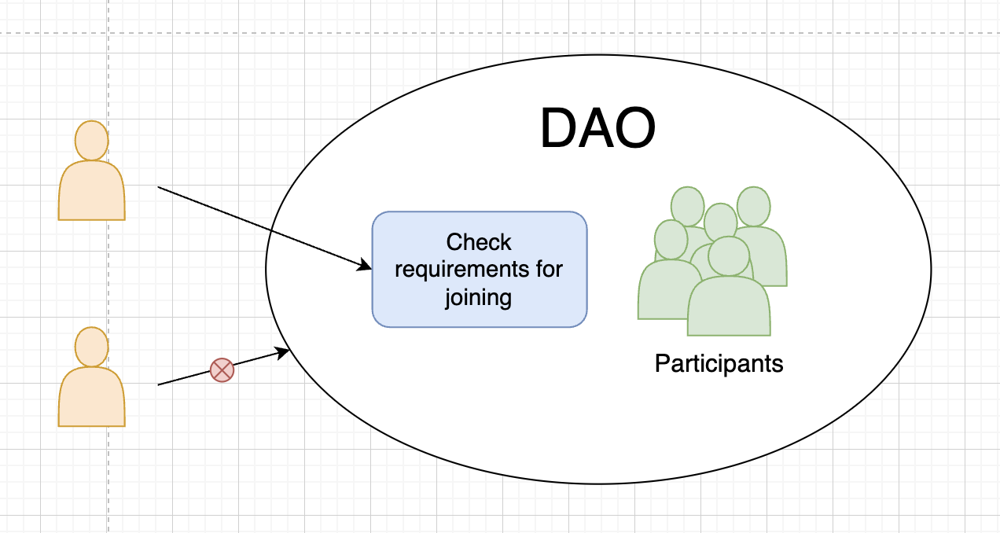
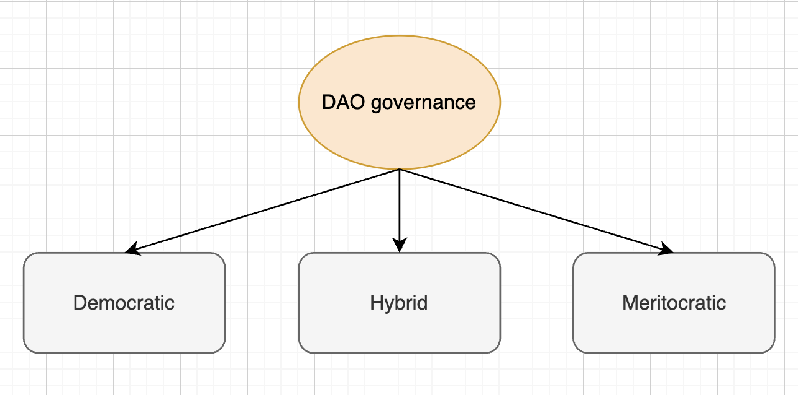
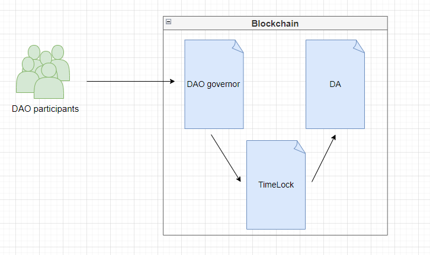

# DAO

**Author:** [Pavel Naydanov](https://github.com/PavelNaydanov) 🕵️‍♂️

> "A DAO is people." - Adam J. Kerpelman, DAOHaus

**Decentralized Autonomous Organization (DAO)** is an organization that operates without a centralized management structure based on blockchain technology. The organization operates autonomously through smart contracts, allowing participants to influence management decisions.

When someone says, *“You need to join a DAO,”* it means you should join a community (team, project, protocol, or other form of collectivism) that uses DAO software to coordinate decision-making in their organization.

One of the first DAOs was the organization "**[The DAO](https://en.wikipedia.org/wiki/The_DAO)**", created by developers to automate decision-making in a venture fund. After launching in April 2016, it became one of the largest crowdfunding campaigns in history. It ceased operations after a hack and the loss of most of its funds.

## From Smart Contract to DAO. A Bit More Terminology

Time for some philosophy!🤓

There's often confusion in the terminology of various acronyms: **DA**, **DO**, **DAO**, **DAC**. In his article "[DAOs, DACs, DAs and More: An Incomplete Terminology Guide](https://blog.ethereum.org/2014/05/06/daos-dacs-das-and-more-an-incomplete-terminology-guide)," Vitalik wrote, "Many of us have been frustrated by the lack of coherent terminology."

I suggest you also read this article. Below, I will provide the main definitions discussed in this article. Be prepared that some statements might be controversial or unusual in your worldview.

Let's start with the general concept of [smart contracts](https://www.fon.hum.uva.nl/rob/Courses/InformationInSpeech/CDROM/Literature/LOTwinterschool2006/szabo.best.vwh.net/smart.contracts.html). The term was proposed by Nick Szabo in 1990. Vitalik narrows the term to the subject area of web3.

**Smart contracts** are the simplest form of decentralized automation that implements the mechanism for fulfilling commitments between multiple parties in the distribution of digital assets. A good example is an escrow contract that accepts assets from one participant, stores the assets until a certain condition is met, and then allows the second participant to take the assets.

**Decentralized Application (DA)** is a type of distributed software that operates on a blockchain or peer-to-peer (P2P) network. For example, BitTorrent is a decentralized application. DA is similar to a smart contract, but differs in two key parameters: it has an unlimited number of participants from all sides of the market, and it does not necessarily have to be financial, meaning it does not have to regulate the distribution of digital assets.

**Decentralized Organization (DO)** is an organization that includes a group of people interacting with each other according to a protocol specified in the code and implemented in the blockchain. Often, this term implies transferring the management of an organization from the real world to the blockchain. For example, in a company, voting takes place, and a board of directors is elected. DO would imply that the same process is implemented on the blockchain.

**Decentralized Autonomous Organization (DAO)** is both DA and DO, but with the difference that:
1. In addition to DA properties, it has capital or an internal property of value. Moreover, it can use this property as a reward mechanism. For example, BitTorrent is only DA, as it has nothing like this. It has a reputation, but this reputation is not an asset that can be sold.
2. In addition to DO properties, it has the characteristic of autonomy. That is, in DO, decisions are made by specific people, while in DAO, decisions are somehow made independently by the organization itself. This is a very non-intuitive thing. It can be understood from the opposite side: a wrong decision in DO is the responsibility of the management, that is, a decision can be erroneous and fatal, the organization may disagree or even consider it a crime. In a DAO, a wrong decision is a path consciously chosen by the majority of participants, and even if the decision is erroneous, it is completely legal.

**Decentralized Corporations** are essentially a subclass of DAOs. The main proponent of DAC as terminology is [Daniel Larimer](https://www.linkedin.com/in/daniel-larimer-0a367089). He advocates that DACs pay dividends. DAOs are non-profit organizations, although you can earn by participating in the ecosystem's life without investing in DAO. However, DAOs have internal capital, which can grow with the organization and multiply, thus, in some ways, DAOs can be similar to DACs.

That's where I'd like to end the spatial definitions with a continuation of the example from Vitalik's article.

> Bitcoin is an interesting case in this context. Generally, it seems that the Bitcoin protocol is much closer to a DAO than a DO. However, in 2013 there was one incident that makes one think. The following happened: a unique block was accidentally created, which was considered valid according to BitcoinQt 0.8 clients, but invalid according to BitcoinQt 0.7 rules. The blockchain split:
>  - Some nodes included the unique block in their chain (let's call it **B1**)
>  - The remaining nodes, which considered this block invalid, worked on another version of the blockchain (let's call it **B2**).
>
> Most mining pools had updated to BitcoinQt 0.8, so they worked on **B1**, but most users were still using 0.7 and therefore followed **B2**. The mining pool operators gathered in a chat and agreed to switch their pools to mine on **B2**, as such a result would be easier for users and would not require them to update. After six hours, the **B2** chain eventually overtook **B1**. Thus, in this case, a deliberate 51% attack occurred, which the community deemed legal, making Bitcoin a **DO**, not a DAO. However, in most cases, this does not happen, so the best way to classify Bitcoin is as a DAO with an imperfection in the implementation of autonomy.

Whew! You can exhale! How fine the line is between the definitions described! 🤯

If trying to arrange the terms in a hierarchy from lesser to greater, I would perhaps do it in the following way:

> Smart Contract -> Decentralized Application (DA) -> Decentralized Organizations (DO) -> Decentralized Autonomous Organizations (DAO)

In general, this is a complex and difficult abstraction, and I do not claim to hold the truth here, but I believe it is important for my reader to ponder and form their own opinion on the correct use of terminology for a given situation.

## How Does a DAO Work?

The foundation of a DAO are **smart contracts**. They define the rules of the organization's operation. Once the contracts are launched in the network, no one can change the rules except by voting. If someone tries to do something not predefined by the rules and code logic, they will fail. Because there is no way to secretly change the code (edit the rules of the DAO), thanks to blockchain technology.

In an ideal world, a DAO should self-govern, and it might look like this: **community members** interact with the **DAO governor** system, which is fully implemented on smart contracts and describes the rules by which the organization manages the decentralized application (**DA**) and makes changes.

However, some protocols, especially in the early stages of the project, when decentralized organization management is just emerging, may use a hybrid model: **community members** still influence the management of the organization by interacting with **DAO governor** contracts, voting takes place publicly and transparently on the blockchain, but the final decision is applied by the protocol developers or can be delegated to trusted community members.

Thus, it is not necessary to initially organize a full-fledged DAO, one can try to take the voting system outside the blockchain and have the team of developers implement the community's decisions.

This way, any decisions continue to be made collectively after passing a vote, with varying levels of decentralization.

### Membership in a DAO

DAOs can have two types of membership: **open** and **closed**.

**Open** membership implies that anyone can join the DAO with access to managing the organization.

**Closed** membership means that joining a new member to the DAO requires going through a certain verification stage. Such a stage may require approval by other organization members or check for compliance with joining criteria, such as having capital or knowledge in the subject area.

The choice of DAO membership type depends on the organization's goal. If it is necessary to attract as many participants as possible for decentralized management, the **open** type of membership is used. If the successful functioning of the DAO requires the participation of only qualified members, then the **closed** type of membership is chosen.

### Tools for Organizing a DAO

In reality, the list of tools for the full functioning of a DAO is unlimited. I will list the most popular ones, in my opinion.

**Web3 tools:**

1. **Blockchain.** The environment in which the DAO software code is executed to regulate the organization's rules. For example: *Ethereum*, *Polygon*, *Solana*, etc.
2. **Voting System.** Must control membership, vote distribution, and decision-making within the organization. All proposals must go through this system. This system can be implemented in its own way, for example, membership can be determined by the presence of an ERC-20 or ERC-721 token.
3. **Bank.** Must control the organization's assets. Assets may not necessarily be from the financial sphere; they can be any items valuable to the community. Can store ETH, tokens, NFTs, artworks, and much more that the community wants to own as a collective and that represents value within the organization.

_Important!_ For the operation of a DAO, the voting system and bank must be implemented on smart contracts in most cases.

**Traditional Tools:**

1. **Chat.** Usually, this is where the audience and community begin to form. For example: *discord*, *slack*, *telegram*, etc.
2. **Forum.** This tool is for starting more detailed discussions where the history of posts can have greater value. It can be launched before the DAO starts functioning. For example: *discourse*, *reddit*, *medium*, etc.
3. **Calls.** At some point, it becomes useful to use a tool for group calls to organize weekly synchronization of discussions on key topics for decision-making or to conduct training and immerse the community in the subject area. For example: *discord*, *zoom*, etc.
4. **Planning.** To transparently provide the community with the organization's development plan, it's good to use task management software. For example: *trello*, *clickUp*, *asana*, *airtable*, etc.
5. **Other External Communications.** Over time, there will be a need to tell the rest of the world about what the organization is working on. Suitable tools include: *twitter*, *website*, *blog*, etc.

## Use Cases

DAOs can be used in various fields:

1. **Decentralized Finance (DeFi).** DeFi protocols often use DAOs to manage key protocol decisions, such as managing interest rates or introducing new features. This allows community members to be involved in the decision-making process, thereby contributing to the creation of a fairer and more decentralized financial environment.
2. **Collective Investments and Fund Management.** DAOs allow members to pool resources, giving them the opportunity to invest in various projects, control funds, and distribute profits according to predetermined rules.
3. **Content Creation.** DAOs enable content creators to ensure the preservation of digital ownership and increase engagement in the organization's ecosystem by providing the ability to influence decision-making within the organization.
4. **Decentralized Governance.** A fundamental part of DAOs, responsible for managing the decision-making process within the organization. It supports a democratic style of managing the organization's resources. DAOs provide greater transparency and accountability in management processes.

## Pros and Cons of DAOs

|Pros|Cons|
|--------------------------|--------------------------|
|Participants **unite** to act as a single entity in achieving the organization's goals|Decision-making takes **more time** as there are more participants involved in voting|
|All DAO members have **full voting rights** in planning strategy and organizational activities|Often, **training and immersion** of participants in the organization's subject area **requires more time and resources**, as members are diverse and have different levels of education and knowledge|
|Voting results on the blockchain are publicly visible and not anonymous in terms of vote distribution, so **participants are motivated** to act **more responsibly**|**Voting** or gathering participants for the organization **takes more time** due to the decentralized nature of the organization|
|DAO participants can **interact with other members** with similar goals within the same community|Vulnerable to **security breaches** if DAO does not meet security standards. For example, a hack of the asset storage|

### Risks

The combination of cons and the structure of DAOs creates some risks to the successful operation of the organization:
1. **Poor Code.** DAOs heavily rely on smart contracts. Any vulnerability left by developers can lead to the loss of all DAO assets, which can lead to the organization's closure. Therefore, security must be a priority.
    > This risk can be minimized by employing experienced and professional teams for development and mandatory auditing of DAO smart contracts by several qualified companies.
2. **Plutocracy and Vote Concentration.** Over the life of a DAO, the influence of certain groups on voting may increase. This means that real power over management is concentrated in the hands of the most influential group (for example, a group that has accumulated a large number of voting tokens). Such a situation reduces the degree of decentralization.
    > This can be countered by quality tokenomics development. Proper distribution of voting rights among organization members significantly reduces this risk. Additionally, it's necessary to inform and educate members on subject matters to enhance their decision-making literacy. Technically, there are already several models for organizing voting systems to reduce the influence of "whales" with significant voting rights. I will discuss them later.
3. **Legal Aspect.** So far, DAOs do not have a full legal status and carry unlimited liability. That is, any member is unrestricted in their actions if something happens with the DAO. It's not entirely clear which legal body should regulate DAO activities, how the taxation system should work, whether DAO assets are securities and should comply with the respective law. More legal problems can be found in this [article](https://corpgov.law.harvard.edu/2022/09/17/a-primer-on-daos/).
    > This is a complex issue, but many DAOs solve it one way or another, so one can study popular DAOs and choose the most suitable legal basis. For example, some states have recognized DAOs as legal entities (Vermont, Tennessee). Other legal formats can be used: Cayman Islands foundation, Colorado cooperatives, non-profit DAOs, etc.
4. **Weak Governance Structure.** Involving all community members in decision-making affects the speed of implementing decisions. Moreover, conflicts among members may arise during decision-making, negatively impacting the speed and further prolonging the decision-making process.
    > This is addressed by working with DAO members to enhance their understanding of the subject area and improve information about organizational events. Reward systems are used to motivate participation in voting. Some DAOs may involve a third independent party to resolve conflicts and disputes among members.

## What is DAO Governance?

**DAO Governance** is the process of management and decision-making within a **DAO**.

It is the system through which decisions are made in a **DAO**. It can be as simple as democratic voting or as complex as a multi-stage decision-making process involving various stakeholders.

The most popular features of DAO **governance** include:
1. **Voting System.** Implements the mechanism for discussion and decision-making within the organization for managing activities and assets.
2. **Delegation.** Allows transferring the voting right to other ecosystem participants.
3. **Automatic Transactions.** Transactions to change DAO rules can be executed automatically if a sufficient quorum of participants votes in favor.
4. **Multi-signature for Management.** Voting might involve thousands of DAO members, but the direct execution of the community's will is entrusted to a few trusted (public or known to the community) participants.
5. **Delayed Execution.** After a decision is made, execution is postponed for a pre-determined period to allow organization members to prepare and adjust to the new rules.

So, the difference between **DAO** and **DAO Governance** is that **DAO** is an entity or organization that operates autonomously on the blockchain, while **DAO Governance** is the process of management and decision-making within such an organization. In other words, **DAO Governance** is a tool or system that allows participants to collectively manage the **DAO**.

### Governance Structure

The governance structure in a DAO is defined by the degree of influence each participant has on the decisions made. It can be democratic, meritocratic, or a combination of the first two.

**Democratic Structure** means that each participant has an equal vote in decision-making.
> For example!
> In decision-making, 1000 people participate. Each has exactly one vote to vote for the decision being made. Thus, all participants have an equal influence in managing the organization.

**Meritocratic Structure** means that some participants have more weight in decision-making.
> For example!
> In decision-making, 1000 people participate. Any participant can buy votes for voting in unlimited quantities. The more votes purchased, the more weight the participant has in the organization. 999 people bought one vote each, but one person bought 100 votes. As a result, his decision will have a stronger influence on the outcome than other participants.

**Hybrid Structure** means a combination of democratic and meritocratic structures.
> For example!
> The DAO sets the basic rule that each participant has equal votes, but participants who joined the organization more than 10 years ago have the opportunity to use an additional vote.

_Important!_ An example of a democratic governance structure in a DAO can be [Aragon](https://aragon.org/), and an example of a meritocratic structure — MakerDAO.

Depending on the goals and requirements of the DAO, one governance structure may be more effective than another. For instance, a meritocratic structure allows encouraging the engagement of DAO participants. However, it can lead to centralization in DAO management.

### Types of Voting Models

The **voting system** can support various voting models:

1. **Token Voting.** Allows participants to vote for one of the proposals. To be able to vote, a participant needs to own tokens or lock (stake) them to confirm their vote. Thus, the weight of the participant's vote is calculated proportionally to the number of tokens.
    > **Example!**
    > Alice has 100 voting tokens, and Bob has 200 tokens, meaning that Bob will have twice as many votes as Alice in the voting.
2. **Quadratic Token Voting.** Allows participants to distribute votes across several proposals, but the cost of each additional vote increases quadratically.
    > **Example!**
    > If Alice decides to allocate 2 votes for "Proposal A" and 3 votes for "Proposal B", it will cost 4 tokens (2^2) and 9 tokens (3^2), totaling 13 tokens. This way, the cost of additional votes discourages participants from giving all their votes to one proposal, promoting a more balanced decision-making process. It also reduces the influence of "whales" (holders of a large number of tokens) on the voting outcome.
3. **Futarchy.** This governance model uses prediction markets for decision-making. Participants bet on the outcomes of proposals. Ultimately, the proposal with the highest predicted success is implemented.
    > **Example!**
    > Gnosis chain uses the futarchy model in its DAO. A proposal is created to implement the GNO token with its tokenomics. Community members vote whether they are willing to buy this token after its implementation. Thus, if 60% vote that they will buy, the forecast indicates that the token implementation makes sense. As a result, the token will be implemented.
4. **Liquid Democracy.** Represents a hybrid voting model. Organization participants can vote independently or delegate their voting right to someone they trust.
    > **Example!**
    > An organization member, Alice, may not have enough knowledge about a proposal related to protocol development. Therefore, rather than voting blindly, she can delegate her right to Bob, a trusted community member with protocol development experience. For any other proposal, Alice can vote independently.
5. **Reputation-Based Systems.** Distributes voting rights based on the reputation earned by a community member. Reputation can be earned in various ways, from participating in discussions and completing tasks to buying reputation. This model aims to reward active and valuable organization members with more significant decision-making powers.
    > **Example!**
    > Alice, an active community member, contributed to code development and earned 400 reputation points. Meanwhile, Bob wrote less code and has 200 reputation points. Due to her higher reputation score, Alice's vote carries more weight than Bob's during voting. This system encourages active participation in the life of the organization and rewards contributions to the DAO.

### Delegation

**Delegation** is the transfer of voting rights to a trusted individual. This trusted person will then have the ability to vote on behalf of the person who transferred the right.

Several reasons why delegation is justified:
1. **Efficiency and Expertise.** It allows transferring the right to vote to those who have experience or deep understanding of specific issues. Not everyone may have the time, knowledge, or resources to make informed decisions on every issue in a DAO. By delegating the voting right to knowledgeable participants, the experience of others can be used to make more informed decisions.
2. **Active Participation.** Delegation encourages broader participation in DAO management. Thus, less involved participants contribute to decision-making by choosing a **delegate**.
3. **Scalability.** Over time, a DAO can grow to significant sizes, and delegation will allow participating in the community only in necessary areas of development.
4. **Flexibility.** Delegation can be dynamic. The right to vote always retains the possibility for the owner to change the delegate or participate in voting personally.

_Important!_ In some DAOs, the concept of **self-delegation** may be introduced. This means that by default, the owner of the right does not have the ability to vote independently and must first delegate the voting right to themselves.

### Rage-quit

**Rage-quit** is the process in which a DAO member decides to exit the DAO (partially or completely) for one reason or another in exchange for the DAO's assets.

_Important!_ It should be noted that this term concerns DAOs that are oriented towards providing investment opportunities for the organization members' assets.

This mechanism was first applied as a key functional feature of the [Moloch DAO](https://molochdao.com/) V1 platform. Moloch DAO is a framework for providing Ethereum grants.

Moloch can store various ERC20 tokens in its own repository and allows anyone to burn voting tokens in exchange for assets from their storage.

This capability has been implemented on other platforms as well, such as [Tribute DAO](https://tributedao.com/docs/contracts/adapters/exiting/rage-quit-adapter/) and [Flamingo DAO](https://docs.flamingodao.xyz/ragequitting.html).

### TimeLock

**TimeLock** is a simple mechanism that allows changes to take effect after a certain period of time.

TimeLock is a beneficial addition to the DAO system. Adding time constraints to the execution of a decision allows community members to exit the DAO if they disagree with the decision before it is actually implemented.

It's important to note that using the **TimeLock** mechanism as a separate contract implies that this mechanism will act as the executor of the decision. However, this mechanism can also be natively implemented within the **DAO governor** contract.

The [TimeLockController](https://docs.openzeppelin.com/contracts/5.x/api/governance#TimelockController) contract from the OpenZeppelin library can be used.

## Services for Creating DAOs

### Snapshot ⚡

[Snapshot](https://snapshot.org/#/) is a voting platform that allows protocols to set up an off-chain voting system for DAOs.

This tool allows flexible configuration of the voting process for various organizational needs (calculating vote weight, choosing voting mechanisms, and verifying proposals).

**Key features:**

1. **Free to Use.** Participants do not need to sign transactions or pay gas to vote.
2. **Message Signing.** To vote, a participant needs to sign a message.
3. **Diverse Voting System Types.** Single choice, quadratic voting, etc.
4. **Flexible Voting Strategies.** Allows voting with ERC-20, ERC-721, and other tokens.
5. **Open Source Application** available in their [repository](https://github.com/snapshot-labs/).

I put this service first because often in the early stages of an organization, you can use the services of this platform to communicate with organization members and collect feedback.

Many major protocols use Snapshot for their initial voting system: [Uniswap](https://snapshot.org/#/uniswap), [Aave](https://snapshot.org/#/aave.eth), [GMX](https://snapshot.org/#/gmx.eth), [ENS](https://snapshot.org/#/ens.eth), [Arbitrum](https://snapshot.org/#/arbitrumfoundation.eth), and others. This allows initially filtering community proposals, admitting only necessary proposals to decentralized voting.

### Aragon 🦅

[Aragon](https://aragon.org/) is software that allows creating Decentralized Autonomous Organizations (DAOs) on the Ethereum blockchain. It is well-suited for organizations that jointly manage assets and make decisions through their decentralized apparatus.

Individual smart contract instances are created for each organization on the network. Aragon does this using its own framework for creating decentralized organizations, [aragonOS](https://github.com/aragon/aragonOS/tree/next).

Notably, the protocol implemented the [ANT](https://coinmarketcap.com/ru/currencies/aragon/) token, which allows participation in the governance of Aragon DAO. For example, Aragon token holders can propose amendments to the Aragon Agreement.

Aragon includes an interesting feature called **Aragon Court** for resolving disputes within DAOs. Any organization can turn to the "court" to submit a disputed situation for review. A fee is required for the "court's" operation. A jury panel is randomly formed to consider the "dispute" and issue a decision.

### XDAO ✖️

[XDAO](https://www.xdao.app/) is a tool for creating DAOs and collaborative management. It can be used for managing crypto assets, organizing a multi-signature wallet, or for investing.

A unique feature is that you can contribute crypto assets to the DAO's treasury and receive LP tokens in return as proof of ownership rights.

The platform supports a **rage-quit** feature, named ["Private Exit Offer"](https://docs.xdao.app/users-guide/private-exit-offer). You can burn LP tokens and receive a portion of the assets managed by the DAO to exit it.

It also supports a **hybrid voting model**. Participants vote off-chain using a signature from their wallet, and vote processing occurs on the blockchain. This type of voting allows participants to reduce gas costs without compromising security.

## Code Examples for Inspiration

### OpenZeppelin

The library provides a set of [smart contracts](https://github.com/OpenZeppelin/openzeppelin-contracts) for implementing a voting system governance.

You can read the documentation on how to set up [governance](https://docs.openzeppelin.com/contracts/5.x/governance#token).

I have prepared my own [mini-review](./openzeppelin-governance/README.md) of OpenZeppelin's governance smart contracts. This section is for developers. There, I will show how to build a simple **governance** system and review the library's smart contracts.

### Compound

The Compound protocol is managed and updated by **COMP** token holders. For the second and third versions of the protocol, in addition to the **COMP** smart contract, an additional Timelock module is used. The ability to delegate voting rights is implemented.

Read the documentation for the second version [here](https://docs.compound.finance/v2/governance/).

Read the documentation for the third version [here](https://docs.compound.finance/governance/).

The [GovernorAlpha](https://github.com/compound-finance/compound-protocol/blob/master/contracts/Governance/GovernorAlpha.sol) and [GovernorBravo](https://github.com/compound-finance/compound-protocol/blob/master/contracts/Governance/GovernorBravoDelegator.sol) contracts from the second version of the protocol have been widely used as a basis for organizing voting systems. OpenZeppelin's library was based on Compound's solutions and even maintained compatibility with Compound's contracts.

_Interesting!_ The [Uniswap](https://uniswap.org/) protocol used a [fork](https://github.com/Uniswap/governance) of Compound's second version smart contracts for its governance.

### Moloch DAO

Less popular compared to Compound's contracts are Moloch DAO's smart contracts. It is one of the [alternatives](https://molochdao.com/) for self-organization, funding, and development of necessary public infrastructure.

The repository with smart contracts can be found [here](https://github.com/HausDAO/Molochv2.1/tree/main). I don't suggest using it as a basis, but it can be useful to familiarize yourself with it for interest.

## Conclusion

In the realm of **web3** development, the fundamental rules of DAOs are embedded in code and cannot be changed. This immutability, combined with the transparency provided by blockchain, allows DAOs to be the next level of protocol decentralization. The potential applications of DAOs are limited only by human imagination.

It's important not to confuse the concept of a DAO as an organization with DAO governance as a tool for managing that organization.

Clearly, the concept of a blockchain-based DAO requires developers to pay special attention to security against external attacks and accidental errors in the code.

Using DAOs can be a promising and effective solution for many projects and organizations, but only if approached correctly with meticulous work on security and reliability.

Returning to the beginning of this article, I'd like to say: "Behind every **DAO**, there are always **people**! And it's good to have more of them!"

## Links

1. [Decentralized autonomous organizations (DAOs)](https://ethereum.org/en/dao/) on ethereum.org
2. [What is a DAO in Crypto? (Decentralized Autonomous Organization) - video](https://www.youtube.com/watch?v=KHm0uUPqmVE&ab_channel=WhiteboardCrypto)
3. [DAOs, DACs, DAs and More: An Incomplete Terminology Guide](https://blog.ethereum.org/2014/05/06/daos-dacs-das-and-more-an-incomplete-terminology-guide)
4. [A Primer on DAOs](https://corpgov.law.harvard.edu/2022/09/17/a-primer-on-daos/)
