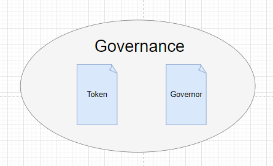
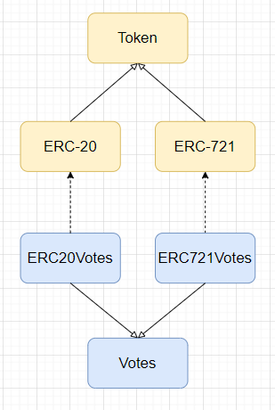
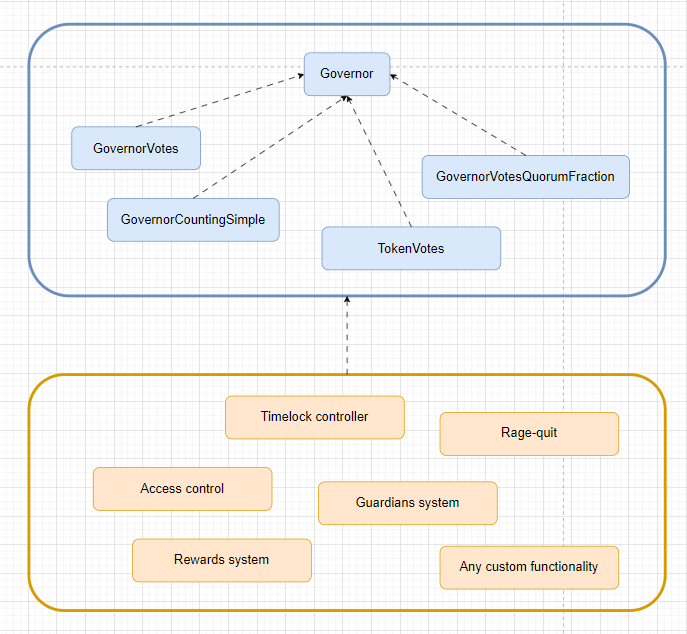
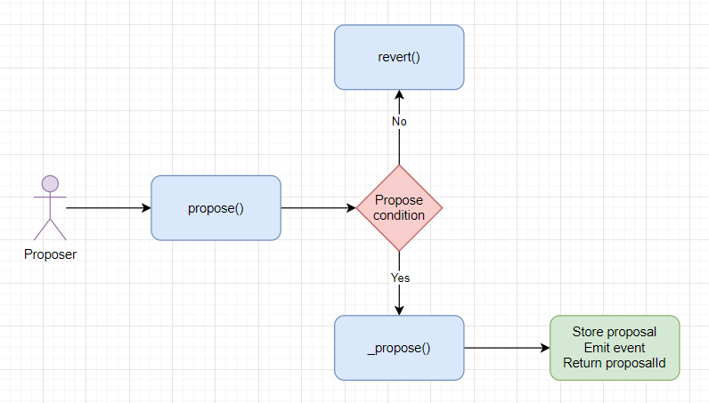
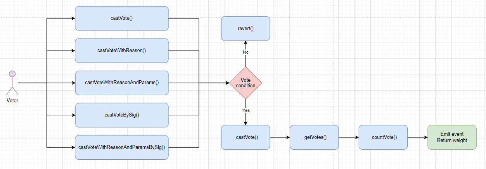
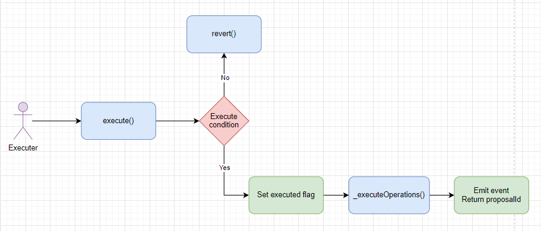

# OpenZeppelin Governance

**Author:** [Pavel Naydanov](https://github.com/PavelNaydanov) 🕵️‍♂️

The [OpenZeppelin](https://www.openzeppelin.com/) library offers a solution for implementing an **on-chain governance** system in the form of smart contracts.

_Important!_ This article discusses the [smart contracts](https://github.com/OpenZeppelin/openzeppelin-contracts/tree/v5.0.0/contracts/governance) of OpenZeppelin version 5.0.0.

Before the emergence of OpenZeppelin's **governance** smart contracts, the [Compound](https://compound.finance/) protocol's contracts like [GovernorAlpha](https://github.com/compound-finance/compound-protocol/blob/master/contracts/Governance/GovernorAlpha.sol) and [GovernorBravo](https://github.com/compound-finance/compound-protocol/blob/master/contracts/Governance/GovernorBravoDelegator.sol) were popular for a long time. Decentralized protocols used them quite successfully, modifying the code to suit their needs.

OpenZeppelin aimed to rework Compound's experience into a modular system of its own contracts, creating a flexible system for assembling a voting system as much as possible. The most common functional requirements for a voting system work out of the box, but it should not be difficult to make new ones.

_Important!_ OpenZeppelin's **governance** system is designed with compatibility for existing voting systems based on Compound contracts. Therefore, some contracts within the library might be duplicated. For example: [GovernorTimelockControl](https://github.com/OpenZeppelin/openzeppelin-contracts/blob/v5.0.0/contracts/governance/extensions/GovernorTimelockControl.sol) and [GovernorTimelockCompound](https://github.com/OpenZeppelin/openzeppelin-contracts/blob/v5.0.0/contracts/governance/extensions/GovernorTimelockCompound.sol).

## Architecture



To implement a voting system, two subsystems need to be implemented:
1. **Token** - to control the ability to vote. For example, the user's possession of an EC-721 or ERC-20 token allows them to participate in voting.
2. **Governor** - will determine the settings, rules, and lifecycle of the voting.

### Token

Currently, the library supports two types of tokens that can be used in the **governance** system:
1. **Fungible Token**. [ERC-20 Standard](https://github.com/OpenZeppelin/openzeppelin-contracts/tree/v5.0.0/contracts/token/ERC20).
2. **Non-Fungible Token**. [ERC-721 Standard](https://github.com/OpenZeppelin/openzeppelin-contracts/tree/v5.0.0/contracts/token/ERC721).

To apply either of these types of tokens in the voting system, token extensions must be used: [ERC20Votes.sol](https://github.com/OpenZeppelin/openzeppelin-contracts/blob/v5.0.0/contracts/token/ERC20/extensions/ERC20Votes.sol) or [ERC721Votes.sol](https://github.com/OpenZeppelin/openzeppelin-contracts/blob/v5.0.0/contracts/token/ERC721/extensions/ERC721Votes.sol). These two contracts, in turn, are inherited from the [Votes.sol](https://github.com/OpenZeppelin/openzeppelin-contracts/blob/v5.0.0/contracts/governance/utils/Votes.sol) contract from the group of governance system contracts.



_Important!_ The library does not yet offer the ability to use the ERC-1155 standard token for the voting system.

A simple example of an ERC-20 token for voting.

```solidity
// SPDX-License-Identifier: UNLICENSED
pragma solidity 0.8.20;

import {ERC20} from "@openzeppelin/contracts/token/ERC20/ERC20.sol";
import {ERC20Votes} from "@openzeppelin/contracts/token/ERC20/extensions/ERC20Votes.sol";
import {ERC20Permit, Nonces} from "@openzeppelin/contracts/token/ERC20/extensions/ERC20Permit.sol";

/// Контракт наследуется от ERC20Votes
contract VotesToken is ERC20, ERC20Permit, ERC20Votes {
    constructor(uint256 totalSupply) ERC20("Metalamp votes", "MTV") ERC20Permit("Metalamp votes") {
        _mint(msg.sender, totalSupply);
    }

    function _update(address from, address to, uint256 value) internal override(ERC20, ERC20Votes) {
        super._update(from, to, value);
    }

    function nonces(address owner)
        public
        view
        override(ERC20Permit, Nonces)
        returns (uint256)
    {
        return super.nonces(owner);
    }
}
```

I want to highlight that the **VotesToken.sol** contract, in addition to other inheritances, inherits from the **ERC20Permit.sol** contract. This is necessary because, by inheriting from the **ERC20Votes.sol** contract, it inherits the functionality of **delegating votes via signature**. This functionality is deeper in the inheritance chain, in the [Votes.sol](https://github.com/OpenZeppelin/openzeppelin-contracts/blob/v5.0.0/contracts/governance/utils/Votes.sol#L142) contract. The **Votes.sol** contract implements the interface of the [EIP712](https://github.com/OpenZeppelin/openzeppelin-contracts/blob/v5.0.0/contracts/utils/cryptography/EIP712.sol) contract, but does not initialize the EIP712 constructor. Therefore, the initialization of the EIP712 constructor is carried out in [ERC20Permit.sol](https://github.com/OpenZeppelin/openzeppelin-contracts/blob/v5.0.0/contracts/token/ERC20/extensions/ERC20Permit.sol#L39).

If there is no need to add permit functionality to your token, you can inherit your token contract directly from the [EIP712](https://github.com/OpenZeppelin/openzeppelin-contracts/blob/v5.0.0/contracts/utils/cryptography/EIP712.sol) contract, instead of from **ERC20Permit.sol**.


```solidity
// SPDX-License-Identifier: UNLICENSED
pragma solidity 0.8.20;

import {ERC20} from "@openzeppelin/contracts/token/ERC20/ERC20.sol";
import {ERC20Votes} from "@openzeppelin/contracts/token/ERC20/extensions/ERC20Votes.sol";
import {EIP712} from "@openzeppelin/contracts/utils/cryptography/EIP712.sol";

/// The contract inherits directly from ERC20Votes and EIP712
contract VotesToken is ERC20, EIP712, ERC20Votes {
    constructor(uint256 totalSupply) ERC20("Metalamp votes", "MTV") EIP712("Metalamp votes", "1") {
        _mint(msg.sender, totalSupply);
    }

    function _update(address from, address to, uint256 value) internal override(ERC20, ERC20Votes) {
        super._update(from, to, value);
    }
}
```

_Important!_ You can quickly generate token code for voting using the "[Contracts Wizard](https://docs.openzeppelin.com/contracts/5.x/wizard)" tool of the OpenZeppelin library. To do this, select the "Votes" option when setting up.

_No less important!_ If the protocol already has its own token that is successfully applied and fulfills its tasks, the library offers to issue another wrapper token based on its contracts: [ERC20Wrapper](https://github.com/OpenZeppelin/openzeppelin-contracts/blob/v5.0.0/contracts/token/ERC20/extensions/ERC20Wrapper.sol) and [ERC721Wrapper.sol](https://github.com/OpenZeppelin/openzeppelin-contracts/blob/v5.0.0/contracts/token/ERC721/extensions/ERC721Wrapper.sol). This is a similar story to the WETH token (wrapped ether). This will allow token holders to exchange their original token for the wrapped one and participate in the voting system. More details can be found in the [documentation](https://docs.openzeppelin.com/contracts/5.x/governance#token).

_And another important point!_ For voting tokens based on ERC-721, a similar approach is used.

### Governor

To implement the **Governor** subsystem, you need to answer several key questions:
1. How to define the "**number**" or "**weight**" of votes?
2. How many votes are needed to reach a [quorum](https://en.wikipedia.org/wiki/Quorum) to consider the voting successful?
3. What **voting options** are provided to users and how are these votes counted?
4. What **type of token** will be used to validate users' ability to vote?

The OpenZeppelin library considers these questions crucial and enforces the need to answer them by providing an abstract base contract [Governor.sol](https://github.com/OpenZeppelin/openzeppelin-contracts/blob/v5.0.0/contracts/governance/Governor.sol). Essentially, this is the basic smart contract for implementing the **Governor** subsystem.

```solidity
// SPDX-License-Identifier: UNLICENSED
pragma solidity 0.8.20;

import "@openzeppelin/contracts/governance/Governor.sol";

contract MyGovernor is Governor {
    /// Implementation of the Governor subsystem
}
```

_Important!_ You can quickly generate the code for a voting token using the "[Contracts Wizard](https://docs.openzeppelin.com/contracts/5.x/wizard)" tool from the OpenZeppelin library. To do this, select the "Votes" option during configuration.

_Equally important!_ If the protocol already has its own token that is being successfully used and fulfilling its tasks, the library offers to issue an additional wrapper token based on its contracts: [ERC20Wrapper](https://github.com/OpenZeppelin/openzeppelin-contracts/blob/v5.0.0/contracts/token/ERC20/extensions/ERC20Wrapper.sol) and [ERC721Wrapper.sol](https://github.com/OpenZeppelin/openzeppelin-contracts/blob/v5.0.0/contracts/token/ERC721/extensions/ERC721Wrapper.sol). This is similar to the WETH token (wrapped ether) scenario. It allows token holders to exchange their original token for the wrapped one and participate in the voting system. More details can be found in the [documentation](https://docs.openzeppelin.com/contracts/5.x/governance#token).

_And yet another important point!_ A similar approach is used for voting tokens based on ERC-721.

### Governor

To implement the **Governor** subsystem, several key questions need to be answered:
1. How to determine the "**number**" or "**weight**" of votes?
2. How many votes are required to achieve a [quorum](https://en.wikipedia.org/wiki/Quorum) to consider the voting successful?
3. What **voting options** are available to users and how are these votes counted?
4. What **type of token** will be used for user validation in the voting process?

The OpenZeppelin library considers these questions fundamental and enforces the need for answers by providing the abstract base contract [Governor.sol](https://github.com/OpenZeppelin/openzeppelin-contracts/blob/v5.0.0/contracts/governance/Governor.sol). Essentially, this is the basic smart contract for implementing the **Governor** subsystem.

Inheriting from the **Governor** contract will not allow compilation and will require the implementation of necessary functionality (answers to the 4 questions above). The answer to each of the questions above is a small module contract:
1. [GovernorVotes.sol](https://github.com/OpenZeppelin/openzeppelin-contracts/blob/v5.0.0/contracts/governance/extensions/GovernorVotes.sol). Used as a definition of "quantity" or "weight" of votes.
2. [GovernorVotesQuorumFraction.sol](https://github.com/OpenZeppelin/openzeppelin-contracts/blob/v5.0.0/contracts/governance/extensions/GovernorVotesQuorumFraction.sol). Used to define the rules for achieving a quorum.
3. [GovernorCountingSimple.sol](https://github.com/OpenZeppelin/openzeppelin-contracts/blob/v5.0.0/contracts/governance/extensions/GovernorCountingSimple.sol). Used to implement a simple system of voting options for participants. Implements the possibility of a single choice for the user from the options: "against", "for", "abstain".
4. The token extensions [ERC20Votes](https://github.com/OpenZeppelin/openzeppelin-contracts/blob/v5.0.0/contracts/token/ERC20/extensions/ERC20Votes.sol) or [ERC721Votes](https://github.com/OpenZeppelin/openzeppelin-contracts/blob/v5.0.0/contracts/token/ERC721/extensions/ERC721Votes.sol).



The minimal functionality required by the **Governor.sol** contract can be replaced or further extended. For example, within the voting system, one can implement a delay in the execution of accepted decisions (Timelock), a reward system for participating in the vote (Rewards system), and so on.

_Important!_ Minimally viable contracts for the **governance** system can be assembled using the "[Contracts Wizard](https://docs.openzeppelin.com/contracts/5.x/wizard)" tool from the OpenZeppelin library.

## Full List of OpenZeppelin Library Smart Contracts for Organizing Governance

Below is a list of OpenZeppelin library smart contracts for implementing **Governor** from their [repository](https://github.com/OpenZeppelin/openzeppelin-contracts/tree/v5.0.0/contracts/governance):

1. **Governor.sol**. The main contract that contains the minimum necessary logic for implementing a voting system. The contract is **abstract**, so inheritance is required for use.
2. **Extensions**. Smart contracts that allow extending the functionality of the main Governor.sol contract.
    - **GovernorCountingSimple.sol**. Implements a simple voting mechanism. Allows choosing one of three options: "against", "for", "abstain


```solidity
// SPDX-License-Identifier: UNLICENSED
pragma solidity 0.8.20;

import {Governor} from "@openzeppelin/contracts/governance/Governor.sol";
import {GovernorSettings} from "@openzeppelin/contracts/governance/extensions/GovernorSettings.sol";
import {GovernorCountingSimple} from "@openzeppelin/contracts/governance/extensions/GovernorCountingSimple.sol";
import {GovernorVotes, IVotes} from "@openzeppelin/contracts/governance/extensions/GovernorVotes.sol";
import {GovernorVotesQuorumFraction} from "@openzeppelin/contracts/governance/extensions/GovernorVotesQuorumFraction.sol";

/**
 * @title Metalamp Voting System
 * @notice Implements the most basic voting system based on OpenZeppelin smart contracts
 * @dev Uses 4 basic extensions:
 * - GovernorSettings. For managing settings
 * - GovernorCountingSimple. For counting voting options
 * - GovernorVotes. For calculating the weight of votes
 * - GovernorVotesQuorumFraction. For managing the quorum
 */

contract MetalampGovernance is Governor, GovernorSettings, GovernorCountingSimple, GovernorVotes, GovernorVotesQuorumFraction {
    uint48 public constant INITIAL_VOTING_DELAY = 1 days;
    uint32 public constant INITIAL_VOTING_PERIOD = 30 days;

    /// Indicates that any account is allowed to create proposals
    uint256 public constant INITIAL_PROPOSAL_THRESHOLD = 0;
    /// Indicates that the quorum value is not considered in the calculation of results
    uint256 public constant INITIAL_QUORUM_NUMERATOR_VALUE = 0;

    constructor(IVotes token)
        Governor("Metalamp governance")
        GovernorSettings(INITIAL_VOTING_DELAY, INITIAL_VOTING_PERIOD, INITIAL_PROPOSAL_THRESHOLD)
        GovernorVotes(token)
        GovernorVotesQuorumFraction(INITIAL_QUORUM_NUMERATOR_VALUE)
    {}

    function proposalThreshold()
        public
        view
        override(Governor, GovernorSettings)
        returns (uint256)
    {
        return super.proposalThreshold();
    }
}
```

To deploy the **MetalampGovernance.sol** smart contract to the network, a voting token must be specified. I won't provide an example code for the token. Let's assume it will be a standard ERC20 token (enhanced with ERC20Votes functionality). Now, we need to understand how to interact with the deployed contract.

### Creating a Proposal

To create a new proposal in the voting system, you need to call the `propose()` function on the **MetalampGovernance.sol** smart contract. The implementation of this function can be found in the main abstract smart contract [Governor.sol](https://github.com/OpenZeppelin/openzeppelin-contracts/blob/v5.0.0/contracts/governance/Governor.sol#L275).

```solidity
/**
 * @notice Allows submitting a proposal for voting
 * @param targets List of contract addresses on which the calldatas calls will be executed
 * @param values List of native currency values to be sent with each calldata call on each address (target)
 * @param calldatas List of encoded function calls with arguments
 * @param description Textual description of the proposal
 */

function propose(
    address[] memory targets,
    uint256[] memory values,
    bytes[] memory calldatas,
    string memory description
) public virtual returns (uint256) {
    /// Assumes the function caller is the author of the proposal
    address proposer = _msgSender();

    /// Checks if this proposal is allowed to be submitted for voting by the calling address.
    /// At the end of the description, the proposer's address can be specified (`[description]#proposer=0x`). If a proposer is specified, only this address can submit the proposal for voting.
    /// This allows for the creation of a truly unique proposal, as the description is part of the generation of the proposalId, and this check prevents cloning of the proposal

    if (!_isValidDescriptionForProposer(proposer, description)) {
        revert GovernorRestrictedProposer(proposer);
    }

    /// Checks that the proposal's author has sufficient rights to create it.
    /// For this, the weight of the author's votes must exceed the value returned by the function proposalThreshold()

    uint256 proposerVotes = getVotes(proposer, clock() - 1);
    uint256 votesThreshold = proposalThreshold();
    if (proposerVotes < votesThreshold) {
        revert GovernorInsufficientProposerVotes(proposer, proposerVotes, votesThreshold);
    }

    return _propose(targets, values, calldatas, description, proposer);
}
```

The call then proceeds to the private function `_propose()`.

```solidity
function _propose(
    address[] memory targets,
    uint256[] memory values,
    bytes[] memory calldatas,
    string memory description,
    address proposer
) internal virtual returns (uint256 proposalId) {
    /// Generates a unique identifier for the proposal
    proposalId = hashProposal(targets, values, calldatas, keccak256(bytes(description)));

    /// Validates the correctness of the submitted proposal parameters
    if (targets.length != values.length || targets.length != calldatas.length || targets.length == 0) {
        revert GovernorInvalidProposalLength(targets.length, calldatas.length, values.length);
    }

    /// Checks that the proposal has not already been made
    if (_proposals[proposalId].voteStart != 0) {
        revert GovernorUnexpectedProposalState(proposalId, state(proposalId), bytes32(0));
    }

    /// The time at which the vote balances of the voters will be checked.
    /// Coincides with the time when voting on the proposal begins
    uint256 snapshot = clock() + votingDelay();
    uint256 duration = votingPeriod();

    /// Records information about the proposal, which will be stored in the network
    ProposalCore storage proposal = _proposals[proposalId];
    proposal.proposer = proposer;
    proposal.voteStart = SafeCast.toUint48(snapshot);
    proposal.voteDuration = SafeCast.toUint32(duration);

    emit ProposalCreated(
        proposalId,
        proposer,
        targets,
        values,
        new string[](targets.length),
        calldatas,
        snapshot,
        snapshot + duration,
        description
    );
}
```

The process can be represented in the diagram as follows:


Example of calling the `propose()` function from another smart contract. We propose to put the call of the `set(address)` function for the whitelist smart contract to a vote. It is assumed that the function is not payable, therefore there is no need to fill the values array.

```solidity
address account = 0x...;

address[] targets = new address[](1);
uint256[] values = new uint256[](1);
bytes[] calldatas = new bytes[](1);
string memory description = "Proposal to add an account to the whitelist";

targets[0] = address(whitelist);
calldatas[0] = abi.encodeWithSelector(Whitelist.set.selector, account);

uint256 proposalId = governance.propose(targets, values, calldatas, description);
```

After creating a proposal, you can obtain from the smart contract:
1. The start time of the voting `proposalSnapshot(uint256 proposalId)`.
2. The end time of the voting `proposalDeadline(uint256 proposalId)`
3. The author of the proposal `proposalProposer(uint256 proposalId)`
4. The state of the proposal `state(uint256 proposalId)` (Pending, Active, Cancelled, etc.)

_Important!_ To retrieve a list of created proposals outside the network, it is necessary to implement a "data indexing service" that will listen to the `ProposalCreated()` event and aggregate all created proposals. An alternative solution may use the extension [GovernorStorage.sol](https://github.com/OpenZeppelin/openzeppelin-contracts/blob/v5.0.0/contracts/governance/extensions/GovernorStorage.sol) for storing proposal data on the network.

### Proposal Cancellation

It is assumed that the proposal was created similarly to the section [above](#создание-предложения).

To cancel a proposal, it is necessary to call the `cancel()` function on the **MetalampGovernance.sol** smart contract. The implementation of the function is in the main abstract smart contract [Governor.sol](https://github.com/OpenZeppelin/openzeppelin-contracts/blob/v5.0.0/contracts/governance/Governor.sol#L453).

```solidity
/**
 * @notice Allows the cancellation of the vote on a proposal
 * @param targets List of contract addresses on which calldatas calls will be executed
 * @param values List of native currency values that should be sent with each calldata call at each address (target)
 * @param calldatas List of encoded function calls with arguments
 * @param description Encoded textual description of the proposal
 */

function cancel(
    address[] memory targets,
    uint256[] memory values,
    bytes[] memory calldatas,
    bytes32 descriptionHash
) public virtual returns (uint256) {
    /// Generates a proposal identifier for checking the status
    uint256 proposalId = hashProposal(targets, values, calldatas, descriptionHash);

    /// Checks that the proposal is still in the Pending state
    _validateStateBitmap(proposalId, _encodeStateBitmap(ProposalState.Pending));

    /// Checks the caller. Only the creator of the proposal can cancel it

    if (_msgSender() != proposalProposer(proposalId)) {
        revert GovernorOnlyProposer(_msgSender());
    }

    /// Calls a private function
    return _cancel(targets, values, calldatas, descriptionHash);
}
```

Next, the call goes to the private function `_cancel()`. It takes the same parameters as the public function `cancel()`.

```solidity
    function _cancel(
        address[] memory targets,
        uint256[] memory values,
        bytes[] memory calldatas,
        bytes32 descriptionHash
    ) internal virtual returns (uint256) {
        /// Generates a proposal identifier.
        uint256 proposalId = hashProposal(targets, values, calldatas, descriptionHash);

        /// To cancel, the proposal status can be anything except.
        /// Canceled, Expired, Executed
        _validateStateBitmap(
            proposalId,
            ALL_PROPOSAL_STATES_BITMAP ^
                _encodeStateBitmap(ProposalState.Canceled) ^
                _encodeStateBitmap(ProposalState.Expired) ^
                _encodeStateBitmap(ProposalState.Executed)
        );

        /// The value "canceled" is set in storage.
        /// Based on this value, the state() function will determine the status as "canceled."

        _proposals[proposalId].canceled = true;

        emit ProposalCanceled(proposalId);

        /// Returns declined porposal's id
        return proposalId;
    }
```

**Important!** I want to draw your attention to the fact that all functions are marked as **virtual**. This means that the default behavior can be changed.

### Voice Casting

In order for participants to be able to vote, the following conditions must be met:
1. The **proposal** must have been **created** in the voting system. See the section [above](#creating-a-proposal).
2. The **voting** must have **started**, meaning the current **block number** must exceed the voting start time (voteStart). The voting start time coincides with the time of checking votes on the token (snapshot). To obtain a snapshot, you can call the `proposalSnapshot(proposalId)` function.
3. The voting participant must have the right to vote, which means they must have voting tokens available. To have these tokens counted during voting, the participant must **delegate tokens** to their own address or the address of another participant who will have the voting right. To delegate, the voting participant must call the `delegate(address voter)` function on the voting token contract (which inherits functionality from the ERC20Votes or ERC721Votes library), where **voter** is the address of the account to whom the voting right will be delegated.

If all the conditions described are met, the voting participant should call the `castVote(proposalId, support)` function on the **MetalampGovernance.sol** smart contract. The implementation can be found in the abstract smart contract [Governor.sol](https://github.com/OpenZeppelin/openzeppelin-contracts/blob/v5.0.0/contracts/governance/Governor.sol#L522C14-L522C22).


```solidity
/**
 * @notice Voting function
 * @param proposalId Proposal identifier
 * @param support Encoded decision in uint8 (e.g., "for," "against," or "abstain")
 */

function castVote(uint256 proposalId, uint8 support) public virtual returns (uint256) {
    /// The caller of the function is considered the voter
    address voter = _msgSender();

    return _castVote(proposalId, voter, support, "");
}
```

Apart from the `castVote()` function, the contract offers additional functions for voting:

1. [`castVoteWithReason()`](https://github.com/OpenZeppelin/openzeppelin-contracts/blob/v5.0.0/contracts/governance/Governor.sol#L530) - Allows adding a description to the cast vote decision.
2. [`castVoteWithReasonAndParams()`](https://github.com/OpenZeppelin/openzeppelin-contracts/blob/v5.0.0/contracts/governance/Governor.sol#L542C14-L542C41) - Enables adding a description to the cast vote decision and passing arbitrary parameters for use in additional voting logic.
3. [`castVoteBySig()`](https://github.com/OpenZeppelin/openzeppelin-contracts/blob/v5.0.0/contracts/governance/Governor.sol#L555C14-L555C27) - Allows voting based on a participant's signature.
4. [`castVoteWithReasonAndParamsBySig()`](https://github.com/OpenZeppelin/openzeppelin-contracts/blob/v5.0.0/contracts/governance/Governor.sol#L577C14-L577C46) - Combines all three options into one: description of the decision, arbitrary parameters, and voting by signature.

Regardless of which of these functions you choose for voting, the underlying mechanism will call the private voting function [`_castVote()`](https://github.com/OpenZeppelin/openzeppelin-contracts/blob/v5.0.0/contracts/governance/Governor.sol#L631C1-L650C6).


```solidity
function _castVote(
    uint256 proposalId,
    address account,
    uint8 support,
    string memory reason,
    bytes memory params
) internal virtual returns (uint256) {
    /// It is verified that the proposal is currently in an active state,
    /// allowing votes to be cast for the proposal.
_validateStateBitmap(proposalId, _encodeStateBitmap(ProposalState.Active));

    /// The vote weight is calculated.
uint256 weight = _getVotes(account, proposalSnapshot(proposalId), params);

    /// The vote is recorded.
_countVote(proposalId, account, support, weight, params);

    /// An event is emitted to indicate the successful vote.

    if (params.length == 0) {
        emit VoteCast(account, proposalId, support, weight, reason);
    } else {
        emit VoteCastWithParams(account, proposalId, support, weight, reason, params);
    }

    return weight;
}
```

The process can be represented in the following diagram:


Calculating the "vote weight" (_getVotes) and recording the vote (_countVotes) is a customizable modular process that can be implemented according to the needs of the voting system. The OpenZeppelin library provides basic solutions, which can be found in the smart contracts [GovernorVotes.sol](https://github.com/OpenZeppelin/openzeppelin-contracts/blob/v5.0.0/contracts/governance/extensions/GovernorVotes.sol#L57) and [GovernorCountingSimple.sol](https://github.com/OpenZeppelin/openzeppelin-contracts/blob/v5.0.0/contracts/governance/extensions/GovernorCountingSimple.sol#L76), respectively.

### Voting with a Signature

To learn more about what a signature is, you can check [here](https://ethereum.org/en/glossary/#digital-signatures).

The main advantage of using a signature is that the participant provides a digital signature, and they **do not necessarily need to pay gas** for executing the transaction when casting their vote. An off-chain service can take on this role and submit the vote with the participant's signature, only performing the transaction itself.

For participants to be able to vote using a signature, all the conditions described in the ["Vote Casting" section](#vote-casting) must be met.

However, to delegate tokens in the traditional way by calling the `delegate(address voter)` function, the voter still needs to pay gas. In this case, voting participants have the option to use a similar mechanism by calling the `delegateBySig()` function. This allows them to avoid paying gas for the entire process of casting a vote. This function is implemented in the [Votes.sol](https://github.com/OpenZeppelin/openzeppelin-contracts/blob/v5.0.0/contracts/governance/utils/Votes.sol#L142) contract.

If all the described conditions are met, the voting participant should call the `castVoteBySig(uint256 proposalId, uint8 support, address voter, bytes memory signature)` function on the **MetalampGovernance.sol** smart contract. The implementation can be found in the abstract smart contract [Governor.sol](https://github.com/OpenZeppelin/openzeppelin-contracts/blob/v5.0.0/contracts/governance/Governor.sol#L555C1-L572C6).


```solidity
/**
 * @notice Voting function using a signature
 * @param proposalId — Proposal identifier
 * @param support — Encoded decision in uint8 (e.g., "for," "against," or "abstain")
 * @param voter — Address of the voting participant
 * @param signature — Signature on behalf of the voter's address
 */

function castVoteBySig(
    uint256 proposalId,
    uint8 support,
    address voter,
    bytes memory signature
) public virtual returns (uint256) {
    /// Signature verification for the address voter
    bool valid = SignatureChecker.isValidSignatureNow(
        voter,
        _hashTypedDataV4(keccak256(abi.encode(BALLOT_TYPEHASH, proposalId, support, voter, _useNonce(voter)))),
        signature
    );

    /// If the signature is invalid, roll back the transaction
    if (!valid) {
        revert GovernorInvalidSignature(voter);
    }

    /// Calling the private vote submission function
    return _castVote(proposalId, voter, support, "");
}

```

The differences for voting with a signature end here. Further, the call goes to the private function `_castVote()`, which I explained in the ["Vote Casting" section](#vote-casting).

### Proposal Execution

To apply a proposal, the following conditions must be met:

1. The **proposal** must have been **created** in the voting system. See the section [above](#creating-a-proposal).
2. The **voting** process has **completed successfully** according to one of the conditions: the time has elapsed or the specified quorum has been reached. The voting process is described [above](#vote-casting). To find out the end time, you can call the `proposalDeadline(uint256 proposalId)` function.

When these conditions are met, by default, the address gains the ability to execute the proposal. To do this, you need to call the `execute()` function on the **MetalampGovernance.sol** smart contract. The implementation can be found in the abstract smart contract [Governor.sol](https://github.com/OpenZeppelin/openzeppelin-contracts/blob/v5.0.0/contracts/governance/Governor.sol#L393).

```solidity
function execute(
    address[] memory targets,
    uint256[] memory values,
    bytes[] memory calldatas,
    bytes32 descriptionHash
) public payable virtual returns (uint256) {
    /// The proposal identifier is determined.
    uint256 proposalId = hashProposal(targets, values, calldatas, descriptionHash);

    /// checks porposal status
    _validateStateBitmap(
        proposalId,
        _encodeStateBitmap(ProposalState.Succeeded) | _encodeStateBitmap(ProposalState.Queued)
    );

    /// proposal marks as completed
    _proposals[proposalId].executed = true;

    /// The execution of the proposal is added to the queue.
    if (_executor() != address(this)) {
        for (uint256 i = 0; i < targets.length; ++i) {
            if (targets[i] == address(this)) {
                _governanceCall.pushBack(keccak256(calldatas[i]));
            }
        }
    }

    /// proposal execution
    _executeOperations(proposalId, targets, values, calldatas, descriptionHash);

    /// Clearing the queue
    if (_executor() != address(this) && !_governanceCall.empty()) {
        _governanceCall.clear();
    }

    emit ProposalExecuted(proposalId);

    return proposalId;
}
```

The actual execution takes place in the function [`_executeOperations()`](https://github.com/OpenZeppelin/openzeppelin-contracts/blob/v5.0.0/contracts/governance/Governor.sol#L437C14-L437C32). What we are interested in from there is the line:

```solidity
(bool success, bytes memory returndata) = targets[i].call{value: values[i]}(calldatas[i]);
```

It can be noticed that the `call()` function is used with all the parameters that were involved in forming the proposal.

This process can be represented in the following diagram:


## Conclusion

I have shown how to build governance using the OpenZeppelin library. The contract system is not the simplest, but it is flexible enough to allow for the definition of the required set of functions, rules, and results for voting.

The simplest voting process includes **three stages**: creating a proposal, voting, and executing the proposal in case of a successful vote. To perform these three stages, I implemented only two contracts:

1. [MetalampGovernance.sol](../contracts/src/MetalampGovernance.sol)
2. [VotesToken.sol](../contracts/src/VotesToken.sol)

[Three tests](../contracts/test/MetalampGovernance.t.sol) describing the three stages can complement the understanding of what is happening.

A simple contract [Whitelist.sol](../contracts/test/mocks/Whitelist.sol) was used as the target contract in the tests. In these tests, the `set()` function was called through the **MetalampGovernance** contract as the execution of the proposal after a successful vote.

**Important!** It's essential to remember that a real voting system can be much more complex and include mechanisms such as TimeLock, implement a different vote counting system or weight calculation, and so on.

## Links

1. [Governance docs](https://docs.openzeppelin.com/contracts/5.x/api/governance)
2. [OpenZeppelin contracts Repository](https://docs.openzeppelin.com/contracts/5.x/api/governance)
