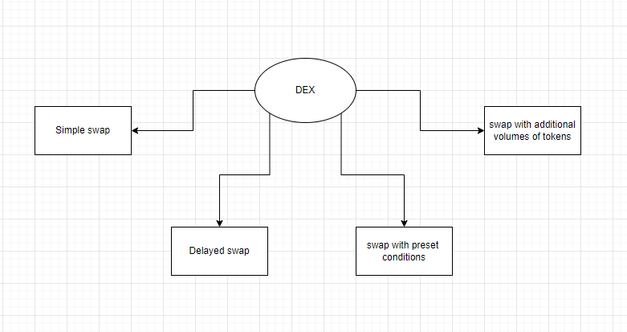
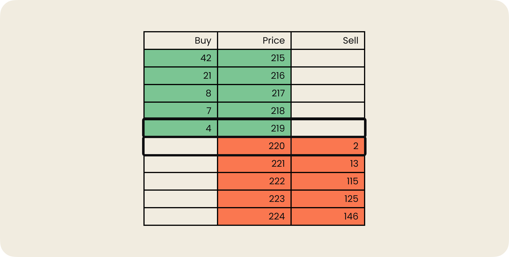
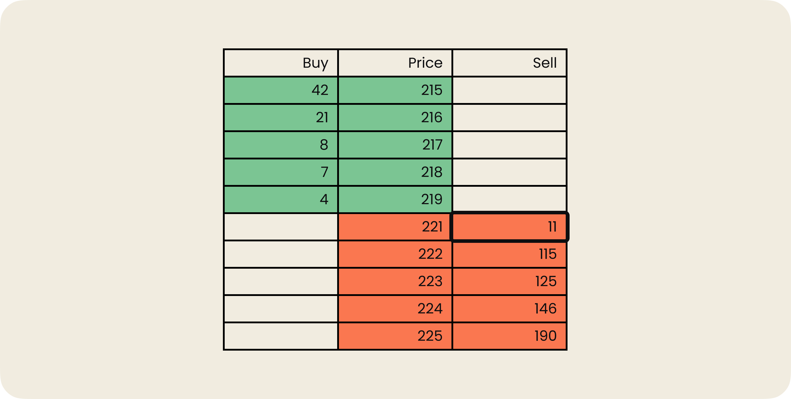
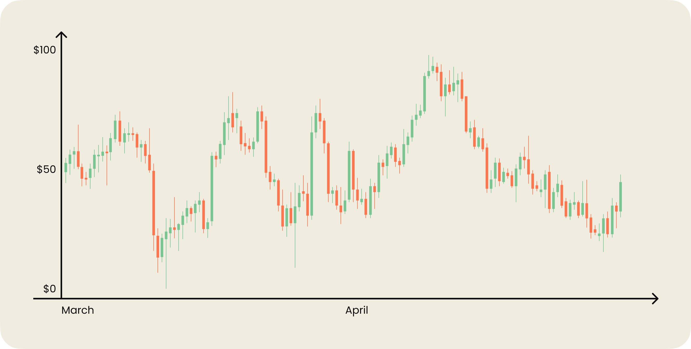
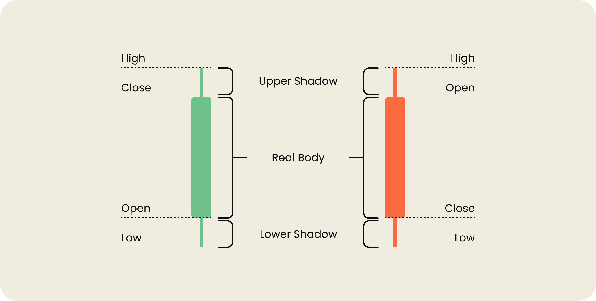

# OrderBook

Originally, an **order book** is an approach from the world of centralized exchanges (CEX) and traditional financial instruments. If we apply this concept to DEX, it may initially seem impractical. A fully on-chain order book would require gas fees for every trade data recorded on the network, which can be costly. However, implementing an order book for DEX can provide additional functionality to the exchange.

> Let's first recall the main idea of AMM to understand why implementing an order book for DEX is relevant.

## From AMM back to Order Book

As we know, an **AMM** (Automated Market Maker) establishes token prices using mathematical formulas. Users interact with smart contracts to swap one token for another (P2C).

Typically, a smart contract holds tokens in its liquidity pool as reserves for trading. Based on the total token quantity in the pool, the price of one token relative to another is calculated using the formula `K = X * Y`.

The liquidity pool often consists of two tokens known as a **trading pair**. Liquidity providers are responsible for supplying tokens to fill the pool and receive rewards for their contribution.

_Important!_ When a user withdraws a token, the quantity of that token in the pool decreases, causing the price to slightly increase. When a user deposits a token, the quantity of that token in the pool increases, causing the price to slightly decrease.

😆 It's amusing, isn't it? When a user makes an exchange using any exchange platform, they bring one token and receive another. This means that the price of one token will increase, while the price of the other token will decrease.

But there's a catch. Every user seeks maximum profit.

In an **AMM DEX**, users always pay for token swaps according to the price calculated by the AMM formula. To find the most advantageous trade, users either search for an exchange with a more favorable price or try to catch the moment when the token ratio in the pool changes enough to satisfy their request.

_Important!_ A profitable trade depends not only on the token price but also on the token quantity. It's simple: the more tokens you exchange at a lower price, the greater your profit.

## Why Trading is More Than Just Swapping?

Looking for exchanges with better prices can be an engaging activity. And sitting and waiting for the price to change in an exchange is even more captivating. Of course, I'm kidding!🙃

What users desire is simple automation, as they already know the price at which they are willing to buy or sell their tokens.

> Imagine that I want to sell my house. What would I do? Sit and wait for someone to advertise that they want to buy my house? Or maybe go out on the street and offer my house for sale? No, I would never do that! It's time-consuming, and the outcome is uncertain.
> Instead, I would place an ad in a newspaper or list my house on a **special platform** for selling real estate. Then, I would wait for a buyer willing to purchase the house at my desired price.

Let's apply the example of selling a house to a decentralized exchange.

Having a good exchange tool, I want to make trades with the utmost advantage. I don't want to wait or search for an exchange with a suitable token price. It would be great if the exchange itself could "play these games." I want professional trading tools right out of the box:
- Delayed trading
- Trading with additional volumes of assets
- Trading with predefined execution conditions
- And so on.

It turns out that the **token exchange** itself is a small part of full-fledged trading. The concept of trading is much broader and includes a range of additional tools.

Unfortunately, at this stage of development, **AMM DEXs** do not support such professional trading tools. Therefore, there is no automation for delayed trading with additional asset volumes.

The goal of an **AMM DEX** is to provide functionality for fast and convenient token swaps at market prices—here and now. The key idea is the absence of centralized control, allowing users to interact directly with the exchange contract.

## OrderBook Structure

So, if we need more trading tools, we need a different DEX based on a different principle. The exchange should support the ability to accept and manage user orders. This functionality will give us a mechanism for delayed orders.

The requirements for such a DEX align with the **orderbook** model. The implementation will come with significant challenges, but it is entirely possible. We'll need to minimize the number of transactions to reduce gas fees.

**DEX based on an orderbook** allows for the implementation of professional trading tools. Users will be able to utilize them when they need something more advanced than a simple exchange of one token for another.

### How does the orderBook work?

Imagine that all buy and sell offers are gathered in one box. This box is what we call the **orderbook**. In other words, it is a list or collection of buy and sell orders for tokens.

_Important!_ This list only contains current open orders. Closed or archived orders are considered historical data, and the orderbook doesn't know anything about them.

Let's start with an **order**.

Any buy or sell request in the orderbook is called an **order**. If an order is created that doesn't execute immediately, it will automatically enter the **orderbook**. It will remain there until it is executed or canceled.

An order contains information about the purchase or sale of a token. Therefore, the order list is usually divided into two groups (for selling/for buying) and ordered by price. Technically, an **order** is a record in the blockchain.

To add a new order, a user needs to perform a transaction. To fulfill an order, another user will also need to perform a transaction.

Any user can create an **order** as long as they have the necessary amount of tokens for its execution.

The process looks like this:

1. The user wants to buy a large amount of tokens in the DEX at once.
2. They see the market price of the token and realize that it is expensive for them at the moment, especially considering they want to buy a large quantity.
3. There is no corresponding sell order for the token at an affordable price in the **orderbook**. So, the user decides to create a delayed order that will enter the **orderbook**.
4. The user creates an **order**, specifying the desired price and the required quantity of tokens.
5. After confirming the **order**, it enters the **orderbook** and becomes available for execution by any user.
6. At this point, a seller comes to the DEX, willing to sell the required amount of tokens to our buyer.
7. The seller finds the buyer's **order** and executes it by sending the necessary amount of tokens to the DEX.
8. The buyer receives the desired token, and the seller receives the corresponding asset in exchange.
9. The **order** is closed.

The obligations of the seller and buyer are fulfilled under the full control of the DEX. The buyer receives the specified amount of tokens at the specified price in the order.

_Important!_ 🚀 Technically, there is no difference between a sell order and a buy order. It's all relative, like in physics.

In the example above, the user was the buyer, creating an order to buy tokens. But if a seller had arrived with their price request before the buyer, they would have created the order, but for selling the token. Then any buyer could have executed their order.

In this regard, the **orderbook** is a flexible tool that allows for different buy and sell offers to coexist. The key point is to understand that selling a token involves transferring the token to another user, while buying a token involves receiving the token from another user.

_Important!_ In the example, the buyer's order turned out to be **delayed**, while for the seller, it was executed immediately upon arrival.

### Liquidity: Makers and Takers

For users who come to the orderbook to buy or sell tokens, it is important that their orders are executed immediately or at least in the near future. This indicates high liquidity.

To maintain a high speed of transactions, there must always be an sufficient number of delayed orders in the exchange. This allows any user to quickly complete their purchase or sale.

Therefore, there need to be users who will create an adequate number of **orders**. Users who create delayed orders are called **makers**. Users who execute orders immediately are called **takers**.

**Makers** constantly create delayed orders, thereby increasing liquidity in the orderbook. We can say that they are the **liquidity providers**. Makers usually receive compensation for providing liquidity, which is deducted from the transaction fees paid by users. Makers may also receive additional benefits, such as a discount on asset withdrawals from the exchange.

**Makers** are crucial for the development of an exchange because they ensure liquidity. And liquidity, in turn, attracts users and reduces asset volatility.

**Takers** do not add their orders to the orderbook but execute existing ones. They take liquidity from the orderbook. However, their role is equally important because they are the primary executors of orders.

The speed of order execution depends entirely on the number of delayed offers from **makers** and the ability of **takers** to execute those delayed orders. **Takers** cannot exist without **makers**, just as **makers** cannot exist without **takers**.

### Interim Conclusion

So, it turns out that an **orderbook-based exchange** acts as an intermediary for trading between users. The exchange serves as a meeting point for makers and takers, allowing them to successfully complete transactions.

The exchange guarantees the security of the transaction and ensures compliance with all agreed-upon conditions. It can do this because all user interactions and assets go through it.

Security is ensured through decentralization and transparency, as the orderbook is implemented by using smart contracts, and all order information is stored in the blockchain.

The exchange's interest lies in charging fees for transactions.

## Depth of Market and Candlestick Chart

Visually, the orderbook may differ on each platform, but it generally contains similar information. It shows the number of orders at specific price levels.

In a tabular format, the orderbook looks something like this:

This tabular representation is often referred to as the **Depth of Market** (DOM). The Depth of Market appears as a vertical table with red and green colors.

Each row in the table describes a delayed order. The green rows represent a list of buy orders, while the red rows represent a list of sell orders.

In the image, the table is static, but in reality, it constantly changes, reflecting market activity. In other words, the orderbook is a dynamic table that continuously updates in real-time. The left and right columns display the order volume, which, in our case, represents the quantity of tokens for sale or purchase.

### How to Read the Table?

📚 It's simple! For example, the bottom green row indicates that a user created an order to buy 4 tokens at $219. And the top red row indicates that a user created an order to sell 2 tokens at a price of $220.

_Important!_ By the way, this is one of the most versatile tools for market analysis. It is used in almost all trading strategies and systems. It can be used as a filter or a signal source for making trades.

**But what if I need more than one order to execute?** Let's say I want to buy 4 tokens, and I am willing to pay $221 per token.

According to our Depth of Market, we have two tokens for sale at $220 and 13 tokens for sale at $221. I will buy 2 tokens at the most favorable price. The order to sell two tokens is fully executed and can be closed.

I will then buy the remaining two tokens at a price of $221. The order to sell at $221 is partially executed. This means that there are still 11 tokens available at a price of $221. The Depth of Market will look like this:

### Candlestick Chart

The orderbook is closely related to another tool. The **candlestick chart** that represents useful information about the current and past market conditions.

The chart allows you to see the price movement within a specific time period. For example, you can see how much the price has dropped within a minute. It is visually represented by green and red bars known as **candles**.

A candlestick consists of different elements, so, let’s get a closer look at it.

Each individual candle represents the following useful information:
1. Opening price.
2. Closing price.
3. Highest price.
4. Lowest price.

The main rectangular part of the candle is called the **real body**. It shows the range between the opening and closing prices within the selected time period.

The lines below and above the real body are called **shadows** or **wicks**. Each shadow represents the highest or lowest price offered during the selected time period.

When the closing price is higher than the opening price, the body is usually colored in **white** or **green**. But when the closing price is lower than the opening price, the body is usually colored in either **black** or **red**.

Along with the orderbook, the candlestick chart is used to reflect changes in token price over time. For example, the longer the body, the more buying or selling offers there are. A very short body indicates a minimal price movement during that time period.

## Matching Engine

How does a user navigate the orderbook and candlestick chart when there are too many orders?

The answer is simple. Users don't necessarily need to navigate them. It is enough for them to create their own order, and the exchange will automatically match the user's order with existing orders.

To match orders, a special tool called a **matching engine** is required. The matching engine is responsible for finding and executing orders. It acts as the brain of the exchange, making key decisions regarding transactions.

The matching engine matches new orders with existing orders stored in the orderbook.

When processing created orders, the exchange follows these steps:
1. Validates the data in the created order.
2. Generates a unique order ID and timestamps the order.
3. If a suitable order already exists in the orderbook, the created order will be instantly executed.
4. If the order cannot be immediately executed, it is added to the orderbook and waits for a matching order to be executed.

This step-by-step algorithm can be represented in the following diagram:

_Important!_ According to the basic principle of blockchain technology, blocks are created at certain intervals. Therefore, order matching occurs periodically. If some blocks were missed then the matching engine will process the orders received in the past while matching all open orders. This is the main difference in the functioning of the matching system in DEX compared to CEX.

## Order Types

In an orderbook-based exchange, users can perform two types of transactions: buying tokens and selling tokens. These transactions are carried out using **orders** created by users.

I mentioned earlier that orders can be immediate or delayed. But how can users keep track of them all? Let's break it down. All orders can be divided into two main groups:
1. Market Order
2. Limit Order

### Market Order

This order is suitable for immediate buying or selling at the most favorable price. It requires liquidity from the orderbook as it is executed based on the existing limit orders in the **orderbook**.

If you want to buy or sell a token immediately at the current market price, creating a market order is the best option.

> Let's say I want to buy 2 ETH. The market price for Ether is $1600 USDT. This means that at the moment, 1 Ether is worth $1600 USDT. I am willing to pay this price and do not want to wait for the price to decrease. Therefore, I can use a market order.
>
> I create an order and specify how much I am willing to buy. The matching system finds a suitable existing order for me, and my market order is executed instantly.
>
> The required amount of USDT is deducted from my wallet, and I receive the purchased Ether in return.

### Limit Order

This order is suitable when you need a specific buying or selling price. To place a **limit order**, you need to select the maximum or minimum buying or selling price for the token. The order is then placed in the orderbook and executed only when the market price reaches or exceeds the limit price.

> For example, a user wants to sell 2 ETH at a price of $1600 USDT. Currently, ETH is worth much less than $1600 USDT. The user creates a limit order to sell 2 ETH. The order is sent to the orderbook.
>
> After some time, the market price changes and becomes equal to $1600 USDT. At this point, I refer once again to the example above with a market order. I am willing to buy at the current market price. The matching system identifies us as the most suitable buyer and seller for each other.
>
> My market order and the delayed order of the other user are executed because their sell order for 2 ETH was also fulfilled. As a result, I have 2 ETH in my account, and the other user has 3200 USDT in their account. The delayed order is removed from the orderbook.

### Types of Limit Orders

Limit orders can be further categorized into different types. Below, we'll discuss the main types.

1. **Stop Order**: These are orders whose execution is postponed until certain conditions are met. For example, the condition could be a 2% drop in the token's market price. Stop orders can be further divided into two types:
- Stop Loss
- Take Profit

**Stop Loss** helps limit acceptable losses, at which point the order will be automatically closed. This helps minimize losses in token price.

_Important!_ Setting a stop loss at 10% for a token whose price fluctuates by 30% in a week can result in the stop loss triggering. After that, the price may continue to rise, but you won't benefit as the trade has already been closed at a loss.

> Let's say we bought 1 ETH at a price of $1000 USDT. We want to minimize the risk of losing the asset's value due to an Ether price drop. We can set a predetermined lower limit for the Ether price, for example, $900.
>
> To achieve this, we create a stop loss order. This means that we are comfortable with a 10% volatility relative to the purchase price. Once the market price reaches $900 USDT for 1 ETH, the limit order will be executed instantly, and we will sell our 1 ETH. The nearest taker willing to buy 1 ETH at $900 USDT will be able to execute our order.

**Take Profit**, on the other hand, works in the opposite way. By setting a take profit order, the order will be closed when a higher price is reached. This sets a ceiling for potential profits.

> In this case, it's the opposite scenario. I acquired 1 ETH at a price of $1000 USDT, and I want to make a profit of $100 USDT, which is a 10% gain. I set a take profit order at 10%. When the Ether price reaches $1100 USDT, the order will be available for execution by takers, allowing me to earn $100 USDT.

With these types of orders, I have a powerful automation tool that doesn't require my constant presence and allows me to minimize risks and increase profits.

_Important!_ In real-life trading, stop orders can be used for both buying and selling. Take profit and stop loss can also be used together, providing protection against potential losses and automating profit-taking processes.

2. **OCO Orders** (One-Cancels-the-Other):
This type of order combines a **stop loss** and **take profit**. The difference is that one order contains both conditions simultaneously.

> Let's say we bought 1 ETH at a price of $1000 USDT. We want to automatically secure a 10% profit and protect ourselves from a decrease in Ether's value. We create an order that includes both conditions. This means that if either of these conditions is met, the order will be automatically moved to execution.

3. **GTC Orders** (Good 'til Canceled):
This type of order remains in effect until it is canceled or executed. Usually, exchanges use this type as the default when users create a limit order.

It's essential to note that when creating an order, it often includes a time frame for its validity. This is necessary to prevent the orderbook from being cluttered with useless limit orders, which would create additional load on the matching system.

> Suppose we want to buy Ether below the current market price. We create a GTC order and set a lifetime of, for example, 24 hours. We wait for a taker to execute the order. If the order is not executed within 24 hours, it will be moved to the archive and automatically considered closed. The matching system will no longer take this order into account.

4. **IOC Orders** (Immediate or Cancel):
This type of order must be executed immediately, similar to a market order. However, if the order cannot be fully filled based on available offers, it will be partially executed and closed.

> I create an IOC order to buy 2 ETH at a price of $1500 USDT. However, I am aware that I may not receive the full amount. If there is only an offer to sell 1 Ether at $1500 USDT in the orderbook, the order will still be instantly closed, and I will only receive 1 ETH.

5. **FOK Orders** (Fill or Kill):
This order type is the opposite of an IOC order. It also needs to be executed immediately, but if there are not enough offers to fill the order, it will be canceled and remain entirely unfilled.

> I create a FOK order to buy 2 ETH at a price of $1500 USDT. If there are no sell offers at this price, the order will be instantly canceled, and I won't receive any Ether.

## Order Book: Matching Engine and Types of Orders

In a decentralized exchange (DEX), an order book plays a crucial role in facilitating trading between users. It acts as a central point where users can place their buy and sell orders for different tokens. The order book is responsible for matching these orders and executing the trades.

### Matching Engine

The matching engine is a key component of the exchange that matches incoming orders with existing ones in the order book. It follows a step-by-step algorithm to execute orders:

1. Verify the order's data for correctness.
2. Generate a unique order ID and timestamp.
3. If a matching order is found in the order book, execute the order immediately.
4. If the order cannot be executed, add it to the order book and wait for a suitable match.

The matching engine periodically matches open orders based on the blockchain's block creation intervals. If any blocks were missed, the matching process includes orders received in the past. This is a significant difference between a decentralized exchange (DEX) and a centralized exchange (CEX) in terms of matching mechanisms.

### Types of Orders

In an order book-based exchange, users can place two types of orders: buy orders and sell orders. These orders can be either immediate or delayed. Let's explore the different types of orders:

1. **Market Order**: A market order is used for immediate buying or selling at the best available market price. It relies on the liquidity provided by existing limit orders in the order book. When you want to buy or sell a token at the current market price, creating a market order is the most suitable option.

2. **Limit Order**: A limit order is used when you want to specify a particular price for buying or selling. The order is placed in the order book and executed only when the market price reaches or exceeds the specified limit.

   - **Stop Order**: A stop order is a type of limit order that is triggered when the market price reaches a specified condition, such as a price drop by a certain percentage. Stop orders can be further categorized into stop-loss and take-profit orders.

     - **Stop-Loss**: A stop-loss order helps limit potential losses by automatically closing the order if the price falls below a certain threshold.
     - **Take-Profit**: A take-profit order allows you to automatically close the order and secure profits when the price reaches a specified target.

   - **OCO Order** (One-Cancels-the-Other): This order combines a stop-loss and take-profit order. It contains two conditions simultaneously.

   - **GTC Order** (Good Til Canceled): A GTC order remains active until it is manually canceled or executed. It is the default order type used by most exchanges when a limit order is created.

   - **IOC Order** (Immediate or Cancel): An IOC order must be executed immediately, similar to a market order. If the order cannot be fully filled, it is partially executed or canceled.

   - **FOK Order** (Fill or Kill): An FOK order must be executed immediately and entirely. If the order cannot be fully filled, it is canceled without any partial execution.

By using different types of orders, users can manage their trading strategies and automate their trading activities. The order book provides a range of professional tools for advanced trading.

### Implementing a Simple Order Book

In its simplest form, the SimpleOrderBook contract should be able to:

- Create a sell order for a token and store relevant order information.
- Provide order information based on its ID.
- Sell tokens that are listed in the order book, closing the order completely if all tokens are sold.
- Cancel an order and remove its information based on its ID.
- Emit corresponding events for state changes and handle errors caused by incorrect data.

You can find the implementation of a simple order book contract, SimpleOrderBook.sol, [here](./contracts/SimpleOrderBook.sol).

## Conclusion

Decentralized trading encompasses more than just basic exchange functionality. The order book-based exchange not only retains the advantages of decentralization, such as secure asset storage and transaction anonymity but also provides users with additional essential and professional trading tools.

Delayed operations are facilitated through limit orders, while increased trading volume is achieved through margin trading. However, those topics are a whole different story! 😎

Note: The SimpleOrderBook contract provides a basic implementation, and its functionality can be expanded and enhanced according to specific requirements and the needs of the trading platform.
