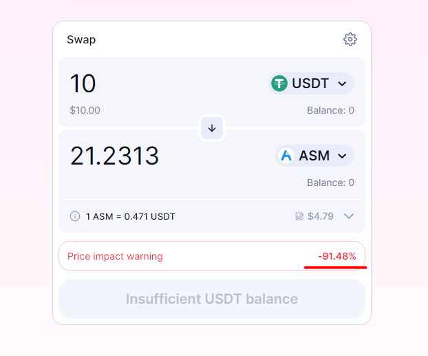
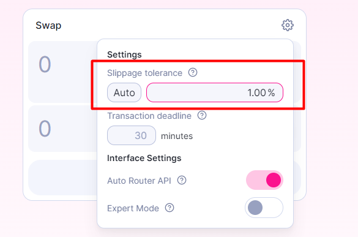
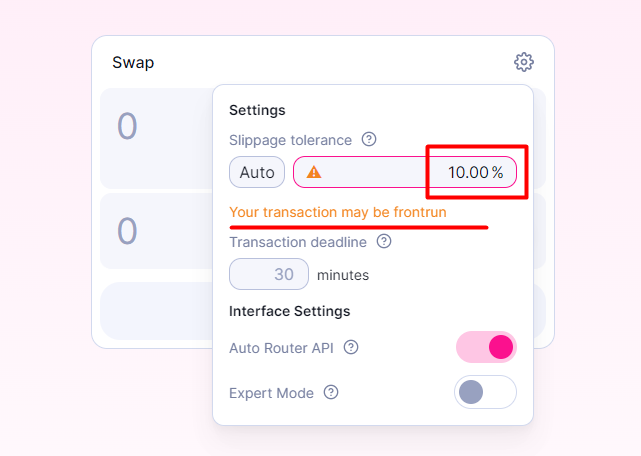
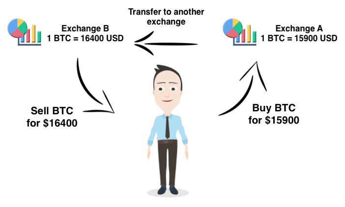
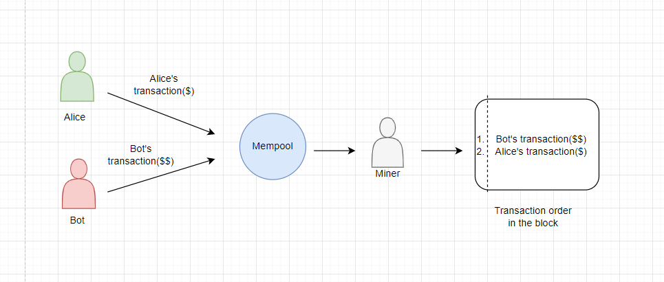
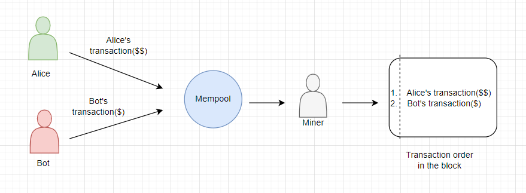
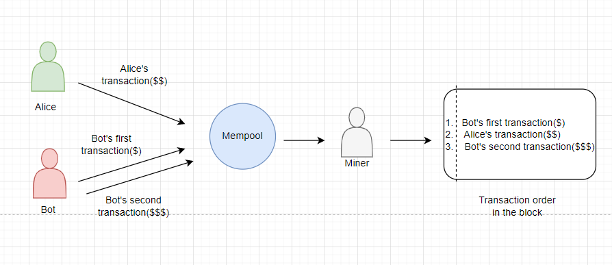

# Pitfalls of Decentralized Trading

Let's discuss important aspects of decentralized finance, including:

- Price slippage during transaction execution
- Profit loss risks for liquidity providers
- Types of attacks during transaction execution.

## Price Slippage

When exchanging tokens, there is often a difference between the **expected price** before sending the transaction and the **actual price** after the transaction is executed. This difference is known as **price slippage**.

Yes, it's possible, and in fact, it occurs in almost every token exchange.

When making a trade on a decentralized exchange (DEX), the expected price may differ from the actual price. This is because the expected price depends on the past state of the blockchain, which can change between transaction creation and execution.

### Example

Let's consider a decentralized exchange based on the familiar Automated Market Maker (AMM) principle. In this exchange, liquidity providers have created a **liquid pair**.

Alice and Bob want to buy 1 ETH for USDT in our improvised exchange. The starting price of 1 ETH at the moment is 1,400 USDT. Both Alice and Bob send 1,400 USDT to the exchange.

Our exchange is decentralized and still operates on blockchain technology, which means transactions are executed atomically, step by step. Therefore, Bob's transaction is executed before Alice's transaction. But it's not just executed earlier, it also affects the price of ETH. It becomes more expensive relative to the price before the purchase. All according to the rules of AMM.

**How did this happen?** The price of an asset depends on the ratio of token amounts in the **liquidity pool**. If one token becomes scarce, its price slightly increases relative to the other token.

So, by the time Alice's transaction is executed, the price of ETH has already changed and becomes 1,540 USDT. But since Alice sent less USDT, she will receive less ETH. In other words, ETH becomes more expensive for her. This is the **price slippage** between the expected price and the actual price.


_Important!_ Slippage is often expressed in percentages and indicates how much the token price can change.

The actual exchange price (the amount of tokens you will receive) depends not only on the token amounts in the liquidity pool but also on the order of transactions in the exchange. Specifically, it depends on the position of your transaction among other users' transactions.

_Important!_ The cost of the exchange depends on the order of transactions.

### Why does slippage occur?

The example of Alice and Bob allows us to identify two main causes of slippage: **liquidity** and **volatility**.

1. **Volatility** refers to the price fluctuations of an asset over a certain period of time. Every token is subject to volatility.
    - The more the token price fluctuates, the more slippage occurs between the start of the trade and its actual execution. This is due to the price fluctuations during the exchange process between different users.

    - Each purchase of a token increases its price since there is less of it in the pool. Each sale of a token decreases its price since there is more of it in the pool.

    - Volatility is usually measured as a percentage over a specific time period: a year, a month, or a day. Token volatility is measured by the deviation from the average price. The higher the deviation, the higher the level of volatility. Therefore, the more the token price changes over a period of time, the more volatile the token is.

The image below shows three types of price volatility for a token on a timeline.


2. **Liquidity**: Some tokens are traded less frequently due to their lower popularity or novelty compared to other tokens. This means there is not enough liquidity in the pools to maintain a stable price. Therefore, buying a large quantity of tokens can significantly impact its current price.

Let's assume we want to buy 5 ETH.


> **Left Chart**: Low liquidity. There are only 10 ETH left in the pool. The chart shows a significant shift along the curve of the token amount ratio. Buying only 5 ETH would greatly change the price of the remaining 5 ETH in the pool. According to AMM mathematics, it's not possible to deplete the pool. The remaining ETH will simply become very expensive.

> **Right Chart**: High liquidity. There are 1000 tokens in the pool. As shown in the chart, buying 5 ETH would have a much smaller impact on the amount of ETH in the pool. Consequently, the price of ETH would change insignificantly. In other words, the price would change less if someone else buys 5 ETH before us.

_Important!_ The higher the liquidity, the less susceptible we are to price slippage. The expected price will almost coincide with the actual price.

### How does Uniswap demonstrate slippage?

So, I've explained the reasons that lead to price slippage. The following patterns apply to slippage:

1. The more tokens involved in a trade, the more impact it has on the price.
2. The less liquidity in the liquidity pool, the greater the slippage.

You can confirm these patterns yourself in the [Uniswap application](https://app.uniswap.org/#/swap). Follow the link, select the tokens for exchange, and play around with the amount of tokens you're willing to provide to the liquidity pool.

In the additional swap options, there is a parameter called **"Price impact"**. It visually shows the influence of the trade price on the cost of the purchased token.


Let's try to exchange USDT for ASM tokens. [ASM token](https://coinmarketcap.com/currencies/assemble-protocol/) is supported by the Assemble platform. On this platform, users and sellers can accumulate and spend reward points. Providers of such points can conduct promotional campaigns, providing benefits in the form of discounts to ASM token holders.

No advertising, I'm just taking this token for illustrative purposes. 😉

In the swap modal, Uniswap will warn me in advance that my trade will have a significant impact on the token's price. The impact is more than 91%. In this case, it means that we will buy a large portion of the ASM token liquidity.



### Good News

_Important!_ Slippage is the change in token price during a trade and it can be either positive or negative.

Slippage can be categorized as **positive** or **negative**, meaning that the expected price can change in both directions, either higher or lower than expected.


_Important!_ If the actual execution price is **lower** than the expected buy price, it is considered a **positive slippage** as it gives us a better price than initially anticipated.

_Important!_ If the actual execution price is **higher** than the expected buy price, it is considered a **negative slippage** as it provides us with a less favorable price than initially expected.

This applies to both buying and selling tokens.

### How does Uniswap handle slippage?

On some exchanges, you can manually set the slippage tolerance (0.5%, 1%, 5%). For example, in the decentralized exchange Uniswap, you can specify slippage in the swap settings.



This value directly affects the time required for token swapping. If you set a low slippage tolerance, the exchange may take a long time or may not execute at all. If you set too high of a value, another user or bot may see our pending trade and outmaneuver us.

For users, this poses a potential issue or even a threat.

To warn about potential issues, Uniswap provides explicit prompts in the interface about what might happen during the exchange. Take a look at the screenshot from the Uniswap website below. This is an example of setting a low slippage tolerance.


In the next screenshot, I set a high slippage tolerance, and Uniswap warns me about the potential frontrun threat.

Bots can front-run user transactions, thereby affecting the actual trade price. For users, this results in additional costs when executing the trade. This is how Frontrun works, which is one of the most common bot attacks.

We will discuss frontrunning in more detail later. For now, remember that setting a too high slippage tolerance creates various potential risks for the exchange.



## Impermanent Loss

Every liquidity pool relies on liquidity providers who reduce token volatility. The interest of a liquidity provider is to receive rewards for providing their tokens to the pool. Guaranteed rewards, what could be better? But it's not that simple.

When we provide liquidity to a pool, the price of the deposited asset can change. This factor is called **impermanent loss**. These losses are potential and unrealized. They only become permanent and realized when funds are withdrawn from the pool.

In simpler terms, the more the asset price changes, the greater the potential losses we may experience when withdrawing funds from the pool.

Let me explain with an example. There will be a lot of text and calculations. We're smoothly transitioning to a physics lesson... Just kidding! 🙈

### Example

**Scenario:**
Let's say I want to become a liquidity provider for the USDT/ETH token pool. Here's what we agree upon:
- We need to add tokens to the pool in a 1:1 ratio.
- The price of 1 ETH is 100 USDT.
- Let's assume that 1 ETH is worth $100.
- The total liquidity in the pool at the moment is 10 ETH and 1000 USDT.

**Process:**
1. I add 1 ETH and 100 USDT to the liquidity pool.
> According to our agreement, the value of 1 ETH and 100 USDT added to the liquidity pool is $200.
>
> Let's calculate our share of the deposited tokens relative to all the tokens in the pool, which amounts to 10%. This means that we will receive 10% of the fees from trades in our pool.
>
> Let's recall the AMM mechanism with the constant equation: **X** * **Y** = **K**, where
> **X** represents the amount of ETH,
> **Y** represents the amount of USDT,
> **K** is a constant value.
>
> In this case, 10 ETH * 1000 USDT = 10,000. This value should remain constant before and after any trades in the pool.

2. The price of 1 ETH rises to $400.
> Yes, it happened, but the token ratio in the pool still indicates that the price of ETH is 100 USDT. Arbitrage bots take advantage of this opportunity. They identify price discrepancies across different exchanges and engage in the process of "buying cheaper in one place, selling higher in another." They pocket the profit. We will discuss arbitrage bots in more detail later.

3. After the bots' activity, there are 5 ETH and 2000 USDT left in the pool.
> This way, our constant **K** of 10,000 is preserved. The price difference between 1 ETH in the pool and outside the exchange is also neutralized.

4. Now it's time to withdraw 10% of the liquidity we provided.
> This amounts to 0.5 ETH and 200 USDT. In dollar terms, it is $400. Twice the initially invested amount! Let's not forget about the fees collected from users for utilizing our liquidity pool for token swaps. Let's assume our reward is $20.

We earned $220 in net profit! Nice, right? Absolutely!

However, if we had simply held our ETH and USDT in a wallet, we would have had 1 ETH worth $400 and 100 USDT worth $100. Together, that would be $500.

The difference between the potential value of $500 and the realized value of $420 is the **impermanent loss**.

_Important!_ Remember that impermanent losses are unrealized until we withdraw the tokens from the pool. Moreover, the fee earnings should partially or completely offset the losses and ideally put us in a profit.

### Is there a way to avoid impermanent loss?

Unfortunately, a liquidity provider cannot completely avoid impermanent losses. But the risk can be mitigated by using pools with stablecoins and less volatile tokens.

To assess the impermanent loss when the token prices change, you can use graphical representations.


According to the graph, we can conclude that:
* A 1.25x price change results in a loss of 0.6%.
* A 1.50x price change results in a loss of 2.0%.
* A 1.75x price change results in a loss of 3.8%.
* A 2x price change results in a loss of 5.7%.
* A 3x price change results in a loss of 13.4%.
* A 4x price change results in a loss of 20.0%.
* A 5x price change results in a loss of 25.5%.

To quickly and conveniently calculate impermanent losses, you can use a specialized service. Try this [impermanent loss calculator](https://dailydefi.org/tools/impermanent-loss-calculator/). Any similar service will require inputting the token values at the time of liquidity addition to the pool and at the time of withdrawal.

## Arbitrage. Mev. Gas Auction

Let's dive into arbitrage.

Prices for the same asset can differ across different exchanges. When you buy tokens on one exchange and sell them on another to make a profit, that's called **arbitrage**.

In reality, it's not just about "buy low, sell high" but a mindset focused on assessing the token's value and demand. To generate profit, you often need to set up a complex chain of transactions.



_Important!_ Remember that you can also incur losses if the token price drops during the transaction. Manual arbitrage is challenging to profit from, so the process is automated through programming.

Arbitrage bots influence market prices and other market participants. They balance token exchange rates across the market, increasing overall efficiency. This benefits users. In that sense, arbitrage is useful as it increases trading volume and commission revenue.

However, not all bots are helpful or even harmless. There is a range of bots that, in their pursuit of profit, can have a negative impact.

### What makes bots dangerous?

To understand how malicious bots work, it's necessary to comprehend the blockchain's structure and the work of miners.

When a transaction is sent to the blockchain, it is not executed immediately. It enters the **mempool** or **memory pool**, a small database of unconfirmed or pending transactions. When a transaction is confirmed by being included in a block, it is removed from the mempool.

Miners select transactions from the mempool to include in a block based on the highest profit they can gain. They can include, exclude, or change the order of transactions in the block at their discretion. The process of extracting such profit is called **Miner Extractable Value (MEV)**.

Alongside miners, bots also monitor the mempool because its contents are visible to everyone (we are still in the blockchain). Bots can execute their own transactions to front-run or follow the execution of a target transaction.

For example, upon seeing a large token deposit into a liquidity pool that will impact the price increase, a malicious bot can:

1. Make a purchase of tokens at a lower price.
2. Wait for the transaction to be pending.
3. Sell the tokens at the new higher price.

Bots can execute their own transactions by artificially increasing the gas price. This prompts miners to prioritize their transaction from the mempool based on the desire to extract maximum MEV.

The interesting part is that there can be multiple malicious bots. Competition arises among them to offer the highest gas price. This phenomenon is known as a **gas war**. Such a war increases the transaction fee for regular users.

The cost of token exchange on a DEX using AMM depends on the order of transactions. As you may have noticed, the order of transactions can be manipulated by offering a higher gas price. Bots try to position their transaction in a specific spot among other pending transactions. This creates attacks that exploit miners.

Let's look at the most common bot attacks:

1. **Front-running**

> A bot observes transactions and selects a suitable one that will bring it profit. It initiates a competing transaction with a higher gas price and expects its transaction to be confirmed before the victim's transaction.

For example, Alice wants to purchase a large number of tokens. This will lead to a price increase since fewer tokens will be in circulation, while the demand remains the same. The bot wants to buy the token before Alice does, so it conducts a front-running attack.



## Front-running

The attack proceeds as follows:
1. Alice initiates a token purchase, and her transaction enters the **mempool**.
2. The bot identifies Alice's transaction and applies its profit strategy. The strategy involves finding transactions that can significantly impact the token's price. After finding such a transaction, the bot aims to be the first to buy the token at the current price before it changes, intending to hold or sell it at a higher price in the future.
3. Alice's transaction is a perfect fit for the bot. It can profit by buying the tokens before her. So, the bot takes action and initiates its own token purchase transaction, which also enters the **mempool**. However, the bot offers a higher gas price to the miner compared to Alice's transaction. But the bot doesn't offer an excessively high price. It needs to consider the overhead costs of its actions and maintain a balance; otherwise, it could end up at a loss.
4. Meanwhile, the miner carries out their usual duties and creates a block of transactions. As mentioned before, they follow the principle of MEV, attempting to maximize their profit. Since there are numerous transactions in the **mempool**, there's a high chance that the victim's transaction has not yet been executed, and all the aforementioned bot manipulations with transactions have been successful.
5. Since the bot's transaction offers a higher gas price, it is logically prioritized by the miner and included in the block before Alice's transaction. This means that the bot's transaction will be executed before Alice's.

You might ask, what's wrong with this attack? After all, Alice will eventually buy her token anyway. Did we forget about the slippage? It will come as a surprise to Alice when she sees the difference between the actual and intended purchase price.

_Important!_ The bot's transaction, just like any other token purchase, will increase its price. Consequently, Alice will end up paying more than expected for the purchase and receiving fewer tokens since the bot buys them before her.

## Back-running

> The attack is similar to front-running, with the difference that the bot executes its own transaction immediately after the target transaction.

For example, the bot monitors the mempool for the emergence of new liquidity pools. If it finds a new pool, it buys as many tokens as possible. However, it doesn't buy all of them to allow other users to purchase the tokens.

Then the bot waits for the price to rise, and other users start buying the tokens. At this point, the bot sells the tokens at a higher price. The strategy aims to buy the token as early as possible to sell it at a higher price.



According to this scheme, the following scenario unfolds:
1. The bot discovers a new token that has recently appeared and buys it. Often, the price of such tokens is low.
2. Alice learns about this token and wants to buy it. Note that there are other users between the bot and Alice who have already purchased the token. In this case, Alice simply serves as a signal for the bot.
3. Alice initiates the token purchase, and her transaction enters the **mempool**.
4. The bot sees Alice's transaction and applies its profit strategy, which involves waiting for the token's price to rise. Remember that when Alice buys the token, its price will increase significantly. This growth is substantial since Alice is a wealthy buyer and always buys in large volumes.
5. Alice's transaction perfectly fits the bot's strategy, as it will drive up the price, allowing the bot to profit. The bot then initiates its own transaction to sell the token, which also enters the **mempool**. However, this time, the bot offers a lower gas price to the miner compared to Alice's transaction. The bot aims for its transaction to be executed as close as possible to Alice's.
6. Meanwhile, the miner carries out their usual duties and creates a block of transactions. Therefore, they first add Alice's transaction to buy the token and then the bot's transaction to sell the token.

Now you can ask again, what's the danger for Alice in this scenario? After all, she will buy before the bot. Yes, she will buy earlier, so it's not front-running but back-running. After Alice buys her tokens, the bot will sell its tokens. Remember that the bot bought a significant portion of the tokens for maximum profit?

Selling a large number of tokens can significantly crash the price of a new, unestablished token. As a result, Alice will be left holding tokens that have drastically dropped in price and turned into worthless pieces.

## Sandwich

> This attack combines both front-running and back-running.

Let's jump straight to an example. Alice wants to buy a token on a decentralized exchange that uses an automated market maker model.

The bot, upon seeing Alice's transaction, creates two of its own transactions, which it inserts before and after Alice's transaction. The first transaction by the bot purchases the token, increasing the price of Alice's transaction, while the second transaction involves selling the token at a higher price with a profit.



According to this scheme, the following scenario unfolds:
1. The bot's strategy involves finding a transaction that will significantly increase the token's price.
2. Alice initiates the token purchase, and the transaction enters the **mempool**.
3. The bot, constantly monitoring the **mempool**, spots Alice's transaction and applies its profit strategy.
4. Alice's transaction is a perfect fit for the bot, as it will drive up the price and allow the bot to profit. The bot then initiates two transactions: one for buying the token, where it sets a higher gas price than Alice, and one for selling the token, where it sets a lower gas price than Alice.
5. Both transactions also enter the **mempool**.
6. Meanwhile, the miner carries out their usual duties and creates a block of transactions. Due to the correctly set gas prices, the miner executes the bot's first transaction before Alice's, and the second transaction follows.

In this case, the unpleasantness for Alice is slippage. The actual purchase price for Alice will be higher, and she will end up with fewer tokens than expected.

The bot was able to profit from the difference between the purchase and sale. It bought the token at a lower price with the first transaction and sold it at a higher price with the second transaction, pocketing the profit.

# Conclusion

That's all! We've explored many aspects of DEX. We've discussed why token prices can experience slippage and how to mitigate it, the risks of providing liquidity to pools with impermanent loss, and the main types of attacks.

You might be wondering, why do I need this theory?

If you continue delving into the world of decentralized finance, you'll have to tackle the issues we've discussed above in your own projects. As they say, forewarned is forearmed! And who knows, perhaps you'll be able to create a decentralized exchange without price slippage, impermanent loss, and with state-of-the-art protection against bot attacks.

Digital Signatures on ethereum
# Digital Signatures on Ethereum

Cryptographic digital signatures are a key part of the blockchain. They are used to verify ownership of an address without revealing its private key. They are mainly used for signing transactions, but can also be used to sign arbitrary messages, opening up various possibilities for use in DApps.

According to the Ethereum documentation, a digital signature is defined as follows:
> A digital signature is a short piece of data that a user creates for a document using their private key. Anyone with the corresponding public key, signature, and document can verify:
> 1. The document was "signed" by the owner of that private key.
> 2. The document hasn't been altered since it was signed.

Digital signatures can be used to:
1. Prove that you possess the private key for a specific public address (authentication).
2. Ensure that a message (e.g., an email) hasn't been tampered with.

Digital signatures are based on mathematical formulas. For example, when verifying an email message, we take the message itself, the private key, and run them through a mathematical algorithm. The output is the digital signature. Then, another mathematical formula can be used to interpret the digital signature and verify the private key without revealing it.

There are many cryptographic algorithms used for encryption that can also be applied to create a digital signature, such as RSA and AES.

However, a separate cryptographic algorithm called DSA (Digital Signature Algorithm) has been specifically designed for creating digital signatures. It is based on using a pair of public and private keys. The signature is created secretly using the private key and verified publicly using the public key, keeping the private key undisclosed.

The Ethereum and Bitcoin networks use a more advanced digital signature algorithm based on elliptic curves called ECDSA (Elliptic Curve Digital Signature Algorithm).

Important! ECDSA is solely an algorithm for digital signatures. Unlike RSA and AES, it cannot be used for encryption.

To better understand how it works, you can watch a video that explains DSA and the differences between DSA and ECDSA in simple terms.

## Sign message and verify using ECDSA

ECDSA signatures consist of two integers: **r** and **s**. Ethereum also uses an additional variable **v** (recovery identifier). Such a signature can be represented as **{r, s, v}**.

To create a signature, you need to sign the message with a private key. The algorithm looks as follows:
1. Compute the hash of the message. In Ethereum, the message hash is usually computed using `Keccak256`. The message is prefixed with `\x19Ethereum Signed Message:\n32` to ensure that the signature cannot be used outside of Ethereum.
    ```solidity
    Keccak256("\x19Ethereum Signed Message:\n32" + Keccak256(message))
    ```
2. Generate a secure random value, which we'll call **secret**. Using this random value allows us to generate a different signature each time. When this value is not kept secret or can be computed, it becomes possible to derive the private key from two signatures by the same owner of the private key. This is highly insecure for us.
3. Compute the point (x, y) on the elliptic curve by multiplying **secret** with the generator point **G** of the elliptic curve. Remember, the ECDSA algorithm is all about elliptic curves.
4. Calculate **r** and **s** using specific formulas based on the point (x, y) on the elliptic curve. We won't dive into the calculations here, as they require deep knowledge of mathematics. If **r** or **s** is zero, we go back to step 2.

Important! Let's repeat it again. Since we use a random **secret** to generate the signature, the signature will always be different. When the **secret** is not secret (not random or publicly known), it becomes possible to derive the private key from two signatures by the same owner of the private key. However, there is a standard for deterministic DSA signatures (https://www.rfc-editor.org/rfc/rfc6979). According to the standard, a secure **secret** can be selected and consistently used for signing all messages, making it impossible to derive the private key.

## Recovery Identifier ({v})

**V** is the last byte of the signature and has a value of 27 (0x1b) or 28 (0x1c). This identifier is very important. To understand its significance, let's look at the formulas for calculating the value of **r**.

```r = x₁ mod n```

As you can see, **r** is calculated based only on the value of **x** on the horizontal axis. The value on the vertical axis, **y**, is not used. Therefore, if you look at the graph of the elliptic curve, you'll understand that for a given **x** value, there are two different **r** values with opposite signs.


The graph represents the complete process of calculating the point **r**. But for now, it's not crucial. Remember that **r** stores information about the point only along the x-axis, and since the graph is curved, there will be two different **y** values for such **x**.

Now, let's look at the formula for calculating **s** and pay attention to the fact that it uses the value of **r**, which can be two, as you remember.

```s = k⁻¹(e + rdₐ) mod n```

As a result, two completely different public keys (i.e., addresses) that can be recovered may be obtained. And this is where the parameter **v** comes into play, indicating which of the two possible **r** values should be used.

Important! This parameter is necessary for recovering the public address from the digital signature. In Solidity, the built-in function `ecrecover()` is used for this purpose.

## Sign message vs sign transaction

So far, we've only talked about signing messages. For message signing, we compute the hash of the message and use the private key to generate the digital signature.

Signing transactions is a bit more complicated. Transactions are encoded using [RLP](https://ethereum.org/en/developers/docs/data-structures-and-encoding/rlp/). The encoding includes all transaction parameters (nonce, gas price, gas limit, to, value, data) and the signature (v, r, s).

We can encode a signed transaction as follows:

1. Encode the transaction parameters:
    ```solidity
    RLP(nonce, gasPrice, gasLimit, to, value, data, chainId, 0, 0).
    ```
2. Get the hash of the unsigned transaction in RLP encoding using **Keccak256**.
3. Sign the hash with the private key using the ECDSA algorithm.
4. Encode the signed transaction:
   ```solidity
   RLP(nonce, gasPrice, gasLimit, to, value, data, v, r, s).```

By decoding the transaction data encoded with RLP, you can retrieve the raw transaction parameters and the signature.

_Important!_ This is used within the Ethereum network for data exchange between nodes. It helps reduce node operation costs and storage requirements while increasing network throughput by efficiently utilizing memory.

You can learn more about RLP and data serialization in general in this excellent [article](https://medium.com/@markodayansa/a-comprehensive-guide-to-rlp-encoding-in-ethereum-6bd75c126de0).

Feel free to ask if you have any further questions!

How do wallets work with signatures?

The signature **{r, s, v}** is combined into a single byte sequence. The length of the sequence is 65 bytes:
- 32 bytes for **r**
- 32 bytes for **s**
- 1 byte for **v**.

If we encode this as a hexadecimal string, it will be a string of 130 characters (excluding the 0x prefix). Most wallets and interfaces use this format for signatures. For example, a complete signature may look like this:

```solidity
sig: 0x0f1928d8f26b2d9260929425bdc6ac922f7d787fd73b42afe2548776a0e858016f52826d8ab67e1c84e6e6778fa4769d8aa4f014bf76b3280be77e4e0c447f9b1c
r: 0x0f1928d8f26b2d9260929425bdc6ac922f7d787fd73b42afe2548776a0e85801
s: 0x6f52826d8ab67e1c84e6e6778fa4769d8aa4f014bf76b3280be77e4e0c447f9b
v: 1c (in hex) or 28 (in decimal)
```

## Standardization of Signature Methods

### Personal_sign

Personal_sign is the common term for the process of signing a message that we described earlier. Let's go over the algorithm in general terms. The message is usually hashed beforehand, resulting in a fixed length of 32 bytes:
```solidity
"\x19Ethereum Signed Message:\n32" + Keccak256(message)
```
Then this hash is signed, which works perfectly for confirming ownership rights to something.

However, if user **A** signs a message and sends it to contract **X**, user **B** can copy that signed message and send it to contract **Y**. This is called a [replay attack](https://en.wikipedia.org/wiki/Replay_attack).

If you're interested in what existed before the introduction of `personal_sign`, you can read [this article](https://medium.com/metamask/the-new-secure-way-to-sign-data-in-your-browser-6af9dd2a1527).

### EIP-191: Signed Data Standard

This standard is a simple proposal aimed at addressing the replay attack problem. It defines a version number and version-specific data. The format is as follows:

```solidity
0x19 <1 byte version> <version specific data> <data to sign>
```
|Версия | EIP |Description|
|-------|-----|--------|
|0x00   |191  |Validator's address. The data to be signed can be anything, and only the validator knows how to handle it|
|0x01   | 712 |Structured data|
|0x45   |191  |personal_sign|

You can find more detailed information about the standard [here](https://eips.ethereum.org/EIPS/eip-191)

This is a standard for typing the data being signed. It allows making the signature data more verifiable by representing it in a readable format.

EIP-712 defines a new method that replaces personal_sign and is called eth_signTypedData (latest version is eth_signTypedData_v4). For this method, we need to specify all the properties (such as to, amount, and nonce) with their corresponding types (e.g., address, uint256, and uint256). In the screenshots below, we can see the difference in the data being signed.


Metamask has prepared a good [demo](https://metamask.github.io/test-dapp/) where you can experiment and see the difference between the signatures.

Additionally, according to the standard, it is necessary to specify the basic information about the application, called **domain**.

**Domain** contains the following information:
1. `string name` - Name of the application or protocol.
2. `string version` - Version of the signature being used. Signature data can be modified and versioned.
3. `uint256 chainId` - Network identifier.
4. `address verifyingContract` - Address of the contract that will verify the signature.
5. `bytes32 salt` - Additional salt field. It can be used to differentiate the domain.

Adding **domain** solves the problem of potential replay attacks.

## Signature Verification in Contracts

In Solidity, there is a built-in function called `ecrecover()`. In fact, it is a pre-compiled contract located at address **0x1**. Using this function helps to recover the public address of the private key that was used to sign the message.

However, there are some caveats in using `ecrecover()`. According to EIP-2, there is still some flexibility in the signature for `ecrecover()` in the Ethereum network. The ECDSA library from OpenZeppelin allows removing this flexibility and making the signature unique. You can check the secure implementation of `ecrecover()` [here](https://github.com/OpenZeppelin/openzeppelin-contracts/blob/master/contracts/utils/cryptography/ECDSA.sol#L124).

## Examples

### Signature Verification in Contracts

1. [Simple example](./examples/src/SignatureVerifier.sol) of message signature verification on a contract based on Foundry.
2. [Example using EIP-712 signature standard](./examples/src/EIP712.sol). It uses the ECDSA library from OpenZeppelin based on Foundry.
3. [Creating and verifying signatures](https://docs.soliditylang.org/en/v0.8.19/solidity-by-example.html#creating-and-verifying-signatures) - Solidity docs.
4. [Solidity by Example](https://solidity-by-example.org/signature/) example.

### Real-life Examples

1. [ERC-2612: Permit Extension for EIP-20 Signed Approvals](https://eips.ethereum.org/EIPS/eip-2612). This standard is based on EIP-712. There is a [great article](https://soliditydeveloper.com/erc20-permit) that provides an explanation of the standard.
2. [UniswapV2ERC20.sol](https://github.com/Uniswap/v2-core/blob/master/contracts/UniswapV2ERC20.sol#L81) - This contract extends the `UniswapV2Pair.sol` contract and allows working with signatures in peripheral contracts. The `removeLiquidityWithPermit()` function can be called on the `UniswapV2Router01.sol` contract.
3. [Permit2 by Uniswap](https://uniswap.org/blog/permit2-and-universal-router) - The code can be found [here](https://github.com/Uniswap/permit2). The idea is to make the permit available for ERC-20 tokens regardless of whether the token supports ERC-2612.
4. Open GSN uses signature verification in its [Forwarder.sol](https://github.com/opengsn/gsn/blob/master/packages/contracts/src/forwarder/Forwarder.sol#L151) contract.

### Generating Signatures from External Sources

1. Ethers js - [Sign message](https://github.com/t4sk/hello-erc20-permit/blob/main/test/verify-signature.js).
2. Metamask - [Signing data](https://docs.metamask.io/guide/signing-data.html).
3. Open Ethereum - [API](https://openethereum.github.io/JSONRPC-personal-module#personal_sign).
4. [Example](https://eips.ethereum.org/assets/eip-712/Example.js) from EIP-712.

## Links

The first two articles are cool. They explain the basic concepts of cryptographic signatures in a simple language.

1. [The Magic of Digital Signatures on Ethereum](https://medium.com/mycrypto/the-magic-of-digital-signatures-on-ethereum-98fe184dc9c7)
2. [Intro to Cryptography and Signatures in Ethereum](https://medium.com/immunefi/intro-to-cryptography-and-signatures-in-ethereum-2025b6a4a33d)
3. [EIP-191](https://eips.ethereum.org/EIPS/eip-191)
4. [EIP-712](https://eips.ethereum.org/EIPS/eip-712)
5. [ECDSA Contract](https://docs.openzeppelin.com/contracts/4.x/api/utils#ECDSA) for signature verification.
6. [Mathematical and Cryptographic Functions](https://docs.soliditylang.org/en/v0.8.19/units-and-global-variables.html#mathematical-and-cryptographic-functions) - Solidity docs. You can check the descriptions of `ecrecover()`, `keccak256()`, etc.
7. [Testing EIP-712 Signatures](https://book.getfoundry.sh/tutorials/testing-eip712)
