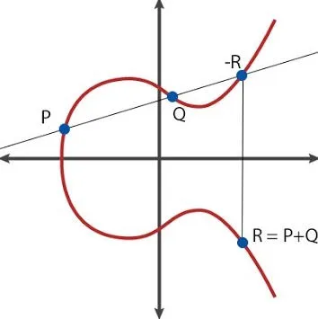
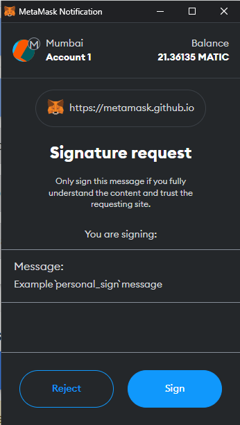
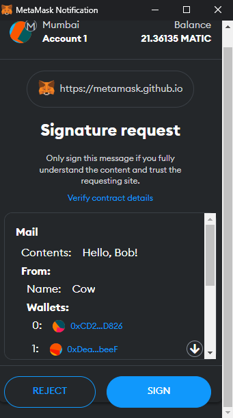

# Digital Signatures on Ethereum

Cryptographic digital signatures are a key part of the blockchain. They are used to verify ownership of an address without revealing its private key. They are mainly used for signing transactions, but can also be used to sign arbitrary messages, opening up various possibilities for use in DApps.

According to the Ethereum documentation, a digital signature is defined as follows:
> A digital signature is a short piece of data that a user creates for a document using their private key. Anyone with the corresponding public key, signature, and document can verify:
> 1. The document was "signed" by the owner of that private key.
> 2. The document hasn't been altered since it was signed.

Digital signatures can be used to:
1. Prove that you possess the private key for a specific public address (authentication).
2. Ensure that a message (e.g., an email) hasn't been tampered with.

Digital signatures are based on mathematical formulas. For example, when verifying an email message, we take the message itself, the private key, and run them through a mathematical algorithm. The output is the digital signature. Then, another mathematical formula can be used to interpret the digital signature and verify the private key without revealing it.

There are many cryptographic algorithms used for encryption that can also be applied to create a digital signature, such as RSA and AES.

However, a separate cryptographic algorithm called DSA (Digital Signature Algorithm) has been specifically designed for creating digital signatures. It is based on using a pair of public and private keys. The signature is created secretly using the private key and verified publicly using the public key, keeping the private key undisclosed.

The Ethereum and Bitcoin networks use a more advanced digital signature algorithm based on elliptic curves called ECDSA (Elliptic Curve Digital Signature Algorithm).

Important! ECDSA is solely an algorithm for digital signatures. Unlike RSA and AES, it cannot be used for encryption.

## Sign message and verify using ECDSA

ECDSA signatures consist of two integers: **r** and **s**. Ethereum also uses an additional variable **v** (recovery identifier). Such a signature can be represented as **{r, s, v}**.

To create a signature, you need to sign the message with a private key. The algorithm looks as follows:
1. Compute the hash of the message. In Ethereum, the message hash is usually computed using `Keccak256`. The message is prefixed with `\x19Ethereum Signed Message:\n32` to ensure that the signature cannot be used outside of Ethereum.
    ```solidity
    Keccak256("\x19Ethereum Signed Message:\n32" + Keccak256(message))
    ```
2. Generate a secure random value, which we'll call **secret**. Using this random value allows us to generate a different signature each time. When this value is not kept secret or can be computed, it becomes possible to derive the private key from two signatures by the same owner of the private key. This is highly insecure for us.
3. Compute the point (x, y) on the elliptic curve by multiplying **secret** with the generator point **G** of the elliptic curve. Remember, the ECDSA algorithm is all about elliptic curves.
4. Calculate **r** and **s** using specific formulas based on the point (x, y) on the elliptic curve. We won't dive into the calculations here, as they require deep knowledge of mathematics. If **r** or **s** is zero, we go back to step 2.

Important! Let's repeat it again. Since we use a random **secret** to generate the signature, the signature will always be different. When the **secret** is not secret (not random or publicly known), it becomes possible to derive the private key from two signatures by the same owner of the private key. However, there is a standard for deterministic DSA signatures (https://www.rfc-editor.org/rfc/rfc6979). According to the standard, a secure **secret** can be selected and consistently used for signing all messages, making it impossible to derive the private key.

## Recovery Identifier ({v})

**V** is the last byte of the signature and has a value of 27 (0x1b) or 28 (0x1c). This identifier is very important. To understand its significance, let's look at the formulas for calculating the value of **r**.

```r = x₁ mod n```

As you can see, **r** is calculated based only on the value of **x** on the horizontal axis. The value on the vertical axis, **y**, is not used. Therefore, if you look at the graph of the elliptic curve, you'll understand that for a given **x** value, there are two different **r** values with opposite signs.



The graph represents the complete process of calculating the point **r**. But for now, it's not crucial. Remember that **r** stores information about the point only along the x-axis, and since the graph is curved, there will be two different **y** values for such **x**.

Now, let's look at the formula for calculating **s** and pay attention to the fact that it uses the value of **r**, which can be two, as you remember.

```s = k⁻¹(e + rdₐ) mod n```

As a result, two completely different public keys (i.e., addresses) that can be recovered may be obtained. And this is where the parameter **v** comes into play, indicating which of the two possible **r** values should be used.

Important! This parameter is necessary for recovering the public address from the digital signature. In Solidity, the built-in function `ecrecover()` is used for this purpose.

## Sign message vs sign transaction

So far, we've only talked about signing messages. For message signing, we compute the hash of the message and use the private key to generate the digital signature.

Signing transactions is a bit more complicated. Transactions are encoded using [RLP](https://ethereum.org/en/developers/docs/data-structures-and-encoding/rlp/). The encoding includes all transaction parameters (nonce, gas price, gas limit, to, value, data) and the signature (v, r, s).

We can encode a signed transaction as follows:

1. Encode the transaction parameters:
    ```solidity
    RLP(nonce, gasPrice, gasLimit, to, value, data, chainId, 0, 0).
    ```
2. Get the hash of the unsigned transaction in RLP encoding using ```Keccak256```
3. Sign the hash with the private key using the ECDSA algorithm.
4. Encode the signed transaction:
   ```solidity
   RLP(nonce, gasPrice, gasLimit, to, value, data, v, r, s).```

By decoding the transaction data encoded with RLP, you can retrieve the raw transaction parameters and the signature.

_Important!_ This is used within the Ethereum network for data exchange between nodes. It helps reduce node operation costs and storage requirements while increasing network throughput by efficiently utilizing memory.

You can learn more about RLP and data serialization in general in this excellent [article](https://medium.com/@markodayansa/a-comprehensive-guide-to-rlp-encoding-in-ethereum-6bd75c126de0).

How do wallets work with signatures?

The signature **{r, s, v}** is combined into a single byte sequence. The length of the sequence is 65 bytes:
- 32 bytes for **r**
- 32 bytes for **s**
- 1 byte for **v**.

If we encode this as a hexadecimal string, it will be a string of 130 characters (excluding the 0x prefix). Most wallets and interfaces use this format for signatures. For example, a complete signature may look like this:

```solidity
sig: 0x0f1928d8f26b2d9260929425bdc6ac922f7d787fd73b42afe2548776a0e858016f52826d8ab67e1c84e6e6778fa4769d8aa4f014bf76b3280be77e4e0c447f9b1c
r: 0x0f1928d8f26b2d9260929425bdc6ac922f7d787fd73b42afe2548776a0e85801
s: 0x6f52826d8ab67e1c84e6e6778fa4769d8aa4f014bf76b3280be77e4e0c447f9b
v: 1c (in hex) or 28 (in decimal)
```

## Standardization of Signature Methods

### Personal_sign

Personal_sign is the common term for the process of signing a message that we described earlier. Let's go over the algorithm in general terms. The message is usually hashed beforehand, resulting in a fixed length of 32 bytes:
```solidity
"\x19Ethereum Signed Message:\n32" + Keccak256(message)
```
Then this hash is signed, which works perfectly for confirming ownership rights to something.

However, if user **A** signs a message and sends it to contract **X**, user **B** can copy that signed message and send it to contract **Y**. This is called a [replay attack](https://en.wikipedia.org/wiki/Replay_attack).

If you're interested in what existed before the introduction of `personal_sign`, you can read [this article](https://medium.com/metamask/the-new-secure-way-to-sign-data-in-your-browser-6af9dd2a1527).

### EIP-191: Signed Data Standard

This standard is a simple proposal aimed at addressing the replay attack problem. It defines a version number and version-specific data. The format is as follows:

```solidity
0x19 <1 byte version> <version specific data> <data to sign>
```
|Версия | EIP |Description|
|-------|-----|--------|
|0x00   |191  |Validator's address. The data to be signed can be anything, and only the validator knows how to handle it|
|0x01   | 712 |Structured data|
|0x45   |191  |personal_sign|

You can find more detailed information about the standard [here](https://eips.ethereum.org/EIPS/eip-191)

This is a standard for typing the data being signed. It allows making the signature data more verifiable by representing it in a readable format.

EIP-712 defines a new method that replaces personal_sign and is called eth_signTypedData (latest version is eth_signTypedData_v4). For this method, we need to specify all the properties (such as to, amount, and nonce) with their corresponding types (e.g., address, uint256, and uint256). In the screenshots below, we can see the difference in the data being signed.





Metamask has prepared a good [demo](https://metamask.github.io/test-dapp/) where you can experiment and see the difference between the signatures.

Additionally, according to the standard, it is necessary to specify the basic information about the application, called **domain**.

**Domain** contains the following information:
1. `string name` - Name of the application or protocol.
2. `string version` - Version of the signature being used. Signature data can be modified and versioned.
3. `uint256 chainId` - Network identifier.
4. `address verifyingContract` - Address of the contract that will verify the signature.
5. `bytes32 salt` - Additional salt field. It can be used to differentiate the domain.

Adding **domain** solves the problem of potential replay attacks.

## Signature Verification in Contracts

In Solidity, there is a built-in function called `ecrecover()`. In fact, it is a pre-compiled contract located at address **0x1**. Using this function helps to recover the public address of the private key that was used to sign the message.

However, there are some pitfalls in using `ecrecover()`. According to EIP-2, there is still some flexibility in the signature for `ecrecover()` in the Ethereum network. The ECDSA library from OpenZeppelin allows removing this flexibility and making the signature unique. You can check the secure implementation of `ecrecover()` [here](https://github.com/OpenZeppelin/openzeppelin-contracts/blob/master/contracts/utils/cryptography/ECDSA.sol#L124).

## Examples

### Signature Verification in Contracts

1. [Simple example](./examples/src/SignatureVerifier.sol) of message signature verification on a contract based on Foundry.
2. [Example using EIP-712 signature standard](./examples/src/EIP712.sol). It uses the ECDSA library from OpenZeppelin based on Foundry.
3. [Creating and verifying signatures](https://docs.soliditylang.org/en/v0.8.19/solidity-by-example.html#creating-and-verifying-signatures) - Solidity docs.
4. [Solidity by Example](https://solidity-by-example.org/signature/) example.

### Real-life Examples

1. [ERC-2612: Permit Extension for EIP-20 Signed Approvals](https://eips.ethereum.org/EIPS/eip-2612). This standard is based on EIP-712. There is a [great article](https://soliditydeveloper.com/erc20-permit) that provides an explanation of the standard.
2. [UniswapV2ERC20.sol](https://github.com/Uniswap/v2-core/blob/master/contracts/UniswapV2ERC20.sol#L81) - This contract extends the `UniswapV2Pair.sol` contract and allows working with signatures in peripheral contracts. The `removeLiquidityWithPermit()` function can be called on the `UniswapV2Router01.sol` contract.
3. [Permit2 by Uniswap](https://uniswap.org/blog/permit2-and-universal-router) - The code can be found [here](https://github.com/Uniswap/permit2). The idea is to make the permit available for ERC-20 tokens regardless of whether the token supports ERC-2612.
4. Open GSN uses signature verification in its [Forwarder.sol](https://github.com/opengsn/gsn/blob/master/packages/contracts/src/forwarder/Forwarder.sol#L151) contract.

### Generating Signatures from External Sources

1. Ethers js - [Sign message](https://github.com/t4sk/hello-erc20-permit/blob/main/test/verify-signature.js).
2. Metamask - [Signing data](https://docs.metamask.io/guide/signing-data.html).
3. Open Ethereum - [API](https://openethereum.github.io/JSONRPC-personal-module#personal_sign).
4. [Example](https://eips.ethereum.org/assets/eip-712/Example.js) from EIP-712.

## Links

The first two articles are cool. They explain the basic concepts of cryptographic signatures in a simple language.

1. [The Magic of Digital Signatures on Ethereum](https://medium.com/mycrypto/the-magic-of-digital-signatures-on-ethereum-98fe184dc9c7)
2. [Intro to Cryptography and Signatures in Ethereum](https://medium.com/immunefi/intro-to-cryptography-and-signatures-in-ethereum-2025b6a4a33d)
3. [EIP-191](https://eips.ethereum.org/EIPS/eip-191)
4. [EIP-712](https://eips.ethereum.org/EIPS/eip-712)
5. [ECDSA Contract](https://docs.openzeppelin.com/contracts/4.x/api/utils#ECDSA) for signature verification.
6. [Mathematical and Cryptographic Functions](https://docs.soliditylang.org/en/v0.8.19/units-and-global-variables.html#mathematical-and-cryptographic-functions) - Solidity docs. You can check the descriptions of `ecrecover()`, `keccak256()`, etc.
7. [Testing EIP-712 Signatures](https://book.getfoundry.sh/tutorials/testing-eip712)
