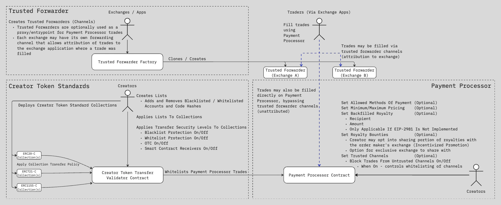
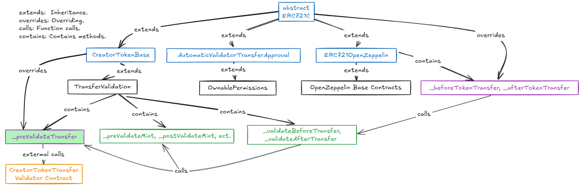
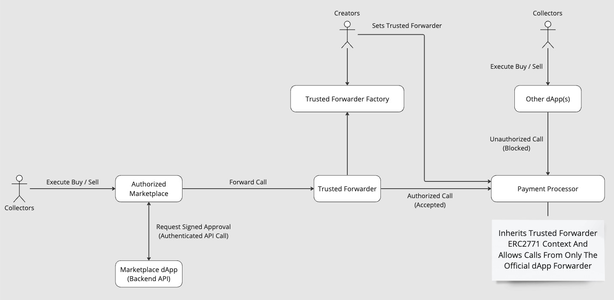

# ERC721C: A New Approach to Royalty Payments

**Author:** [Alexey Kutsenko](https://github.com/bimkon144) 👨‍💻

## Introduction

[Limit Break](https://limitbreak.com/), a game development studio focused on the free-to-play model, introduced the concept of Creator Tokens in January 2021. Version 1.1 of the ERC721C contract, which implemented many ideas from Creator Tokens, was released in May 2023.

[ERC721C](https://github.com/limitbreakinc/creator-token-standards/blob/main/src/erc721c/ERC721C.sol) is an experimental approach to creating new capabilities for working with NFTs, aimed at solving the problem of royalty payments to NFT creators. Although this standard has not yet been submitted to the Ethereum Improvement Proposals (EIPs) registry, it offers mechanisms to better protect the interests of digital content creators. Whether it will eventually be submitted as an EIP or follow a path similar to [ERC721A](https://www.erc721a.org/) remains to be seen.

ERC721C proposes moving the mandatory royalty mechanism into a separate `paymentProcessor` contract, which would handle token trading. This is achieved through [transfer restrictions](https://apptokens.com/docs/integration-guide/creator-token-standards/v4/for-creators/transfer-security#transfer-security-levels) — levels that help restrict contracts from interacting with tokens using the `_beforeTokenTransfer` and `_afterTokenTransfer` hooks. Digital content creators will be able to configure these `transfer restriction` levels.

## Do We Need the ERC721C Standard?

Despite the innovation behind ERC721C, a reasonable question arises: why is there a need for a new standard?

One of the key issues with royalties is that token standards like [ERC721](https://eips.ethereum.org/EIPS/eip-721) and [ERC1155](https://eips.ethereum.org/EIPS/eip-1155) do not include any royalty mechanism at all. As a result, marketplaces implement royalties in ways that are convenient for them, which doesn't guarantee compatibility between platforms or enforceability of royalty payments. This leads to a situation where content creators do not receive fair compensation for the resale of their works on the secondary market. There is a well-known royalty standard, [ERC-2981](https://eips.ethereum.org/EIPS/eip-2981), but it only defines how to pass royalty information — it doesn’t enforce payment. Actual payments and even the use of the standard are entirely up to the marketplaces.

With ERC721C, we see that the Limit Break team created a new standard to enforce stricter royalty control, which raises questions about the decentralization of this approach.

Main reasons why this standard emerged:

- Preventing royalty bypass: Marketplaces may not support royalties at all, may support ERC-2981, or make royalty payments optional — at the seller's discretion.
- Monetization of collections: The new standard benefits game developers and collectible NFT creators by preserving additional revenue from secondary sales.
- Brand ecosystem protection: The added control allows blocking undesirable actions (e.g., sales on untrusted platforms).

However, despite these advantages, there are some potential downsides:

- Marketplace support: Not all marketplaces support this type of token. This means digital content creators must selectively grant access for operations, specifically allowing only certain marketplaces.
- User risks: Strict control might alienate the decentralized community, as users value the freedom to transfer their tokens. You wouldn’t want an NFT creator to suddenly change the transfer rules and make your token completely untradable and non-transferable on any marketplace, right?
- Mandatory royalty payments: Many users prefer to pay royalties optionally, and some don’t want to pay extra fees at all. This can be a strong point for creators, but a weak one from the user's perspective.

## Architecture and Modules of ERC721C

Creator Advanced Protection Suite (CAPS) is a set of open-source smart contracts developed to give digital content creators full control over their digital assets and interactions within the Web3 ecosystem. CAPS includes three independent yet complementary products: [Creator Token Standards](https://github.com/limitbreakinc/creator-token-standards), [Payment Processor](https://github.com/limitbreakinc/payment-processor-v2), and [Trusted Forwarder](https://github.com/limitbreakinc/TrustedForwarder). These modules work together to provide token protection and control over trading processes.

With CAPS, creators can:

- Ensure enforcement of royalty payments for usage.
- Configure and isolate their ecosystem on any EVM-compatible blockchain.
- Track which apps and platforms are involved in transactions, and set restrictions to protect their assets from unwanted actions or interactions.
- Each CAPS product can be used individually, but using them together provides a strong, multi-layered protection system for your assets.

Example use case:

- A token creator wants to protect their NFT collection from being resold on marketplaces that don’t support royalties, and prevent transfers to wrapper contracts commonly used to bypass royalty payments. At the same time, it’s important that users can freely transfer NFTs directly to each other — for example, as gifts or trades.
- It’s also possible to completely block direct NFT transfers between users (P2P) to prevent bypassing marketplaces and royalty payments. Users would only be able to sell tokens through whitelisted, verified marketplaces, eliminating the ability to circumvent royalties via direct swaps or no-fee transfers.

The diagram below shows the CAPS architecture and how its modules interact.



Let’s briefly explain the role of each module:

**Trusted Forwarder**: Essentially a "proxy" contract for interacting with the `paymentProcessor`. Through this contract, marketplaces can sell collections on behalf of creators while ensuring royalty payments and protecting collections from royalty bypass. For example, we may want only a specific marketplace to be allowed to trade our tokens — in return, we grant them royalties for each sale made through the `Trusted Forwarder` contract.

**Creator Token Standards**: Manages the security of token transfers using the `_beforeTokenTransfer` and `_afterTokenTransfer` hooks in the collection contract, along with the `CreatorTokenTransfer` validator. It allows setting restrictions (blacklists/whitelists, P2P blocking) and controlling which platforms can interact with the tokens.

**Payment Processor**: Enforces royalty compliance during transactions, supports marketplace whitelisting, minimum/maximum sale prices, and flexible payment methods. It handles payment distribution between creators and marketplaces. For instance, a collection creator can add royalties to their token even without ERC2981 support, configure minimum/maximum sale prices, and choose accepted tokens for payments.

_Note: The above modules (excluding the ERC721C token itself) are deployed once — either by the LimitBreak developers or by the user, if not already present on the desired network. To deploy missing contracts yourself and manage your collection more easily, you can use [this](https://developers.apptokens.com/infrastructure) interface._

_As of the time of writing, a new module called [TokenMaster](https://apptokens.com/docs/integration-guide/token-master/overview) has also been introduced._

### Creator Token Standards: Configuring Transfer Restrictions

Creator Token Standards gives creators the ability to define rules for how the transfer function operates for tokens following the ERC20, ERC721, and ERC1155 standards.

Key Features:

1. Transfer Function Control:

    - Creators can define rules that block or allow specific protocols using token transfer functions.
    - These rules are useful in a variety of scenarios such as marketplaces, gaming platforms, or custom token transfer use cases.

2. Working with Transfer Hooks:

    - All major token standards (ERC20, ERC721, ERC1155) include `_beforeTokenTransfer` and `_afterTokenTransfer` hooks, which allow injecting logic before and after token transfers. Important note: ERC721C is used with OpenZeppelin version 4.8.2. Therefore, the current ERC721C implementation is not compatible with v5 token contracts from OpenZeppelin.
    - A contract inheriting from ERC721C connects to these hooks and adds validation through an external transfer check contract ([Creator Token Transfer Validator Contract](https://github.com/limitbreakinc/creator-token-standards/blob/main/src/utils/CreatorTokenTransferValidator.sol)).

3. Configuring the CreatorTokenTransferValidator Contract:

    - Used to set and enforce security rules defined by the token creator, such as blocking or allowing transfers based on the caller, from, and to addresses.
    - Allows creators to dynamically adjust settings to increase or decrease the security level of their collections.

4. Flexible Configuration:

    - Creators can configure two key parameters for their collections:
        - Transfer Security Level: Defines how strict the rules are for the collection.
        - List ID: Specifies which whitelist/blacklist is applied to the collection.
    - These settings can be changed at any time without the need to write new code.

The module consists of the following core contracts:

- **ERC721C Contract**
- **Transfer Validator Contract – Creator Token Transfer Validator Contract**

**ERC721C: Core Contract**

To use the `ERC721C` contract, you simply need to inherit from it.

```solidity
import {ERC721C} from '@limitbreak/creator-token-standards/erc721c/ERC721C.sol';

contract Token is ERC721C {
    // The rest of your contract code
}
```

Let’s take a look at the key parts of the `ERC721C` code.

```solidity

//... Import necessary dependencies

/**
 * @title ERC721C
 * @author Limit Break, Inc.
 * @notice Extension of the OpenZeppelin ERC721 implementation with added Creator Token functionality,
 * allowing the contract owner to update transfer validation logic via an external validator.
 */
abstract contract ERC721C is ERC721OpenZeppelin, CreatorTokenBase, AutomaticValidatorTransferApproval {
    // - Abstract contract `ERC721C`: The main contract that combines ERC721 functionality with transfer validationиthrough overridden `_beforeTokenTransfer` and `_afterTokenTransfer` hooks.
    // - Inherited abstract contract `CreatorTokenBase`: Extends token functionality to support customizable transfer restrictions.
    // - Inherited abstract contract `TransferValidation`: Base contract for integrating validators and hooks.

    // Rest of the contract code ...

    /**
     * @dev Overrides OpenZeppelin's _beforeTokenTransfer hook to validate transfers.
     * @param from Address of the token sender
     * @param to Address of the token recipient
     * @param firstTokenId ID of the first token in the batch
     * @param batchSize Number of tokens in the batch
     */
    function _beforeTokenTransfer(
        address from,
        address to,
        uint256 firstTokenId,
        uint256 batchSize) internal virtual override {
        // Iterate over each token in the batch
        for (uint256 i = 0; i < batchSize;) {
            // Validate the transfer of each individual token
            _validateBeforeTransfer(from, to, firstTokenId + i);
            unchecked {
                ++i;
            }
        }
    }

    /**
     * @dev Overrides OpenZeppelin's _afterTokenTransfer hook to validate transfers.
     * @param from Address of the token sender
     * @param to Address of the token recipient
     * @param firstTokenId ID of the first token in the batch
     * @param batchSize Number of tokens in the batch
     */
    function _afterTokenTransfer(
        address from,
        address to,
        uint256 firstTokenId,
        uint256 batchSize) internal virtual override {
        // Iterate over each token in the batch
        for (uint256 i = 0; i < batchSize;) {
            // Execute post-transfer logic for each individual token
            _validateAfterTransfer(from, to, firstTokenId + i);
            unchecked {
                ++i;
            }
        }
    }
}

```

For a more detailed understanding, you can check out the full [contract code](https://github.com/limitbreakinc/creator-token-standards/blob/main/src/erc721c/ERC721C.sol) and refer to the diagram below:

Ultimately, the token contract calls the `validateTransfer` method on the configured `CreatorTokenTransferValidator` contract with every token transfer attempt.



**CreatorTokenTransferValidator Contract**

This contract provides a mechanism for validating and managing [transfer restrictions](https://apptokens.com/docs/integration-guide/creator-token-standards/v4/for-creators/transfer-security#transfer-security-levels) for collection tokens such as ERC20, ERC721, and ERC1155. It allows collection owners to configure transfer restrictions (e.g., black/white lists, transfer protection levels for tokens).

The entry point for validation is the `validateTransfer(address caller, address from, address to)` function. This function is called by the token contract through transfer hooks.

The contract code is quite large, so let’s highlight the key functionality. If you want to see the full code, it’s available [here](https://github.com/limitbreakinc/creator-token-standards/blob/main/src/utils/CreatorTokenTransferValidator.sol).

**Core Functions:**

**Creating and Managing Lists**

The contract provides functions for creating and managing address lists (blacklists and whitelists). Creators can create new lists and add/remove addresses or contract code hashes:

- `createList(string name)` — creates a new list (black or white).
- `addAccountsToBlacklist` / `removeAccountsFromBlacklist` — adds or removes addresses from the blacklist.
- `addAccountsToWhitelist` / `removeAccountsFromWhitelist` — adds or removes addresses from the whitelist.
- `addCodeHashesToBlacklist` — adds contract code hashes to the blacklist.
- `addCodeHashesToWhitelist` — adds contract code hashes to the whitelist.

These functions provide flexible control over the security policies of a collection.

**Collection Management**

- `setTransferSecurityLevelOfCollection(address collection, uint8 level, bool disableAuthorizationMode, bool disableWildcardOperators, bool enableAccountFreezingMode)`
  Sets transfer restrictions for the entire collection. This is the main function for managing transfer settings. We'll take a closer look at it later.

- `freezeAccountsForCollection(address collection, address[] calldata accountsToFreeze)`
  Freezes the specified accounts for the collection, effectively preventing them from interacting with the tokens.

**Transfer Validation**

- `validateTransfer(address caller, address from, address to)`
  Checks whether the transfer is allowed under the current security settings. This function is used in the token contract via the `_beforeTokenTransfer` hook.

**Authorization Management**

- `addAccountsToAuthorizers(uint120 id, address[] calldata accounts)`
  Sets token authorizers. Authorizers are specifically designated addresses (accounts or contracts) that are granted the right to approve other operators who can perform transfers bypassing the standard rules. These functions are listed below.

- `beforeAuthorizedTransfer(address operator, address token, uint256 tokenId)`
  Sets an authorized operator to perform a transfer, bypassing the standard transfer checks. Important: the authorizer must later remove the authorization to avoid security issues.

- `afterAuthorizedTransfer(address token, uint256 tokenId)`
  Removes the authorization for the operator.

- `beforeAuthorizedTransferWithAmount(address token, uint256 tokenId, uint256 /*amount*/)`
  Sets a token ID to be transferable by any operator, bypassing standard transfer validations. Again, the authorizer must remove the authorization afterward.

- `afterAuthorizedTransferWithAmount(address token, uint256 tokenId)`
  Removes the authorization for the token.

**Technologies and Libraries Used**

- **OpenZeppelin**
  Standard contracts are used, such as `ERC165` for interface detection and `EnumerableSet` for managing lists.

- **PermitC**
  An enhanced version of permit2. This contract provides advanced permission management for ERC20, ERC721, and ERC1155 tokens, including:

  - Single-use permit transfers
  - Time-bound approvals
  - Order ID based transfers

- **Tstorish**
  The Tstorish contract is used to manage the TSTORE opcode where supported by the EVM. It includes testing for TLOAD/TSTORE availability during contract deployment. If TSTORE is supported, it allows for more efficient storage operations. If not, it falls back to standard opcodes like SSTORE and SLOAD.

Let's take a closer look at the arguments of the function `setTransferSecurityLevelOfCollection(address collection, uint8 level, bool disableAuthorizationMode, bool disableWildcardOperators, bool enableAccountFreezingMode)`:

- `collection` – the address of the token contract for which the transfer policy is being set.
- `level` – the transfer protection level, what we’ve been calling _transfer restrictions_. You can view the table [here](https://apptokens.com/docs/integration-guide/creator-token-standards/v4/for-creators/transfer-security#transfer-security-levels).
- `disableAuthorizationMode` – disables the use of authorizers to allow individual transfers that bypass the transfer policy.
- `disableWildcardOperators` – prevents authorizers from using wildcard operators (i.e., full bypass for specific token IDs).
- `enableAccountFreezingMode` – enables the ability to freeze certain accounts, preventing them from sending tokens.

Thus, transfer restriction settings allow you to:

1. Protect tokens from unauthorized transfers.
2. Ensure that transactions go through trusted channels (like `trusted forwarder` contracts).
3. Restrict access for smart contracts, if necessary.
4. Configure a flexible security mechanism suitable for various use cases — from freely transferable tokens to bound tokens (Soulbound Tokens).

### Trusted Forwarders

In modern decentralized applications (dApps) and protocols, one of the key challenges is ensuring secure and controlled transaction routing — especially in the context of selling digital assets and user-platform interactions. The problem becomes more complex when third-party apps attempt to exploit open protocols to intercept transaction flows, bypassing authorized interfaces. This not only creates risks for users but can also harm creators and official platforms.

To address these issues, the Trusted Forwarder mechanism was developed. This mechanism allows content creators and marketplaces to establish interaction channels with the payment processor, ensuring control over transaction routing. A Trusted Forwarder can operate in two modes:

- Open Mode: The forwarder relays all transactions, appending the caller’s address to the call data.

- Permissioned Mode: The forwarder requires that transaction data be signed by a trusted address specified by the forwarder’s owner.



The diagram below visualizes how the Trusted Forwarder works in the context of interactions between collectors, marketplaces, content creators, and the Payment Processor.

Deployment of the Trusted Forwarder contract must be done through the [Trusted Forwarder Factory contract](https://github.com/limitbreakinc/TrustedForwarder/blob/main/src/TrustedForwarderFactory.sol).

Ways to deploy a `Trusted Forwarder`:

- Directly through the already deployed factory contract, for example via [Etherscan](https://etherscan.io/address/0xff0000b6c4352714cce809000d0cd30a0e0c8dce#writeContract)

- Use the [interface](https://developers.erc721c.com/modification), where you can configure `trusted channels`, which involves deploying a `Trusted Forwarder` contract.

- If the factory contract is not deployed on your network, you can deploy it manually via the [interface](https://developers.erc721c.com/infrastructure) or using the [repository](https://github.com/limitbreakinc/TrustedForwarder/tree/main/src).

Основные методы контракта `Forwarder`:

```solidity
    // ...Rest of the contract code

    /**
     * @notice Forwards a call to the target contract, preserving the original sender's address.
     * @dev Used when a signature is not required.
     * @param target Address of the target contract.
     * @param message Call data.
     * @return returnData Data returned from the target contract call.
     */
    function forwardCall(address target, bytes calldata message)
        external
        payable
        returns (bytes memory returnData)
    {
        // Rest of the contract code ...

        // Encodes the call data with the original sender’s address appended.
        bytes memory encodedData = _encodeERC2771Context(message, _msgSender());

        assembly {
            // Perform the call to the target contract with the encoded data.
            let success := call(gas(), target, callvalue(), add(encodedData, 0x20), mload(encodedData), 0, 0)
            // Handle the call ...

    }
}
    // Rest of the contract code ...
```

You can view the full contract code [here](https://github.com/limitbreakinc/TrustedForwarder/blob/main/src/TrustedForwarder.sol)

### Payment Processor

[Payment Processor](https://apptokens.com/docs/integration-guide/payment-processor/overview) is a peer-to-peer NFT trading protocol that acts as an on-chain settlement layer for executing trades. A key feature of the system is the use of off-chain order books and exchanges, which handle deal data storage and processing off-chain. This gives developers and creators greater control over trading processes and significantly reduces gas costs.

Payment Processor ensures full enforcement of creator royalties, which makes it stand out from other NFT protocols.

The protocol supports royalty configurations:

1) EIP-2981 — a smart contract standard that defines royalty rules on-chain.

2) Royalty Backfill — for older collections that don’t support EIP-2981. This is possible if the collection:

   - Implements the `Ownable` standard and is capable of invoking royalty configuration functions.
   - Implements the `AccessControl` standard, where settings can be changed by an admin.

3) Even in the absence of on-chain royalty support, creators can use the Royalty Backfill approach and enforce royalties through agreements with marketplaces to include a fee when forming deals.

Payment Processor offers unique management tools that prioritize the interests of creators:

Thus, this contract always enforces royalties defined by the creator either through ERC-2981 or through manual configuration — helping avoid unpaid royalties, as long as whitelist settings are in place for marketplaces that support ERC721C.

**Flexibility in Payment Methods**

- **Default whitelist**: Only ETH, WETH, USDC, and their equivalents are allowed, protecting creators from unwanted tokens.
- **Custom whitelist**: Creators can define their own accepted tokens, which is especially useful for Web3 games.
- **Allow all tokens**: For maximum flexibility in payments.

**Price Limits**
Creators can set minimum and maximum prices either at the collection level or per individual NFT — useful for rare in-game items or for maintaining collection economy control.

**Royalty Bonuses**
In addition to the core royalty functionality, as mentioned earlier, creators can share a percentage of their royalties with marketplaces to incentivize them to promote collections. This mechanism helps build partnerships and increase collection visibility.

**Trusted Channels**
As previously mentioned, collection creators can restrict trading to trusted channels only, blocking access from undesirable platforms.

You can find the main management methods for collection creators [here](https://apptokens.com/docs/integration-guide/payment-processor/v2.0/for-creators/payment-settings).

To check which networks the `Payment Processor` contract is already deployed on, visit [this page](https://apptokens.com/docs/integration-guide/payment-processor/v3.0/deployments).

In addition to the contracts we've already covered, LimitBreak has also created various modifications of ERC721C — offering ready-to-use contracts to simplify integration for marketplaces:

- [ERC721AC](https://github.com/limitbreakinc/creator-token-contracts/blob/main/contracts/erc721c/ERC721AC.sol) Extends the implementation of Azuki's ERC-721A token.
- [ERC721CW](https://github.com/limitbreakinc/creator-token-contracts/blob/main/contracts/erc721c/extensions/ERC721CW.sol) A wrapper contract for ERC721C that allows wrapping older royalty-unsupported and upgradeable contracts.
- [ImmutableMinterRoyalties](https://github.com/limitbreakinc/creator-token-contracts/tree/main/contracts/programmable-royalties) Various royalty recording methods based on ERC-2981, customizable to the creator’s needs.
- [OrderFulfillmentOnchainRoyalties](https://github.com/limitbreakinc/creator-token-contracts?tab=readme-ov-file#usage-1) A smart contract that automates royalty payments and NFT transfers during a sale.

## Why Isn’t There a Unified Approach?

A natural question arises: if the royalty issue is so critical, why isn’t there a single standard? The answer lies in the differing interests of Web3 participants:

- Content creators want guaranteed royalty payments from sales, which requires implementing checks and restrictions — often seen as a threat to decentralization.
- Marketplaces aim to attract users who value the freedom to transfer tokens and prefer little to no royalty fees.
- Users want fewer restrictions on their tokens and to pay lower (or no) fees.

Because of this, Web3 exists in a state of compromise: some standards improve existing functionality (like ERC721A), while others introduce new layers of control (like ERC721C). This leads to competition among standards, rather than a unified, one-size-fits-all solution.

## Supported Marketplaces

Major marketplaces like [OpenSea](https://opensea.io/blog/articles/introducing-the-opensea-mobile-app), [Magic Eden](https://magiceden.io/en), and [X2Y2](https://x2y2.io/) already support this development, allowing digital creators to leverage enforced royalty mechanisms.

Limit Break actively maintains and updates a [whitelist](https://github.com/limitbreakinc/creator-token-contracts?tab=readme-ov-file#limit-break-curated-whitelist) of marketplaces that support ERC721C.

## Conclusion

The new ERC721C approach marks a new era in NFT management, giving creators the tools to ensure fair compensation and control over their digital assets. The Creator Advanced Protection Suite (CAPS), which includes Creator Token Standards, Payment Processor, and Trusted Forwarder, addresses key challenges related to royalty enforcement, secure transfers, and platform interactions.

### Key Advantages:

**Guaranteed Royalty Enforcement**
The standard solves the issue of inconsistent royalty enforcement across marketplaces. With Payment Processor integration, creators can be confident that royalties will be respected in every transaction.

**Transfer Control**
Validation mechanisms and security levels allow strict rules for token transfers, protecting collections from unauthorized actions such as bypasses or interactions with unapproved platforms.

**Flexible Management**
ERC721C makes it possible to tailor transfer policies, royalties, and platform interactions to the unique needs of each collection or project. Creators can set minimum/maximum prices, restrict payment methods, and add trusted marketplace channels.

**Royalty Sharing with Marketplaces**
A unique feature of ERC721C is the ability to share a portion of royalties with marketplaces, encouraging them to promote collections, strengthen partnerships, and increase visibility. This creates a win-win ecosystem where the interests of creators and marketplaces support one another.

**Creator-Friendly Management via Limit Break Interface**
Collections can be managed through a [user interface](https://developers.erc721c.com/modification) without needing to interact with contracts directly — no coding skills required.

## Main Drawbacks:

**Centralization Concern**
A digital content creator can change transfer parameters for the entire collection at any time — including blocking token transfers to certain addresses, modifying the list of trusted marketplaces, adjusting royalties, or even turning the token into a [soulbound](https://www.ledger.com/academy/topics/blockchain/what-is-a-soulbound-token) asset.

**Contract Support Issues**
Originally, contracts were maintained and updated openly, with the latest versions available on [GitHub](https://github.com/limitbreakinc/creator-token-contracts?tab=readme-ov-file#limit-break-curated-whitelist). However, according to the documentation, new versions of the `Payment Processor` and `Creator Token Transfer Validator` have already been released, but the code is now only visible via deployed contracts on [Etherscan](https://etherscan.io/address/0x721C002B0059009a671D00aD1700c9748146cd1B#code). Additionally, ERC721C is only compatible with ERC20, ERC721, and ERC1155 token contracts that implement `_beforeTokenTransfer` and `_afterTokenTransfer` hooks. This creates a challenge for creators who want to use newer token implementations.

The ERC721C standard represents a major step toward strengthening the rights of digital content creators by offering mechanisms for enforced royalties, flexible token transfer settings, and integration with collection management tools. However, it also introduces both advantages and significant trade-offs.

On one hand, ERC721C brings transparency and fair compensation to creators, addressing the issue of poor royalty enforcement on many marketplaces. The ability to share royalties with marketplaces creates strong incentives for ecosystem growth. Creators gain powerful tools to adapt token behavior for different use cases — from game assets to unique digital collectibles.

On the other hand, the level of centralization required by ERC721C may be a sticking point for a community that values decentralization. The creator's ability to change transfer rules, block actions, and limit token interactions raises concerns among users. After all, the freedom to own and use digital assets is one of Web3’s core values. Compatibility limitations with modern token standards further increase the risk.

The future of ERC721C will largely depend on how willing the market participants — creators, marketplaces, and users — are to adapt to this new approach. If creators can show that centralized control won’t be abused and marketplaces continue to support the standard, it may become a cornerstone in the Web3 ecosystem.

Time will tell whether ERC721C becomes the foundation for new NFT use cases or remains a niche solution for specialized collections and platforms.

## Links:

- [Docs: ERC721C](https://erc721c.com/docs/integration-guide/overview)
- [GitHub: limitbreak](https://github.com/limitbreakinc)
- [GitHub: ERC721C contracts](https://github.com/limitbreakinc/creator-token-standards)
- [Article: Opensea creator earnings](https://opensea.io/blog/articles/creator-earnings-erc721-c-compatibility-on-opensea)
- [Article: Limitbreak introducing ERC721C](https://medium.com/limit-break/introducing-erc721-c-a-new-standard-for-enforceable-on-chain-programmable-royalties-defaa127410)
- [Guide: Creator Fee Enforcement for upgradeable contracts](https://docs.opensea.io/docs/creator-fee-enforcement)
- [GitHub: Supported marketplaces](https://github.com/limitbreakinc/creator-token-contracts?tab=readme-ov-file#limit-break-curated-whitelist)
