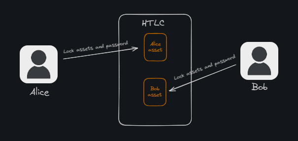
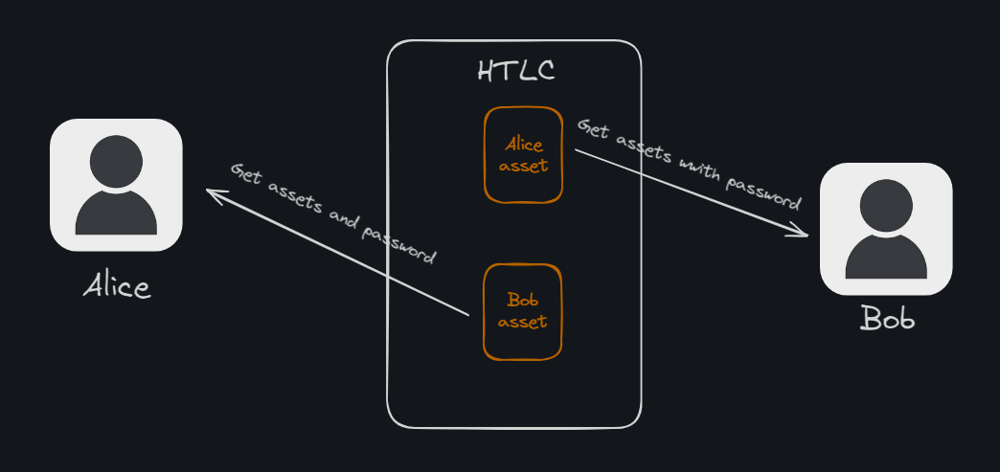
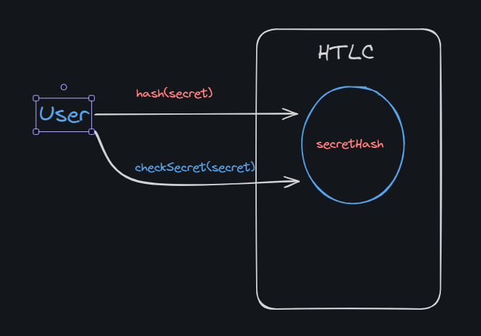
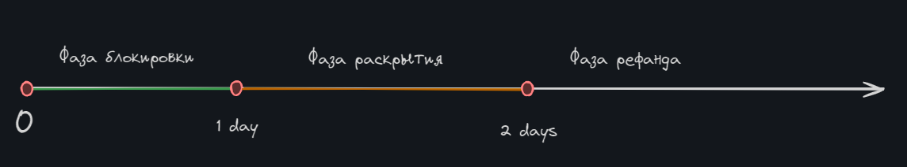
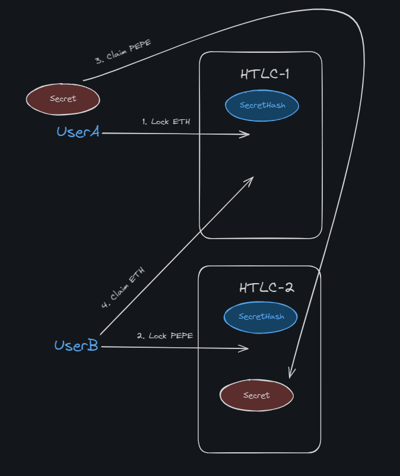

# Hash Time Locked Contracts

**Author:** [Pavel Naydanov](https://github.com/PavelNaydanov) 🕵️‍♂️

_Оп!_ **Hashed Time Locked Contract (HTLC)** is a type of smart contract that creates a temporary storage mechanism for transferring assets to a new owner. The essence is that assets are locked in the smart contract, and a special password is required to withdraw the assets. This process is time-restricted and regulated by the smart contract.

Originally, HTLC was developed to provide more secure ways of creating transactions. The concept gained real prominence after Joseph Poon and Thaddeus Dryja proposed using HTLC for **payment channels** in early 2016. Their work was titled [“The Bitcoin Lightning Network: Scalable Off-Chain Instant Payments”](https://lightning.network/lightning-network-paper.pdf).

As a result, there is a vast amount of material available on implementing HTLC in the Bitcoin network. In this article, we will discuss how this concept can be implemented and applied in Ethereum-compatible networks, where the **account-based** model is used instead of UTXO.

At a high level, the process can be represented as follows:

1. Two users, Alice and Bob, lock the assets they want to exchange on the HTLC. Each partner can only withdraw the assets if they know the password.

    

2. The password exchange occurs to unlock the assets.

    

3. Withdrawal of assets from the HTLC.

    

## Two Key Components

Based on the concept's name "Hash Time Locked Contracts," the two critical components are **hash** and **time**. Let’s explore how they are used and why they are important.

### Hash

This component is often referred to as a **hashlock**. It represents hashed data that prevents assets from being unlocked until the original data is revealed. The information used to generate the hashlock is called the **pre-image**. In other words, the **pre-image** is secret data that is hashed to produce the hashlock.

In the first step, a secret phrase (pre-image) must be generated, which serves as the key to the assets locked in the smart contract. However, it is also important to share proof of this phrase publicly so that both participants in the exchange are confident that the secret will not change during the transaction. While a blockchain is perfect for recording this proof because of its immutability, its public nature poses a problem: anyone could retrieve the secret from the smart contract and claim the assets before the intended participants.

Hashing solves this problem. It allows the secret to be recorded on the blockchain without revealing it. Storing the hashed version of the secret guarantees its immutability until the asset is withdrawn. At the conclusion of the transaction, participants can verify that the provided secret matches the originally hashed value.

In Solidity, the `keccak256` function is used for hashing:

```solidity
bytes32 secretHash = keccak256("Secret phrase")
```

This can work as follows:


1. The user hashes a secret.  
2. Records the hash in the contract.  
3. At the right moment, they can prove to everyone that the original secret is the one they are now revealing.  

These three simple actions can be implemented on a smart contract:

```solidity
contract SecretGuarantee {
    bytes32 private _secretHash;

    /// @notice Helps generate a hash based on a secret phrase
    function getSecretHash(string memory secret) public pure returns (bytes32) {
        return keccak256(bytes(secret));
    }

    /// @notice Records the hash of the secret phrase in the contract
    function setSecretHash(bytes32 secretHash) external {
        _secretHash = secretHash;
    }

    /// @notice Verifies that the secret phrase matches the hash that was recorded in the contract
    function checkSecret(string memory secret) external view returns (bool) {
        if (getSecretHash(secret) == _secretHash) {
            return true;
        }

        return false;
    }
}
```

### Time

The process of password exchange and asset unlocking can occur at different points in time and in different blocks. Therefore, the issue of strictly regulating user actions becomes critical. This component implements a mechanism that allows assets to be unlocked after a certain period of time.

**Why is this important?** Let’s look at an example. The first user locks the assets, but the second one does not. This creates a problem: the first user’s assets are lost forever. A counterargument might be: "Allow the first user to reclaim the assets through a refund." Okay! We add the ability to perform a refund on the smart contract. However, another scenario emerges: the first user locks the assets, the second user locks the assets, and then the first user issues a refund. In this case, the second user also needs to issue a refund and restart the process. The problem could have been that the first user simply did not wait for the second one, because they didn’t know the second user was planning to lock the assets as well, just a bit later.

This problem is resolved by allocating time intervals for each user’s actions within the deal.



Each phase defines which actions will take place and how much time will be allocated for them. Users must go through the process from locking assets to revealing and completing the deal. Often, it’s sufficient to define just a single time point—after which the return of assets becomes possible.

_Important!_ All time intervals must be strictly regulated by the smart contract.

## Implementation

Let’s move from theory to practice. We will examine two options for implementing HTLC. In fact, this concept can be implemented in different ways to adapt it to the specific needs of a protocol.

### Solo HTLC

The main idea of the concept is that a separate, independent smart contract must be created for each user’s asset lock. One asset lock—one smart contract. In this case, the implementation will look as follows.



UserA agreed with UserB to exchange ETH for the PEPE token. They shook hands, and UserA created the hash of their secret phrase (**secretHash**, which no one knows at this moment, including UserB) based on the secret phrase (**secret**). The process then follows this scheme:

1. UserA locks ETH in their HTLC-1 and provides the `secretHash` to the smart contract. The assets can only be unlocked by knowing the secret phrase. UserB must submit the secret to the smart contract, which will compare it with the `secretHash` initially provided by UserA.  
2. UserB locks PEPE in their HTLC-2 contract. For this, UserB uses the same `secretHash` that UserA used in their HTLC-1 contract.  
3. Both users confirm that the deal’s conditions are being met and the amounts of assets align with the agreement. Both contracts know about the `secretHash` created by UserA, but only UserA knows the actual `secret` so far.  
4. UserA withdraws the assets from UserB’s HTLC-2 contract, but in doing so, reveals their `secret` to the contract (the contract won’t release the assets without the secret due to its implementation). Since the `secretHash` in both HTLC-1 and HTLC-2 is identical, UserB can now retrieve the secret and claim their acquired assets from HTLC-1.  

As a result, the code for this process can be implemented in a relatively simple and clear manner, and the process will execute in several steps.

The first step is to lock the assets. We will do this at the time of creating the smart contract.

```solidity
contract SoloHTLC {
    struct LockOrder {
        address sender;
        address recipient;
        bytes32 secretHash;
        address token;
        uint256 value;
        uint64 expiredTime;
    }

    constructor(LockOrder memory lockOrder) payable {
        // We save the order information
        _lockOrder = lockOrder;

        // We lock the assets on the smart contract
        _transferFrom(lockOrder.token, lockOrder.sender, address(this), lockOrder.value);

        emit Locked(lockOrder);
    }

    ....
}
```

Each user must create their own SoloHTLC contract and lock the assets they plan to exchange during the deal.

Next, UserA must reveal the secret and can simultaneously claim the assets. To achieve this, we will add the `claim()` function to the contract.

```solidity
function claim(bytes memory secret) external {
    // Transfers assets to the recipient. In our case, UserA.
    _transfer(_lockOrder.token, _lockOrder.recipient, _lockOrder.value);

    // Reveals the secret.
    emit Claimed(secret, _lockOrder);
}
```

Yes, exactly! To reveal the secret, it’s enough to simply emit an event containing it. We don’t necessarily need to store it in the smart contract itself.

The second user can call `claim()` on their partner's contract and similarly claim the assets.  
The `_transfer()` and `_transferFrom()` functions are universal and can handle both the network's native currency and ERC-20 standard tokens. You can check these functions, as well as the `validateLock` and `validateClaim` modifiers, which implement the necessary checks and asset refunds, in the full [implementation] (./contracts/src/SoloHTLC/SoloHTLC.sol).

Attention check. 🤔 How can we deduct ERC-20 tokens from a user when creating a contract if approval cannot be granted? This is impossible because the contract address is not yet known at the time of deployment and asset deduction.  

I came up with a rather elegant solution. We will use an additional factory contract that will create the HTLC using a special virtual machine opcode called `create2`. This opcode allows us to predict the contract address before it is deployed to the network.

```solidity
contract FactoryHTLC {
    function createHTLC(LockOrder memory lockOrder, uint256 salt) external payable returns (address htlcAddress) {
        bytes memory bytecode = abi.encodePacked(type(SoloHTLC).creationCode, abi.encode(lockOrder));
        htlcAddress = getHTLCAddress(bytecode, salt);

        assembly {
            // Creates the HTLC smart contract
            htlcAddress := create2(callvalue(), add(bytecode, 0x20), mload(bytecode), salt)

            if iszero(extcodesize(htlcAddress)) { revert(0, 0) }
        }

        emit HTLCCreated(msg.sender, htlcAddress);
    }
}
```

Full implementation example [SoloHTLC.sol](./contracts/src/SoloHTLC/SoloHTLC.sol).
Full implementation example of the [factory] (./contracts/src/SoloHTLC/FactorySoloHTLC.sol) for `SoloHTLC.sol`.

### Single htlc

The previous example of the `SoloHTLC.sol` smart contract looks quite concise. However, there’s one important detail: for each deal, we need to create two smart contracts. But what if the deal needs to work within the same network? In that case, it seems like we are spending extra gas.  

This raises a reasonable idea: let’s combine everything into a single smart contract. We’ll call it `SingleHTLC.sol`.

First, we need to implement storage for information about assets locked by different users. We’ll declare a map `_lockedOrders` and link it to the `secretHash`.

```solidity
contract SingleHTLC {
    mapping(address sender => mapping(bytes32 secretHash => Order order)) private _lockedOrders;
    ...
}
```

Now, locking user assets during the deployment of the smart contract no longer works for us. We have only one contract, deployed once, but there are many users. To handle this, we will create a separate `lock()` function.

```solidity
contract SingleHTLC {
    ...
    function lock(Order memory order, bytes32 secretHash) validateLock(order, secretHash) external payable {
        // We record the information about asset locking
        _lockedOrders[msg.sender][secretHash] = order;

        // We lock the assets on the smart contract
        _transferFrom(order.token, msg.sender, address(this), order.value);

        emit Locked(order, secretHash, msg.sender);
    }
    ...
}
```

The next step is implementing the mechanism for revealing the secret and executing the deal (asset exchange). I intentionally create two separate functions: `redeem()` and `claim()`.

The first function is for the user who knows the secret, and the second function is for their counterparty. Separating the asset retrieval mechanism into two functions ensures we don’t mix different logic for different assets belonging to two users. In turn, this allows us to implement a cross-chain deal. In this case, the first user will call `redeem()` on one network, while the second user will call `claim()` on another network.

```solidity
contract SingleHTLC {
    ...
    // In the modifier, we will verify the secret
    function redeem(bytes memory secret) external validateRedeem(secret) {
        bytes32 secretHash = keccak256(abi.encodePacked(secret));
        // We will retrieve the orders of both users
        Order memory senderOrder = _lockedOrders[msg.sender][secretHash];
        Order memory recipientOrder = _lockedOrders[senderOrder.recipient][secretHash];

        // We send the assets to the user
        _isSecretHashRedeemed[secretHash] = true;
        _transfer(recipientOrder.token, msg.sender, recipientOrder.value);

        emit Redeemed(secret, secretHash, recipientOrder.token, msg.sender, recipientOrder.value);
    }

    // In the modifier, we verify the secret
    function claim(bytes memory secret) external validateClaim(secret) {
        bytes32 secretHash = keccak256(abi.encodePacked(secret));
        Order memory recipientOrder = _getRecipientOrder(msg.sender, secret);

        // We transfer the assets to the user
        _isSecretHashClaimed[secretHash] = true;
        _transfer(recipientOrder.token, msg.sender, recipientOrder.value);

        emit Claimed(secret, secretHash, recipientOrder.token, msg.sender, recipientOrder.value);
    }
    ...
}
```

Full smart contract code [SingleHTLC.sol](./contracts/src/SingleHTLC.sol).

## Use Cases  

Now it’s time to look at the use cases where Hash Time Locked Contracts (HTLC) are indispensable.  

1. **Atomic Swaps**. HTLC allows two users to exchange cryptocurrency directly between different blockchains without needing to trust centralized exchanges. This ensures greater security and reduces risks associated with intermediaries.  

2. **Payment Channels and Micropayments**. HTLC is widely used in payment channels, such as [Lightning Network](https://lightning.network/) for Bitcoin and [Raiden Network](https://raiden.network/#!) for Ethereum. These channels enable fast and low-cost transactions off-chain while ensuring security and verifiability for each transaction. Channels can also facilitate secure micropayments, which is important for applications requiring frequent and small transactions where the transaction fee might exceed the payment itself.

3. **Decentralized Exchanges (DEX).** On decentralized exchanges, HTLC can be used for secure and automated asset swaps between users. This eliminates the risks associated with centralized exchanges, such as hacks and fraud.

4. **Derivatives and Financial Contracts.** HTLC can be applied to create complex financial products, such as options and futures contracts, where execution conditions depend on providing a secret key and adhering to time restrictions.

5. **Cross-Chain Interaction.** HTLC enables interaction between different blockchains, allowing them to exchange data. This is crucial for building ecosystems where multiple blockchains collaborate and complement each other. It differs from "atomic swaps" as the exchanged data can be arbitrary, and there can be more than two participants.

6. **Lending Protocols.** HTLC can be used in decentralized finance (DeFi) platforms to enforce the terms of loans and borrowings, where the return of funds or collateral depends on meeting specific conditions.

These examples demonstrate the flexibility and wide-ranging capabilities of HTLC across various areas of blockchain technology.

## Conclusion  

To be objective, we must also highlight the drawbacks of the HTLC solution:

1. **Time Constraints.** Each party must be available within the set time frame and perform the required actions, such as revealing the secret phrase. However, this is not always possible, sometimes due to factors beyond the user’s control: power outages, slow internet, and so on.  

2. **Data Integrity.** This point is relevant only for payment channels. In this case, smart contracts on the blockchain are unaware of exchanges made off-chain. For example, you open a channel for a certain amount, lock the assets in the smart contract, perform several exchange operations, and finally record the result on-chain with a single transaction. Since all these operations occur off-chain, it can be difficult to restore the sequence of payments in case of a failure. This situation may even introduce a certain point of centralization, but that depends on the implementation and protocol.  

3. **Liquidity Problem.** To use HTLC, assets must be locked, meaning they cannot be accessed or utilized for a certain period until the deal is executed.  

In summary, the HTLC technology, as a concept, is a powerful tool in skilled hands, enabling secure, trustless transactions between participants. However, due to its time constraints, it requires careful implementation and an understanding of where it can be applied effectively.  

The use of hash functions and timelock enables the creation of smart contracts that act as intermediaries, ensuring that each party fulfills its obligations.  

In my opinion, HTLC deserves attention in Ethereum-compatible networks. At the very least, it is on par with centralized bridges and, in some aspects, even offers a more secure solution.

## Links

1. [Bitcoin wiki](https://en.bitcoin.it/wiki/Hash_Time_Locked_Contracts)
2. [State channels](https://ethereum.org/en/developers/docs/scaling/state-channels/)
3. Several [examples] (https://github.com/chatch/hashed-timelock-contract-ethereum)
4. If you enjoy the video. [Introduction to Atomic Swaps: Live Demo + Solidity Tutorial Of Hash Timelocked Contract (HTLC)](https://www.youtube.com/watch?v=VZX2ApRLuwM&ab_channel=EatTheBlocks)
