# Intent-Based Protocols

**Author:** [Aleksei Kutsenko](https://github.com/bimkon144) 👨‍💻

Intent-based protocols represent a new paradigm of interaction with the blockchain, radically changing the approach to handling user requests. Instead of specifying each step in detail, users simply express their intentions, and specialized participants compete for the right to find the best way to fulfill them.

## What is the Intent-Based Approach?

**Intent (intention)** is a way to tell the blockchain *"what you want to achieve"*, rather than *"how exactly to do it"*. It’s like the difference between ordering a taxi ("take me to the airport") and driving yourself (choosing the route, turns, lanes).

### Comparison of Approaches

**Traditional approach:**
- The user chooses the DEX themselves (Uniswap, SushiSwap)
- Calculates the swap route manually
- Sends the transaction with specific parameters
- Bears all the risks (MEV, slippage, suboptimal prices)

**Intent-based approach:**
- The user simply expresses a desire: "I want to swap 1000 USDC for ETH"
- Specialized participants (solvers) compete for the right to find the best way to fulfill this `intent`
- The user gets the best result without needing to dive into technical details

## General Workflow of Intent-Based Protocols

All intent-based protocols operate in a similar way:

```mermaid
sequenceDiagram
    participant User as 👤 User
    participant Protocol as 🔄 Intent-based Protocol
    participant Solver1 as 🤖 Solver 1
    participant Solver2 as 🤖 Solver 2
    participant SolverN as 🤖 Solver N
    participant Blockchain as ⛓️ Blockchain
    
    Note over User, Blockchain: 1. Intent Expression (off-chain)
    User->>Protocol: Signs intent<br/>"Want to swap 1000 USDC for ETH"
    
    Note over User, Blockchain: 2. Solver Auction (off-chain)
    Protocol->>Solver1: Sends intent
    Protocol->>Solver2: Sends intent
    Protocol->>SolverN: Sends intent
    
    Solver1->>Protocol: Proposes solution A<br/>(price, route, gas)
    Solver2->>Protocol: Proposes solution B<br/>(best price!)
    SolverN->>Protocol: Proposes solution N<br/>(high gas)
    
    Protocol->>Protocol: Selects best solution<br/>(Solver 2 wins)
    
    Note over User, Blockchain: 3. Execution (on-chain)
    Protocol->>Solver2: Authorizes execution
    Solver2->>Blockchain: Submits transaction<br/>with optimal route
    Blockchain->>User: User receives ETH<br/>at best price
    
    Note over User, Blockchain: ✅ Result: best price
```

### Workflow Stages

1. **Intent expression** – the user signs a message about their trading goals (off-chain)
2. **Solver auction** – specialized participants compete for the right to execute the intention
3. **Execution** – the winning solver fulfills the intent in the best possible way

## Examples of Intent-Based Protocols

The intent-based approach is actively evolving across various areas of DeFi.

Examples of such protocols:

- **CoW Protocol** - batch auctions с P2P matching
- **1inch Fusion** - gasless свапы с network resolvers
- **UniswapX** - Dutch auctions с fillers
- **0x Protocol v4** - RFQ с intent-based routing

## Conclusion

Intent-based protocols represent a fundamental shift in how users interact with the blockchain. Instead of learning technical details and specifying actions step by step, users simply express their intentions, and specialized participants find the optimal ways to fulfill them.

This approach solves key problems of modern DeFi: complexity of use, MEV attacks, suboptimal prices, and high gas costs.

As technology evolves and interfaces become standardized, the intent-based approach could become the foundation of the next generation of decentralized applications. It will transform DeFi from a complex technical domain into an intuitive tool accessible to a wide audience, paving the way for mass adoption of decentralized finance.

## Links

- [Intent-Based Architectures - Paradigm](https://www.paradigm.xyz/2023/06/intents)
- [The power of intents](https://medium.com/@Flytrade/the-power-of-intent-based-aggregation-9fe680873d04)
- [1inch Fusion Documentation](https://docs.1inch.io/docs/fusion-swap/introduction)
- [CoW Protocol - Batch Auctions](https://docs.cow.fi/cow-protocol/tutorials/arbitrate)
