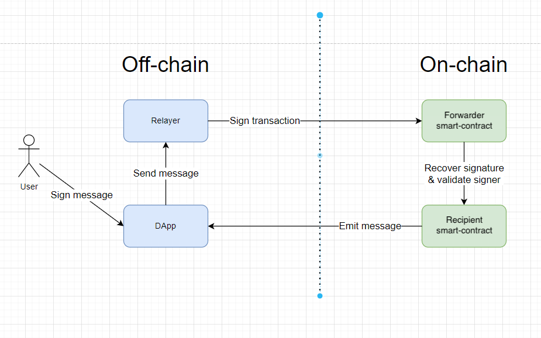

# Meta Transactions

A meta transaction is a regular transaction that contains information about another transaction, which is signed by the original signer. In other words, it is a second-level transaction whose purpose is to execute the initial transaction. It is often used to replace the wallet that pays for the transaction gas.

The idea behind implementing meta transactions is simple: a third party sends transactions on behalf of the user and pays for the gas cost. This third party is called a relayer.

The scheme looks like this:



The process happening in the scheme can be described as follows:

1. The **User** signs a meta transaction, which is essentially a message containing information about the transaction they want to execute. If you haven't read our article on digital signatures, you can check it out [here](https://github.com/fullstack-development/blockhain-wiki-eng/blob/main/concepts/digital-signature-on-ethereum/readme-en.md).

2. The **Relayer** or a web server with a wallet signs the actual transaction and sends it to the blockchain.

3. The **Forwarder** (a contract) verifies the signatures of the meta transaction and forwards the request to the recipient contract.

4. The **Recipient** contract (the contract that the user intended to call without paying for gas) needs to be able to identify the identity of the user who initially requested the transaction.

## Use Cases

**Gasless Transactions**: 
The primary and most well-known use case of meta transactions is to make transactions gasless for the primary user. This doesn't mean that gas is free; it means that someone else pays for the user's gas. This is particularly relevant for services where users don't have a native currency to pay for gas and decentralization is not the primary focus. For example, in games, where the gameplay is of paramount importance, simplifying the onboarding process for new players is crucial, and the game can cover the gas fees on their behalf.

**Transaction Acceleration**: 
For a single account in the network, there is a limit on the total number of transactions in the pending state. Furthermore, transactions are processed sequentially. Meta transactions can help solve this problem. 

**Confidentiality**: 
Meta transactions can be used for privacy purposes. They can mask the initiator of the transaction and hide the recipient of tokens. For example, in the classic "claim rewards" scenario, where a user calls the `claim()` function on a smart contract, passing the recipient address to receive the rewards, there is a link between the `msg.sender` and the `recipient` addresses. To avoid this, the concept of meta transactions can be applied, and the user's address as the initiator can be hidden. Only the `recipient` address will be visible on the blockchain, while the initiator of the transaction will be the platform's address.

**Onboarding**: 
Meta transactions can be used to provide access to the functionality of a decentralized application (DApp) to new users in demo or learning mode. This can be done by facilitating gas payment through the concept of meta transactions.

**ERC20 Gas Payment**: 
It is possible to implement gas payment for users in ERC20 tokens. A service can accept any token as payment for gas and then use its own wallet to invoke the target transactions and pay for the gas in Ether. It is worth noting that meta transactions are often used in conjunction with the **Permit** extension for ERC20 tokens. This token extension allows users to give permission for the transfer of their ERC20 tokens to another address through a digital signature. One advantage of this approach is that users do not need to have the native currency of the network or incur additional costs for signing the `approve()` transactions.

## ERC-2771 Standard

The ERC-2771 standard defines the necessary minimum interface for interaction between the `Recipient` and `Forwarder` contracts. The trusted `Forwarder` contract calls the `Recipient` contract and **must** append the transaction signer's address (20 bytes of data) to the end of `msg.data`.

The detailed and clear explanation of the standard can be found [here](https://eips.ethereum.org/EIPS/eip-2771).

Important! The standard does not regulate the `Forwarder` contract, except for the mechanism of passing the transaction signer's address to the `Recipient` contract.

Important! The `Forwarder` contract can theoretically be of any format. Therefore, the `Recipient` contract should first implement a function to set the address of the trusted `Forwarder` contract.

Important! The `msg.sender` will conceal the address of the original signer, and instead, it will be the address of the `Forwarder` contract.

According to the standard, the address of the original signer will be passed with `msg.data`. Therefore, the `Recipient` contract needs to extract the original signer.

```solidity
function _msgSender() internal view returns (address payable signer) {
    signer = msg.sender;

    if (msg.data.length >= 20 && isTrustedForwarder(signer)) {
        assembly {
            signer := shr(96, calldataload(sub(calldatasize(), 20)))
        }
    }
}
```
## OpenZeppelin Library's Implementation

OpenZeppelin Library offers its own implementation of the `Recipient` contract and the `Forwarder` contract. However, it's important to note that the OpenZeppelin's `Forwarder` contract implementation may not be a complete and optimal solution as it does not implement all the necessary functions for reliable data forwarding. A fully functional and reliable relay system requires more complexity.

## Projects Implementing Meta Transactions

### Gas Station Network

Gas Station Network (GSN) is an open-source service that allows developers to create unique decentralized applications where user transactions can be gasless. This project has been developed with the support of the Ethereum community and audited by OpenZeppelin.

GSN consists of a network of servers called relays that wait for transaction execution. Each relay is paid for every transaction it submits to the blockchain.

The [GSN documentation](https://docs.opengsn.org/) provides a good understanding of how things work. If you want to dive into the code, you can visit the [GitHub repository](https://github.com/opengsn/gsn). You can also take a look at the [architecture](https://docs.opengsn.org/#architecture) of the Gas Station Network.

Writing contracts with GSN support is covered in the [contract documentation](https://docs.opengsn.org/contracts/).

You can explore a simple [demo](https://ctf-react.opengsn.org/) that shows gasless transactions. You can change the flag without paying gas. However, you'll still need the Metamask wallet for this 😉

### More Services

Currently, there are numerous services that support the concept of meta transactions in one way or another:
1. [Biconomy](https://docs.biconomy.io/docs/1.0/build-w-bico/gasless-txn) - The first SDK on the list for working with meta transactions. It offers several ways to implement gasless transactions, including EIP-2771. It's an interesting alternative to GSN.
2. [Gelato](https://docs.gelato.network/developer-services/relay) - Gelato provides its own transaction abstraction using its own SDK. Their approach focuses on providing a user-friendly SDK that abstracts away low-level blockchain details. Currently, they support 17 EVM networks.
3. [Infura](https://docs.infura.io/infura/features/itx-transactions/itx-meta-transactions) - Infura has its own mechanism called Infura Transactions (ITX), which provides a simplified way to send Ethereum transactions. It can be considered as an API. They attempt to apply the meta transaction approach with this API.
4. [Defender by OpenZeppelin](https://docs.openzeppelin.com/defender/relay) - Considering that Defender relays are versatile, they can also be used for other types of meta transactions, such as gasless ERC20 token transfers using EIP-2612 or EIP-3009.

## Links

1. [Gas-free transactions: Meta Transactions explained](https://medium.com/coinmonks/gas-free-transactions-meta-transactions-explained-f829509a462d)
2. [ERC-2771](https://eips.ethereum.org/EIPS/eip-2771)

