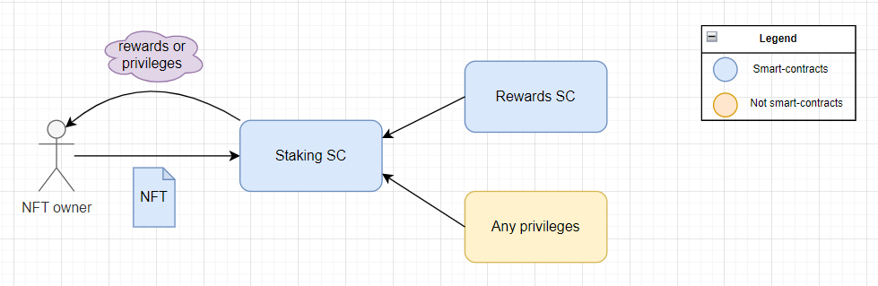

# NFT Staking

**Author:** [Pavel Naydanov](https://github.com/PavelNaydanov) 🕵️‍♂️

_Oops!_ **Staking NFT** is a way to lock assets (NFTs) in smart contracts with the possibility of receiving rewards or other protocol privileges without the need to sell or transfer the NFT to another user.

Many projects are looking for ways to bring benefits to NFT owners and try to stimulate long-term ownership or engagement in the project's ecosystem. For such projects, NFT staking can be a good tool to attract new participants. For NFT holders, it's a way to earn passive income.

## How does NFT staking work?

NFT staking typically requires the implementation of the following smart contracts:
1. **NFT Smart Contract**. The subject of staking.
2. **Staking Smart Contract**. The storage for NFT smart contracts.
3. **Rewards Smart Contract**. This could be a token of any standard: ERC-20, ERC-721, ERC-1155.

To stake an **NFT**, the owner must transfer it to the **Staking** smart contract. After that, the reward will be available according to the rules described in the **Staking** smart contract. For example, for one "staked" **NFT** for a year, the user receives an ERC-20 token equivalent to $100.



The reward or privileges are incentives designed to attract owners to "stake" their NFTs instead of just owning them.

_Important!_ The implementation of specific cases may provide off-chain privileges instead of token rewards. For example, a pass to a blockchain conference. This means that the **Rewards** smart contract may be absent in this scheme. I think you can figure out other variations yourself. 😅

## How is the staking reward calculated?

When the reward can be quantified, e.g., an amount in ERC-20 tokens, a transparent **system** for accruing rewards is needed.

Such a system can depend on several factors:
- **Duration of staking**. The longer the NFT is "staked", the greater the potential reward.
- **Interest rate**. Different platforms may offer different interest accrual forms: fixed rate, variable rates, rates depending on activity or completion of special tasks, etc.
- **Total amount of staking**. The total number of "staked" NFTs can affect the reward size.
- **Rarity or property of the NFT**. Different NFT metrics can affect the reward size. For example, a rare NFT may yield higher rewards than a common one.
- **Network fee**. Gas fees for claiming rewards can negate any passive income.

## Pros and Cons

Like everything in this world, NFT staking has its pros and cons.

|Pros|Cons|
|----|----|
|**Passive income**. Staking NFTs can earn assets.|**Impermanent loss**. The potential to miss immediate profit.|
|**Diversification**. Allows diversifying the asset portfolio of the owner.|**Potential risk of loss**. The NFT physically changes ownership for the staking period. It can only be returned if the **Staking** smart contract allows it.|
|**Increased engagement**. Implies active participation in the project's life, developing a sense of unity and contributing to the project's development.|**Decreased engagement**. An opaque reward system or a long staking period with little profit can lead to the NFT owner losing interest in the project.|
|**Added value**. Staking can provide additional utility or functionality, increasing the value of the NFT and its owner.|**Liquidity shortage**. Staking for a specific period means the NFT cannot be sold in the near future.|

## A Bit of Solidity Code

In this section, I will describe four examples of smart contracts that solve various NFT staking tasks.

_Important!_ These smart contracts are created for educational purposes and have not undergone an audit.

### The Simplest NFT Staking

To implement the simplest NFT staking, one smart contract is needed, let's call it `SimpleStaking.sol`, which will regulate three main processes:
- transferring the NFT to the contract
- retrieving the NFT from the contract
- checking that the contract owns the NFT.

At the moment of transferring the NFT to the contract, it is necessary to record the real owner of the NFT, so that later, only they can return it back. For this purpose, I declared two variables:

```solidity
/// @notice Storage of addresses of owners for staked NFTs
mapping(uint256 tokenId => address stakeholder) private _stakes;

/// @notice Storage of the number of staked NFTs for each address
mapping(address stakeholder => uint256 counter) private _stakedNftBalance;
```

To transfer the NFT to the contract, the owner must call the `stake()` function.
```solidity
function stake(uint256 tokenId) external {
    /// Transfer of NFT from user to the smart contract
    _nft.safeTransferFrom(msg.sender, address(this), tokenId);

    /// Recording data about the owner
    _stakes[tokenId] = msg.sender;
    _stakedNftBalance[msg.sender] += 1;
}
```

_Important!_ Before calling the `stake()` function, the owner needs to call the `approve()` function on the NFT contract and specify the address of the `SimpleStaking.sol` contract.

To retrieve the NFT back, the owner must call the `unstake()` function.

```solidity
function unstake(uint256 tokenId) external checkUnstake(tokenId) {
    /// Transfer of NFT from user to the smart contract
    _nft.safeTransferFrom(address(this), msg.sender, tokenId);

    /// Deleting data about the owner
    delete _stakes[tokenId];
    _stakedNftBalance[msg.sender] -= 1;
}
```

Such logic can enable the implementation of certain privileges for users who have staked their NFTs. To do this, it's necessary to ensure that the NFT is indeed staked by calling the `isStaked()` function.

```solidity
function isStaked(uint256 tokenId) external view returns (address) {
    return _stakes[tokenId];
}
```

The full code of the `SimpleStaking.sol` contract can be found [here](./contracts/src/SimpleStaking.sol).

### Staking with the Ability to Change NFT Ownership

The tasks solved by NFT staking can be much more complex. For example, it would be good to have the ability to **transfer ownership of a staked NFT** without removing it from the smart contract.

This task can be solved in several ways. One option is to implement an additional function `transferOwnership(uint256 tokenId, address owner)` or follow the path of [Uniswap](https://uniswap.org/), [Compound](https://compound.finance/), and other protocols by issuing [lp tokens](https://academy.binance.com/ru/articles/what-are-liquidity-pool-lp-tokens) to confirm ownership rights.

I prefer the second option, so I will implement it in the smart contract named `SimpleTransferableStaking.sol`.

For this, it's necessary to change the implementations of the `stake()` and `unstake()` functions.


```solidity
function stake(uint256 tokenId) external {
    /// Transfer of NFT from user to the smart contract
    _nft.safeTransferFrom(msg.sender, address(this), tokenId);

    /// lp nft is transfering
    _lpNft.mint(msg.sender, tokenId);
}
```

```solidity
function unstake(uint256 tokenId) external checkUnstake(tokenId) {
    /// Transfer lf PNF from owner to the contract
    _lpNft.safeTransferFrom(msg.sender, address(this), tokenId);

    /// Transfer of the NFT from owner to a contract
    _nft.safeTransferFrom(address(this), msg.sender, tokenId);

    /// burns lp nft
    _lpNft.burn(tokenId);
}
```

To check if an NFT is staked, you can call the `ownerOf(tokenId)` function on the lpNft contract (which returns the address of the owner) or `ownerOf(tokenId)` on the nft contract (which returns the address of the `SimpleTransferableStaking.sol` contract).

The full code of the `SimpleTransferableStaking.sol` contract can be found [here](./contracts/src/SimpleTransferableStaking.sol).

### Staking for a Reward

Moving on to something more advanced! 😀 The next example of staking is a smart contract that allows earning a one-time reward for staking an NFT for a certain period in ERC-20 tokens. I'll call such a contract `StakingWithOneTimeReward.sol`.

The fundamental difference is the introduction of the following concepts:
- `rewardToken` - this is the token in which the reward will be paid
- `_stakeDuration` - this is the time for which the NFT needs to be staked
- `_rewardAmountPerNft` - this is the amount of reward for one NFT

We change the `stake()` function. Now it's important to store information about the NFT stake (start time and duration).


```solidity
function stake(uint256 tokenId) external {
    /// Transfer of the NFT from owner to the smart contract
    _nft.safeTransferFrom(msg.sender, address(this), tokenId);

    /// recording infromation about  staking of NFT
    _stakes[tokenId] = StakeInfo({
        owner: msg.sender,
        start: block.timestamp,
        duration: _stakeDuration
    });
}
```

The `unstake()` function calls the `_claimReward()` function to send the reward token.

```solidity
function unstake(uint256 tokenId) external checkUnstake(tokenId) {
    /// Sends the reward to the NFT owner
    _claimReward(msg.sender);

    /// Transfers the NFT from the contract to the owner
    _nft.safeTransferFrom(address(this), msg.sender, tokenId);

    /// Deleting stake data
    delete _stakes[tokenId];
}
```

```solidity
function _claimReward(address account) private {
    uint256 value = _rewardAmountPerNft;

    _rewardToken.safeTransfer(account, value);
}
```

The full code of the `StakingWithOneTimeReward.sol` contract can be found [here](./contracts/src/StakingWithOneTimeReward.sol).

### Staking for Annual Rewards

The final complexity and the last example is the `StakingWithReusableReward.sol` smart contract. It allows the NFT owner to receive rewards for staking their NFT, with the ability to claim these rewards at any time, an unlimited number of times.

I will set a reward amount on the contract that the owner will receive if one NFT is staked for exactly one year, `_annualRewardAmountPerNft;`. From this amount, we will calculate the reward for any period of time.

It's necessary to calculate (update) the amount of the reward due at any interaction of the NFT owner with the smart contract. This will be handled by the `updateReward()` modifier and the private function `_updateReward()`.


```solidity
  modifier updateReward(address stakeholder) {
      _updateReward(stakeholder);

      _;
  }
```

I'm applying the `updateReward()` modifier to the `stake()`, `unstake()` functions, so the earned reward will be calculated first, and then the action of the NFT owner will be executed.

```solidity
function stake(uint256 tokenId) external updateReward(msg.sender) {
    /// Transfer of the NFT from the owner to the contract
    _nft.safeTransferFrom(msg.sender, address(this), tokenId);

    /// Saving information about the NFT stake
    _stakes[tokenId] = msg.sender;

    /// Saving information about the accumulation of rewards
    _stakerRewardInfo[msg.sender].tokenBalance += 1;
    _stakerRewardInfo[msg.sender].lastTimeRewardUpdated = block.timestamp;
}
```

```solidity
function unstake(uint256 tokenId) external updateReward(msg.sender) {
    _unstake(tokenId);
}
```

The calculation of the reward will be very simple. The amount of the reward is calculated for a specific period of time based on the annual reward amount for staking an NFT.

```solidity
function _calculateReward(uint256 nftAmount, uint256 startTime, uint256 endTime)
    private
    view
    returns (uint256 rewardAmount)
{
    /// Number of NFTs * annual reward amount
    uint256 rewardPerYear = (nftAmount * _annualRewardAmountPerNft) / MULTIPLIER;

    /// Amount for a specific period of time
    rewardAmount = (rewardPerYear * (endTime - startTime)) / SECS_PER_YEAR;
}
```

The full code of the `StakingWithReusableReward.sol` contract can be found [here](./contracts/src/StakingWithReusableReward.sol).

## Application Examples

### Zookeeper

[Zookeeper](https://www.zookeeper.finance/) is a gamified decentralized application for providing liquidity to the ecosystem. It uses special ZooNFT for liquidity mining. NFTs can be earned, bought, or won through various mechanisms in the app. Staking these NFTs offers unique reward opportunities.

### MOBOX (MBOX)

[MOBOX](https://www.mobox.io/home/#/) is a metaverse that combines farming and NFT. It allows staking NFTs and earning rewards in its own currency. NFTs within the universe are called MOMOs. It's community-managed. The team strives for maximum transparency, thus publishing the [addresses](https://faqen.mobox.io/mobox-platform/smart-contracts) of its smart contracts.

### Binance Fan Token Platform

[Binance Fan Token Platform](https://www.binance.com/en/fan-token?utm_source=fan-token) represents the fan base of popular football clubs, offering users the opportunity to join their favorite team.

The platform implemented a sub-service, NFT PowerStation for "recharging NFTs," which allows earning rewards in Binance fan tokens. Rewards are distributed from a predefined pool of tokens. They are allocated based on various factors: type of NFT, number of participants, etc. The longer the NFT is "charged," the higher the rewards. Rewards are calculated hourly.

## Conclusion

Staking and NFTs are two important concepts in the web3 world. Often these two technologies are used separately, but NFT staking rethinks the use of NFTs and creates new use cases.

## Links

1. [What Is NFT Staking and How Does It Work?](https://academy.binance.com/en/articles/what-is-nft-staking-and-how-does-it-work)
2. [NFT Staking Explained: Earning Passive Income with NFTs](https://coindcx.com/blog/cryptocurrency/nft-staking-explained/)
3. [Staking rewards](https://solidity-by-example.org/defi/staking-rewards/). This isn't about NFTs, but about earning rewards.
