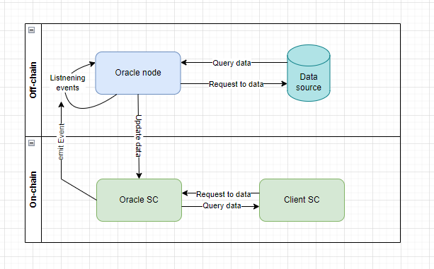

# Oracles

An oracle is a service (or device) that provides a set of data for use in a blockchain. Once the data is posted on the network, it becomes available for use in smart contracts.

Essentially, oracles act as a bridge between two worlds: the decentralized world and the centralized world, the smart contract and the external data provider. The main purpose of oracles is to provide reliable information to smart contracts.

## Why Do Smart Contracts Need Oracles?

The Ethereum blockchain is designed to be fully deterministic. This means that if someone downloads the network's history and replays it, the network will always end up in the same state. Determinism is necessary for blockchain nodes to reach consensus. To achieve consensus, the network is closed and cannot receive information from the outside.

Therefore, oracles need to solve the problem of securely obtaining off-chain data for smart contracts on the blockchain. It is important to note that this should not contradict the fundamental principles of network decentralization.

You can find more information [here](https://ethereum.org/en/developers/docs/oracles/#why-do-smart-contracts-need-oracles).

There are several key areas where oracles are used:
1. **Finance**: Reliable data streams are required for financial products to perform operations on the network.
2. **Insurance**: Oracles are used to verify the occurrence of insurable events.
3. **Supply Chain**: For example, tracking GPS data.
4. **Lending and Stablecoins**: Products in this area require access to collateral valuation information for liquidation decisions.
5. **Predictions**: Oracles are used for off-chain computations. Making predictions requires processing a large amount of information, which can be costly to do on-chain.

For more details on use cases and more, you can read Julien Thevenard's comprehensive article on ["Decentralized Oracles: a comprehensive overview"](https://medium.com/fabric-ventures/decentralised-oracles-a-comprehensive-overview-d3168b9a8841).

## Architecture

To implement the interface between off-chain and on-chain components, an oracle is composed of two main parts: a smart contract and an off-chain service.

The complete oracle implementation template consists of four main components:
1. **Client SC**: The smart contract that requires off-chain data.
2. **Oracle SC**: The smart contract that aggregates off-chain data on the blockchain.
3. **Data Source**: The provider of off-chain data.
4. **Oracle node**: The software solution that acts as a bridge between the Data Source and the on-chain space.



The general process of an oracle can be described by the following algorithm:
1. The original smart contract (**Client SC**) requests a set of off-chain data from the oracle smart contract (**Oracle SC**).
2. The oracle (**Oracle SC**) emits an event off the blockchain to signal the need for data.
3. The oracle node (**Oracle node**), an intermediate solution, constantly listens for events from **Oracle SC** and captures the event indicating the need for data delivery.
4. The oracle node (**Oracle node**) retrieves the data from the data source (**Data Source**) and updates the data on the oracle smart contract (**Oracle SC**).
5. The update of data on the oracle smart contract (**Oracle SC**) automatically triggers a callback to the original smart contract (**Client SC**).

This way, we can obtain off-chain data that becomes part of the network. A dedicated oracle smart contract (**Oracle SC**) is responsible for recording such data. You can see an example implementation of an oracle smart contract (**Oracle SC**) [here](./examples/src/Oracle.sol). An example of using such an oracle in the **Client SC** contract can be found [here](./examples/src/Client.sol).

However, it's not that simple! Think about the danger you see here. What can be a single point of failure? Of course, the **oracle node**. According to the architecture, in the event of an unexpected failure of an **oracle node**, the oracle smart contract (**Oracle SC**) will never be able to receive data, record it on the network, and pass it to the original smart contract (**Client SC**). This means that the data request will remain unanswered. To address this issue, multiple **oracle nodes** can be added to provide backup and redundancy for each other. See the diagram below.


Now, we can add logic to the oracle contract (**Oracle SC**) to handle responses from any trusted oracle node. As they say, the first one to send us data is the winner. But how much more confident do you feel now? How much can we trust the first responding node (**Oracle node**)? What if one of the nodes (**Oracle node**) sends data from an unreliable source, as shown in the diagram below?


This can be addressed by adding additional logic to the oracle contract (**Oracle SC**). We can make the oracle contract (**Oracle SC**) wait for responses from all oracle nodes (**Oracle node**) and, for example, approximate the data by selecting the average or most frequently occurring value.

Important! This approach allows the use of multiple data sources to decentralize the data source itself (**Data Source**).

But we can raise another concern. Let's say we decentralize the data source (**Data source**), but what about the oracle nodes (**oracle nodes**) themselves? How can we ensure 100% trustworthiness? The answer to this question is to create a decentralized network of oracles called Decentralized Oracle Networks (DON). You can learn more about DON [here](https://medium.com/chainlink-community/chainlink-the-decentralized-oracle-70f3bc95007b) using Chainlink as an example.

Important! Oracles themselves can be potentially vulnerable. Only a combination of security measures can minimize the risk of oracle compromise. Several **Data Sources**, a network of **oracle nodes**, isolation of **oracle nodes** from each other, encryption oftransmitted data, and many other techniques and approaches need to be used to reduce the risk of malicious actions against the oracle.

Important! Do not forget about the operational costs associated with the callback functions of the oracle smart contract (**Oracle SC**). Someone will need to cover the operational expenses of the oracle.
## Types of Oracles

There are several ways to categorize oracles. Below are the main approaches:

Oracles can be divided into two groups based on the level of security:
1. **Centralized**: These oracles are often owned by a single company and operate within the scope of a specific product. With this approach, we trust the data provided by the oracle.
2. **Decentralized**: This includes the use of Decentralized Oracle Networks (DON) or networks of decentralized oracles.

Oracles can also be classified based on the method of interaction between off-chain and on-chain components:
1. **Immediate read oracles**: These oracles always possess up-to-date information. The information is updated at a specified interval, and you can instantly read the data from such oracles.
2. **Publish-subscribe oracles**: These oracles are based on the Observer pattern. Essentially, it is a subscription mechanism. You can subscribe to data from the oracle and receive updates when the data is updated in the oracle.
3. **Request-response oracles**: These oracles are based on a request-response system.

Based on the type of data interaction:
1. **Input oracles**: These oracles extract off-chain data and record it on the network for use in smart contracts. For example, such an oracle can provide information about currency prices to the network.
2. **Output oracles**: These oracles enable smart contracts to send commands to autonomous systems on their behalf. These commands can trigger specific actions. For example, informing a banking service about a payment being made.
3. **Cross-chain oracles**: These oracles can read and write information between different blockchains. For example, they can be used for cross-network asset accounting.
4. **Compute-enabled oracles**: These oracles are used for performing computational tasks off-chain due to technical, legal, or financial constraints. For example, generating a random number.

## Oracle Challenges

Can we trust off-chain data? How reliable and accessible are these data? These questions need to be answered before using an existing oracle.

When developing a solution, the main challenge is what to do if an oracle is compromised. In such a case, the smart contract relying on that oracle would also be compromised. This is often referred to as the **Oracle Problem**. It is important to take all available measures to prevent such a situation. Chainlink has gained significant experience in implementing secure and reliable oracles.

You can find examples of some common vulnerabilities [here](https://samczsun.com/so-you-want-to-use-a-price-oracle/).

## Chainlink

As mentioned earlier, relying on a single oracle is a significant risk. Chainlink offers a decentralized network of oracles that form a fantastic ecosystem for obtaining data from outside the blockchain. Today, it is the most widely adopted oracle solution.

Currently, there are numerous price feeds that operate on various blockchain networks (Ethereum, Polygon, BSC, Avalanche, etc.). In addition to price feeds, Chainlink provides a wide range of secure off-chain computation services, such as VRF (Verifiable Random Function) for generating random numbers, Keepers for automation, and various other forms of off-chain computations.

Chainlink oracles can be divided into two groups:
1. Security-reviewed oracles with public identifiers, verified by the Chainlink team.
2. Unreviewed oracles that can be operated by both known and unknown organizations.

Important! To incentivize oracles to behave honestly within the network, a reputation system has been developed. The reputation system provides additional security by holding oracles accountable for their actions. Oracles with low ratings can be removed from the network.

### External Adapters

External adapters are services with which Chainlink interacts through its API using a simple JSON specification.

You can interact with external adapters directly from Solidity code and more.

To interact from Solidity code, you need to use the `ChainlinkClient` contract, which can be found [here](https://github.com/smartcontractkit/chainlink/blob/master/contracts/src/v0.8/ChainlinkClient.sol). Inherit from it and use the `buildChainlinkRequest()` and `sendChainlinkRequest()` functions.

```solidity
function requestPrice(string coin, string market) public returns (bytes32 requestId) {
  Chainlink.Request memory req = buildChainlinkRequest(SPEC_ID, this, this.fulfill.selector);

  req.add("endpoint", "mwa-historic");
  req.add("coin", coin);
  req.add("market", market);
  req.add("copyPath", "data.-1.1");
  req.addInt("times", 100);

  requestId = sendChainlinkRequest(req, oraclePayment);
}
```
You can read more about external adapters [here](https://docs.chain.link/chainlink-nodes/external-adapters/external-adapters).
### Basic Request Model

The basic request model reveals the secret of how to interact with external adapters, which I introduced to you earlier.

According to Chainlink's diagram, the basic request model closely resembles the general architecture of oracles, as I mentioned before. However, it has the unique feature of involving Chainlink's native token, [Link](https://docs.chain.link/resources/link-token-contracts), in the model.


Let's decipher the diagram:

1. **ChainlinkClient Contract**: This contract initiates the transfer of Link tokens according to the [ERC-1363](https://eips.ethereum.org/EIPS/eip-1363) standard (which is about transferAndCall).
2. **Oracle Contract**: It accepts tokens and implements the transferAndCall interface. According to the interface, it invokes its own function, `oracleRequest()`, which emits an `OracleRequest` event outside the blockchain. This event will be monitored by the oracle node.
3. **Oracle Node**: It performs computations or data queries and calls the `fulfillOracleRequest()` function on the Oracle Contract.
4. **Oracle Contract**: It performs a callback and delivers the requested data to the ChainlinkClient contract.

You can read more about this process in the [official Chainlink documentation](https://docs.chain.link/architecture-overview/architecture-request-model?parent=gettingStarted).

**Important!** Starting from Chainlink version 0.7, the Oracle Contract has been replaced by the Operator Contract, which is the recommended approach. In the new version, the ChainlinkClient contract supports requests to both the Oracle and Operator. To achieve this, the functions `sendChainlinkRequest()` and `sendOperatorRequest()` have been implemented.

Advantages of the Operator Contract over the Oracle Contract:
1. The limitation on the response size from the oracle node has been removed. Previously, the response was limited to bytes32.
2. Deployment process: With the Oracle Contract, it was necessary to manually compile and deploy the contract for each node. To address this, the Operator Contract introduced the OperatorFactory contract.
3. Flexible funding system for node addresses: Multiple externally owned accounts (EOAs) can be used on Chainlink nodes. This allows to set multiple strategies for sending back transactions.

### Contract Overview

- **ChainlinkClient**: This is the parent contract that enables smart contracts to receive data from oracles. It is available in the [Chainlink smart contract library](https://github.com/smartcontractkit/chainlink/blob/master/contracts/src/v0.8/ChainlinkClient.sol). Inherit from this contract to safely make data retrieval requests to the Oracle or Operator contracts.

- **LINK Token**: This is a token ([LINK](https://github.com/smartcontractkit/chainlink/blob/master/contracts/src/v0.4/LinkToken.sol)) that is compatible with ERC-677 and implements the `transferAndCall` mechanism. It has three main functions: payment for work to Chainlink nodes, a reward mechanism for oracles, and a security measure where oracles hold Link tokens as collateral to ensure honest behavior.

- **Oracle Contract**: This contract serves as a bridge between the oracle node and the blockchain. It accepts requests from the ChainlinkClient contract and forwards them to the oracle node. After receiving data from the oracle node, it makes a callback and delivers the data to the client's smart contract.

- **Operator Contract**: This is the new version of the Oracle Contract, which can be found [here](https://github.com/smartcontractkit/chainlink/blob/develop/contracts/src/v0.7/AuthorizedReceiver.sol). It is mostly similar to the Oracle Contract but comes with some improvements.

- **AggregatorV3Interface**: This is an interface ([AggregatorV3Interface.sol](https://github.com/smartcontractkit/chainlink/blob/develop/contracts/src/v0.6/interfaces/AggregatorV3Interface.sol)) that allows interaction with a contract that aggregates data. You can find an example of using the Aggregator contract to fetch token prices [here](/concepts/oracles/examples/src/PriceConsumer.sol).

### Off-Chain Reporting (OCR)

OCR is an oracle pattern that enhances the decentralization and scalability of the Chainlink network. It is built upon the basic request model. While the basic request model delivers data from a single Chainlink node to the network, OCR utilizes multiple Chainlink nodes that can communicate directly through a peer-to-peer (P2P) network. This allows for off-chain data aggregation without incurring additional costs.


During the data retrieval process from Chainlink nodes, a lightweight consensus algorithm is launched, which monitors data delivery and verifies the signature of each node. Among all the Chainlink nodes, a leading node is selected to manage the protocol and collect data from the other nodes. Finally, the leader executes a resulting transaction that includes the aggregated data.

You can learn more about OCR [here](https://docs.chain.link/architecture-overview/off-chain-reporting?parent=gettingStarted).

### Chainlink Node

Managing a Chainlink node enables you to become part of the network and helps create hybrid smart contracts by providing access to real-world off-chain data.

You can find a useful [guide](https://docs.chain.link/chainlink-nodes/v1/running-a-chainlink-node) on working with a Chainlink node. It will walk you through deploying a Chainlink node locally, deploying an Operator contract on a test network, making the first request to the locally deployed node, and receiving a response from it.

### Chainlink Products and Services

Thanks to its network capabilities, Chainlink provides a wide range of oracle services for smart contracts:

1. **Price Feeds**: A [data source](https://docs.chain.link/data-feeds/) for financial market prices, including cryptocurrencies, stablecoins, commodities, and indices.
2. **Any API**: Allows smart contracts to integrate with any API or off-chain data source, such as weather data. More details can be found [here](https://docs.chain.link/any-api/introduction).
3. **Randomness**: The [Verifiable Random Function (VRF)](https://docs.chain.link/vrf/v2/introduction) provides a secure way for smart contracts to integrate random number generation that cannot be manipulated by oracles, developers, or end users.
4. **Asset Collateralization**: [Proof of Reserves (PoR)](https://chain.link/education-hub/proof-of-reserves) allows smart contracts to verify information about the current reserve of assets in a network.
5. **Chainlink Functions**: Provides smart contracts with access to computational infrastructure with minimal trust.
6. **Keepers**: Enables the automation of on-chain transactions based on predefined conditions. Learn more [here](https://docs.chain.link/chainlink-automation/introduction/).
7. **Layer 2 Validators**: Provides verification services for layer 2 blockchain scaling solutions. For example, Arbitrum Rollups, which involve off-chain computations by creating transaction batches.
8. **Interoperability**: Facilitates data transmission between different blockchain environments.

## Are There Alternatives to Chainlink?

1. **Witnet**: Witnet is a decentralized oracle network that connects smart contracts with the real world. It operates on its own blockchain and relies on its native token, WIT.
2. **UMA Oracle**: UMA is an optimistic oracle that enables smart contracts to quickly obtain any type of data. It has its own dispute resolution system and data verification mechanism. More details can be found [here](https://docs.uma.xyz/protocol-overview/how-does-umas-oracle-work).
3. **Tellor**: Tellor is a transparent and permissionless [oracle protocol](https://tellor.io/) for your smart contract, making it easy to fetch any necessary data.
4. **Band Protocol**: Band Protocol is a cross-chain oracle platform that connects and aggregates real-world data and APIs for smart contracts. Learn more [here](https://www.bandprotocol.com/).
5. **Provable**: Provable is a [protocol](https://provable.xyz/) that connects blockchain decentralized applications with any external API, using TLSNotary proofs, Trusted Execution Environments (TEE), and secure cryptographic primitives to ensure data authenticity.
6. **Pyth Network**: Pyth Network is an [oracle](https://pyth.network/) that implements a non-classical data delivery model in each network, known as "On-Demand Updates." This allows data updates to be available to any user in the network.
7. **Paralink**: Paralink provides an open-source decentralized oracle platform for smart contracts on Ethereum and other popular blockchains. More information can be found [here](https://paralink.network/).

You can find oracle rankings on [CoinMarketCap](https://coinmarketcap.com/view/oracles/). When choosing an oracle, thoroughly research its features and functionality. However, I recommend paying attention to the **Volume** and **Market Cap** parameters in the oracle rankings. This should help guide you to make the right choice in favor of Chainlink.

## Real-Life Use Cases of Oracles

1. [Compound using Chainlink](https://docs.compound.finance/v2/prices/)
2. [Time-Weighted Average Prices (TWAP) from Uniswap](https://docs.uniswap.org/contracts/v2/concepts/core-concepts/oracles). You can find more details about TWAP in our dedicated [article](https://github.com/fullstack-development/blockhain-wiki-eng/blob/main/concepts/oracles/twap-en.md).
3. [Oracle Module in MakerDAO](https://docs.makerdao.com/smart-contract-modules/oracle-module)

If you still need more examples, you can find over 77+ use cases [here](https://blog.chain.link/smart-contract-use-cases/).

# Links

1. [Oracles](https://ethereum.org/en/developers/docs/oracles/)
2. [Solidity Patterns: Oracle](https://fravoll.github.io/solidity-patterns/oracle.html) - A collection of patterns and best practices for Solidity smart contract programming language.
3. [Implementing a Blockchain Oracle on Ethereum](https://medium.com/@pedrodc/implementing-a-blockchain-oracle-on-ethereum-cedc7e26b49e)
4. [Smart Contract Security Guidelines #3: The Dangers of Price Oracles](https://blog.openzeppelin.com/secure-smart-contract-guidelines-the-dangers-of-price-oracles/) - This article sets requirements for oracles and discusses general principles of popular oracle approaches.
5. [Completing The God Protocols: A Comprehensive Overview of Chainlink in 2021](https://smartcontentpublication.medium.com/completing-the-god-protocols-a-comprehensive-overview-of-chainlink-in-2021-746220a0e45) - This comprehensive article provides an overview of Chainlink's oracles.


