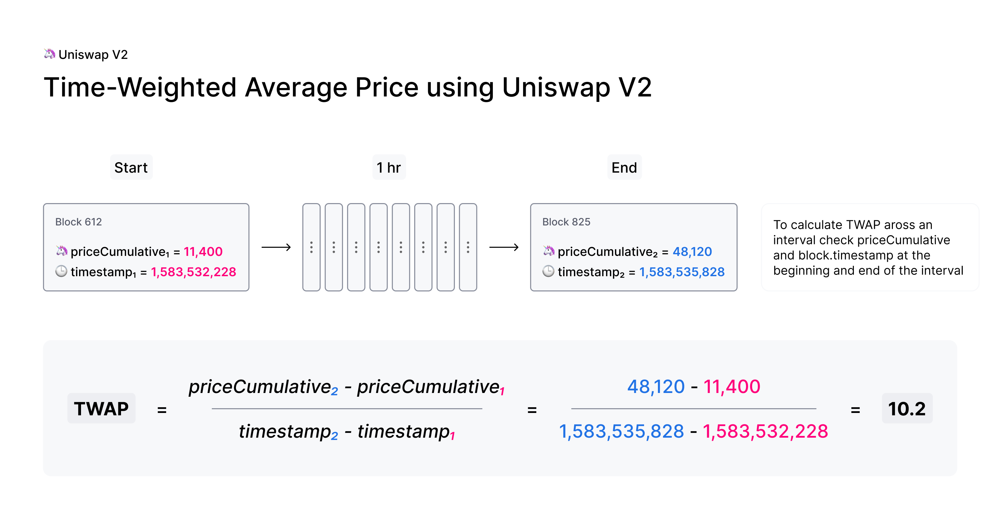

# Uniswap TWAP vs. Oracle

An **oracle** or price oracle is a tool for fetching asset prices. An oracle aggregates **off-chain** data from multiple sources and solves the problem of securely delivering data into a blockchain network. Decentralized exchanges, lending protocols, and other DApps can use such data for various purposes, such as obtaining average asset prices, address balances, or forecasts.

There are numerous oracles implemented with varying degrees of decentralization and security. Currently, oracles are among the most vulnerable tools for exploitation.

Therefore, **Uniswap V2** has proposed an alternative to oracles for smart contract developers in the form of **TWAP** to create secure and decentralized applications.

**TWAP** (Time-Weighted Average Price) is the average price of an asset over a specific period of time. The price is calculated by fixing the price at specific time intervals and computing the simple average without considering the volume of trades (buying or selling the asset).

It is important to note that TWAP refers specifically to the **average weighted price of an asset**. Using the last exchange price or the upcoming exchange price on Uniswap could significantly deviate from the average price at any given moment. Additionally, such prices can be easily manipulated by executing a trade with a large sum that significantly impacts the liquidity pool.

## How Does TWAP Work?

Uniswap calculates and stores the **cumulative price** at the end of each block. The cumulative price represents the average price of an asset for each second throughout the entire history of the Uniswap pair contract. The following diagram illustrates how to calculate the cumulative price:

The cumulative price is calculated using the following formula:
> priceCumulative = lastPriceCumulative + currentPrice * timeElapsed

- **lastPriceCumulative**: Cumulative price from the previous block.
- **currentPrice**: Average price of the asset within the current block.
- **timeElapsed**: Time between the end of the previous block and the start of the current block.

Subsequently, external contracts can use this cumulative price to track the time-weighted average price of an asset over any desired time interval. The following diagram shows how the TWAP is calculated:

It's quite simple. The cumulative price of the final block is subtracted from the cumulative price of the initial block and divided by the difference in timestamps between these blocks.

To see an example of using Uniswap TWAP, you can refer to [this link](https://github.com/Uniswap/v2-periphery/blob/master/contracts/examples/ExampleOracleSimple.sol).

## Links

1. [Uniswap docs](https://docs.uniswap.org/contracts/v2/concepts/core-concepts/oracles)
