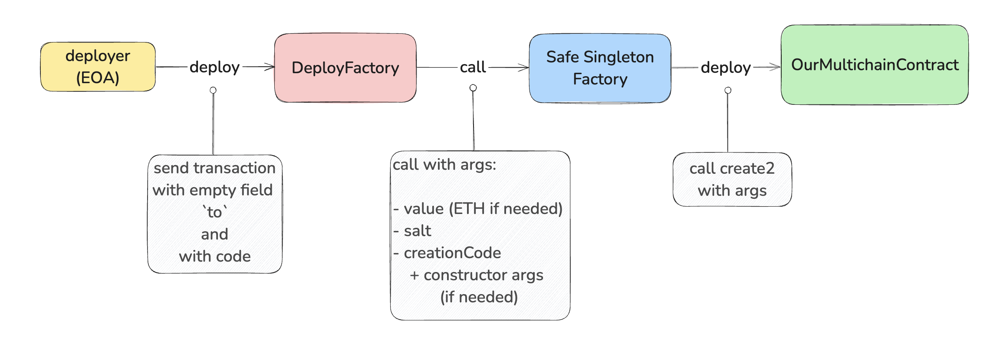

# Safe Singleton Factory

**Author:** [Roman Yarlykov](https://github.com/rlkvrv) 🧐

## Introduction

You may have noticed that smart contracts of some DeFi protocols have the same addresses on different blockchains. We're talking, of course, about EVM-based blockchains. Recently, I faced a similar task and want to share existing solutions.

## What is needed for addresses to be the same?

First, we need to understand what a smart contract address is made of. Depending on the deployment method, there are two sets of input parameters:

1. **Deployer address and `nonce`**. In this case, the address is calculated by the following formula:

    ```js
    keccak256(rlp([sender_address, sender_nonce]))[12:]
    ```

    This method is used in two cases:
    - When a smart contract is created by sending a transaction with an empty `to` field. The contract is deployed using the `RETURN` opcode.
    - When a smart contract is created inside another smart contract using the `new` keyword, or via `assembly` and the `create` function. In both cases, the `CREATE` opcode is used under the hood.

2. **Deployer address, `bytecode`, and `salt`**. This method of address calculation appeared with the `CREATE2` opcode. You can read more about it in another wiki article called "EIP-1014: Skinny CREATE2". In short, this method removes the dependency on the address’s `nonce`, which greatly simplifies the task. But there is a drawback — contracts can be deployed via `CREATE2` only from another smart contract.

    The full address calculation formula in this case:

    ```js
    keccak256(0xff + sender_address + salt + keccak256(initialisation_code))[12:]
    ``` 

Thus, for addresses to be the same across all networks, it’s necessary to use the same `nonce` for the deployer. At first glance, this seems simple: just create a "clean" address and deploy the contract. However, in practice, this method is not the most reliable or convenient.

For example, in one of the blockchains, you might accidentally send the wrong transaction, which changes the `nonce`. Other situations happen too: a transaction can get "stuck," and to bypass it, you have to send an empty transaction with the same `nonce`, which again increments it.

That’s why a more reliable, convenient, and predictable solution was invented — the **Deterministic Deployment Proxy**.

## Deterministic Deployment Proxy

To simplify, the idea is pretty straightforward: you need to create a "clean" address and deploy the same smart contract — a factory — on every network. This contract has a single function: to deploy other smart contracts using `CREATE2`. So, to deploy any contract, you only need the `salt` and its bytecode.

That’s how the [Deterministic Deployment Proxy](https://github.com/Arachnid/deterministic-deployment-proxy) appeared. To minimize code size and gas costs, the contract was written in `Yul`. Here is its full code:

```solidity
object "Proxy" {
    // deployment code
    code {
        let size := datasize("runtime")
        datacopy(0, dataoffset("runtime"), size)
        return(0, size)
    }
    object "runtime" {
        // deployed code
        code {
            calldatacopy(0, 32, sub(calldatasize(), 32))
            let result := create2(callvalue(), 0, sub(calldatasize(), 32), calldataload(0))
            if iszero(result) { revert(0, 0) }
            mstore(0, result)
            return(12, 20)
        }
    }
}
```

How to call this contract and pass data to it will be covered later in practical examples. For now, the important question is: how to find a free address to deploy a smart contract on all existing and future networks? And how to be sure that access to this account will never be lost?

The solution turned out to be quite straightforward. Every transaction in Ethereum is signed by a private key, and using the `ecrecover` function, you can recover the public address of the owner from the signature. The signature is passed as three parameters: `v, r, s`.

But what if we reverse the approach? The algorithm is as follows:

1. **Come up with a signature** — pre-select `v, r, s` so that `ecrecover` reliably returns a fixed address.  
2. **Fund this address** — send a small amount of native tokens to pay for gas. The exact calculation is possible, but it’s better to provide a buffer.  
3. **Create a transaction** — sign it with the pre-selected signature, specify the `Proxy` bytecode, and leave the `to` field empty so the transaction deploys the contract.

This is enough for anyone to deploy the contract on any network. At the same time, no one owns this account, so it cannot be lost. It’s assumed that the `nonce` will always be `0`, meaning the `Proxy` address remains unchanged.

Such a transaction is called `pre-signed`. The signature can be very simple. For example, in [Deterministic Deployment Proxy](https://github.com/Arachnid/deterministic-deployment-proxy), the following is used:

```js
const v = arrayFromNumber(27)
const r = arrayFromHexString('2222222222222222222222222222222222222222222222222222222222222222')
const s = arrayFromHexString('2222222222222222222222222222222222222222222222222222222222222222')
```

The solution is elegant, but there are some nuances.

## Safe Singleton Factory

Deterministic Deployment Proxy is a working solution, but it has several issues:

1. In a new network where the `Proxy` contract hasn’t been deployed yet, someone could send a transaction with the same signature but with invalid data or different bytecode. This would increase the `nonce`, and the situation couldn’t be fixed afterward.  
2. The second issue relates to [EIP-155: Simple replay attack protection](https://github.com/ethereum/EIPs/blob/master/EIPS/eip-155.md). This standard requires adding the `chainId` to the signed transaction data to prevent replaying transactions on another network. This rule is strictly enforced only in some newer networks. However, it breaks the whole concept of using the same signature everywhere.

Because of these problems, the proposal [ERC-2470: Singleton Factory](https://eips.ethereum.org/EIPS/eip-2470) was not adopted. The community decided that accepting a separate ERC just for such a hack was "overkill."

This brings us to [Safe Singleton Factory](https://github.com/safe-global/safe-singleton-factory). To solve the problems described above, the [Safe](https://safe.global/) team uses a single specific account to deploy the factory on all networks.

Initially, this was an internal development, but since anyone can use the contract, the team shared it with the community. Moreover, the factory is already deployed on many blockchains — an unofficial list is available [here](https://contractscan.xyz/contract/0x914d7Fec6aaC8cd542e72Bca78B30650d45643d7).

The Safe factory is based on the concept of [Deterministic Deployment Proxy](https://github.com/Arachnid/deterministic-deployment-proxy), but with one key difference: instead of a shared signature, it uses a signature controlled by Safe. 

If you need to add a new blockchain, the Safe team can deploy the contract themselves. To do this, it’s necessary to:

1. Make sure the network is listed on [Chainlist](https://chainlist.org/). Other networks are not accepted.  
2. Create an `issue` in the [Safe Singleton Factory](https://github.com/safe-global/safe-singleton-factory) repository requesting deployment.  
3. After creating the `issue`, a bot will automatically confirm it and post a comment with the deployer’s address and the amount of native tokens needed for deployment.  
4. Send the specified funds to the deployer’s address and mark the task as completed. The Safe team will deploy the contract.

The process takes about two weeks.

*Note:* Blockchains based on the `OP Stack` include the Safe Singleton Factory as a pre-deployed contract, so manual deployment is not required.

But all this concerns **only deploying the factory on a new network**. If you just need to deploy smart contracts with the same addresses on different networks, you can use the already deployed Safe factory at the address: `0x914d7Fec6aaC8cd542e72Bca78B30650d45643d7`. Its address will be the same on all EVM networks where there are no significant differences in opcode behavior or other features that prevent this (always check for exceptions).


## Example Usage

There are several ways to deploy smart contracts using the Safe Singleton Factory. Let's start with the most illustrative one, although it includes an intermediate deployment that is **not mandatory**, but helps better understand the process.

For this, we will create a "wrapper" smart contract `DeployFactory`; on the diagram, it will look like this:

  
*Deployment process using an additional smart contract DeployFactory*

### Separate smart contract for deployment

Let's write a simple contract `OurMultichainContract` that should have the same address across all networks. Suppose it has an admin role, so the constructor receives an `owner`:

```solidity
contract OurMultichainContract {
    address public owner;

    constructor(address _owner) {
        owner = _owner;
    }
}
```

Now let's create the `DeployFactory` smart contract. This is an intermediate contract that ensures predictability of the result, regardless of who deploys it. First, we'll add several constants:

1. **Address of the Safe Singleton Factory** that does the main work.  
2. **Salt (`salt`)** — can be any `bytes32`. Actually, it doesn't have to be a constant; you can just pass it in the constructor. If there’s an error, you can simply redeploy the contract with the correct salt.  
3. **Address of the `owner`**, which will be added to the bytecode as a constructor argument.  
4. **A variable to store the address of the deployed contract**.

```solidity
contract DeployFactory {
    error AlreadyDeployed();

    /// @notice Адрес Singleton Factory
    address constant SAFE_SINGLETON_FACTORY =
        0x914d7Fec6aaC8cd542e72Bca78B30650d45643d7;

    /// @notice Any fixed salt
    bytes32 constant SALT = keccak256(bytes("any salt"));

    /// @notice Address of the owner, it will be "hardcoded" into the bytecode  
    /// Changing it will result in a different resulting address
    address public immutable owner = 0x32bb35Fc246CB3979c4Df996F18366C6c753c29c;

    /// @notice Address of the deployed smart contract
    address public immutable ourMultichainContract;
}
```

Deployment of `OurMultichainContract` is done in the constructor since `DeployFactory` is used only once:

```solidity
constructor() {
    /// Step 1. Call Singleton Factory directly
    (bool success, bytes memory result) = SAFE_SINGLETON_FACTORY.call(
        abi.encodePacked(
            SALT,
            type(OurMultichainContract).creationCode,
            abi.encode(owner)
        )
    );

    /// Step 2. Check that the contract is not deployed yet
    if (!success) {
        revert AlreadyDeployed();
    }

    /// Step 3. Retrieve the address of the deployed contract
    ourMultichainContract = address(bytes20(result));
}
```

Let's break down the process:

1. **Direct call to Safe Singleton Factory** via `call`. Remember, the factory has no functions.  
2. **Check deployment success** — if the contract is already deployed, throw an error.  
3. **Retrieve the address of the new contract** from the returned data.

The full contract code is available [here](./contracts/DeployFactory.sol). It can be deployed on multiple networks via Remix.

### Using a Foundry script

The first method is good for demonstration and deployment via Remix. Or maybe if you want to explicitly declare all constructor parameters to make life easier for future developers who need to deploy the contract on a new network.

But there’s an easier way — you can call the Safe Singleton Factory directly using Foundry or Hardhat (you can also do this manually, but that’s quite exotic). Let’s start with Foundry.

Clone [this repository](https://github.com/wilsoncusack/safe-singleton-deployer-sol), recommended by the Safe team. It has everything you need, although the script itself isn’t complicated and you can write it from scratch.

In [this script](https://github.com/wilsoncusack/safe-singleton-deployer-sol/blob/main/scripts/ExampleDeploy.s.sol), replace the contract, constructor arguments, and salt, for example like this:

```solidity
// SPDX-License-Identifier: MIT
pragma solidity ^0.8.26;

import {Script, console} from "forge-std/Script.sol";
import {SafeSingletonDeployer} from "../src/SafeSingletonDeployer.sol";
import {OurMultichainContract} from "../src/OurMultichainContract.sol"; /// Replace Mock with the desired contract

contract ExampleDeployScript is Script {
    /// Add the salt
    bytes32 constant SALT = keccak256(bytes("any salt"));
    /// Add constructor arguments
    address public immutable owner = 0x32bb35Fc246CB3979c4Df996F18366C6c753c29c;

    function run() public {
        uint256 deployerPrivateKey = vm.envUint("PRIVATE_KEY");

        address ourMultichainContract = SafeSingletonDeployer.broadcastDeploy({
            deployerPrivateKey: deployerPrivateKey,
            creationCode: type(OurMultichainContract).creationCode,
            args: abi.encode(owner),
            salt: SALT
        });

        console.log("OurMultichainContract: ", ourMultichainContract);
    }
}
```

All that’s left is to add a `.env` file with the private key and run the script:

```bash
forge script ./scripts/ExampleDeploy.s.sol --rpc-url <rpc_url>
```

No magic under the hood: the function `SafeSingletonDeployer.broadcastDeploy` calls `_deploy`, which works almost exactly like our code in Remix:

```solidity
function _deploy(bytes memory creationCode, bytes memory args, bytes32 salt) private returns (address) {
    bytes memory callData = abi.encodePacked(salt, creationCode, args);

    (bool success, bytes memory result) = SAFE_SINGLETON_FACTORY.call(callData);

    if (!success) {
        revert DeployFailed();
    }

    return address(bytes20(result));
}
```

This way, we get rid of the additional intermediate contract [`DeployFactory`](./contracts/DeployFactory.sol).

#### Important warning!

The function `type(T).creationCode` returns the contract bytecode including metadata. Here lies a tricky problem: if you don’t control the compilation settings, **you won’t get identical bytecode** across different environments, since they apply default compiler settings that also differ.

Metadata can even include folder and file names, and the resulting bytecode can be affected by the contract’s formatting!

If you don’t want to bother with compiler settings, there’s a simple way: take the bytecode of an already deployed smart contract and insert it instead of `creationCode`.

For example:

```solidity
contract ExampleDeployScript is Script {
    bytes32 constant SALT = keccak256(bytes("any salt"));
    address public immutable owner = 0x32bb35Fc246CB3979c4Df996F18366C6c753c29c;

    function run() public {
        uint256 deployerPrivateKey = vm.envUint("PRIVATE_KEY");

        address ourMultichainContract = SafeSingletonDeployer.broadcastDeploy({
            deployerPrivateKey: deployerPrivateKey,
            creationCode: bytes(hex"608060405234801561000f575f80fd5b506040516101fa3803806101fa833981810160405281019061003191906100d4565b805f806101000a81548173ffffffffffffffffffffffffffffffffffffffff021916908373ffffffffffffffffffffffffffffffffffffffff160217905550506100ff565b5f80fd5b5f73ffffffffffffffffffffffffffffffffffffffff82169050919050565b5f6100a38261007a565b9050919050565b6100b381610099565b81146100bd575f80fd5b50565b5f815190506100ce816100aa565b92915050565b5f602082840312156100e9576100e8610076565b5b5f6100f6848285016100c0565b91505092915050565b60ef8061010b5f395ff3fe6080604052348015600e575f80fd5b50600436106026575f3560e01c80638da5cb5b14602a575b5f80fd5b60306044565b604051603b919060a2565b60405180910390f35b5f8054906101000a900473ffffffffffffffffffffffffffffffffffffffff1681565b5f73ffffffffffffffffffffffffffffffffffffffff82169050919050565b5f608e826067565b9050919050565b609c816086565b82525050565b5f60208201905060b35f8301846095565b9291505056fea26469706673582212201102563111b55a92cb68c5de9418b7273304d9a266387f0ed1a875db23315d3464736f6c634300081a0033"),
            args: abi.encode(owner),
            salt: SALT
        });

        console.log("OurMultichainContract: ", ourMultichainContract);
    }
}
```

This method guarantees the expected address. The smart contract `OurMultichainContract` has been deployed in the following test networks:  
- [Sepolia](https://sepolia.etherscan.io/address/0x215cd90dec2168876618114A0910E1765b257A6D#code)  
- [Polygon Amoy](https://amoy.polygonscan.com/address/0x215cD90Dec2168876618114A0910E1765b257A6D#code)  
- [Scroll Sepolia](https://sepolia.scrollscan.com/address/0x215cD90Dec2168876618114A0910E1765b257A6D#code)  
- [Base Sepolia](https://sepolia.basescan.org/address/0x215cD90Dec2168876618114A0910E1765b257A6D#code)  


### Using Hardhat and the Safe npm package

The `hardhat-deploy` plugin has a function called [deterministicDeployment](https://github.com/wighawag/hardhat-deploy/blob/42964ca4f74a3f3c57cf694e9713b335f8ba7b2c/README.md#4-deterministicdeployment-ability-to-specify-a-deployment-factory) that allows deployment in a similar way.

Also, you can use the [NPM package](https://www.npmjs.com/package/@safe-global/safe-singleton-factory) from Safe.

## Links

- [EIP-1014: Skinny CREATE2](https://github.com/ethereum/EIPs/blob/master/EIPS/eip-1014.md)
- [ERC-2470: Singleton Factory](https://eips.ethereum.org/EIPS/eip-2470)
- [Github: Deterministic Deployment Proxy](https://github.com/Arachnid/deterministic-deployment-proxy)
- [Github: Safe Singleton Factory](https://github.com/safe-global/safe-singleton-factory)
- [Github: Safe Singleton Deployer](https://github.com/wilsoncusack/safe-singleton-deployer-sol)
