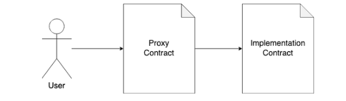
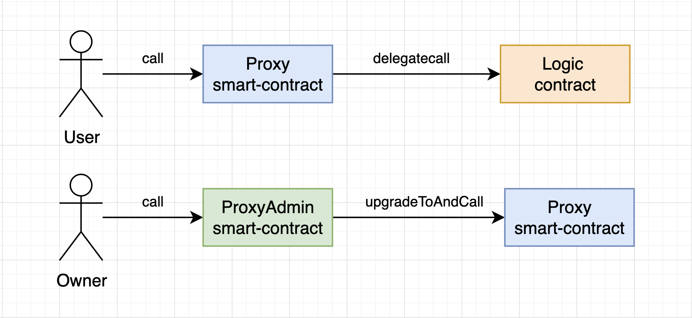
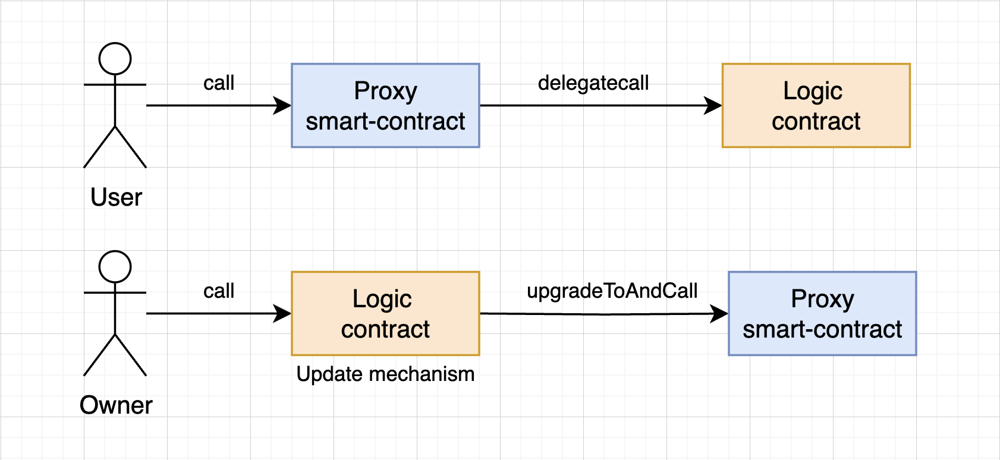
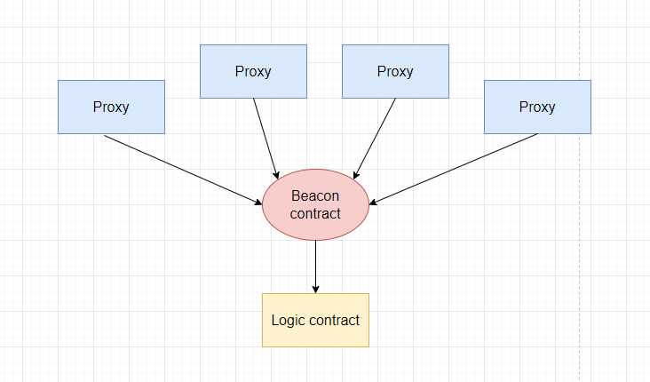

# Proxy pattern

The proxy pattern utilizes data separation to store business logic and state in separate contracts. However, the proxy pattern differs from data separation method 2. It employs a reverse method of data separation, where the storage contract calls the logical contract.

**Important!** From now on, we will refer to the state storage contract as the "proxy".

The interaction between users and the implementation and proxy contracts can be depicted as follows:


## Concept

The proxy pattern works as follows:
1. Users interact with the proxy contract. For example, they invoke a certain method on the contract according to the business logic. User interaction occurs solely with the proxy contract.
2. The proxy contract does not have an implemented function to be called, so the contract invokes the built-in `fallback()` function. Inside this function, the call is redirected to the logical contract.
3. The proxy contract stores the address of the logical contract and delegates all function calls to the logical contract (which contains the business logic) using the `delegatecall()` function.
4. After redirecting the call to the logical contract, the returned data from the logical contract is retrieved and returned to the user or stored on the proxy contract.

To understand the principle of the proxy pattern, it is necessary to understand the workings of the `delegatecall()` function. Essentially, `delegatecall()` is an opcode that allows a contract to call another contract, while the actual code execution occurs in the context of the calling contract. The purpose of using `delegatecall()` in proxy patterns is that the proxy contract can read and write to its storage and execute the logic stored in the logical contract as if it were calling an internal function.

You can find an example contract with a `delegateCall()` invocation [here](https://solidity-by-example.org/delegatecall/).

To make the proxy pattern work, it is necessary to write a custom fallback function in the proxy contract that specifies how the proxy contract should handle function calls it does not support. Inside this function, the logical contract is called using `delegateCall()`.

In the proxy contract, the address of the logic contract can be changed at any time. This allows us to update the contract logic without requiring users to switch to using a new contract.

## Function Selector Conflicts
Proxy patterns are the most popular way to update smart contracts. They eliminate the difficulties associated with contract migration or data separation. However, proxy patterns are more complex to use and can lead to critical errors when used incorrectly, such as **function selector conflicts**.

To ensure that calls from the proxy contract are always delegated, any function call should always land in the `fallback()` function and be delegated to the logic contract. Therefore, the proxy contract should not contain functions with the same name as the logic contract. If this happens, the call will not be delegated. This means that it is always necessary to be aware of function selector conflicts. You can read more about this [here](https://medium.com/nomic-foundation-blog/malicious-backdoors-in-ethereum-proxies-62629adf3357).

## Simple Proxy
All the experiences described above were documented in the [EIP-1967 standard](https://eips.ethereum.org/EIPS/eip-1967). The standard describes a mechanism for secure delegation of calls and several nuances related to data storage.

You can view a simple example contract of a proxy [here](./contracts/SimpleProxy.sol).

The key points to understand are:
1. All calls go through the proxy contract, entering the `fallback()` function and subsequently invoking `delegateCall()`.
2. The proxy contract stores the implementation contract address as a state variable. Since the logic contract's variables will overwrite values in the zero slot, all custom variables in the proxy contract must be stored in random and inaccessible slots for the logic contract. The essence of this problem and its solution are described in [EIP-1967](https://eips.ethereum.org/EIPS/eip-1967).
3. When upgrading the contract to a new implementation, the previous variable storage scheme must be preserved. Otherwise, old data will be overwritten.
4. Since `constructor()` is not part of the bytecode and is only executed once during deployment, an alternative method is needed to set initialization values. It is commonly accepted to use the `initialize()` function. You can read more about this in the [OpenZeppelin documentation](https://docs.openzeppelin.com/upgrades-plugins/1.x/proxies#the-constructor-caveat).

As the proxy contract exists, it requires its own functions. For example, `upgradeTo(address newLogic)` to change the address of the logic contract. But then the proxy needs to decide whether to proxy/delegate the call to the logic contract. What if the logic contract also has a function with the same name, e.g., `upgradeTo(address someAddr)`?

OpenZeppelin was the first to come up with a solution to this problem. They introduced the concept of a proxy administrator. In this case, if the administrator (i.e., **msg.sender == admin**) makes calls to the proxy, the proxy will not delegate the call but instead execute the function within the proxy if it exists, or revert. This gave rise to a proprietary solution called [Transparent Proxy](https://docs.openzeppelin.com/upgrades-plugins/1.x/proxies#transparent-proxies-and-function-clashes).

**Important!** To allow the administrator's address to be a regular user and delegate their calls to the logic contract, OpenZeppelin proposes an additional contract called ProxyAdmin. Calls from this contract to the proxy contract will not be delegated to the logic contract.

# Transparent vs UUPS

`Transparent` and `UUPS` (Universal Upgradeable Proxy Standard) are different implementations of the proxy pattern for contract upgrades by OpenZeppelin. In fact, there is not much difference between these two implementations in the sense that they use the same interface for upgrades and delegation of calls from the proxy to the implementation.

The difference lies in where the upgrade logic is located, either in the proxy contract or the implementation contract.

> In Transparent proxy, the upgrade logic is in the proxy contract. This means that the proxy contract has a method `upgradeTo(address newLogic)`



```js
contract Logic {
    uint256 private _value;

    function store(uint256 value) public { /*..*/ }
    function retrieve() public view returns (uint256) { /*..*/ }
}

contract TransparentProxy {
    function _delegate(address implementation) internal virtual { /*..*/ }
    function getImplementationAddress() public view returns (address) { /*..*/ }

    /// @notice update logic SC's address for proxy 
    upgradeTo(address newlogic) external {
        // update address of SC's logic in a dedicated memory slot of proxy mart contract
    }

    fallback() external { /*..*/ }
}
```

> In UUPS, the upgrade logic is handled by the implementation contract itself. This means that the implementation contract has a method ```upgradeTo(address newLogic)```.
> 

>
>
```js
contract Logic {
    uint256 private _value;

    function store(uint256 value) public { /*..*/ }
    function retrieve() public view returns (uint256) { /*..*/ }

    /// @notice update logic SC's address for proxy 
    upgradeTo(address newlogic) external {
        // update address of SC's logic in a dedicated memory slot of proxy mart contract
    }
}

contract TransparentProxy {
    function _delegate(address implementation) internal virtual { /*..*/ }
    function getImplementationAddress() public view returns (address) { /*..*/ }
    fallback() external { /*..*/ }
}
```

The implementation of Transparent Proxy includes methods for proxy management and an additional ProxyAdmin contract to determine the need for delegation, making the deployment of such contracts more expensive than UUPS. UUPS, on the other hand, is more lightweight and does not require ProxyAdmin.

However, it is important to remember that in the case of UUPS, the logic contract stores additional upgrade code, which means that deploying such a contract is more expensive than deploying just the logic.

Another important point is that TransparentProxy performs a check in each call to determine the caller, whether it is an admin or a regular user. This is done to decide whether to delegate execution or perform its own proxy administration methods. Due to the additional code for this check, all function calls in TransparentProxy are slightly more expensive than in UUPS.

On the other hand, for UUPS, it is necessary to correctly implement methods in the logic contract for proxy management. Otherwise, there is a risk of never being able to upgrade the contract. To minimize risks, it is advisable to use the capabilities of the ready-made OpenZeppelin library, which provides UUPSUpgradeable functionality.

You can refer to an example of using TransparentProxy based on the OpenZeppelin library [here](./contracts/TransparentProxy.sol).

You can also refer to an example of using UUPS based on the OpenZeppelin library [here](./contracts/UUPSProxy.sol).

## Beacon Proxy
The Beacon Proxy pattern is a proxy template where multiple proxy contracts reference a single smart contract. This smart contract provides the address of the logic contract. The contract that provides the implementation address to any proxy is called the "Beacon" contract.



_Important!_ This approach is useful when you have multiple proxies but only one logic contract that undergoes constant updates. With TransparentProxy and UUPS, you would need to update each proxy individually. Beacon Proxy provides an excellent solution for this scenario. With just one call to the Beacon contract, you can update the logic for all proxy contracts simultaneously.

You can find a simple implementation of Beacon Proxy [here](./contracts/BeaconProxy.sol).

## Minimal Clones

This is a standard based on [EIP-1167](https://eips.ethereum.org/EIPS/eip-1167) for deploying minimal proxy contracts known as clones. OpenZeppelin offers its own [library](https://docs.openzeppelin.com/contracts/4.x/api/proxy#Clones) for implementing this standard.

This approach is suitable when you need to create new instances of another contract on a smart contract, and this action is repeated over time. Thanks to low-level calls and code folding in the library bytecode, such cloning is relatively inexpensive. It allows you to initialize the clone instance in the creation transaction.

_Important!_ The library supports functions for creating contracts (`create()`) and `create2()`). It also provides functions for predicting clone addresses.

_Very important!_ This approach is not meant for upgrading the logic of contracts deployed using EIP-1167. It is simply a cost-effective and controlled way to create a clone of an existing contract.

You can see a simple example of using the Clones library [here](./contracts/ClonesProxy.sol). The example demonstrates creating a pair contract inside a factory contract, inspired by the concept of Uniswap.

More usage examples can be found [here](https://github.com/OpenZeppelin/workshops/tree/master/02-contracts-clone).

## OpenZeppelin Plugin

OpenZeppelin provides a plugin for Hardhat that allows you to deploy and manage different proxies. You can find the [documentation](https://docs.openzeppelin.com/upgrades-plugins/1.x/) for the plugin and learn how to use it with Hardhat [here](https://docs.openzeppelin.com/upgrades-plugins/1.x/hardhat-upgrades).

The plugin supports UUPS, Transparent, and Beacon proxy templates. The upgrade options differ depending on the template.
## OpenZeppelin Utils

As we mentioned earlier, upgradeable contracts do not have a `constructor()`. Instead, a commonly used function called `initialize()` is used for the initial data initialization when deploying an upgradeable contract.

OpenZeppelin provides its own utility called [Initializable](https://docs.openzeppelin.com/contracts/4.x/api/proxy#Initializable) for safe initialization management. Essentially, it is a base contract that helps in writing upgradeable contracts and protects the `initialize()` function from being called multiple times.

_Important!_ To avoid leaving the proxy contract uninitialized, the `initialize()` function should be called as early as possible. This is typically done using the **data** argument during proxy deployment.

_Important!_ In addition to not leaving the proxy contract uninitialized, it is also not recommended to leave the possibility to call the `initialize()` function on the logic contract.

To prevent calling the `initialize()` function on the logic contract, the utility provides the `_disableInitializers()` function.

Usage example:
```solidity
/// @custom:oz-upgrades-unsafe-allow constructor
constructor() {
    _disableInitializers();
}
```
You can check an example of the working smart contract [here](./contracts/Initialize.sol).

## Links

1. [Example of delegateCall](https://solidity-by-example.org/delegatecall/)
2. [DelegateCall: Calling Another Contract Function in Solidity](https://medium.com/coinmonks/delegatecall-calling-another-contract-function-in-solidity-b579f804178c)
3. [Delegate call solidity doc](https://docs.soliditylang.org/en/latest/introduction-to-smart-contracts.html#delegatecall-and-libraries)
4. [Malicious backdoors in Ethereum Proxies](https://medium.com/nomic-foundation-blog/malicious-backdoors-in-ethereum-proxies-62629adf3357)
5. [Proxy patterns](https://blog.openzeppelin.com/proxy-patterns/)
6. [Proxy Patterns For Upgradeability Of Solidity Contracts: Transparent vs UUPS Proxies](https://mirror.xyz/0xB38709B8198d147cc9Ff9C133838a044d78B064B/M7oTptQkBGXxox-tk9VJjL66E1V8BUF0GF79MMK4YG0)
7. [Upgrading your Smart Contracts | A Tutorial & Introduction](https://www.youtube.com/watch?v=bdXJmWajZRY&ab_channel=PatrickCollins)
8. [ERC-1822: Universal Upgradeable Proxy Standard (UUPS)](https://eips.ethereum.org/EIPS/eip-1822)
9. [How to create a Beacon Proxy](https://medium.com/coinmonks/how-to-create-a-beacon-proxy-3d55335f7353)
10. [ERC-1167: Minimal Proxy Contract](https://eips.ethereum.org/EIPS/eip-1167)


