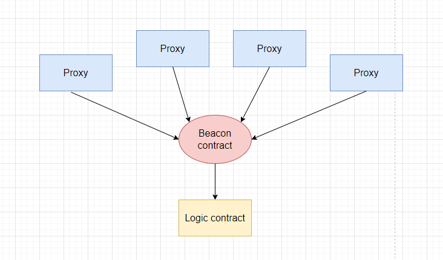

# Proxy Pattern

The proxy pattern utilizes data separation to store business logic and state in separate contracts. However, the proxy pattern differs from method 2 (data separation). It is a reverse method of data separation, where the storage contract invokes the logic contract.

_Important!_ Henceforth, we will refer to the state storage contract as "proxy".

Schematically, user interaction with implementation and proxy contracts looks like this.


## Concept

The proxy pattern operates as follows:
1. The user interacts with the proxy contract, for example, calling a method according to the business logic. The user interaction occurs only with the proxy contract.
2. The proxy contract does not have the function that is called implemented, so it invokes the built-in function ```fallback()```. Inside this function, the call is redirected to the logic contract.
3. The proxy contract stores the address of the logic contract and delegates all function calls to the logic contract (which contains the business logic) using the ```delegatecall()``` function.
4. After redirecting the call to the logic contract, the data returned from the logic contract is extracted and returned to the user or recorded on the proxy contract.

To understand how the proxy pattern works, it is essential to understand the function ```delegatecall()```. Essentially, ```delegatecall()``` is an opcode that allows a contract to call another contract while the actual code execution takes place in the context of the calling contract. ```delegatecall()``` in proxy patterns allows the proxy contract to read and write to its own storage, and execute the logic stored in the logic contract as if it were calling an internal function.

[Smart contract example](https://solidity-by-example.org/delegatecall/) with a ```delegatecall()``` invocation.

It may sound complex, but in reality, there is no magic involved; from the outside, it looks like you take the ABI of the implementation smart contract (logic) and call any function of this implementation on the proxy smart contract.

This can even be done in Remix:


To make the proxy pattern work, it is necessary to write a custom ```fallback()``` function that specifies how the proxy contract should handle function calls that it does not support. Inside, a call to the logic contract via ```delegatecall()``` is made.

At any time in the proxy contract, the address of the logic contract can be changed. This allows us to update the contract logic without forcing users to switch to using a new contract.

## Function Selector Conflicts

Proxy patterns are the most popular way to upgrade smart contracts. They eliminate the difficulties associated with contract migration or data separation. However, proxy patterns are more complex to use and can lead to critical errors if misused, such as **function selector conflicts**.

For the call from the proxy contract to always be delegated, any function call must always hit the ```fallback()``` and be delegated to the logic contract. Therefore, the proxy contract should not contain functions with the same names as the logic contract. If this happens, the call will not be delegated. It is always necessary to be aware of function selector conflicts. More about this can be read [here](https://medium.com/nomic-foundation-blog/malicious-backdoors-in-ethereum-proxies-62629adf3357).

## Simple Proxy

The experience described above was codified in the standard [eip-1967](https://eips.ethereum.org/EIPS/eip-1967). The standard describes a mechanism for safe call delegation and several nuances related to data storage.

A simple example of a proxy contract can be viewed [here](./contracts/SimpleProxy.sol).

Main points to understand:
1. All calls go through the proxy contract, landing in ```fallback()``` followed by a ```delegatecall()```.
2. The proxy contract stores the address of the implementation contract as a state variable. Since the variables of the logic contract will overwrite values in the zero slot, all own variables of the proxy contract must be stored in random and inaccessible slots to the logic contract. The essence of this problem and its solution are described in [eip-1967](https://eips.ethereum.org/EIPS/eip-1967).
3. When upgrading the contract to a new implementation, it is necessary to preserve the previous variable storage scheme. Otherwise, old data will be overwritten.
4. Since the ```constructor()``` is not part of the bytecode and is run only once during deployment, another method of setting initialization values is required. The generally accepted approach is using an ```initialize()``` function. More about this can be read at [openzeppelin](https://docs.openzeppelin.com/upgrades-plugins/1.x/proxies#the-constructor-caveat).

Since the proxy contract exists, it will require its own functions. For instance, ```upgradeTo(address newLogic)``` to change the address of the logic contract. But then the proxy must decide whether to proxy/delegate the call to the logic contract. What if there is a function in the logic contract with the same name, i.e., ```upgradeTo(address someAddr)```?

OpenZeppelin first solved this problem by introducing the concept of a proxy administrator. If the administrator (i.e., **msg.sender == admin**) makes calls to the proxy, the proxy will not delegate the call, but will execute the function in the proxy itself if it exists or will revert. Thus was born their own solution, which is called [Transparent Proxy](https://docs.openzeppelin.com/upgrades-plugins/1.x/proxies#transparent-proxies-and-function-clashes).

_Important!_ In order for the administrator's address to be a regular user and his calls delegated to the logic contract, OpenZeppelin proposes using an additional contract, ProxyAdmin. Calls from the ProxyAdmin contract to the proxy contract will not be delegated to the logic contract.

### Transparent vs UUPS

Transparent and UUPS (Universal Upgradeable Proxy Standard) are different implementations of the proxy pattern for the contract upgrade mechanism from openzeppelin. In fact, there is no significant difference between these two implementations in the sense that they use the same interface for updates and delegate calls from the proxy to the implementation.

The difference lies in where the upgrade logic is located, in the proxy contract or the implementation contract.

> In a Transparent proxy, the upgrade logic is located in the proxy contract. This means that the proxy contract has a method
```upgradeToAndCall(address newLogic, bytes memory data)```


```js
contract Logic {
    uint256 private _value;

    function store(uint256 value) public { /*..*/ }
    function retrieve() public view returns (uint256) { /*..*/ }
}

contract TransparentProxy {
    function _delegate(address implementation) internal virtual { /*..*/ }
    function getImplementationAddress() public view returns (address) { /*..*/ }

    /// @notice Update the logic contract address for the proxy
    upgradeToAndCall(address newlogic, bytes memory data) external {
        // Change the logic address in the special memory slot of the proxy contract
    }

    fallback() external { /*..*/ }
}
```
> In UUPS, the upgrade logic is handled by the logic contract itself. This means that the logic contract has a method called `upgradeToAndCall(address newLogic, bytes memory data)`.

Important! Prior to version 5 in the OpenZeppelin library, there was also a function `upgradeTo()`, but in version 5, only the function `upgradeToAndCall()` remains. The latter allows updating the implementation with or without calling any function.


```js
contract Logic {
    uint256 private _value;

    function store(uint256 value) public { /*..*/ }
    function retrieve() public view returns (uint256) { /*..*/ }

    /// @notice Update the logic contract address for the proxy
    upgradeToAndCall(address newlogic, bytes memory data) external {
        // Change the logic address in the special memory slot of the proxy contract
    }
}

contract TransparentProxy {
    function _delegate(address implementation) internal virtual { /*..*/ }
    function getImplementationAddress() public view returns (address) { /*..*/ }
    fallback() external { /*..*/ }
}
```

# Proxy Pattern

Due to the differences between the two approaches, upgrading through UUPS can be cheaper in terms of gas and simpler than upgrading a Transparent Proxy because it does not require the additional smart contract, ProxyAdmin. On the other hand, ProxyAdmin offers a higher level of security and allows the separation of upgrade logic from the main business logic.

Another important point is that TransparentProxy checks with every call who is making the call — whether it's from the ProxyAdmin smart contract or from a regular user. This is necessary to determine whether to delegate execution or perform the proxy's own administrative methods. Due to the additional code for such checks, all function calls of TransparentProxy are slightly more expensive than those of UUPS.

However, in the case of UUPS, the logic contract stores additional upgrade code, meaning deploying such a contract is more expensive than deploying logic only. Also, in the case of UUPS, it is necessary to properly implement methods for managing the proxy in the logic contract. Otherwise, there is a risk of never being able to update the contract. To minimize risks, it is advisable to use the capabilities of the ready-made solution from the [OpenZeppelin library](https://docs.openzeppelin.com/contracts/4.x/api/proxy#UUPSUpgradeable).

You can find an example of using TransparentProxy based on the openzeppelin library [here](./contracts/TransparentProxy.sol).

You can find an example of using UUPS based on the openzeppelin library [here](./contracts/UUPSProxy.sol).

## Beacon Proxy

This is a proxy pattern in which several proxy contracts refer to one smart contract. This smart contract provides them with the address of the logic contract. The contract that provides the address of the implementation contract for any proxies is called the "Beacon" contract.



_Important!_ This approach is justified when you have multiple proxies, and there is one logic contract that is continuously updated. With TransparentProxy and UUPS, it would be necessary to update each proxy. Beacon proxy is an excellent solution for this scenario. We only need to make one call on the Beacon contract to update the logic for all proxy contracts at once.

You can find a simple implementation of Beacon proxy [here](./contracts/BeaconProxy.sol).

## Minimal Clones

This is a standard based on [eip-1167](https://eips.ethereum.org/EIPS/eip-1167) for deploying minimal proxy contracts, which are called clones. OpenZeppelin offers its own [library](https://docs.openzeppelin.com/contracts/4.x/api/proxy#Clones) for implementing the standard.

This approach should be used when you need to create a new instance of another contract on a smart contract, and this action is repeated over time. Due to low-level calls and code folding into bytecode, such cloning is relatively inexpensive. It allows initializing a clone instance in the creation transaction.

_Important!_ The library supports functions for creating contracts ```create()``` and ```create2()```. It also supports functions for predicting the addresses of clones.

_Very Important!_ This approach does not serve to update the logic of contracts deployed using **eip-1167**. It is simply a cheap, controlled way to create a clone of an existing contract.

A simple example of using the Clones library can be found [here](./contracts/ClonesProxy.sol). The example demonstrates creating a pair contract inside a factory contract, inspired by the Uniswap concept.

You can find more examples of use [here](https://github.com/OpenZeppelin/workshops/tree/master/02-contracts-clone).

## OpenZeppelin Plugin

For Hardhat, OpenZeppelin offers a plugin for scripts that can be used to deploy and manage various proxies. [Link to the documentation](https://docs.openzeppelin.com/upgrades-plugins/1.x/). [Usage with Hardhat](https://docs.openzeppelin.com/upgrades-plugins/1.x/hardhat-upgrades).

The plugin supports UUPS, Transparent, and Beacon proxy templates. The upgrade options vary depending on the template.

## OpenZeppelin Utils

As previously mentioned, upgradeable contracts do not have a `constructor()`. Instead, they use the widely accepted `initialize()` function. This function is employed for the primary initialization of data at the deployment of an upgradeable contract.

OpenZeppelin offers its own utility [Initializable](https://docs.openzeppelin.com/contracts/4.x/api/proxy#Initializable) for safely managing initialization. Essentially, this is a base contract that aids in writing an upgradeable contract with the capability to protect the `initialize()` function from being called more than once.

_Important!_ To prevent leaving the proxy contract uninitialized, the `initialize()` function should be invoked as soon as possible. This is usually done using the **data** argument at the moment of the proxy's deployment.

_Important!_ In addition to not leaving the proxy contract uninitialized, it is also advisable not to leave the possibility to invoke the `initialize()` function on the logic contract.

To prohibit the invocation of the `initialize()` function on the logic contract, the utility implements the function `_disableInitializers();`.

Example:
```solidity
/// @custom:oz-upgrades-unsafe-allow constructor
constructor() {
    _disableInitializers();
}
```

You can check a working example of the code [here](./contracts/Initialize.sol).

## Links

1. [Example of delegateсall](https://solidity-by-example.org/delegatecall/)
2. [DelegateCall: Calling Another Contract Function in Solidity](https://medium.com/coinmonks/delegatecall-calling-another-contract-function-in-solidity-b579f804178c)
3. [Delegate call solidity doc](https://docs.soliditylang.org/en/latest/introduction-to-smart-contracts.html#delegatecall-and-libraries)
4. [Malicious backdoors in Ethereum Proxies](https://medium.com/nomic-foundation-blog/malicious-backdoors-in-ethereum-proxies-62629adf3357)
5. [Proxy patterns](https://blog.openzeppelin.com/proxy-patterns/)
6. [Proxy Patterns For Upgradeability Of Solidity Contracts: Transparent vs UUPS Proxies](https://mirror.xyz/0xB38709B8198d147cc9Ff9C133838a044d78B064B/M7oTptQkBGXxox-tk9VJjL66E1V8BUF0GF79MMK4YG0)
7. [Upgrading your Smart Contracts | A Tutorial & Introduction](https://www.youtube.com/watch?v=bdXJmWajZRY&ab_channel=PatrickCollins)
8. [ERC-1822: Universal Upgradeable Proxy Standard (UUPS)](https://eips.ethereum.org/EIPS/eip-1822)
9. [How to create a Beacon Proxy](https://medium.com/coinmonks/how-to-create-a-beacon-proxy-3d55335f7353)
10. [ERC-1167: Minimal Proxy Contract](https://eips.ethereum.org/EIPS/eip-1167)
11. [Proxies deep dive](https://proxies.yacademy.dev/pages/proxies-list/#the-proxy)
12. [The initializable smart contract design pattern](https://www.rareskills.io/post/initializable-solidity)
13. [The Beacon Proxy Pattern Explained](https://www.rareskills.io/post/beacon-proxy)
