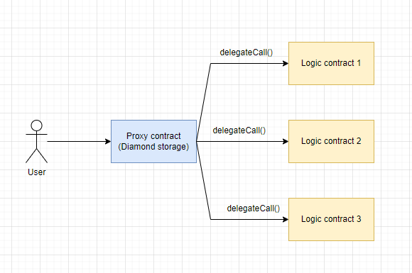

# Diamond pattern

This approach can be considered an improvement of the proxy pattern. The main difference is that a diamond proxy can delegate calls to more than one logical contract.

The diamond upgrade pattern has several advantages compared to regular proxy patterns:

1. It allows updating only a small portion of the contract without modifying the entire code.

2. The diamond pattern enables easy segregation of functions into multiple logical contracts, bypassing the contract size limitation of 24 KB.

3. The diamond pattern provides a modular approach to managing upgrade permissions, allowing for restrictions on updating specific functions within the smart contract.

Externally, the diamond pattern appears as a single smart contract with one address. Internally, it utilizes a set of smart contracts called **facets**.

When a function is called on the diamond contract proxy, the proxy checks if it has a **facet** with that function and invokes it if it exists. All state data is stored on the main diamond contract.

_Important!_ Similar to regular proxies, the diamond pattern has a fallback function inside the contract that delegates the call to the **facets**.

Originally, the EIP-2535 Diamonds were created to address the contract size limitation of 24 KB, but it turned out to be useful for more than just that. It provides a foundation for building larger smart contract systems that can evolve over time.

## Inherited storage

Since many facets use the same storage address space within the diamond contract, it is essential to properly implement the process of creating and updating the contract's **state**.

The simplest strategy is to create a separate Storage contract, following the approach described in [Method 2](../method-2/readme.md) of updating smart contracts. It is crucial to strictly define any state variables only in this contract. This strategy works well and is successfully used in implementing the pattern.

However, with a large number of facets, it can be easy to confuse variables declared in Storage with local variables. Therefore, another approach to organizing storage exists.

## Diamond Storage

For each facet, you can specify different starting storage positions, preventing conflicts between different facets with different state variables in storage locations.

By hashing a unique string, we can obtain a random storage position and store the structure there. The structure can contain all the state variables we need. The unique string can act as a namespace for specific functions.

## App Storage

Another option is to have a single AppStorage structure for all facets together, where all variables are stored. This can be more convenient because you don't have to think about segregating state variables.

# Examples
1. [Simple implementation](https://github.com/mudgen/diamond-1-hardhat)
2. [Gas-optimized](https://github.com/mudgen/diamond-2-hardhat)
3. [Simple loupe functions](https://github.com/mudgen/diamond-3-hardhat)

## Links
1. [Introduction to EIP-2535 Diamonds](https://eip2535diamonds.substack.com/p/introduction-to-the-diamond-standard?s=w)
2. [ERC-2535: Diamonds, Multi-Facet Proxy](https://eips.ethereum.org/EIPS/eip-2535)
3. [Smart Contract Security Audits for EIP-2535 Diamonds Implementations](https://eip2535diamonds.substack.com/p/smart-contract-security-audits-for)
