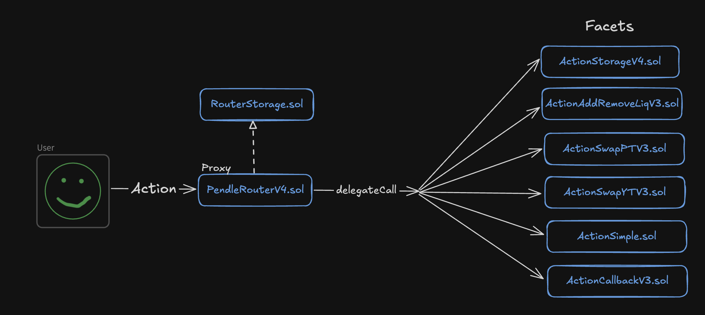
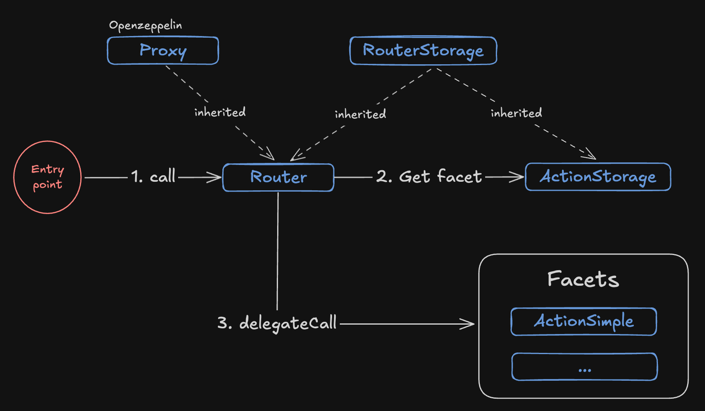

# Pendle Routing. Carving Our Own Path in Protocol Logic Separation

[Pendle](https://www.pendle.finance/) is a yield tokenization protocol with trading elements across several EVM-compatible networks.

Pendle has revised and simplified the **Diamond** pattern in its smart contracts. The protocol's codebase is split into two repositories, but the core functionality is still large, so there's a need to divide the code into several logical groups.

The Pendle protocol structures user interaction with smart contracts similar to Uniswap and other protocols, through a single routing smart contract [(router or PendleRouterV4.sol)](https://github.com/pendle-finance/pendle-core-v2-public/blob/main/contracts/router/PendleRouterV4.sol).



The diagram shows that any user action is delegated to the corresponding logic smart contract (facet). For example, the swap logic is located in the smart contracts [ActionSwapPTV3.sol](https://github.com/pendle-finance/pendle-core-v2-public/blob/main/contracts/router/ActionSwapPTV3.sol) and [ActionSwapYTV3.sol](https://github.com/pendle-finance/pendle-core-v2-public/blob/main/contracts/router/ActionSwapYTV3.sol).

## Simplified Routing Implementation

In this section, we’ll go through building a minimally functional prototype of the call routing system implemented in the Pendle protocol.

### Prototype Concept

For the prototype, we'll implement a **Router** smart contract that will act as a single entry point. This smart contract will be a proxy contract and will be able to delegate calls to the `ActionSimple.sol` contract or another facet. Each facet can implement its own functionality. See the diagram below.



It makes sense that the router smart contract should be able to determine the list of its facets in order to delegate the call to the correct one. To handle this, we'll implement a separate smart contract called `ActionStorage.sol`, which will manage the list of all facets.

### Implementation

**Step 1**

First, we'll implement a simple smart contract [ActionSimple.sol](./contracts/ActionSimple.sol), which will be the target for the call and will contain just one function `execute()` that emits an event.

```solidity
contract ActionSimple {
    event Executed(bool success);

    function execute() external {
        emit Executed(true);
    }
}
```

We'll call the `execute()` function on the `Router.sol` smart contract and expect that the call will be delegated to the `ActionSimple.sol` smart contract.

**Step 2**

We'll implement a simple smart contract [Router.sol](./contracts/Router.sol), which will inherit from [Proxy.sol](https://github.com/OpenZeppelin/openzeppelin-contracts/blob/master/contracts/proxy/Proxy.sol). This is an OpenZeppelin smart contract that allows call delegation.

Inheriting from **Proxy.sol** requires us to implement the `_implementation()` function, where we'll define where to delegate the call for execution.

```solidity
import {Proxy} from "@openzeppelin/contracts/proxy/Proxy.sol";

contract Router is Proxy {
  function _implementation() internal view override returns (address facet) {}
}
```

All calls coming to the `Router.sol` smart contract will hit the [fallback()](https://github.com/OpenZeppelin/openzeppelin-contracts/blob/master/contracts/proxy/Proxy.sol#L58) function, which then calls the `_implementation()` function that we’ve overridden. In the next steps, we’ll write the code for this function.

**Step 3**

In this step, we need to implement a storage contract that will hold information about all the facets. For this, we'll create an abstract smart contract [RouterStorage.sol](./contracts/RouterStorage.sol).

```solidity
abstract contract RouterStorage {
    // Structure for storing the list of facets
    struct CoreStorage {
        // For each function selector, we'll store the address of the smart contract where that function is implemented.
        mapping(bytes4 selector => address facet) selectorToFacet;
    }

    // keccak256(abi.encode("the-same-pendle-routing"))
    bytes32 private constant STORAGE_LOCATION = 0x25e5c12553aca6bac665d66f71e8380eae2ff9ef17f649227265212ec2f7f613;

    // Function that returns the storage slot with the facets
    function _getCoreStorage() internal pure returns (CoreStorage storage $) {
        assembly {
            $.slot := STORAGE_LOCATION
        }
    }
}
```

Let’s make `Router.sol` inherit from `RouterStorage.sol`. Now the router can retrieve the implementation address for each function selector from the call.

```solidity
import {Proxy} from "@openzeppelin/contracts/proxy/Proxy.sol";

import {RouterStorage} from "./RouterStorage.sol";

contract Router is Proxy, RouterStorage {
  function _implementation() internal view override returns (address facet) {
      RouterStorage.CoreStorage storage $ = _getCoreStorage();

      // Retrieving the facet address from the call data
      facet = $.selectorToFacet[msg.sig];
      if (facet == address(0)) {
          revert InvalidSelector();
      }
  }
}
```

**Step 4**

Here it's important to understand that `Router.sol` is a proxy, and physically we’re working with its **storage**. However, we still need to populate the `selectorToFacet` mapping with data about available call selectors and their corresponding implementation addresses.

We'll create a separate smart contract [ActionStorage.sol](./contracts/ActionStorage.sol), which will be responsible for updating the `selectorToFacet` mapping and other management functions.

```solidity
import {RouterStorage} from "./RouterStorage.sol";

struct SelectorsToFacet {
    address facet;
    bytes4[] selectors;
}

contract ActionStorage is RouterStorage {
    function setSelectorToFacets(SelectorsToFacet[] calldata arr) external {
        CoreStorage storage $ = _getCoreStorage();

        for (uint256 i = 0; i < arr.length; i++) {
            SelectorsToFacet memory s = arr[i];

            for (uint256 j = 0; j < s.selectors.length; j++) {
                // Writing data for facets and selectors
                $.selectorToFacet[s.selectors[j]] = s.facet;
            }
        }
    }
}
```

**Step 5**

There’s an important point — `ActionStorage.sol` is a separate, standalone smart contract, so the `Router.sol` contract must already know about `ActionStorage.sol` at the time of deployment and be able to delegate the `setSelectorToFacets()` call to it.

Let’s add the address of `ActionStorage.sol` to the router’s constructor.

```solidity
import {IActionStorage} from "./ActionStorage.sol";

contract Router is Proxy, RouterStorage {
    constructor(address actionStorage) {
        RouterStorage.CoreStorage storage $ = _getCoreStorage();
        // Implement the ability to delegate `setSelectorToFacets()` calls to the address of the `ActionStorage` smart contract.
        $.selectorToFacet[IActionStorage.setSelectorToFacets.selector] = actionStorage;
    }
    ...
}
```

All that’s left to do is restrict open access to the `setSelectorToFacets()` function. To do this, you can use patterns like Ownable or AccessControl.

Full smart contract implementation:
- [Router.sol](./contracts/Router.sol)
- [RouterStorage.sol](./contracts/RouterStorage.sol)
- [ActionStorage.sol](./contracts/ActionStorage.sol)
- [ActionSimple.sol](./contracts/ActionSimple.sol)

## Testing in Remix IDE

As a homework task, reproduce the call to the `execute()` function through the `Router.sol` smart contract.

To do this, open [Remix IDE](https://remix.ethereum.org/), paste the smart contract code, deploy it, and make the call. As a result, you should receive the `Executed()` event.

**Hint 1**

Calldata for calling the `execute()` function is `0x61461954`. You can verify this using Chisel from Foundry by running the command `abi.encodeWithSignature("execute()")`.

**Hint 2**

After all smart contracts are deployed, you need to add the function selector for `execute()` and the address of the `ActionSimple.sol` contract (where the call should be delegated) to the `selectorToFacet` mapping.

To do this, you’ll have to encode the call to `setSelectorToFacets()` for the `Router.sol` contract. You can use Chisel, another smart contract, or your own method to encode it. Then, call the `setSelectorToFacets()` function on the `Router.sol` contract.

## Conclusion

The Pendle protocol has rethought the **Diamond** pattern and simplified it to fit its needs. At the same time, the implemented code still allows not only efficient routing of user calls, but also:
- Bypassing the smart contract size limitation.
- Updating smart contract logic, adding new contracts, and disabling old ones.

Caution – personal opinion! At times, I’ve personally hesitated to implement the **Diamond** pattern in my own projects. I kept weighing whether it was really worth increasing the complexity for the sake of potential scalability. That’s why using a simplified approach like Pendle’s might be a good compromise between complexity and scalability.

## Links

1. [Pendle documentation](https://docs.pendle.finance/Home)
2. [Pendle github](https://github.com/pendle-finance/pendle-core-v2-public/tree/main)


