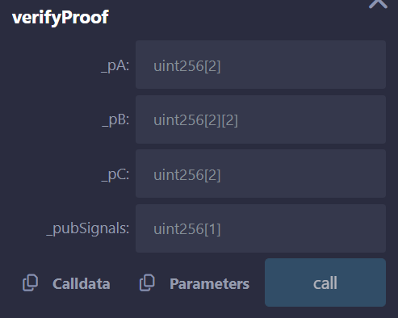

# Circom and SnarkJS: A Practical Guide to Creating Circuits and Zero-Knowledge Proofs

**Author:** [Aleksey Kutsenko](https://github.com/bimkon144) 👨‍💻

## Introduction

Circom is a specialized programming language designed for developing arithmetic circuits that underpin zero-knowledge proofs (ZKPs). These proofs allow one party (the prover) to demonstrate to another party (the verifier) that a certain statement is true without revealing any additional information about the statement itself. You can explore the concept of zero-knowledge proofs in our wiki—there’s a great article there.

Arithmetic circuits are a set of mathematical expressions that describe how inputs, intermediate computations, and final results are connected. These expressions are transformed into polynomial equations, which are solved using a limited set of numbers, where all operations (addition, multiplication, etc.) follow specific rules. Such circuits are widely used in cryptographic protocols to verify data correctness and ensure its security.

This language allows you to describe complex mathematical relationships as a set of constraints, which can then be used to generate proofs and verify statements without revealing the original data. A good example of Circom in use is [Tornado Cash](https://github.com/tornadocash/tornado-core/blob/master/circuits/withdraw.circom).

Circom provides developers with convenient tools for creating these circuits in a simple and readable way.

## Installing Circom and snarkjs

Before diving in, you’ll need to install Circom and snarkjs. You can read how to do that [here](https://docs.circom.io/getting-started/installation/#installing-dependencies).

After installation, make sure they’re properly installed by running: `circom --version` and `snarkjs --version`.

## Core Concepts of Circom

At each step, we’ll expand the circuit diagrams as we go, so by the end, you’ll have a complete and clear picture of how Circom works in tandem with snarkjs.
Let’s start by writing a circuit.


To write even a minimally understandable circuit for learning purposes, we first need to understand the key concepts.

### Signals: What Are They and What Types Are There?

In Circom, signals act as variables but with stricter usage rules. They define values that participate in constraints and computations inside the circuit. Depending on their purpose, signals fall into three types:

Input signals (input)
These signals represent data that is passed into the circuit from the outside. They are provided by the user before the circuit is executed.

Output signals (output)
These are the results of computations that the circuit returns as the final output.

Intermediate signals
These signals are used inside the circuit for intermediate calculations. They are not visible outside the circuit and are used solely for internal operations.

Unlike variables, which can change their values during program execution, signals are constant within the circuit, and their values are fixed when the proof is generated.

```circom
pragma circom 2.1.6;       // Specifies the circom version

template Addition {
    signal input a;        // Private input signal: first number
    signal input b;        // Private input signal: second number
    signal output result;  // Output signal
}

```

Signals `a` and `b`
These are input signals representing two numbers provided by the user before executing the circuit. They are used in computations. These signals are private, and their values are known only to the user generating the proof.

Signal `result`
An output signal representing the result of the future computation. This value is returned after the circuit runs. It always exists only as a public signal.

### Constraints

In Circom, constraints are the fundamental building blocks for describing computations in a zero-knowledge proof (ZKP) system. Constraints express mathematical relationships between variables that must be satisfied for the proof to be considered valid.

Simply put, they are a set of equations that define valid values for variables. In the context of Circom, these equations are then converted into Rank-1 Constraint Systems (R1CS), which are used to create ZKPs.

Constraints are necessary to ensure that the proof exactly matches the declared conditions without revealing the actual computation or input data.

Now we can use constraints to make sure that the result of the input signals `a` and `b` is their sum.

```circom
pragma circom 2.1.6;       // Specifies the circom version

template Addition {
    signal input a;        // Input signal: first number
    signal input b;        // Input signal: second number
    signal output result;  // Output signal: sum result

    // Constraint: result equals the sum of the input signals
    result <== a + b;
}
```

The constraint `result <== a + b` defines the relationship between the inputs and the output. It says that `result` must be equal to the sum of `a` and `b`.

### Templates

Templates are the core mechanism for modular circuit construction in Circom. They allow you to create reusable pieces of logic, simplifying the development of complex circuits and improving readability and maintainability. Every circuit is initially built through a template.

How do templates work?

1. Creating a template

    A template in Circom is a kind of "blueprint". Templates are defined using the `template` keyword and include: signals, constraints, and computation logic.

2. Initializing a template

    To use a template, you create an instance of it called a **component**. Components can be parameterized to make them more flexible. You can connect them to the main circuit's signals or to other components.

3. Template parameters

    Templates can accept parameters during creation, which makes them suitable for different scenarios. For example, you can pass in a fixed value or logic that depends on a parameter.

Example: Addition Template

Let's create a file called `Main.circom`:

```solidity
pragma circom 2.2.1;       // Specifies the circom version

template Addition {
    signal input a;        // Input signal
    signal input b;        // Input signal
    signal output sum;     // Output signal

    sum <== a + b;
}

template Main {
    // Initialize the Addition template as a component named adder
    component adder = Addition();

    signal input x;        // First number
    signal input y;        // Second number
    signal output result;  // Sum result

    // Connect signals
    adder.a <== x;         // Pass x into the template
    adder.b <== y;         // Pass y into the template
    result <== adder.sum;  // Connect the result
}

// Define the main component
component main = Main();
```

Code Breakdown

1. Addition Template

    Input signals `a` and `b`: values to be added.
    Output signal `sum`: the result of the addition.
    Constraint: `sum <== a + b`, which defines the mathematical rule for the inputs and output.

2. Initialization in the Main Circuit

    The main circuit `Main` uses the `Addition` template as a component called `adder`.
    The main circuit’s signals `x`, `y`, and `result` are connected to the component’s signals:
    `x` is passed as input `a`.
    `y` is passed as input `b`.
    The component’s output `sum` is connected to the signal `result`.

3. Reusability and Scalability

    This approach makes it easy to reuse the `Addition` template in other circuits. For example, it can be initialized multiple times to build more complex computations.

## Proof Generation and Verification

### Circuit Compilation

To compile the circuit, use the command `circom Main.circom --r1cs --wasm`


The result of the compilation is shown in the image below:


You will get the following files:

`Main.r1cs` — the constraints file (R1CS) that describes the arithmetic circuit.

`Main_js` — a folder containing JavaScript and WebAssembly files:

- `Main.wasm` — a WebAssembly file that contains the circuit description. It's used for internal computations during the witness generation process.
- `generate_witness.js` — a JavaScript script for generating the witness file (`witness.wtns`) based on input data.
- `witness_calculator.js` — the core module responsible for computing the witness.

The compilation result includes the following information:

`template instances`: 2 — the number of created template instances.

`non-linear constraints`: 0 — the number of non-linear constraints (multiplication of variables).

`linear constraints`: 1 — the number of linear constraints (addition, subtraction, multiplication by a constant).

`public inputs`: 0 — the number of public inputs (visible to the verifier).

`private inputs`: 2 — the number of private inputs (hidden values — `a` and `b` signals).

`public outputs`: 1 — the number of public outputs (visible in the proof — `result`).

`wires`: 4 — "wires" represent internal values passed between components in the circuit.
There are 4 wires in the circuit because:

`x` — input signal (creates a wire).

`y` — input signal (creates a wire).

`sum` — result of the addition inside the `adder` component (creates a wire).

`result` — output signal of the `Main` circuit, taking the value from `sum` (creates a wire).

`labels`: 7 — "labels" are identifiers for all signals and constraints in the circuit.

`x` — label for input signal `x`.

`y` — label for input signal `y`.

`result` — label for output signal `result`.

`a` — label for signal `a` inside the `Addition` template.

`b` — label for signal `b` inside the `Addition` template.

`sum` — label for signal `sum` inside the `Addition` template.

Constraint: the equation `sum <== a + b`.

### Power of Tau Ceremony

To generate a proof in a ZK-SNARKs system, several steps are required. One of them is running the **Power of Tau Ceremony**.

What is the Power of Tau Ceremony?

It’s a procedure used in ZK-SNARKs protocols to establish a trusted setup. The Power of Tau Ceremony produces a `.ptau` file with precomputed values, which:

- Speeds up the generation of proving and verifying keys.
- Allows reuse of a single file across different circuits.

You can read more about this in the [snarkjs documentation](https://github.com/iden3/snarkjs?tab=readme-ov-file#1-start-a-new-powers-of-tau-ceremony). There are already [pre-generated files](https://github.com/iden3/snarkjs?tab=readme-ov-file#7-prepare-phase-2) available — you just need to choose the right one.

How to choose the appropriate `.ptau` file?

1. Count the number of constraints in your circuit using the command: `snarkjs r1cs info Main.r1cs`
2. Select a `.ptau` file that matches your circuit's size. For example, for circuits with up to 256 constraints, you can use `powersOfTau28_hez_final_08.ptau`, which you can download with:
   `wget https://storage.googleapis.com/zkevm/ptau/powersOfTau28_hez_final_08.ptau -O hez8.ptau`

### Generating Proving and Verifying Keys


1. Creating the proving and verifying keys, which are necessary for running the circuit in a ZK-SNARKs protocol. These keys enable generating and verifying proofs of correct computation.
To do this, run the following command:
`snarkjs groth16 setup Main.r1cs hez8.ptau Main_0000.zkey`
This command uses the circuit description (`Main.r1cs`) and the pre-generated Power of Tau file (`hez8.ptau`) to generate an intermediate proving key `Main_0000.zkey`. This key is required for the next setup and proof generation steps.

2. Adding your personal contribution to the circuit setup process to finalize the proving key.
This is done with the command:
`snarkjs zkey contribute Main_0000.zkey Main_final.zkey --name="My Contribution" -v`

   Why is this important?

   - Enhanced Security: At this stage, you add randomness by entering a custom secret phrase. This ensures that even if previous setup stages were compromised, your circuit remains secure.
   - Final Proving Key Generation: After the contribution is added, the file `Main_final.zkey` is created. This file will be used to generate valid proofs.
   - Process Transparency: Your contribution is recorded, and thanks to the `-v` option, you get detailed output showing that your input was successfully included.

   This step finalizes the proving key setup, making it unique and protected from external tampering.

3. The process of exporting the verification key is done using the command: `snarkjs zkey export verificationkey Main_final.zkey verification_key.json`

   Why is this important?

   - Creating the Verification Key: This command extracts the necessary data for proof verification from the final proving key (`Main_final.zkey`). The resulting file `verification_key.json` contains the public information used to verify the validity of the proof.

   - Simplified Verification: The verification key is a compact set of data that contains no private information. It can be safely shared with any verifier to perform the check.

   - Required for Proof Verification: This key is essential during the verification phase to confirm that the provided data meets the circuit’s constraints.

   The command reads data from the `Main_final.zkey` (final proving key) file and extracts the public parameters into a JSON file `verification_key.json`. This file will be used in later steps to verify the proof.

### Generating the Proof


The process of creating a proof in ZK-SNARKs consists of several steps:

1. Generating the Witness File
The witness file is created based on the input data and the circuit.
To do this, create an `input.json` file in the root directory and specify the two input signals of the circuit:

    ```
        {
            "x": 3,
            "y": 4
        }
    ```

Use the following command: `node Main_js/generate_witness.js Main_js/Main.wasm input.json witness.wtns`

- Circuit: `Main.wasm` — the WebAssembly file that describes the circuit logic.
- Input Data: `input.json` — the file containing the values for the public and private signals.
- Output: `witness.wtns` — the file containing the computed values of all signals in the circuit.

2. Generating the Proof

To generate the proof, use the witness file (`witness.wtns`) and the final proving key (`Main_final.zkey`). Run the following command: `snarkjs groth16 prove Main_final.zkey witness.wtns proof.json public.json`

What happens in this step:

- Input files:
    `Main_final.zkey` — the final proving key generated during the setup stage.
    `witness.wtns` — the witness file generated in the previous step.

- Output files:
    `proof.json` — the actual proof file that confirms the circuit’s computations were executed correctly.
    `public.json` — a file containing the circuit's public input and output values. This is required for proof verification.

### Verifying the Proof


The final step is to verify the proof for authenticity.

What you need for verification:

`verification_key.json` — the verification key file generated earlier.
`public.json` — the file with public data linking the circuit’s inputs and output value.
`proof.json` — the proof file created in the previous step.

Run the verification with the command: `snarkjs groth16 verify verification_key.json public.json proof.json`

If the proof is valid, you’ll see a success message: `[INFO]  snarkJS: OK!`

Congratulations, you’ve successfully created and verified a proof — without revealing the private circuit inputs `a` and `b`.

### Creating an On-Chain Verifier

Creating an on-chain verifier allows you to move the verification of proofs and public signals to the blockchain, where it can be performed in a decentralized way. This is especially useful for smart contracts that require proof of correct computation without revealing private data.
For example, it can be used in financial apps, decentralized voting, private transactions, auctions, or any scenario where transparency and privacy are critical.

#### Generating the Solidity Verifier

Assuming you’ve already generated `Main_final.zkey`.
To create an on-chain verifier, you need to generate a smart contract that performs proof verification. This is done with the command: `snarkjs zkey export solidityverifier Main_final.zkey Verifier.sol`

Why this is needed:

A smart contract (`Verifier.sol`) is generated containing a `verifyProof` function. This function allows the verification of proofs using public inputs.
The contract encapsulates all the necessary circuit parameters for performing verification on-chain.

Output file:
`Verifier.sol` — a smart contract ready to compile and deploy.

If you want to test that the verifier contract works, you can use [remix](https://remix.ethereum.org/) to deploy it.

After deployment, you can use the `verifyProof` function to verify your proofs.

The function call in Remix looks like this:



The `proof.json` file you generated contains the proof data. This data needs to be converted into a format suitable for calling the `verifyProof` function in the smart contract.

Let’s break down its contents:

Structure of `proof.json`:

`pi_a`: An array of three elements, representing the first part of the proof (a).

`pi_b`: A two-dimensional array representing the second part of the proof (b). In Solidity, this is passed as an array of two arrays.

`pi_c`: An array of three elements, representing the third part of the proof (c).

`protocol`: Indicates the protocol used (e.g., `groth16`).

`curve`: Indicates the elliptic curve used (e.g., `bn128`).

By using the command `snarkjs generatecall`, you get the prepared data to insert into the `verifyProof` function via Remix. If everything is set up correctly, hitting the `call` button will trigger the verification, and if successful, it returns `true`, which means the proof has been verified.

Congratulations, you've successfully created and verified a proof **on-chain** without revealing the private inputs `a` and `b`.

### Circom Capabilities

- Compact circuit description:
  Circom makes it easy to describe even complex arithmetic circuits using a simple syntax. With constructs like templates and signals, developers can focus on the logic and security of the circuit rather than dealing with low-level technical details. This leads to faster development and easier testing of zero-knowledge proofs.

- Modularity and code reuse:
  Circom implements the concept of templates, which allows the creation of reusable components. This makes code more organized and easier to maintain and scale, especially in large or complex projects. Modularity is especially useful when you need to repeat the same computation across multiple circuits or integrate with other cryptographic protocols.

- Integration with ZKP tools:
  Once a circuit is written in Circom, it can be compiled and used with proof generation and verification tools like `snarkjs`. This makes it easy to create zk-SNARKs proofs for use in various cryptographic protocols, including blockchain and other decentralized systems.

### Circom Use Cases

Circom is actively used to solve problems related to privacy, security, and computation verification in cryptographic applications. Here are some key areas where it's applied:

**Private Transactions**
One of the most popular use cases for Circom is enabling private transactions in blockchain systems. For example, in the Zcash project, Circom is used to ensure transaction privacy by hiding information such as amounts and sender/receiver addresses, while still providing zero-knowledge proofs of transaction validity.

**Computation Verification**
Circom is used to create proofs that confirm the correctness of complex computations, without revealing the underlying data. This is crucial for applications where you need to prove that a computation was done correctly — for example, on remote servers or in cloud computing — without exposing the actual inputs.

**Identification and Authorization**
Circom is also applied in building circuits that verify user identity or authorize actions without revealing personal information. Examples include using zk-ranges or zk-hashes for secure authentication and user rights confirmation, without disclosing sensitive details.

**Decentralized Applications (DApps)**
In blockchain smart contracts, Circom is used to build privacy-preserving functions — such as protecting user data or anonymizing transactions. Additionally, Circom helps optimize computations inside smart contracts, improving both security and efficiency.

## Conclusion

In this overview, we explored how to use Circom to create arithmetic circuits and how to work with zero-knowledge proofs using SnarkJS. Circom simplifies the process of describing complex computations, while SnarkJS makes it easy to generate and verify proofs.

These tools are widely used in blockchain projects, private transactions, decentralized applications, and other cryptographic solutions. By learning the basics, you’re now ready to start building your own circuits and integrating them into real-world projects.

For further learning, we recommend checking out the official documentation and experimenting with applying this knowledge in practice.

## Links:

- [Docs: Circom](https://docs.circom.io/)
- [GitHub: Circom](https://github.com/iden3/circom)
- [GitHub: SnarkJS](https://github.com/iden3/snarkjs)
- [Article: Programming ZKPs: From Zero to Hero](https://zkintro.com/articles/programming-zkps-from-zero-to-hero#building-our-circuit)
- [Paper: ZK-SNARKs Explained](https://eprint.iacr.org/2013/879.pdf)
- [Guide:  ZK-SNARKs and circom guide](https://dev.to/thebojda/zero-knowledge-proofs-using-snarkjs-and-circom-536n)

