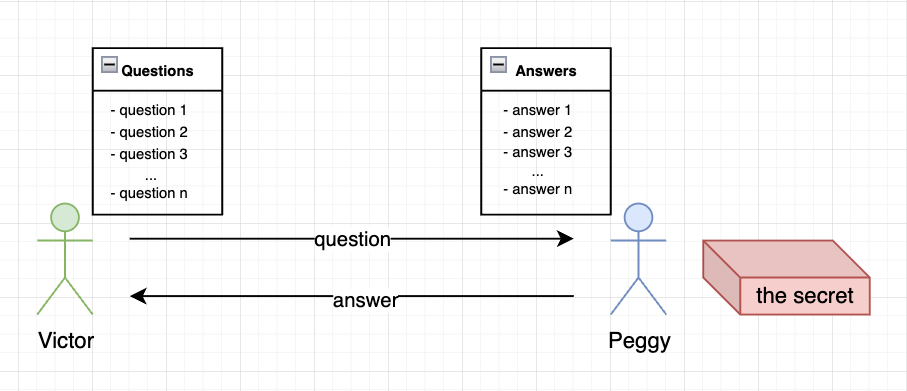
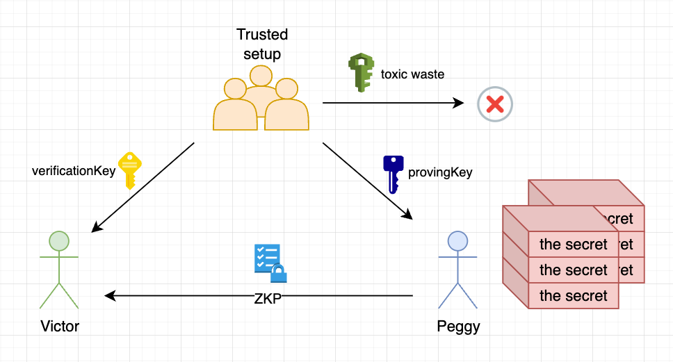

# Zero-knowledge proof

**Author:** [Roman Yarlykov](https://github.com/rlkvrv) 🧐

The central element of ZK-Rollups is zero-knowledge proofs (ZKP) - an advanced cryptographic tool that allows data verification without disclosing specific details of its content.

The development of cryptography in the context of data authentication can be conditionally divided into three stages:

1. **Symmetric encryption protocols**: These protocols provide secure information transmission where both parties must know the private key for decryption.

2. **Asymmetric encryption protocols**: Here, one side uses a pair of public and private keys to create a signature, while the other side can verify this signature using only the public key.

3. **Zero-knowledge proofs**: This is the latest stage in the evolution of cryptography, allowing public verification of data authenticity without the need to disclose or use private keys.

ZKP is a cryptographic protocol that allows one party (the verifier) to be convinced of the truth of a statement by the other party (the prover), without gaining any specific information about that statement.

For illustration, let's consider two characters: Victor (verifier) and Peggy (prover). Suppose Peggy has a secret she does not want to reveal to Victor. Victor, however, is interested not in the secret itself, but in confirming its existence. This is where ZKP becomes a key tool: Peggy can prove the existence of the secret without disclosing its essence to Victor.

For successful application, ZKP must fulfill three main properties:

1. **Completeness**: Peggy (prover) can convince Victor (verifier) of the existence of the secret with a high, though not absolute, probability.

2. **Soundness**: Peggy cannot convince Victor of the existence of the secret if it actually does not exist (with a probability of error approaching 0).

3. **Zero-knowledgeness**: In the process of proving, Victor does not gain any information about the secret itself.

Since the truthfulness of the proof is not absolute, Victor and Peggy need to conduct several iterations for Victor to be highly confident of the existence of the secret with Peggy. This makes ZKP an interactive or communicative protocol.

In addition to describing the interaction of Victor and Peggy, there are other vivid examples to understand ZKP. One such example is detailed in [this article](https://blog.cryptographyengineering.com/2014/11/27/zero-knowledge-proofs-illustrated-primer/). Spoiler - it talks about how to make a secure deal with Google.

Another interesting example is the "Ali Baba cave". This example demonstrates the concept of probabilistic proof. Imagine a cave with a tunnel going in a circle and having one entrance. In the middle of the tunnel, there is a door, which is invisible from the start of the tunnel and opens only with magic words. Peggy knows these words and wants to prove it to Victor without revealing the words themselves. This example illustrates how ZKP allows proving the existence of knowledge or abilities without disclosing the most secret information.

The process of zero-knowledge proof in the Ali Baba cave scenario goes as follows:

1. **Starting position**: Victor is at point A, at the beginning of the cave.
2. **Peggy's movement**: Peggy enters the cave and goes to the door either through passage C or through passage D, hiding her choice from Victor.
3. **Victor's choice**: After Peggy disappears from sight, Victor moves to point B and yells to Peggy, indicating which passage he wants her to come out from.
4. **Peggy's exit**: Peggy comes out of the passage Victor indicated. If necessary, she uses magic words to open the door.
5. **Repetition**: These steps are repeated several times for Victor to be convinced of Peggy's knowledge.

Such a sequence of actions demonstrates that Peggy knows the magic words but does not reveal them to Victor, while Victor becomes convinced of Peggy's knowledge without gaining additional information.

In the case where Peggy does not know the secret, her chances of deceiving Victor decrease with multiple repetitions of the proof stages. If Peggy does not know the magic words, she can only emerge from the passage she initially entered. The probability that Peggy randomly chooses the correct passage is 50% in each round. Therefore, the probability that she can deceive Victor in one round is also 50%.

However, with each subsequent round, this probability decreases exponentially. For example, the probability of deception in two rounds is only 25% (1/4), and in n rounds - 1/2^n. If Victor conducts a sufficient number of rounds (for example, n=10-20), and each time Peggy successfully completes the task, he can be confident that she really knows the magic words that open the door between points C and D.

Zero-knowledge proofs can be applied in various fields, including:

1. **Confidentiality**:

    - Confirming possession of a certain amount in a bank without disclosing the exact size of the funds.
    - Confirming legal age without revealing the exact date of birth or personal information.
    - Confirming tax payment without disclosing the exact amount.

2. **Scalability**:

    - Storing confirmation of information possession instead of full data.
    - Increasing network throughput TPS (Transactions per second) in blockchain due to ZKP efficiency.

3. **Anonymous Authentication**:

    - User authentication without disclosing their identification data.

4. **Distributed Computing**:
    - Using ZKP to ensure security and confidentiality in distributed systems.

For blockchain, the issue is the interactivity of traditional ZKPs, as the verifiers are multiple participants, such as network validators. The solution was found in transforming interactive protocols into non-interactive ones using the [Fiat-Shamir heuristic](https://en.wikipedia.org/wiki/Fiat–Shamir_heuristic). This led to the creation of more complex algorithms, such as zk-SNARKs, with the following properties:

-   **S**uccinctly: The proof has a small, fixed size, regardless of the volume of computations.
-   **N**on-interactively: Once computed, the proof can be used to convince any number of verifiers without direct interaction with the proving side.
-   **Ar**gumented knowledge: The authenticity of the statement is confirmed with high probability, and creating a fake proof is impossible. The prover knows the necessary data (witness) to confirm the statement.
-   In Zero-**K**nowledge: The proof does not reveal additional knowledge; it is indistinguishable from a random data set.

For those interested in the mathematical foundations of zk-SNARKs, I recommend Vitalik Buterin's article [Quadratic Arithmetic Programs: from Zero to Hero](https://medium.com/@VitalikButerin/quadratic-arithmetic-programs-from-zero-to-hero).

An important aspect of zk-SNARKs is the introduction of a third party responsible for the setup process (trusted setup). During this process, two keys are created: "provingKey" for the proving side and "verificationKey" for the verifying side. These keys are used respectively to create proofs and to verify them. An important part of the setup process is generating a special number, known as "toxic waste," which must be destroyed after the setup to ensure the system's security.

One of the key properties of zk-SNARKs — succinctness — allows computing proofs for any volume of data in a fixed time (approximately O(1)). This property gives zk-SNARKs special value, making it an excellent solution for blockchain scalability, ensuring high levels of security and speed.

One of the main problems with zk-SNARKs is the need for a trusted setup. However, alternative protocols such as zk-STARKs (Succinct Transparent ARguments of Knowledge) are being developed. The main difference of zk-STARKs is the absence of a need for a trusted setup, ensuring its "transparency".

However, as with everything, there are trade-offs. In the case of zk-STARKs, this is increased computational complexity and larger proof size compared to zk-SNARKs. For illustration, here is a table showing a comparison of these two protocols, taken [from here](https://github.com/matter-labs/awesome-zero-knowledge-proofs#comparison-of-the-most-popular-zkp-systems):

|                                       |                                   SNARKs |                             STARKs |
| ------------------------------------: | ---------------------------------------: | ---------------------------------: |
|        Algorithmic complexity: prover |                           O(N \* log(N)) |                O(N \* poly-log(N)) |
|      Algorithmic complexity: verifier |                                    ~O(1) |                     O(poly-log(N)) |
| Communication complexity (proof size) |                                    ~O(1) |                     O(poly-log(N)) |
|              - size estimate for 1 TX |                Tx: 200 bytes, Key: 50 MB |                          Tx: 45 kB |
|         - size estimate for 10.000 TX |               Tx: 200 bytes, Key: 500 GB |                         Tx: 135 kb |
|    Ethereum/EVM verification gas cost |                          ~600k (Groth16) |         ~2.5M (estimate, no impl.) |
|               Trusted setup required? |                           YES :unamused: |                         NO :smile: |
|                   Post-quantum secure |                            NO :unamused: |                        YES :smile: |
|                    Crypto assumptions | DLP + secure bilinear pairing :unamused: | Collision resistant hashes :smile: |

Vitalik Buterin elaborated on the topic of zk-STARKs in a series of three articles: [part 1](https://vitalik.ca/general/2017/11/09/starks_part_1.html), [part 2](https://vitalik.ca/general/2017/11/22/starks_part_2.html), and [part 3](https://vitalik.ca/general/2018/07/21/starks_part_3.html).

Despite the novelty of zk-STARKs, zk-SNARKs remain a time-tested protocol and the most popular choice for blockchains using ZKP. This protocol continues to evolve: originally there was Groth16, followed by PLONK.

Thus, ZKP represents a significant advance in the field of cryptography, allowing more efficient and secure data handling. The technology is promising, so it is indeed worth understanding in this topic.

## Links

-   [Repo: Awesome zero knowledge proofs](https://github.com/ventali/awesome-zk)
-   [Site: zkp.science](https://zkp.science/)
-   [Site: learn.0xparc.org](https://learn.0xparc.org/)
