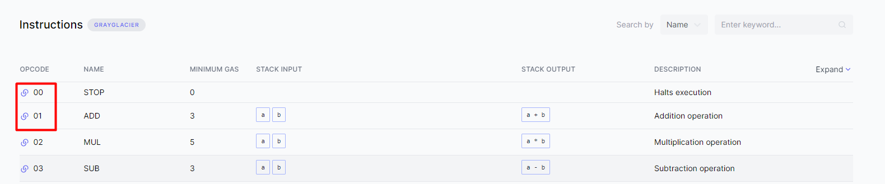
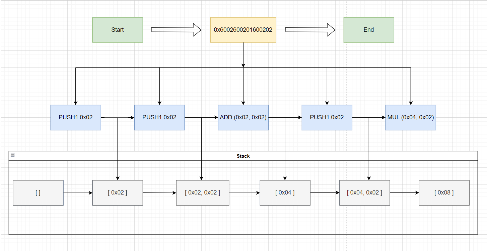
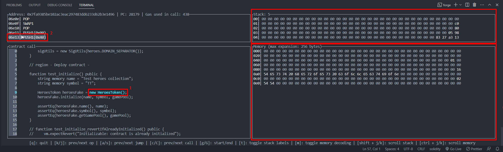

# EVM Opcodes

Before diving into the study of opcodes, let's recall what the EVM is and how it works. Take a look at our [intro](https://github.com/fullstack-development/blockchain-wiki-en/blob/main/ethereum-virtual-machine/intro/readme.md) for a deeper understanding of virtual machine architecture and its specifics. If you already have sufficient knowledge about the EVM, you can skip reading the intro.

## What are Opcodes?

> Opcodes are low-level machine instructions, also known as operation codes.

The EVM cannot directly interpret code written in high-level programming languages. Any code must be compiled into machine-readable code or bytecode, which consists of instructions in binary format.

Essentially, the process of transforming Solidity code looks like this:
> Solidity → Bytecode → Opcodes

**Why is it important to understand opcodes?** The answer is simple: to minimize gas consumption and reduce costs for end users. Additionally, understanding opcodes allows you to apply best practices from other programming languages. For example, notable aspects of EVM development include working with memory and data arrays.

_Important!_ As of writing this article, there are just over [140 unique opcodes](https://www.evm.codes/?fork=grayGlacier). With these opcodes, the EVM is considered Turing complete.

## Categories of Opcodes

To facilitate comprehension, we can categorize opcodes into the following groups:
1. Stack manipulation: `POP`, `PUSH`, `DUP`, `SWAP`.
2. Arithmetic operations: `ADD`, `SUB`, `MUL`, `SMUL`, `DIV`, `SDIV`, `MOD`, `EXP`, `ADDMOD`, `MULMOD`, `SMOD`.
3. Comparison and bitwise shifts: `GT`, `LT`, `EQ`, `SLT`, `SGT`, `ISZERO`, `AND`, `OR`, `XOR`, `NOT`, `BYTE`, `SHL`, `SHR`, `SAR`.
4. Environmental operations: `CALLER`, `CALLVALUE`, `NUMBER`, `CODESIZE`, `CALLDATACOPY`, `CALLDATALOAD`, `CALLDATASIZE`, `EXTCODECOPY`.
5. Memory-related operations: `MLOAD`, `MSTORE`, `MSTORE8`, `MSIZE`.
6. Storage-related operations: `SLOAD`, `SSTORE`.
7. Program counter operations: `JUMP`, `JUMPI`, `PC`, `JUMPDEST`.
8. Process termination: `STOP`, `RETURN`, `REVERT`, `INVALID`, `SELFDESTRUCT`.
9. Block information: `BLOCKHASH`, `TIMESTAMP`, `COINBASE`, `NUMBER`, `DIFFICULTY`, `GASLIMIT`, `CHAINID`, `SELFBALANCE`, `BASEFEE`.

Explaining the functionality of each opcode is beyond the scope of this article. To understand what each opcode does, consult the documentation [here](https://www.evm.codes/). Each opcode is represented by 1 byte of memory. For example:

`0x00` - STOP
`0x01` - ADD



_Important!_ One byte is represented by two hexadecimal characters.

## Gas

As mentioned earlier, gas helps maintain the security of the Ethereum network. Each computation requires a fee for executing an operation on the network. This prevents malicious actors from performing nefarious actions, such as creating spam transactions.

Each opcode has a base gas cost, which can be seen in the **MINIMUM GAS** column.


Opcodes that require more computational resources have a higher gas cost. For example, a simple `POP` instruction requires 5 gas, while a slightly more complex `JUMP` requires 8 gas units.

| Opcode | Name    | Gas |
| ------ | ------- | --- |
| 04     | DIV     | 5   |
| 50     | POP     | 2   |
| 56     | JUMP    | 8   |
| 38     | CODESIZE| 2   |

However, there are more complex opcodes that incur dynamic gas costs. For example, the `SHA3` operation requires 30 gas units plus 6 gas units for each encoded word.

| Opcode | Name   | Static gas | Dynamic gas |
| ------ | ------ | ---------- | ----------- |
| 04     | SHA3   | 30         | 6 per word  |
| 31     | BALANCE| 0          | 100 if accessed warm, 2600 otherwise |
| 51     | MLOAD  | 3          | Calculated based on [memory_expansion_cost](https://www.evm.codes/about#memoryexpansion) |

_Important!_ In addition to the gas table for opcodes, each transaction requires 21,000 gas. The most expensive opcode, `CREATE`, responsible for contract creation, requires an additional 32,000 gas beyond the transaction cost.

During the execution of instructions that reduce the overall state size of the blockchain, additional gas can be returned as a reward. For example, executing the `SELFDESTRUCT` opcode refunds 24,000 gas. However, refunds are only made after the completion of contract execution, so contracts cannot reimburse themselves. Additionally, the refund cannot exceed half of the gas cost used for the current contract call.

## Example of Bytecode Analysis

Let's try to analyze the following bytecode example: `0x6002600201600202`. According to the opcode table, we can take the first byte (`60`) and look it up in the [opcodes table](https://www.evm.codes/?fork=grayGlacier). It corresponds to the `PUSH1` opcode. By following this process, we can decode the entire bytecode.



1. The first byte (`60`) corresponds to the `PUSH1` opcode, which pushes the value of the next byte (`02`) into the stack.
2. The next byte (`60`) indicates another `PUSH1` opcode, pushing the value `02` into the stack. The stack now contains two values: `[0x02, 0x02]`, as shown in the diagram.
3. The subsequent byte (`01`) represents the `ADD` opcode, which takes the last two values from the stack, adds them together, and stores the result `[0x04]` back into the stack.
4. The next byte indicates a repetition of steps 1 or 2. The value `0x02` is pushed into the stack, resulting in `[0x04, 0x02]` in the stack.
5. The final byte (`02`) corresponds to the `MUL` opcode, which multiplies the two values in the stack together. The resulting value `[0x08]` is stored in the stack.

As you can see, this bytecode performed simple mathematical operations similar to the equation `2 + 2 * 2`. It resulted in the value `8`. You can try to create bytecode that evaluates to `2 + 2 * 2 = 6` by yourself. You can use the [playground](https://www.evm.codes/playground) to verify your solution. The answer can be found at the bottom of this document.

## Examples of Non-Intuitive Design Patterns Impacting Gas Consumption

Here, we'll explore a few examples that demonstrate the importance of understanding EVM opcodes:

1. **MUL vs EXP**: Multiplication (`MUL`) costs 5 gas, while exponentiation (`EXP`) costs 10 static gas units plus 50 times the number of bytes in the exponent. It's evident that, whenever possible, multiplication is more cost-effective than exponentiation.
2. **SLOAD vs MLOAD**: `MLOAD` always costs 3 static gas units plus dynamic gas for memory expansion, while `SLOAD` costs 2100 gas for initial access and 100 gas for subsequent access. In most cases, loading data from memory (`MLOAD`) is cheaper than from storage (`SLOAD`). This leads to optimizations where it's more efficient to copy an array from storage to memory and work with it there.
3. **Object-Oriented Techniques**: Creating new entities, such as contracts or any accounts, is interpreted as the `CREATE` opcode, which incurs a cost of at least 32,000 gas, making it the most expensive opcode in the EVM. Therefore, it's better to minimize the number of used smart contracts. This differs from typical object-oriented programming, where code separation into classes is encouraged for code reuse.
4. **SSTORE**: Writing to storage is one of the most expensive operations. Therefore, in NFT implementations, metadata is not stored in the contract's storage; instead, the storage only holds a reference to that metadata.

You can learn more about these examples in this [article](https://medium.com/@danielyamagata/understand-evm-opcodes-write-better-smart-contracts-e64f017b619).

## Reverse Engineering

Often, contracts are verified and their code can be viewed on [Etherscan](https://etherscan.io/). However, if a contract is not verified, you can try to analyze its bytecode.

The Ethereum official documentation offers an excellent [article](https://ethereum.org/en/developers/tutorials/reverse-engineering-a-contract/) on this topic by Ori Pomerantz. I must warn you that reverse engineering unverified contracts is a non-trivial task, so consider your current needs and decide how deep you want to delve into this subject.

## Practice

Theory is good, but reinforcing it with practice is always more productive. Franco Victorio, one of the developers of Hardhat, created a collection of [EVM puzzles](https://github.com/fvictorio/evm-puzzles). These puzzles provide a set of opcodes, and you need to input a value that allows the instructions to execute successfully. Try to solve these puzzles on your own before looking for the answers. I managed to solve 7 of them.

You can solve the puzzles conveniently in the [playground](https://www.evm.codes/playground).

## Good News

In Foundry, there is a built-in [debugger](https://book.getfoundry.sh/forge/debugger?highlight=opcode#debugger-layout) that supports opcode visualization.



Area 1 highlights the test function's executable code.
Area 2 indicates the corresponding opcode execution.
The unlabeled sections on the right side represent the display areas for the stack and memory.

## Answer to the Puzzle: 2 + 2 * 2

```6002600202600201```

[01] -> 6002 -> `PUSH1 02`
[02] -> 6002 -> `PUSH1 02`
[04] -> 02 -> `MUL`
[05] -> 6002 -> `PUSH1 02`
[07] -> 01 -> `ADD`

## Links
1. [An Ethereum Virtual Machine Opcodes Interactive Reference](https://www.evm.codes/)
2. [The Ethereum Virtual Machine — How does it work?](https://medium.com/mycrypto/the-ethereum-virtual-machine-how-does-it-work-9abac2b7c9e)
3. [Demystifying EVM Opcodes](https://www.youtube.com/watch?v=_tcyI_lNvo0&ab_channel=ETHGlobal)
