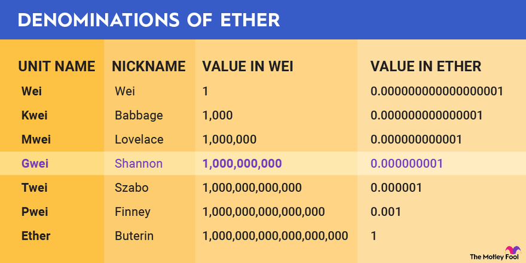
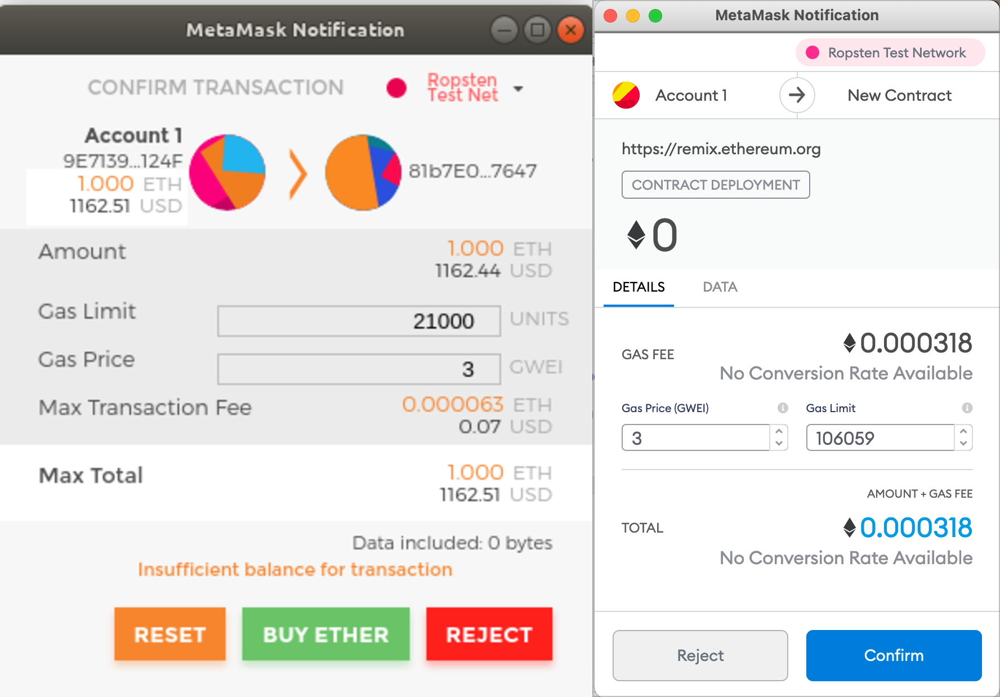
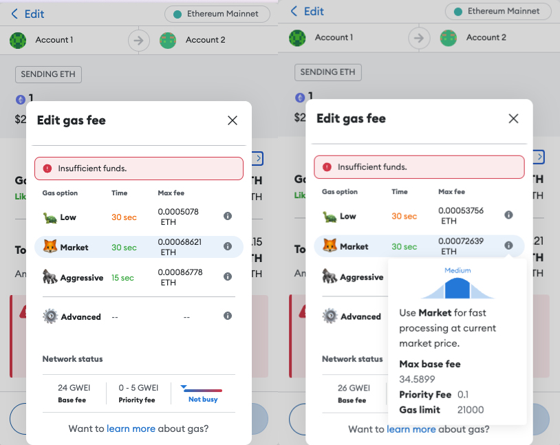
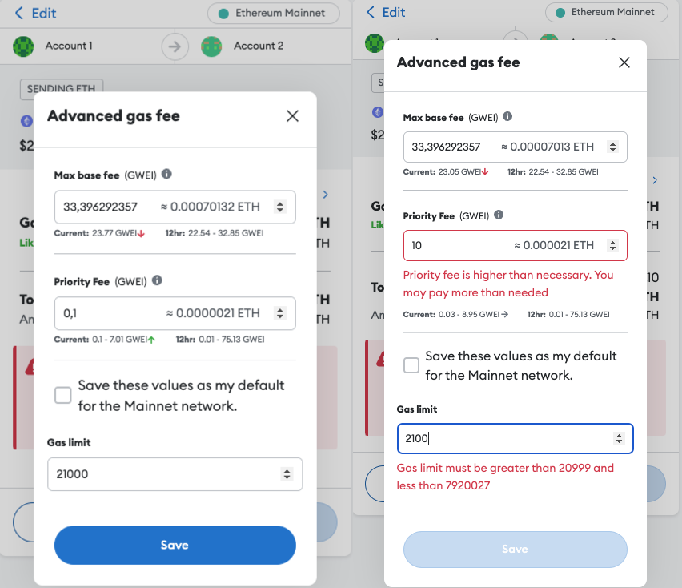
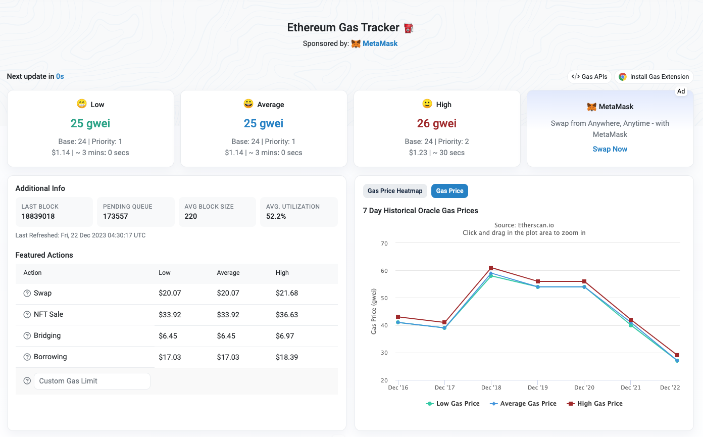
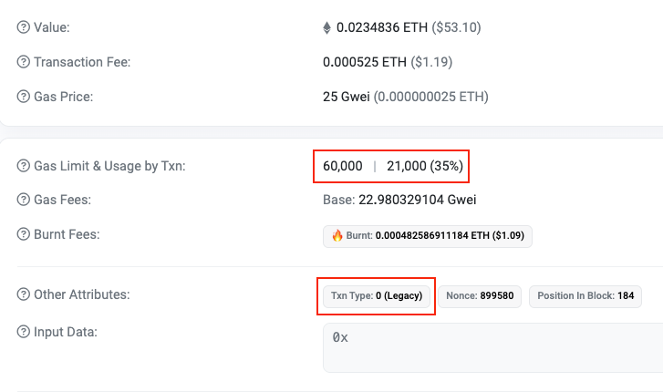
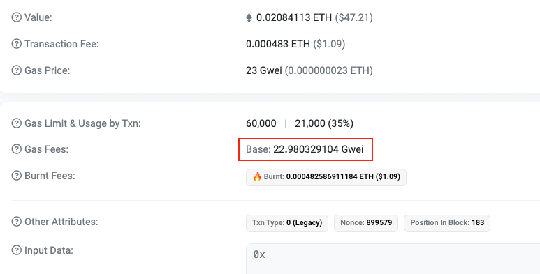
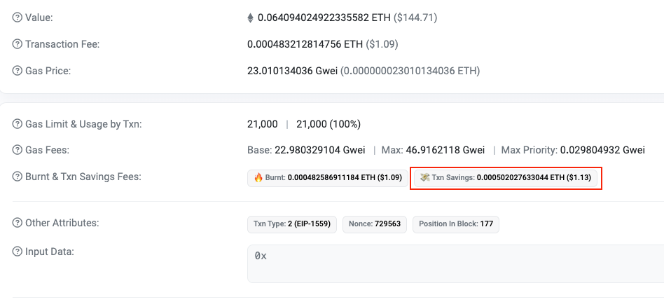
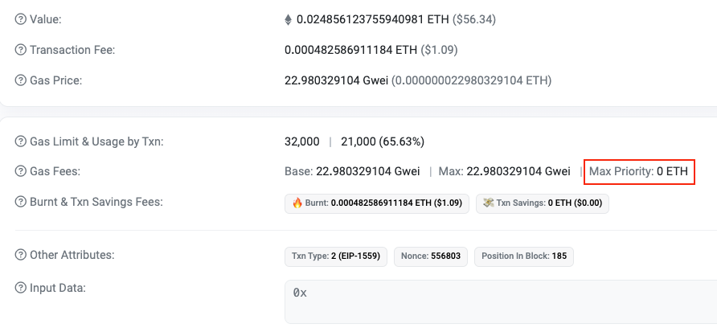

# Gas Price

**Author:** [Roman Yarlykov](https://github.com/rlkvrv) 🧐

This article explores the mechanisms for calculating and the components of gas price in the Ethereum blockchain, describes the historical development of these methods and their significance, and demonstrates how to calculate the cost of a transaction based on its gas expenses.

## Basic Concept

Gas is a unit of measurement for the amount of computational resources required to execute certain operations on the blockchain.

> Computational resources are the technical means of a computer, including the processor, volumes of RAM and external memory, and the time during which the program occupies these resources in the course of execution.

If we draw an analogy from the real world, gas acts like gasoline for a car (hinted by its name - "gas" from the word "gasoline").

In the world we are accustomed to, we do not usually pay for computational resources as a separate service. For example, in online banking, the bank takes on the costs of the computations performed on its servers. This is an example of a centralized system. In decentralized systems, users pay for operations that consume computational resources, as these operations directly serve their interests.

Gas not only serves as a measure of computational effort in the blockchain but also is a key tool for protection against spam and [DoS](https://en.wikipedia.org/wiki/Denial-of-service_attack) attacks. Since each operation in the network requires payment of gas, it becomes economically impractical for attackers to conduct mass and repetitive transactions with the aim of overloading the network. Block gas limits further restrict the scale of such attempts, making the attack prohibitively expensive and technically complex. This also encourages developers to write more efficient, clean, and optimized code, as more economical use of gas directly affects the reduction of operational expenses.

Finally, gas plays a key role in regulating supply and demand in the Ethereum blockchain. The price of gas is measured in Gwei per unit (example - 50 Gwei), and can significantly increase with high demand.

> Gwei is a denomination of the cryptocurrency ether (ETH), used in the Ethereum network for the purchase and sale of goods and services.



In Ethereum 1.0, this could lead to exorbitant transaction prices (how about the idea of paying $100-300 for buying USDT on Uniswap?).

## Calculation of Gas Fees in Ethereum 1.0

In Ethereum 1.0, each transaction included two key elements related to gas:

-   `gasPrice` - the price in ETH, specified in Gwei per unit of gas
-   `gasLimit` - the maximum amount of gas that a user is willing to pay in this transaction

Miners received a fixed reward for the block and all the fees for the used gas.

The fee for each transaction was calculated as follows:


```bash
    totalFee = gasPrice * gasUsed
```

where `gasUsed` denotes the actual amount of gas used. An explanation of what constitutes `gasUsed` is beyond the scope of this article, but it's important to mention that any unused gas (`gasLimit` - `gasUsed`) was returned to the transaction initiator, hence `gasUsed` was always less than or equal to `gasLimit`.


```bash
    gasUsed <= gasLimit
```

In this model, the user set the `gasPrice` themselves.

It looked like this:



_Note:_ The user could set the `gasPrice` to zero, and such a transaction could technically be included in a block, in which case the miner would only receive the fixed reward for the block.

In fact, `gasPrice` in Ethereum 1.0 was a key factor determining the speed of transaction inclusion in a block. Miners selected transactions based on a "**first-price auction**" system, where priority was given to those offering a higher gas fee. This created a risk of delays or even failure to include the transaction in a block, especially with a low proposed `gasPrice`.

This approach had several disadvantages:

-   **High fee volatility**: Gas prices often fluctuated, which did not reflect the real cost of processing transactions in the network.

-   **Delays in transaction processing**: Due to the limited gas limit per block, transactions could wait a long time to be included in the blockchain.

-   **Inefficiency of first-price auctions**: The system, where users indicated the maximum gas cost and miners chose the most profitable offers, was complex and inefficient.

-   **Overpayment for gas**: Complex mechanisms for estimating fees often led to unnecessary overpayment for gas.

These issues were raised in [EIP-1559](https://eips.ethereum.org/EIPS/eip-1559), as the basis for transitioning to a new model for calculating gas fees, which was implemented in the [London](https://ethereum.org/en/history#london) hard fork.

## Calculation of Gas Fees in Ethereum 2.0

EIP-1559 introduced a key innovation — **base fee**, which is a mandatory fee for each transaction.

This significantly changed the fee calculation model:

1. `base fee` is determined by the protocol and algorithmically adjusted depending on network congestion.
2. The block size became dynamic. It directly affects the `base fee` and helps regulate demand automatically. More about this can be found [here](https://ethereum.org/en/developers/docs/gas/#base-fee).
3. `base fee` is burned, rather than going to miners/validators, potentially making ether a deflationary currency.

> A deflationary cryptocurrency is a cryptocurrency with a decreasing total number of coins, which increases its value over time.

For miners, a new parameter was added — **priority fee** or tips, which motivate faster inclusion of transactions in the block. This parameter, expressed in Gwei, represents an additional reward for the miner for adding an individual transaction to the block. It is added to the basic reward for the entire block.

Now, with the introduction of **priority fee**, the auction still exists, but with a key difference: for miners, it's no longer as important how much gas a transaction consumes. The difference in gas costs between a simple ether transfer and deploying a smart contract has become less significant. Tips also provide an incentive for miners to include transactions in blocks, rather than leaving them empty. Moreover, the new model made gas pricing more predictable and less prone to volatility.

Another innovation is the **`maxFeePerGas`** parameter — the maximum amount a user is willing to pay for processing their transaction (similar to "price slippage" set during exchanges on DEXs to protect against price fluctuations of the asset). This parameter combines `base fee` and `priority fee`, providing protection for the user from fluctuations in `base fee`.

> Price slippage is the execution of a market order at a price different from the price indicated in the exchange order. This phenomenon is characteristic of any assets, including cryptocurrencies.

### New Gas Parameters in a Transaction

As a result, the structure of gas parameters in a transaction underwent the following changes:

1. **`maxPriorityFeePerGas`** (tips in Gwei per unit of gas) — a priority fee that goes to the validator, stimulating the rapid inclusion of the transaction in the block.
2. **`maxFeePerGas`** — the maximum amount in Gwei per unit of gas allocated for gas payment, including `base fee` and `maxPriorityFeePerGas`. Primarily protects against fluctuations in `base fee`.
3. **`gasLimit`** — the maximum amount of gas (in units of gas) that the user is willing to pay for executing this transaction.

Thus, the `gasPrice` field was removed from the transaction, and two new gas-related parameters were added instead. In effect, they split `gasPrice` into two parts - a mandatory fee to the protocol and tips for miners.

The `maxFeePerGas` parameter can be a bit confusing, so in Metamask, you won't see it; the wallet offers to set "Max base fee", and `maxFeePerGas` is calculated under the hood by the wallet, adding tips for the miner (Priority fee in Metamask).

In Metamask, you can choose the speed at which the transaction will be executed. The wallet itself calculates and suggests approximate parameters.



Let's analyze the screenshot on the right. We will calculate the prepayment required to execute the transaction. To pay for the transaction "at market" (Market), the wallet suggests the following values:

-   **Max base fee**: 34.5899 Gwei (Meanwhile, the real `base fee` is estimated by the system at 26 Gwei)
-   **Priority fee**: 0.1 Gwei (That is, this is the recommended size of the tips at the moment)
-   **Gas limit**: 21000 (This is the basic amount of gas sufficient for transferring ETH between two EOA accounts)

Let's calculate how much funds we need to deposit as a prepayment:


```bash
    prepay = maxFeePerGas * gasLimit
    prepay = (34.5899 + 0.1) * 21000 = 728487.9 Gwei
```

We can divide this number by 1 billion (to convert it to ETH) and multiply it by the price of ether in dollars to get the fee value in dollars. For example, if we take the price of ether at $2500, then:

```bash
    728487.9 Gwei / 1_000_000_000 = 0.0007284879 ETH
    0.0007284879 ETH * 2500$ = 1.82$
```

But since the real size of `base fee` is 26 Gwei (assuming it will be the same at the moment of transaction execution) and `gasUsed` in this case will be exactly 21000, the resulting price of the transaction will be calculated as follows:

```bash
    totalFee = (base fee + maxPriorityFeePerGas) * gasUsed

    totalFee = (26 + 0.1) * 21000 = 548100 Gwei

    548100 Gwei / 1_000_000_000 * 2500$ = 1,37$
```

This means that by signing the transaction you will approve $1.82, but in fact, the transaction will cost $1.37, so $0.45 will be returned to your account.

### Metamask Advanced

You can manually set all parameters in "Advanced" mode.



This mode allows you to set the three parameters we have already discussed above: "Max base fee", "Priority fee", and "Gas limit".

_Important!_ To reiterate, this is a simplification. `maxFeePerGas` will consist of "Max base fee" + "Priority fee". Therefore, indirectly, you can also set the `maxFeePerGas` transaction parameter.

As seen in the screenshot, the wallet thoughtfully indicates if you are setting parameters that are not quite reasonable. This could lead to transaction failure or a significant overpayment of the fee. Therefore, this mode is called "Advanced". It is designed only for advanced users.

Current gas prices can be viewed on [etherscan.io](https://etherscan.io/gastracker#chart_gasprice) for Ethereum and similar services for other networks.



Approximate values here are calculated in a similar way. Note that the value in Gwei already includes the base fee and priority fee. Thus, to know what fee you will pay in ETH, simply multiply the amount of gas consumed by the transaction by this figure. To solidify this, I will show this calculation again, but using data from etherscan.

For example, for an ETH transfer, it would look like this:


```bash
    totalFee = 25 Gwei * 21000 gas = 525000 Gwei
```

If we want to get the value in ETH, we just need to divide by 1 billion.

```bash
    525000 Gwei / 1_000_000_000 = 0.000525 ETH
```

Actually, to get the price in dollars, you just need to multiply by the current ETH rate. At the time of writing, it equals $2253.

```bash
    0.000525 ETH * 2253$ ≈ $1.18$
```

The complete formula will be as follows:

```bash
    totalFeeInUsd = gasPrice * gasUsed / 1_000_000_000 * ethPriceInUsd
```

### Types of Transactions in Ethereum

As of now, there are 3 types of transactions in Ethereum:

1. **Type 0**. Old format transactions (Legacy). They have a `gasPrice` field.
2. **Type 1**. Transactions including an "access list." More details [here](https://eips.ethereum.org/EIPS/eip-2930).
3. **Type 2**. New format transactions (EIP-1559). They use `maxPriorityFeePerGas` and `maxFeePerGas` instead of `gasPrice`.

In this context, types 0 and 2 are of interest to us. To maintain backward compatibility, EIP-1559 does not eliminate old format transactions (Legacy transactions type 0, where only `gasPrice` and `gasLimit` were specified).

When a Legacy transaction enters the mempool, the entire `gasPrice` specified in it is used, but from it, the **base fee** is deducted and burned, and the remaining amount becomes the **priority fee**. Although technically only the **base fee** is sufficient for a transaction to be executed, without a sufficient **priority fee**, the transaction is unlikely to be included in a block, especially if there are more profitable offers. In the case of Legacy transactions, it is crucial to accurately calculate the fee to avoid a shortage of funds to cover the **base fee**.

_Important!_ The **base fee** is burned by the protocol regardless of the type of transaction.

In the case of type 2 transactions (EIP-1559), users do not have to worry about the size of the **base fee** (the network itself will suggest a suitable value, just indicate its maximum value) while setting very low **priority fees.** In periods of low demand, this approach can work, as miners may include even transactions with very low tips or none at all in the block to fill it.

Let's look at some examples.

### Legacy Transaction (Type 0)



This screenshot shows a standard ETH transfer. In the "Other Attributes" field, you can see that the transaction type is Legacy (type 0). In this transaction, the user "played it safe":

-   gasPrice set at 25 Gwei
-   gasLimit 60,000 (although only 21000 is always used for ETH transfers)

The base fee equals 22.980329104 Gwei, for convenience let's round it to 23 Gwei. Thus, 23 Gwei were burned, and all that remained, 25 - 23 = 2 Gwei per unit of gas, constitutes the validator's tips.

### Legacy Transaction with Minimum Priority Fee (Type 0)



In this transaction, the user set the `gasPrice` to just 23 Gwei, which is risky because 22.98 Gwei was burned, and the miner received only 0.02 Gwei per unit of gas.

_Fun Fact:_ Both these transactions were executed in the same block, side by side.

### EIP-1559 Transaction (Type 2)

Let's move to EIP-1559 transactions. They are much more interesting.



If we look at the parameters related to gas in the transaction:

-   `Max priority fee` set by the transaction initiator is 0.029804932 Gwei
-   `Max base fee` is 46.9162118 Gwei
-   `gasLimit` is the standard 21000 Gwei

Here, the `base fee` is set with a double margin, but the `maxPriorityFeePerGas` is quite modest, at 0.03 Gwei per unit of gas.

Note that in the "Burnt & Txn Savings Fees" field of this type of transaction, there is also "Txn Savings," which are the funds returned to the user because they were not used in the transaction.

### EIP-1559 Transaction Without Priority Fee (Type 2)



The last example for today. Notice anything? Yes, the **priority fee** is zero. Moreover, the `base fee` is set perfectly accurately, so there was no need for a refund.

_Fun Fact #2:_ The third transaction is from the same block as the previous two.

It is important to note that the `base fee` is burned in all types of transactions, regardless of their format. To observe the process of ETH burning in real-time, you can use the resource [beaconcha.in/burn](https://beaconcha.in/burn).

## Conclusion

Although gas pricing is now largely automated, users still bear responsibility for their transactions, as this is a principle of decentralization. The ability to cancel a transaction when gas prices are high or to increase the fee to speed it up remains with the user. But one must be careful; there have been cases where transactions were [unimaginably overpaid](https://decrypt.co/207263/bitcoin-sender-overpays-record-breaking-3-million-transaction-fee) by mistake.

