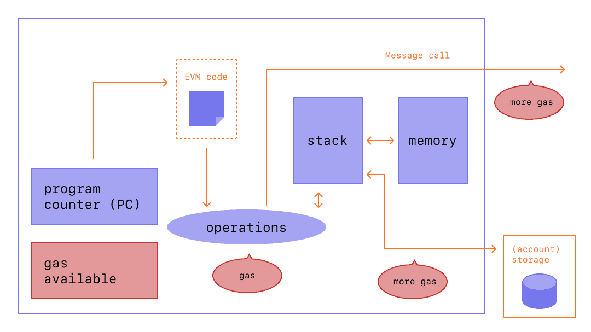
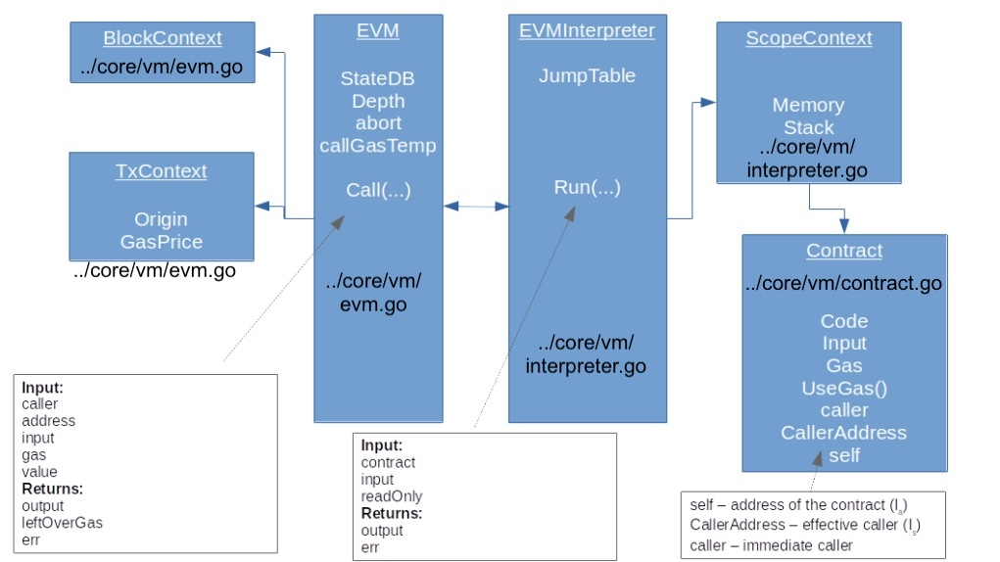

# Gas Used Part 1: Overview

**Author:** [Roman Yarlykov](https://github.com/rlkvrv) 🧐

## TL;DR

In the first part of our article about the mechanisms of gas usage in Ethereum, we will focus on the general principles of gas calculation at the transaction level. This will provide a foundation for understanding how gas is used and calculated in the Ethereum blockchain. In the second part, we will delve into aspects of working with smart contract storage, examining them in the context of gas calculations.

## Introduction

The execution of a transaction in Ethereum depends on the available gas: at its initiation, `gasLimit` is set, determining the maximum amount of gas that can be used. Based on `gasLimit`, a prepayment in ETH is calculated and deducted from the user's account before the start of the transaction. The actual gas spent is reflected in `gasUsed`. If gas consumption exceeds `gasLimit`, the following occurs:

-   An "out of gas" error is raised.
-   The state of the smart contract is reverted to the moment before the transaction execution.
-   The prepayment for computations in ETH is not refunded, as it has already been fully utilized to cover gas costs.

In this article, we will analyze in detail the components of `gasUsed`, based on which it is calculated how much ETH should be returned if `gasLimit` was higher than the actual gas spent. Also, considering `gasUsed`, the protocol calculates the remaining amount of gas in the block for processing subsequent transactions.

## The Role of Gas in Blockchain

To understand the mechanism of gas, it's important to realize why it was introduced. EVM (Ethereum Virtual Machine) is Turing-complete, allowing it to perform any computation, including infinite loops. These computations include executing transactions that change the state of the blockchain. A fee was introduced to reward network participants involved in verifying transactions. The fee also acts as a regulatory mechanism, preventing abuses in blockchain operations.

The size of the fee is always set by the sender of the transaction, and they can make it zero if they choose, but whether other network participants will accept such a transaction is another matter.

## Gas in Ethereum

Bitcoin processes transactions by changing user balances during BTC transfers. In Ethereum, in addition to changing ETH balances, computations on smart contracts are performed, which can require significant resources. Therefore, before processing a transaction, it's important to estimate its gas consumption.

Let's consider a canonical scheme illustrating gas expenditure in Ethereum.


From the presented scheme, it's evident that each computational operation and interaction with memory in the Ethereum network requires a certain amount of gas.

To better understand this issue, we need [Ethereum Yellow Paper](https://ethereum.github.io/yellowpaper/paper.pdf), sections 6, 8, and 9, as well as the source code of the main Ethereum client [Go-Ethereum](https://github.com/ethereum/go-ethereum) (geth), located in the directory [go-ethereum/core/vm/](https://github.com/ethereum/go-ethereum/tree/576681f29b895dd39e559b7ba17fcd89b42e4833/core/vm).

Firstly, I strongly recommend familiarizing yourself with [the first part](https://leftasexercise.com/2021/09/12/understanding-the-ethereum-virtual-machine-part-i/) of a series of articles on EVM structure, where the process of preparing a transaction for execution in EVM and the involved code blocks are detailed.

Important! _The article reviews version 1.10.6 of the client; currently, the code has changed slightly, but the main structure and methods have been preserved_.

To understand the workings of Ethereum, let's examine the key blocks of code in the geth repository, as shown in this image:



-   The main EVM entities, such as BlockContext and TxContext, are located in the file [evm.go](https://github.com/ethereum/go-ethereum/blob/1010a79c7cbcdb4741e9f30e8cdc19c679ad7377/core/vm/evm.go).
-   EVMInterpreter and ScopeContext are in the file [interpreter.go](https://github.com/ethereum/go-ethereum/blob/1010a79c7cbcdb4741e9f30e8cdc19c679ad7377/core/vm/interpreter.go).
-   The `Contract` class is placed in [contract.go](https://github.com/ethereum/go-ethereum/blob/1010a79c7cbcdb4741e9f30e8cdc19c679ad7377/core/vm/contract.go).

Next, we will look more closely at two main functions of EVM: `Call()` and `Run()`, while dissecting the code associated with these functions.

### Function Call

The main function describing transaction execution in the yellow paper is the theta (Θ) function, found in section 8:

, where

-   **System State (σ')**: The current state of the entire Ethereum blockchain system, including all accounts and their states;
-   **Remaining Gas (g')**: The amount of gas remaining after execution;
-   **Accumulated Substate (A')**: This is the sum of temporary changes in the blockchain state resulting from transaction execution. It includes such things as the creation of new accounts, balance changes, etc.;
-   **Return Value of Smart Contract Function (z)**: The return value is used by the calling smart contract or external call to obtain information about the result of the function execution;
-   **Return Value of the Call (o)**: The transaction's output, which usually represents logs or events generated during execution.

The following arguments must be passed to the function:

-   **σ,A** - Current state and substate
-   **s** (msg.sender) - Sender's address
-   **o** (tx.origin) - Initiator's address of the transaction
-   **r** (recipient) - Recipient's address
-   **c** (contract) - Address of the account whose code should be executed
-   **g** (gas) - Available amount of gas for execution
-   **p** (price) - Gas price
-   **v** (value) - Amount of ether in wei transferred from the calling smart contract to the called smart contract
-   **ṽ** - Amount of ether in wei provided in the context of DELEGATECALL execution but not actually transferred
-   **d** (data) - Byte array of data, which is the input of the call
-   **e** - Depth of the call/contract creation stack
-   **w** - Boolean flag indicating the possibility of making changes in the state

Thus, this function contains all the attributes of BlockContext, TxContext, EVM (see the scheme above) and is implemented by the [Call()](https://github.com/ethereum/go-ethereum/blob/576681f29b895dd39e559b7ba17fcd89b42e4833/core/vm/evm.go#L167) function in geth.

The `Call()` function contains a lot of logic, so for simplicity, we will break it down into three blocks, also removing auxiliary functionality.

#### Preparing for Transaction Execution

Before executing the transaction, input data is validated to prevent potential problems.


```go
// Call executes the contract at address addr, using the passed data as parameters.
// The function also manages necessary fund transfers and account creation, as well as
// restoring the previous state in case of execution error or failed fund transfer.

func (evm *EVM) Call(caller ContractRef, addr common.Address, input []byte, gas uint64, value *big.Int) (ret []byte, leftOverGas uint64, err error) {
	// Cease execution if the call depth exceeds the established limit

	if evm.depth > int(params.CallCreateDepth) {
		return nil, gas, ErrDepth
	}
	// Reject if trying to transfer an amount greater than the available balance
	if value.Sign() != 0 && !evm.Context.CanTransfer(evm.StateDB, caller.Address(), value) {
		return nil, gas, ErrInsufficientBalance
	}
	snapshot := evm.StateDB.Snapshot()
	p, isPrecompile := evm.precompile(addr)
	debug := evm.Config.Tracer != nil

	if !evm.StateDB.Exist(addr) {
		if !isPrecompile && evm.chainRules.IsEIP158 && value.Sign() == 0 {
			// If the called account does not exist and it's not a precompiled contract,
			// then do nothing

            // ... debugger logic

			return nil, gas, nil
		}
		evm.StateDB.CreateAccount(addr)
	}

    // ...
```

**In this block of code, the function performs the following logic:**

1. Checks that the stack depth is not exceeded (currently 1024);
2. Checks that the sender has enough Ether for the transfer;
3. Makes a snapshot of the state to which it can return if something goes wrong during the transaction execution;
4. Checks whether the recipient's address exists. If not, the address is added to the Ethereum database;

#### Modifying ETH Balances, Executing Code

The main block performs the modification of the balances of the sender and recipient. If this is a call to a precompiled smart contract, the corresponding code is executed. Otherwise, a new smart contract is initialized, and the code is executed by the EVM, calling the `Run()` function, then the results, remaining gas, and error information are returned.

> **Precompiled smart contracts** are Ethereum smart contracts that implement complex and cryptographic operations, the logic of which is natively implemented in the geth client code, rather than in the EVM smart contract code.


```go
func (evm *EVM) Call(caller ContractRef, addr common.Address, input []byte, gas uint64, value *big.Int) (ret []byte, leftOverGas uint64, err error) {
    // ...

    // transfer of ETH
    evm.Context.Transfer(evm.StateDB, caller.Address(), addr, value)

	// logic of the debugger
	if isPrecompile {
		ret, gas, err = RunPrecompiledContract(p, input, gas)
	} else {
		// Initializing a new contract and setting the code for EVM execution.

		// The contract creates an isolated environment for the current execution context.
		code := evm.StateDB.GetCode(addr)
		if len(code) == 0 {
			ret, err = nil, nil // Количество газа не меняется
		} else {
			addrCopy := addr
			// If the account has no code, halt execution
			// Call depth and precompiled contracts have already been checked
			contract := NewContract(caller, AccountRef(addrCopy), value, gas)
			contract.SetCallCode(&addrCopy, evm.StateDB.GetCodeHash(addrCopy), code)
			ret, err = evm.interpreter.Run(contract, input, false)
			gas = contract.Gas
		}
	}

    // ...
}
```

**The execution steps are as follows:**

5. Transfers Ether to the recipient's address;
6. Calls precompiled contracts if necessary;
7. Executes the smart contract code if there are data for invocation in the smart contract. For this, the `Run()` function of the interpreter is called;

#### Processing Transaction Execution Results

In the final step, the function processes errors if there are any.

```go
func (evm *EVM) Call(caller ContractRef, addr common.Address, input []byte, gas uint64, value *big.Int) (ret []byte, leftOverGas uint64, err error) {
    // ...

	// In case of an error, revert to the saved state snapshot and annul the remaining gas.
	// The only exception is a "revert" type error, in which case the remaining gas is returned.

	if err != nil {
		evm.StateDB.RevertToSnapshot(snapshot)
		if err != ErrExecutionReverted {
			gas = 0
		}
	}
	return ret, gas, err
}
```

**Remaining logic executed by Call():**

8. Returns the remaining gas after execution;
9. Handles errors, if any exist.

The key point for us is the gas remaining after the call to `Run()` from `Call()`. Remember, before executing, the `Call()` function receives all available gas (`gasLimit`). How this gas is used within the `Run()` function will be examined later. The logic for returning the remaining gas at the end of `Call()` execution is as follows:

-   If the execution of the `Run()` function is successful and does not cause errors, then the value, error code, and remaining gas are returned;
-   If `Run()` returns a special error code indicating execution cancellation (a `revert` occurred), then we restore the state to the previous snapshot;
-   If the error code returned by `Run()` is different from `revert`, we also restore the state to the previous snapshot, but set the `gas` variable to 0. This means that any error other than `revert` will consume all available gas. You can see what other errors exist [here](https://github.com/ethereum/go-ethereum/blob/1010a79c7cbcdb4741e9f30e8cdc19c679ad7377/core/vm/errors.go#L25C1-L25C4).

### The Run Function

The entry point for executing smart contract code is the [Run()](https://github.com/ethereum/go-ethereum/blob/576681f29b895dd39e559b7ba17fcd89b42e4833/core/vm/interpreter.go#L118) function. It is called if a transaction contains a smart contract call. A detailed description of the `Run()` function can be found in section 9.3 of the yellow paper:


The Ξ (Xi) function takes the current system state **(σ)**, available gas **(g)**, accumulated substate **(A)**, and information tuple **(I)**.

It returns the new system state **(σ')** after executing the code, remaining gas **(g')**, accumulated substate **(A')**, and execution output data **(o)**.

The tuple **I** contains parameters that we have already seen earlier in the theta function plus several additional ones:

-   **I<sub>a</sub>** - address of the account owning the executing code (`address(this)`);
-   **I<sub>o</sub>** - address of the transaction initiator (`tx.origin`);
-   **I<sub>p</sub>** - gas price paid by the initiator of the transaction (`gasPrice`);
-   **I<sub>d</sub>** - byte array that is the input data for this execution (`data`);
-   **I<sub>s</sub>** - address of the account that directly called the current function (`msg.sender`);
-   **I<sub>v</sub>** - amount of Ether in wei passed from the calling smart contract to the called smart contract (`value`);
-   **I<sub>b</sub>** - byte array that is the machine code to be executed (`bytes`);
-   **I<sub>H</sub>** - current block header;
-   **I<sub>e</sub>** - depth of the current stack of message calls or contract creations (i.e., the number of `CALL` or `CREATE` currently being executed)
-   **I<sub>w</sub>** - permission to modify the state (`bool`).

The `Run` function in the context of the EVM (Ethereum Virtual Machine) interpreter is a key part of the process of executing smart contracts in Ethereum. Here are the main aspects of its operation:

1. **Initialization and Preparation:**

    - Increments the call depth (limited to 1024) to track the nesting of transactions. The call depth is managed by `callStack`, which is another type of memory in the EVM, increasing with the call to another account and decreasing upon return of values.
    - Sets "read-only" mode, if not already set, to prevent state changes in certain scenarios.
    - Resets the data returned by the previous call, as each new call will return its own data.

2. **Contract Code Check:**

    - If the contract code is empty, the function ends without performing any actions.

3. **Execution Loop:**

    - In the loop, the function processes each instruction (operation) in the contract code. The loop continues until a stop (`STOP`), return (`RETURN`), or self-destruct (`SELFDESTRUCT`) instruction is executed, an error occurs, or a termination flag is set by the parent context.

4. **Gas Calculation:**

    - Calculates and deducts the gas cost for the static part of the operation.
    - Expands memory and calculates additional gas cost for operations requiring extra memory.

5. **Handling Each Instruction:**

    - Determines the current operation (instruction) and checks if there are enough elements in the stack for its execution.
    - Checks if the operation exceeds the maximum stack size.
    - In "read-only" mode, the function ensures that no state-changing operations are executed.

6. **Operation Execution:**

    - Executes the operation and updates the program counter.
    - If the operation returns data, updates the return data buffer.

7. **Result Processing:**

    - In case of an error or if the operation requires the transaction to be reverted, the function returns an error and the result of the operation.
    - In case of successful completion, the function returns the result of the operation.

8. **Tracing and Debugging:**
    - If debugging mode is enabled, the function records the state before and after each operation for tracing purposes.

For us, points 3 to 6 are important. Before moving on to them, let's take a look at the [contract.go](https://github.com/ethereum/go-ethereum/blob/1010a79c7cbcdb4741e9f30e8cdc19c679ad7377/core/vm/contract.go) file. In the `Contract` object, there are fields `Code`, `Input`, and `Gas`, used during the execution of the contract code, and it is this object that the `Run()` function receives as an argument.


```go
// Contract contains the contract code, call arguments
type Contract struct {
	// CallerAddress is the address of the caller who initiated this
	// contract. However, when the call method is delegated, this value
	// needs to be initialized with the address of the one who called the caller.
	CallerAddress common.Address
	caller        ContractRef
	self          ContractRef

	jumpdests map[common.Hash]bitvec // Aggregated result of JUMPDEST analysis.
	analysis  bitvec                 // Locally cached result of JUMPDEST analysis.

	Code     []byte          // Contract code.
	CodeHash common.Hash     // Hash of the contract code.
	CodeAddr *common.Address // Address of the contract code.
	Input    []byte          // Input data.

	Gas   uint64    // Gas for contract execution.
	value *big.Int  // Value transferred to the contract.
}
```

#### Execution Loop

For a detailed examination of the `Run()` function, I recommend studying its full code in the [repository](https://github.com/ethereum/go-ethereum/blob/576681f29b895dd39e559b7ba17fcd89b42e4833/core/vm/interpreter.go#L118) of geth. Let's move directly to the execution loop.

The loop sequentially executes operations from the `Code[]` array. This process continues until all operations are performed, or until the gas runs out, provided that the execution occurs without other errors.


```go
// Run executes the contract code with input data and returns
// the result as a byte array and an error, if it occurred.
//
// It is important to note that any errors returned by the interpreter should
// be considered as an "abort and consume all gas" operation, except for
// ErrExecutionReverted, which means "abort and preserve remaining gas".

func (in *EVMInterpreter) Run(contract *Contract, input []byte, readOnly bool) (ret []byte, err error) {
    // ...

	// Defining variables for code execution
	var (
		op          OpCode        // current operation
		mem         = NewMemory() // allocated memory
		stack       = newstack()  // local stack
		callContext = &ScopeContext{ // call context
			Memory:   mem,
			Stack:    stack,
			Contract: contract,
		}
		// Using uint64 as a program counter for optimization.
		// Theoretically, it could exceed 2^64, but this is unlikely in practice.
		pc   = uint64(0) // program counter
		cost uint64      // operation cost
		// copies for the tracer
		pcCopy  uint64 // needed for deferred tracing
		gasCopy uint64 // for tracing remaining gas before execution
		logged  bool   // tracer should ignore already logged steps
		res     []byte // result of the operation execution
	)

	// Service functionality, removed, as it is not relevant for our analysis
    // ...

	// The main execution loop of the interpreter. The loop continues until an explicit STOP,
	// RETURN or SELFDESTRUCT, an error occurs, or the parent context sets the done flag.
	steps := 0
	for {
        // ...

		// We get the operation from the transition table and check the stack for a sufficient number of elements.
		op = contract.GetOp(pc)
		operation := in.cfg.JumpTable[op]
		if operation == nil {
			return nil, &ErrInvalidOpCode{opcode: op}
		}
		// Stack check
		if sLen := stack.len(); sLen < operation.minStack {
			return nil, &ErrStackUnderflow{stackLen: sLen, required: operation.minStack}
		} else if sLen > operation.maxStack {
			return nil, &ErrStackOverflow{stackLen: sLen, limit: operation.maxStack}
		}
		// If the operation is permissible, we apply write restrictions
		if in.readOnly && in.evm.chainRules.IsByzantium {
			// In readOnly mode, we prohibit any operations that change the state.
			// Transferring values between accounts changes the state and should cause an error.
			if operation.writes || (op == CALL && stack.Back(2).Sign() != 0) {
				return nil, ErrWriteProtection
			}
		}

        // ...
	}
}
```

-   Initialization of all necessary variables occurs before execution;
-   Retrieve all operations of the current execution from the [JumpTable](https://github.com/ethereum/go-ethereum/blob/576681f29b895dd39e559b7ba17fcd89b42e4833/core/vm/jump_table.go);
-   Check the stack for overflow;
-   Check for restrictions on state changes.

#### Gas Calculation and Working with Memory

For each operation, the amount of gas consumed is accounted for, and the necessary amount of temporary memory (memory) is allocated. We will examine the static and dynamic parts of the gas consumption in more detail a bit later.

```go
func (in *EVMInterpreter) Run(contract *Contract, input []byte, readOnly bool) (ret []byte, err error) {
    // ...

	// Static part of the gas
	cost = operation.constantGas // For tracing
	if !contract.UseGas(operation.constantGas) {
		return nil, ErrOutOfGas
	}

	var memorySize uint64
	// Calculating the new memory size and expanding memory for the operation
	if operation.memorySize != nil {
		memSize, overflow := operation.memorySize(stack)
		if overflow {
			return nil, ErrGasUintOverflow
		}
		if memorySize, overflow = math.SafeMul(toWordSize(memSize), 32); overflow {
			return nil, ErrGasUintOverflow
		}
	}

    // Dynamic part of the gas
	if operation.dynamicGas != nil {
		var dynamicCost uint64
		dynamicCost, err = operation.dynamicGas(in.evm, contract, stack, mem, memorySize)
		cost += dynamicCost // total cost for tracing
		if err != nil || !contract.UseGas(dynamicCost) {
			return nil, ErrOutOfGas
		}
	}

	if memorySize > 0 {
		mem.Resize(memorySize)
	}

    // ...
}

-   Consumption of the static part of the gas;
-   Consumption of the dynamic part of the gas;
-   Allocating memory for operations.

This is what the `UseGas` function looks like, which consumes gas from the `Gas` field of the aforementioned `Contract` object and returns a boolean flag. If the gas runs out, the transaction execution is terminated.

```go
func (c *Contract) UseGas(gas uint64) (ok bool) {
	if c.Gas < gas {
		return false
	}
	c.Gas -= gas
	return true
}
```

#### Operation Execution

The execution of an operation is handled by just one line of code in the `Run()` function.

```go
func (in *EVMInterpreter) Run(contract *Contract, input []byte, readOnly bool) (ret []byte, err error) {
    // ...

    // Operation Execution
	res, err = operation.execute(&pc, in, callContext)

    // ...
}
```

The `operation` object contains a function responsible for executing the current operation, and such functions can be found in [instructions.go](https://github.com/ethereum/go-ethereum/blob/master/core/vm/instructions.go).

These functions represent EVM opcodes. For example, here's what the addition and subtraction functions look like, corresponding to the [ADD](https://arc.net/l/quote/msbqghdy) and [SUB](https://arc.net/l/quote/txchdgum) opcodes:


```go
func opAdd(pc *uint64, interpreter *EVMInterpreter, scope *ScopeContext) ([]byte, error) {
	x, y := scope.Stack.pop(), scope.Stack.peek()
	y.Add(&x, y)
	return nil, nil
}

func opSub(pc *uint64, interpreter *EVMInterpreter, scope *ScopeContext) ([]byte, error) {
	x, y := scope.Stack.pop(), scope.Stack.peek()
	y.Sub(&x, y)
	return nil, nil
}
```

#### Result Processing

In the final part of the process, after processing the execution results, there is a transition to the next iteration of the loop, or an error is returned, or the execution process is completed.

```go
func (in *EVMInterpreter) Run(contract *Contract, input []byte, readOnly bool) (ret []byte, err error) {
    // ...
    {
    // ...

	// if the operation clears the return data (e.g., if there are data to be returned),
	// set the last return to the result of the operation.
        if operation.returns {
            in.returnData = common.CopyBytes(res)
        }

        switch {
        case err != nil:
            return nil, err
        case operation.reverts:
            return res, ErrExecutionReverted
        case operation.halts:
            return res, nil
        case !operation.jumps:
            pc++
        }
	}
	return nil, nil
}
```

Functions that perform stack operations can be viewed [here](https://github.com/ethereum/go-ethereum/blob/v1.11.5/core/vm/stack.go).

For a better understanding of what happens in the `Run()` function, read [this](https://medium.com/@deliriusz/dissecting-evm-using-go-ethereum-eth-client-implementation-part-iii-bytecode-interpreter-8f144004ed7a) article. Additionally, [the second part](https://leftasexercise.com/2021/09/15/understanding-the-ethereum-virtual-machine-part-ii/) of the series of articles about the structure of the EVM is also worth reading.

### Static and Dynamic Gas

During the execution of operations in the `Run()` function, gas is consumed through the call to `contract.UseGas()`, thereby decreasing the `Gas` variable in the `Contract` object. A lack of gas leads to an "out of gas" error.

Gas consumption during the execution of smart contract code can be divided into **static** and **dynamic** parts. Static gas has a fixed cost written in a constant, while dynamic gas depends on factors such as memory consumption.

_Important!_ The static gas used in the context of operations should not be confused with the intrinsic gas charged per transaction. Although it can also be referred to as static, it will be discussed separately.

#### Static Gas

This is the gas that is predetermined by the protocol for each operation. The `operation.constantGas` variable is used to consume static gas.

Let's return to the `Run()` function in [interpreter.go](https://github.com/ethereum/go-ethereum/blob/576681f29b895dd39e559b7ba17fcd89b42e4833/core/vm/interpreter.go#L118):


```go
// Run function
{
	// Static portion of gas
	cost = operation.constantGas
	if !contract.UseGas(operation.constantGas) {
		return nil, ErrOutOfGas
	}
}
```

We have previously referred to the file [jump_table.go](https://github.com/ethereum/go-ethereum/blob/master/core/vm/jump_table.go) and the `operation` object in the context of executing an operation (opcode). Let's return to it and examine it in more detail:

```go
type operation struct {
	execute     executionFunc     // execute is the function for executing the operation.
	constantGas uint64            // Fixed amount of gas used by the operation.
	dynamicGas  gasFunc           // Function for calculating dynamic gas.
}

    // ...
}
```

In addition to `executionFunc`, which we discussed earlier, we see variables related to gas:

-   `constantGas` - as the name suggests, this is a constant defined for each operation;
-   `dynamicGas` - this is a function that is calculated each time a particular operation is executed.

Each operation has a predefined `constantGas` variable (file [jump_table.go](https://github.com/ethereum/go-ethereum/blob/master/core/vm/jump_table.go)):

```go
    /// ...
	ADD: {
		execute:     opAdd,
		constantGas: GasFastestStep,
		minStack:    minStack(2, 1),
		maxStack:    maxStack(2, 1),
	},
	SUB: {
		execute:     opSub,
		constantGas: GasFastestStep,
		minStack:    minStack(2, 1),
		maxStack:    maxStack(2, 1),
	},
    /// ...
```

Such variables can be found in the file [gas.go](https://github.com/ethereum/go-ethereum/blob/master/core/vm/gas.go#L26), here they are:

```go
const (
	GasQuickStep   uint64 = 2
	GasFastestStep uint64 = 3
	GasFastStep    uint64 = 5
	GasMidStep     uint64 = 8
	GasSlowStep    uint64 = 10
	GasExtStep     uint64 = 20
)
```

#### Dynamic Gas

The variable responsible for dynamic gas is a function that calculates the amount of gas consumed based on memory (`memory` or `storage`) usage, stack size, and other factors.

In the code, it looks like this ([interpreter.go](https://github.com/ethereum/go-ethereum/blob/576681f29b895dd39e559b7ba17fcd89b42e4833/core/vm/interpreter.go#L118)):


```go
// Run function
{
    // Dynamic part of the gas
    if operation.dynamicGas != nil {
    	var dynamicCost uint64
    	dynamicCost, err = operation.dynamicGas(in.evm, contract, stack, mem, memorySize)
    	cost += dynamicCost // total cost for tracing
    	if err != nil || !contract.UseGas(dynamicCost) {
    		return nil, ErrOutOfGas
    	}
    }
}
```

First, you can return again to [jump_table.go](https://github.com/ethereum/go-ethereum/blob/830f3c764c21f0d314ae0f7e60d6dd581dc540ce/core/vm/jump_table.go#L198) to see what constitutes the `instructionSet`. In it, the `dynamicGas` function is defined for each separate operation (not all operations have such a function):

```go
instructionSet[RETURNDATACOPY] = &operation{
	execute:     opReturnDataCopy,
	constantGas: GasFastestStep,
	dynamicGas:  gasReturnDataCopy,
	minStack:    minStack(3, 0),
	maxStack:    maxStack(3, 0),
	memorySize:  memoryReturnDataCopy,
}
```

Functions that determine the dynamic gas for various operations are located in the file [gas_table.go](https://github.com/ethereum/go-ethereum/blob/master/core/vm/gas_table.go#L29). For example, for the opcode `RETURNDATACOPY`, the corresponding function is `gasReturnDataCopy`. I recommend familiarizing yourself with this file for a better understanding of how such functions are structured.

Important points in working with memory and gas in EVM:

1. **Stack:** This is the most economical type of memory with a limit of 1024 elements. This limit is part of the protocol, although technically it is possible to handle more elements.
2. **Temporary Memory (Memory):** The gas cost for using temporary memory in the EVM increases quadratically relative to its size. Therefore, the larger the volume of `memory` used in executing operations, the higher the cost. However, it is still cheaper than using `storage`.
3. **Permanent Memory (Storage):** This is the most expensive type of memory in the EVM, as data in `storage` are written to the StateDB — the global blockchain database, which must be decentralized and stored by all network participants. There are specific nuances in the gas consumption when working with `storage`, which we will examine more closely in the second part of the article.

## Links

-   [Article: Understanding the Ethereum virtual machine – part I](https://leftasexercise.com/2021/09/12/understanding-the-ethereum-virtual-machine-part-i/)
-   [Article: Understanding the Ethereum virtual machine – part II](https://leftasexercise.com/2021/09/15/understanding-the-ethereum-virtual-machine-part-ii/)
-   [Article: Understanding the Ethereum virtual machine – part III](https://leftasexercise.com/2021/09/19/q-understanding-the-ethereum-virtual-machine-part-iii/)
-   [Article: Dissecting EVM using go-ethereum Eth client implementation. Part III — bytecode interpreter](https://medium.com/@deliriusz/dissecting-evm-using-go-ethereum-eth-client-implementation-part-iii-bytecode-interpreter-8f144004ed7a)
-   [Doc: Ethereum Yellow Paper](https://ethereum.github.io/yellowpaper/paper.pdf)
-   [Code: Go-Ethereum](https://github.com/ethereum/go-ethereum)
